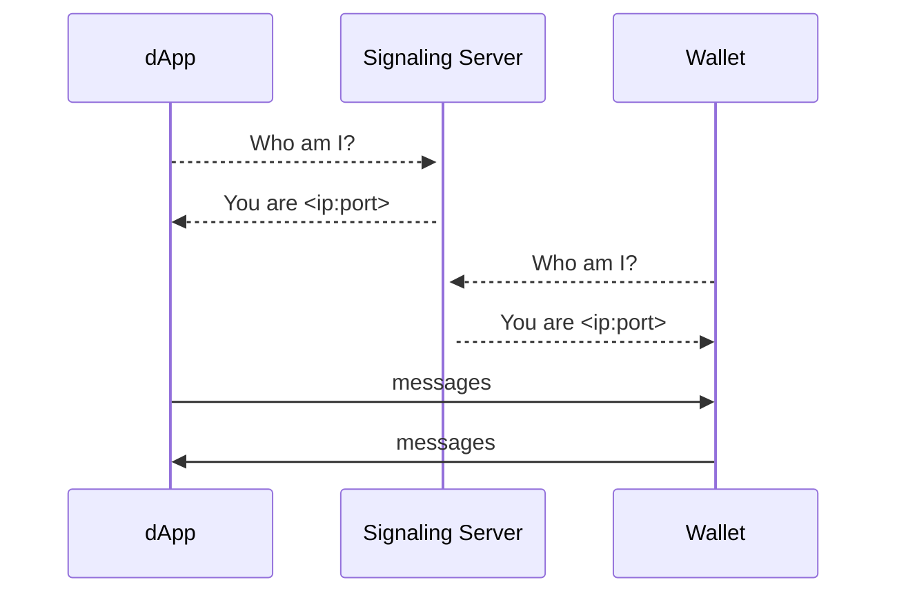
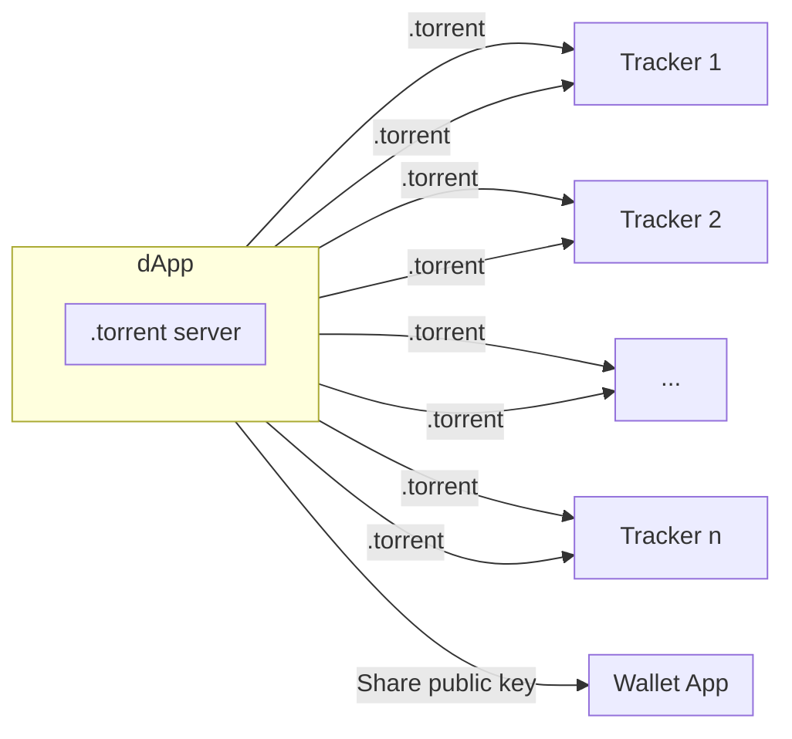
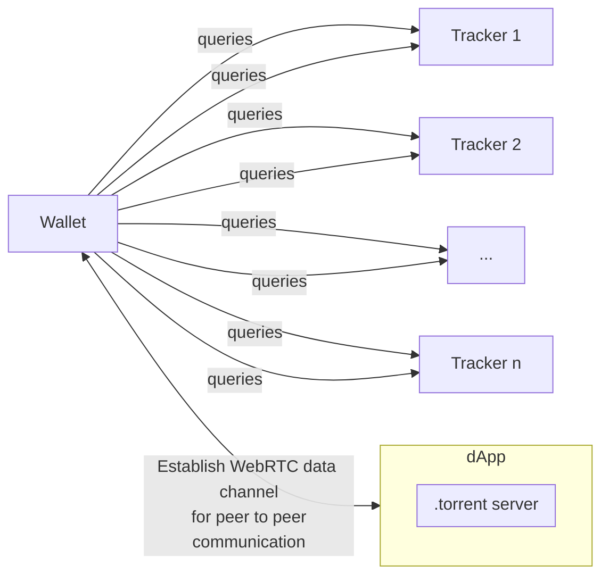
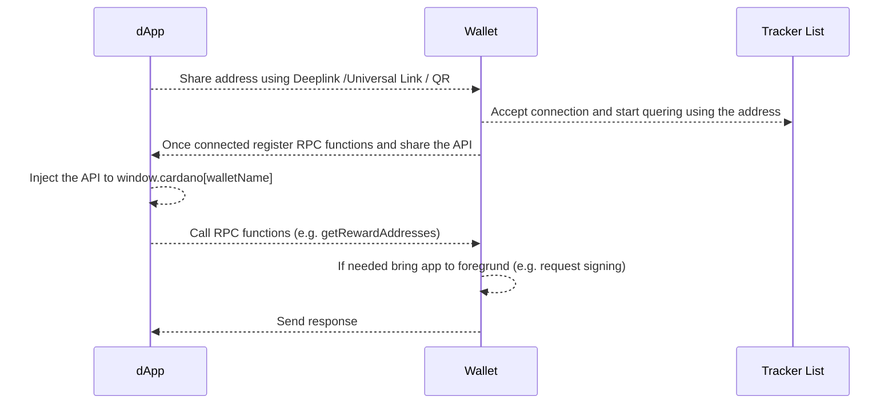

## Abstract

We want to introduce a decentralized communication method between dApps and wallets based on WebTorrent trackers and WebRTC. This CIP also contains a proof of concept implementation injecting the wallet rpc methods into the dApps global window object similar to [CIP-0030](https://github.com/cardano-foundation/CIPs/tree/master/CIP-0030).

## Motivation: Why is this CIP necessary?

In a decentralized ecosystem a communication between wallet-apps and dApps is still challanging. The inter-app communication on mobile devices does not directly allow remote procedure calls and is mostly restricted to Universal Links (iOS) or Deeplinks (Android). State-of-the-art solutions like WalletConnect tackle these problems using WebRTC communication which also works across devices, but requires a central signaling server to estalblish a WebRTC connection. In this CIP we want to introduce an architecture which uses WebTorrent trackers for the peer discovery to remove the need of this central component. 

## Specification

### Establish a WebRTC Connection Using a Signaling Server (State-of-the-art approach)



The data will be send peer to peer via a WebRTC data channel once the ip discovery has been finished. E.g. WalletConnect expects/provides a relay server URL to initialize the connection. While this method allows dApps to communitcate peer-to-peer with wallets it also leads to a [possible SPOF](https://twitter.com/walletconnect/status/1407279853943001088?lang=en).

### Establish a WebRTC Connection Using WebTorrent Tracker (Our approach)



Deep links, Universal Links, or even the clipboard could be utilized to share the identifier (public key) on the same device (in cases of a wallet based on web technology like Ionic). For sharing the identifier across different devices, QR codes would come into play. This method could be applied, for example, between a wallet mobile app and a dapp running on a PC, or vice versa. The wallet application would then initiate a query to a list of trackers using this distinct identifier in order to establish the WebRTC connection. After this process is completed, the data is transmitted peer-to-peer following the WebRTC standard, for instance, to invoke RPC calls.



#### CIP-0013 Compliant Identifiers

The keys (public key and corresponding 64-byte secret key) are generated using a function that implements Ed25519. This function requires a (random) seed, which can also be stored and re-used to ensure that whenever a client employs a dApp or a Wallet, the same key pair is generated consistently, even if the browser or mobile app is restarted. The public key will be used as an identifier for the torrent-based peer discovery. When this identifier is shared through methods like QR codes or links, it needs to be compliant to the following Cardano Uri Scheme [(CIP-0013)](https://github.com/cardano-foundation/CIPs/tree/master/CIP-0013): 

| [scheme]	    | [authority] |	[version]  |	[data]    |
|---------------|-------------|------------|--------------|
| web+cardano:  |	//connect |	/v1	       | ?identifier= | 

```
web+cardano://connect/v1?identifier=<public_key>
```
### Proof of Concept 

The idea of using WebTorrent trackers instead of signaling servers for peer discovery was already mentioned in [Aug 2018 by Chris McCormick](https://mccormick.cx/news/entries/on-self-hosting-and-decentralized-software):
 "I've also been tinkering with WebTorrent. [...]
Working with this technology made me realise something the other day: it's now possible to host back-end services, or "servers" inside browser tabs. [...] So anyway, I've made this weird thing to enable developers to build "backend" services which run in browser tabs"

McCormick's idea has been developed and open sourced as a library called [bugout](https://github.com/chr15m/bugout/) (MIT).

For this proof of concept we wrote two small pieces of software:

- A html page aka the dApp
- An ionic react app (to target mutliple devices) aka the wallet app

The whole code is provided within this [demo implementation](https://github.com/fabianbormann/WebRTC-WebTorrent-tracker-communication-demo) that also contains a step-by-step guide.

#### dApp

The dApp consists of a standard HTML5 template including the following lines of code:

```html
<script src="https://chr15m.github.io/bugout/bugout.min.js"></script>
<script>
    var bugout = new Bugout({ 
        seed: localStorage["poc-server-seed"],
        announce: [
            'udp://tracker.opentrackr.org:1337/announce', 
            'udp://open.tracker.cl:1337/announce', 
            'udp://opentracker.i2p.rocks:6969/announce', 
            'https://opentracker.i2p.rocks:443/announce',
            'wss://tracker.files.fm:7073/announce',
            'wss://spacetradersapi-chatbox.herokuapp.com:443/announce',
            'ws://tracker.files.fm:7072/announce'
        ]
        });
    localStorage["poc-server-seed"] = bugout.seed;

    var connected = false;
    bugout.on("connections", function (clients) {
        if (clients == 0 && connected == false) {
            connected = true;
            console.log("[info]: server ready");
            console.log(`[info]: share this address with your wallet app -> ${bugout.address()}`);
        }
        console.log(`[info]: ${clients} clients connected`);
    });

    bugout.register("api", function (address, args, callback) {
        const api = { version: args.api.version, address: address }

        for (method of args.api.methods) {
            api[method] = () => new Promise((resolve, reject) => {
                bugout.rpc(address, method, {}, (result) => resolve(result));
            });
        }

        window.cardano = window.cardano || {};
        window.cardano[args.api.name] = api;
        console.log(`[info]: injected api of ${args.api.name} into window.cardano`);
    });
</script>
```

#### Wallet App

The wallet app is a standard ionic react app built by the ionic cli:

```zsh
ionic start WalletApp blank --type=react
cd WalletApp
npm i bugout
```

The following lines of code were added to the index.tsx file:

```js
const bugout = new Bugout(
  "<HASH provided by the dAPP>", {
    announce: [
      'udp://tracker.opentrackr.org:1337/announce', 
      'udp://open.tracker.cl:1337/announce', 
      'udp://opentracker.i2p.rocks:6969/announce', 
      'https://opentracker.i2p.rocks:443/announce',
      'wss://tracker.files.fm:7073/announce',
      'wss://spacetradersapi-chatbox.herokuapp.com:443/announce',
      'ws://tracker.files.fm:7072/announce'
    ]
  });

bugout.on("server", function() {
  console.log("[info]: connected to server")
  bugout.rpc("<HASH provided by the dAPP>", "api", {"api": {
    version: "1.0.3",
    name: 'boostwallet',
    methods: ["getRewardAddresses"]
  }});
});

bugout.register("getRewardAddresses", (address:string, args:any, callback:Function) => {
    callback(["e1820506cb0ce54ae755b2512b6cf31856d7265e8792cb86afc94e0872"]);
});
```

This example has a few restrictions:

1. bugout is currently not compatible with Webpack 5, so polyfills are not automatically included and a react-scripts eject is needed to add them to the webpack.config.js file

2. bugout does not directly provide type declarations. There are some declarations within a [PR](https://github.com/chr15m/bugout/pull/45), but they need to be adjusted (a few parameters are not mandatory) and added to a bugout.d.ts file.
 
### User Flow



### Security Aspects

We decided to spawn the server within the dApp to force the user to manually scan a QR code (using a wallet app) or accept an "Open with `<WalletAppName>`" ui dialog (in case of Universal Links or Deeplinks). This prevents the user from connecting the wallet to an unwanted dApp. Additionally we need to add  a few security checks to prevent a misusage of this method.

- The wallet app needs to verifiy the origin (address) of the RPC call
- dApps should ask the user for permission to inject the wallet names into the window.cardano object to prevent XSS attack (Maybe using a graphical representation of the wallet app address e.g. blockies)

## Rationale: How does this CIP achieve its goals?

The purpose of this CIP mainly consists of two parts. It addresses the current lack of dApp mobile support, but at the same time provides an even more decentralized alternative to state-of-the-art communication methods. To achieve this goal we have introduced a WebTorrent and WebRTC based architecture. To demonstrate a viable implementation, we have implemented a proof of concept which also shows how a rpc method injection like CIP-0030 might look like.

## Path to Active

### Acceptance Criteria

- [x] A library should be build to make it easy from dAPP and wallet side to implement the proposed communication method
- [x] The library target should be browser to avoid the need of manual polyfills
- [x] Mobile testing on different devices and operating systems needs to be done with a special focus to the wallet app running in background mode
- [x] Potential security issues and attack vectors need to be discussed in detail
    1. We discussed potential security issues in the [CIP discussion](https://github.com/cardano-foundation/CIPs/pull/395#issuecomment-1669460822) and we
      implement an identicon solutin, but it is obviously an never ending task      
- [x] A full reference implementation is needed to test if the entire user flow and at the same time provide this as a how-to for developers
    1. Has been implemented here https://github.com/fabianbormann/cip-0045-demo-implementation

### Implementation Plan

- [x] Fork/Extend bugout to add webpack 5 and typescript support
- [x] Povide a general intermediate cardano-connect typescript library to provide 
    1. A check for mobile/desktop environment
    2. Depending on the environment provide interfaces for CIP-0030 / and / or CIP-?
    3. Add a full implementation of the server/client side code above to define a communication standard similar to CIP-0030 (getRewardAddresses, signData, signTx, ...)
- [x] Start discussions about security gaps within the proposed method with various developers and also look for research papers
- [x] Check if the wallet app also reacts to rpc calls in background mode on Android
- [x] Check if the wallet app also reacts to rpc calls in background mode on iOS
- [x] Implement the library within an example dApp:
    1. Implemented in Cardano Ballot for the [summit voting 2023](https://voting.summit.cardano.org/)
    2. Implemented by (SundeaSwap)[https://www.youtube.com/watch?v=mRpXIh-DyYM]
    3. Implemented into the [cardano-connect-with-wallet core and react library](https://github.com/cardano-foundation/cardano-connect-with-wallet/tree/main)
    4. Implemented in [walkinwallet](https://walkinwallet.com/) 
      

### Updates

- The re-implementation of bugout that matches the expectations below is now available as [meerkat](https://github.com/fabianbormann/meerkat)

- A general [cardano-connect typescript library](https://github.com/fabianbormann/cardano-peer-connect) with 100% CIP-30 support has been provided

- The copy & paste [demo implementation](https://github.com/fabianbormann/cip-0045-demo-implementation) is ready to use 

- Cardano Foundation's [connect-with-wallet](https://github.com/cardano-foundation/cardano-connect-with-wallet) component does include the dApp part of CIP-45 (via feature flag), so that dApp developers don't need to write a single line of code if they rely on this component

- The wording of the CIP-45 has been changed. Many thanks to [@jehrhardt](https://github.com/jehrhardt) for his valuable explanation and suggestions

## Copyright

This CIP is licensed under [CC-BY-4.0](https://creativecommons.org/licenses/by/4.0/legalcode)
