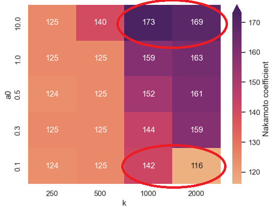
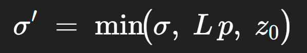
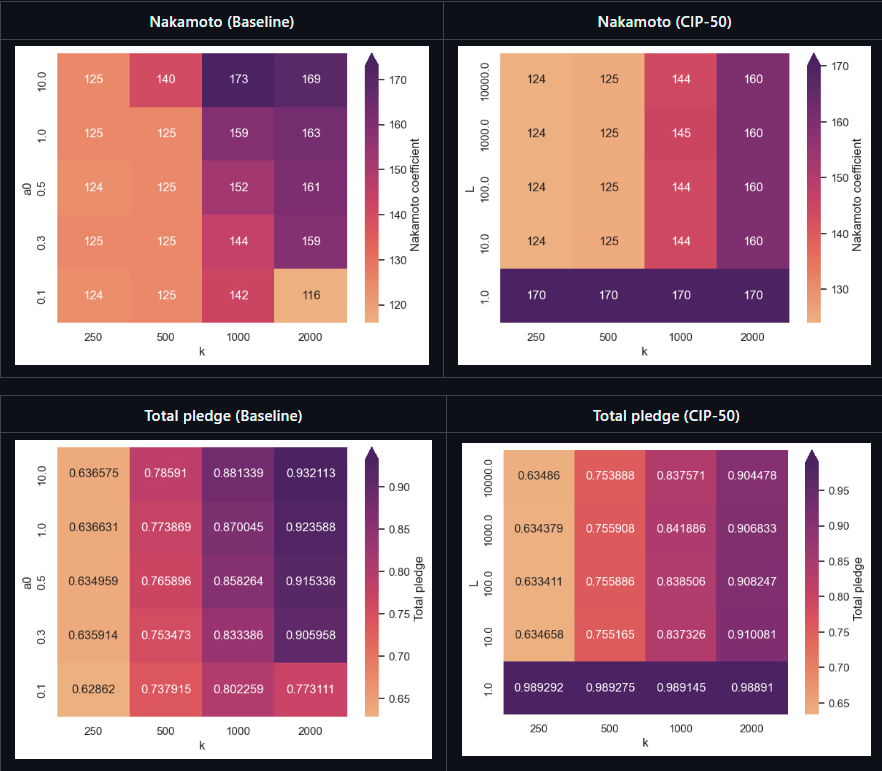
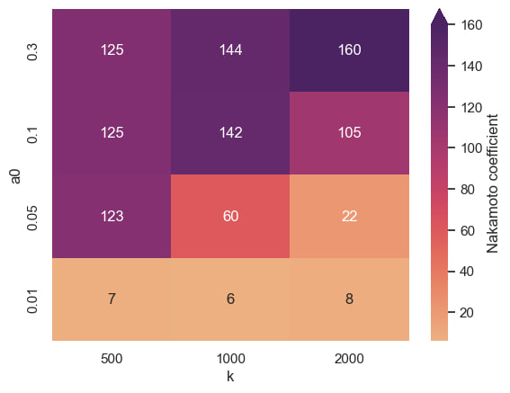
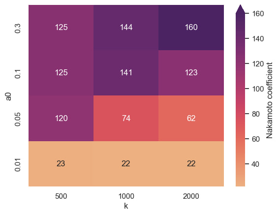

## Abstract

Improving decentralization is critical for Cardano’s long-term health and growth. The current reward-sharing scheme (RSS) has yielded a stable but suboptimal level of decentralization. In hindsight, the original parameters *k* (the desired number of pools) and *a₀* (pledge influence factor) have not achieved their intended goals. Many stake pools with zero or minimal pledge manage to attract large delegations, undermining the Sybil-resistance that pledge was meant to provide (Liesenfelt, 2022). This proposal introduces a new pledge leverage parameter, *L*, into the RSS to more directly and fairly constrain such under-pledged pools. By capping rewards for pools with excessive stake relative to pledge, *L* penalizes severely under-pledged pools while having minimal effect on well-pledged or small pools. The adjusted scheme aligns economic incentives with decentralization: it redistributes stake toward well-pledged pools (increasing their rewards) and makes it more difficult for single entities to dominate via multiple pools. We present the motivation, specification, and rationale for this change, including simulations illustrating its impact. The goal is to significantly improve effective decentralization (approaching the theoretical *k* target) without unfairly harming small pool operators.

## Motivation: Why is this CIP necessary?

### Stagnating Decentralization and Sybil Concerns

Cardano’s block production is less decentralized in practice than the protocol parameter *k* = 500 implies. Although *k* intends to cap pool sizes and guide the network toward saturated equal-sized pools, in reality many of the top pools are operated by the same entities, which defeats the purpose (Fancee, 2022). For example, certain large exchanges run dozens of pools (e.g. 91 by Binance and 31 by Coinbase), collectively controlling roughly 12.59% of stake. This means the Nakamoto Coefficient – the minimum number of distinct entities required to control greater than 50% of block production is only about 25 as of epoch 559 (Balance Analytics, 2025). In other words, the *effective* decentralization is on the order of only a few dozen independent actors, far below the target of 500 pools (Liesenfelt, 2022).

As of epoch 560, **473 pools have zero pledge**, yet they still command **2,740,223,943 ADA** in delegated stake (Koios, 2025).  This concentration is fueled by Sybil behavior: many pools are essentially split nodes run by one operator. Pool-splitting hurts the network as a whole: operators running multiple low-pledge pools collect multiple fixed fees and margins, reducing rewards for delegators and squeezing out smaller, independent operators (Kiayias, 2020).

Under the current Reward Sharing Scheme (RSS) there is no explicit mechanism to limit leverage (stake-to-pledge ratio). An operator can split stake across many pools with zero or tiny amounts of pledge and still earn nearly full rewards on each pool. The saturation parameter *k* limits stake per pool but cannot limit how many pools a single entity operates. The pledge-influence factor a₀ was intended to discourage Sybil attacks, yet at its present value (0.3) it provides only a modest boost to heavily pledged pools. A private pool with high pledge might earn ~3.33 % annualized, while a zero-pledge public pool still earns ~2.6% which is only ~22% less. That small gap is *statistically unnoticed* by most delegators and is overwhelmed by normal epoch-to-epoch luck variance.

Crucially, it now takes a pledge of only about **53,870,468 ADA** spread across enough low-pledge pools to control more than 50% of total stake (Koios, 2025). This minimal capital requirement highlights how the current design enables highly leveraged Sybil attacks that erode decentralization and threaten network resilience.

### Limits of the Current Parameters (*k* and *a₀*)

Cardano’s decentralization parameters face a dilemma. The parameter *k* governs the target number of pools (decentralization threshold), and *a₀* is the traditional lever for Sybil resistance via pledge. In theory, setting a higher *a₀* would strongly reward pledged stake and penalize pools with little pledge, thereby discouraging Sybil attacks (multiple zero-pledge pools). However, increasing *a₀* would also widen the reward gap between large pledged pools and smaller community pools, harming small pool operators. As of February 2022, with *a₀*=0.3, roughly **1.25 billion ADA** concentrated in **19 fully pledged pools** earns maximal rewards (Fancee, 2022), giving wealthy operators a significant yield advantage. Raising *a₀* further would make this disparity even worse – effectively creating *two classes of stakeholders*, where large custodial actors can offer materially higher yields than individual operators. This is antithetical to Cardano’s egalitarian ethos and has proven politically difficult: the community not made any significant efforts to adjust *a₀* upward, likely knowing it would push many small pools out of the ecosystem.

Cardano's previous increase of k from 150 to 500 did result in a modest increase in the number of unique pools making blocks, but it also presented a tradeoff. Some multi-pool operators responded by creating additional low-pledge pools to capture more stake. A concern that has been shared about raising *k* is that it carries the risk of a proliferation of minimally-pledged pools run by the same entities, increasing total pool count with only a minor improvement in the actual diversity of operators. This dilution weakens Sybil resistance and keeps effective decentralization, as measured by k-effective, significantly below the target *k*.

To investigate these relationships, the Rewards Sharing Simulation (RSS) engine (University of Edinburgh: Blockchain Technology Lab, 2025) was used with minor modifications to model CIP-50 behavior. When sweeping *k* from 250 to 2,000 while holding *a₀* at a very low value (0.1), the headline “target pool” count grows, but the Nakamoto coefficient actually falls from about 142 at *k*=1,000 to just 116 at *k*=2,000. The hypothesis here is that pledge is too insignificant which leads big operators to simply split their stake into even more zero-pledge pools.  The on-chain diversity looks larger, yet real control collapses into fewer hands.

(University of Edinburgh: Blockchain Technology Lab, 2025)

Moving a₀ to the opposite extreme tells demonstrates a different issue. At *a₀*=10, the simulation does push the Nakamoto coefficient upward to around 173 at *k*=1,000.  But there is a small drop to 169 at *k*=2,000.  The hypothesis here is that in this case, pledge has actually been made *too* significant such that only whales with large amounts of pledge are able to compete. This would presumably reshape the ecosystem into an elite upper tier and a struggling lower tier. In effect, we swap Sybil risk for wealth concentration which indirectly harms decentralization.

In summary, Cardano’s current RSS parameters are insufficient to prevent Sybil attacks and pool splitting: *k* sets an ideal pool count but doesn’t control for unique identities, and *a₀* is too weak (for political and economic reasons) to enforce meaningful pledge contributions. As a result, many pools with zero or tiny pledge and high delegated stake thrive – which deviates from the original decentralization goals of the Shelley design. An adjustment is needed to strengthen Sybil resistance without unfairly disadvantaging small pools.

### Objectives for an Improved Scheme

Any improvement to the reward scheme should adhere to the following high-level goals:

* **Fairness**: All stakeholders, from small delegators to whales and exchanges, should have the opportunity to earn *on average* the same *yield* (rewards per unit of stake). The system should avoid creating “VIP” pools with inherently better returns. In other words, no two classes of stakeholders. 

* **Sybil Protection:** Running multiple pools *must* come at a cost. The scheme should *require* a meaningful pledge to support each pool’s delegated stake – not just mildly incentivize it. Creating many low-pledge pools should result in diminishing returns, removing the current advantage of pool splitting (Kiayias, 2020). 

* **Decentralization:** The effective number of independent block-producing entities (k-effective) should converge towards the target *k*. The **Minimum Attack Vector (MAV)** (a.k.a. Nakamoto coefficient – number of entities to control 51%) should remain stable or increase. 

* **Predictability and Simplicity:** The new reward formula should be as simple and transparent as possible, avoiding unnecessary complexity (e.g. no exotic curves or cryptic parameters). Operators and delegators should easily understand the cause-and-effect of the parameters on rewards. 

This CIP addresses these goals by introducing a new pledge leverage parameter *L* and corresponding modifications to the reward formula. The motivation is to curb extreme leverage (high stake with low pledge) in a targeted way that primarily affects Sybil or multi-pool scenarios, while ordinary single-pool operators with reasonable pledge are largely unaffected (and may even benefit from a fairer playing field). In short, we seek to increase decentralization and security without sacrificing the openness and egalitarian nature of Cardano’s stake pool system.

## Specification

### Introducing the Pledge Leverage Parameter (*L*)

We propose adding a new protocol parameter *L* (maximum *pledge leverage*) to the staking reward formula. The parameter *L* is defined as the maximum ratio of total stake to pledge that a pool can have *before* its rewards begin to plateau. In other words, *L* imposes a pledge-based saturation point for each pool.

* **Range of *L*:** 1 ≤ *L* ≤ 10,000 (dimensionless ratio). An *L* of 10,000 represents an extremely high allowed leverage (i.e. pledge need only be 0.01% of the stake), effectively similar to the status quo with a very weak pledge influence. An *L* of 1 represents a very strict requirement where a pool’s stake cannot exceed its pledge (100% pledge) if it is to earn full rewards. 

* **Reward Formula Changes:** The reward calculation (pool reward *R*) is modified to incorporate *L* as follows: Each pool’s stake is effectively capped by its pledge according to *L*. Let: 

    * *R* = Pool rewards 

    * 𝜎 = pool’s total stake (pledge + delegated stake) 

    * *p* = pool’s pledge 

    * *k* = target number of equal-sized, active, block-producing pools 
 

* We introduce a **pledge leverage cap** such that the effective stake used in reward computations is:

 This means a pool is subject to *two* soft caps: one based on the global saturation (*k*) and one based on its own pledge.

* **Stake cap (k):** If a pool’s total stake 𝜎 exceeds *1/k* (the normal saturation point), it gets no extra rewards beyond that point (as in the current formula). 

* **Pledge cap (L):** If 𝜎 exceeds *L·p* (i.e. the pool’s stake is more than *L* times its pledge), then any stake above that is not counted for rewards either. In effect, the pool is “leverage-saturated” if it tries to grow too large without sufficient pledge backing. 

### Implications:
  * A pool with **very low pledge** relative to its delegation will hit the pledge cap long before the *k* cap. For example, a pool pledging 1k ADA with *L*=100 can fully utilize at most 100k ADA of stake; beyond that, additional delegations won’t increase its rewards. If that pool has, say, 1 million ADA delegated, it will still only earn rewards as if it had 100k (plus its 1k pledge) – the rest of its stake is effectively providing zero rewards to its delegators. This creates a strong incentive for delegators to move to better-pledged pools if their pool is over-leveraged. 

  * A pool with **adequate pledge** will not be affected by the *L* cap until it reaches the normal saturation point. For instance, with *L*=100 and *k*=500, a pool needs about 1% pledge to utilize full stake up to *1/k*. In absolute terms, given the current saturation point around 75M ADA. At *L*=100, a pledge of ~750k ADA would be required to support 75M stake. Pools that meet this pledge-to-stake ratio can grow to saturation normally and will earn the same rewards as under the current formula. 

  * Pools with a **substantial pledge** relative to their stake will not be constrained by the pledge leverage parameter, *L*. These high-pledge pools will instead only reach the global network saturation point, which is determined by *1/k*. Furthermore, these well-pledged pools will also receive a small additional reward boost based on the pledge influence factor, *a₀*, in the existing reward formula, providing them with a modest advantage over pools that are approaching the leverage cap. 

  * If a pool’s stake is **below saturation**, it can still earn rewards on the full amount of stake as long as its pledge is at least *𝜎·L*. Smaller pools typically have smaller 𝜎, so the pledge needed is modest. For example, at *L*=100 and *k*=500, a pool with 500k ADA total stake would only need a pledge of ~5k ADA (1% of 500k) to not be limited by leverage, and it would offer delegators a competitive APY. This is a reasonable pledge threshold, demonstrating that **honest small pools are not penalized** by *L*. They can achieve comparable yields as large pools on a proportional basis. 

  * Crucially, a pool with **zero pledge will earn zero rewards** if it has any delegated stake. This is a clear break from the current scheme, where a pool with 0 pledge can still generate rewards for delegators (just slightly less). Under the new formula, some amount of pledge becomes absolutely mandatory.  This eliminates the “free rider” problem of profit-seeking pool operators undermining the network’s security.

## Rationale: How Does This CIP Achieve Its Goals?

### Penalizing Under-Pledged Pools (Sybil Deterrence)

The pledge leverage parameter *L* directly targets the worst-offending pools from a Sybil perspective – those with lots of stake but little skin in the game. By establishing an upper limit on stake relative to pledge, *L* introduces a hard economic penalty for over-leveraged pools. An operator can no longer create unlimited pools with minimal pledge and expect nearly full rewards on all of them. Any pool that is* severely under-pledged *will quickly hit the leverage cap and see its additional delegated stake yield zero incremental rewards.

This has an immediate discouraging effect on Sybil behaviors:

* A malicious actor attempting to control a large portion of stake by spinning up many pools would now need to proportionally increase pledge for each pool to make them effective. Otherwise, delegators will not join those pools (due to poor returns) or will abandon them once they realize additional stake is wasted. The economic cost of a Sybil attack thus becomes *linearly proportional* to the stake under control, thanks to the pledge requirement, rather than merely the fixed cost of running many nodes. 

* Importantly, *L* removes the “free ride” incentive that previously existed where splitting one’s stake into multiple pools could circumvent the saturation limit. Under the new scheme, splitting stake across N pools without adding more pledge might split one’s effective rewards as well. For example, if an entity with a fixed total pledge *p* runs two pools, each pool will have at most *p·L* worth of effective stake. If they had combined everything in one pool, they’d have *p·L* effective stake (assuming that was the limiting factor). By splitting into two pools with pledge p/2 each, each pool caps at (p/2·L), for a combined effective stake of *p·L* – the same as one pool. Thus, there is no gain in total rewards by operating multiple pools under a fixed pledge budget. Any attempt to gain more by adding a new pool will just spread the pledge thinner and impose a lower cap per pool, keeping the total unchanged. This is a fundamental change: in the current scheme, splitting stake *can* increase an entity’s total rewards (because each pool can almost fully saturate and earn fees), but with *L* enforced, splitting yields *diminishing returns* unless accompanied by more pledge. 

* Furthermore, *L* ensures pledge is absolutely mandatory for participation, aligning every operator’s incentives with the network’s security. Unlike today where many pools operate with almost zero pledge, under the new formula a pool with 0 pledge simply cannot earn rewards. Even a minimal pledge pool will severely limit its delegators’ returns if it grows, making it unappealing. This policy embodies the principle that if you want to benefit from community delegation, you must put up a bond to secure the network. It converts pledge from a weak nudge into a strict requirement, dramatically strengthening Sybil resistance. 

In short, *L* provides an enforceable limit on Sybil actors and their maximum return on invested capital. It closes the loophole that allows large holders to game the system by simply multiplying pools. By tying rewards to pledge, the economic playing field is leveled: operators must either commit capital or accept a cap on their pool’s influence. This directly realigns incentives with decentralization and security.

### Minimal Impact on Honest Small Pools

A key advantage of using *L* (a leverage cap) instead of raising *a₀* (linear pledge influence) is that it minimizes negative effects on small or medium operators. The leverage cap kicks in when a pool tries to scale beyond what its pledge supports. Small pools, by definition, are not huge in stake, so most will not even reach the cap if *L* is tuned reasonably. For example, a pool with 1M ADA stake and 10k ADA pledge at *L*=100 is right at the cap (since 10k*100 = 1M); if it grows above 1M, then yes, it would need more pledge to maintain max rewards. But if that pool stays small or gradually grows alongside its pledge, its delegators experience no reduction in yield. In practice, many community pools already maintain a healthy pledge relative to their current delegation. These pools will see no change in their rewards from the new formula, except that they might actually become more attractive to delegators compared to under-pledged competitors.

By contrast, increasing *a₀* would hurt small pools immediately by lowering their rewards relative to large pools (regardless of the small pool’s size). The *L* parameter avoids that blunt harm by acting as a soft cut-off rather than a across-the-board tax. Pools earn normally up to a point, then flatline. Thus, a small pool that isn’t anywhere near saturation or leverage limits will function just as before (or better, since delegators may redistribute in its favor). The reward system aims to remain largely egalitarian: most pools that meet the pledge ratio can reach a similar maximum reward per stake. While increasing a₀ can create a slightly steeper reward gradient favoring high-pledge pools, introducing *L* creates a flat plateau for all pools that meet the leverage requirement while still maintaining a minor pledge benefit through *a₀* up to the global saturation point. This leverages the new *L* parameter to be more egalitarian while still incentivizing pledge, aiming to minimize the creation of disparate classes of participants.

### Discouraging Multi-Pool Splitting and Easing *k* Increases

One of the strongest arguments for the leverage-based approach is its effect on multi-pool operators (MPOs). In the current scheme, an MPO (like an exchange or a pool group) can slice their stake into *N* pools and, aside from the minor dilution of pledge, face little downside. They often benefit by collecting multiple fixed fees and saturating more pools. This has led directly to the situation of single entities running tens of pools and dominating the top ranks.

With *L*, the advantage of operating multiple pools is blunted for operators with too little pledge to support them. Since the rewards of each pool are limited by pledge, an MPO with a fixed total pledge won’t gain by spreading it thin. In fact, operating more pools could reduce their overall efficiency if their pledge per pool drops. The rationale is simple: if splitting your pledge into two pools halves the effective cap of each, you end up with the same total effective stake across your pools (and thus the same total rewards) as if you kept one pool fully pledged. Therefore, a rational operator under the new scheme would have no incentive to run more pools than necessary to accommodate their stake and pledge. We anticipate that many MPOs will consolidate or reduce the number of pools they run once *L* is in effect, because having many half-pledged pools would just advertise their leverage weakness and fail to increase their earnings.

This property is especially important when considering future increases in *k*. If Cardano wants to raise *k* (say to 1000 or beyond) to encourage further decentralization, *L* will ensure that those additional pool “slots” actually translate to new operators, not just existing MPOs multiplying again. As noted earlier, raising *k* alone without leverage control might invite big players to split stake into more pools. But if those players are constrained by pledge, they cannot effectively occupy all the new slots at full rewards. For instance, an exchange with limited pledge might fill some pools to the cap, but then either stop or create more pools that are underperforming. This leaves room (and incentive) for other operators to step in and operate the remaining pools, because delegators will seek out pools that *can* give full rewards. Thus, *L* works in synergy with raising *k*: it amplifies the decentralization impact of a larger *k* by preventing single entities from monopolizing the new capacity. In effect, *L* helps align *k* (the protocol’s target) with *k-effective* (the real outcome). We can safely pursue higher *k* values knowing that effective decentralization will follow more closely, rather than being undermined by Sybil pool clusters.

### Validating Behavior with Reward Sharing Simulation Engine

To test whether the leverage cap (*L*) proposed in CIP-50 delivers the intended balance between Sybil resistance and fairness, we re-ran the University of Edinburgh Reward-Sharing Simulation Engine with two configurations:

1. **Baseline** – the current Cardano rewards formula exploring *k = 250 → 2,000* and *a₀ ∈ {0.1, 0.3, 0.5, 1, 10}*. 

2. **CIP-50** – identical *k* sweep but with *a₀ locked at 0.3* and *L ∈ {10, 100, 1 000, 10,000}*.

(University of Edinburgh: Blockchain Technology Lab, 2025)

**Decentralization is roughly the same or slightly improved.**    
Where the baseline delivers 159 independent entities for the current parameter set (*k=500, a₀=0.3*), CIP-50 achieves **~160** at almost all settings of *L*. Thus the new rule neither harms decentralization nor relies on an unpalatable increase to *a₀*.

**Network pledge rises slightly.**    
Total pledged stake in the baseline hovers between **0.73 and 0.93** of the maximum possible, depending on *a₀* and *k*. CIP-50 nudges this figure upward at *a₀*=0.3, showing that a leverage ceiling likely would entice operators to increase their pledges rather than spawn extra pools.

**Lower *L* values are preferred.**    
While any finite *L* blocks the worst Sybil behavior, tighter caps yield the best Sybil protection without penalizing small-to-medium operators the way a large *a₀* increase would. The sweet spot lies at the lower end of the tested range (~10 to ~100), where Sybil protection is strongest yet the number of viable pools remains healthy.

***L* primarily strengthens Sybil protection.**    
In the baseline, lowering *a₀* to 0.1 caused a notable drop in Nakamoto coefficient at *k=2000*. To investigate this particular issue, further simulations were run with extremely low values of *a₀* with the current rewards formula and with CIP-50 and a flat *L* value of 10.

(University of Edinburgh: Blockchain Technology Lab, 2025)

The addition of *L* resulted in a notable improvement in the Nakamoto coefficient over the baseline rewards formula.  Taken together, the simulations support the hypothesis that CIP-50’s leverage cap will accomplish its primary mission of curbing Sybil pool proliferation.

## Path to Active

### Acceptance Criteria

**Consensus on an Initial *L*** – An initial value of *L* must be agreed upon before hard-fork combinator (HFC) activation. The choice should balance Sybil protection against operational viability, drawing on empirical analyses (e.g., RSS results) and community feedback. 

**Endorsement by Technical Bodies** – The Cardano Parameter-Change Proposals (PCP) Committee and the Intersect Technical Steering Committee (TSC) should both recommend the proposal as technically sound and aligned with the protocol’s long-term roadmap. 

**CIP Editorial Approval** – Cardano CIP Editors must confirm that the specification is complete, unambiguous, and internally consistent with existing CIPs. 

**Stakeholder Concurrence** – A majority of stake pool operators (SPOs), ecosystem tooling maintainers, dReps, and other infrastructure providers must signal readiness to upgrade. 

**Governance Ratification** – The on-chain Hard-Fork Governance Action must pass the requisite dRep and Constitutional Committee thresholds, establishing legal-constitutional legitimacy and stakeholder support for the change.

### Implementation Plan

**Community Deliberation (Preparation Phase)**

* Publish the finalized CIP-50 revision and present it to the PCP committee , TSC, CIP Editors, and wider community channels (Discord, X, Cardano Forum, etc.). 

* Collect structured feedback—particularly on candidate values for *L*—and iterate until broad technical consensus emerges. 

**Specification & Code Integration (Development Phase)**

* Once an initial *L* is determined, integrate the leverage-cap logic into cardano-node and related libraries (ledger, CLI, wallet APIs). 

* Submit pull requests to the canonical repositories; obtain code reviews from IOG, CF, and community contributors. 

* Release a new protocol version that includes the changes made in this CIP. 

* Use a dedicated pre-production testnet that mirrors main-net parameters but enforces the new *L* rule, allowing SPOs and exchanges to test end-to-end flows. 

**Readiness Sign-off (Testing Phase)**

* Require at least two weeks of uninterrupted testnet stability plus green results from regression and property-based tests. 

* Monitor ecosystem dApps and tooling to confirm that major node implementations, explorers, wallets, and exchange integrations support the new rule set. 

**On-chain Governance (Ratification Phase)**

* File the Hard-Fork Governance Action on-chain with the agreed *L*, tagged for the next hard fork event. 

* Mobilize dRep outreach to ensure quorum and super-majority passage; concurrently, the Constitutional Committee validates procedural compliance. 

**Hard-Fork Activation (Deployment Phase)**

* Upon successful vote, the hard fork event is automatically triggered upon epoch turnover. 

* Monitor main-net metrics during the changeover epoch; provide real-time support for any late-upgrading SPOs.

## References

  AdaPulse. (2023, February 23). *MAV: The Safety Metric In Block Production Decentralization*. AdaPulse. Retrieved May 20, 2025, from https://adapulse.io/mav-the-safety-metric-in-block-production-decentralization

  *Balance Analytics*. (2025, May 20). Average Resulting Decentralization. Retrieved May 20, 2025, from https://www.balanceanalytics.io/chartboards/decentralization

  Balance Analytics. (2025, May 20). *Group Stake Donut Chart*. Balance Analytics. Retrieved May 20, 2025, from https://www.balanceanalytics.io/chartboards/donut_shop

  Fancee, T. (2022, February 1). *CIP - Leverage-based Saturation and Pledge Benefit*. Cardano Forum. Retrieved May 20, 2025, from https://forum.cardano.org/t/cip-leverage-based-saturation-and-pledge-benefit/95632

  Kiayias, A. (2020, November 12). *The general perspective on staking in Cardano*. Input | Output. Retrieved May 20, 2025, from https://iohk.io/en/blog/posts/2020/11/13/the-general-perspective-on-staking-in-cardano/

  Kiayias, A. (2020, November 29). *Blockchain reward sharing - a comparative systematization from first principles*. Input | Output. https://iohk.io/en/blog/posts/2020/11/30/blockchain-reward-sharing-a-comparative-systematization-from-first-principles/

  Koios. (2025, May 28). *Pool List API*. https://api.koios.rest/

  Liesenfelt, M. (2022, April 4). *Pledge Leverage-Based Staking Rewards*. Cardano Improvement Proposals. Retrieved May 20, 2025, from https://cips.cardano.org/cip/CIP-0050

  University of Edinburgh: Blockchain Technology Lab. (2025, May 28). *Rewards Sharing Simulation Engine*. https://github.com/Blockchain-Technology-Lab/Rewards-Sharing-Simulation-Engine

## Copyright

This CIP is licensed under [CC-BY-4.0](https://creativecommons.org/licenses/by/4.0/legalcode).