## Abstract

Improving decentralization is absolutely necessary for the long term health and growth of the Cardano ecosystem. The current reward formula has resulted in a stable but stagnant level of decentralization. With the benefit of hindsight over the last year the intent of $(a0, k)$ has not resulted in the desired decentralization outcome. This CIP provides the justification, methods, metrics, and implementation for an improvement program to increase decentralization of the Cardano network.

The proposed reward equation retains the function of $k$ for diminishing rewards based on stake and enforces diminishing rewards based on pledge leverage, $L$. The proposed equation enforces a set of principles to ensure stakeholders of dramatically different size can all achieve the same maximum yield. The yield ceiling feature prevents the formation of two classes of stakeholders and removes some of the benefits of centralization. The economic motivations of the largest stakeholders will be aligned with decentralization, reward diversification, fault tolerance, and ensuring the sybil protection of the entire community.

> **Warning** <u>Conflict of Interest Declaration</u>
>
> The author is employed full time as a Research Assistant Professor in Nuclear Engineering at the University of Tennessee. The author earns no revenue from the Cardano ecosystem, does not operate a stake pool, is not seeking Cardano Foundation stakepool delegation support, is not seeking Catalyst funding support, and owns 25k ADA delegated to the BALNC stake pool ($drliesenfelt).

## Motivation: why is this CIP necessary?

Improving decentralization is absolutely necessary for the long term health and growth of the Cardano ecosystem. The current reward formula has resulted in a stable but stagnant level of decentralization. The motivation is to provide the justification, methods, metrics, and implementation schedule for an improvement program to increase decentralization of the Cardano network.

$K$ and $a0$ are input parameters to the reward formulation designed to promote decentralization. The original intention for parameter $k$ was for it to set a ‘soft-cap’ on a pool’s size and thereby encourage the system to converge toward $k$ pools of equal size delivering equal return per unit of stake for all delegates. In the ideal world this would mean $k$ pools that are roughly equally saturated producing a roughly equal proportion of the blocks [1]. An underlying assumption was that one entity would run only one pool and design discussions about these parameters have described running multiple pools as a form of Sybil attack [2].

However, the input parameters have not achieved these goals. Currently there are single entities that run 5,10,20 or even 50 separate pools. It is proposed that the “average resulting decentralization” should be measured based on the stake held by entire entities/groups, rather than a count of individual pools. “K-effective” is hereby used to measure the “average resulting decentralization” and is computed using Equation 1. The Nakamoto Coefficient is approximately half of k-effective rounded up to the nearest integer. K-effective provides a higher resolution quantification of network decentralization compared to the Nakamoto Coefficient.

The Cardano network currently produces ~21,600 blocks per epoch with ~2400 groups producing between 0 and ~3600 blocks per group. If averaged, approximately 40 equal sized groups would each be creating ~527 blocks per epoch. The historical decentralization of the network shown in Figure 1 has improved from 30.0 in epoch 245 to between 35.0 and 43.0 after epoch 260. This “effective decentralization” or “k-effective” is not even close to the 500 figure targeted by the current k=500 parameter. A partial example of the table used to compute k-effective is shown in Figure 2.

(1) https://iohk.io/en/blog/posts/2020/11/05/parameters-and-decentralization-the-way-ahead/

(2) https://iohk.io/en/blog/posts/2018/10/29/preventing-sybil-attacks/

$Ref (1)$

<p align="center">
 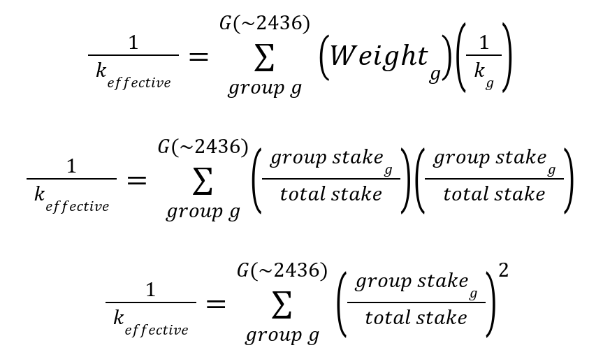
</p>

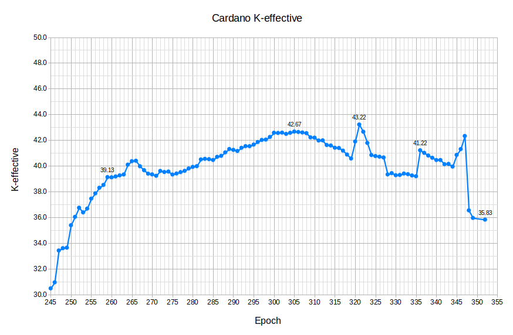
Figure 1. Historical k-effective from epoch 245 to present.

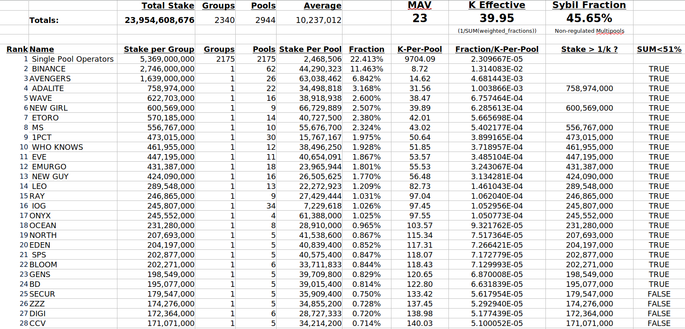
Figure 2. K-effective table.

### The Intent of (a0,k)

To cite Aggelos Kiayias, Chief Scientist of IOG:

> “Central to the mechanism’s behavior are two parameters: $k$ and $a0$. The k-parameter caps the rewards of pools to 1/k of the total available. The $a0$ parameter creates a benefit for pledging more stake into a single pool; adding X amount of pledge to a pool increases its rewards additively by up to $a0$*X. This is not to the detriment of other pools; **any rewards left unclaimed due to insufficient pledging will be returned to the Cardano’s reserves and allocated in the future**.” [3]

> “Paired with the assessment of stake pools performed by the delegates, **this mechanism provides the right set of constraints for the system to converge to a configuration of k equal size pools with the maximum amount of pledge possible**.” [3]

The analysis of the current reward formula in [4] equated 1 pool to 1 entity. In the real world 1 entity can choose to delegate to another entity, operate one pool, **or operate many pools**. This oversight in the original analysis contributed to the proliferation of multipools in defiance of $k$ parameter increases.

(3) https://iohk.io/en/blog/posts/2020/11/13/the-general-perspective-on-staking-in-cardano/

(4) https://arxiv.org/ftp/arxiv/papers/1807/1807.11218.pdf

### The Current Reward Formula

From “4.1 Our RSS construction” of “Reward Sharing Schemes for Stake Pools” [5] the current rewards equation is:

$ Ref(2) $
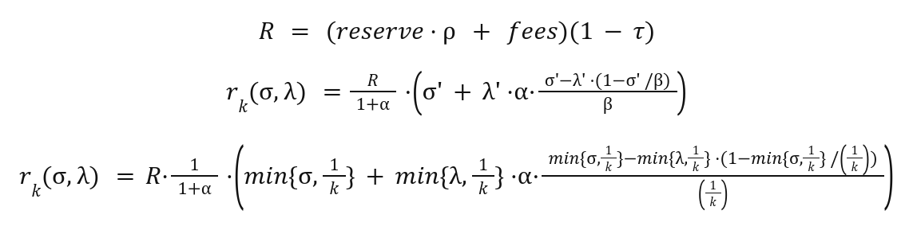

where:

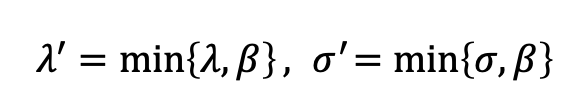

A natural choice is $β = 1/k$, where $k$ is the target number of pools, and $k,α$ are fixed parameters.

The following are current protocol parameters:

$k = 500$

$α = a0 = 0.3$

The $a0$ parameter represents the fraction of the rewards $(R/(1+a0))$ which are not paid out unless all of the stake is pledged. An $a0$ of 0.3 ensures that **1.0 - 1.0/(1.0+0.3) = 23% of the total rewards R will be withheld from low pledge fraction pools and returned to the reserve**. The effect of this formula is that increased pledge results in retaining more of the available rewards R. However, this benefit is not linear, rather it is drastically biased towards the saturation limit. The $\sigma’ = min\\{σ,β\\}$ term enforces a reward limit based on $k$. Visualizing the resulting field of outcomes at various pledge amounts from 0.00% to 100.0% is necessary. The red dotted line “Max Reward” represents the maximum available yield available at the stated network size.


<details><summary>If the minimum fee is 30</summary></details>
<details><summary>If the minimum fee is 0</summary></details>
<details><summary>If a0 is increased to 0.5</summary></details>
<details><summary>If a0 is increased to 1.0</summary></details>
<details><summary>If a0 is increased to 10.0</summary></details>
<details><summary>If a0 is decreased to 0.2</summary></details>
<details><summary>If a0 is decreased to 0.1</summary></details>
<details><summary>If a0 is decreased to 0.0</summary></details>
<details><summary>If a0 is decreased to 0.0 and minFee = 0</summary></details>
<details><summary>If minFee is increaesd to 1000</summary></details>
<details><summary>If minFee is increaesd to 2000</summary></details>

#### The Reality of (a0,k)

The intent of parameters $(a0, k)$ has not been realized. The graph of k-effective shows that increasing $k$ from 150 to 500 did not result in a proportional increase to decentralization. The k parameter is currently $500 / 35 = 14.29$ times larger than the effective decentralization k-effective.

Another important determinant of the ability for small pools to compete with larger pools is the mandatory minimum fee (minFee parameter) which is currently 340₳. This minimum fee is a higher percentage of the total rewards for a small pool compared to a larger pool. It means that delegator yields will not exceed 95% of a saturated pool delegator yields until the pool has at least 15.0% saturation. This is a significant barrier to entry for small pools.

Billions of ADA is currently staked in pools with nearly 0 pledge and extremely high leverage. Also, a billion ADA is currently pledged in nearly saturated private pools closed to community delegation. There are very few public pools accepting community delegation with pledge amounts between 5M₳ and 60M₳ and the vast majority of public pools have less than 1M₳ pledge. The following bubble chart shows the distribution of stake as a function of group leverage on a log(Stake) vs log(Leverage) scale. The current pledge incentive mechanism only becomes relevant in a small segment of this chart below a leverage of 10 and above a pledge amount of 10M₳. The Single Pool Operator Alliance (SPA) is a collective of ~2200 individual pools and pool operators with a collective stake of 5B₳ at an average leverage factor of only 22.


In the original design, parameter $a0$ represented the influence the operator’s pledge had on the desirability of the pool. In other words, more pledge should mean the pool would be more desirable for stake delegation. However the current reward formula has not produced this effect. See Figure 2. With increasing pledge as a proportion of total stake there is little noticeable effect on rewards until very high pledge percentages. These very high pledge percentages are not attainable except by extremely large stakeholders. Furthermore having such a high pledge percentage would defeat the purpose of community staking since the pool would already be saturated when the maximum pledge benefit is earned.

The reality of the past 18 months is that pool operators have split pledge across multiple pools because it is more profitable to earn fees (minFee + margin%) than it is to benefit from increasing their pledge to a single pool. The small increase in yield for pools with less than 10M₳ pledge is also much less than the random statistical uncertainty of rewards per epoch. The pledge incentive is currently a statistically unnoticed benefit used only by large private stakeholders. The current reward equation has sacrificed fair egalitarian rewards for an incentive that is not providing Sybil protection as intended.

### The SundaeSwap Effect

The SundaeSwap Initial Stake Offering (ISO) proved that community delegator stake can be very mobile. More than a couple billion in stake centralized into ISO groups. After realizing the popularity of their ISO resulted in a centralization of the network SundaeSwap launched a ‘Reverse’ ISO for the benefit of single pools. The RISO temporarily reversed the centralization trend as a billion ADA was delegated to small pools. The Cardano network reached a decentralization factor of 43.22 in epoch 321. After the RISO these decentralization gains reversed because the underlying incentives of the reward formula have not changed. This proves that the community is engaged and their stake is mobile, especially for yield and gains.

### a0: The pledge yield boosting parameter

An intentional design of the current reward equation is to purposefully allow large stakeholders pledging to private pools to earn the maximum possible yields while excluding community delegation. The vast majority of pools with pledge <10% stake saturation have an asymptotic yield currently approaching a maximum yield of 4.25%. A high pledge fraction in a private pool can earn up to the maximum available 5.5% yield, 30% more yield than low pledge community pools.

The $R/(1+a0)$ term guarantees that small pools will not earn the same fraction of the reserve as large pledged pools. Currently, approximately 1.25B₳ is earning full rewards in 19 pools. If left unchanged over time custodial wealth management companies will be able to offer materially higher yields than individuals. Wave financial is an example of a company currently providing this business model to clients. Eternl/ccvalut is introducing multi-signature features to allow many individuals to collectively pledge to pools. Over time this difference results in two different classes of stakeholders and erodes the decentralized self-custodial appeal of Cardano.

### The danger of ‘just increase k’

Forcing the k-parameter to be radically different from the effective decentralization, k-effective, of the network has resulted in unintended consequences. When k was increased large groups created new pools to retain delegators. If the k-parameter is increased without updating the rewards formula, more large stakeholders will be able to earn full yields by pledging to private pools excluding community delegation.

Large differences between k-parameter and the k-effective of the network represents a stress on the current state of the network. More pools under the control of a smaller number of groups does not improve decentralization and in fact takes more time and resources to propagate the blockchain to more relays and nodes. A k-effective of >100.0 with an adjustable k-parameter informed by and leading k-effective is reasonable long term goal. If the k-effective becomes >100.0, it is likely that the Nakamoto Coefficient will be >50.

## Specification

### Statement of Principles

> _“Principles matter.”_ -CH

1. Everybody in the community should be treated fairly from tiny starfish delegators (1-2k₳) to massive blue whales (>100M₳) and exchanges.
2. Everybody in the community should have the opportunity to on average earn the same yield and there should not be two classes of stakeholders.
3. There should be a very clear cause and effect relationship between the input parameters and the resulting K-effective decentralization.
4. The equation must require, not incentivize, pool operators to pledge to support community delegation and sybil protection.
5. The decentralization result will be quantified in terms of group decentralization of block production.
6. Implementation should be smooth, easy, clear, and beneficial for all stakeholders and operators.
7. A new reward equation should be computationally simple and elegant.

### Definitions and Concepts

**k, k-parameter**

- The desired number of stake pools for decentralization, which inversely sets a "soft cap" on the stake pools saturation limit (size). The pool size is determined by total circulating supply divided by k number of pools. Pool size is encouraged to converge toward k for optimal staking rewards, in theory.

**k-effective**

- The “average resulting decentralization” or "effective decentralization" taking into account groups or entities of stake pools.  One group could be running multiple stake pools, which lowers the realistic, effective decentralization.

**Nakamoto Coefficient, Minimum Attack Vector (MAV)**

- The minimum number of entities in a given subsystem required to get to 51% of the total capacity, or more simply, how many stake pool groups it would take to gain 51% control of the blockchain. This is a simple yet decisive decentralization measurement. It is not limited to pools, but any attack vector.  However, for the scope of this paper it is assumed to be pools only. The Nakamoto Coefficient is approximately half of k-effective rounded up to the nearest integer.

**Sybil Attack**

- An attack where the attacker pretends to be an honest pool or pools to gather stake and power in the network.  The attacker can create an infinite number of pools in his effort to maximize his own power in the network.

**Pledge**

- The amount of stake pledged by a stake pool in ADA. This combats a sybil attack with an economic cost of a "down-payment" or stake pool _pledge_ when creating a new stake pool.

**Pledge Leverage, L**

- The ratio between an entity’s pool stake and pledge defined by the parameter L. A leverage-based stake pool saturation is based on pledge rather than a fixed size driven by k-parameter. An entity having high leverage means its total stake is much higher than its pledge.

**VRF Score**

- Verifiable Random Function (VRF) score is essentially the lowest random number generated by the stake pools that determines what pool won the slot leader battle to mint a block.  The lowest random number VFR score generated by a pool wins the block.

**Private vs Public Stake Pools**

- Cardano stake pool operators can be either private, using only their own self-bonded stake, or public, by accepting delegation. A private stake pool retains 100% of the pool’s profits but must also provide 100% of the pool’s staking power. Most stake pool explorers will not give the pool visibility as a staking option because they are already fully saturated.  Private stake pool operators optimize rewards by pledging the whole stake cap for their pool. If you have enough ADA to meet the saturation point alone, your rewards will be 100% of the potential earned when adjusted for the a0 parameter. Public stake pools that do not have full pledge must make up their stake from public delegation.

### The Proposed Reward Formula

The proposed reward retains the function of $k$ for limiting rewards based on stake and introduces parameter $L$ for enforcing reward limits based on pledge leverage. The equation equally balances both reward parameters. The pledge leverage parameter $L$ is intended to range from 10,000.0 down to 1.0. An $L$ value of 100.0 would require pools to pledge 1.0% of stake and an $L$ of 1.0 would require all pools to be 100.0% pledged.

<p align="center">
 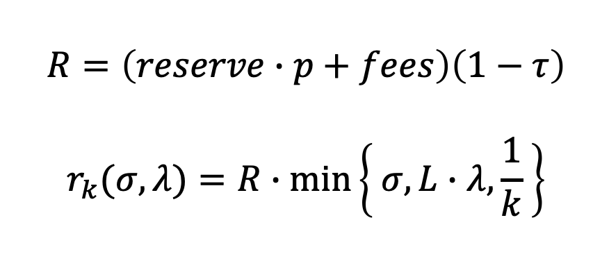
</p>

The new equation is computationally simple and purposefully does not use logarithms, exponents, or geometric curves. Instead of an incentive based tradeoff between egalitarian rewards and a perceived Sybil resilience the new equation enforces both egalitarian rewards and pledge-based Sybil resilience. A simple flat egalitarian yield ceiling with pledge leverage enforcement for Sybil defense has a profound psychological effect: Stakeholders know there is no way to game the system for yield, either individually or collectively with governance, and pledge is absolutely mandatory. Without any engineered bias Cardano decentralization would converge to the diversity of the underlying community, services, and stakeholder distribution. If this proposal is eventually adopted changes in community diversity, not changes in a formula or parameters, would change decentralization.

## Rationale: how does this CIP achieve its goals?

### Introduction of L

The $L$ parameter will establish a maximum pledge leverage before limiting rewards, similar to the k parameter for pool size. Pledge leverage establishes a different ‘saturation point’ for each pool based on its pledge. The $L$ parameter enforces the principle that growing pledge is absolutely required to support growing delegation. This change will directly align the $L$ parameter for protecting the network from Sybil behavior. The pledge leverage factor provides an enforcable limit on sybil actors and their maximum return on invested capital. Pledge will not be a statistically unnoticed slight incentive used only by a handful of large private stakeholders. Community governance to adjust leverage factor $L$ would be the preferred mechanism to constrain sybil behavior.

The new $L$ parameter will range from 10,000.0 to 1.0. The initial value of the maximum pledge leverage ratio $a0$ should initially be set conservatively high (>=100.0) and optionally decreased slightly over time to a healthy equilibrium by community governance. At $(L=100, k=500)$ approximately 680k₳ pledge would be required to support a fully saturated pool.

### The new reward equation

The proposed reward formula should be visualized on a linear(yield) vs log(saturation) scale independent of $k$. The chart below shows the field of possible outcomes for various levels of pledge and stake spanning more than 3 orders of magnitude. The effect of $L$ becomes obvious, pool saturation will be limited first by pledge amount and then eventually by $k$. A very important feature of this relationship is that 0₳ pledge will always result in 0₳ rewards. At $L=100.0$ to support a 100.0% saturated stake pool 1.0% pledge will be required.


### The new reward equation without a minimum fee


### The new reward equation zone


### The yield ceiling

The new equation is purposefully designed so that stakeholders of dramatically different size can all reach the exact same maximum yield. The yield ceiling feature prevents the formation of two classes of stakeholders and removes the economic benefits of custodial centralization. The yield ceiling is the ‘egalitarian reward’ described but not implemented by the original paper.

With the minFee < 30 once a pool grows to >0.5% of saturation the intermittent rewards will, on average, provide a competitive yield for delegators at >5.0%. At $k=500$ and $L=100$ this corresponds to a pool size 500k₳ with a minimum pledge of only 5k₳. The yield ceiling is also compatible with a potential future implementation of the Conclave collective stake pool concept. Because of the yield ceiling large collective stake pools will only provide more predictable returns, not a materially larger yield which would compete with smaller independent pools.

### Leverage-based Pool Ranking Recommendation

Pool ranking scores in wallet browsers have a significant and powerful game theory impact on delegator pool choices, yet it is often overlooked and not transparent in wallets.

When pledge becomes the most important factor for total pool size, lower leverage factors are more desirable. Lists should be sorted by leverage and presented in an descending order with the lowest leverage pools first.

#### Ranking Equation

The recommended ranking equation starts with the highest score of 10. The pools are down-ranked solely based on leverage, saturation, and fee factors.

    //equation
    ranking_score = 10 - max{ leverage_factor, saturation_factor } - fee_factor

    //variables
    leverage_factor = 10 * (pool_leverage/L)^A
    saturation_factor = 2 * (pool_stake/(saturation_stake * C))^B
    fee_factor = D * pool_fee_margin

    //parameters
    - A is 2.0, has range (0,10.0), can be tweaked
    - B is 5.0, has range (0,10.0), can be tweaked
    - C is 0.9, has range (0,2.0), can be tweaked
    - D is 50, has range (0-100) ish to be harsh, can be tweaked
    - pool_leverage = delegation / pledge
    - pool_stake = pledge + delegation
    - saturation_stake = total_live_stake/k (e.g. 68M₳ "soft-cap upper limit")
    - pool_fee_margin is in range (0-100)% (fixed fee + margin combined)

To evaluate rank using the current reward scheme:

    //current reward scheme only
    ranking_score = 10 - max{ leverage_factor , saturation_factor } - fee_factor - fixed_fee_factor

    //variables
    //if fee = minFee, term drops out
    //if fee > minFee, term nonzero but loses relevance w/ increased stake
    //fixed fee matters less to rewards as stake grows, so too here
    fixed_fee_factor = E * (fee-minFee) / stake

    //parameters
    - E is 100, has range (0,100_000), can be tweaked
    - fee cannot be less than minFee

#### A Pool's Life-Cycle

A leverage-based ranking system will create interesting pool free market business dynamics. It's envisioned a pool will undergo "business life-cycles" based on price supply and demand (fees) and leverage (pledge raising to grow the business) as described below. Currently, the yield-based pool ranking creates a market based on fees (driving yield), but not leverage, thus pools  can grow indefinitely with no "leverage ranking costs".

_A Leverage-Based Pool's Life-Cycle_
1. Start-up: Low pledge, very low leverage, very low fees, very highly ranked.
2. Growth: Gain delegation, leverage grows, rewards gained, high rank.
3. Sustainment: Raise fees, sustainable operation, moderate ranked.
4. Accumulation: Delegator surplus, high leverage, raise fees, high rewards, low rank.
5. Reset: Lower fees, increase pledge, regain low leverage and high rank. Repeat.

With the need to grow pledge to grow pool size and regain better ranking, the business cycle is cyclical indefinitely until the pool reaches max saturation based on the k-parameter.

### Oversaturation Attacks (OA)

An oversaturation attack occurs when a large stakeholder would significantly oversaturate a pool with the intention of pressuring current and future delegators to select a new pool. Limiting pool sizes based on pledge leverage provides a robust sybil enforcement, however lower saturation limits also lowers the cost of an oversaturation attack. The ultimate mitigation is not a formula modification, but instead 2-way at-will delegator acceptance staking which would allow a stake pool operator to exclude or 'veto' select stake keys. This solution has been previously discussed in the community and would benefit from its own CIP.

### The economic motivations of large stakeholders and collective pools

The new formula will not decrease the yields of any large stakeholders pledging to private pools. Large ADA stakeholders such as exchanges, liquidity pools, or smart contracts would not be required to pledge a vast majority of those holdings to earn yields currently only achievable with fully pledged pools. This property improves overall liquidity. The large stakeholders who voluntarily choose to divide their stake to dozens of community pools will also achieve more fault tolerance than self-operating a small number of centralized private pools. A number of wallets including Eternl are offering the capability to divide stake delegation between many pools.

This design decision aligns the interest of the largest stakeholders with the interests of the whole community. The only economic motivation remaining for groups with large stake including founder(s), founding organizations, exchanges, investment capital, trusts, and venture capital would be to enhance the value of the entire network by dividing delegation to secure diversification. Large stakeholders being able to divide stake without penalty to many smaller community pools will have the greatest impact on improving the effective decentralization and Nakamoto Coefficient of Cardano.

### Relevant prior CIP proposals and drafts

1. https://cips.cardano.org/cips/cip7/
2. https://github.com/cardano-foundation/CIPs/pull/163
3. https://github.com/cardano-foundation/CIPs/pull/229
4. https://forum.cardano.org/t/cip-leverage-based-saturation-and-pledge-benefit/95632
5. https://forum.cardano.org/t/cip-change-the-reward-formula/33615
6. https://forum.cardano.org/t/an-alternative-to-a0-and-k/42784
7. https://dynamicstrategies.io/crewardcalculator

### Methods and paradigms for equation validation

To validate any reward equation simulations must consider that an entity can choose to delegate to another entity, operate one stake pool, or operate many stake pools. Any new equation should be compared to the current equation with $a0=0.3$ and the current equation with minFee=0, $a0=0.0$. A large and increasing number of entities (1k - 1B) should be simulated for each trial of each equation. Additionally, during each epoch of each simulation for each equation block production should be sampled VRF-style from a discrete binomial or skellam distribution. Block production and rewards have statistical uncertainty.

```
Each equation:
  Each epoch:
    sample block production (rewards) per pool
    Each entity may choose to:
      create/retire 1 or more pools
      adjust the fee/margin structure of their pool(s)
      delegate to the pool of a different entity
```

For each equation in consideration the average (and variation) of the nakamoto coefficient, k-effective coefficient (or an entity/group based equivalent), and a sybil coefficient shall be computed for every epoch until conclusion. The sybil coefficient would quantify the fraction of stake controlled by all entities operating multiple pools excluding regulated businesses such as exchanges.

### Alternate Equation Forms and Parameter Variations

Parameter Ranges:
$k = [100 - 2000]$
$L = [10 - 10000]$
$a0 = [0.0 - 10.0]$
$bias = [0.00 - 0.95]$

#### Proposed Unbiased Egalitarian Leverage Limiting Equation:

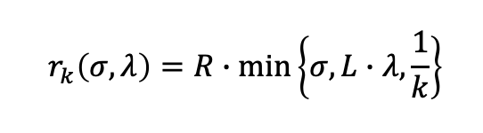


#### Current RSS Equation Form:

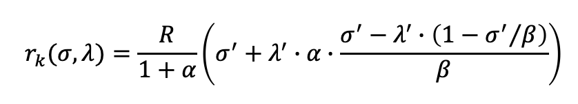

#### CIP-7 Equation Form

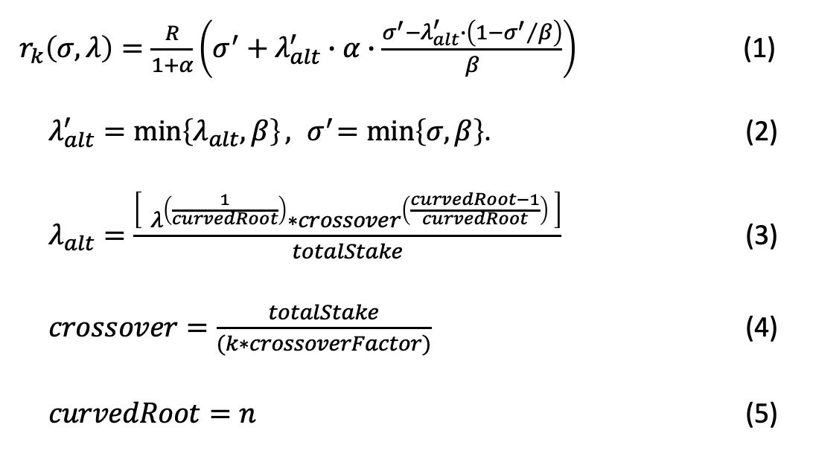

Where equations and independent variables to test are:
- Eq (1) CIP-7 Rewards: Legacy rewards equation with n-root curved pledge benefit
- Eq (2) Repurposed lambda_alt_prime, and legacy sigma_prime
- Eq (3) Lambda_alt: N-root curve pledge benefit
- Eq (4) Crossover: An expression called crossover represents the point where the new curve crosses the line of the original curve, and the benefit in the new and original equations is identical.
  - The crossover_factor is a divisor of saturation that calculates the pledge where the curve crosses the line. crossover_factor > 1.
- Eq (5) Curve_root: The n-root curve exponent used in Eq 2 to alter the rewards. 1 = linear, 2 = square root, 3 = cube root, etc.

And the recommended testing permutations are:

    For crossover in crossover_factor range [10,20,50]:
      For n in curved_root range [2,3,4]:

#### Linearly Biased Variation with a Leverage Limit:

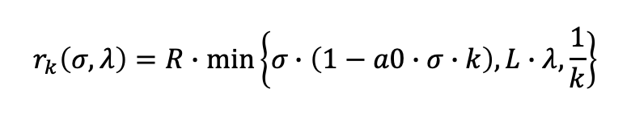

- with $k = 150$, $bias=0.05$, and $L = 50$
- with $k = 150$, $bias=0.05$, and $L = 100$
- with $k = 150$, $bias=0.05$, and $L = 1000$
- with $k = 500$, $bias=0.05$, and $L = 50$
- with $k = 500$, $bias=0.05$, and $L = 100$
- with $k = 500$, $bias=0.05$, and $L = 1000$
- with $k = 1000$, $bias=0.05$, and $L = 50$
- with $k = 1000$, $bias=0.05$, and $L = 100$
- with $k = 1000$, $bias=0.05$, and $L = 1000$


#### Linearly Biased Variation with a Diminishing Leverage Limit:

(incomplete)

#### Mahmoud Nimer Ada Link Pool Pledge to Network Pledge Reward Equation

Mahmoud Nimer's proposed reward equation presented in the [Ada Link's Stakepool Pledge Influence in Stake Rewards Distribution Paper](https://github.com/ADA-Link/Papers/blob/main/Stakepool%20Pledge%20Influence%20in%20Stake%20Rewards%20Distribution.pdf) seeks to compare pool pledge to total network pool pledge, and reward pool pledge growth relative to stake pool size growth.

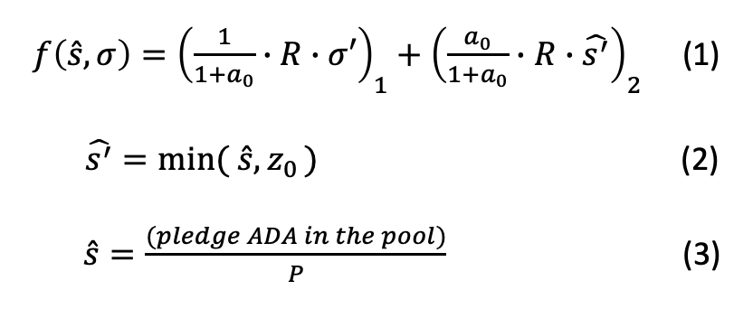

Where:
* Eq (1) The Nimer Rewards Equation
* Eq (2) s_hat_primt: The pledge saturation equation
* Eq (3) s_hat: Pool pledge / Total Network Pool Pledge

## Path to Active

### Acceptance Criteria

- [ ] The change for the new equation is implemented in the ledger and has been activated through a hard fork.

### Implementation Plan

Implementation will occur in two distinct phases with the first phase being only parameter changes requiring no hard fork. During this first phase any changes will be reversible. The second phase will require a hard fork. The implementation of this proposal must be smooth, justified, staged, deliberate, and well communicated through advertising and education.

Each change in the implementation schedule should include clear communication to the community on expectations. Transparent education on how the parameters will work and the effect on rewards is important.

1. Get statements of support from a large fraction of the Cardano community.

Although we haven't entered the Voltaire era yet, we should still reach community concensus.

2. Reduce minFee from 340₳ to 0₳.

Reducing the mandatory minimum fee to 0 will allow smaller pools to become more competitive while allowing each individual pool to select an appropriate fixed fee.

3. Create an open source simulation suite to benchmark all of the possible equation forms and parameter variations.

4. Competitively evaluate, compare, contrast, and analyze the results of all possible equation forms and parameter variations.

5. Include the community in selecting the winning equation form and parameter set.

6. HARDFORK implementation of the new equation and parameter set.

7. Measure decentralization, gather community feedback.

8. Slightly adjust parameters by at most approximately 5% every 10 epochs until the end of Voltaire.

10. After Voltaire adjust parameters annually/bi-annually by community vote.

### List of Potential Reviewers:

- Aggelos Kiayias
- Aikaterini-Panagiota Stouka
- Charles Hoskinson
- Christia Ovezik
- Colin Edwards
- Duncan Coutts
- Elias Koutsoupias
- Francisco Landino
- Lars Brünjes
- Mark Stopka
- Philipp Kant
- Shawn McMurdo
- Tobias Francee
- Tom Stafford

## Copyright

This CIP is licensed under [CC-BY-4.0](https://creativecommons.org/licenses/by/4.0/legalcode)

Copyright 2022 - Michael Liesenfelt
