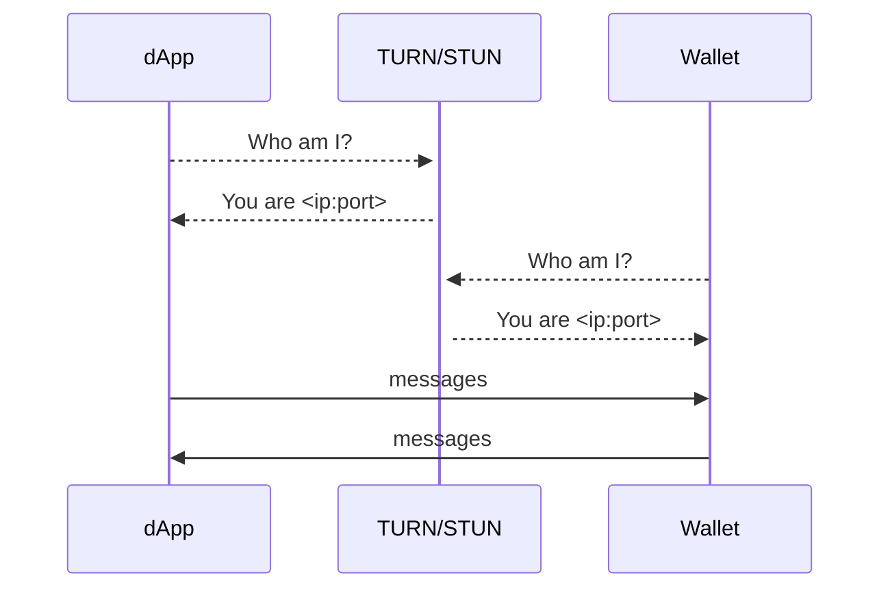
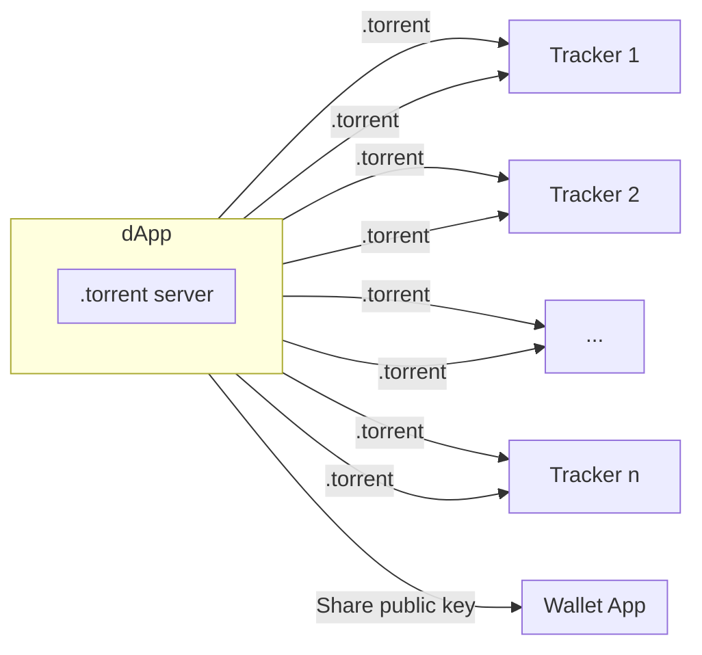
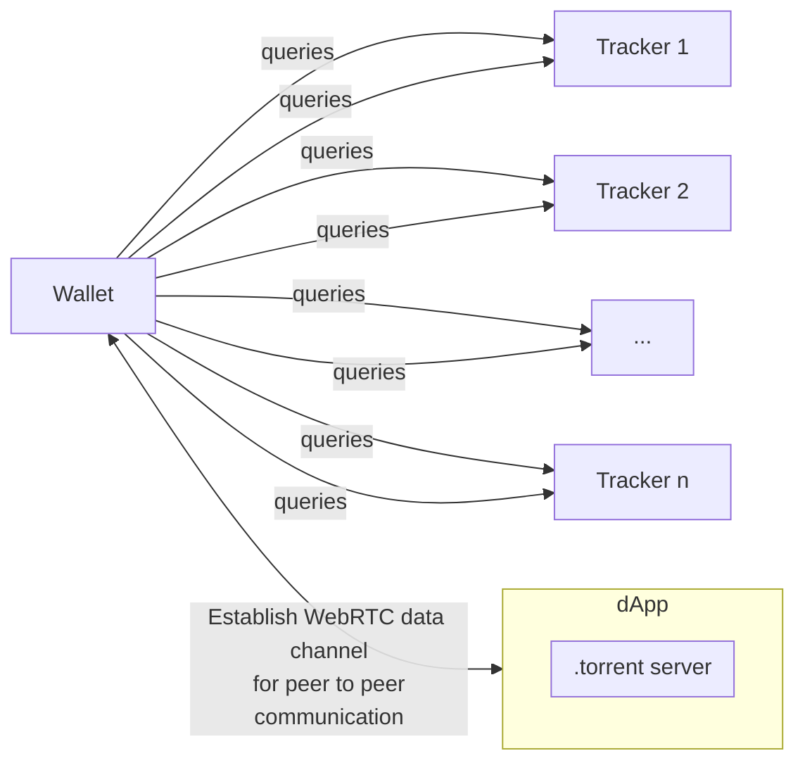
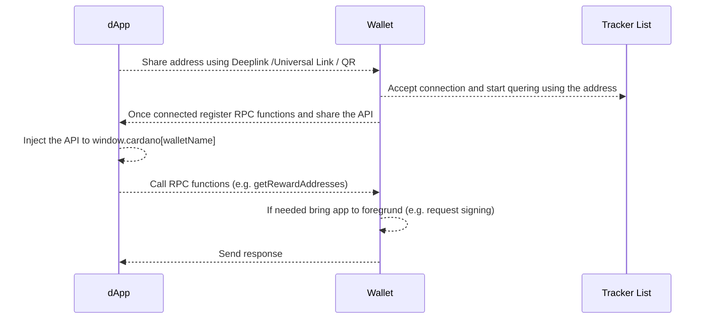

# Abstract

In a decentralized ecosystem a communication between wallet apps and dApps is still challanging. The inter-app communication on mobile devices does not directly allow remote procedure calls and is mostly resticed to Universal Links (iOS) or Deeplinks (Android). State-of-the-art solutions like WalletConnect tackle these problems using WebRTC communication which also works across devices, but requires a central signaling server (STUN or TURN server) to estalblish a WebRTC connection. In this CIP we want to introduce an architecture which uses WebTorrent trackers for peer discovery to remove the need of this central component. 

# Architecture

## Establish a WebRTC Connection Using a STUN/TURN Server



The data will be send peer to peer via a WebRTC data channel once the ip discovery has been finished. E.g. WalletConnect expects/provides a relay server URL to initialize the connection. While this method allows dApps to communitcate peer-to-peer with wallets it also leads to a [possible SPOF](https://twitter.com/walletconnect/status/1407279853943001088?lang=en).

## Establish a WebRTC Connection Using WebTorrent Tracker



Deeplinks, Universal Links or even a QR code could be used to share the public key. The wallet app would query a list of trackers using the public key to establish the WebRTC connection. Once this is done, the data is sent peer-to-peer via the WebRTC standard (e.g. to invoke RPC calls).



## Proof of Concept 

The idea of using WebTorrent trackers instead of STUN/TURN servers for peer discovery was already mentioned in [Aug 2018 by Chris McCormick](https://mccormick.cx/news/entries/on-self-hosting-and-decentralized-software):
 "I've also been tinkering with WebTorrent. [...]
Working with this technology made me realise something the other day: it's now possible to host back-end services, or "servers" inside browser tabs. [...] So anyway, I've made this weird thing to enable developers to build "backend" services which run in browser tabs"

McCormick's idea has been developed and open sourced as a library called [bugout](https://github.com/chr15m/bugout/) (MIT).

For this proof of concept we wrote two small pieces of software:

- A html page aka the dApp
- An ionic react app (to target mutliple devices) aka the wallet app

### dApp

The dApp consists of a standard HTML5 template including the following lines of code:

```html
<script src="https://chr15m.github.io/bugout/bugout.min.js"></script>
<script>
    var bugout = new Bugout({ 
        seed: localStorage["poc-server-seed"],
        announce: [
            'udp://tracker.opentrackr.org:1337/announce', 
            'udp://open.tracker.cl:1337/announce', 
            'udp://opentracker.i2p.rocks:6969/announce', 
            'https://opentracker.i2p.rocks:443/announce',
            'wss://tracker.files.fm:7073/announce',
            'wss://spacetradersapi-chatbox.herokuapp.com:443/announce',
            'ws://tracker.files.fm:7072/announce'
        ]
        });
    localStorage["poc-server-seed"] = bugout.seed;

    var connected = false;
    bugout.on("connections", function (clients) {
        if (clients == 0 && connected == false) {
            connected = true;
            console.log("[info]: server ready");
            console.log(`[info]: share this address with your wallet app -> ${bugout.address()}`);
        }
        console.log(`[info]: ${clients} clients connected`);
    });

    bugout.register("api", function (address, args, callback) {
        const api = { version: args.api.version, address: address }

        for (method of args.api.methods) {
            api[method] = () => new Promise((resolve, reject) => {
                bugout.rpc(address, method, {}, (result) => resolve(result));
            });
        }

        window.cardano = window.cardano || {};
        window.cardano[args.api.name] = api;
        console.log(`[info]: injected api of ${args.api.name} into window.cardano`);
    });
</script>
```

### Wallet App

The wallet app is a standard ionic react app built by the ionic cli:

```zsh
ionic start WalletApp blank --type=react
cd WalletApp
npm i bugout
```

The following lines of code were added to the index.tsx file:

```js
const bugout = new Bugout(
  "<HASH provided by the dAPP>", {
    announce: [
      'udp://tracker.opentrackr.org:1337/announce', 
      'udp://open.tracker.cl:1337/announce', 
      'udp://opentracker.i2p.rocks:6969/announce', 
      'https://opentracker.i2p.rocks:443/announce',
      'wss://tracker.files.fm:7073/announce',
      'wss://spacetradersapi-chatbox.herokuapp.com:443/announce',
      'ws://tracker.files.fm:7072/announce'
    ]
  });

bugout.on("server", function() {
  console.log("[info]: connected to server")
  bugout.rpc("<HASH provided by the dAPP>", "api", {"api": {
    version: "1.0.3",
    name: 'boostwallet',
    methods: ["getRewardAddresses"]
  }});
});

bugout.register("getRewardAddresses", (address:string, args:any, callback:Function) => {
    callback(["e1820506cb0ce54ae755b2512b6cf31856d7265e8792cb86afc94e0872"]);
});
```

This example has a few restrictions:

1. bugout is currently not compatible with Webpack 5, so polyfills are not automatically included and a react-scripts eject is needed to add them to the webpack.config.js file

2. bugout does not directly provide type declarations. There are some declarations within a [PR](https://github.com/chr15m/bugout/pull/45), but they need to be adjusted (a few parameters are not mandatory) and added to a bugout.d.ts file.
 
# User Flow



# Security Aspects

We decided to spwan the server within the dApp to force the user to manually scan a QR code (using a wallet app) or accept an "Open with <WalletAppName>" ui dialog (in case of Universal Links or Deeplinks). This prevents the user from connecting the wallet to an unwanted dApp. Additionally we need to add  a few security checks to prevent a missusage of these method.

- The wallet app needs to verifiy the origin (address) of the RPC call
- dApps should ask the user for the permission to injected the wallet names into the window.cardano object to prevent XSS attack (Maybe using a graphical representation of the wallet app address e.g. blockies)

# Discussion/Open Points

- Fork/Extend bugout to add webpack 5 and typescript support
- Maybe we should provide a general intermediate cardano-connect typescript library to provide 
    1. A check for mobile/desktop environment
    2. Depending on the environment provide interfaces for CIP 30 / and / or CIP 78
    3. Add an improved version of the server/client side code above to define a communication standard
- Identify potential security issues and attack vectors
- Check if the wallet app also reacts to rpc calls in background mode on iOS

# Copyright

This CIP is licensed under [CC-BY-4.0](https://creativecommons.org/licenses/by/4.0/legalcode)