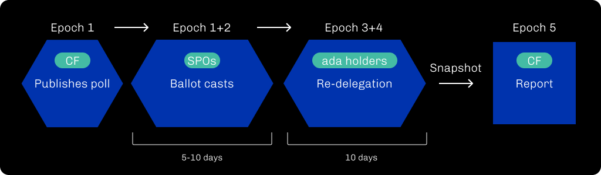

## Abstract

The Cardano Foundation proposes a mechanism for polling Cardano stake pool operators on specific topics. Polls are done on-chain through transaction metadata and authenticated through stake pool credentials (Ed25519 cold key). The goal is to gather opinions on governance matters such as protocol parameter updates. This standard is an inclusive interim solution while the work on a larger governance framework such as [CIP-1694][] continues.

## Motivation: Why is this CIP necessary?
<!-- A clear explanation that introduces the reason for a proposal, its use cases and stakeholders. If the CIP changes an established design, then it must outline design issues that motivate a rework. For complex proposals, authors must write a Cardano Problem Statement (CPS) as defined in CIP-9999 and link to it as the `Motivation`. -->

Governance is difficult. Discussions on CIP-1694 can attest to that quite clearly. There are constant debates within the Cardano community about changing protocol parameters, and the decision ultimately falls -- at this stage still -- onto the three genesis entities: Input Output, The Cardano Foundation and Emurgo. Yet, at this stage, few governance tools are at their disposal to make educated decisions. Besides Twitter polls, newsletter surveys, and SPO town halls on Discord, we have identified a gap and an opportunity to engage with the Cardano community through means currently at our disposal.

Conducting an on-chain poll between SPOs can also be seen as an experiment and an evaluation of the network's participation and engagement in the governance questions. Even though we only propose to poll one particular group of the Cardano community (the SPOs), such events can help to provide actual data to fuel the conversations around CIP-1694.

In summary, the goals are:

1. [x] to make some first experimental baby steps in the realm of governance;
1. [x] to be achievable _now_ (or an in immediate future);
1. [x] to capture participation data from SPOs;
1. [x] to raise awareness amongst SPOs regarding their future role in governance;
1. [x] to keep the Voltaire dynamics up in the ecosystem while other efforts are being pursued;
1. [x] to improve relations between the Cardano Foundation & SPOs for better mutual understanding and fruitful conversations.


## Specification

### Overview

Polls will be multiple-choice questions by The Cardano Foundation with pre-defined answers to choose from.

Here's an example of a question and answers:

- _Pineapples on pizza?_
  - [ ] yes
  - [ ] no

The serialised question and answers will be posted on-chain and signed by one of the delegate genesis keys owned by The Cardano Foundation. Answers will be provided on-chain by participating SPOs via transaction metadata referring to:

- The question and answers
- The index of the chosen answer from the available choices
- A digital signature (EdDSA) from the SPO's current cold key

> **Note**
> In this document, every time we refer to a _serialized object_, we refer to its **canonical** CBOR representation. In particular, keys in a map are always ordered alphabetically.

### Question structure

A question is posted in a transaction's metadata using the metadata label `94` and the following metadata structure:

```cbor
question =
  { 0: prompt
  , 1: [ * choice ]
  , ? "_": nonce
  }

prompt =
  [ * text .size (0..64) ]

choice =
  [ * text .size (0..64) ]

nonce =
  uint
```

A nonce is optionally included to provide non-replayability should the same question and answers be asked multiple times over different periods. The transaction carrying a question **must** be signed by one of the genesis delegate keys to be considered valid. This genesis key signature isn't captured in the metadata but in the transaction itself as an extra signatory.

For example:

<table>
<thead>
  <th>CBOR diagnostic</td>
  <th>Base16-encoded</th>
</thead>
<tbody>
 <tr>
  <td>
<pre>
{ 94:
  { 0: [ "Pineapples on pizza?" ]
  , 1:
    [ [ "yes" ]
    , [ "no" ]
    ]
  }
}
</pre>
  </td>
  <td>
   <a target="_blank" href="https://cbor.me/?bytes=A1185EA200817450696E656170706C6573206F6E2070697A7A613F0182816379657381626E6F">
<pre>
A1185EA200817450696E656170706C6573206F
6E2070697A7A613F0182816379657381626E6F
</pre>
   </a>
  </td>
 </tr>
</tbody>
</table>

### Answer structure

Similarly, an answer to a question is posted as transaction's metadata using the label `94` and the following metadata structure:

```cbor
answer =
  { 2: question_hash
  , 3: choice
  }

question_hash =
  bytes .size 32
```

Some remarks:

1. The field `2` (`question_hash`) is a blake2b-256 hash digest, whose preimage is the entire serialised question metadata payload (with the `94` top-level label).
1. The field `3` represents the 0-based index of the chosen answer from the available choices (from field `1` of the target poll).

For example:

<table>
<thead>
  <th>CBOR diagnostic</td>
  <th>Base16</th>
</thead>
<tbody>
 <tr>
  <td>
<pre>
{
  94: {
    2: h'29093fd43fc30ba31e306af06ce8537390e1668ae7496fe53d53684683c3762c',
    3: 0
  }
}
</pre>
  </td>
  <td>
   <a target="_blank" href="https://cbor.me/?bytes=A1185EA202582029093FD43FC30BA31E306AF06CE8537390E1668AE7496FE53D53684683C3762C0300">
<pre>
A1185EA202582029093FD43FC30BA31E306AF06CE
8537390E1668AE7496FE53D53684683C3762C0300
</pre>
   </a>
  </td>
 </tr>
</tbody>
</table>

The transaction carrying the answer metadata must then **be signed using a stake pool operator cold key**. Because cold key are not payment keys, it is required to specify an extra required signer on the transaction (transaction's field number 14 as per [Babbage's CDDL](https://github.com/input-output-hk/cardano-ledger/blob/cffa75fdbd800cda60997791e51bf02f2af0c42b/eras/babbage/test-suite/cddl-files/babbage.cddl#L66)) to prevent malicious nodes from potentially propagating transactions without the necessary key witnesses.

Alternatively, operators that are unable to sign arbitrary transactions due to hardware limitations can opt for stake pool update-registration certificate and attach the transaction metadata to it. Because an update-registration requires a signature from the cold key, the extra required signer field is redundant in that situation.

Regardless of the method, the signature shall be produced in an air-gapped environment only.

> **Warning**
>
> Only the first answer to a poll for each credential shall be considered. If multiple answers are found, only the first answer submitted (transaction & block ordering tallying) shall be considered.

### Adding context

It is possible to optionally attach extra context to the transaction as metadata following the procedure described in [CIP-0020](../CIP-0020/). Beside the structure specified in CIP-0020, such extra metadata is free-form and can be used to signal an intention behind a choice, or to voice a concern, or simply to give extra context. This is totally optional though we encourage SPOs to use this to inform their delegators of their choices.

### Procedure & Duration

A poll starts when a valid transaction with a question is posted on-chain. Answers can be submitted until the end of the following epoch, so there is always at least one whole epoch to answer the poll.

After one or more epochs in which the Stake Pool Operators have cast their answers, there follows a period of one or more epochs in which Cardano delegators may respond: If they disagree with the choice of their current stake pool, they can delegate to another pool. This changes the stake weight and thus influences the result. At the current state, the epochs for the answer and redelegation phase are only defined off-chain. In the future, they could also be defined as part of the signed question.



Indirectly, this results in the possibility of participation for all Ada holders.

### Outcome

The outcome of a poll will depend on its level of participation (in **terms of stake**). It is essential to understand that we explicitly call this a _poll_ / _survey_ and not a _vote_ to dispel any possible confusion. So it is akin to `1 Lovelace = 1 Voice` although we may chose to interpret data using different equations (e.g. giving more weight to pledged stake). How the data is interpret is deemed out of the scope of this proposal which aims mainly at producing the data-points. Further conversations and debates will be needed regarding interpretation of the data-points.


This proposal does not introduce a change in the current governance scheme: it is still up to the three genesis entities to make a final call based on the poll results. Poll results will provide new data points to feed into the conversation. But, regardless of the outcome, any decision will be explained and motivated by other auditable sources of information. And on-chain polls will provide such an auditable source.

## Rationale: How does this CIP achieve its goals?

### Recording question & answers

The proposed process will permanently record questions and their answers on-chain by leveraging existing transaction metadata. Note that we consciously do not record any element as datums. There are several reasons for this:

1. Datums offer extra programmability (for being available in Plutus script context); this is not needed at this stage.
1. Following a _keep-it-simple_ strategy, we propose relying on well-known and well-supported transaction features (a.k.a metadata) for producers and consumers.
1. Storing data in datums / UTxO has a non-negligible cost; naive datum storage would create thousands of new dummy UTxO on each poll. Transactions are cheaper to store and consume.
1. Polls rely on slot order when tallying answers, which means that chain sync is needed anyway, and there's no strong argument for having this information readily available in the UTxO graph.

### Cold key signing vs VRF proving

There have been several (on-and-off-the-record) discussions regarding using the cold key (Ed25519) vs the VRF key as authentication instruments; and arguments for both.

On the one hand, some prefer the use of the cold key because:

- The cold key is meant to authenticate stake-pools activity (e.g. certificate registrations/updates).
- It is ultimately the cold key that identifies a pool; its hash is the _pool id_.
- The VRF is more likely to be compromised, hence granting rights to participate in a poll to potential adversaries.
- Cold keys are Ed25519 keys, which allows piggybacking on the existing protocol's capabilities for transaction witnesses (extra required signer + verification key witnesses).

On the other hand, arguments for using the VRF key were already discussed as part of [CIP-0022][]:

- Because it's a hotkey, the VRF is usually more accessible, so it is more likely to lead to higher participation in surveys and no exposure of the cold key is needed.
- Blocks contain VRF proofs, which serve as explicit pool identifiers.
- It is only necessary to check that a key is correct at the moment of the poll, making VRF keys perfectly suitable.

We originally opted for a hybrid solution (as visible in input-output-hk#5050) but later decided to drop the VRF option to rely solely on cold key signing (see input-output-hk#5132). The reason for that regards the possible uncertainty of promoting (ab)use of VRF proving in the cardano-cli on such a short time period (see also [Insecurity of secret key re-usage](https://www.essentialcardano.io/article/insecurity-of-secret-key-re-usage)).

This has the unfortunate effect of making this participation procedure harder for SPOs relying on cold storage but we are open to the idea of proxy-keys authenticated off-chain through a challenge similar to [CIP-0022][].

#### KES Signing

There's a third on-chain element which we could use for identifying SPOs which is a digital signature from their KES credentials. It is however a bit more annoying to leverage mainly because KES are meant to expire and are only loosely tied to pools by operational certificate. Thus, verifying KES signatures on a survey requires a more complex setup and monitoring to keep track of operational certificates and their validity at the time of the survey.

If this CIP was meant to NOT be an interim solution, this is something we would likely consider. However, given the timeframe we're looking at and the overall trade-offs in complexity, we have opted out of using the KES as an authentication mechanism in this iteration.

#### Proxy keys

Another possible alternative to what's described in the CIP would be to have SPOs register a proxy Ed25519 key and use that proxy key onward. The validity of the proxy key registration would be conditionned to the production of an associated VRF proof or a digital signature from the cold key (very much like it's done for operational certificate).

Yet, like the KES alternative, this option is in conflict with some of the design goals of this CIP: simplicity. All the more so given that we want to maximise participation of SPOs to the various surveys. We aim to make the process of participating to the survey as simple as possible, without compromising on security.

> **Note** Both alternative options for KES Signing and Proxy Keys may be re-considered in a future version of the survey. Especially if the solution turns out to be not _as temporary as intended_. Fortunately, the current design decisions do not preclude this from happening as it shall be possible to introduce two new witness types `6` and `7` for those purpose. The KES registration can be handled through a separate on-chain event.

### Security

#### Replayability

Questions are meant to be unique, achieved using an optional nonce. It is up to the genesis entity conducting the poll to ensure the formulated question is unique. If the same question is asked several times, the nonce provides non-replayable protection.

Then, because every answer contains a (unique) hash of the question, answers are unique too. Yet, it still means that the same answer can be recast multiple times (possibly, by another system actor), so we do not allow answers to be changed/cast multiple times. The only exception is when answers are authenticated again using a cold key.

#### Credentials exposure

Exposure to SPOs' secret credentials must be limited, and their manipulation shall be done carefully. This potential attack vector is why we propose to extend the `cardano-cli` and have support for these features scrutinised by existing core maintainers and other open source actors.

Other tools are then free to replicate the approach taken in the cardano-cli, but we recommend that SPOs proceed with extreme caution when using third-party tools. In particular, any tool should be able to work fully offline to produce the required metadata. Final transaction construction and submission shall be made in any suitable environment, yet the metadata's production shall be done only in air-gapped systems.

## Path to Active

### Acceptance Criteria

- [x] The Cardano Foundation has conducted a first trial poll on mainnet ([CardanoScan](https://cardanoscan.io/spo-polls/96861fe7da8d45ba5db95071ed3889ed1412929f33610636c072a4b5ab550211) / [AdaStat](https://preprod.adastat.net/polls/62c6be72bdf0b5b16e37e4f55cf87e46bd1281ee358b25b8006358bf25e71798))
- [x] Visible agreement and engagement from a large set of SPOs
  - [x] Multiple SPOs workshops
  - [x] ~800 stake pools participating on the first mainnet poll
  - [x] ~11B stake answered the first mainnet poll

### Implementation Plan

- [x] Provide a reference implementation for the signing method
  - [x] [`cardano-cli`](https://github.com/input-output-hk/cardano-node/tree/master/cardano-cli#readme) [has been updated](https://github.com/input-output-hk/cardano-node/pull/5050) to provide support for constructing and signing relevant transactions.
  - [x] Created [scripts to crawl the chain](https://github.com/cardano-foundation/CIP-0094-polls/tree/main/crawler#cip-0094-chain-crawler) for results.

- [ ] Possibly add support for KES signing as an alternative to EdDSA from the cold key and the VRF proving.

#### Tools Support

- [x] [`cncli`](https://github.com/cardano-community/cncli) has been updated with similar support
- [x] [`CardanoScan`](https://cardanoscan.io/spo-polls) now lists available and past polls directly on their web UI.
- [x] [`AdaStat`](https://preprod.adastat.net/polls) now lists available and past polls directly on their web UI.
- [ ] [`cardano-signer`](https://github.com/gitmachtl/cardano-signer) might be updated with similar support

#### Test runs

- [x] Announce a testnet run (on Preprod) and invite SPOs to a workshop session to conduct a testnet poll.
  - See the [Preprod poll on AdaStat](https://preprod.adastat.net/polls/62c6be72bdf0b5b16e37e4f55cf87e46bd1281ee358b25b8006358bf25e71798).
- [ ] ~~Possibly do a second test run, but on mainnet this time.~~

## Copyright

This CIP is licensed under [CC-BY-4.0][].

[CIP-1694]: https://github.com/cardano-foundation/CIPs/pull/380
[CIP-0022]: https://github.com/cardano-foundation/CIPs/pull/102
[CC-BY-4.0]: https://creativecommons.org/licenses/by/4.0/legalcode
[Apache-2.0]: http://www.apache.org/licenses/LICENSE-2.0
