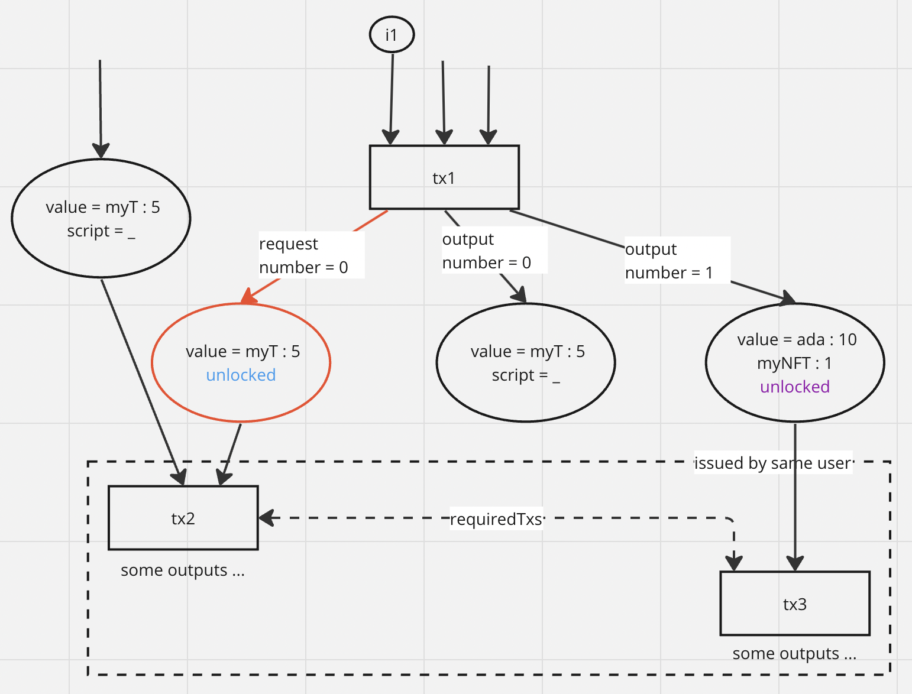
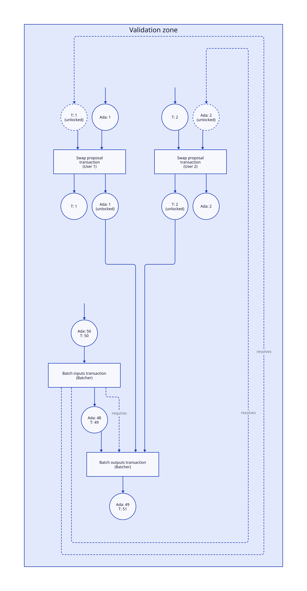

## Abstract

We propose a set of changes that revolve around validation zones, a construct for allowing
certain kinds of _underspecified transactions_. In particular, for the Babel-fees usecase
we discuss here, we allow transactions that specify
_part of a swap request_. A validation zone is a list of transactions such that
earlier transactions in the list may be underspecified, while later transactions must
complete all partial specifications. In the Babel-fees usecase, the completion of a
specification is the fulfillment of a swap request.
We discuss how validation zones for the Babel fees usecase can be
generalized to a template for addressing a number of use cases from CPS-15.

## Motivation: why is this CIP necessary?

This CIP provides a partial solution to the problems described in CPS-15.
In particular, it describes some ledger changes that allow intent settlement
of intents that require “counterparty irrelevance”, including many of the swap use cases
and dApp fee sponsorship. The motivation behind designing this solution is _Babel fees_,
which is a requirement to support "paying transaction fees in a non-Ada currency".
The Babel-fees usecase is a special case of a swap. Supporting swaps is very desirable functionality for cryptocurrency
ledgers.

Some of the primary contenders for implementing swaps
are two-way off-chain communication (co-signing a single swapping transaction),
smart contracts implementing DEX functionality, or ledger changes implementing
an on-chain order matching DEX. We argue that our solution is the most versatile,
least expensive for users, and maintains formal guarantees
of the current Cardano ledger, among other benefits.

We discuss additional possible solutions to problems outlined
in CPS-15 that could make use of much of the same validation zones infrastructure,
but with varying kinds of underspecified transactions.

## Specification

### Requests and Fulfills

We define the type of requests, which is the same as the type of outputs, `Request := Output`.
We add a new field to the transaction body, called `requests`,
which has the same type as the structure containing transaction outputs, `Ix -> Request`,
which enumerates requests in a transaction using natural number indexes.

A request is included for the purpose of _requesting funds_ from another transaction to complete a swap,
in the amount specified in the value field of the request. For most swaps, the
script locking the output is trivial (always returns `True`), since the idea
is that anyone should be able to fulfill a swap request. We refer to an output
locked by this type of script as `unlocked`.

The amount of currency a transaction is offering to swap for the requested amount
is usually placed in an unlocked _regular_ output.

We also define the type of fulfills, which is the same as the type of inputs, `Fulfill := Input`.
We add another new field to the transaction body, called `fulfills`,
which has the same type as the structure containing transaction inputs, `\powerset Input`.

Requests and fulfills are examples of a way to submit and resolve specific kind
of _intents_. Whenever we discuss changes that are specific to the Babel fees/swaps
usecase, we will refer to requests and fulfills. When generalization is
possible, we say intents.

### Validation zones

A validation zone is a list of transactions. This structure replaces singleton transactions
as a unit of validation. Specifically, instead of singleton transactions,
validation zones are

(i) sent across the Cardano network
(ii) entered into a mempool, and
(iii) placed in block bodies.  

When validating a zone (i.e. for placement in the mempool or when validating an
incoming block), each transaction is checked against the current ledger
state, however, additional checks
are done at the zone level.

Note that it may be possible that a part of a (valid) validation zone itself constitutes
a valid validation zone, e.g. if the full zone contains no intents and therefore
no resolving transaction. Such a zone, when observed on the network, can be
deconstructed into smaller zone(s), which can be re-transmitted on the network.
This is, however, considered an entirely new validation unit.

### Temporary Zone Structures

A transaction may be  
submitting or resolving intents (possibly simultaneously, for distinct intents).
In the process of zone validation, unresolved intents in transactions are recorded in
_temporary data structures_.
These structures cannot be communicated across zones,
and must be empty after applying the final transaction of a valid zone, i.e.
all intents are resolved. Since transactions
within a zone manipulate these temporary structures, it may be impossible to
determine if a transaction is valid outside of a zone, or if a zone can/will ever
be completed by future transactions (resolving the temporary structures).

In the Babel fees/swaps usecase,
processing of fulfills and requests is done in the same way as processing
regular transaction inputs and outputs within a given ledger state. However,
since unresolved requests do not belong in the UTxO set,
this is done using a separate temporary zone structure similar to the UTxO set,
`FRxO := UTxO`.

- more stuff about temp  

### Required transactions

We add a new field to the transaction body, `requiredTxs`, which is a set of transaction IDs.
The required transactions field is illegal outside a validation zone.
This field is included in the script context. This field specifies the transactions
that must be included in the zone in addition to the one being validated.

**Alternate Design (Decision Required)**. The `requiredTxs` design described above cannot be used to
create an _atomic batch_ of transactions, i.e. one that guarantees that
if one transaction is included in the zone, all the transactions in the atomic batch are
necessarily included in that zone.
This is because constructing an atomic batch using this field leads to a circular
dependency in specifying the `requiredTxs` field of all the transactions in a
batch, as they must include each others' IDs in the computation of their own IDs.
This design is nevertheless sufficient for the purpose of the Babel
fees/swaps usecase, as its implementation only relies on unidirectional
(non-circular) dependencies.

Depending on whether atomic batches are a desirable feature, an alternate design
may be implemented. In this design, `requiredTxs` is included in the transaction,
but not the body of the transaction. Then, a signature is computed on the combination
of the transaction ID and the `requiredTxs` field (instead of just the ID).

### New Plutus Version

A in the case of any ledger changes involving new transaction fields, a new Plutus
version will be necessary to implement this CIP. The necessary changes to
the latest existing version (V3?) include :

- a new script purpose, `Fulfills`, for indicating that a script locking a request
is being executed
- adding all new fields (`requests`, `fulfills`, `requiredTxs`) to the script context

Transactions using the new fields cannot execute scripts written in previous Plutus versions.

### Transaction Dependencies

There are three types of dependency between transactions which we will want to talk about.

We say that transaction B is *validation-dependent* on transaction A whenever
A must be applied to update the UTxO in ledger state before B for the reason that
B either consumes an output of A, or B consumes an output of another transaction
that is validation-dependent on A.

We say that A is *value-dependent* on B whenever
B must be applied to update the ledger state before A, and
B either fulfills a request of A, or B fulfills a request of another transaction
on which A is value-dependent. This is called a value dependency because B provides
the funds A is requesting, so A cannot be valid unless the subsequent transaction
B provides these funds.

We say that A is *requirement-dependent* on B whenever A includes the ID of
B in its `requiredTxs` field.

### Ledger Rule Changes

Validating a zone proceeds as follows:

#### 1: Check all zone-level properties

The following zone-level properties are checked:

1. (Value order) The transactions can be value ordered.
2. (Required transactions) For every transaction, all the transactions listed in `requiredTxs` are present in the zone.

If any of these fail, the zone is invalid.

#### 2: Validate transactions for phase 1

All transactions are validated for phase 1 checks; only then are they validated for phase 2.
If any transaction fails at any point, then the zone is invalid.

We add the following additional phase 1 checks:

1. (Resolving UTXIs) A resolving output must match with a UTXI that has already seen in the zone and has not already been resolved. The credential of the UTXI must be satisfied; this may incur a phase 2 check as usual.
2. (No leftover UTXIs) After checking the final transaction in a zone, there must be no remaining UTXIs that have not been resolved.
3. (Safe collateral) All collateral inputs come from outputs outside the zone.
4. (Excess collateral) The collateral required for a transaction containing scripts is increased: the base amount is now based on the fee for the transaction and _every transaction it has a transitive validation dependency on_ within the zone.

#### 3: Validate transactions for phase 2

Transactions are validated for phase 2 as usual.

If one of the transactions is phase-2 invalid, then the following occurs:

- The node constructs an invalidity witness for the transaction. This consists of the invalid transaction, along with every transaction that it has a transitive validation dependency on from within the zone.
- The node posts the invalidity witness to the chain and claims the collateral associated with the failing transaction.

### Network Requirements and Changes

Zones replace singleton transactions as units sent across the network. Zones must
therefore have IDs (e.g. zone hashes) for a node to determine whether it has
already downloaded the corresponding zone based on an ID it is observing on the network.
To maintain network functionality, zone sizes must be limited by the current `maxTxSize`
protocol parameter.

**Decision Required**. Is this an acceptable restriction for the usecases we
want to support?

## Rationale: how does this CIP achieve its goals?

### Design

#### Value flow

The requirement that validity zones must be value-orderable ensures that we do not allow any value flow in the ledger that was not possible before.
Value always flows from inputs to outputs, and there are no loops.
We can see this because value ordering shows that we could produce a “normal” series of transactions by reordering the zone and translating unresolved inputs and resolving outputs into normal inputs and outputs.

What we gain is the ability to specify and authorise this normal value flow in an out-of-order fashion.
Alice (whose transaction comes later in the value flow) can create their transaction first and send it to Bob (whose transaction comes earlier) and he can put them together into something valid.

The value ordering requirement is the major driving difference between the design in this CIP and the one published in the "Babel Fees via Limited Liabilities" paper.
Both designs make use of the idea of “negative” inputs of one kind or another, but the liabilities’ design enables and embraces the possibility of loops in the value flow.
It is difficult to make this secure, which led to the painful restriction that minting policies be run in many cases where liabilities are used.
In practice that meant that many swap use cases could not be used with old tokens whose minting policies would not approve the new behaviour.

Similarly, the liabilities design allowed easy access to arbitrary “flash loans” in Ada, which has often been a source of attacks on other blockchains.

In contrast, if transactions can be value ordered then we know that nothing fundamentally new is possible here and we do not need to worry.

Unfortunately we can't require zones to be submitted in value order because we need them to instead be in validation order so that the ledger can process them one-by-one.

#### Counterparty irrelevance

Specifying transactions out-of-order allows us to leave more parts of a transaction unspecified.
We are used to not specifying where the outputs of transactions go, now we can not specify where the inputs of transactions come from.

Not knowing where an output or input goes to gives you “counterparty irrelevance”: you don’t have to specify who is on the other side of that part of the trade.
Again, we are used to this with outputs.
We don’t in general know who is going to spend an output, although we generally restrict that with the credential on the output.
Unresolved inputs are just the same, but for inputs.

Allowing counterparty irrelevance for inputs enables use cases where we expect someone to pay us, but we don’t know who.
An example of this is Gas Station Network-style fee sponsorship, where a dApp operator agrees to pay the script fees for its users.
Users could then create a transaction with an unresolved input covering the fees, which would later be resolved by the dApp operator.

Having counterparty irrelevance for both inputs and outputs allows us to do trades where we both give and receive assets: e.g. a swap.
However, this presents us with a problem: we cannot resolve both the input and the output in one transaction, because this would prevent value ordering.
The same transaction cannot appear both earlier and later in the value flow!

We can solve this problem with atomic (indivisible) transaction groups: then we can use two transactions, one earlier and one later, but bind them together so that they cannot be split apart.

#### Atomic transaction groups

The required transactions feature enables us to bind transactions together such that they must be included either all together or not at all.
We do this by creating a dependency loop, but without creating a loop at the level of value flow.
We can construct dependency loops either just using required transactions, or by using the dependencies created by normal value flow and augmenting them with required transactions (e.g. tx A spends an output of tx B; tx B requires tx A; now we have a loop and hence atomicity).

The design is heavily inspired by [atomic transaction groups in Algorand](https://developer.algorand.org/docs/get-details/atomic_transfers/).
Algorand’s design is equivalent to ours with the additional restriction that every transaction in the “group” must require every other transaction.
We don’t want every transaction in a validity zone to require every other transaction, so if we were to use Algorand’s design we would need an additional kind of container for transactions to bound the atomic group.

In contrast, by allowing transactions to have a specific list of stated dependencies, that means that it is legal for transactions in the zone to _not_ state any dependencies, which the normal case for us.
That means we can get away with only one kind of container: validation zones.

This design also gives us some additional power, in that it lets us express dependency graphs other than connected components, but we do not currently know of a use for this.

#### Handling validation failures

The main problem with handling validation failures is that generally we need to either apply a zone in its entirety or not at all.

That means that if we validate a transaction T1 early in a zone and then later hit a failure in a transaction T2, then we cannot just apply T1 (it might require T2!), which means we do not get the fees for the work done in validating T1.

The first thing is to flush out cheap phase 1 failures.
We don’t want to discover a phase 1 failure late in the process that forces us to discard expensive transactions where we ran scripts. So we check all transactions for phase 1 failures first.

Phase 2 failures are, as usual, annoying.
Of course, we want to claim the collateral from such a transaction if it fails.
But we need a way to take the collateral and prove that we did the right thing without applying any other transactions from the zone.

Our first problem is how to get the collateral at all.
Rule Safe Collateral helps us here: by ensuring that collateral inputs come from outside the zone, we can be sure that we will actually be able to take them if we discard the zone.

The second problem is how to ensure that we pay for the space to record the transactions that are needed by the failing transaction in the zone.
The solution here is Rule Excess Collateral: we require that transactions have enough collateral to cover earlier transactions as well.

The final problem is how to prove that the transaction really did fail.
In order to reproduce this we need all the (unapplied) transactions that came earlier in the zone. So our “failure witness” must include all of these.

#### Distribution of transactions with UTXIs

Transactions that use UTXIs (or required transactions) cannot be put on the chain by themselves: they are fundamentally incomplete.
As such, some kind of secondary networking is necessary to distribute these incomplete transactions to the counterparties who can complete them.
That is: this proposal only addresses part of the intent-settlement problem, not the intent-processing problem.

The author’s belief is that this is the right way to go because while on-chain processing systems have desirable properties (e.g. they have censorship resistance properties which cannot easily be matched by off-chain systems), designing such a system is a substantial research problem, and in the mean time it may be adequate to rely on off-chain solutions, which have other desirable properties as well.
See CPS-15 for more discussion.

#### Cancellation

For many intent-based use cases it is useful to be able to cancel an intent.
An extreme example of this is a high-frequency trading system, which would want to be able to update its bids and asks very frequently (which means cancelling the old ones).
While cancellation is really an intent-processing problem, the design here affects what cancellation approaches are possible.

Fully uni-directional systems like the one given here make cancellation hard, since the intents are standalone things that can be resolved without the user's further interaction.

There are a few approaches to cancellation that are compatible with the current design:

- Accept the lack of cancellation.
    - This is fine for use cases that don't care so much about cancellation, e.g. Babel fees: there we expect fast settlement and we don't expect the user to change their mind.
    - Contrast with e.g. Cardano itself: you can't rescind a transaction once you submit it.
- Cancel by spending an output that is required by your intent transaction, making it invalid.
    - This requires taking an expensive action on-chain, and managing the outputs that you use for this purpose.
    - Depending on whether a normal or reference input is used, different kinds of behaviour arise, e.g. many intents that all spend a normal output "race" each other, in that only one can be settled.
- Send around unsigned intents.
    - This loses the benefits of uni-directional communication, since intents now have come back to the user to sign, but allows you to cancel things by simply refusing to sign them.
- Use a trusted intermediary, who advertises intents but without some information that is needed to complete them (e.g. they strip the signatures and then advertise the unsigned version).
   - This lets the user go offline but retain many of the benefits of the previous approach.
- Set short TTLs on intent transactions so if they aren't settled quickly they become invalid.
   - This only works if you know ahead of time when you want things to expire: you can't cancel any sooner or later than that.

These approaches have different tradeoffs and different ones may be appropriate for different situations.
A full approach to cancellation would also have to consider how to notify intent-processing systems that the cancellation has occurred, so that people do not waste time trying to fulfil it.

#### Whither intents?

This CIP lays the foundation for specification and resolution of intents on Cardano.
We gain the ability to leave more parts of transactions unspecified, allowing us to express more kinds of intent.
We believe that this is a fruitful direction that we can extend in future, although we do not plan to do so here:

- Any design that has separately specified, individually incomplete intents needs some kind of structure to tell the node “here are a set of several of these things, look at them together to see that they work”. Validation zones fulfil this function.
- The general approach of gradually allowing transactions which specify fewer details seems promising. For example, we could consider trying to relax exact specifications of values into constraints.

As such, we think we can progress with this design even if we don’t have a full picture of where we might want to go with intents, although this is a significant risk.

### Use cases

In the following we will talk about “unlocked” outputs/inputs.
These are outputs/inputs locked with a credential that allows anyone to spend it, e.g. a “0 of n” native script.

#### Open (atomic) swaps

Parties A and B want to do a swap.
A offers 42 token U, B offers 12 Ada.

1. Party A creates a transaction T1 with an unlocked unresolved input I requiring 12 Ada, and with an unlocked output O containing 42 U.
2. Party A sends T1 to Party B (or to some system that eventually routes it to B).
3. Party B creates two transactions:
    - T2 has a resolving output which resolves I, and requires T3
    - T3 spends O
4. Party B submits a validation zone consisting of T1, T2, and T3

Note that:

- Party B does not need to go back to Party A to finish the swap
- Party A’s swap proposal could be fulfilled by anyone, but Party A could restrict it by putting credentials (including scripts) on I or O.

Here is a diagram for an example:

Note that this proposal does _not_ provide a way to do more advanced kinds of swap, such as limit or market orders.
These require the exact values to also be unknown (but constrained), which is not possible in this proposal.

#### DEX aggregators

This is a simple extension of the previous example.
Instead of Party A, we have a set of parties A1 ... An who want to make various kinds of swap, and a batcher, Party B, who collects these and resolves them using some source of liquidity (in this example a big UTXO).

1. Parties A1 ... An create transactions T1 ... Tn with unresolved inputs and outputs representing their desired trade, as in the previous example.
2. Parties A1 ... An send T1 ... Tn to B  (or to some system that eventually routes it to B)
3. Party B creates two transactions:
    - T(n+1) has resolving outputs for all the unresolved inputs in T1 ... Tn, and spends Party B’s liquidity UTXO O1 in order to do so, creating a new output O2 with the remainder. It also requires T(n+2)
    - T(n+2) spends the outputs from T1 ... Tn as well as O2, creating a new increased liquidity output O3
4. Party B submits a validation zone consisting of T1 ... T(n+2)

Here is a diagram of this for a case with two users.

#### Babel fees

Babel fees are just a transaction paired with a swap to cover the fees, and as such work identically to the first use case.
The main difference is likely to be at a higher level, in terms of how price discovery and order matching work.

#### DApp fee sponsorship

Party A wants to use a dApp operated by Party B (specifically, submit a transaction using a script S associated with the dApp).
Party B wants to cover the fees for this.

1. Party A creates a transaction T1 that uses script S, and has an unresolved input I which requires Ada to cover the script fees.
2. Party A sends T1 to Party B
3. Party B creates a transaction T2 with a resolving output that resolves I
4. Party B submits a validation zone consisting of T1 and T2

### Alternatives

#### Liabilities

The use cases in this CIP can all be achieved using the liabilities approach from the "Babel Fees via Limited Liabilities" paper.

The advantages of the liabilities approach are:

- More power: we can do things we couldn’t do before thanks to loops
- Built-in support for atomicity, since a “mixed” output with positive and negative quantities already creates a dependency in both directions

The disadvantages of the liabilities approach are:

- We don’t need the additional power, and indeed it is actively undesirable since it leads to security problems
- To make the liabilities approach (probably!) secure we need to run the minting policy in many situations, in particular when we create a negative quantity of a token. That means that swaps offering to buy such a token would need to run the minting policy, which means that they would likely not be possible for “old” tokens that had not prepared to allow this.

The authors’ position is that:

- The requirement to run the minting policy often is bad enough from a cost and convenience perspective, but the fact that it implicitly prevents the use of old tokens in many circumstances is extremely bad.
- The additional power is generally questionable. Most of the examples of loops in value flow that we can come up with seem more like attacks, and very few of them seem genuinely useful.

The liabilities paper also proposes an on-chain intent-processing system for Babel-fee transactions.
As previously discussed, this proposal is only focused on intent settlement, not intent processing.

#### Negative outputs

This proposal is functionally identical to a variant where instead of having unresolved inputs, we have negative outputs.
Negative outputs differ from liabilities in that they are a separate type of output which contains values with only negative quantities.

The advantages of the negative outputs view are:

- Rather than having a separate set of UTXIs, we can consider unresolved negative inputs as a kind of UTXO
- Unresolved inputs behave similarly to outputs in many ways, e.g. having credentials to control their usage

The disadvantages of the negative outputs view are:

- We need to introduce negative quantities, all ledger rules and scripts need to be aware of these. In contrast, unresolved inputs look more like normal inputs during validation of the transaction itself.
- The value ordering condition looks backwards, since we would require negative outputs to be ordered after the inputs which “spend” them. Similarly, the argument that we can view the value order as corresponding to a “normal” series of transactions is more subtle, since we would also need to translate negative outputs into inputs for that to be true.

The authors’ position is that:

- Unresolved inputs are conceptually clearer
- Both UTXOs and UTXIs are “unresolved”, and hence need access control. This is a fine explanation of their similarities, and doesn’t mean that UTXIs are “really” outputs.

#### Westberg’s “Smart Transactions”

The design from https://github.com/input-output-hk/Developer-Experience-working-group/issues/47 has a lot of similarities to ours, in particular it follows the approach where transactions have partially unspecified inputs and outputs.
However, it goes much further and proposes conditions on how those can be satisfied, as well as some kind of computed conditions for updating datums.
It also proposes that intent-processing be done by the node.

We think that we can eventually move in the direction of adding more of the intent-settlement features from the proposal (e.g. conditions on values in inputs), but we should do so incrementally: even the machinery we need to support the more limited intents in this proposal is quite substantial.

A major point of disagreement is about intent processing.
As previously discussed, this proposal only focuses on intent settlement, not intent processing.

#### A better design

It may be that the best way to implement intents on Cardano is different from the approach we are taking (transactions which leave more details unspecified).
In that case such a design might entirely obsolete this one, making it an expensive and pointless burden to maintain in future.

## Path to Active

### Acceptance Criteria

- The use cases as described here can be implemented and tested on a testnet

### Implementation Plan

- Implementation of the proposed ledger changes in the formal ledger spec
- Updated CIP Specification with full detail
- Validation with community through Intersect
- Implementation in the Cardano ledger
- Deployment to mainnet

### Software Readiness Level

## Stuff to do

Callout to community - looking for partners for off-chain stuff
- Risks
- How would it benefit us
- What guarantees are that it’ll work
- CLI

## Copyright

This CIP is licensed under [CC-BY-4.0](https://creativecommons.org/licenses/by/4.0/legalcode).
