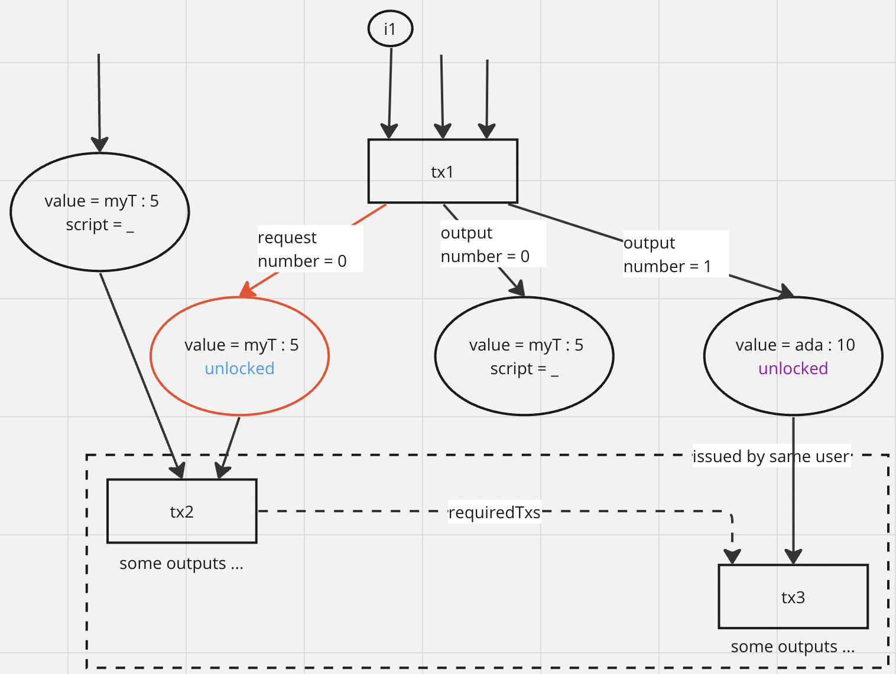

## Abstract

We propose a set of changes that revolve around validation zones, a construct for allowing
certain kinds of _underspecified transactions_. In particular, for the Babel-fees usecase
we discuss here, we allow transactions that specify
_part of a swap request_. A validation zone is a list of transactions such that
earlier transactions in the list may be underspecified, while later transactions must
complete all partial specifications. In the Babel-fees usecase, the completion of a
specification is the fulfillment of a swap request.
We discuss how validation zones for the Babel fees usecase can be
generalized to a template for addressing a number of use cases from CPS-15.

## Motivation: why is this CIP necessary?

This CIP provides a partial solution to the problems described in CPS-15.
In particular, it describes some ledger changes that allow intent settlement
of intents that require “counterparty irrelevance”, including many of the swap use cases
and dApp fee sponsorship. The motivation behind designing this solution is _Babel fees_,
which is a requirement to support "paying transaction fees in a non-Ada currency".
The Babel-fees usecase is a special case of a swap. Supporting swaps is very desirable functionality for cryptocurrency
ledgers.

Some of the primary contenders for implementing swaps
are two-way off-chain communication (co-signing a single swapping transaction),
smart contracts implementing DEX functionality, or ledger changes implementing
an on-chain order matching DEX. We argue that our solution is the most versatile,
least expensive for users, and maintains formal guarantees
of the current Cardano ledger, among other benefits.

We discuss additional possible solutions to problems outlined
in CPS-15 that could make use of much of the same validation zones infrastructure,
but with varying kinds of underspecified transactions.


## Specification


### Requests and Fulfills

We define the type of requests, which is the same as the type of outputs, `Request := Output`.
We add a new field to the transaction body, called `requests`,
which has the same type as the structure containing transaction outputs, `Ix -> Request`,
which enumerates requests in a transaction using natural number indexes.

A request is included for the purpose of _requesting funds_ from another transaction to complete a swap,
in the amount specified in the value field of the request. For most swaps, the
script locking the output is trivial (always returns `True`), since the idea
is that anyone should be able to fulfill a swap request. We refer to an output
locked by this type of script as _unlocked_. We call such an
output an _offer_ in the context of a swap.

The amount of currency a transaction is offering to swap for the requested amount
is usually placed in an unlocked _regular_ output.

We also define the type of fulfills, which is the same as the type of inputs, `Fulfill := Input`.
We add another new field to the transaction body, called `fulfills`,
which has the same type as the structure containing transaction inputs, `Set Input`.

Requests and fulfills are examples of a way to submit and resolve one specific kind
of _intents_. Whenever we discuss changes that are specific to the Babel fees/swaps
usecase, we will refer to requests and fulfills. When generalization is
possible, we say intents.

### Transaction Dependencies and Value Flow

A _value dependency_ graph is a directed graph `G` that has transactions (or their
corresponding IDs) as its vertices, and edges constructed as follows :

- if `tx1` spends an output of `tx2`, the edge `(tx2, tx1)` is in `G`
(this type of edge is a _validation_ edge)
- if `tx1` fulfills a request of `tx2`, the edge `(tx1, tx2)` is added to `G`
(this type of edge is a _request_ edge)

A graph `G` constructed in this way may not be simple (e.g. if a transaction spends two
different outputs of another transaction), and may or may not be
acyclic (e.g. it there is both a validation and a request edge between two transactions).

We call `G` a value dependency graph be cause it represents the _flow of value_
from one transaction to the next. Value flows from `tx2` to `tx1` when the
assets placed in an output by `tx2` are spent by `tx1`. Value flows from `tx1`
to `tx2` when a "loan" taken out (i.e. a request made) by `tx2` is repaid (i.e.
fulfilled) by `tx1`. This is because `tx1` provides the assets missing from `tx2`.


### Validation zones

A validation zone is a list of transactions. This structure replaces singleton transactions
as a unit of validation. Specifically, instead of singleton transactions,
validation zones are

- sent across the Cardano network
- entered into a mempool, and
- placed in block bodies.  

When validating a zone (i.e. for placement in the mempool or when validating an
incoming block), each transaction is checked against the current ledger
state, however, additional checks
are done at the zone level.


### Temporary Zone Structures

A transaction may be  
submitting or resolving intents (possibly simultaneously, for distinct intents).
In the process of zone validation, unresolved intents in transactions are recorded in
_temporary data structures_.
These structures cannot be communicated across zones,
and must be empty after applying the final transaction of a valid zone, i.e.
all intents are resolved. Since transactions
within a zone manipulate these temporary structures, it may be impossible to
determine if a transaction is valid outside of a zone, or if a zone can/will ever
be completed by future transactions (resolving the temporary structures).

In the Babel fees/swaps usecase,
processing of fulfills and requests is done in the same way as processing
regular transaction inputs and outputs within a given ledger state. However,
since unresolved requests do not belong in the UTxO set,
this is done using a separate temporary zone structure similar to the UTxO set,
`FRxO := UTxO`.

Suppose a transaction with ID `txId1` contains the requests `(0 ↦ r), (1 ↦ r')`,
and another transaction with ID `txId2` contains a fulfill `(txId1, 0)`.
When the first transaction is applied to an empty `FRxO`, the requests are
added, and we have

`FRxO =
((txId1, 0) ↦ r,
(txId1, 1) ↦ r')`

Once the second transaction is applied, the first entry is removed by the
fulfill, so we have `FRxO = (txId1, 1) ↦ r'`.

The UTxO state as it is currently defined does not contain a temporary
`FRxO` structure, so we define `UTxOTemp : = UTxO x FRxO`.
For this reason, we also create new data types, including `UTxOStateTemp`
and `LStateTemp`, that exist alongside `UTxOState` and `LState`, and
contain `UTxOTemp` instead of `UTxO`. These temporary
states are updated by transactions inside the zone. This design would apply
to temporary structures needed for processing other types of intents as well.

When all transactions in a
zone have been checked and applied to the `LState`, and the zone-level
constraints are checked (including that the temporary structures are empty), the zone transition  
updates the "real" `LState`. This design makes it possible for all software
that inspects the ledger state only before and after block application to remain
unaware of the existence of any temporary structures.

### Required transactions

We add a new field to the transaction body, `requiredTxs`, which is a set of transaction IDs.
The required transactions field is illegal outside a validation zone.
This field is included in the script context. This field specifies the transactions
that must be included in the zone in addition to the one being validated.
We say that `tx1` is *requirement-dependent* on `tx2` whenever `tx1` includes the ID of
`tx2` in its `requiredTxs` field. The purpose of this field is to introduce
a kind of dependency that is unrelated to value flow.

Recall that consumption of both a request and an input of a single transaction by another
transaction is forbidden. This means that to complete a swap, two separate transactions
must be constructed by the same user - one that fulfills the request, and one
that consumes an offer (usually in the form of an unlocked input). The `requiredTxs`
allows users to guarantee that if `tx1` fulfills the request of `tx`,
a transaction `tx2`, which consumes the offer of `tx`, must also be applied.
This is done by specifying that the ID of `tx2` in `requiredTxs` of `tx1.`

**Alternate Design (Decision Required)**. The `requiredTxs` design described above cannot be used to
create an _atomic batch_ of transactions, i.e. one that guarantees that
if one transaction is included in a valid zone, all the transactions in the atomic batch are
necessarily included in that zone.
This is because constructing an atomic batch using this field leads to a circular
dependency in specifying the `requiredTxs` field of all the transactions in a
batch, as they must include each others' IDs in the computation of their own IDs.
This design is nevertheless sufficient for the purpose of the Babel
fees/swaps usecase, as its implementation only relies on unidirectional
(non-circular) dependencies.

Depending on whether atomic batches are a desirable feature, an alternate design
may be implemented. In this design, `requiredTxs` is included in the transaction,
but not the body of the transaction. Then, a signature is computed on the combination
of the transaction ID and the `requiredTxs` field (instead of just the ID).


### Ledger Rule Changes

The prototype for the changes can be found
[here](https://github.com/IntersectMBO/formal-ledger-specifications/compare/polina-babel?expand=1)

#### ZONE

Currently, the top-level transaction-processing transition system in the ledger system is `LEDGERS`.
It considers a list of transactions in the block body valid whenever `LEDGER` is valid for
each transaction, checked in the order they appear in that list. We propose replacing `LEDGERS`
with

`ZONES ⊆ LEnv x LState x List (List Tx) x LState`

as the top level transition, which processes each zone in the block by
validating it with the transition

`ZONE ⊆ LEnv x LState x List Tx x LState`

The `ZONE` system includes two rules : `ZONE-V` may be applicable when all transactions are tagged with
`isValid` tag that is `True`, and `ZONE-N` may be applicable otherwise. The reason
for differentiating phase-2 valid and invalid _zones_ (and not just at the level
of individual transactions) is that it may not be possible to apply subsequent
transactions in a zone once a single transaction is found to be phase-2 invalid.
Recall that  
it is not possible to exclude only _some_ transactions from a zone in a general way,
so, unlike the existing design, the mempool is no able to reject individual zone transactions
dependent on a preceding transaction being phase-2 valid. We design the `ZONE-N`
rule to deal with this situation in a special way.

The following checks are done by both rules :

1. the sum total of the sizes of all transactions in the zone is less than the `maxTxSize`
protocol parameter (see [Network Requirements and Changes](#network-requirements-and-changes)), and
2. the collateral provided by each transaction `tx` for script execution is sufficient
to cover **all scripts in all transactions preceding `tx` in the zone, including `tx` itself**
(see [DDoS](#ddos))
3. the `LEDGERS` transition is valid for the zone environment, transaction list,
and initial `LStateTemp`, which is the initial `LState` of `ZONE` transition with the
`FRxO` set to empty in `UTxOTemp`
4. all collateral inputs must be in the initial `LState` UTxO set (see [DDoS](#ddos))

**`ZONE-V`**. This rule has additional checks :

1. there are no cycles in the transaction dependency graph (see [Flash Loans](#flash-loans))
2. all `requiredTxs` for all transactions in the zone are present

The updated state in this rule is computed by applying `LEDGERS` to the starting state,
environment, and list of transactions in the zone.

**`ZONE-N`**. This rule has additional checks :

1. the only transaction that is phase-2 invalid in the zone is the last transaction

The updated state in this rule is not the state computed by applying `LEDGERS`.
We discard that state, and instead specify the updated `LState` directly.
The only fields updated are :

1. the collateral inputs are removed from the UTxO (and change returned)
2. `fees` is updated to `fees` + the collateral amount in the last transaction of the zone

#### UTXO

The `UTXO` rule is updated to additionally check that the `fulfills`
of the transaction being processed are present in the `FRxO` set.
The `UTXO` rule checks the preservation of value (POV), which compares the `produced`
and `consumed` value for the given transaction. The POV calculation is updated by
adding

1. the sum total value in the transaction `fulfills` to the `produced` value
2. the sum total value in the transaction `requests` to the `consumed` value


#### UTXOS

The `UTXOS` rule is the one that actually computes the updates to
the UTxO state done by a transaction. The UTxO set update remains the same
as in the existing design. The `FRxO` is updated by removing
all entries that are indexed by the values in the `fulfills` of the
transaction, then adding all entries of the form `(txID, ix) ↦ r`, where
`txID` is the ID of the transaction being processed, and `ix ↦ r` is
in the `requests` of the transaction.

## System Component Changes

### Ledger

The ledger changes follow the specification changes outlined above, however,
we discuss additional things to consider in the process of integrating them into
the current ledger design in a way that follows
its principles and constraints. The prototype for ledger changes can be found
[here](https://github.com/IntersectMBO/cardano-ledger/pull/4477/files)

#### New Era

Since the validation zone/babel fees changes will constitute a hard fork, we define
a new era, `Babel`, alongside the existing ones. Everything that is unchanged is inherited from `Conway`.
Changes made to the following components require converting
certain existing types to associated types that differ across eras.

#### Block Structure

All blocks types in all previous eras contain sequences of transactions.
We must allow Babel blocks to contain zones instead.

To support this in the prototype, we've changed the block structure from:

```
data Block h era
  = Block' h (TxSeq era) BSL.ByteString

class
  EraSegWits era
  where
  type TxSeq era = (r :: Type) | r -> era
  fromTxSeq :: TxSeq era -> StrictSeq (Tx era)
  toTxSeq :: StrictSeq (Tx era) -> TxSeq era
```

To:

```
data Block h era
  = Block' h (TxZones era) BSL.ByteString

class
  EraSegWits era
  where
  type TxStructure era :: Type -> Type
  type TxZones era = (r :: Type) | r -> era

  fromTxZones :: TxZones era -> TxStructure era (Tx era)
  toTxZones :: TxStructure era (Tx era) -> TxZones era
```

This allows us to talk about an abstract collection of transactions, `TxZones`, and also specify the concrete structure on a per-era basis. For example:

```
instance Crypto c => EraSegWits (ConwayEra c) where
  type TxStructure (ConwayEra c) = StrictSeq
  type TxZones (ConwayEra c) = AlonzoTxSeq (ConwayEra c)
  fromTxZones = txSeqTxns
  toTxZones = AlonzoTxSeq

instance Crypto c => Core.EraSegWits (BabelEra c) where
  type TxStructure (BabelEra c) = Compose StrictSeq StrictSeq
  type TxZones (BabelEra c) = BabelTxZones (BabelEra c)
  fromTxZones = Compose . txZonesTxns
  toTxZones = BabelTxZones . getCompose
```

For more information, search for `CIP-0118#block-structure-0` in the codebase.

#### Transaction structure

```
data TransactionBody = TransactionBody
  { ...
  , fulfills :: Set Fulfill
  , requests :: StrictSeq Request
  , requiredTxs :: Set TxIn
  }

type Fulfill = TxIn
type Request = TxOut
```

It's important to note that this structure (the `requiredTxs` being in the `TransactionBody`, rather than alongside the `TransactionBody`) is a convenience
that allows us to sidestep difficulties with signing. It does, however, prevent us from allowing `requiredTxs` which refer to each other. This does not hinder the Babel fees use case, though.

For more information, search for `CIP-0118#tx-body-0` in the codebase.

#### Ledger State

There's a choice to be made around whether we simply add a new field for `FRxO`s to the existing `LedgerState`, or use the `LedgerStateTemp` concept from the Agda specification.

In our prototype, we've taken the `LedgerStateTemp` approach:

```
data LedgerStateTemp era = LedgerStateTemp
  { lstUTxOState :: !(UTxOStateTemp era)
  , lstCertState :: !(CertState era)
  }
  deriving (Generic)

data UTxOStateTemp era = UTxOStateTemp
  { utxostUtxo :: !(UTxO era)
  , utxostFrxo :: !(FRxO era)
  , utxostDeposited :: Coin
  , utxostFees :: !Coin
  , utxostGovState :: !(GovState era)
  , utxostStakeDistr :: !(IncrementalStake (EraCrypto era))
  , utxostDonation :: !Coin
  }
  deriving (Generic)
```

This precisely describes what the rules are doing: `FRxO`s cannot exist outside of the LEDGERS rule.

However, the alternative approach of adding the `FRxO` as a field to the `LedgerState` is also fine:

```
data UTxOState era = UTxOState
  { ...
  , utxosFrxo :: FRxO era
  }
  deriving (Generic)
```

It should be noted, however, that if this second approach is taken, an additional check should done in the ZONE rule to ensure that `utxosFrxo == ∅`.

#### CBOR

The following additions to the `.cddl` file for supporting eras should be made:

```
transaction_body =
  { ...
  , ? 23 : set<intent_fulfill>             ; New; Intent fulfillments
  , ? 24 : [* intent_request]              ; New; Intent asks/ requests
  , ? 25 : set<transaction_input>          ; New; Required transactions
  }

intent_fulfill = transaction_input
intent_request = transaction_output
fulfillment_request_transaction_output = [(intent_fulfill, intent_request)]
```

### New Plutus Version

As in the case of any ledger changes involving new transaction fields, a new Plutus
version will be necessary to implement this CIP. The necessary changes to
the latest existing version (V3?) include :

- a new script purpose, `Fulfills`, for indicating that a script locking a request
is being executed
- adding all new fields (`requests`, `fulfills`, `requiredTxs`) to the script context

Transactions using the new fields cannot execute scripts written in previous Plutus versions.
Prototype is available [here](https://github.com/IntersectMBO/plutus/compare/master...willjgould:plutus:wg/babel-fees-prototyping)

### Consensus

We do not expect that any functional changes are required for consensus - the only
change needed is likely the updating of any references to the block body type,
which will be `List (List Tx)` instead of `List Tx`.

### Mempool

The mempool must switch to operating on zones instead of singleton transactions.
It must also support adding _part of a zone_ to a block in the case of phase-2
validation failure. That is, if a phase-2 invalid transaction is encountered
during zone validation, subsequent transactions are not validated, and only the transactions
validated up to and including this first phase-2 failing one are included in the
zone. This partial zone is then included in the block.

### Network Requirements and Changes

Zones replace singleton transactions as units sent across the network. Zones must
therefore have IDs (e.g. zone hashes) for a node to determine whether it has
already downloaded the corresponding zone based on an ID it is observing on the network.
To maintain network functionality, zone sizes must be limited by the current `maxTxSize`
protocol parameter.

**Decision Required**. Is this an acceptable constraint for the usecases we
want to support?

### CLI and API

The node CLI should support the construction of the new type of transaction body,
as well as the construction and (local) validation of a zone.
The additional commands for transaction construction include supporting the
modification of the `requests`, `fulfills`, and `requiredTxs` fields.
The transaction balancing must also be modified, since there are new fields
that may now contain funds.


#### Zone Construction

Zones are either

- constructed from scratch locally (e.g. using the node CLI), or
- a (possibly incomplete) zone comes across a (non-Cardano) network, and a user
adds more transactions to it locally

The CLI should support both. Zone construction should give the user the ability to start a new zone and browse
an existing one, as well as add,
remove, and reorder transactions within an existing one. Determining the size of
a zone, and submitting a zone
to the network must be possible. Some special zone-level collateral calculation
functionality must also be implemented (see [DDoS](#ddos)).

Note that it may be possible that a part of a (valid) validation zone itself constitutes
a valid validation zone, e.g. if the full zone contains no intents and therefore
no resolving transaction. Such a zone, when observed on the network, can be (locally)
deconstructed into smaller zone(s), which can be re-transmitted on the network.
The resulting smaller zone(s), however, are considered an entirely new validation units.


### Wallet and DBSync

We do not anticipate drastic changes to either, but this requires further investigation.
The DBSync will likely need to include a way to track the zone ID of transactions it records.
While wallets should be able to construct request- and fulfill-containing
transactions, is possible that additionally, some aspects of the required off-chain
infrastructure should be supported, e.g. order-matching and communication.

### Off-Chain

The off-chain component required for the functioning of this proposal
should be made up of at least the a way for users to :

- track market prices of non-Ada tokens
- communicate (partially valid) transactions
- perform intents matching

No off-chain component design is planned as part of this CIP. The reason
for this is that we hope to encourage pluralism in the approaches to
off-chain implementation. Off-chain intents-matching solutions are also more likely
to be less restrictive and able to evolve more quickly both in their design and the
rates they offer. Different approach are likely to be preferred by
users for the details of their usecases (see [Callout to the Community](#callout-to-the-community))

## Attacks and Mitigations

### DDoS

**Off-Chain**.
Since we do not propose an off-chain component, we do not discuss mitigation of
an off-chain DDoS attack, however, we note that such an attack consists of
communicating intents that may never be fulfilled. This is because either they
offer undesirable tokens for swaps, or set prices too high. It will be difficult
to determine whether any intent _will_ ever be fulfilled, or even whether it was
created with a malicious intent (spam).

**On-Chain (Mempool)**.
The possibility of un-fulfillable intents is an important reason for
transmitting only entire zones across the Cardano network. Upon validating an
incoming zone, a node is able to
determine whether to discard it or add it to the mempool. This is not the
case for intent-containing transactions. If we were to allow the mempool to
contain intent-containing transactions outside zones, such a transaction
could be placed in a mempool indefinitely, waiting for an appropriate
partially-valid counterpart to complete the zone. An attacker could fill up
a node's mempool with such transactions, rendering it unable to record
additional incoming transactions. Zone-based validation
prevents this attack.

**On-Chain (Phase-1)**.
Since zones are size-restricted by the constraint that currently restricts the
size of a single transaction (`maxTxSize`), we assume that the phase-1 validation cost
has the same limitations as before. So, phase-1 validation of a single
zone is likely to cost the same as phase-1 validation of a single transaction
currently costs. Therefore, we conjecture that the risks of a spam attack using phase-1
invalid entities is not increased as compared to what it currently is.

**On-Chain (Phase-2)**. The mempool attack scenario describes mitigation of an attack
which results in a DDoS by using up all the node's mempool storage. Another kind of
DDoS attack which we must defend against is one that involves a malicious
party sending transactions with large (i.e. memory- or CPU-use-intensive)
failing scripts. We refer to a script failure in a transaction as a _phase-2_ failure.

In the current ledger design, this is mitigated by requiring a transaction to provide
an amount of Ada collateral that is proportional to the sum of the sizes of all
its scripts. This collateral is collected in the case of script failure.
A phase-2 transaction failure in the design proposed in this CIP may result in phase-1 validation
failures of subsequent transactions.
To address this problem, we have defined the `ZONE-N` rule of `ZONE`. It requires
that the collateral of each transaction

- comes from the UTxO set to which the _zone_, rather than the transaction, is applied
- covers the cost of running all scripts in all preceding transactions (itself included)

This guarantees that enough collateral can
always be collected the last transaction in a zone to cover all scripts that have been
run during block validation as well as during mempool validation, compensating nodes
for their validation work.

The `ZONE-N` rule only applies whenever there is exactly one invalid transaction
in the list, and it is the last one. It is not the case that we expect that a zone will always phase-2 fail at
the last transaction. Rather, a mempool should stop validating and drop transactions
that follow a phase-2 failing transaction, and constructs the block with the
truncated zone (see [Mempool](#mempool)).

Also, there is no way to check whether a `ZONE-N` valid
zone is also missing transactions that preceded the phase-2 invalid transaction
in the original zone. Only missing transactions on which the invalid transaction depends
directly or via intermediate transactions (and either via spending its outputs or
spending its requests) will cause a phase-1 failure. Dropping transactions that
aren't needed for phase-1 validation of a phase-2 invalid zone will free up space
for additional zones/transactions in a block.


### Flash Loans

A flash loan is a form of uncollateralized lending, e.g. done for the purpose of manipulating
the market price of an asset. Allowing unconstrained
combinations of transaction dependencies (both validation- and value-) makes
arbitrary flash loans possible that can easily be resolved by subsequent transactions in
the zone. This would be done by first producing a request containing the flash loan amount,
then using the loaned assets inside the zone in unconstrained ways, and finally, fulfilling
this request by a transaction that also consumes the loaned amount.
Using the loaned amount spent by the transaction to cover the requested amount
allows the preservation of value equation to balance.
In the terms of this proposal, this can be formally described as
the value dependency graph `G` for this zone contains a cycle, or in other
words, the value dependency graph of transactions in the zone cannot be partially ordered.

Our design provides protection against this type of attack.
The `ZONE-V` rule checks that there are no cycles in the transaction value dependency graph.
We note that `ZONE-N` does not perform this check because this rule applies
one transaction in the zone, and only for the purpose
of collecting collateral, which cannot perform a flash loan.

The value ordering requirement is the major driving difference between the design
in this CIP and the one published in the "Babel Fees via Limited Liabilities" paper.
The design presented in that work prevented flash loan attacks by
relying on the use of minting policies - a currency's minting policy is executed
whenever a transaction changes the total (positive or negative) amount of that currency. E.g.
if a transaction has 0 Ada in its inputs, but makes a request with the amount of Ada
it requires to pay transaction fees, the policy-running solution will not work for our design.
This is because many existing minting policies, e.g. of Ada, will fail in the usecases
we require for this CIP. Minting policies of existing tokens cannot be changed.

#### Price Manipulation and Frontrunning

Flash loans have to do with price manipulation via changing the total quantities of
tokens in existence by creating some in association with uncollateralized loans.
They can be considered a specific a kind of frontrunning.
Frontrunning, in general, has to do with the ability of certain entities to manipulate transactions
through displacement, suppression, or insertion. This amounts to manipulating
asset prices as well as controlling who gets to benefit from the trades.

We conjecture that outside of the possibility of flash loans (addressed above),
the opportunity for doing this on the Cardano network with the
CIP features implemented
are similar to that which existed prior to its implementation. Transaction
cancellation (see [Cancellation](#cancellation)) plays an important role in
preventing insertion of old (but previously unfulfilled) transactions making
requests at unfavourable prices.

As before,
every block producer gets to decide which transactions/zones will be included
in the block they are constructing, but
the specific block producer for a given block cannot be predicted ahead of
schedule. Also like in the current design, better offers are more likely to be
accepted.


#### Additional Risks

No obvious additional risks related to the expected functionality of this
proposal are predicted at this time. However, there are questions related to
community behaviour, such as the the likelihood of adoption of this feature,
and the likelihood that a robust off-chain mechanism will be build. Additionally,
there is the risk that a more general intent-processing mechanism will be
designed later on, subsuming this functionality (there are currently no competing
designs or ideas, see [Towards Better Designs](#towards-better-designs)).

## Rationale: how does this CIP achieve its goals?

### Design

We discuss a number of principles, requirements, and usecases to be supported by
this proposal.

**Supports paying fees in currency other than Ada (Babel Fees)**. This is achieved by allowing
users to construct transactions that do not spend any Ada inputs. Instead, the
transaction derives its ability to pay the fee from the Ada amount specified in its requests. Usually,
an offer is also made to compensate any user that chooses to complete the
zone by submitting a transaction fulfilling the requested Ada amount. See
[Usecases](#usecases). Recall here that two transactions are needed to engage with a
Babel fee offer - one that fulfills a request, and one that accepts the offer.
They are dependent via the `requiredTxs` field.

**Supports atomic swaps**. Atomic swaps work the exact same way as paying fees in
non-Ada currencies, with the difference being that instead of including requests of
only Ada, a user may request an arbitrary currency (and likely cover their own fees).
The swap offer can also contain an arbitrary currency.

**Counterparty irrelevance**. A desirable property expected of a system in which
atomic swaps are possible is that arbitrary users should have the ability to
engage with a swap offer, i.e.
you don’t have to specify who is on the other side of that part of the trade.
Not allowing this significantly limits the advantages of
having such a system. The design in this proposal naturally allows users to
build transactions that create both offers and requests that are unlocked,
and therefore allow arbitrary users can engage with them to perform swaps.

**Does not interfere with existing ledger features**. Our design does not make
changes to the majority of transaction application protocols, e.g.
governance, staking/delegation, etc. Introducing zone structure into block
body should not affect transaction application. More formal analysis of this
may be required.

**Value flow modification makes sense**. The updated POV update treats
transaction requests as consumed value, and fulfills as produced value. This is
in line the with the interpretation on requests as loans, and fulfills as
paying them back. Proving in Agda the POV property is in progress. We may
require an additional zone-level POV property to ensure no value-flow inconsistencies
arise in the introduction of this feature.

**Minimizes off-chain communication**. Because unfulfilled offers cannot be sent
across the Cardano network, they are transmitted "off-chain". However, two-way
communication is not required in our design. The validation zones feature can be used
by either (off-chain) disseminating a transaction with unfulfilled requests
(after which no further action is required), or observing an existing transaction off-chain, and
fulfilling its requests before submitting it to the Cardano network. Neither require
communicating with the counterparty who constructed the other transaction(s) in the zone.

**Minimizes reliance of smart contracts for key usecases**. This CIP allows
swaps to be performed without the use of smart contracts (at least ones that are
not simply unlocked), as shown in [Usecases](#usecases).
This is not only cheaper in terms of transaction size and
script-running costs, but makes it easier to make and fulfill and offer
within a single block.

**Keep order-matching logic off-chain**. Order matching is complicated task
involving many parties with possibly competing interests. Building such a mechanism
on-chain should only be done if the cost-benefit analysis is well in its favour.
For example, it appears the implementation on the [Stellar](https://stellar.org/blog/developers/introducing-automated-market-makers-on-stellar) system is not heavily used.
The Cardano platform changes we propose are fairly minor, unsophisticated, and comfortably aligned with
existing ledger design principles (e.g. predictable outcomes of transaction application).
This also allows the (off-chain) order-matching solutions to have a lot more flexibility
and adaptability.

**Mitigates Attacks**. The attacks we considered (and their mitigations) are discussed in
[Attacks and Mitigations](#attacks-and-mitigations).

### Other considerations

#### Cancellation

For many intent-based use cases it is useful to be able to cancel an intent, e.g.
for the purpose of updating bids to track changes in asset prices.
While cancellation is really an intent-processing problem, the design here affects
what cancellation approaches are possible.
There are a few approaches to cancellation that are compatible with the current design:

- Accept the lack of cancellation.
    - This is fine for use cases that don't care so much about cancellation, e.g. Babel fees: there we expect fast settlement and we don't expect the user to change their mind.
    - Contrast with e.g. Cardano itself: you can't rescind a transaction once you submit it.
- Cancel by spending an output that is required by your intent transaction, making it invalid.
    - This requires taking an expensive action on-chain, and managing the outputs that you use for this purpose.
    - This also requires being able to pay the transaction fee, which may be a problem for
    Babel fees users
    - This is not guaranteed in the case a fulfillment occurs some time between the user's
    decision to cancel and the cancelling transaction being placed into a block. The valid  
    zone including the fulfillment may make it into a block before the cancellation transaction
    (or, intentionally preferred over the cancellation by the producer)
    - Probably should come with a system to notify intent-processing systems that
    the cancellation has occurred, so that people do not waste time trying to fulfil it.
- Send around unsigned intents.
    - This loses the benefits of uni-directional communication, since intents now have come back to the user to sign, but allows you to cancel things by simply refusing to sign them.
- Use a trusted intermediary, who advertises intents but without some information that is needed to complete them (e.g. they strip the signatures and then advertise the unsigned version).
   - This lets the user go offline but retain many of the benefits of the previous approach.
- Set short TTLs on intent transactions so if they aren't settled quickly they become invalid.
   - This only works if you know ahead of time when you want things to expire: you can't cancel any sooner or later than that.

These approaches have different tradeoffs and different ones may be appropriate for different situations.
A full approach to cancellation would also have to consider how to

#### Era transition

A hard fork (era transition) is required to implement the changes proposed above,
currently implemented as a new `Babel` era.
A full set of features to be included in this era must be determined and agreed upon.
Additional development, analysis, testing, etc. will be required if more changes
are included.
So far, the validation zones proposal is not coupled with additional features.

#### Callout to the Community

Transactions containing requests cannot be put on the chain by themselves : they are
fundamentally incomplete. As such, some kind of secondary networking is necessary
to distribute these incomplete transactions to the counterparties who can complete them.
That is: this proposal only addresses part of the intent-settlement problem, not
the intent-processing problem.

The author’s belief is that this is the right way to go because while on-chain
processing systems have desirable properties (e.g. they have censorship resistance
properties which cannot easily be matched by off-chain systems), designing an intent
settlement (e.g. order-matching)
system is a substantial research problem, and may entail different optimal solutions
for different user needs. Also, the changes to the Cardano platform introduced in this CIP
are merely an improvement on existing ways of doing things. If development of an off-chain
component is done after than the on-chain changes, this will not delay users
ability to perform desired tasks. For these reasons, the implementation of the on-chain and
off-chain mechanisms do not need to be introduced simultaneously.

However, implementing this CIP must include a callout to the community to
implement the off-chain component. Here are examples of two broad categories of  
design possibilities for such a component :

- A shared database for all users to share the assets they are willing to trade and
at what rates
  - This approach is better for buyers because of transparency (market prices are easy to track)
  - Someone has to maintain this
  - Trust model is unclear
  - Not everyone will want to use it, so likely multiple matching mechanism options are needed

- Users keep track of rates and available assets privately
  - No global way to track market prices
  - Easier to order match (optimizing for a single user's profit instead of trying to be "fair")

It is likely that both options will be useful.


## Use cases

### Open (atomic) swaps

A wants to swap 10 Ada for 5 tokens `myT`.

1. Party `A` creates a transaction `tx1` with
    - an unlocked request `0` with 5 `myT` tokens,
    - an output `0` which contains 5 `myT` tokens, and
    - an unlocked output `1` containing 10 Ada
    - some inputs totalling 10 Ada
2. Party `A` sends `tx1` across some route that will get the swap offer into the hands of interested parties
3. Party `B` sees the transaction, and creates two transactions to complete the zone:
    - `tx2` fulfills the unlocked request `0` of `tx1`, and requires `tx3`
    - `tx3` spends the unlocked output `1` of `tx1`
4. Party `B` submits a validation zone consisting of `tx1`, `tx2`, and `tx3`

Note that:

- Party `B` does not need to go back to Party `A` to finish the swap
- Party `A`’s swap proposal could be fulfilled by anyone, but Party `A` could restrict it by putting credentials (including scripts) on the outputs and requests of `tx1`
- `tx1` has an unlocked output with Ada for anyone to take, but a zone with `tx1`
will not be valid unless some party also consumes the request (this is what guarantees
  the swap without the need to lock the offer)
- In step (2), we say "sends ... across some route that will get the swap offer into the hands of interested parties".
In subsequent usecases, we instead say "send ... to party X" instead to imply that X is a party that intends to
fulfill the sent intent(s), and has received them across the network.

Note that this proposal does _not_ provide a way to do more advanced kinds of swap, such as limit or market orders.
These require the exact values to also be unknown (but constrained), which is not possible in this proposal.

Here is a diagram for an example:



### DEX aggregators

This is a simple extension of the previous example.
Instead of Party A, we have a set of parties A1 ... An who want to make various kinds of swap, and a batcher, Party B, who collects these and resolves them using some source of liquidity (in this example a big UTXO).

1. Parties A1 ... An create transactions T1 ... Tn with requests and offers (unlocked outputs) representing their desired trade, as in the previous example.
2. Parties A1 ... An send T1 ... Tn to B
3. Party B creates two transactions:
    - T(n+1) has fulfilling all the requests in T1 ... Tn, and spends Party B’s liquidity UTXO `u` in order to do so, creating a new entry `u'` with the remainder. It also requires T(n+2)
    - T(n+2) spends the offers from T1 ... Tn as well as `u'`, creating a new increased liquidity output `u''`
4. Party B submits a validation zone consisting of T1 ... T(n+2)


### Babel fees

Babel fees is a specific subtype of the first usecase where the request is necessarily
a quantity of Ada. Usually, it also implies that no Ada is contained in the inputs
of the request-making transaction, and the requested Ada is used to pay transaction fees.


### DApp fee and min-UTxO sponsorship

Party A wants to use a dApp operated by Party B (specifically, submit a transaction using a script S associated with the dApp).
Party B wants to cover the fees and min-UTxO value for this.

1. Party A creates a transaction T1 that uses script S, and has request `r` which requires Ada to cover the script fees.
2. Party A sends T1 to Party B
3. Party B creates a transaction T2 that fulfills `r`
4. Party B submits a validation zone consisting of T1 and T2

Note here that no offers are present in T1 because the the point of Dapp sponsorship
is for the Dapp to cover the fees and min-UTxO value without being compensated in
other tokens (although the Dapp itself may require depositing assets into it).

### Bridges

Centralized approaches to bridging tokens across blockchains have been developed,
e.g. by [SingularityNET](https://singularitynet.gitbook.io/welcome-to-singularitynet/bridge/overview).
A decentralized approach is much more difficult due to the requirement that
there must be some way to verify data about the operation of an external piece of
distributed software (on the side of both chains involved).
This CIP makes the centralized version of the bridging process slightly more
streamlined on the side of Cardano. Let B be a _trusted_ bridge. The untrusted
case requires additional research.

1. Party A sends an transaction T1 disposing of some tokens on chain D (either by burning
  them or putting them in a special token pool) to B as well as to chain D
2. Party A sends a transaction T2 with a request for the same amount of
  tokens as in (1) on Cardano to B
3. Bridge B waits for T1 to settle on D, then submits the zone `[T2; T3]` to
  Cardano, where `T3` fulfills the request of `T2`


## Towards Better Designs

### Original Babel Fees Design
When developing this proposal based on the
[Babel fees](https://iohk.io/en/research/library/papers/babel-fees-via-limited-liabilities/)
paper, we have observed a number of clashes between ledger design principles and
the proposal in the paper, as well as possible attack vectors. The key ones are :

**Introducing liabilities**.
New ledger features must always be implemented using new transaction field, rather
than repurposing existing ones. So, _liabilities_ (which we call requests and
fulfills here) cannot be introduced by simply allowing negative quantities in
regular outputs. This also necessitates the use of a special container for these
in the ledger state, which we call the FRxO.

**Checking minting policies**.
In the original paper, we attempted to prevent flash loan attacks by forcing
the execution of minting policies for any assets for which the total negative or
positive quantities were changed. This was not a viable strategy for existing
tokens, for which minting policies would overwhelmingly be unequipped to reason
about such cases. In this proposal, we instead perform the cycle detection check
on the transaction dependency graph.


### Westberg’s “Smart Transactions”

The design [Smart Transactions](https://github.com/input-output-hk/Developer-Experience-working-group/issues/47)
has a lot of similarities to ours, in particular it follows the approach where
transactions have partially unspecified inputs and outputs.
However, it goes much further and proposes conditions on how those can be satisfied,
as well as some kind of computed conditions for updating datums.
It also proposes that intent-processing be done by the node.

We think that we can eventually move in the direction of adding more of the
intent-settlement features from the proposal (e.g. conditions on values in inputs),
but the major point of disagreement is about intent processing.
As previously discussed, this proposal only focuses on intent settlement, not intent processing.
We now briefly discuss options of how to possibly proceed in this direction.


### Validation zones for settling other types of intents

This CIP lays the foundation for specification and resolution of intents on Cardano.
It does so by establishing the concept of a validation zone - a list of transactions that
can be validated as a whole, but it is impossible to check if the individual transactions
are valid outside a zone. We conjecture that infrastructure we propose can be used for processing
other types of underspecified transactions, and therefore more sophisticated
intents. A proof of this requires a
fleshed-out design for the expanded intent-processing system, which is outside the
scope of this CIP. However, possibilities include :

- Intent transactions that allow output references to be removed and replaced with their corresponding
output data, while intent-settling transactions provide the matching output references
for those outputs to fulfill this intent. This is the ledger component of a proposal
for a light client solution.

- Intents that support more advanced kinds of swaps, such as limit or market orders,
and do not require the entire quantity offered to be swapped at once.

Supporting these sorts of intents require the definition of new types of temporary ledger
state structures, as well as changes to zone-level constraints.
We believe that this is a fruitful direction that we can extend in future, and,
as such, we think we can progress with this design even if we don’t have a full
picture of where we might want to go with intents, although this is a significant risk.
However, at this time there is no proposal for a general solution, i.e. one where introducing
the ability to process each new kind of intent does not require specific ledger
changes. Instead, the ideal intents-processing solution using validation zones
would support intents whose zone-level constraints and any temporary data that
must be recorded are specified _within the zone itself_, providing much more
flexibility in the kinds of intents that are possible.

It may be that the best way to implement intents on Cardano is entirely different from
the underspecified transactions and validation zones approach we are taking here.
In that case such a design might entirely obsolete this one, making it an expensive
and pointless burden to maintain in future.


## Path to Active

### Software Readiness Level

It is difficult to specify the SRL for this CIP because it effects each component
of the Cardano node. The kind of testing required to thoroughly analyze the
changes we propose can only be done on testnet. We estimate that the SRL
would remain between 3 and 6 until

- an era is specified into which this feature is included
- a testnet containing this feature is launched

### Acceptance Criteria

- The use cases as described here can be implemented and tested on a testnet

### Implementation Plan

- Implementation of the proposed ledger changes in the formal ledger spec
- Updated CIP Specification with full detail
- Validation with community through Intersect
- Implementation in the Cardano node in the context of a new era/hardfork
- Deployment to testnet/mainnet


## Copyright

This CIP is licensed under [CC-BY-4.0](https://creativecommons.org/licenses/by/4.0/legalcode).
