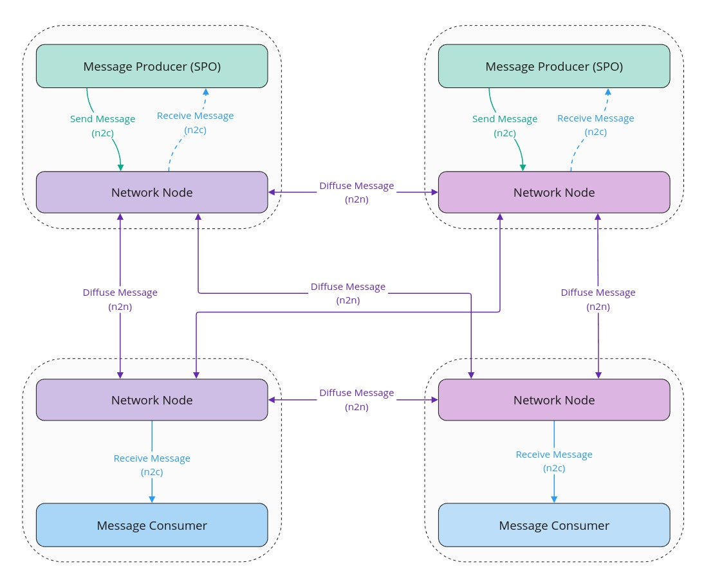
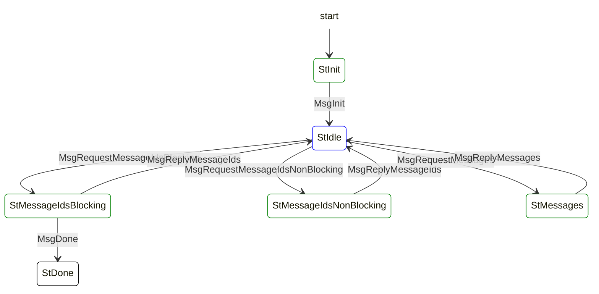
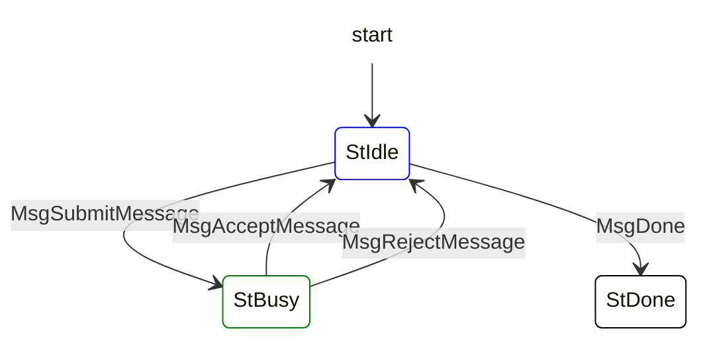
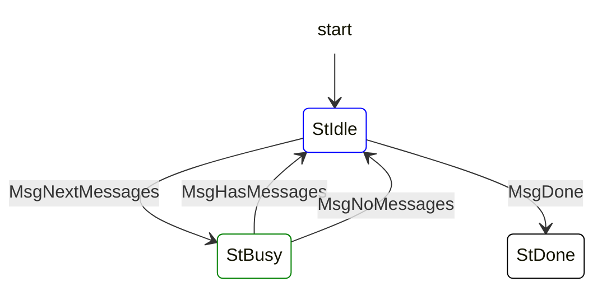

## Abstract

We propose to create a decentralized message diffusion protocol leveraging the Cardano network layer. This protocol allows to follow a topic based diffusion of messages from publishers to subscribers in a decentralized way.

The messages can be sent and received by nodes running in a non intrusive way side by side to the Cardano node in order to enable inter-nodes communications.

In this way, we can significantly reduce the cost and effort required to build a decentralised network for message diffusion by using Cardano's established infrastructure, with limited impact on the performance and no impact on the security of the Cardano network.

## Motivation: why is this CIP necessary?

Many protocols in the Cardano ecosystem need the capability to diffuse messages in a decentralized manner. However, it is not possible to diffuse any type of message from Cardano block producers to a limited subset of subscribed peers. Nonetheless, the Cardano network has a proven efficient, reliable and secure infrastructure which is used to diffuse a transaction from one peer to all the other peers in the network. This infrastructure can be leveraged to achieve the goal of diffusing other types of messages with the guarantees offered by the Cardano network and a reduced development overhead.

Mithril is a protocol based on a [Stake-based Threshold Multi-signature scheme](https://iohk.io/en/research/library/papers/mithril-stake-based-threshold-multisignatures/) which leverages the Cardano SPOs to certify data from the Cardano chain in a trustless way. Mithril is currently used in the Cardano ecosystem in order to enable fast bootstrapping of full nodes and enabling secure light wallets. The Mithril protocol coordinates the collection of individual signatures originating from the signers (run by SPOs) by the aggregators which combine them into Mithril multi-signatures and certificates. In order to be fully decentralized, the protocol needs to rely on a decentralized peer to peer network which, if built from the ground up, would require significant efforts and investment. Furthermore, the majority of SPO's, as the representatives of Cardano's active stake, will have to adopt and operate Mithril nodes alongside their Cardano node. Thus a natural solution is to use the Cardano network layer to significantly facilitate the development of the Mithril protocol without a significant impact on the Cardano network or high maintenance efforts for the SPOs. Mithril will be a fundamental first user of the proposed Decentralized Message Queue and it will be used as an illustrative example throughout this document.

Other protocols in the Cardano ecosystem, such as Leios and Peras (and probably other protocols in the future), also need the capability to diffuse messages originating from block producers in a decentralized fashion. However, in the Leios and Peras cases, the Cardano node itself is a producer and consumer of these messages. We have taken into consideration this need for a generic solution in the design proposed.

The proposed solution is described in detail below.

## Specification

### Overview



This specification proposes to create `3` new mini-protocols in the Cardano network layer:

- `node-2-node`:
  - [**Message Submission mini-protocol**](#Message-Submission-mini-protocol): Diffusion of the messages on the Cardano network.
- `node-2-client`:
  - [**Local Message Submission mini-protocol**](#Local-Message-Submission-mini-protocol): Local submission of a message to be diffused by the Cardano network.
  - [**Local Message Notification mini-protocol**](#Local-Message-Notification-mini-protocol): Local notification of a message received from the Cardano network.

> [!NOTE]
> The terms **Message producer**, **Message consumer** and **Network node** may represent different entities depending on the concrete implementation made for a specific protocol:
>
> - the **Network node** could be either the **Cardano node** itself or a **Decentralized Message Queue node** or **DMQ node** implementing the mini-protocols described in this document. Opting in for one of these possibilities will depend on a careful analysis of the impact on the security of the Cardano node, impact on the load of the Cardano network, the specific network topology needed by the protocol and the needed level of coupling with the Cardano node itself (access to ledger, consensus, ...). It's worth mentioning that each protocol will implement its own version of the **Network node** by leveraging a common implementation of the mini-protocols.
> - the message **Message producer** and **Message consumer** could be either the **Cardano node** itself or **another node** able to interact with the **Network node** through the node-to-client mini-protocols detailed in this document.
>
> Here is a summary of the meanings of these terms depending on the protocol:
> | Protocol | Message producer | Message consumer | Network node |
> |------|------|------|------|
> | **Mithril** | [Mithril signer](https://mithril.network/doc/mithril/mithril-network/signer) | [Mithril aggregator](https://mithril.network/doc/mithril/mithril-network/architecture) | [DMQ node](#information-diffusion-architecture) |

### Message Submission mini-protocol

#### Description

The node to node message submission protocol is used to transfer messages between full nodes. It follows a pull-based strategy where the inbound side asks for new messages and the outbound side returns them back. This protocol is designed to guard both sides against resource consumption attacks from the other side in a trustless setting.

> [!NOTE]
> There exists a local message submission protocol which is used when the server trusts a local client as described in the [following section](#Local-Message-Submission-mini-protocol).

#### State machine

| Agency                   |                                                                   |
| ------------------------ | ----------------------------------------------------------------- |
| Outbound side has Agency | StInit, StMessageIdsNonBlocking, StMessageIdsBlocking, StMessages |
| Inbound side has Agency  | StIdle, StDone                                                    |



##### Protocol messages

- **MsgInit**: Initial message of the protocol.
- **MsgRequestMessageIdsNonBlocking(ack,req)**: The inbound side asks for new message ids and acknowledges old ids. The outbound side immediately replies (possible with an empty list).
- **MsgRequestMessageIdsBlocking(ack,req)**: The inbound side asks for new messages ids and acknowledges old ids. The outbound side will block until new messages are available.
- **MsgReplyMessageIds([(id,size)])**: The outbound side replies with a list of available messages. The list contains pairs of message ids and the corresponding size of the message in bytes. In the blocking case the reply is guaranteed to contain at least one message. In the non-blocking case, the reply may contain an empty list.
- **MsgRequestMessages([id])**: The inbound side requests messages by sending a list of message-ids.
- **MsgReplyMessages([messages])**: The outbound side replies with a list messages.
- **MsgDone**: The outbound side terminates the mini-protocol.

##### Transition table

| From state              | Message                         | Parameters  | To State                |
| ----------------------- | ------------------------------- | ----------- | ----------------------- |
| StInit                  | MsgInit                         |             | StIdle                  |
| StIdle                  | MsgRequestMessageIdsBlocking    | ack,req     | StMessageIdsBlocking    |
| StMessageIdsBlocking    | MsgReplyMessageIds              | [(id,size)] | StIdle                  |
| StIdle                  | MsgRequestMessageIdsNonBlocking | ack,req     | StMessageIdsNonBlocking |
| StMessageIdsNonBlocking | MsgReplyMessageIds              | [(id,size)] | StIdle                  |
| StIdle                  | MsgRequestMessages              | [id]        | StMessages              |
| StMessages              | MsgReplyMessages                | [messages]  | StIdle                  |
| StMessageIdsBlocking    | MsgDone                         |             | StDone                  |

> [!NOTE]
> The `StInit` state is needed as it allows to start all outbound sides on the same side of the connection, which is needed as the information flows in the opposite direction with this special **message submission mini-protocol**. This is also the case with the **tx-submission mini-protocol** because information flows in the other direction than for headers with **chain-sync mini-protocol** or blocks with **block-fetch mini-protocol**.

##### CDDL encoding specification

```cddl
 1
 2  messageSubmissionMessage
 3    = msgInit
 4    / msgRequestMessageIds
 5    / msgReplyMessageIds
 6    / msgRequestMessages
 7    / msgReplyMessages
 8    / msgDone
 9
10  msgInit = [0]
11  msgRequestMessageIds = [1, isBlocking, messageCount, messageCount]
12  msgReplyMessageIds = [2, [ *messageIdAndSize ] ]
13  msgRequestMessages = [3, messageIdList ]
14  msgReplyMessages = [4, ]
15  msgDone = [5, ]
16
17  isBlocking = false / true
18  messageCount = word16
19  messageId = bstr
20  messageBody = bstr
21  messageIdAndSize = [ messageId, messageSizeInBytes ]
22  messageIdList = [ * messageId ]
23  messageList = [ * message ]
24  messageSizeInBytes = word32
25  kesSignature = bstr
26  operationalCertificate = bstr
27  blockNumber = word32
28  ttl = word16
29
30  message = [
31    messageId,
32    messageBody,
33    blockNumber,
34    ttl,
35    kesSignature,
36    operationalCertificate
37  ]
38
```

#### Inbound side and outbound side implementation

This mini-protocol is designed with two goals in mind:

- diffuse messages with high efficiency
- protect from asymmetric resource attacks from the message consumer against the message provider

The mini-protocol is based on two pull-based operations:

- the message consumer asks for message ids,
- and uses these ids to request a batch of messages (which it has not received yet)

The outbound side is responsible for initiating the mini-protocol with a peer node, but the inbound side (i.e. the other node) is the one who asks for information.

The outbound side maintains a limited size FIFO queue of outstanding messages for each of the inbound sides it is connected to, so does the inbound side with a mirror FIFO queue of message ids:

- the inbound side asks for the next message ids and acknowledges for the previous message ids received (and removed from its queue).
- the outbound side removes the acknowledged ids from the FIFO queue it maintains for the inbound side.
- the inbound side can download the content of the messages by giving an unordered list of ids to the outbound side.
- the outbound side reply omits any message that may have become invalid in the meantime.

The protocol supports blocking and non-blocking requests:

- the outbound side must reply immediately to a non-blocking request.
- the inbound side must wait until the outbound side has at least one message available.
- if the current queue of the inbound side is empty, it must use a blocking request and a non-blocking request otherwise.

#### Protocol invariants

##### Outbound side

- blocking request must be done if and only if the buffer of unacknowledged ids is empty (this also means that one cannot do a non-blocking request if the unacknowledged ids buffer is empty).
- one cannot request `0` ids either through a blocking or a non-blocking request.

##### Inbound side

- it is a protocol error to send a message which id wasn't requested.

#### Message invalidation

##### Message invalidation mechanism

In order to bound the resource requirements needed to store the messages in a network node, their lifetime should be limited. A time to live can be set as a protocol parameter for each topic, and once the timespan has elapsed the message is discarded in the internal state of the network node. The time to live can be based on the timestamp of reception of the message on the network node or on the block number embedded in the message.

##### Cost of valid message storage

> [!NOTE]
> Computations are based on the assumption of a **30 minutes** TTL for messages and are assuming that the messages are stored once in the memory of the network node (i.e. the aforementioned FIFO queues store reference to the messages).

For a total of **3,100** Cardano SPOs on the `mainnet`, on an average **50%** of them will be eligible to send signatures (i.e. will win at least one lottery in the Mithril protocol). This means that if the full Cardano stake distribution is involved in the Mithril protocol, only **1,550** signers will send signatures at each round:

- the maximum number of valid messages stored by a node at any given time is:

| Send period | Messages in memory |
| ----------- | ------------------ |
| 1 min       | 45 k               |
| 2 min       | 23 k               |
| 5 min       | 9 k                |
| 10 min      | 5 k                |

- the maximum extra memory for the valid messages stored by a node at any given time is:

| Send period | Lower bound | Upper bound |
| ----------- | ----------- | ----------- |
| 1 min       | 51 MB       | 124 MB      |
| 2 min       | 26 MB       | 62 MB       |
| 5 min       | 11 MB       | 25 MB       |
| 10 min      | 6 MB        | 13 MB       |

#### Protocol authentication

##### Message authentication mechanism

The message body is signed with the KES key of the SPO. This signature and the operational certificate of the SPO are appended to the message which is diffused.

Before being diffused to other peers, an incoming message must be verified by the receiving node. This is done with the following steps:

- Verify that the operational certificate is valid by checking that the KES verification key is signed by cold secret key.
- Verify the KES signature of the message body with the KES verification key from the operational certificate.
- Compute the SPO pool id by hashing the cold verification key from the operational certificate. Make sure that this pool id is part of the stake distribution (the network layer will need to have access to this information).
- Verify that the announced id of the message is verified upon reception.

If any of these step fails, the message is considered as invalid, which is a protocol violation.

> [!WARNING]
> We also probably need to make sure that the KES key used to sign is from the latest rotation:
>
> - either the last seen opcert number in the block headers of the chain.
> - or the last seen opcert number from a previous message diffused.
> - or the last opcert number recorded in the Mithril signer registration.
>
> If the opcert number received is strictly lower than the previous one which has been seen, it should be considered as a protocol violation.

##### Cost of authentication

> [!NOTE]
> Computations are based on the assumption of a **2 ms** KES signature verification time on a virtual CPU, which may vary depending on the infrastructure.

For a total of **3,100** Cardano SPOs on the `mainnet`, on an average **50%** of them will be eligible to send signatures (i.e. will win at least one lottery in the Mithril protocol). This means that if the full Cardano stake distribution is involved in the Mithril protocol, only **1,550** signers will send signatures at each round:

- the number of messages received by a node which need to be verified is:

| Send period | Messages sent |
| ----------- | ------------- |
| 1 min       | 64 M/month    |
| 2 min       | 32 M/month    |
| 5 min       | 13 M/month    |
| 10 min      | 7 M/month     |

- the extra CPU time for the verification of messages based on the aforementioned volume of messages received is:

| Send period | CPU core usage |
| ----------- | -------------- |
| 1 min       | 5%             |
| 2 min       | 2.5%           |
| 5 min       | 1.0%           |
| 10 min      | 0.5%           |

#### Network load

##### Mithril extra network usage

> [!NOTE]
> The below computations of the network throughput and volume apply a multiplicative factor of **2** to the number of messages transmitted to reflect the redundancy of the diffusion mechanism.

> [!WARNING]
> Some compression can be applied to the Mithril signatures which allows them to always be on the lower bound size, but it is not implemented yet.

The following tables gather figures about expected network load in the case of **Mithril** using the mini-protocol to diffuse the individual signatures:

| Message part           | Lower bound | Upper bound |
| ---------------------- | ----------- | ----------- |
| messageId              | 32 B        | 32 B        |
| messageBody            | 360 B       | 2,000 B     |
| blockNumber            | 4 B         | 4 B         |
| ttl                    | 2 B         | 2 B         |
| kesSignature           | 448 B       | 448 B       |
| operationalCertificate | 304 B       | 304 B       |

| Message | Lower bound | Upper bound |
| ------- | ----------- | ----------- |
| total   | 1,150 B     | 2,790 B     |

For a total of **3,100** Cardano SPOs on the `mainnet`, on an average **50%** of them will be eligible to send signatures (i.e. will win at least one lottery in the Mithril protocol). This means that if the full Cardano stake distribution is involved in the Mithril protocol, only **1,550** signers will send signatures at each round:

- the network outbound throughput of a peer is:

| Send period | Lower bound | Upper bound |
| ----------- | ----------- | ----------- |
| 1 min       | 57 kB/s     | 138 kB/s    |
| 2 min       | 29 kB/s     | 69 kB/s     |
| 5 min       | 12 kB/s     | 28 kB/s     |
| 10 min      | 6 kB/s      | 14 kB/s     |

- the network outbound volume of a peer is:

| Send period | Lower bound  | Upper bound  |
| ----------- | ------------ | ------------ |
| 1 min       | 147 GB/month | 356 GB/month |
| 2 min       | 74 GB/month  | 178 GB/month |
| 5 min       | 30 GB/month  | 72 GB/month  |
| 10 min      | 15 GB/month  | 36 GB/month  |

#### Infrastructure extra operating costs

##### Networking traffic cost

> [!NOTE]
>
> - These data apply to cloud providers which bill the traffic on the volume, not the bandwidth.
> - Some cloud providers offer a free tier for the first **100GB** of traffic which is not taken into consideration here for simplicity.

| Cloud Provider | Inbound Traffic | Outbound Traffic |
| -------------- | --------------- | ---------------- |
| AWS            | 0 $/GB          | 0.09 $/GB        |
| GCP            | 0 $/GB          | 0.11 $/GB        |
| Azure          | 0 $/GB          | 0.09 $/GB        |
| Average        | 0 $/GB          | 0.1 $/GB         |

##### Mithril message diffusion extra networking cost

For a total of `3,000` SPOs sending messages, the extra networking cost incurred for a Cardano full node is:

| Send period | Lower bound | Upper bound |
| ----------- | ----------- | ----------- |
| 1 min       | 15 $/month  | 36 $/month  |
| 2 min       | 8 $/month   | 18 $/month  |
| 5 min       | 3 $/month   | 8 $/month   |
| 10 min      | 2 $/month   | 4 $/month   |

#### Possible attacks

##### Sybil attack

In this attack, a malicious sender would attempt to create multiple identities impersonating SPOs. This attack is completely mitigated by the [Message authentication mechanism](#Message-authentication-mechanism) as only active SPO on the Cardano chain can be authenticated and send messages. This would be considered as a protocol violation and the malicous peer would be disconnected.

##### Equivocation

In this attack, a malicious SPO would send different messages to different peers. This attack needs to be handled by the receiver of the message as the network layer does not verify the content of the message body by design.

In the specific case of Mithril, the individual signature is unique so there will be two cases:

- the message embeds a valid signature and it will be accepted by the receiving Mithril aggregator.
- the message embeds an invalid signature and it will be rejected by the receiving Mithril aggregator.

##### DoS attack

In this attack, a malicous SPO would try to flood the network by sending many messages at once. In that case, the network layer could detect that the throughput of messages originating from a SPO is above a threshold and consider it as a protocol violation, thus disconnecting the malicous peer. If a peer asks for N messages and receives more than N messages, then it would also be considered as a protocol violation. Also, the way mini-protocols are implemented allows to set a maximum message size.

#### Network node handshaking

A standalone network node will use its own `handshake`. It can introduce its own protocol parameters, but quite likely it will start with `NodeToNodeVersionData`:

```hs
data NodeToNodeVersionData = NodeToNodeVersionData
  { networkMagic  :: !NetworkMagic
  , diffusionMode :: !DiffusionMode
  , peerSharing   :: !PeerSharing
  , query         :: !Bool
  }
  deriving (Show, Typeable, Eq)
```

- `networkMagic`: this is used for debugging purpose and to make sure the network node runs on the right network (it should be different than the existing `networkMagic`s).
- `diffusionMode`: this would be useful if there are initiator-only nodes, e.g. a network node running next to an edge node (a wallet).
- `peerSharing`: this will be useful to implement peer sharing in the side network if this is needed.
- `query`: this is useful for tools like `cardano-cli ping`.

### Local Message Submission mini-protocol

#### Description

The local message submission mini-protocol is used by local clients to submit message to a local network node. This mini-protocol is **not** used to diffuse messages from a network node to another.

The protocol follows a simple request-response pattern:

1. The client sends a request with a single message.
2. The server either accepts the message (and returns a confirmation) or rejects it (and returns the reason)

#### State machine

| Agency            |                |
| ----------------- | -------------- |
| Client has Agency | StIdle         |
| Server has Agency | StBusy, StDone |



##### Protocol messages

- **MsgSubmitMessage(message)**: The client submits a message.
- **MsgAcceptMessage**: The server accepts the message.
- **MsgRejectMessage(reason)**: The server rejects the message and replies with a _reason_.
- **MsgDone**: The client terminates the mini-protocol.

##### Transition table

| From state | Message          | Parameters | To State |
| ---------- | ---------------- | ---------- | -------- |
| StIdle     | MsgSubmitMessage | message    | StBusy   |
| StBusy     | MsgAcceptMessage |            | StIdle   |
| StBusy     | MsgRejectMessage | reason     | StIdle   |
| StIdle     | MsgDone          |            | StDone   |

##### CDDL Encoding Specification

```cddl
localMessageSubmissionMessage
  = msgSubmitMessage
  / msgAcceptMessage
  / msgRejectMessage
  / msgDone

msgSubmitMessage = [0, message]
msgAcceptMessage = [1]
msgRejectMessage = [2, reason]
msgDone          = [3]

reason = invalid
       / alreadyReceived
       / ttlTooLarge
       / other

invalid         = [0, tstr]
alreadyReceived = [1]
ttlTooLarge     = [2]
other           = [3, tstr]

messageId    = bstr
messageBody  = bstr
blockNumber  = word32
ttl          = word16
kesSignature = bstr
operationalCertificate = bstr

message = [
  messageId,
  messageBody,
  blockNumber,
  ttl
  kesSignature,
  operationalCertificate
]
```

### Local Message Notification mini-protocol

#### Description

The local message notification mini-protocol is used by local clients to be notified about new message received by the network node.

The protocol follows a simple request-response pattern:

1. The client sends a request with a single message.
2. The server either has messages that it can provide, returning the list of all available messages; or doesn't have any, in which case it returns a suitable response saying exactly that.

#### State machine

| Agency            |                |
| ----------------- | -------------- |
| Client has Agency | StIdle         |
| Server has Agency | StBusy, StDone |



##### Protocol messages

* **MsgNextMessages**: The client asks for all available messages.
* **MsgHasMessages(messages)**: The server has messages available.
* **MsgTimeoutMessage**: The server does not have messages available.
* **MsgDone**: The client terminates the mini-protocol.

#### Transition table

| From state        | Message                   | Parameters         | To State          |
| ----------------- | ------------------------- | ------------------ | ----------------- |
| StIdle            | MsgNextMessages           |                    | StBusy            |
| StBusy            | MsgHasMessages            | message            | StIdle            |
| StBusy            | MsgNoMessages             |                    | StIdle            |
| StIdle            | MsgDone                   |                    | StDone            |

##### CDDL Encoding Specification

```cddl
localMessageNotificationMessage
  = msgNextMessages
  / msgHasMessages
  / msgNoMessages
  / msgDone

msgNextMessages = [0]
msgHasMessages  = [1, messages]
msgNoMessages   = [2]
msgDone         = [3]

messageId    = bstr
messageBody  = bstr
blockNumber  = word32
ttl          = word16
kesSignature = bstr
operationalCertificate = bstr

message = [
  messageId,
  messageBody,
  blockNumber,
  kesSignature,
  operationalCertificate
]

messages = [* message]
```

## Rationale: how does this CIP achieve its goals?

### Why are we proposing this CIP?

#### For Mithril

- Mithril requires strong network foundations to support interactions between its various nodes:

  - Mithril needs to exist in a decentralized context where multiple aggregators can operate seamlessly and independently.
  - Mithril needs participation of all or nearly all of the Cardano network SPOs to provide maximal security to the multi-signatures embedded in the certificates.
  - Creating a separate network would entail significant costs and efforts (there are more than 3,000 SPOs which would need to be connected with resilient and secure network, and much more passive nodes).
  - Cardano SPOs need to be vigilant about what other applications run on their block producers and relay nodes. While a separate p2p network could be created, incoming connections must be treated carefully and all the same DoS considerations as with Cardano would need to apply. By standardizing the message diffusion of Mithril in the same way as the Cardano protocol stack, the additional risk of operating Mithril is greatly reduced.
  - The Cardano network is very efficient for diffusion (e.g. broadcasting) which is precisely what is needed for Mithril.
  - Mithril signer node needs to run on the same machine as the Cardano block producing node (to access the KES keys). It makes sense to use the same network layer, which will also facilitate a high level of participation.

#### For Cardano

- Why would it be great for Cardano to support a decentralized message queue with its network?

  - This is a required feature to make the Cardano ecosystem scalable.
  - The design is versatile enough to support present and future use cases.

### Information Diffusion Architecture

In this section, we propose an architecture for `Cardano` and `Mithril`. Note,
in this section, `Mithril` is used as a placeholder for a possible `Mithril`
application: we've seen many ideas about how `Mithril` can be used in `Cardano`
and all of them can follow this design.

Any software included in `cardano-node` needs to undergo a rigorous development
and review process to avoid catastrophic events. We think that merging
`Cardano`, a mature software, with new technologies, should be a process, and
thus we propose first to develop `Decentralized Message Queue (DMQ)` nodes as standalone processes which
communicate with `cardano-node` via its local interface (`node-to-client`
protocol). As we will see, this approach has advantages for the `Mithril`
network and SPOs.

`Ouroboros-Network` (ON) is, to a large extent, an agnostic network stack,
which can be adapted to be used by both `Cardano` and `DMQ` nodes. To construct
an overlay network, the stack needs to access stake pool information registered
on chain. This can be done via the `node-to-client` protocol over a Unix
socket. Since `DMQ` nodes will have their own end-points, we'll either need
to propose a modification to the SPO registration process, which includes
`Mithril` instantiated `DMQ` nodes, or we could pass incoming `Mithril` connections from
`cardano-node` to the `DMQ` node via
[CMSG_DATA](https://man.openbsd.org/CMSG_DATA.3).

`Ouroboros-Network` outbound governor component, which is responsible for
creating the overlay network has a built-in mechanism which churns connections
based on a defined metric. By developing a standalone `Mithril network` node, we can
design metrics specific for the purpose. This way, the `Mithril` network will
optimise for its benefits rather than being stuck in a suboptimal solution from
its perspective - if `Mithril` and `Cardano` were tied more strongly (e.g. as
part `cardano-node`), then we wouldn't have that opportunity because `Cardano`
must meet its deadlines, or the security of the system as a whole must be at
stake.

Eventually, there will be many `Mithril` applications, and all of them might
have different network requirements and thus might require slightly different
configurations. We SHOULD aim to build something that can be used as
a scaffolding for such applications. This may also open future avenues for
delivering new functionalities that fit together well with existing
infrastructure while still mitigating the risk of catastrophic events at the
core of the system.

Please also note that any protocols and their instances that will be built as
part of the standalone `DMQ` node could be reused in future for `Peras` and
`Leios`. It will give us even more confidence that the future core system will
be built from components that are used in production.

`Cardano` and `DMQ` nodes, as separate executables, can still be packaged
together, lowering the barrier of participation. When run separately, the SPO
is also in better control of the resources dedicated to each process - this is
important for the health of both systems.

Another benefit of such a design is that `DMQ` node can be developed on its own
pace, not affected by significant changes in other parts of the system like
ledger - the Cardano Core team restrains itself to not publishing new `cardano-node`
versions with significant changes across many of its subsystems - just for the
sake of clarity of where to look if a bug is found.

In this design, a `DMQ` node runs alongside a `cardano-node`, which is connected to
it via a UNIX socket (`node-to-client`) protocol. This means an SPO will run
a `DMQ` node instantiated for `Mithril` per `cardano-node`. Future protocols will run
their custom instantiated new `DMQ` node instance. The `DMQ` node connected to BP can
also have access to necessary keys for signing purposes. `DMQ` node might also
use the KES agent, as `cardano-node` will in the near future, to securely access
the KES key.

## Path to Active

### Acceptance Criteria

1. A Cardano node implementing the previously described mini-protocols is released for production.
1. A message producer node (e.g. a Mithril signer) publishing messages to the local Mithril DMQ node through mini-protocols is released.
1. A message subscriber node (e.g. a Mithril aggregator) receiving messages from the local Mithril DMQ node is released.

### Implementation Plan

> [!WARNING]
> A hard-fork of the Cardano chain may be required if some information, like peer ports for an overlay network, are to be registered by the SPOs on-chain.

- [x] Write a "formal" specification of the protocols along with vectors/conformance checker for protocol's structure and state machine logic.
- [x] Write an architecture document extending this CIP with more technical details about the implementation.
    - See [here](https://github.com/IntersectMBO/ouroboros-network/wiki/Decentralized-Message-Queue-(DMQ)-Implementation-Overview)
- [x] Validate protocol behaviour with all relevant parties (Network and Node teams).
- [x] Make the current Cardano Network Diffusion Layer general and reusable so a new, separate Mithril Diffusion Layer can be instantiated.
    - See [here](https://github.com/IntersectMBO/ouroboros-network/wiki/Reusable-Diffusion-Investigation) and [here](https://github.com/IntersectMBO/ouroboros-network/pull/5016)
- [ ] Implement the n2n and n2c mini-protocols.
- [ ] Implement the n2c mini-protocols in Mithril signer and aggregator nodes.

## References

### Cardano network

- **The Shelley Networking Protocol**: https://ouroboros-network.cardano.intersectmbo.org/pdfs/network-spec/network-spec.pdf
- **Introduction to the design of the Data Diffusion and
  Networking for Cardano Shelley**: https://ouroboros-network.cardano.intersectmbo.org/pdfs/network-design/network-design.pdf

### Mithril

- **Mithril: Stake-based Threshold Multisignatures**: https://iohk.io/en/research/library/papers/mithril-stake-based-threshold-multisignatures/
- **Mithril Network Architecture**: https://mithril.network/doc/mithril/mithril-network/architecture
- **Mithril Protocol in depth**: https://mithril.network/doc/mithril/mithril-protocol/protocol
- **Mithril Certificate Chain in depth**: https://mithril.network/doc/mithril/mithril-protocol/certificates
- **Fast Bootstrap a Cardano node**: https://mithril.network/doc/manual/getting-started/bootstrap-cardano-node
- **Run a Mithril Signer node (SPO)**: https://mithril.network/doc/manual/getting-started/run-signer-node/
- **Mithril Threat Model**: https://mithril.network/doc/mithril/threat-model

## Copyright

This CIP is licensed under [Apache-2.0](http://www.apache.org/licenses/LICENSE-2.0)
