## Abstract

We propose Ouroboros Peras, an enhancement to the Ouroboros Praos protocol that introduces a voting layer for fast settlement. It is adaptively secure, supports dynamic participation, and integrates self healing. Voting provides a “boost” to blocks that receive a quorum of votes, and this dramatically reduces the roll-back probability of the boosted block and its predecessors. Fast settlement occurs in the presence of adversaries with up to one-quarter of the stake, but Praos-like safety is maintained when adversaries control more than that amount of stake. In fact, the protocol enters a “cool-down period” of Praos-like behavior when adversaries prevent voting quorums; that cool-down period is exited only when the chain has healed, achieves chain quality, and reaches a common prefix. For realistic settings of the Peras protocol parameters, blocks can be identified (with overwhelming probability) *ex post facto* as being settled versus rolled-back after as little as two minutes. This enables use cases like partner-chains and bridges where high certainty for the status of a transaction is required in a brief time. The protocol requires the implementation of a vote-diffusion layer, certificates that aggregate votes, and one minor addition to the contents of a block.

<details>
  <summary><h2>Table of contents</h2></summary>

- [Motivation: why is this CIP necessary](#motivation-why-is-this-cip-necessary)
- [Specification](#specification)
    - [Non-normative overview of the Peras protocol](#non-normative-overview-of-the-peras-protocol)
    - [Normative Peras specification in Agda](#normative-peras-specification-in-agda)
        - [Protocol parameters](#protocol-parameters)
        - [Network representation](#network-representation)
        - [Slots and rounds](#slots-and-rounds)
        - [Hashing](#hashing)
        - [Parties](#parties)
        - [Signatures](#signatures)
        - [Slot leadership and committee membership](#slot-leadership-and-committee-membership)
        - [Votes](#votes)
        - [Certificates](#certificates)
        - [Block bodies](#block-bodies)
        - [Blocks](#blocks)
        - [Chains](#chains)
        - [Messages and their envelopes](#messages-and-their-envelopes)
        - [Block trees](#block-trees)
        - [Parameterization of the semantics](#parameterization-of-the-semantics)
        - [Block-tree update](#block-tree-update)
        - [Block selection](#block-selection)
        - [Rules for voting in a round](#rules-for-voting-in-a-round)
        - [State](#state)
        - [Progress](#progress)
        - [Advancing the clock](#advancing-the-clock)
        - [Updating the global state](#updating-the-global-state)
        - [Fetching](#fetching)
        - [Voting](#voting)
        - [Block creation](#block-creation)
        - [Small-step semantics](#small-step-semantics)
    - [Constraints on Peras parameters](#constraints-on-peras-parameters)
    - [Specification of votes and certificates](#specification-of-votes-and-certificates)
    - [CDDL schema for the ledger](#cddl-schema-for-the-ledger)
- [Rationale: how does this CIP achieve its goals?](#rationale-how-does-this-cip-achieve-its-goals)
    - [How Peras settles faster](#how-peras-settles-faster)
    - [Evidence for fast settlement](#evidence-for-fast-settlement)
    - [Why Peras is practical to implement](#why-peras-is-practical-to-implement)
    - [Use cases](#use-cases)
    - [Feasible values for Peras protocol parameters](#feasible-values-for-peras-protocol-parameters)
    - [Attack and mitigation](#feasible-values-for-peras-protocol-parameters)
    - [Resource requirements](#resource-requirements)
        - [Network](#network)
        - [Cost](#cost)
        - [Persistent storage](#persistent-storage)
        - [CPU](#cpu)
        - [Memory](memory)
- [Path to active](#path-to-active)
    - [Acceptance criteria](#acceptance-criteria)
    - [Implementation plan](#implementation-plan)
- [Versioning](#versioning)
- [References](#references)
- [Appendix](#appendix)
    - [Typechecking this specification](#typechecking-this-specification)
- [Copyright](#copyright)

</details>

## Motivation: why is this CIP necessary?

Under Ouroboros Praos, settlement occurs probabilistically on the Cardano blockchain, where the probability that a block will be rolled back from the preferred chain decreases exponentially as the chain grows beyond the block and where that rate of decrease is slower when adversarial activity is stronger[^1]. Some use cases require high assurance that a block (and the transactions within it) will not be rolled back, necessitating a potentially lengthy wait before a transaction is considered "settled" or "finalize". Some major centralized exchanges, for example, require fifteen confirmations (i.e., blocks) before a transaction is considered settled[^2]: this amounts to waiting ten minutes before a consumer has their transacted funds or tokens available for subsequent use. This situation is not unique to Cardano: centralized exchanges generally require at least five minutes wait for most of the common blockchains[^2]. Partner chains and bridges may have stringent requirements for fast and highly certain settlement.

There are several definitions of "settlement" or "finality", and precision is important when discussing these. Two noteworthy scenarios can be defined precisely.

- *Ex ante* settlement probability: "What is the probability that a transaction that I just submitted will ever be rolled back?"
- *Ex post facto* settlement probability: "Given that I submitted my transaction $x$ seconds ago and it has not yet been rolled back, what is the probability that it will ever be rolled back?"

If one is unwilling or unable to re-submit a rolled-back transaction, then the *ex ante* probability might be of most interest. This matches use cases where there is no opportunities for the parties involved in a transaction to resubmit it: for example, one party might have purchased physical goods and left the vendor's premises, leaving no chance to resubmit a rolled-back transaction. Other use cases are better suited for *ex post facto* settlement: for example, a partner chain, bridge, or decentralized exchange can monitor the ledger for a fixed time and see that the transaction either is not or is rolled back, knowing that there is only a vanishingly small chance of that status ever changing once they have watched the chain for the fixed amount of time, giving them an opportunity to re-submit the transaction if it was rolled back. Both opportunity and back-end infrastructure distinguish these use cases. Protocols like Peras optimize *ex post facto* certainty after predefined waiting times.

Ouroboros Praos optimizes the worst-case scenario of highly adversarial conditions, but the Cardano blockchain typically operates in the absence of such a challenge. Optimistic protocols like Peras can take advantage of the "average case" of lower or no adversarial activity by settling transactions faster than Praos, but without sacrificing any of the security guarantees of Praos if the protocol (such as Peras) falls back to Praos-like behavior for a "safety and repair period" after adversarial conditions occur. Furthermore, protocol modification like Peras should not require radical or costly changes to the current `cardano-node` implementations. It is also desirable that settlement-related protocol changes do not interfere with other pending protocol changes like Genesis (security enhancement)[^3] and Leios (maximal throughput)[^4]. Fast settlement is a critical part of Cardano scaling, as described in [*Scaling blockchain protocols: a research-based approach*](https://www.youtube.com/watch?v=Czmg9WmSCcI).

This CIP responds to the Cardano Problem Statement ["Faster Settlement"](https://github.com/cardano-foundation/CIPs/pull/922).

[^1]: https://eprint.iacr.org/2022/1571.pdf

[^2]: https://support.kraken.com/hc/en-us/articles/203325283-Cryptocurrency-deposit-processing-times

[^3]: https://iohk.io/en/blog/posts/2024/05/08/ouroboros-genesis-design-update/

[^4]: https://iohk.io/en/research/library/papers/high-throughput-blockchain-consensus-under-realistic-network-assumptions/


## Specification


### Non-normative overview of the Peras protocol

The following informal, non-normative, pseudo-imperative summary of the Peras protocol is provided as an index into the [formal, normative specification in Agda](#normative-peras-specification-in-agda). Peras relies on a few key concepts:

- The progression of the blockchain's [*slots*](#slots-and-rounds) is partitioned in [*rounds*](#slots-and-rounds) of equal length.
- In each round a [*committee of voters*](#slot-leadership-and-committee-membership) is selected via a sortition algorithm.
- Members of the committee may [*vote*](#votes) for a block in the history of their preferred chain.
- A [*quorum*](#quorum) of votes during the same round for the same block is memorialized as a [*certificate*](#certificates).
- A quorum of votes for a block gives that block's weight a [*boost*](#boost).
- The [*weight*](#weight) of a [*chain*](#chains) is its length plus the total of the boosts its blocks have received.
- The lack of a quorum in a round typically triggers a *cool-down period* where no voting occurs.
- Relevant vote certificates are typically *recorded* in a [*block*](#blocks) near the start and finish of a cool-down period.
- Certificates [*expire*](#expiration) after a specified number of slots if they have not been included in a block.

The protocol keeps track of the following [variables](#block-trees), initialized to the values below:

- $C_\text{pref} \gets C_\text{genesis}$: preferred chain
- $\mathcal{C} \gets \{C_\text{genesis}\}$: set of chains
- $\mathcal{V} \gets \emptyset$: set of votes
- $\mathsf{Certs} \gets \{\mathsf{cert}_\text{genesis}\}$: set of certificates
- $\mathsf{cert}^\prime \gets \mathsf{cert}_\text{genesis}$: the latest certificate seen
- $\mathsf{cert}^* \gets \mathsf{cert}_\text{genesis}$: the latest certificate on chain

A [*fetching*](#fetching) operation occurs at the beginning of each slot:

- Fetch new chains $\mathcal{C}\_\text{new}$ and votes $\mathcal{V}\_\text{new}$.
- Add any new chains in $\mathcal{C}\_\text{new}$ to $\mathcal{C}$, add any new certificates contained in chains in $\mathcal{C}\_\text{new}$ to $\mathsf{Certs}$.
    -  Discard any equivocated blocks or certificates: i.e., do not add them to $\mathcal{C}$ or $\mathsf{Certs}$.
- Add $\mathcal{V}\_\text{new}$ to $\mathcal{V}$ and turn any new quorum in $\mathcal{V}$ into a certificate $\mathsf{cert}$ and add $\mathsf{cert}$ to $\mathsf{Certs}$.
    -  Discard any equivocated votes: i.e., do not add them to $\mathcal{V}$.
- Set $C_\text{pref}$ to the heaviest (w.r.t. $\mathsf{Wt}\_\mathsf{P}(\cdot)$ ) valid chain in $\mathcal{C}$.
    - Each party $\mathsf{P}$ assigns a certain weight to every chain $C$, based on $C$'s length and all certificates that vote for blocks in $C$ that $\mathsf{P}$ has seen so far (and thus stored in a local list $\mathsf{Certs}$).
    - Let $\mathsf{certCount}\_\mathsf{P}(C)$ denote the number of such certificates: i.e., $\mathsf{certCount}\_\mathsf{P}(C) := \left| \left\\{ \mathsf{cert} \in \mathsf{Certs} : \mathsf{cert} \text{ votes for a block on } C \right\\} \right|$.
    - Then the weight of the chain $C$ in $\mathsf{P}$'s view is $\mathsf{Wt}\_\mathsf{P}(C) := \mathsf{len}(C) + B \cdot \mathsf{certCount}\_\mathsf{P}(C)$ for a protocol parameter $B$.
- Set $\mathsf{cert}^\prime$ to the certificate with the highest round number in $\mathsf{Certs}$.
- Set $\mathsf{cert}^*$ to the certificate with the highest round number present in $C_\text{pref}$.

[*Block creation*](#block-creation) occurs whenever party $\mathsf{P}$ is slot leader in a slot $s$, belonging to some round $r$:

- Create a new block $\mathsf{block} = (s, \mathsf{P}, h, \mathsf{cert}, ...)$, where
    - $h$ is the hash of the last block in $C_\text{pref}$,
    - $\mathsf{cert}$ is set to $\mathsf{cert}^\prime$ if
        - there is no round $(r-2)$ certificate in $\mathsf{Certs}$, and
        - $r - \mathsf{round}(\mathsf{cert}^\prime) \leq A$, and
        - $\mathsf{round}(\mathsf{cert}^\prime) > \mathsf{round}(\mathsf{cert}^*)$,
        - and to $\bot$ otherwise,
- Extend $C_\text{pref}$ by $\mathsf{block}$, add the new $C_\text{pref}$ to $\mathcal{C}$ and diffuse it.

During [*voting*](#voting), each party $\mathsf{P}$ does the following at the beginning of each voting round $r$:

- Let $\mathsf{block}$ be the youngest block at least $L$ slots old on $C_\text{pref}$.
- If party $\mathsf{P}$ is (voting) committee member in a round $r$,
    - either
        - : $\mathsf{round}(\mathsf{cert}^\prime) = r-1$ and $\mathsf{cert}^\prime$ was received before the end of round $r-1$, and
        - : $\mathsf{block}$ extends (i.e., has the ancestor or is identical to) the block certified by $\mathsf{cert}^\prime$,
    - or
        - : $r \geq \mathsf{round}(\mathsf{cert}^\prime) + R$, and
        - : $r = \mathsf{round}(\mathsf{cert}^*) + c \cdot K$ for some $c > 0$,
    - then create a vote $v = (r, \mathsf{P}, h,...)$,
    - Add $v$ to $\mathcal{V}$ and diffuse it.

The diagram below illustrates the key concepts and entities in Peras. In addition to the rhythm of block production, voting is attempted regularly at the start of each round. Certificates record quorums of votes, but most certificates are not recorded in the blocks. The left side of the diagram shows the tail end of a cool-down period, where voting is not allowed. The chain leaves the cool-down period once voting resumes. The recording of a certificate reference in two blocks memorializes the exit of the cool-down period. Nodes track the tip of their preferred chain, the most recent certificate seen, and the most recent certificate on their preferred chain. Each successful vote boosts the weight of that chain.

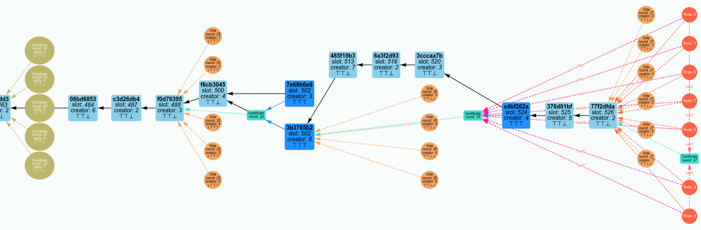

| Icon                                                      | Meaning                                                                                                                                                                                                                                                                               |
| --------------------------------------------------------- | ------------------------------------------------------------------------------------------------------------------------------------------------------------------------------------------------------------------------------------------------------------------------------------- |
| 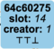                              | A block created by a node, linked to its predecessor. Contains the block hash (truncated to 8 characters), the creator's id, the creation time, and three icons representing truth value of the three conditions presiding to inclusion of a certificate within a block logic.        |
| 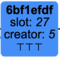 | A block containing a certificate on-chain. Its content is identical to a normal block but color differs to ease spotting when a certificate is included on-chain.                                                                                                                     |
|                   | A certificate created by a node, linked to the block it certifies. A certificate is only identified by its round number, as by construction there cannot be more than one certificate each round.                                                                                     |
|                                 | A vote cast by a node, linked to the block it votes for. Contains the round number in which the vote is cast, the voter's id, and the truth values of the four different rules for casting a vote.                                                                                    |
|                         | Record a node's decision to enter cooldown period, linked to the block that triggered it. Contains the round number in which the cooldown is started, the node's id, and the truth values of the conditions that lead to the node not casting a vote and entering cooldown.           |
|                                 | A node in the network, identified simply by a number. This is a marker representing the state of a node: What's the tip of its best chain, the latest "live" certificate it knows, and the latest on-chain certificate it knows. |

An [online simulator for Peras](https://peras-simulation.cardano-scaling.org/) is available.


### Normative Peras specification in Agda

The following formal, relational specification for Peras type utilizes [Agda 2.6.4.3](https://github.com/agda/agda/tree/v2.6.4.3). See [the Appendix](#typechecking-this-specification) for instruction on type-checking this specification with the Agda compiler and see [github:input-output-hk/peras-design](https://github.com/input-output-hk/peras-design/) for proofs and other modules related to this specification.

```agda
module README where
```

Most of the imports come from the [Agda Standard Library 2.0](https://github.com/agda/agda-stdlib/tree/v2.0).

```agda
open import Data.Bool using (Bool; if_then_else_; not; _∧_)
open import Data.Empty using (⊥)
open import Data.Fin using (Fin; pred)
                     renaming (zero to fzero; suc to fsuc)
open import Data.List using (List; any; concat; dropWhile; filter; head; map; mapMaybe; sum; []; _∷_; _++_)
                      renaming (length to ∣_∣)
open import Data.List.Membership.Propositional using (_∈_)
open import Data.List.Relation.Unary.All using (All)
open import Data.List.Relation.Unary.Any using (Any; any?; _─_)
                                         renaming (_∷=_ to _∷ˡ=_)
open import Data.Maybe using (Maybe; just; nothing)
open import Data.Nat using (NonZero; Ordering; suc; ℕ; _≤_; _≥_; _>_; _≤?_; _<ᵇ_; _≤ᵇ_; _+_; _∸_; _*_; _/_; _%_)
open import Data.Nat.Properties using (_≟_)
open import Data.Product using (proj₁; proj₂; _×_; _,_)
open import Data.Sum using (_⊎_)
open import Data.Unit using (⊤)
open import Function.Base using (_∘_)
open import Relation.Binary using (DecidableEquality)
open import Relation.Binary.PropositionalEquality using (_≡_; _≢_; cong)
open import Relation.Nullary using (Dec; no; yes; ¬_; ⌊_⌋)
open import Relation.Nullary.Decidable using (_×-dec_; ¬?)
```

Several additional imports come from the [IOG Agda Prelude v0.1.0.0](https://github.com/input-output-hk/iog-agda-prelude/releases/tag/v0.1.0.0).

```agda
open import Prelude.AssocList using (AssocList; set; _⁉_)
open import Prelude.DecEq using (DecEq; _==_)
open import Prelude.Default using (Default)
open import Prelude.InferenceRules
```

#### Protocol parameters

The seven *protocol parameters* are natural numbers.

```agda
record Params : Set where
  field
```

The $U$ parameter is the duration of each voting round, measured in slots.

```agda
        U : ℕ
```

The $L$ parameter is the minimum age of a candidate block for being voted upon, measured in slots.

```agda
        L : ℕ
```

<span id="#expiration"/>The $A$ parameter is the maximum age for a certificate to be included in a block, measured in slots.

```agda
        A : ℕ
```

The $R$ parameter is the number of rounds for which to ignore certificates after entering a cool-down period.

```agda
        R : ℕ
```

The $K$ parameter is the minimum number of rounds to wait before voting again after a cool-down period starts.

```agda
        K : ℕ
```

<span id="#boost"/>The $B$ parameter is the extra chain weight that a certificate (a quorum of votes) imparts to a block.

```agda
        B : ℕ
```

<span id="#quorum"/>The $\tau$ parameter is the number of votes (the quorum) required to create a certificate.

```agda
        τ : ℕ
```

Note that neither the round length nor the cool-down duration may be zero.

```agda
        ⦃ U-nonZero ⦄ : NonZero U
        ⦃ K-nonZero ⦄ : NonZero K
```

#### Network representation

At the protocol level, the only *network parameter* of interest is the diffusion time $\Delta$,  which is the upper limit on the number of slots needed to honestly diffuse a message to all nodes.

```agda
record Network : Set₁ where
  field
    Δ : ℕ
```

#### Slots and rounds

As in Praos, time is measured in *slots*.

```agda
record SlotNumber : Set where
  constructor MkSlotNumber
  field getSlotNumber : ℕ

  next : SlotNumber
  next = record {getSlotNumber = suc getSlotNumber}

open SlotNumber using (getSlotNumber)
```

Each Peras voting *round* consists of $U$ consecutive slots.

```agda
record RoundNumber : Set where
  constructor MkRoundNumber
  field getRoundNumber : ℕ

open RoundNumber using (getRoundNumber)

module _ ⦃ _ : Params ⦄ where
  open Params ⦃...⦄

  StartOfRound : SlotNumber → RoundNumber → Set
  StartOfRound (MkSlotNumber sl) (MkRoundNumber r) = sl ≡ r * U

  rnd : ℕ → ⦃ _ : NonZero U ⦄ → ℕ
  rnd s = s / U

  v-round : SlotNumber → RoundNumber
  v-round (MkSlotNumber s) = MkRoundNumber (rnd s)
```

#### Hashing

The protocol requires a type for the result of hashing data, an empty value for that type, and an equality test for that type.

```agda
postulate
  ByteString : Set
  emptyBS : ByteString
  _≟-BS_ : DecidableEquality ByteString
```

Hashes are represented by a byte string, and most of the protocol's primary data types can be hashed.

```agda
record Hash (a : Set) : Set where
  constructor MkHash
  field hashBytes : ByteString

record Hashable (a : Set) : Set where
  field hash : a → Hash a

open Hashable ⦃...⦄
```

#### Parties

A *party* operates a node and controls its cryptographic keys. Parties are, of course, distinguishable for one another.

```agda
postulate
  Party : Set
  _≟-party_ : DecidableEquality Party

instance
  iDecEqParty : DecEq Party
  iDecEqParty .DecEq._≟_ = _≟-party_
```

```agda
Parties = List Party
```

#### Signatures

The protocol uses standard KES *signatures* (Ed25519) for signing blocks or votes.

```agda
postulate
  Signature : Set
```

#### Slot leadership and committee membership

A *leadership proof* attests a party's slot leadership exactly as it does in Praos. The function `IsSlotLeader` verifies a party's leadership for a particular slot and the function `IsBlockSignature` verifies the validity of a block's signature.

```agda
record Block : Set  -- Blocks will be defined later in this specification.

postulate
  LeadershipProof : Set
  IsSlotLeader : Party → SlotNumber → LeadershipProof → Set
  IsBlockSignature : Block → Signature → Set
```

The voting scheme used by Peras is specified in the proposed CIP [*Votes & Certificates on Cardano*](https://github.com/cardano-foundation/CIPs/pull/870). It involves a *proof of membership* in a round's voting committee. The function `IsCommitteeMember` verifies a party's membership in a round's voting committee and the weight of their vote. The function `IsVoteSignature` verifies that validity of a vote's signature.

```agda
record Vote : Set  -- Votes will be defined later in this specification.

record VotingWeight : Set where
  field votes : ℕ

postulate
  MembershipProof : Set
  IsCommitteeMember : Party → RoundNumber → VotingWeight → MembershipProof → Set
  IsVoteSignature : Vote → Signature → Set
```

#### Votes

*Votes* have a creator, a weight, a proof of the creator's membership in the round's voting committee, and a reference to the block being voted for.

```agda
record Vote where
  constructor MkVote
  field votingRound : RoundNumber
        creatorId   : Party
        weight      : VotingWeight
        proofM      : MembershipProof
        blockHash   : Hash Block
        signature   : Signature

  votingWeight : ℕ
  votingWeight = VotingWeight.votes weight

  votingRound' : ℕ
  votingRound' = getRoundNumber votingRound
```

Votes are valid if the party and weight are correct for the round and if the vote is properly signed.

```agda
ValidVote : Vote → Set
ValidVote v =
  IsCommitteeMember
    (Vote.creatorId v)
    (Vote.votingRound v)
    (Vote.weight v)
    (Vote.proofM v)
  × IsVoteSignature v (Vote.signature v)
```

*Equivocated votes* are ones that duplicate votes by the same party in the same round. The protocol will reject such equivocated votes.

```agda
data _∻_ : Vote → Vote → Set where
  Equivocation : ∀ {v₁ v₂}
    → Vote.creatorId v₁ ≡ Vote.creatorId v₂
    → Vote.votingRound v₁ ≡ Vote.votingRound v₂
    → v₁ ≢ v₂
    → v₁ ∻ v₂
```

#### Certificates

A *certificate* attests that a quorum of votes for the same block were cast during a round.

```agda
record Certificate : Set where
  constructor MkCertificate
  field round : RoundNumber
        blockRef : Hash Block

  roundNumber : ℕ
  roundNumber = getRoundNumber round

postulate
  _≟-certificate_ : DecidableEquality Certificate
```

The protocol places special emphasis on the most recent certificate among a set of certificates.

```agda
latestCert : Certificate → List Certificate → Certificate
latestCert c = maximumBy c Certificate.roundNumber
  where maximumBy : {a : Set} → a → (a → ℕ) → List a → a
        maximumBy candidate _ [] = candidate
        maximumBy candidate f (x ∷ xs) =
          if f candidate ≤ᵇ f x
            then maximumBy x f xs
            else maximumBy candidate f xs
```

#### Block bodies

*Block bodies* are identical to those in Praos. They consist of a payload of transactions and are identified by their unique hash. The detailed contents are irrelevant for Peras, so we represent them in a slightly simplified manner.

```agda
postulate
  Tx : Set
  hashTxs : List Tx → Hash (List Tx)

Payload = List Tx

instance
  iHashablePayload : Hashable Payload
  iHashablePayload .hash = hashTxs

record BlockBody : Set where
  constructor MkBlockBody
  field blockHash : Hash Payload
        payload : Payload
```

#### Blocks

*Blocks* are identical to those in Praos, except for the rare inclusion of a certificate, which may happen near the beginning or ending of a cool-down period. The other detailed contents are irrelevant for Peras, so we represent them in a slightly simplified manner.

```agda
record Block where
  constructor MkBlock
  field slotNumber : SlotNumber
        creatorId : Party
        parentBlock : Hash Block
        certificate : Maybe Certificate  -- NB: New in Peras and not present in Praos.
        leadershipProof : LeadershipProof
        signature : Signature
        bodyHash : Hash Payload

  slotNumber' : ℕ
  slotNumber' = getSlotNumber slotNumber

postulate
  hashBlock : Block → Hash Block

instance
  iHashableBlock : Hashable Block
  iHashableBlock .hash = hashBlock

_≟-BlockHash_ : DecidableEquality (Hash Block)
(MkHash b₁) ≟-BlockHash (MkHash b₂) with b₁ ≟-BS b₂
... | yes p = yes (cong MkHash p)
... | no ¬p =  no (¬p ∘ cong Hash.hashBytes)

genesisHash : Hash Block
genesisHash = MkHash emptyBS

cert₀ : Certificate
cert₀ = MkCertificate (MkRoundNumber 0) genesisHash
```
#### Chains

The linking of blocks into a *chain* is identical to Praos.

```agda
Chain = List Block
```

The genesis chain is the empty list.
```agda
genesis : Chain
genesis = []
```

The protocol scrutinizes any certificates recorded on the chain.
```agda
certsFromChain : Chain → List Certificate
certsFromChain = mapMaybe Block.certificate
```

It also needs to test whether a certificate (quorum of votes) refers to a block found on a particular chain.

```agda
_PointsInto_ : Certificate → Chain → Set
_PointsInto_ c = Any ((Certificate.blockRef c ≡_) ∘ hash)

_PointsInto?_ : ∀ (c : Certificate) → (ch : Chain) → Dec (c PointsInto ch)
_PointsInto?_ c = any? ((Certificate.blockRef c ≟-BlockHash_) ∘ hash)
```

Peras differs from Praos in that the <span id="#weight"/>weight of a chain is its length plus the boost parameter $B$ times the number of vote quorums (certificates) its blocks have received.

```agda
module _ ⦃ _ : Params ⦄ where
  open Params ⦃...⦄

  ∥_∥_ : Chain → List Certificate → ℕ
  ∥ ch ∥ cts = ∣ ch ∣ + ∣ filter (_PointsInto? ch) cts ∣ * B
```

The protocol can identify a chain by the hash of its most recent block (its tip).

```agda
tipHash : Chain → Hash Block
tipHash [] = genesisHash
tipHash (b ∷ _) = hash b
```

A chain is valid if its blocks are signed and their creators were slot leaders. The chain's genesis is always valid.

```agda
data ValidChain : Chain → Set where
  Genesis : ValidChain genesis
  Cons : ∀ {c : Chain} {b : Block}
    → IsBlockSignature b (Block.signature b)
    → IsSlotLeader (Block.creatorId b) (Block.slotNumber b) (Block.leadershipProof b)
    → Block.parentBlock b ≡ tipHash c
    → ValidChain c
    → ValidChain (b ∷ c)
```

A block is said to extend a certificate on a chain if the certified block is an ancestor of or identical to the block and on the chain.

```agda
ChainExtends : Hash Block → Certificate → Chain → Set
ChainExtends h c =
  Any (λ block → (hash block ≡ Certificate.blockRef c))
    ∘ dropWhile (λ block' → ¬? (hash block' ≟-BlockHash h))

Extends : Hash Block → Certificate → List Chain → Set
Extends h c
  with c ≟-certificate cert₀
Extends h c | yes _ = λ _ → ⊤
Extends h c | no _ = Any (ChainExtends h c)
```

#### Messages and their envelopes

In addition to the chain *messages* already diffused among nodes in Praos, the Peras protocol also diffuses votes between nodes. (Note that Peras implementations might choose also to diffuse certificates in lieu of sets of votes that meet the quorum condition.)

```agda
data Message : Set where
  ChainMsg : {c : Chain} → ValidChain c → Message
  VoteMsg : {v : Vote} → ValidVote v → Message
```

Diffusion of votes or blocks over the network may involve delays of a slot or more.

```agda
module _ ⦃ _ : Params ⦄ ⦃ _ : Network ⦄ where
  open Params ⦃...⦄
  open Network ⦃...⦄

  Delay = Fin (suc (suc Δ))
  pattern 𝟘 = fzero
  pattern 𝟙 = fsuc fzero
```

Messages are put into an *envelope* and assigned to a party. Such messages can be delayed.

```agda
  record Envelope : Set where
    constructor ⦅_,_,_⦆
    field
      partyId : Party
      message : Message
      delay : Delay
```

#### Block trees

*Block trees* are defined by functions and properties: any implementation of the block tree has to possess the required functions.

```agda
module _ ⦃ _ : Params ⦄ where
  open Params ⦃...⦄

  record IsTreeType {T : Set}
                    (tree₀ : T)
                    (addChain : T → {c : Chain} → ValidChain c → T)
                    (allChains : T → List Chain)
                    (preferredChain : T → Chain)
                    (addVote : T → {v : Vote} → ValidVote v → T)
                    (votes : T → List Vote)
                    (certs : T → List Certificate)
                    (cert₀ : Certificate)
         : Set₁ where

    field
```

It must also conform to properties that must hold with respect to chains, certificates and votes. First, the genesis tree must prefer the genesis chain, have an empty set of certificates, and have an empty set of votes.

```agda
      instantiated :
        preferredChain tree₀ ≡ genesis

      instantiated-certs :
        certs tree₀ ≡ cert₀ ∷ []

      instantiated-votes :
        votes tree₀ ≡ []
```

The certificates in a chain newly incorporated into the block tree must equate to the certificates on the chain itself and the block tree's record of certificates.

```agda
      extendable-chain : ∀ (t : T) {c : Chain} (vc : ValidChain c)
        → certs (addChain t vc) ≡ certsFromChain c ++ certs t
```

A valid block tree must have a valid preferred chain.

```agda
      valid : ∀ (t : T)
        → ValidChain (preferredChain t)
```

The preferred chain must be at least as weighty as any other chain present in the block tree.

```agda
      optimal : ∀ (c : Chain) (t : T)
        → let b = preferredChain t
              cts = certs t
          in ValidChain c
        → c ∈ allChains t
        → ∥ c ∥ cts ≤ ∥ b ∥ cts
```

The preferred chain must be present in the list of all chains seen.

```agda
      self-contained : ∀ (t : T)
        → preferredChain t ∈ allChains t
```

Duplicate or equivocated votes must not be present in the block tree.

```agda
      unique-votes : ∀ (t : T) {v : Vote} (vv : ValidVote v)
        → let vs = votes t
          in v ∈ vs
        → vs ≡ votes (addVote t vv)

      no-equivocations : ∀ (t : T) {v : Vote} (vv : ValidVote v)
        → let vs = votes t
          in Any (v ∻_) vs
        → vs ≡ votes (addVote t vv)
```

Every certificate must represent a quorum of recorded votes.

```agda
      quorum-cert : ∀ (t : T) (b : Block) (r : ℕ)
        →  (sum ∘ map Vote.votingWeight) (filter (λ {v →
                     (getRoundNumber (Vote.votingRound v) ≟ r)
               ×-dec (Vote.blockHash v ≟-BlockHash hash b)}
             ) (votes t)) ≥ τ
        → Any (λ {c →
            (getRoundNumber (Certificate.round c) ≡ r)
          × (Certificate.blockRef c ≡ hash b) }) (certs t)
```

The concrete block tree type (`TreeType`) manages chains, certificates, and votes.

```agda
  record TreeType (T : Set) : Set₁ where

    field
      tree₀ : T
      addChain : T → {c : Chain} → ValidChain c → T
      allChains : T → List Chain
      preferredChain : T → Chain
      addVote : T → {v : Vote} → ValidVote v → T
      votes : T → List Vote
      certs : T → List Certificate
```

It conforms to the `IsTreeType` requirements.

```agda
      is-TreeType : IsTreeType
                      tree₀ addChain allChains preferredChain
                      addVote votes certs cert₀
```

Several convenience functions are provided for extracting information about certificates and votes.

```agda
    latestCertOnChain : T → Certificate
    latestCertOnChain = latestCert cert₀ ∘ mapMaybe Block.certificate ∘ preferredChain

    latestCertSeen : T → Certificate
    latestCertSeen = latestCert cert₀ ∘ certs

    hasVote : RoundNumber → T → Set
    hasVote (MkRoundNumber r) = Any ((r ≡_) ∘ Vote.votingRound') ∘ votes
```

#### Parameterization of the semantics

In order to define the semantics the following parameters are required.

- The type of the block-tree
- A function that mimics the node's memory pool by selecting the transactions available to a particular party in a particular slot
- A list of the parties participating in the protocol

```agda
module Semantics
           ⦃ _ : Params ⦄
           ⦃ _ : Network ⦄
           {T : Set} {blockTree : TreeType T}
           {txSelection : SlotNumber → Party → List Tx}
           {parties : Parties}
           where
    open Params ⦃...⦄
    open TreeType blockTree
```

The protocol starts from the genesis block tree.

```agda
    instance
      Default-T : Default T
      Default-T .Default.def = tree₀
```

#### Block-tree update

Updating the block tree involves recording the votes and chains received via messages.

```agda
    data _[_]→_ : T → Message → T → Set where

      VoteReceived : ∀ {v vv t} →
        ──────────────────────────────────
        t [ VoteMsg {v} vv ]→ addVote t vv

      ChainReceived : ∀ {c vc t} →
        ────────────────────────────────────
        t [ ChainMsg {c} vc ]→ addChain t vc
```

#### Block selection

The block selected for voting is the most recent one on the preferred chain that is at least $L$ slots old.

```agda
    BlockSelection : SlotNumber → T → Hash Block
    BlockSelection (MkSlotNumber s) = tipHash ∘ filter (λ {b → (Block.slotNumber' b) + L ≤? s}) ∘ preferredChain
```

#### Rules for voting in a round

Voting is allowed in a round if voting has proceeded regularly in preceding rounds or if a sufficient number of slots have lapsed since the protocol entered a cool-down period. Specifically, either of two pairs of conditions must be met.

- `VR-1A`: The vote has seen the certificate for the previous round.

```agda
    VotingRule-1A : RoundNumber → T → Set
    VotingRule-1A (MkRoundNumber r) t = r ≡ Certificate.roundNumber (latestCertSeen t) + 1
```

- `VR-1B`: The block being voted upon extends the most recently certified block

```agda
    VotingRule-1B : SlotNumber → T → Set
    VotingRule-1B s t =
      Extends (BlockSelection s t) (latestCertSeen t) (allChains t)
```

- `VR-1`: Both `VR-1A` and `VR-1B` hold, which is the situation typically occurring when the voting has regularly occurred in preceding rounds.

```agda
    VotingRule-1 : SlotNumber → T → Set
    VotingRule-1 s t =
        VotingRule-1A (v-round s) t
      × VotingRule-1B s t
```

- `VR-2A`: The last certificate a party has seen is from a round at least $R$ rounds previously. This enforces the chain-healing period that must occur before leaving a cool-down period.

```agda
    VotingRule-2A : RoundNumber → T → Set
    VotingRule-2A (MkRoundNumber r) t =
      r ≥ Certificate.roundNumber (latestCertSeen t) + R
```

- `VR-2B`: The last certificate included in a party's current chain is from a round exactly $c \cdot K$ rounds ago for some $c \in ℕ$ with $c ≥ 0$. This enforces chain quality and common prefix before leaving a cool-down period.

```agda
    VotingRule-2B : RoundNumber → T → Set
    VotingRule-2B (MkRoundNumber r) t =
        r > Certificate.roundNumber (latestCertOnChain t)
      × r mod K ≡ (Certificate.roundNumber (latestCertOnChain t)) mod K
      where
        _mod_ : ℕ → (n : ℕ) → ⦃ NonZero n ⦄ → ℕ
        _mod_ a b ⦃ prf ⦄ = _%_ a b ⦃ prf ⦄
```

- `VR-2`: Both `VR-2A` and `VR-2B` hold, which is the situation typically occurring when the chain is about to exit a cool-down period.

```agda
    VotingRule-2 : RoundNumber → T → Set
    VotingRule-2 r t =
        VotingRule-2A r t
      × VotingRule-2B r t
```

If either `VR-1A` and `VR-1B` hold, or `VR-2A` and `VR-2B` hold, then voting is allowed.

```agda
    VotingRule : SlotNumber → T → Set
    VotingRule s t =
        VotingRule-1 s t
      ⊎ VotingRule-2 (v-round s) t
```

#### State

The small-step semantics rely on a global state, which consists of several pieces of information.

- Current slot of the system
- Map with local state per party
- All the messages that have been sent but not yet been delivered
- All the messages that have been sent

```agda
    record State : Set where
      constructor _,_,_,_,_
      field
        clock : SlotNumber
        blockTrees : AssocList Party T
        messages : List Envelope
        history : List Message
```

#### Progress

Rather than keeping track of progress, we introduce a predicate stating that all messages that are not delayed have been delivered. This is a precondition that must hold before transitioning to the next slot.

```agda
    Fetched : State → Set
    Fetched = All (λ { z → Envelope.delay z ≢ 𝟘 }) ∘ messages
      where open State
```

#### Advancing the clock

Ticking the global clock increments the slot number and decrements the delay of all the messages in the message buffer.

```agda
    tick : State → State
    tick M =
      record M
        { clock = SlotNumber.next clock
        ; messages =
            map (λ where e → record e { delay = pred (Envelope.delay e) })
              messages
        }
      where open State M
```

#### Updating the global state

New messages are buffered, recorded in the global history, and will update a party's portion of the global state.`
```agda
    _,_⇑_ : Message → (Party → Delay) → State → State
    m , fᵈ ⇑ M =
      record M
        { messages =
            map (λ { p → ⦅ p , m , fᵈ p ⦆}) parties
            ++ messages
        ; history = m ∷ history
        }
      where open State M
```
This occurs when a message diffuses to new parties.
```agda
    delay_by_update_ : Message → (Party → Delay) → State → State
    delay m@(ChainMsg x) by fᵈ update M = m , fᵈ ⇑ M
    delay m@(VoteMsg x) by fᵈ update M = m , fᵈ ⇑ M
```

#### Fetching

A party receives messages from the global state by fetching messages assigned to the party, updating the local block tree, and putting the local state back into the global state.

```agda
    data _⊢_[_]⇀_ : Party → State → Message → State → Set
      where
```

An honest party consumes a message from the global message buffer and updates their local state.

```agda
      honest : ∀ {p} {t t′} {m} {N}
        → let open State N
          in
          (m∈ms : ⦅ p , m , 𝟘 ⦆ ∈ messages) →
        ∙ blockTrees ⁉ p ≡ just t
        ∙ t [ m ]→ t′
          ─────────────────────────────────────
          p ⊢
          N [ m ]⇀ record N
            { blockTrees = set p t′ blockTrees
            ; messages = messages ─ m∈ms
            }
```

#### Voting

Votes are created with the required information about committee membership and the block being voted for.

```agda
    createVote : SlotNumber → Party → VotingWeight → MembershipProof → Signature → Hash Block → Vote
    createVote s p w prf sig hb =
      record
        { votingRound = v-round s
        ; creatorId = p
        ; weight = w
        ; proofM = prf
        ; blockHash = hb
        ; signature = sig
        }
```

A party can consider voting for a block, if

- the current slot is the first slot in a voting round
- the party is a member of the voting committee
- the chain is not in a cool-down phase

Voting updates the party's local state and for all other parties a message is ready to be consumed immediately.

```agda
    infix 2 _⊢_⇉_
    data _⊢_⇉_ : Party → State → State → Set where

      honest : ∀ {p} {t} {M} {w} {π} {σ} {b}
        → let
            open State
            s = clock M
            r = v-round s
            v = createVote s p w π σ b
          in
          (fᵈ : Party → Delay)
          (mem : IsCommitteeMember p r w π)
          (sig : IsVoteSignature v σ) →
        ∙ BlockSelection s t ≡ b
        ∙ blockTrees M ⁉ p ≡ just t
        ∙ StartOfRound s r
        ∙ VotingRule s t
          ────────────────────────────────────────────
          p ⊢
            M ⇉ delay VoteMsg (mem , sig) by fᵈ
                 update M
```

#### Block creation

Certificates are conditionally added to a block, typically near the beginning or ending of a cool-down period. Such recording occurs if . . .

1. There is no certificate seen (recorded) from two rounds ago,
2. The last seen certificate is not expired, and
3. The last seen certificate is from a later round than the last certificate on chain.

```agda
    needCert : RoundNumber → T → Maybe Certificate
    needCert (MkRoundNumber r) t =
      let
        cert⋆ = latestCertOnChain t
        cert′ = latestCertSeen t
      in
        if not (any (λ {c → ⌊ Certificate.roundNumber c + 2 ≟ r ⌋}) (certs t))  -- (1)
           ∧ (r ≤ᵇ A + Certificate.roundNumber cert′)                           -- (2)
           ∧ (Certificate.roundNumber cert⋆ <ᵇ Certificate.roundNumber cert′)   -- (3)
        then just cert′
        else nothing
```

Blocks are created with the required information.

```agda
    createBlock : SlotNumber → Party → LeadershipProof → Signature → T → Block
    createBlock s p π σ t =
      record
        { slotNumber = s
        ; creatorId = p
        ; parentBlock = tipHash (preferredChain t)
        ; certificate = needCert (v-round s) t
        ; leadershipProof = π
        ; bodyHash = hash (txSelection s p)
        ; signature = σ
        }
```

A party can create a new block by adding it to the local block tree and diffuse the block creation messages to the other parties. Block creation is possible, if as in Praos, . . .

- the block signature is correct, and
- the party is the slot leader.

Block creation updates the party's local state, but for all other parties a message is added to the message buffer

```agda
    infix 2 _⊢_↷_
    data _⊢_↷_ : Party → State → State → Set where

      honest : ∀ {p} {t} {M} {π} {σ} →
        let open State M
            b = createBlock clock p π σ t
            pref = preferredChain t
          in
          (fᵈ : Party → Delay)
          (vc : ValidChain (b ∷ pref)) →
        ∙ blockTrees ⁉ p ≡ just t
          ──────────────────────────────
          p ⊢
            M ↷ delay ChainMsg vc by fᵈ
                update M
```

#### Small-step semantics

The small-step semantics describe the evolution of the global state.

```agda
    variable
      M N O : State
      p : Party
```

The relation allows

- Fetching messages at the beginning of each slot
- Block creation
- Voting
- Transitioning to next slot in the same voting round
- Transitioning to next slot in a new voting round

Note that when transitioning to the next slot we need to distinguish whether the next slot is in the same or a new voting round. This is necessary in order to detect adversarial behavior with respect to voting (adversarially not voting in a voting round).

```agda
    data _↝_ : State → State → Set where

      Fetch : ∀ {m} →
        ∙ p ⊢ M [ m ]⇀ N
          ──────────────
          M ↝ N

      CreateVote :
        ∙ Fetched M
        ∙ p ⊢ M ⇉ N
          ─────────
          M ↝ N

      CreateBlock :
        ∙ Fetched M
        ∙ p ⊢ M ↷ N
          ─────────
          M ↝ N

      NextSlot :
        ∙ Fetched M
          ─────────────────────
          M ↝ tick M
```

This completes for formal specification of Peras. The repository [github:input-output-hk/peras-design](https://github.com/input-output-hk/peras-design/tree/main) leverages this specification by providing the following Agda code.

- Proofs of properties of the Peras protocol.
- An executable specification (since the above specification is *relational* and not *executable*)
- Proofs of the soundness of the executable specification with respect to this relational one
- Scaffolding for generating dynamic, property-based conformance tests using the Haskell [`quickcheck-dynamic`](https://hackage.haskell.org/package/quickcheck-dynamic) package.


### Constraints on Peras parameters

The structure of the Peras protocol imposes the following constraints on its [parameters](#protocol-parameters). These arise from both theoretical and practical considerations.

| Parameter               | Symbol          | Units   | Description                                                                               | Constraints                                              | Rationale                                                                                    |
| ----------------------- | --------------- | ------- | ----------------------------------------------------------------------------------------- | -------------------------------------------------------- | -------------------------------------------------------------------------------------------- |
| Round length            | $U$             | slots   | The duration of each voting round.                                                        | $U \geq \Delta$                                          | All of a round's votes must be received before the end of the round.                         |
| Block selection offset  | $L$             | slots   | The minimum age of a candidate block for being voted upon.                                | $\Delta < L                                              | Blocks must propagate before they are voted upon.                                            |
| Certificate expiration  | $A$             | slots   | The maximum age for a certificate to be included in a block.                              | $A = T_\text{heal}+T_\text{CQ}$                          | After a quorum failure, the chain must heal and achieve quality.                             |
| Chain ignorance period  | $R$             | rounds  | The number of rounds for which to ignore certificates after entering a cool-down period.  | $R = \left\lceil A / U \right\rceil$                     | Ensure chain-ignorance period lasts long enough to include a certificate on the chain.       |
| Cool-down period        | $K$             | rounds  | The minimum number of rounds to wait before voting again after a cool-down period starts. | $K = \left\lceil \frac{A + T_\text{CP}}{U} \right\rceil$ | After a quorum failure, the chain must heal, achieve quality, and attain a common prefix.    |
| Certification boost     | $B$             | blocks  | The extra chain weight that a certificate gives to a block.                               | $B > 0$                                                  | Peras requires that some blocks be boosted.                                                  |
| Quorum size             | $\tau$          | parties | The number of votes required to create a certificate.                                     | $\tau > 3 n / 4$                                         | Guard against a minority (< 50%) of adversarial voters.                                      |
| Committee size          | $n$             | parties | The number of members on the voting committee.                                            | $n > 0$                                                  | Peras requires a voting committee.                                                           |
| Network diffusion time  | $\Delta$        | slots   | Upper limit on the time needed to diffuse a message to all nodes.                         | $\Delta > 0$                                             | Messages have a finite delay.                                                                |
| Active slot coefficient | $f$             | 1/slots | The probability that a party will be the slot leader for a particular slot.               | $0 < f \leq 1$                                           | Blocks must be produced.                                                                     |
| Healing time            | $T_\text{heal}$ | slots   | Healing period to mitigate a strong (25-50%) adversary.                                   | $T_\text{heal} = \mathcal{O}\left( B / f \right)$        | Sufficient blocks must be produced to overcome an adversarially boosted block.               |
| Chain-quality time      | $T_\text{CQ}$   | slots   | Ensure the presence of at least one honest block on the chain.                            | $T_\text{CQ} = \mathcal{O} (k/f)$                        | A least one honest block must be produced.                                                   |
| Common-prefix time      | $T_\text{CP}$   | slots   | Achieve settlement.                                                                       | $T_\text{CP} = \mathcal{O} (k/f)$                        | The Ouroboros Praos security parameter defines the time for having a common prefix.          |
| Security parameter      | $k$             | blocks  | The Ouroboros Praos security parameter.                                                   | n/a                                                      | Value for the Cardano mainnet.                                                               |


### Specification of votes and certificates

The stake-proportional voting in Peras mimics the _sortition_ algorithm used in Praos: specifically it is based on the use of a *verifiable random function* (VRF) by each stake-pool operator guaranteeing the following properties:

- The probability for each voter to cast their vote in a given round is correlated to their share of total stake.
- It should be computationally impossible to predict a given SPO's schedule without access to their secret key VRF key.
- Verification of a voter's right to vote in a round should be efficiently computable.
- A vote should be unique and non-malleable, which is a requirement for the use of efficient certificates aggregation.

Additionally one would like the following property to be provided by the voting scheme:

- Voting should require minimal additional configuration (e.g., key management) for SPOs.
- Voting and certificate construction should be fast in order to ensure it does not interfere with other operations happening in the node.

The precise scheme and format for votes and certificates is immaterial to the protocol itself and is deferred to another proposed CIP [*Votes & Certificates on Cardano*](https://github.com/cardano-foundation/CIPs/pull/870) or to [the scheme documented in the Peras repository](https://github.com/input-output-hk/peras-design/blob/main/analytics/certificates-jan2025.md). Presumably, voting and certificates will be handled uniformly across Mithril, Peras, Leios, and partner chains.

### CDDL schema for the ledger

Peras requires a single addition, `peras_cert`, the [block](#blocks) data on the ledger.

```diff
 block =
   [ header
   , transaction_bodies         : [* transaction_body]
   , transaction_witness_sets   : [* transaction_witness_set]
   , auxiliary_data_set         : {* transaction_index => auxiliary_data }
   , invalid_transactions       : [* transaction_index ]
+  , ? peras_cert               : votes_certificate
   ]
```

[Votes](https://github.com/input-output-hk/peras-design/blob/main/analytics/certificates-jan2025.md) are serialized in the following CDDL.

```cddl
votes_certificate =
  [ voter_id         : hash32
  , voting_round     : round_no
  , block_hash       : hash32
  , voting_proof     : vrf_cert
  , voting_weight    : voting_weight
  , kes_period       : kes_period
  , kes_vkey         : kes_vkey
  , kes_signature    : kes_signature
  ]
```

This definition relies on the following primitive types (drawn from Ledger definitions in [crypto.cddl](https://github.com/input-output-hk/cardano-ledger/blob/e2aaf98b5ff2f0983059dc6ea9b1378c2112101a/eras/conway/impl/cddl-files/crypto.cddl#L1)).

```cddl
round_no = uint .size 8
voting_weight = uint .size 8
vrf_cert = [bytes, bytes .size 80]
hash32 = bytes .size 32
kes_vkey = bytes .size 32
kes_signature = bytes .size 448
kes_period = uint .size 8
```

As already mentioned, the vote serialization mimics the block header's structure, which allows Cardano nodes to reuse their existing VRF and KES keys. Also note the following.

- The total size of each vote is 710 bytes, according to the above definition.
- Unless explicitly mentioned, the `hash` function exclusively uses 32-bytes Blake2b-256 hashes.
- The `voter_id` is it's pool identifier (i.e., the hash of the node's cold key).

The CDDL for the [certificates](#certificates) that aggregate votes is specified in the proposed CIP [*Votes & Certificates on Cardano*](https://github.com/cardano-foundation/CIPs/pull/870).


## Rationale: how does this CIP achieve its goals?

The Ouroboros Peras protocol achieves the goal of fast *ex post facto* settlement by periodically voting upon blocks of the preferred chain and giving such blocks a boost in weight if a quorum of voters vote for them in the same round. With overwhelming probability, the boost effectively "cements" the block forever unto the preferred chain, thus guarding it and prior blocks from rollbacks. The protocol operates under conditions of up to 25% adversarial stake, but reverts to the familiar Praos protocol under stronger adversarial conditions; after adversarial conditions abate, it remains safely in "Praos mode" for long enough to achieve chain healing, chain quality, and a common prefix. Thus, it does not weaken the worst-case security guarantees provided by Praos, though it does significantly speed settlement under "normal" non-adversarial conditions and under weakly adversarial conditions.

### How Peras settles faster

The diagram below illustrates why Peras provides fast settlement. If an adversary begins building a private fork, they would reveal it publicly if it ever becomes longer than the public, honestly preferred chain: once it is revealed to be longer, honest parties would build upon it, causing the rollback of the honest blocks that were built subsequent to the divergence of the honest and private chains. Peras's boosted blocks protect against rollbacks because it can be made extremely difficult for an adversary to cause a rollback of a boosted block. Thus adversaries only have an opportunity to roll back blocks after the last boosted block and before voting occurs to boost another block. Mathematically, the window of adversarial opportunity lasts for $U + L$ slots: blocks are voted upon for boosting every $U$ slots, but there is an $L$ slot delay between a block being produced and it being voted upon. Successful voting to boost a block effectively protects that block and its ancestors. Hence a transaction is at risk of rollback for typically no more that $U+L$ slots  and that risk abates once its block or a descendant block is boosted.

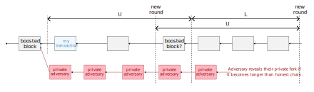

### Evidence for fast settlement

The following plot quantifies the settlement-time benefits of Peras[^5] using an approximate adversarial model and probabilistic computations. Using the [example Peras protocol parameters](#feasible-values=for-peras-protocol-parameters), one has *ex post facto* settlement within two minutes of a transaction's being included in a block. This means that if the transaction's block is still on the preferred chain after two minutes, then it will remain there with essentially no chance of being rolled back unless the adversarial stake is stronger than approximately 25%. The solid curves in the plot represent Peras and the dashed ones represent Praos. (The Praos probabilities are consistent with the model of Gaži, Ren, and Russell[^1].) The protocol parameters are those listed in the section [Feasible values for Peras protocol parameters](#feasible-values-for-peras-protocol-parameters), but the [Markov-chain simulation of an adversary building and then strategically revealing it a private chain](https://github.com/input-output-hk/peras-design/tree/main/peras-markov) used to make the plot simplifies the protocol in a few inessential aspects (network diffusion and the $L$ parameter) and does not model the memory pool (which mitigates short honest forks). The red curve shows the *ex ante* probability that a block included in the preferred chain remains on the preferred chain in the future, never being rolled back. The green curve shows the *ex post facto* probability that a block which has remained on the preferred chain for 120 slots (two minutes) remains on the preferred chain in the future.

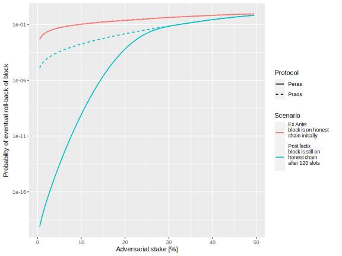

[^5]: https://peras.cardano-scaling.org/docs/reports/tech-report-2#settlement-probabilities

Even for adversarial stake less of 50%, there is only a vanishingly small probability of rolling back a block if it has "survived" long enough to have a descendant that received a Peras boost.

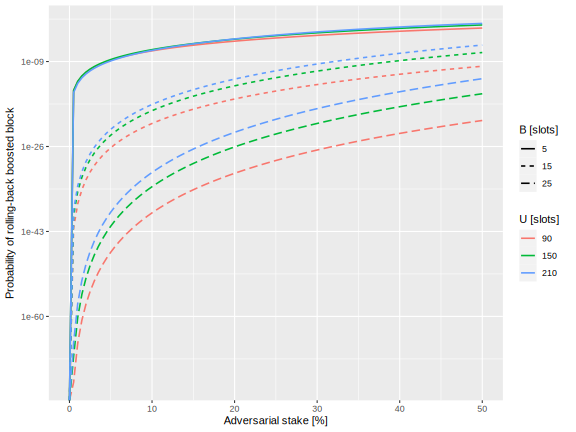

 Strong adversarial activity prior to the two minutes might cause the block to be rolled back before then, as show in the plot below, but adversarial activity after that time will not roll it back. If the transaction was rolled back in the first two minutes, then it would have to be resubmitted. So, the Peras protocol provides certainty about the fate of a transaction within a brief, fixed amount of time.

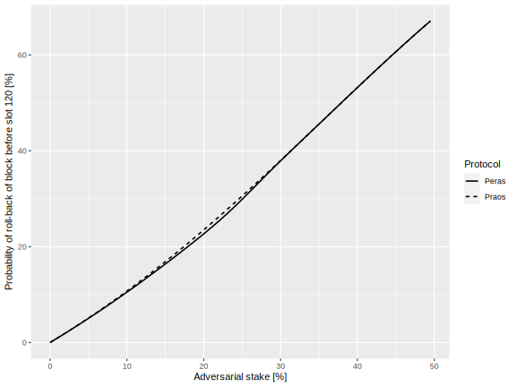

The figure below shows the race between honest parties and a modestly powerful adversary building a private chain. If the adversary's private chain ever becomes longer than the honest public one, then the adversary can reveal their chain publicly, shortly after which time the honest parties will adopt it as their preferred chain, with the consequence of rolling back all of the blocks on the honest chain from the time when the adversary started building privately. The Peras round length is 150 slots in this simulation, and one can see jump to the right every 150 slots the probability distribution of the honest chain's weight advantage over the private adversarial chain's weight. Each jump is a boost of 10 blocks' worth of chain weight. Even after one boost of the honest chain, the adversary has essentially no chance of ever overtaking the honest chain. The "shoulder" on the left side of the probability distribution is associated with the chain entering a cool-down period because the adversary thwarted voting, so no boost occurs.

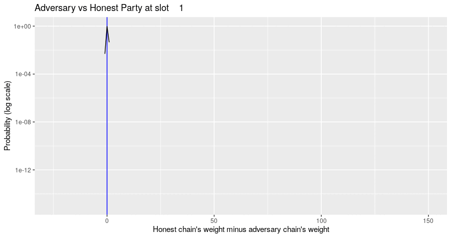

### Why Peras is practical to implement

Peras is compatible with many stake-based voting schemes, which means it has synergies with protocol enhancements like Ouroboros Genesis and Leios. Because Peras only modifies Praos's chain-weight computation and adds voting, its effects are mostly orthogonal to other existing and proposed aspects of Ouroboros. Peras utilizes the node's existing cryptographic primitives and keys, so it does not require any new key exchanges.

Peras is straightforward to implement, as it requires the following additions to the node, which have minimal or modest impact on node resources[^6].
- Chain selection that includes the boosting from certificates
- Building and verifying votes and certificate
- Mini-protocols for diffusing votes and certificates
- Permanent storage of certificates
- Temporary storage of unexpired votes

[^6]: https://peras.cardano-scaling.org/docs/reports/tech-report-2#resources-impact-of-peras

The impact of Peras upon nodes falls into four categories: [network](#network), [CPU](#cpu), [memory](#memory), and [storage](#persistent-storage). [Evidence](#votes--certificates) is provided that the CPU time required to construct and verify votes and certificates is much smaller than the duration of a voting round. Similarly, the [memory](#memory) needed to cache votes and certificates and the [disk space](#persistent-storage) needed to persist certificates are trivial compared to that needed for the UTXO set and the disk needed for the blocks.

On the networking side, [the ΔQ studies](#vote-diffusion) demonstrate that diffusion of Peras votes and certificates consumes minimal bandwidth and would not interfere with other node operations such as memory-pool and block diffusion. However, [diffusion of votes and certificates](#network-traffic) across a network will still have a noticeable impact on the _volume_ of data transfer, on the order of 20%, which might translate to increased operating costs for nodes deployed in cloud providers.

The remainder of this section outlines the use cases for Peras, discusses its mitigation of attacks, and summarizes it resource requirements.

### Use cases

Peras primarily benefits use cases where a party needs certainty, after a fixed amount of time, about the settlement status of a transaction. The generic use case follows.

1. The party submits a transaction to the memory pool.
2. A block producer includes the transaction in a newly forged block.
3. The party waits a fixed amount of time, $U + L$, which is predetermined by the protocol.
4. The party examines the preferred chain to see whether it contains the block and whether the block or one of its descendants has received a Peras boost.
    1. It the block is on the preferred chain and guarded by a boost, then the transaction is essentially final/settled.
    2. If the block is not on the preferred chain, then it has been rolled back and needs to be resubmitted.
    3. If the block is on the preferred chain but there is no boost, then the chain has entered a cool-down period and the party want to wait for more confirmation, as one does currently in Praos.

Note that the third ("cool down") case would only occur if voting was prevented by a substantial disruption such as widespread loss of network connectivity or an attack. Reasonable values for $U$ and $L$ are 90 and 30 seconds, respectively, which means that settled versus rolled-back would be certain in two minutes.

Specific use cases involving time-constrained, high-value transactions conform to this generic pattern. When the value at risk is low, a one-in-a-million chance of a rollback might not be as concerning as it would be for a large transaction. Examples follow:

- Centralized exchanges, where fast settlement improves the user convenience and experience
- Partner chains and bridges, where certainty about synchronization between two chains is essential
- Dapps where fixed-horizon certainty is needed to orchestrate transactions
- Ordinary transactions where a brief wait is acceptable but a roll-back is not

For example, the partner-chain use case might leverage Peras as follows.

1. Funds or tokens need to be transferred from the partner chain to the Cardano chain.
2. A smart-contract transaction escrows the funds/tokens on the partner chain.
3. Simultaneously, a mirror of that smart-contract transaction is submitted on Cardano.
4. After a short amount of time, the Cardano transaction has been incorporated into a newly-formed block.
5. Wait $U + L$ slots on Cardano.
6. With high probability the transaction will be protected by a boosted block, so there would only be an infinitesimally small chance of it ever being rolled back.
    - If it was rolled back, go back to step 3 above.
    - In the unlikely event that a cool-down period has been entered, wait for more confirmations.
7. Complete the escrow contract on the partner chain.

<span id="#confirmations"/>Taking Kraken as an example of a centralized exchange, we see in the following table[^7] the significant delay required for transactions to be treated as final. A technology like Peras would put Cardano in the cluster of faster-settling blockchains.

| Blockchain | Confirmations Required | Approximate time (minutes) |
| ---------- | ---------------------: | -------------------------: |
| Algorand   |                     10 |                          1 |
| Aptos      |                     50 |                          5 |
| Avalance   |                     20 |                          1 |
| Bitcoin    |                      3 |                         30 |
| Cardano    |                     15 |                         10 |
| Dogecoin   |                     40 |                         40 |
| Ethereum   |                     70 |                         14 |
| Polkadot   |                    n/a |                          5 |
| Ripple     |                    n/a |                          0 |
| Solana     |                    n/a |                          0 |
| Tezos      |                      6 |                          3 |

[^7]: Data extracted from https://support.kraken.com/hc/en-us/articles/203325283-Cryptocurrency-deposit-processing-times on 7 August 2024.


### Feasible values for Peras protocol parameters

Based on the analyses in the [Peras Technical Report #2](https://peras.cardano-scaling.org/docs/reports/tech-report-2#defining-protocol-parameters-values), a reasonable set of default [protocol parameters](#protocol-parameters) for further study, simulation, and discussion is show in the table below. The optimal values for a real-life blockchain would depend somewhat upon external requirements such as balancing settlement time against resisting adversarial behavior at high values of adversarial stake. This set of parameters is focused on the use case of knowing soon whether a block is settled or rolled back; other sets of parameters would be optimal for use cases that reduce the probability of roll-back at the expense of waiting longer for settlement.

| Parameter              | Symbol           | Units   | Value | Rationale                                                            |
| ---------------------- | ---------------- | ------- | ----: | -------------------------------------------------------------------- |
| Round length           | $U$              | slots   |    90 | Settlement/non-settlement in under two minutes.                      |
| Block-selection offset | $L$              | slots   |  > 30 | Several multiples of $\Delta$ to ensure block diffusion.             |
| Certification boost    | $B$              | blocks  |    15 | Negligible probability to roll back boosted block.                   |
| Security parameter     | $k_\text{peras}$ | blocks  |  3150 | Determined by the Praos security parameter and the boost.            |
| Certificate expiration | $A$              | slots   | 27000 | Determined by the Praos security parameter and boost.                |
| Chain-ignorance period | $R$              | rounds  |   300 | Determined by the Praos security parameter, round length, and boost. |
| Cool-down period       | $K$              | rounds  |   780 | Determined by the Praos security parameter, round length and boost.  |
| Committee size         | $n$              | parties |   900 | 1 ppm probability of no honest quorum at 10% adversarial stake.      |
| Quorum size            | $\tau$           | parties |   675 | Three-quarters of committee size.                                    |

A *block-selection offset* of $L = 30 \text{\,slots}$ allows plenty of time for blocks to diffuse to voters before a vote occurs, but it may be desirable to make in larger in order to protect against relatively weak adversaries. Combining this with a *round length* of $U = 90 \text{\, slots}$ ensures that there is certainty in $U + L = 120 \text{\,slots}$ as to whether a block has been cemented onto the preferred chain by the presence of a certificate for a subsequent block. That certainty of not rolling back certified blocks is provided by a *certification boost* of $B = 15 \text{\,blocks}$ because of the infinitesimal probability of forging that many blocks on a non-preferred fork within the time $U$. Thus, anyone seeing a transaction appearing in a block need wait no more than two minutes to be certain whether the transaction is on the preferred chain (effectively permanently, less than a one in a trillion probability even at 45% adversarial stake) versus having been discarded because of a roll back. Unless the transaction has a stringent time-to-live (TTL) constraint, it can be resubmitted in the first $U - L = 60 \text{\,slots}$ of the current round, or in a subsequent round.

The Praos security parameter $k_\text{praos} = 2160 \text{\,blocks} \approx 43200 \text{\,slots} = 12 \text{\,hours}$ implies a ~17% probability of a longer private adversarial chain at 49% adversarial stake. At that same probability, having to overcome a $B = 15 \text{\,blocks}$ adversarial boost would require $k_\text{peras} \approx 70200 \text{\,slots} = 3510 \text{\,blocks} = 19.5 \text{\,hours}$. This determines the *certificate-expiration time* as $A = k_\text{peras} - k_\text{praos} = 27000 \text{\,slots}$, the *chain-ignorance period* as $R = \left\lceil A / U \right\rceil = 300 \text{\,rounds}$, and the *cool-down period* as $K = \left\lceil k_\text{peras} / U \right\rceil = 780 \text{\,rounds}$.

The *committee size* of $n = 900 \text{\,parties}$ corresponds to a one in a million chance of not reaching a quorum if 10% of the parties do not vote for the majority block (either because they are adversarial, offline, didn't receive the block, or chose to vote for a block on a non-preferred fork). This "no quorum" probability is equivalent to one missed quorum in every 1.2 years. The *quorum size* of $\tau = \left\lceil 3 n / 4 \right\rceil = 675 \text{\,parties}$ is computed from this.

At dashboard for computing the probabilistic implications of Peras protocol parameters is a available at https://peras.cardano-scaling.org/dashboard/.


### Attack and mitigation

Three major attack vectors for Peras are (1) adversarial stake, (2) equivocation of votes or blocks, and (3) manipulation of diffusion[^8].

[^8]: https://peras.cardano-scaling.org/docs/reports/tech-report-2#analyses-of-adversarial-scenarios

An adversary with a significant amount of stake has an appreciable likelihood of becoming a member of the Peras voting committees. Unless they possess nearly at least 50% of the total stake, they would not have sufficient adversarial strength to dominate the committee and vote for the block of their choice. (Note that Praos itself would be weakened by an adversary with 50% of the total stake anyway.) If they possessed approximately at least 25% of the stake, they could choose not to vote, with the result that no quorum would be reached and the protocol would enter a cool-down period. Therefore, an adversary with that much stake can negate the benefits of Peras by repeatedly forcing into Praos-like cool downs. The plot below indicates that for modest amounts of adversarial stake and a committee size over 500, it would be extremely difficult for an adversary to force the protocol into a cool-down period.

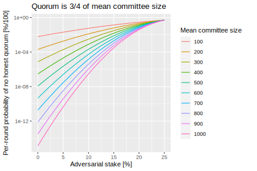

A malicious party with less than 25% adversarial stake can (as in Praos) create private forks and then reveal them publicly whenever they see fit. In the context of Peras, they might try to build a fork that is longer than the public, preferred fork and then reveal it just $L$ slots before the end of the current round. Since it is then the longest chain, all parties (honest and adversarial) will likely extended it with newly forged blocks. When voting occurs at the start of the next round, that formerly adversarial chain will receive the boost and the honest fork will be abandoned essentially forever. Any transactions on that honest fork will be rolled back. Essentially, a strong enough adversary has some probability of rolling back a public, honest chain's blocks between $L + U$ and $L$ in the past.

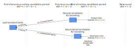

The plot below illustrates how shorter rounds and stronger adversaries make such attacks more likely. It is important to note that this attack cannot roll back transactions further than the last previously recorded boost (near $U + L$ in the past). This is why Peras provides an effective *ex post facto* finality: once a boost appears, all of the transactions prior to that are safe. Until a boost appears, blocks are at risk in Peras just as they are in Praos.

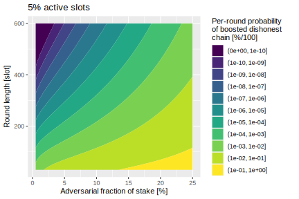

Decentralized, stake-based block production and voting systems may be subject to equivocations, where a slot leader or a voting-committee member creates more than one block or casts duplicate votes for different blocks. Protocols' no-equivocation rules ensure that only the first block or vote is acted upon by the node. In the case of Peras, an adversary does not gain power from equivocating votes unless they have near 50% or more of the stake. A scenario where an adversary sends one version of a vote to some honest nodes and a different version to the other honest nodes will not affect the outcome of voting any more than if the adversary were not to vote at all. Equivocated votes burden the nodes slightly by creating extra network traffic.

Natural events or adversaries might interfere with the diffusion of votes over the network. Peras voting is not affected so long as the network diffuses at least the 75% threshold for reaching a quorum. One quarter of the votes could be lost, dishonest, or withheld. Furthermore, the Peras $L$ parameter ensures that there is plenty of time for honest blocks to diffuse and for them to be in a common prefix of the active forks before voting begins. The Peras $R$ parameter, the number of slots for which certificates (votes) are ignored once a cool-down period starts, guards against an adversary holding onto votes and then releasing them to try to revert an already-begun cool-down period.

In no way does Peras weaken any of the security guarantees provided by Praos or Genesis. Under strongly adversarial conditions, where an adversary can trigger a Peras voting cool-down period, the protocol in essence reverts to the Praos (or Genesis) protocol, but for a duration somewhat longer than the Praos security parameter. Otherwise, settlement occurs at the blocks that Peras voting has boosted. The Peras protocol parameters can be tuned to adjust the settlement time or the non-settlement probabilities. Some stakeholder use cases might prefer shorter settlement times but with a higher probability of retries, or vice versa.


### Resource requirements

The impact of Peras upon nodes falls into four categories: [network](#network), [CPU](#cpu), [memory](#memory), and [storage](#persistent-storage). The [Peras Technical Report #2](https://peras.cardano-scaling.org/docs/reports/tech-report-2#resources-impact-of-peras) provides supporting data, simulations, and discussion. The discussion in the following sub-sections summarizes evidence that the CPU time required to construct and verify votes and certificates is much smaller than the duration of a voting round. Similarly, the memory needed to cache votes and certificates and the disk space needed to persist certificates is trivial compared to the memory needed for the UTXO set and the disk needed for the blocks. On the networking side, ΔQ studies demonstrate that diffusion of Peras votes and certificates consumes minimal bandwidth and would not interfere with other node operations such as memory-pool and block diffusion. However, diffusion of votes and certificates across a network will still have a noticeable impact on the volume of data transfer, in the order of 20%, which might translate to increased operating costs for nodes deployed in cloud providers.

#### Network

For a fully synced nodes, the impact of Peras on network traffic is modest:

* For votes, assuming $U \approx 100$, a committee size of 2000 SPOs, a single vote size of 700 bytes, means we will be adding an average of 14 kB/s to the expected traffic to each node,
* For certificates, assuming an average of 50 kB size consistent with the size of current Mithril certificates, means an negligible increase of 0.5 kB/s on average. Note that a node will download either votes or certificate for a given round, but never both so these numbers are not cumulative.

A fully non-synced node will have to catch-up with the _tip_ of the chain and therefore download all relevant blocks _and_ certificates. At 50% load (current monthly load is 34% as of this writing[^9]), the chain produces a 45 kB block every 20 s on average. Below are rough estimates of the amount of data a node would have to download (and store) for synchronizing, depending on how long it has been offline:

| Time offline | Blocks (GB) | Certificates (GB) |
| ------------ | ----------- | ----------------- |
| 1 month      | 5.56        | 1.23              |
| 3 months     | 16.68       | 3.69              |
| 6 months     | 33.36       | 7.38              |

The Peras [Technical Report #1](https://peras.cardano-scaling.org/docs/reports/tech-report-1#network-performance-analysis) and [Technical Report #2](https://peras.cardano-scaling.org/docs/reports/tech-report-2#vote-diffusion) document network performance analysis for vote diffusion in Peras, using a ΔQ model[^10] to evaluate the expected delay to reach _quorum_. The plot below shows the diffusion of a single vote (red) and the receipt and verification of a quorum of votes (green for parallel verification of votes and blue for sequential verification of votes). The graph demonstrates that vote diffusion should be non-problematic, with a quorum expected to be reached in under 1 second most of the time to compare with a round length of about 2 minutes.

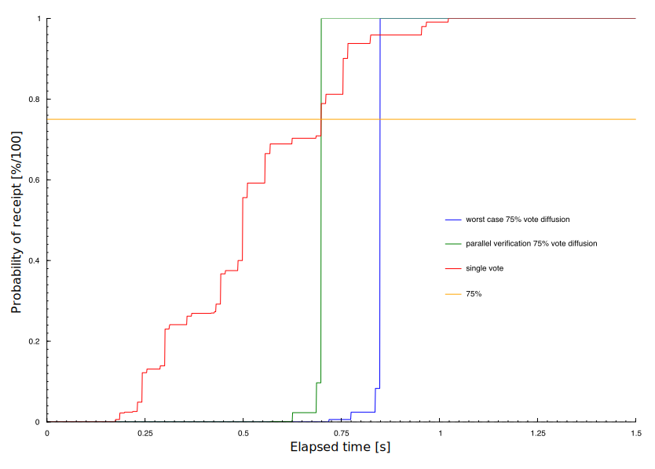

#### Cost

Network usage and the infrastructure for the Cardano node translates to monthly costs. This can be estimated for Peras from published network pricing for a few major Cloud and well-known VPS providers, based on the share of stakes each provider is reported to support[^11], and some typical traffic pattern as exemplified by the following plot (data courtesy of Markus Gufler).

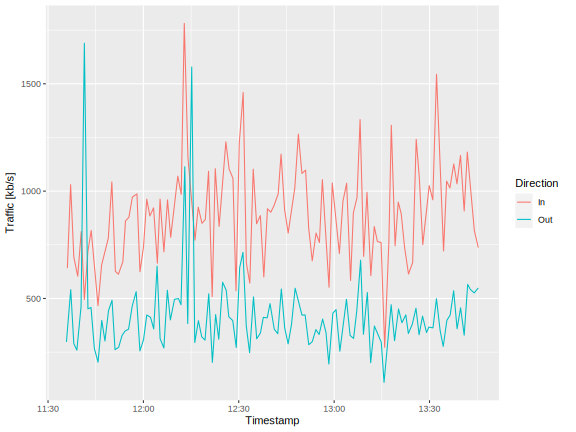

The next table compares the cost (in US\$/month) for different outgoing data transfer volumes expressed as bytes/seconds, on similar VMs tailored to cardano-node's hardware requirements[^12] (32 GB RAM, 4+ Cores, 500 GB+ SSD disk). The base cost of the VM is added to the network cost to yield total costs depending on transfer rate[^13]. For an AWS hosted SPO, which represent about 20% of the SPOs, a 14 kB/s increase in traffic would lead to a cost increase of **\$3.8/mo** (34 GB times \$0.11/GB). This represents an average across the whole network: depending on the source of the vote and its diffusion pattern, some nodes might need to send a vote to more than one downstream peer which will increase their traffic, while other nodes might end up not needing to send a single vote to their own peers. Any single node in the network is expected to download each vote _at most_ once.

| Provider     |     VM | 50 kB/s | 125 kB/s | 250 kB/s |
| ------------ | -----: | ------: | -------: | -------: |
| DigitalOcean |   $188 |    $188 |     $188 |     $188 |
| Google Cloud |   $200 |    $214 |     $234 |     $268 |
| AWS          | ? $150 |    $161 |     $178 |     $206 |
| Azure        |   $175 |    $186 |     $202 |     $230 |
| OVH          |    $70 |     $70 |      $70 |      $70 |
| Hetzner      |    $32 |     $32 |      $32 |      $32 |

[^9]: https://cexplorer.io/usage

[^10]: https://iohk.io/en/research/library/papers/mind-your-outcomes-the-dqsd-paradigm-for-quality-centric-systems-development-and-its-application-to-a-blockchain-case-study/

[^11]: https://pooltool.io/networkhealth

[^12]: https://developers.cardano.org/docs/operate-a-stake-pool/hardware-requirements/

[^13]: The AWS cost is quite hard to estimate up-front. The $150 base price is a rough average of various instances options in the target range. Google, AWS and Azure prices are based on 100% uptime and at least 1-year reservation for discounts. Cloud providers only charge _outgoing_ network traffic. The actual cost per GB depends on the destination, this table assumes all outbound traffic will be targeted outside of the provider which obviously won't be true, so it should be treated as an upper bound.

#### Persistent storage

Under similar assumptions, we can estimate the storage requirements entailed by Peras: ignoring the impact of cool-down periods, which last for a period at least as long as $k$ blocks, the requirement to store certificates for every round increases node's storage by about **20%**. Votes are expected to be kept in memory so their impact on storage will be null.

#### CPU

The [Peras Technical Report #2](https://peras.cardano-scaling.org/docs/reports/tech-report-2#votes--certificates) provides some models and benchmarks for votes generation, votes verification, certificates proving and certificates verification, and votes diffusion. The CPU requirements will of course be dependent on the details of the Certificates' scheme used but should be negligible compared to the duration of a voting round. Moreover, as already noted, votes and certificates construction are kept out of the critical path of block forging and diffusion hence they should not impact the node's performance.

#### Memory

A node is expected to need to keep the following data in memory:

* *Votes for the latest voting round:* For a committee size of 1000 and individual vote size of 700 bytes, that amounts to 700 kB.
* *Cached certificates for voting rounds up to settlement depth, for fast delivery to downstream nodes:* With a boost of 10/certificate, settlement depth would be in the order of 216 blocks, or 4320 seconds, which represent about 10 rounds of 400 slots. Each certificate weighing 50 kB, that is another 500 kB of data a node would need to cache in memory.

Thus, Peras should not have any significant impact on the memory requirements of a node.


## Path to active

- [ ] Clear evidence of stakeholder use cases that require the fast *ex post facto* settlement that Peras provides.


### Acceptance criteria

- [ ] The revised `cardano-node` implementations pass the node-level conformance test suites.
- [ ] Audit.
- [ ] Successful operation in testnet environments.
- [ ] Community agreement on the settings for the Peras protocol parameters.
- [ ] The upcoming CIP that establishes a *Consensus* category for CIPs may define additional acceptance criteria.


### Implementation plan

- [ ] Detailed node-level (as opposed to this protocol-level) specification.
- [ ] Develop node-level conformance test suite.
- Consider developing a "quick and dirty" implementation for large scale experiments.
- Coordinate with related activities on other protocol enhancements.
    - Compatibility between Peras, Leios, and Genesis.
    - Common design and implementation for certificates, voting, and related key registration: Mithril, Peras, Leios, and partner chains.
- Triage by intersect Core Infrastructure and Consensus functions.

The following diagram summarizes a possible architecture for Peras highlighting its interactions with other components of the node.

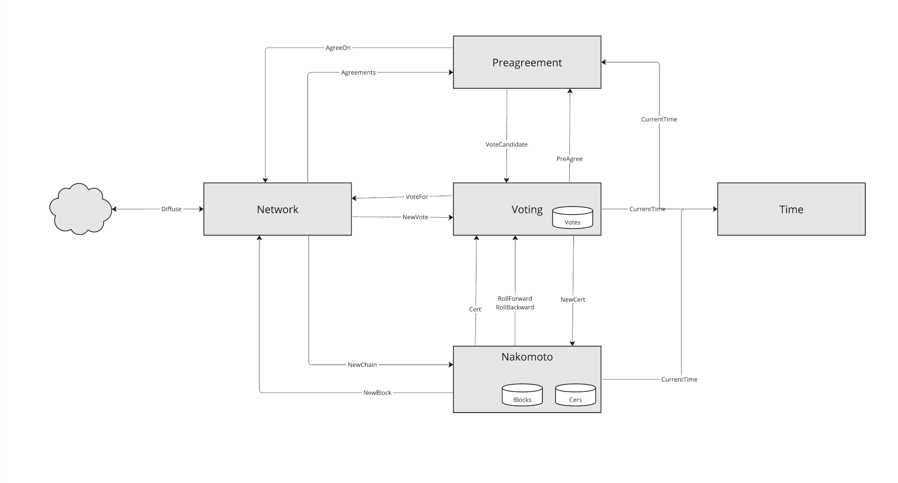

Peras has no impact in the existing block diffusion process, and imposes no changes to the block header structure. The block body structure needs to accommodate for a certificate, but only on the rare occasions when the chain enters or leaves a cool-down period.

The consensus *preferred chain* selection algorithm must be modified to be aware of the existence of a _quorum_ when computing the _weight_ of a possible chain, which is manifested by a _certificate_ from the Peras component. Consensus will need to maintain or query a list of valid certificates (e.g., similar to _volatile_ blocks) as they are received or produced. The chain selection and headers diffusion is not dependent on individual votes.

The Peras component can be treated as another *chain follower* to which new blocks and rollbacks are reported. The Peras component will also need to be able to retrieve current *stake distribution*. Furthermore, it needs to access to VRF and KES keys for voting: see [_Votes & Certificates on Cardano_](https://github.com/cardano-foundation/CIPs/pull/870) for details. Dedicated long term storage will be needed for certificates.

The networking layer will need to accommodate two new mini-protocols for vote and certificate diffusion. In general, there are opportunities for shared voting, certificate, and diffusion components that handle Peras, Leios, and Mithril uniformly.

Prior to full-scale Peras implementation, it would be possible to develop a standalone Peras prototype built upon the existing node, where the node is modified to receive chain-weight information from Peras, which acts as a chain follower and communicates with the node via an ad-hoc mechanism. Such a prototype would run on a testnet where the measurements and experiments could be conducted.


## Versioning

This document describes the *pre-alpha* version of the Peras protocol. We anticipate a subsequent, separate CIP for an *alpha* or *beta* version of the protocol. That version will add strong guarantees for block selection prior to the voting process and will constitute a layer built upon this pre-alpha version.

This machine-readable specification is pinned to [Agda 2.6.4.3](https://github.com/agda/agda/tree/v2.6.4.3), the [Agda Standard Library 2.0](https://github.com/agda/agda-stdlib/tree/v2.0), and the [IOG Agda Prelude v0.1.0.0](https://github.com/input-output-hk/iog-agda-prelude/releases/tag/v0.1.0.0) via the file [flake.lock](./flake.lock). Thus it is fully and deterministically reproducible. Future revisions of the Agda code in this specification must be type checked against either those pinned versions or an upgraded future piinning of Agda and those libraries.


## References

- [Peras web site](https://peras.cardano-scaling.org/)
- [Discord channel for Peras](https://discord.gg/9EgySPJk)
- [Peras Technical Report #1](https://peras.cardano-scaling.org/docs/reports/tech-report-1)
- [Peras Technical Report #2](https://peras.cardano-scaling.org/docs/reports/tech-report-2)
- [Software repository for Peras design](https://github.com/input-output-hk/peras-design/)
- [Online simulator for the Peras protocol](https://peras-simulation.cardano-scaling.org/)
- [Scaling blockchain protocols: a research-based approach](https://www.youtube.com/watch?v=Czmg9WmSCcI)
- [Consensus Redux: Distributed Ledgers in the Face of Adversarial Supremacy](https://eprint.iacr.org/2020/1021.pdf)
- [Practical Settlement Bounds for Longest-Chain Consensus](https://eprint.iacr.org/2022/1571.pdf)


## Appendix


### Typechecking this specification

With [Nix](https://nix.dev/install-nix.html) installed and [Nix flakes](https://nixos.wiki/wiki/Flakes) enabled, one just needs to execute the following command to run the Agda typechecker on this file:

```bash
nix build --no-link
```

Additionally, one can also open a Nix development shell and view, edit, or compile this specification in Emacs.

```bash
nix develop

emacs README.lagda.md
```

The first time one runs `agda-mode` in Emacs[^14], one might have to execute `agda-mode setup`, which adds lines like the following to the local configuration file `$HOME/.emacs`:

```lisp
(load-file (let ((coding-system-for-read 'utf-8))
                (shell-command-to-string "agda-mode locate")))

;; auto-load agda-mode for .agda and .lagda.md
(setq auto-mode-alist
   (append
     '(("\\.agda\\'" . agda2-mode)
       ("\\.lagda.md\\'" . agda2-mode))
     auto-mode-alist))
```

Finally, the Nix flake [flake.nix](./flake.nix) contains the derivation for building this specification, and its lock file [flake.lock](./flake.lock) records the commit hashes of all dependencies, thus enabling a fully reproducible set of dependencies.

[^14]: https://agda.readthedocs.io/en/v2.6.4.3/tools/emacs-mode.html


## Copyright

This CIP is licensed under [Apache-2.0](http://www.apache.org/licenses/LICENSE-2.0).
