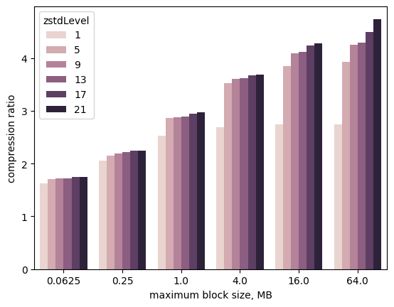
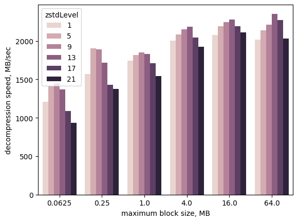
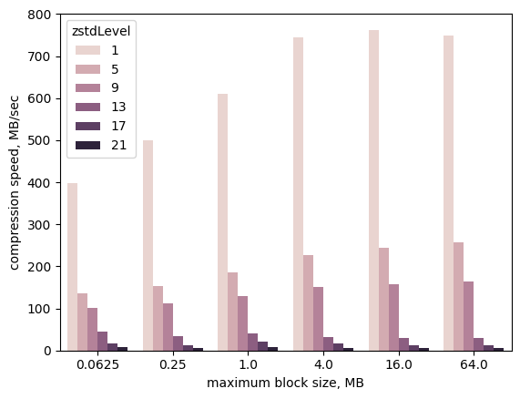
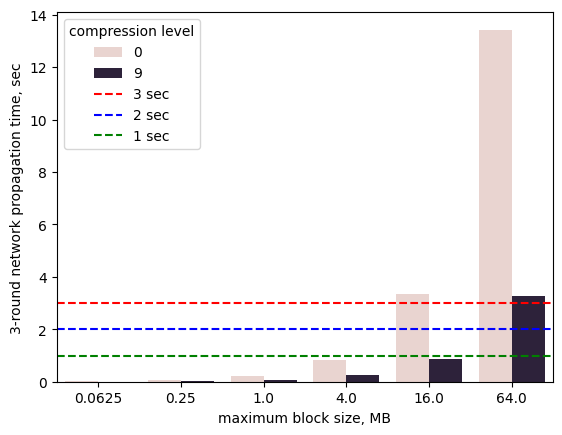
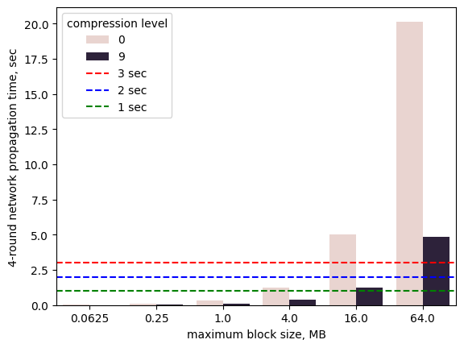

## Abstract

This proposal presents a lightweight extension to the Cardano Network protocol that:
- Establishes a technical foundation for significantly increasing the ```max_block_size``` and ```active_slot_coefficient``` protocol parameters, improving the throughput and latency of the Cardano blockchain.
- Accelerates blockchain synchronization by optimizing the download process for new and lagging nodes.
- Lowers network traffic costs for Cardano stake pool operators through improved data transmission efficiency.

## Motivation: Why is this CIP necessary?

### The Status Quo

The current block-generation time and maximum throughput of the Cardano blockchain are several orders of magnitude behind those of its more recent competitors. While ongoing research explores major architectural changes, such as sharding, this proposal offers an interim scalability improvement by enabling stake pool operators to better leverage modern hardware. By optimizing network performance with minimal protocol changes, this approach helps Cardano remain competitive until more comprehensive scaling solutions are ready for deployment.

### Capabilites That Drive Demand

Newer blockchains, such as Solana and Aptos, have shown that shorter block generation times and higher maximum throughput attract new use cases and drive greater demand for blockchain transactions. Thus, the claim that Cardano does not need to increase its throughput because blocks are not currently saturated overlooks the fact that alternative blockchains handle vastly more transactions—by orders of magnitude—than Cardano. This difference demonstrates strong demand for higher throughput and faster block generation.

### Broad Availability of Affordable High-Performance Hardware

Over the last decade, there has been a significant improvement in both CPU performance and network connectivity for rentable cloud servers. For example, servers with 24 CPU cores and 1 Gbps Internet connections are now available for lease for under $500 per month. By efficiently leveraging this hardware, it is possible to scale Cardano with minimal changes to the protocol.
Following sections present one approach to achieving this.

This document does not propose a specific minimum hardware configuration for block-producing nodes.
Instead, it demonstrates the scalability achievable with certain configurations and argues that Cardano's protocols and software should be capable of leveraging them.

Analyzing more powerful hardware configurations is also important because implementing this CIP may take a year or two. During that time, hardware performance is likely to improve while costs decline. Therefore, it is valuable to discuss hardware configurations that may become standard in the near future.

### WORM Access Pattern

A fundamental property of blockchain data is that historical blocks are immutable. Another key property is that each historical block is transferred to all other nodes, where it is read and validated.

Therefore, block data follows a **Write Once, Read Many (WORM)** access pattern. This pattern is common in online services that distribute digital data. To optimize for this, specialized compression techniques have been developed. These techniques prioritize compression ratio and decompression speed, as blockchain data is written once but read frequently. Since blocks are typically compressed before distribution, compression speed is of secondary importance.

One example of such a technique is the [ZStandard](https://github.com/facebook/zstd) algorithm, which strikes an excellent balance between compression ratio and decompression speed. The following section explores its effectiveness on Cardano Mainnet data.

### ZStandard Performance on Mainnet Data

To understand the behavior of ZStandard compression on the Cardano mainnet data, a quick simulation using two parameters has been conducted on epoch 525. The table below summarizes the simulation parameters, and the three charts display the results. The raw simulation results are provided in the [stats.json](stats.json) file.

| Simulated&nbsp;Parameter | Value&nbsp;Range | Description |
|---------------------    |-------------      |-------------|
| ```max_block_size```    | **64&nbsp;KB**&nbsp;to&nbsp;**64&nbsp;MB** | Block sizes  were simulated by dynamically regroupping real transactions from the Cardano mainnet to evaluate their impact on compression. |
| ```compression_level``` | **1**&nbsp;to&nbsp;**21**                  | A parameter that influences both the compression ratio and speed of the ```ZStandard``` algorithm, with higher levels generally providing greater compression at reduced speed. |





The above charts show the following tendencies:
- The compression ratio increases with the block size.
- Block sizes below 4 MB are too small to achieve high compression ratios.
- The decompression speed remains above **800 MB per second** for all parameter values.
- Compression speed is primarily dependent on the compression level, with minor improvements from larger block sizes.
- **Compression level 9** offers a good balance of compression ratio and speed and will be used in further analysis of ZStandard performance.

### Retransmission Rounds and Block Propagation Time

For a newly generated block to have a high chance of being included in the blockchain, it must reach at least 90% of the active stake before the next block is produced. The table below illustrates the distribution of active stake in epoch 525. It shows that reaching the top 515 pools covers 90% of the active stake, while reaching the top 975 pools covers 99% of it.

| Number of Largest Pools (Epoch 525) | Percentage of Active Stake |
| --- | --- |
| 177 | 50.1% |
| 337 | 75.1% |
| 515 | 90.0% |
| 654 | 95.0% |
| 975 | 99.0% |
| 1373 | 99.9% |
| 2834 | 100.0% |

Each block-producing node has open connections to a small subset of block-producing stake pools. Therefore, block propagation requires multiple rounds of retransmission for a new block to reach most nodes.

The required number of retransmission rounds can be estimated from a typical stake pool’s network configuration. To highlight the benefits of leveraging modern hardware, we assume all pools operate on a symmetric 1 Gbps Internet connection. Such a connection allows a block-producing node to maintain 10 open connections with 100 Mbps of bandwidth reserved for each.

The number of retransmission rounds can be calculated as the logarithm (base number of connections) of the total number of stake pools. The table below illustrates that three retransmission rounds in this configuration are sufficient to deliver a new block to 1,000 nodes, while four rounds are needed for 10,000 nodes.

| Retransmission Round Number | Stake Pools Receiving New Block |
| --- | ---- |
| 1   | 10    | 
| 2   | 100   |
| 3   | 1000  |
| 4   | 10000 |

Going forward, the required number of retransmission rounds is referred to as the **retransmission coefficient**. This coefficient is important because optimizations in data compression affect not just one retransmission round but all rounds. The implications of this will be explored further in the following sections.

### Impact of Data Compression on Network Propagation Time

The figure below illustrates the network propagation time of a block across three retransmission rounds. The evaluated compression settings are either no compression (level 0) or ZStandard level 9 and the assumed network bandwidth available for each connection is 100 Mbps. This analysis does not account for cross-continent round-trip delays or data processing overhead, which are discussed in the next section.

A key result is that 16 MB blocks—nearly 200 times larger than the current Cardano block size of 90 KB—can still be retransmitted in under one second with three rounds of retransmissions.



Even with four retransmission rounds, the network propagation time for 16 MB blocks remains just above one second, as illustrated in the next figure. Therefore, accounting for additional delays and inefficiencies, it becomes possible to consider 2- or 3-second block-generation times.



These results highlight how Cardano can leverage affordable high-performance servers and WORM-optimized compression algorithms to significantly improve its network efficiency

### Block Validation Time

Before retransmitting a block, a node must first validate it. This validation consumes CPU resources proportional to the number of transactions in the block, and thus, its size. This could make validation time a bottleneck, leading some to argue that optimizing network efficiency is a lower priority.

However, effective use of parallelization, together with the availability of affordable 24-core servers, can help manage the increased CPU demands without increasing block processing time.

Recent research ([Parallelized Ouroboros Praos](https://github.com/sierkov/daedalus-turbo/blob/main/doc/2024-sierkov-parallelized-ouroboros-praos.pdf), [Parallelization-Aware Plutus Benchmarking Dataset](https://github.com/sierkov/daedalus-turbo/tree/main/experiment/plutus-benchmark)) has shown that most resource-intensive steps of block validation can be parallelized with an efficiency coefficient above 0.9 for up to 24 worker threads:
- Validation of consensus rules.
- Verification of cryptographic and script transaction witnesses.
- Checking transaction inputs against the UTXO set.

### Cross-Continent Transmission Delays

A potential concern is that Cardano nodes are geographically distributed, leading to network packet round-trip times of up to 200 milliseconds in extreme cases. However, these cross-continent transmission delays can be mitigated through smarter algorithms for constructing node connectivity graphs. By optimizing these graphs, the impact of cross-continent delays can be minimized, ensuring that the delay penalty is incurred only once per full block retransmission cycle.

### Moving in Small Steps

Cardano's average block-generation period is 20 seconds, with a maximum block size of 90 KB. There is a substantial difference between these parameters and the discussed 16 MB block size with a 2- to 3-second block-generation period.

Reducing the block-generation time to 10 or 5 seconds and increasing the maximum block size to 1 MB would still provide a sufficient safety margin for block processing and cross-continent delays, while delivering a major immediate improvement to Cardano's scalability.

Furthermore, these incremental changes would provide Cardano with the necessary time and empirical data to refine its block processing and network propagation algorithms, ultimately enabling even lower propagation times, such as 3 or 2 seconds.

### Compresed Storage of Blockchhain Data

A final remark regarding compression is that the compression ratio increases with input size, even beyond the proposed block size of 16 MB. This fact can be leveraged to organize the compressed local storage of blocks:
- Grouping blocks into larger chunks to achieve better compression ratios.
- Utilizing the maximum compression level to further enhance the compression ratio.

### Secure Integration of ZStandard Compression

The ZStandard C library is a highly optimized and widely adopted compression algorithm. It is used by major organizations such as Google and Mozilla and is supported as a content encoding in browsers like Chrome and Firefox. Additionally, ZStandard participates in Google's [OSS-Fuzz](https://introspector.oss-fuzz.com/projects-overview) initiative, which highlights its code quality and robustness.

However, since ZStandard is implemented in C—a language without built-in memory safety—careful security measures must be in place to mitigate potential risks.

The primary security concern is a vulnerability in the decompression algorithm. The decompression code directly processes untrusted data received over the Internet. A malicious actor could craft a compressed block to exploit such vulnerabilities, potentially affecting all nodes, as every node must validate new blocks.

In contrast, the compression process presents a lower risk, as it operates only on known data controlled by the block producer.

Most Cardano nodes run on Linux, which provides several security mechanisms to mitigate these risks. By ensuring that the decompression process is secure on Linux, we can achieve significant risk reduction. The following strategies can be applied:
- **Isolation via IPC**: Running ZStandard in a separate process with minimal privileges and communicating through an IPC mechanism (e.g., a Unix socket). Even if an attacker exploits a vulnerability, they would only gain access to already published blocks or blocks pending validation, minimizing the impact.
- **Virtualization**: Running ZStandard within a lightweight virtualized environment for added isolation.
- **Dedicated Relay Node**: Executing ZStandard on a separate relay node, which does not store sensitive data such as private keys.

Among these, isolation via IPC is particularly attractive due to its minimal impact on performance and decompression latency. To demonstrate this approach, this proposal includes an example implementation that leverages Linux’s ```seccomp``` library to restrict available syscalls to only ```read```, ```write```, and ```exit```, significantly limiting the attack surface. Further details are provided in the section **Example Approach to Secure Integration of ZStandard Library on Linux**.

For enhanced security, these strategies can be combined to provide multiple layers of defense. Moreover, modern Linux distributions also include **Data Execution Prevention (DEP)** and **Address Space Layout Randomization (ASLR)** by default, which harden the system against memory-based exploits by preventing code execution in non-executable memory regions and randomizing memory addresses.

Another option for securely executing ZStandard compression code is **WebAssembly (WASM)**.
C code with minimal modifications can be compiled directly into WASM bytecode, enabling secure execution within a WebAssembly runtime. This approach has already been explored in projects such as [zstandard-wasm](https://github.com/fabiospampinato/zstandard-wasm).  Moreover, early benchmarks indicate that decompression performance is reduced by only a factor of two compared to native execution. Given this level of efficiency, WebAssembly presents a viable solution for reducing block propagation time while enhancing security.

Finally, ```ZStandard``` data format is well documented in [RFC8478](https://datatracker.ietf.org/doc/html/rfc8478), which allows for the development of decompression implementations in memory-safe languages. For example, a Rust-based implementation, [zstd-rs](https://github.com/KillingSpark/zstd-rs), already exists. However, its current decompression performance is reported to be approximately **3.5 times slower** than the C version.

## Specification

The technical foundation for the above improvements can be achieved with minimal changes to [the existing network protocol](https://ouroboros-network.cardano.intersectmbo.org/pdfs/network-spec/network-spec.pdf):
- Clients will use a new version number to signal support for compressed transfers during the handshake.
- The FetchBlock mini-protocol is extended to include a new Server Message, ```MsgCompressedBlocks``` in the StStreaming state.
- Stake pool operators can optionally indicate protocol version support in onchain data.

The following sections provide a detailed breakdown of these changes.

### New Protocol Version Number

The Ouroboros Network Specification includes an effective mechanism for feature extension via the Handshake mini-protocol. The next unallocated version number (e.g., 15) should be used by clients and servers to signal support for the extended FetchBlock mini-protocol.

### MsgCompressedBlocks Message for StStreaming State

```
MsgCompressedBlocks = [6, encoding, encoded_data]

; value 0 - no compression
; value 1 - ZStandard compression
; values 2+ - reserved for future use
encoding = uint

encoded_data = bytes
```

```MsgCompressedBlocks``` is a new server message used to transfer a sequence of blocks, extending the functionality of ```MsgBlock``` by allowing:
- The transmission of multiple blocks at once.
- The option to compress a sequence of blocks.

The server can choose to send either compressed or uncompressed blocks based on its configuration. This capability enables the server to send blocks as they are stored on disk, which improves performance and reduces CPU processing times during batch synchronization.

### Example Approach to Secure Integration of ZStandard Library on Linux

Since Cardano block-producers are run dominantly on Linux, the use of the **Isolation via IPC** tactic can be further strengthened using Linux's ```seccomp``` feature to minimize the potential attack surface. An example implementation of this approach is provided in the [secure-zstd](https://github.com/sierkov/secure-zstd) repository.

#### How It Works:
1. The managing (caller) process creates a Unix socket.
2. A new worker process is started, which communicates exclusively with the parent process through this socket.
3. The worker process pre-initializes the ZStandard library by running a compressor and decompressor on a statically defined dataset. This eliminates the need for further dynamic memory allocations.
4. The worker process closes all open file descriptors except for the Unix socket.
5. The worker process applies a ```seccomp``` profile to restrict system calls to only ```read```, ```write```, and ```exit```.
6. The worker process is then ready to handle compression and decompression requests from the caller process.

An attacker can still send malicious data to the Cardano Node. However, in such cases, the worker process will immediately crash, and the caller process will receive a corresponding notification.

Given the high quality of the ZStandard library, such a crash is likely indicative of an attack attempt, warranting an appropriate response:
- **Block the malicious peer** to prevent further communication and mitigate potential Denial-of-Service attacks.
- **Restart the worker process** to continue handling requests from a safe state.

The provided implementation is compact—approximately **200 lines of code** for [the worker process](https://github.com/sierkov/secure-zstd/blob/main/lib/seczstd/worker.c) and **100 lines of code** for [the caller](https://github.com/sierkov/secure-zstd/blob/main/lib/seczstd/caller.c). This allows for **easy security audits** compared to auditing the full ZStandard decompression library, which consists of about **15,000** lines of code.

Furthermore, the **Isolation via IPC** approach, extended with ```seccomp```, can be similarly applied to other untrusted data-processing tasks, such as newer but less-tested cryptographic libraries (e.g., potential Plutus builtins) and other use cases.

### Indicating Protocol Version Support in Stake Pool Operator On-Chain Data

Some clients may prefer receiving block data in a compressed form to save bandwidth. Providing a quick way to identify stake pool operators that support compressed transfers would be valuable.

Cardano stake pool operators can already publish a URL linking to a publicly available JSON file containing additional information about their pool. These URLs are recorded on-chain and can also be retrieved through a stake pool metadata aggregation service (SMASH).

This proposal extends the metadata JSON by adding an optional key, ```protocolVersions```, which contains a list of currently supported protocol versions as a JSON array.

```
protocolVersions = [12, 13, 15]
```

This allows clients to quickly determine whether a stake pool operator supports the latest protocol version, including features such as compressed block transfers.
This is particularly important during node bootstrapping, when a new node does not yet have an up-to-date list of block-producing nodes but needs to synchronize as quickly as possible.

### Possible Support Levels

The specification is intentionally designed to facilitate partial and incremental implementation. The following levels of support are possible:
- **Minimal level** – A minimal implementation only needs to recognize protocol version 15 during the handshake and be able to parse MsgCompressedBlocks messages.
  This implementation is straightforward and can be completed within days in most programming languages.
- **Intermediate level** – In addition to parsing compressed blocks, an intermediate implementation can compress block data on-the-fly for each transmitted block.
  Although on-the-fly compression is not CPU-efficient, ZStandard’s level 9 compression speed exceeds 100 MB/sec, allowing a single CPU core to fully saturate a 1 Gbps connection.
  Implementing this is also straightforward and should take about a week in most programming languages.
- **Advanced level** – To use CPU resources more efficiently, an advanced implementation may either cache previously compressed blocks in memory or store all block data in a compressed format.
This may require additional work, as certain software components may need to be modified to support compressed block data.
- **Full level** – A full implementation must leverage data compression for block storage, including storing compressed block data on disk
and enabling direct transmission of compressed block sequences from disk when a client requests a block range.

To be ready for testnet testing, all implementations should provide at least minimal support, and at least one implementation should support the intermediate level.

## Rationale: How does this CIP achieve its goals?

- Analyzes how support for data compression can serve as a technical foundation for drastically improving Cardano's scalability.
- Evaluates the performance of the ZStandard compression algorithm on Cardano mainnet data.
- Demonstrates how data compression, combined with more efficient use of affordable, high-performance server hardware, can scale Cardano’s transaction throughput by multiple orders of magnitude.
- Proposes specific changes to the networking protocol to enable data compression.

## Path to Active

### Acceptance criteria
- The proposed changes have been discussed and approved by subject matter experts.
- An implementation has been prepared and addresses all major concerns identified during discussions.
- The implementation has been tested on a testnet.
- A security model for using the ZStandard compression library on the mainnet has been presented and approved by subject matter experts.
- Any new concerns arising during testnet evaluation are addressed in an updated implementation, which is subsequently confirmed through a follow-up testnet evaluation.

### Implementation plan
- Develop the implementation. The individuals responsible for development will be designated after approval from subject matter experts has been received.
- Deploy and test on the testnet.
- Deploy on the mainnet following successful testnet evaluation.

## Copyright

This CIP is licensed under [CC-BY-4.0](https://creativecommons.org/licenses/by/4.0/legalcode).
