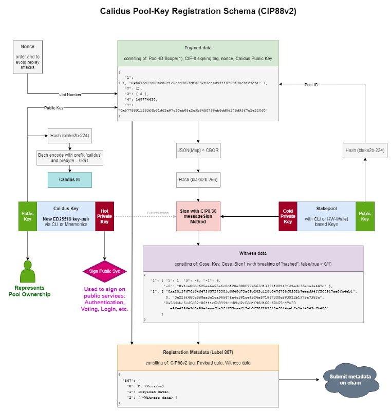

## Abstract

[CIP-0088] defined a standard to submit on-chain registration certificates with
a specific initial focus on Cardano's _Native Scripts_ specifically related to
NFT and FT minting policies. This extension to the standard aims to provide
support for stake pools to register verifiable information on-chain.

## Motivation: why is this CIP necessary?

By extending the existing [CIP-0088] specification we can provide an extensible
framework for stake pool operators (SPOs) to provide verifiable, on-chain
information related to their pool operation. This method is preferred over a
change to the in-ledger stake pool registration certificates because additional
extensions and functionality may be added dynamically without changing the core
Cardano network ledger.

## Specification

[CIP-0088] provides a clear framework for extension and versioning of the
standard so this CIP introduces a _[Version 2]_ of the CIP-0088 Master CDDL
along with a number of other changes.

### Registration Metadata Format

`Version: 2`

| Index | Name                                                 | Type  | Required | Notes                                                        |
|-------|------------------------------------------------------|-------|----------|--------------------------------------------------------------|
| 0     | Version                                              | UInt  | Yes      | Should be set to 2                                           |
| 1     | [Registration Payload](#registration-payload-object) | Map   | Yes      | Object describing and providing details for the token policy | 
| 2     | [Registration Witness](#registration-witness-array)  | Array | Yes      | Array of witness signatures used to validate the payload     |

### Registration Payload Object

The Token Registration Payload Object (TRPO) consists of 4 required fields and
optional additional fields to provide context and information. The top-level
metadata label of **867** has been chosen for the purposes of this standard.

#### Fields

| Index | Name              | Type   | Required | Notes/Examples                                                                                                                                                                                                                                    |
|-------|-------------------|--------|----------|---------------------------------------------------------------------------------------------------------------------------------------------------------------------------------------------------------------------------------------------------|
| 1     | Scope             | Array  | Yes      | An array defining the scope of this registration (for greater compatibility with CPS-0001). The first entry should be an unsigned integer value identifying the type of scope while the second entry addresses the specific scope of registration |
| 2     | Feature Set       | Array  | Yes      | An array of unsigned integers specifying none or more CIP standards utilized by the tokens of this project. Should reference the assigned CIP number.                                                                                             |
| 3     | Validation Method | Array  | Yes      | How should this payload be validated.                                                                                                                                                                                                             |
| 4     | Nonce             | UInt   | Yes      | A simple cache-busting nonce. Recommend to use the blockchain slot height at the time of submission. Only the highest observed nonce value should be honored by explorers.                                                                        |
| 7     | Calidus Key       | String | No       | An Ed25519 public key that is authorized by the owner to authenticate and sign messages on behalf of the _Scope_                                                                                                                                  |

> The following fields (1-4) are required in all token registration submissions.

##### 1. Scope

The scope entry indicates what type of entity is being registered with this
metadata.

**Scopes**

| ID | Scope         | Format                             |
|----|---------------|------------------------------------|
| 0  | Native Script | `[0, h'policyID', [h'policyHex']]` |
| 1  | Stake Pool    | `[1, h'poolID']`                   |

0. **Native Scripts**: Native scripts should be specified as an array with the
   first entry indicating the type (Native Script), the second entry indicating
   the script hash (Policy ID) and the third entry consisting of an array with
   one or more 64-byte strings constituting the hex-encoded CBOR representation
   of the Native Script itself. In this way, CIP-88 registration may be
   submitted on-chain prior to any tokens being minted and can be used by
   validators to confirm the legitimacy of the certificate without any secondary
   information source.
1. **Stake Pool**: Stake pools are specified as an array with the first entry
   indicating the type (Stake Pool), the second entry is the Pool ID. The Pool
   ID is the blake2b-224 hash of the pool **cold** public key.

**Example:**

Native Script:
<br />
`[0, h'3668b628d7bd0cbdc4b7a60fe9bd327b56a1902e89fd01251a34c8be', h'8200581c4bdb4c5017cdcb50c001af21d2488ed2e741df55b252dd3ab2482050']` <br />
Stake Pool:
<br />
`[1, h'71e3c37983775238704fad6d337ca632c713829292bf10a8e9fc50ad']`

#### 2. Feature Set

The _Feature Set_ is a simple array of unsigned integer values representing the
CIP standards that should be applied to the subject scope. For now this should
be an empty array when registering a stake pool.

**Example:**

`[25, 27]`

#### 3. Validation Method

In order to minimize issues relating to capitalization and misspellings, we
should use a well-defined map of integer values for validation methods that will
be utilized by third party observers and processors to authenticate the payload.
The validation method entry should always be provided as an array with the first
element being an unsigned integer representing the method and additional entries
providing additional context to the validation as required.

***Proposed Validation Methods***

| ID | Type                   | Format                              | Notes                                                                                                                                                                                                                                                                                                                                                                                                                                      |
|----|------------------------|-------------------------------------|--------------------------------------------------------------------------------------------------------------------------------------------------------------------------------------------------------------------------------------------------------------------------------------------------------------------------------------------------------------------------------------------------------------------------------------------|
| 0  | Ed25519 Key Signature  | `[0]`                               | The most basic and simplistic approach to signing and validation. In this case the Registration Witness object could contain one or more pubkey + signed witness objects. The payload to be signed should be the hex-encoded CBOR representation of the Registration Payload object.                                                                                                                                                       |
| 1  | Beacon/Reference Token | `[1, [h'<policyId>',h'<assetId>']]` | Similar to the approach utilized by [CIP-27](https://github.com/cardano-foundation/CIPs/tree/master/CIP-0027). We could attach this metadata during a mint transaction for a specially formatted token under the policy ID in question. CIP-27 uses a "nameless" token that has an empty "Asset ID" for example. This may be a validation method that lends itself better to supporting token projects that are minted via Smart Contract. |
| 2  | CIP-0008 Signature     | `[2]`                               | Follow the specifications in [CIP-0008] to verify signatures                                                                                                                                                                                                                                                                                                                                                                               |

**Examples:**

`[0]`<br />
`[1, [h'<policyId>',h'<assetId>']]`<br />
`[2]`

#### 4. Nonce

The nonce value is utilized to prevent a replay attack vector. The nonce value
should be an unsigned integer value that is always at least one greater than the
previously registered value. It is recommended that you use the current absolute
slot height of the chain when constructing a new registration to ensure that
this value always increases.

**Example:**

`12345`

> Note: The following map keys and values are optional

#### 5. Data Oracle URI

To be utilized and expanded upon in a separate CIP, this should be a valid URI
pointing to a source of additional, potentially dynamic information relating to
the project and/or the tokens minted under it.

> This is not currently used for stake pool operator registrations.

#### 6. CIP-Specific Information

This entry, if present, should be a CIP ID indexed object containing additional
information pertaining to that CIP. When and where possible the CIP-Specific
registration should follow the CBOR-like declaration syntax to ensure that the
content is well-formed and easily parseable.

> There are currently no Stake Pool-specific CIPs to be used here but could be
> added in the future.

#### 7. Calidus Key

Calidus is a Latin word meaning: _fiery_, _spirited_, or _rash_. It is
synonymous with being a "quick" or "hot" key and was chosen by the authors
because other labels were causing confusion (update key, daily key, etc.)

The Calidus Key is an Ed25519 Public Key that is authorized to be used for
signing authentication or update transactions in the future on behalf of the
stake pool or native script being registered with this certificate.

The Calidus Key should be provided as the byte-array (hex-encoded) public key
that will be used for signing in the future. The active `Calidus Key` for the
registered entity should be the highest nonce value valid registration. If the
key is thought to be compromised previous keys may be invalidated by submitting
a new on-chain registration with a higher nonce value.

**Example:**
`h'57758911253f6b31df2a87c10eb08a2c9b8450768cb8dd0d378d93f7c2e220f0'`

> **IMPORTANT NOTE:** This standard does not provide a mechanism to revoke the
> authorization of a Calidus key except for replacing it with a new key. Those
> wishing to revoke their key without replacemen should submit an update 
> registration with a blank key (all zeroes) in place of the Calidus key.
> 
> Tooling providers should recognize this as explicitly revoking all previous
> registrations without adding a new key.
>
> Example: `h'0000000000000000000000000000000000000000000000000000000000000000'`

##### Bech32 Encoding

We define a prefix when Bech32 encoding the Calidus key to leave room for future
expansion and use similar to [CIP-129] and other Bech32 encodings used within
the Cardano ecosystem.

###### Binary format

In the header-byte, bits [7;4] indicate the type of key being used. The
remaining four bits [3;0] are used to define the credential type. There are
currently 1 types of credentials defined in the Cardano Conway era, this
specification will allow us to define a maximum of 16 different types of keys in
the future.

```
  1 byte     variable length   
 <------> <-------------------> 
┌────────┬─────────────────────┐
│ header │        key      │
└────────┴─────────────────────┘
    🔎                          
    ╎          7 6 5 4 3 2 1 0  
    ╎         ┌─┬─┬─┬─┬─┬─┬─┬─┐ 
    ╰╌╌╌╌╌╌╌╌ |t│t│t│t│c│c│c│c│ 
              └─┴─┴─┴─┴─┴─┴─┴─┘ 
```

###### Key Type Prefix

| Key Type (`t t t t . . . .`) | Key        |
|------------------------------|------------|
| `1010....`                   | Stake Pool |

###### Credential Type Prefix

| Credential Type (`. . . . c c c c`) | Semantic    |
|-------------------------------------|-------------|
| `....0001`                          | Key Hash    |
| `....0010`                          | Script Hash |

**Stake Pool Calidus Key Example**

| Label                          | Value                                                              |
|--------------------------------|--------------------------------------------------------------------|
| Stake Pool Key Hash Prefix     | `a1`                                                               |
| Calidus Public Key             | `57758911253f6b31df2a87c10eb08a2c9b8450768cb8dd0d378d93f7c2e220f0` |
| Blake2b-224 Hash of Public Key | `171983a1178a55b02afacfd6ad6b516da375469fd7dbcf54a2f95823`         |
| Prefixed PubKey Hash           | `a1171983a1178a55b02afacfd6ad6b516da375469fd7dbcf54a2f95823`       |
| Bech32-encoded Calidus Key ID  | `calidus15yt3nqapz799tvp2lt8adttt29k6xa2xnltahn655tu4sgcph42p7`    |



### Registration Witness Array

**IMPORTANT**: This v2 CIP introduces two major changes to the signing method(s)
available and utilized.

1. Change #1: Signature Payload
    1. Version 1 of the standard used the hex-encoded CBOR of the Token
       Registration Payload Object as the signing payload.
    2. Version 2 of this standard uses the `blake2b-256` hash of the hex-encoded
       CBOR of the Token Registration Payload Object as the signing payload.
       This change was made to better support signing using hardware wallets (
       Ledger, Trezor, Keystone)
2. Change #2: Witness Structure Changes to Maps
    1. Version 1 of the standard assumed basic Ed25519 CLI keys and signatures
       so the structure of witnesses in the Registration Witness Array were
       passed as simple arrays with the first element being a public key and the
       second element being the signature.
    2. Version 2 of this standard introduces the ability to use [CIP-0008]
       signing (validation method `2`) which provides the ability for SPOs to
       sign with hardware wallets and [CIP-0030] web wallets as well. Please
       refer to [CIP-0008] for signature validation and payload structure
       details.

#### (Stake Pools)

The Witness Array **must** include a signature from the Pool Cold Key. The
format of witnesses will depend on the validation method used although all v2+
registrations should use the updated `blake2b-256` hash of the hex-encoded CBOR
of th Token Registration Payload Object as the signature payload.

##### Version 1 Witness

A CIP-88 v1 Witness is a simple array consisting of the hex-encoded byte array
of the public key as the first entry and the hex-encoded byte array of the
witness signature as the second entry.

**Example**

```cbor
[
  [
    h'02b76ae694ce6549d4a20dce308bc7af7fa5a00c7d82b70001e044e596a35deb',
    h'23d0614301b0d554def300388c2e36b702a66e85432940f703a5ba93bfb1659a0717962b40d87523c507ebe24efbb12a2024bb8b14441785a93af00276a32e08'
  ]
]
```

##### Version 2 Witness

CIP-88 v2 (this CIP) introduces the version 2 witness structure which is a map
that allows us to provide additional scoped information for different witnesses
to suite a variety of purposes.

**v2 Witness Schema**

```cbor
; In v2 witnesses are changed to a map with an optional type identifier.
; A default of 0 for "Witness Type Identifier" should be considered a COSE Signature from CIP-0008

COSE_Key = {
     1 : uint,              ; COSE Key Type
     3 : int,               ; COSE Key Algorithm
    -1 : uint,              ; EC Identifier
    -2 : bytes .size (32),  ; Public Key
}

COSE_Sign1_Payload = [
    bytes .size (41),
    uint,
    bytes .size (32),
    bytes .size (64),
]

COSE_Witness = {
  ? 0 : uint,                ; Witness Type Identifier (optional or 0)
    1 : COSE_Key,            ; COSE Key Header Object
    2 : COSE_Sign1_Payload,  ; COSE Signature Payload
}

v2_witness = {
    0 : uint,   ; Witness Type Identifier (Must be set)
    1 : bytes,  ; Witness Public Key
    2 : bytes,  ; Witness Signature
}
```

As documented in the CDDL above we define a COSE Witness ([CIP-0008]/CIP-0030
Compatible) as well as a generic v2 Witness structure while leaving the format
open to future expansion.

**Fields**

**0: Witness Type Identifier**

The Witness Type identifier is optional for a COSE Witness and is assumed to be
a value of `0`.

**1: Witness Header or Public Key Identifier**

The `1` key is used to help identify the public key in the case of a simple
signature witness or provides the COSE Signature Headers in the case of a COSE
Witness (CIP-0008/CIP-0030).

**2: Witness Signature Payload**

The `2` key is used to contain the actual signature payload for the witness. In
the case of the COSE signing this will be an array of elements used in the
validation process. In the case of a simple Ed25519 key signature, this will be
a simple hex-encoded CBOR witness signature.

> **Note:** COSE Signing as described in CIP-0008 uses a boolean value as the
> second entry of the COSE Payload to indicate whether the payload was hashed
> by the signing function before signing. Because Cardano on-chain metadata
> does not support boolean values, this must be converted to/from a binary (0 or
> 1\) value when encoding or decoding the payload.
>
> By default, the COSE Sign1 Payload contains an entry which is an object (map)
> containing a `hashed` key and a boolean `true/false` value. This entire object
> should be replaced with a simple `1` or `0` value representing the
`true/false`
> value of the `hashed` key.
>
> Example:
> `{"hashed": true}` becomes `1` and `{"hashed": false}` becomes `0`. In most
> cases it will also be required to convert from the `1` or `0` value stored in
> entry 2 of the COSE Sign1 Payload array back to object notation before
> validating.

## Rationale: how does this CIP achieve its goals?

This CIP was born out of a desire to allow SPOs to routinely identify themselves
to third-party services such as: voting platforms, social media, governance
without risking or compromising the keys used in the actual operation and setup
of the stake pool.

Thus, the concept of an authorized "hot key" (the Calidus Key) was born as a
solution to this authentication issue. Given that [CIP-0088] had already been
written and was extensible to support this registration with minimal additional
support effort, extending it was chosen in favor of other solutions.

## Path to Active

### Acceptance Criteria

This CIP should be considered for `Active` status once a substantial amount of
ecosystem tooling supports it and SPOs as well as third-party applications have
shown an interest in using it as a method of authentication and validation.

* Ecosystem Tooling
    * [x] Cardano Signer
    * [x] pg_cardano
    * [x] cardano-hw-cli support
    * [X] Cardano Koios
    * [ ] Blockfrost
    * [X] CN Tools
    * [X] SPO Scripts
* Wallets
    * [ ] Eternl
* Applications
    * [ ] CExplorer
    * [ ] CardanoScan
    * [ ] AdaStat
    * [ ] PoolTool.io
    * [ ] DripDropz

### Implementation Plan

The authors of this CIP will continue to work on their own tooling and reference
implementations as well as reaching out to community and ecosystem partners to
drive adoption and usage of this standard.

## Copyright

This CIP is licensed under [CC-BY-4.0].

[CIP-0088]: https://github.com/cardano-foundation/CIPs/tree/master/CIP-0088

[Version 2]: CIP88_Master_v2.cddl

[CIP-0008]: https://github.com/cardano-foundation/CIPs/tree/master/CIP-0008

[CC-BY-4.0]: https://creativecommons.org/licenses/by/4.0/legalcode

[CIP-129]: https://github.com/cardano-foundation/CIPs/tree/master/CIP-0129