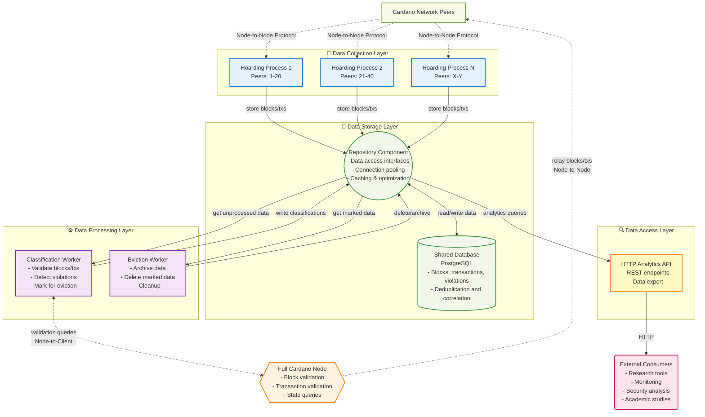

## Abstract

This CIP proposes an architecture for "hoarding nodes" - specialized network participants that collect and preserve data about blocks, transactions, and network events that are typically discarded by normal Cardano nodes. Hoarding nodes aim to capture evidence of protocol violations, network anomalies, and consensus conflicts for research, security analysis, and network health monitoring purposes.

## Motivation: why is this CIP necessary?

### The Problem

Normal Cardano nodes are designed to efficiently maintain consensus by discarding "problematic" data that doesn't contribute to the canonical chain. This includes:

- **Orphaned blocks**: Valid blocks that lost fork races
- **Equivocating blocks**: Multiple blocks produced by the same slot leader for the same slot
- **Invalid blocks**: Blocks that fail validation (invalid signatures, incorrect slot leadership, etc.)
- **Late/out-of-order blocks**: Blocks that arrive too late or in wrong sequence
- **Rejected transactions**: Transactions that fail mempool validation
- **Rollback data**: Information about chain reorganizations

While this design ensures network efficiency, it creates a significant gap for researchers, security analysts, and network operators who need visibility into:

1. **Security threats**: Evidence of attempted attacks or protocol violations
2. **Network health**: Understanding why forks occur and how they're resolved
3. **Consensus behavior**: Real-time dynamics of the consensus process
4. **Peer behavior**: Identifying misbehaving or misconfigured nodes

### Current Limitations

Existing tools like block explorers and node monitoring only show the "final" canonical state. Network researchers currently have no standardized way to:

- Collect evidence of equivocation or other protocol violations
- Study fork resolution dynamics in real-time
- Analyze why certain blocks or transactions are rejected
- Track the propagation and timing of network events

### Related Work

**Xatu (Ethereum)**: The Ethereum ecosystem has a project called [Xatu](https://github.com/ethpandaops/xatu) which provides extensive datasets including every diffused block for various analytical tasks. It is widely used in the Ethereum community for assessing new features both before and after deployment, using custom tooling for data collection (essentially Ethereum's "hoarding node").

**Pooltool.io (Cardano)**: A Cardano stake pool monitoring and analytics platform that collects performance metrics through voluntary opt-in integration from stake pool operators via API keys. Pool operators can send data such as block height and slot election information. While complementary to hoarding nodes (pooltool relies on voluntary reporting while hoarding nodes observe network behavior directly), pooltool and similar monitoring services represent potential consumers of hoarding node data for enhanced analytics.

**cardano-slurp (Cardano)**: A simple prototype implementation focused on collecting headers and blocks (but not transactions). Demonstrates early exploration of this concept within the Cardano ecosystem.

The hoarding node proposal builds on these precedents while providing standardized, protocol-level visibility into Cardano network behavior that can serve researchers, security analysts, and monitoring tools.

## Specification

### Architecture Overview

The hoarding node system consists of five main components:

1. **Hoarding Processes** - Lightweight processes that connect to Cardano peers and collect network data
2. **Repository Component** - Data access abstraction layer providing interfaces for all database operations
3. **Full Cardano Node** - Standard node providing validation services and canonical chain state
4. **HTTP Analytics API** - REST endpoints for researchers and monitoring tools to access collected data
5. **Background Workers** - Automated data processing for classification, archival, and cleanup

#### Deployment Architecture

**Single-Process Design**: The hoarding system runs as a unified single-process application containing multiple logical components (hoarding processes, background workers, HTTP API, and repository component). This approach simplifies deployment, debugging, and resource management while maintaining clear architectural boundaries between components.

**External Dependencies**: Only two components run as separate services:
- **PostgreSQL Database**: Persistent storage for all collected data
- **Full Cardano Node**: Separate cardano-node instance providing validation services and network relaying

**Event-Based Communication**: Components communicate primarily via events, providing loose coupling between components. This event-based architecture not only simplifies the initial single-process implementation but also facilitates optional future separation of components into independent services if operational requirements demand it (e.g., horizontal scaling, independent deployment cycles).



### Component Specifications

#### 1. Hoarding Processes

##### Purpose

Lightweight processes that establish Node-to-Node protocol connections with Cardano peers.

##### Configuration

**Parameters:**

```yaml
max_connections_per_process: 20  # Maximum peer connections per process
max_blocks_per_slot_pool: 10     # Storage limit per (`slot`, `pool_id`) pair
```

**Process Scaling:**

- Number of processes required: `N = ⌈total_known_peers / max_connections_per_process⌉`
- Each process maintains long-lived connections to its assigned peers

##### Behavior

###### Data Collection

Store all received Chain-Sync, Block-Fetch, and Tx-Submission messages via Repository operations.

###### Operating Mode

Hoarding processes are passive observers: they do not forward blocks or transactions. The separate full Cardano node handles all network relaying duties.

###### Peer Discovery Strategy

- Bootstrap from known relay nodes
- Use Peer Sharing Protocol to discover new peers during operation
- Store discovered peers persistently in PEERS table
- Periodically spawn new hoarding processes to connect to newly-discovered peers
- Iterative expansion maximizes network coverage and visibility into protocol violations

###### Connection Management

- Maintain long-lived connections to assigned peers
- No peer redistribution when connections drop (avoids reorganization overhead)
- Add newly discovered peers to database for future connection
- Handle connection failures gracefully

##### Protocol-Specific Data Collection

###### Chain-Sync Protocol

- **Block Headers**: Collect all announced block headers regardless of validation status
- **Chain Updates**: Record `RollForward` and `RollBackward` messages with timestamps
- **Intersection Points**: Track where different peers' chain views diverge
- **Tip Updates**: Monitor how chain tip announcements propagate across peers
- **Rollback Events**: Capture chain reorganizations with depth and timing information

###### Block-Fetch Protocol

- **Block Requests**: Log which blocks are requested from which peers
- **Block Responses**: Store complete block bodies including failed/timed-out requests
- **Fetch Failures**: Record blocks that couldn't be retrieved (network errors, peer disconnections)
- **Streaming Behavior**: Track batched block fetch patterns and peer responsiveness
- **Block Validation**: Correlate fetched blocks with subsequent validation results

###### Tx-Submission Protocol

**Current Protocol Constraint**: The Cardano Node-to-Node protocol does not currently support peers pushing transaction bodies to connected nodes. This means hoarding processes cannot directly observe rejected transactions or full mempool activity from their peer connections.

**Available Data Collection**:

- **Transaction Announcements**: Capture transaction IDs announced by peers (limited visibility)
- **Included Transactions**: Observe full transaction content only after inclusion in blocks
- **Propagation Patterns**: Track how transaction IDs spread through the network (ID-level only)

**Potential Future Mitigations**:

- **Mempool Tracing Enhancement** (near-term): Enriching cardano-node's mempool tracing to include full rejected transaction bodies would allow the hoarding system's integrated full node to observe and record rejected transactions via its local mempool events. This approach is being coordinated with the cardano-node development team and represents the most practical near-term solution.
- **Leios Protocol** (long-term): The Leios protocol ([CIP-1078](https://github.com/cardano-foundation/CIPs/pull/1078)) may enable transaction forwarding between peers, allowing hoarding processes to observe rejected transactions directly. However, Leios deployment is potentially years away, making mempool tracing enhancement the preferred approach for enabling transaction visibility in the near term.

###### Peer Sharing Protocol (if implemented)

- **Peer Advertisements**: Collect peer address announcements
- **Network Topology**: Build connectivity graphs from peer sharing data
- **Relay Preferences**: Track which peers are recommended as relays
- **Geographic Distribution**: Analyze peer distribution patterns

##### Storage Bounds

Hoarding processes enforce storage limits to prevent unbounded growth from adversarial behavior:

**Equivocation Protection:**

- Limit: Maximum of `max_blocks_per_slot_pool` blocks stored per `(slot_number, pool_id)` pair
- When limit reached: Discard additional blocks for that slot/pool combination and log the attempt for metrics

**Storage Guarantees:**

Mathematical bounds exist on slot leader elections per time window (e.g., Cardano mainnet has <10,000 elections per 36h except with negligible probability). Combined with `max_blocks_per_slot_pool`, this provides concrete upper bounds on storage requirements.

##### Open Considerations

###### Data Collection Optimization

- Should hoarding processes perform immediate hash-based deduplication before calling Repository operations to reduce storage load?
- How should batching be implemented to balance memory usage vs. Repository operation efficiency?
- What memory bounds and backpressure mechanisms are needed for queued data awaiting storage?

###### Security and Resource Protection

- What rate limiting mechanisms should be applied per-peer and globally to prevent resource exhaustion?
- How should the system detect and handle peers sending malformed or excessive data?
- What resource bounds (memory, CPU, disk I/O) should be enforced per hoarding process?
- Should there be reputation scoring to automatically disconnect problematic peers?

###### Network Compatibility

- What protocol compliance checks are needed to maintain compatibility with regular nodes?
- How should connection patterns be randomized to distribute load evenly across peers and avoid concentrating connections on particular nodes?
- Should there be graceful degradation when peers start rejecting connections?

###### Peer Opt-out Mechanism

- How can stake pool operators opt-out of being monitored by hoarding nodes if they choose to?
- Should this be configuration-based (denylist file), or does it need a more dynamic mechanism (API, database)?
- Configuration files require service restarts and lack flexibility - is there a better approach?
- Is there a way for peers to signal opt-out preference in-protocol, or must it remain out-of-band?
- What are the ethical and community governance considerations around respecting opt-out requests?
- Should there be a standardized opt-out registry or does each hoarding node operator handle this independently?
- **Note**: Any opt-out mechanism could be abused by adversarial participants to avoid monitoring and hide protocol violations. This creates a fundamental tension between respecting operator preferences and ensuring comprehensive security monitoring.

#### 2. Repository Component

**Purpose**: Data access abstraction layer that provides clean, consistent interfaces for all database operations while encapsulating complexity.

**Architecture**: Haskell library module providing type-safe database access abstractions. All components (hoarding processes, background workers, HTTP API) import and use this module directly for database operations.

**Storage**: Uses PostgreSQL for persistent storage of blocks, transactions, peer information, and source tracking with hash-based deduplication.

**Key Benefits**:

- **Schema Abstraction**: Components don't need to know database schema details
- **Connection Management**: Centralized connection pooling and transaction handling
- **Performance Optimization**: Intelligent caching, query optimization, and batch operations
- **Consistency**: Uniform error handling and data validation across all operations
- **Maintainability**: Single point for data access logic changes

**Functional Categories**:

- **Data Ingestion**: Store blocks, transactions, and peer information with automatic deduplication
- **Violation Detection**: Query for equivocations, orphaned blocks, invalid blocks, and timing anomalies
- **Data Classification**: Retrieve unprocessed data, classify blocks/transactions, mark data for eviction
- **Analytics**: Access block sources, peer behavior statistics, network metrics, and data exports

**Configuration**:

- **Connection Pool**: Configurable database connection limits and timeouts
- **Caching Strategy**: In-memory caching for frequently accessed data
- **Batch Processing**: Configurable batch sizes for bulk operations

#### 3. Full Cardano Node Integration

**Purpose**: Provide validation services to background workers and handle network relaying duties for the hoarding system.

**Deployment**: A single shared cardano-node instance serves the entire hoarding system. Hoarding processes themselves do not require running separate full nodes.

**Responsibilities**:

- **Network Relay**: Connects to Cardano network and relays valid blocks/transactions (maintains network citizenship)
- **Validation Service**: Provides Node-to-Client queries for background workers to classify collected data
- **Canonical Chain State**: Maintains full ledger state to identify which blocks are on the canonical chain

**Configuration**:

- Standard cardano-node with normal network connectivity
- Maintains full ledger state for validation queries
- Background workers connect via Node-to-Client protocol for classification tasks

**Node-to-Client Protocol Extensions**:

TBD - Specific query types and response formats for validation offloading will be defined based on cardano-node's Node-to-Client protocol capabilities.

#### 4. HTTP Analytics API

**Purpose**: Provide standardized access to collected hoarding data for researchers, security analysts, and monitoring tools.

**Architecture**: HTTP API that queries data through the Repository Component, providing JSON responses.

**Authentication**: Configurable authentication methods (API keys, OAuth2, or public read-only access for research deployments).

**Endpoints**:

##### GET /violations

Query and export protocol violations with flexible filtering.

**Query Parameters**:
- `type`: Violation type - `equivocation`, `orphaned`, `invalid`, or `late` (required)
- `time_range`: ISO 8601 time range (optional)
- `slot_range`: Slot number range (optional)
- `pool_id`: Filter by specific stake pool (optional)
- `limit`: Results per page (default: 50, max: 1000)
- `offset`: Pagination offset (default: 0)

**Response**: JSON array of violations with basic metadata (block hash, slot, pool, timestamp, classification)

##### GET /violations/{block_hash}

Retrieve detailed information about a specific violation for investigation.

**Response**: Complete violation details including block data, validation status, all peer sources with timestamps, timing information, and classification metadata.

##### GET /metrics

Prometheus metrics endpoint exposing operational statistics in standard exposition format.

**Key Metrics**:
- Collection: blocks/transactions collected, blocks per slot
- Peers: active connections, connection/disconnection counts
- Violations: detected violations by type, equivocations by pool
- Processing: operation durations, unprocessed data backlog, database operations
- Storage: database size by table, evictions, storage limit hits
- System Health: active processes, last classification timestamp, service availability

#### 5. Background Workers

**Purpose**: Automated data processing to manage storage and focus on valuable violations while discarding routine data.

**Data Processing Worker**: Periodically queries unprocessed data via Repository operations and decides whether to:

- **Keep/Enrich**: Mark data as valuable and add analysis metadata (violation type, research category, peer reputation impact)
- **Discard/Archive**: Remove routine data or compress to summary statistics

**Data Classification**:

**Keep/Enrich**:

- Protocol violations (equivocating blocks, invalid leadership)
- Consensus conflicts (orphaned blocks, forks, rollbacks)  
- Network anomalies (late blocks, timing irregularities)
- Attack evidence (coordinated violations, peer misbehavior)

**Discard/Archive**:

- Canonical chain blocks (available elsewhere)
- Redundant transaction data (transactions in canonical blocks)

**Configuration**:

```yaml
background_workers:
  processing_schedule: "*/10 * * * *"        # Every 10 minutes
  batch_size: 1000                           # Rows processed per batch
  retention_canonical: "7d"                  # Keep canonical blocks briefly
  retention_violations: "permanent"          # Keep violations permanently
  expensive_validation_threshold_seconds: 5  # Flag blocks/txs taking longer than this to validate
```

**Violation Detection Algorithms**:

**Equivocation Detection**:

1. **Data Indexing**: Maintain an index of blocks by `(slot_number, pool_id)`
2. **Conflict Detection**: For each new block, check if another block exists for the same slot+pool combination
3. **Signature Verification**: Validate that both blocks are properly signed by the claimed pool
4. **Evidence Collection**: Store both conflicting blocks with metadata about detection time and source peers
5. **Pattern Analysis**: Track repeated equivocations from the same pool for reputation scoring

**Orphan Analysis**:

1. **Chain Tracking**: Maintain a representation of the canonical chain tip as reported by the full node
2. **Validation Status**: For each collected block, query the full node to determine if it's in the canonical chain
3. **Fork Detection**: Identify blocks that were valid but didn't become canonical due to chain reorganization
4. **Temporal Classification**: Distinguish between recent orphans (may still become canonical) and settled orphans
5. **Causal Analysis**: Correlate orphaned blocks with network events (timing, peer behavior, competing blocks)
6. **Transaction Recovery Tracking**: Track whether transactions from orphaned blocks eventually appear in canonical chain blocks (useful for understanding rollback impact on users)

**Timing Analysis**:

1. **Slot Time Calculation**: Convert slot numbers to expected timestamps using network parameters
2. **Arrival Time Recording**: Record precise arrival timestamps for all network messages
3. **Delay Computation**: Calculate the difference between expected slot time and actual arrival time
4. **Threshold Detection**: Flag blocks arriving significantly late (configurable threshold, e.g., >20 seconds)
5. **Network Health Correlation**: Correlate timing anomalies with peer behavior and network partition events

**Invalid Block Analysis**:

1. **Validation Attempt**: Submit all received blocks to the full node for validation
2. **Error Classification**: Categorize validation failures (invalid signature, wrong leader, malformed data, etc.)
3. **Attack Pattern Detection**: Identify systematic invalid block patterns that may indicate coordinated attacks
4. **Peer Attribution**: Track which peers send invalid blocks to build reputation profiles
5. **False Positive Filtering**: Distinguish between genuine attacks and benign misconfigurations

**Expensive-to-Validate Detection**:

Background workers measure validation duration to identify blocks and transactions that are computationally expensive to process. This helps detect potential DoS vectors, analyze SPO behavior, and monitor network health.

**Measurement Approach**:

1. **Timing Capture**: Record start and end timestamps when background workers submit blocks/transactions to the full node for validation
2. **Duration Calculation**: Compute validation duration as the round-trip time of the validation query
3. **Threshold Detection**: Flag blocks/transactions exceeding the configured `expensive_validation_threshold_seconds`
4. **Metadata Storage**: Store validation timing data alongside block/transaction records via Repository operations

**Limitations**:

- **Best-effort metric**: Validation timing includes network latency and full node processing queue delays, not just pure validation cost
- **Caching effects**: Full node may cache validation results; repeated validation of the same block returns cached results instantly
- **Cold vs warm validation**: First-time validation may be slower due to UTxO cache warming and ledger state access patterns
- **Concurrent load**: Full node load from other operations affects measured validation times

**Validation Cost Factors**:

Blocks and transactions vary significantly in validation cost due to factors such as Plutus script complexity, transaction count, and UTxO operations. For detailed analysis of validation cost factors and measurement approaches, see the [Block Cost Investigation proposal](https://docs.google.com/document/d/1mDA0NuD7rQYtNMmwY2zNz9wci7RCy2bMPFZrbolA-jA/edit?tab=t.0#heading=h.rkdqb0ttlsiu).

### Network Health Safeguards

To ensure the hoarding system doesn't negatively impact network health:

1. **Separation of Concerns**:
   - Hoarding processes act as passive observers (do not forward messages)
   - Full Cardano node handles all network relaying duties
   - This maintains normal network citizenship without compromising data collection
2. **Rate Limiting**: Implement connection and request rate limits to avoid overwhelming peers
3. **Graceful Degradation**: Reduce activity if peers start rejecting connections
4. **Transparent Observation**: Hoarding processes behave like normal peers (request blocks, stay synchronized) but don't relay data

## Rationale: how does this CIP achieve its goals?

### Design Decisions

**Multiple Processes vs Single Process**:

- **Choice**: N separate processes
- **Rationale**: Distributes connection load, provides fault isolation, enables parallel processing
- **Alternative**: Single process with async I/O (rejected due to complexity and single point of failure)

**Shared Database vs Distributed Storage**:

- **Choice**: Centralized PostgreSQL
- **Rationale**: Enables complex correlation queries, ACID transactions, mature tooling
- **Alternative**: Distributed database by extending protocols (rejected due to added complexity for initial implementation)

**Full Node Integration vs External Validation**:

- **Choice**: Dedicated cardano-node for validation
- **Rationale**: Leverages existing validation logic, ensures consistency with network consensus
- **Alternative**: Reimplementing validation (rejected due to maintenance burden and accuracy concerns)

**Store-All-Then-Filter vs Selective Storage**:

- **Choice**: Store all received blocks/transactions, then classify and evict via background workers
- **Rationale**:
  - Simpler collection logic - hoarding processes don't need validation queries or canonical chain state
  - No dependency on full node availability during collection (higher reliability)
  - Enables post-hoc analysis of data that might be classified differently as criteria evolve
  - Separates concerns: collection is fast and stateless, classification can be slower and stateful
- **Storage Trade-off**: Increased storage costs are temporary - only until background workers classify and evict canonical/routine data. The additional storage is proportional to the processing lag (e.g., if classification runs every 10 minutes, roughly 10 minutes of canonical blocks are stored temporarily).
- **Alternative**: Only store non-canonical data (as proposed in original proposal) - rejected due to increased complexity and tight coupling.
- 

**Outbound-Only vs Bidirectional Connections**:

- **Choice**: Hoarding processes only make outbound connections (do not accept inbound)
- **Rationale**:
  - Node-to-Node protocol connections are bidirectional regardless of who initiated the TCP connection - peers can push both blocks and transactions over connections we initiate
  - Broad peer discovery via peer sharing provides sufficient network coverage, including connections to potentially malicious/buggy nodes that send invalid data
  - Simpler deployment: no port forwarding, public IP requirements, or inbound connection handling
  - Lower attack surface: cannot be targeted with inbound connection spam
- **Alternative**: Accept inbound connections (as mentioned in original proposal) - deemed unnecessary since outbound connections are sufficient for comprehensive monitoring.

**No Validation in Hoarding Processes**:

- **Choice**: Hoarding processes perform no validation; all classification and validation is offloaded to background workers querying the full node
- **Rationale**:
  - Keeps hoarding processes lightweight, stateless, and focused on reliable data collection
  - Validation requires access to full ledger state, stake distribution, and protocol parameters—complexity better suited to background workers
  - Hoarding processes don't make forwarding decisions (full node handles relaying), so real-time validation provides no benefit
  - Batch validation by background workers is sufficient; real-time violation detection is not required
  - Separation of concerns: fast collection vs. slower, stateful classification
- **Alternative**: Progressive validation where hoarding processes eventually perform header or full block validation (as suggested in original proposal)—rejected as it adds complexity without meaningful benefit given the passive observer architecture.

**Coordinated Peer Selection**:

- **Choice**: Hoarding processes and full node coordinate to connect to disjoint peer sets
- **Rationale**:
  - Avoids double connection slot usage: without coordination, both hoarding processes and full node might connect to the same peer, consuming 2 connection slots instead of 1
  - Achieves 1:1 connection slot usage equivalent to a normal relay node
  - Maintains clean separation of concerns (hoarding processes remain independent)
  - No protocol modifications required
  - Relatively simple to implement via coordination mechanism (shared state or API)
- **Trade-off**: Reduced coverage—hoarding processes can only monitor peers the full node doesn't connect to, potentially missing violations from peers the full node monitors
- **Alternative**: Integrated full node architecture (fork cardano-node to add logging directly)—rejected due to implementation complexity, maintenance burden, and tight coupling to cardano-node internals

### Trade-offs

**Storage vs Network Load**:

- Storing all data increases storage requirements significantly
- But provides complete visibility into network behavior
- Mitigation: Configurable retention policies, data compression

**Collection Completeness vs Network Health**:

- Aggressive collection might be seen as adversarial
- But transparent relay behavior maintains network citizenship
- Mitigation: Rate limiting, graceful degradation, community coordination

### Scope Boundaries

This section clarifies architectural choices, features, and deliverables that are explicitly **not** part of this proposal to prevent scope creep and manage expectations.

#### Infrastructure & Architecture

- **Distributed database storage**: Implementation uses centralized PostgreSQL; distributed database architectures are not included
- **Reimplementation or forking of cardano-node**: Validation leverages existing full node via Node-to-Client protocol; no custom validation logic or node modifications
- **Integrated full node architecture**: Hoarding processes remain separate from the full node; forking cardano-node to add built-in logging is not pursued (except in the case of transactions via enhancements to the existing tracing code)
- **Inbound connection handling**: Hoarding processes only make outbound connections; accepting inbound connections is not required
- **Real-time validation in hoarding processes**: All validation is offloaded to background workers; hoarding processes do not perform validation
- **Custom protocol modifications or extensions**: Standard Cardano protocols are used without modifications

#### Data Collection Limitations

- **Guaranteed capture of all adversarial behavior**: Collection operates on best-effort basis due to fundamental network observability constraints (adversaries can selectively send different data to monitoring nodes)
- **Direct observation of rejected transaction bodies**: Current Node-to-Node protocol does not support transaction body forwarding; only transaction IDs are observable until inclusion in blocks (mempool tracing enhancement is planned separately)
- **Dedicated lightweight validation service**: High-fidelity validation timing measurements would require separate infrastructure; initial implementation measures timing through full node queries with known limitations

#### Features & Capabilities

- **Historical connection tracking database**: Operational peer selection uses in-memory state; persistent connection history logging is not included (listed as potential future extension)
- **Advanced peer reputation scoring**: Automated peer scoring and disconnection based on behavior patterns is not included
- **Standardized network-wide opt-out registry**: Each hoarding node operator handles opt-out requests independently; no centralized registry or coordination mechanism
- **End-user graphical interfaces**: Programmatic HTTP API and CLI tools only; GUI applications are not included

#### Rationale for Scope Boundaries

Items listed above were considered during design but explicitly rejected or deferred due to:

- **Implementation complexity**: Would significantly increase development time and maintenance burden
- **Protocol constraints**: Not possible with current Cardano protocol capabilities
- **Architectural clarity**: Better suited as separate systems or future enhancements
- **Resource constraints**: Beyond the resources and timeline of the initial implementation

These boundaries ensure the proposal remains focused on delivering core hoarding node functionality while maintaining clear expectations about what is and is not included.

## Path to Active

### Acceptance Criteria

1. **Reference Implementation**: Working implementation of all six components
2. **Performance Evaluation**: Performance evaluation conducted under agreed test scenarios, with results documented and shared
3. **Security Model**: Lean security model is implemented and documented (in-depth security audits are out of scope)
4. **Community Review**: Community review process completed and feedback documented
5. **Documentation**: Living documentation covering core setup and operation (comprehensive guides and training materials are out of scope)

### Implementation Plan

The following milestones outline the development path to meet the acceptance criteria:

| Milestone | Deliverable | Timescale |
|-----------|-------------|-----------|
| Hoarding Node Design | Design for the Hoarding Node, written up as a CIP | 2 Months |
| Block collector | Tool which collects to some nodes and stores all blocks received | 4 Months |
| Transaction collector | Tool which collects to some nodes and stores all transactions seen | 4 Months |
| Node connection logic | Logic for deciding which nodes to connect to in order to maximise the chances of seeing all entities in a network | 5 Months |
| Hoarding node UI | Programmatic UI for accessing the hoarding node | 6 Months |
| Proof against adversarial behaviour | Hoarding node hardening to cope with adversarial behaviour, as per the design | 6 Months |

## References

- **Xatu (Ethereum)**: Ethereum network monitoring and data collection infrastructure - https://github.com/ethpandaops/xatu
- **CIP-1078 (Leios)**: Proposed protocol for transaction forwarding - https://github.com/cardano-foundation/CIPs/pull/1078
- **Block Cost Investigation**: Analysis of validation cost factors and measurement approaches - https://docs.google.com/document/d/1mDA0NuD7rQYtNMmwY2zNz9wci7RCy2bMPFZrbolA-jA/edit?tab=t.0#heading=h.rkdqb0ttlsiu

## Copyright

This CIP is licensed under [CC-BY-4.0](https://creativecommons.org/licenses/by/4.0/legalcode).
