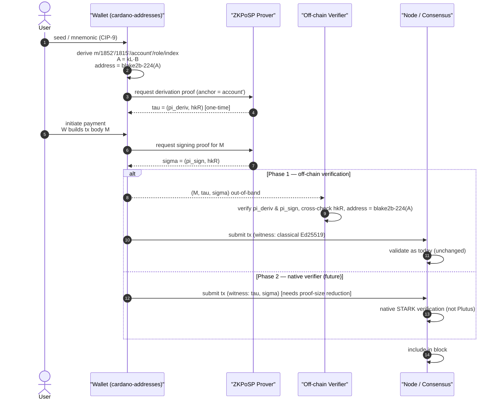

## Abstract

An optional, additive post-quantum signing layer for Cardano HD wallets using the
BIP32-Ed25519 derivation of [CIP-1852]. Keys, addresses, and derivation are
unchanged; the classical Ed25519 signature is replaced by (or, in the recommended
deployment, accompanied by) a zero-knowledge proof of knowledge of the seed witness
underlying the existing public key, per the ZKPoSP construction [ZKPoSP].
Post-quantum security reduces to the conjectured quantum hardness of SHA-256/SHA-512
and the soundness of the STARK proof system — no key re-registration, no address
migration, no change to the derivation path. Adoption is opt-in and phased; the
recommended deployment needs no network upgrade. Covers payment, staking, DRep, and
constitutional-committee roles uniformly.

## Motivation: Why is this CIP necessary?

- Cardano keys are Ed25519, whose security rests on the discrete-logarithm problem,
  broken in polynomial time by a quantum adversary via Shor's algorithm.
- A CIP-1852 wallet derives its whole key hierarchy from one root seed; recovering a
  single signing scalar lets an adversary forge transactions.
- Replacing the derivation scheme (lattice or hash-based keys) would invalidate every
  existing address and break hardware wallets, CIP-1854 multisig, and governance keys.
  A purely additive, signature-layer upgrade avoids that.
- [ZKPoSP] already specialises to BIP32-Ed25519 and to exactly the "three hardened +
  two non-hardened" path shape Cardano uses (`m/1852'/1815'/account'/role/index`),
  making Cardano the natural first deployment.

For the key material behind Cardano signatures there are exactly two coherent
strategies — and they are alternatives, not complements:

| | **Path A — prove over today's keys** (this CIP) | **Path B — native PQ keys** |
|---|---|---|
| **Signature primitive** | ZKPoSP zero-knowledge proof over the existing BIP32-Ed25519 key | Standard PQ scheme (ML-DSA, Falcon, SPHINCS+) |
| **Key derivation** | unchanged BIP32-Ed25519 | comes with its own PQ derivation (QBIP32-style) — BIP32 cannot produce PQ-scheme keys |
| **Migration needed** | none — addresses, keys, hardware wallets stay as they are | yes — new key formats mean new addresses; existing funds still need Path A as a bridge |
| **Signature size** | ~219 KB | ~1–8 KB |
| **Proving cost** | ~12.5 s per transaction | near-instant |
| **On-chain settlement** | not feasible today | plausible |

The key insight is that **PQ derivation is not a third, independent option — it is a
built-in consequence of Path B.** A native PQ signature scheme brings its own key
schedule, which BIP32-Ed25519 cannot produce. So the full solution is either Path A
alone — this CIP is already a complete post-quantum signing layer — or Path A and
Path B together, with Path B for new keys and Path A as the migration bridge for
existing funds.

**This CIP pursues Path A.** The whole design — unchanged derivation and addresses,
proofs anchored at the hardened `account'`, the two-phase deployment — exists to keep
today's BIP32-Ed25519 keys quantum-safe without migration. **Path B is deliberately out
of scope here and should be pursued in a separate CIP** (native PQ signature schemes for
newly generated keys, together with their PQ derivation scheme); this CIP references it
only to delineate the boundary and to frame Path A as the migration bridge that Path B
would lean on for existing funds.

These paths answer *which keys and schemes* to use; they are orthogonal to the CIP's
Phase 1/2, which answer *where proofs are verified* (off-chain vs on-chain) — either path
can run in either phase.

## Specification

### Background

**How a Cardano wallet makes keys today.** A wallet starts from a single seed (backed
up as a mnemonic [CIP-0009]) and derives a whole tree of keys from it, per the
BIP32-Ed25519 scheme [KL17]. Each key
is a pair of secret halves: a "left" half that does the actual Ed25519 signing and a
"right" half that acts as extra secret material. Steps down the tree use a keyed hash
(HMAC-SHA512). Steps marked with an apostrophe are *hardened* — they can only be
computed from the private key — while plain steps are *non-hardened*, meaning anyone
who knows the parent's public key can derive the children. The public key is the left
half multiplied onto the Edwards curve (`A = kL·B`), and the Cardano address is a
short hash of it (`blake2b-224(A)`, per [CIP-0019]). Cardano's path
`m/1852'/1815'/account'/role/index` consists of three hardened steps followed by two
non-hardened ones.

**What ZKPoSP adds, in plain terms.** Rather than trusting only the Ed25519
signature, the wallet also produces a zero-knowledge proof that it really knows the
seed behind the public key on the address. This proof comes in two parts:

- a **derivation proof**, generated once per account, certifying "this public key was
  derived from this seed along the standard path";
- a **signing proof**, generated per transaction, certifying "I hold the secret half
  of this key and I approve this transaction".

The two parts are bound together by a short hash of the secret witness
(`hkR = SHA256(kRn)`), so a derivation proof from one account cannot be mixed with a
signing proof from another. Verification of both parts is fast and constant time,
independent of how deep the key sits in the tree.

### Relations for the Cardano path

The question every proof must answer is simply: **does this public key really come
from a seed the signer knows?** There are two ways to phrase that statement.

**The pruned relation (recommended).** The proof is anchored at the `account'` node —
the last *hardened* step of the Cardano path — and certifies only the suffix from
`account'` down to the leaf (`role`, `index`), not the whole chain from the seed.
This is just as strong as proving the full chain, because `account'` is hardened:
reaching it requires the private key, so an attacker cannot get there from public
information. In exchange, the proof has a small, fixed size regardless of the path,
and once it is generated the root seed can be removed from the proving device and kept
only in secure long-term storage.

Why the anchor must be hardened: the `role` and `index` steps are non-hardened, so
they can be derived from public keys alone. A proof covering only non-hardened steps
could be faked by anyone who knows the public keys but not the seed (the [ZKPoSP] paper's
unsoundness result, Prop. 6.3/7.2). Every Cardano leaf is non-hardened, which is
precisely why this distinction matters on Cardano.

**The full-path relation.** A seed-to-leaf proof certifying every step from the seed
to the key. Only needed when an application must prove that two keys come from the
same seed (via a linkable commitment `c_seed`). It is roughly three times more
expensive to generate (~440 s vs ~156 s), so the default flow does not use it.

### Protocol

The wallet emits two artefacts.

**A derivation certificate `tau`, created once per account.** It bundles the
derivation proof `pi_deriv` with a hash binding `hkR` — a one-way commitment to the
secret half of the key. It answers: "the public key on this address genuinely comes
from the seed."

**A signature `sigma`, created once per transaction.** It bundles the signing proof
`pi_sign` with the *same* hash binding `hkR`. The signing proof also commits to the
transaction body via a hash `h = SHA256(kRn ∥ M)`. It answers: "I hold the secret
half of this key, and I approve this specific transaction."

**How a verifier checks it** (receiving wallet, exchange, indexer — or the ledger, in
Phase 2):

1. Run the derivation verifier on `pi_deriv`: is the public key really derived along
   the standard path? (Done once per account; the result can be cached.)
2. Run the signing verifier on `pi_sign`: does the signer hold the secret witness and
   approve `M`?
3. Compare the `hkR` values: they must match. This is the glue between the two proofs
   — it shows that the same person who signed the transaction is the person who
   derived the account's public key, and that a signature cannot be lifted from one
   account or replayed against another.

### Instantiation

**The proving system.** Proofs are ZK-STARKs — the proof family that stays secure
against quantum adversaries — produced by the RISC Zero virtual machine [RISC-ZERO] in
the reference implementation. Using a zkVM means the proof relations are written in
ordinary Rust, reusing well-tested libraries (`curve25519-dalek`, `hmac`, `sha2`)
instead of hand-built arithmetic circuits, which keeps engineering and audit cost
low.

**The hashes.** Binding hashes use SHA-256; the key-derivation MAC remains
HMAC-SHA512, unchanged from BIP32-Ed25519 — so the derivation itself is not touched.

**What it costs.** Reference figures from the paper [ZKPoSP], §9, measured on the paper's
dedicated OVH EU-central cloud server: AMD Ryzen 9 9950X3D, 16 cores / 32 threads at
4.5 GHz, 64 GB RAM, no GPU, running Ubuntu, with the proving code in Rust over RISC Zero
v5.0.0-rc.1. These are the authors' reference numbers, not our own measurements; we will
re-validate them on our reference implementation before they are relied upon:

| Operation | When | Cost |
|---|---|---|
| Signing proof | every transaction | ~12.5 s to prove |
| Derivation proof | once per account | ~156 s to prove |
| Verification | every check | ~9–10 ms, constant |
| Proof size | each proof | ~219 KB |

Two numbers shape the design. The ~219 KB proof is far too large to post on-chain
today, which is why the recommended deployment (Phase 1) verifies proofs
off-chain — see [On-chain constraints](#on-chain-constraints). And verification is
fast and constant, so wallets, exchanges, and indexers can afford to check every
   transaction. The one-time derivation proof can be generated lazily or delegated to a
   proving server, so it does not slow down or complicate everyday signing.

### Proving backend options

The proving system can be instantiated in several ways, each serving a different
part of the specification — the Phase 1 off-chain path, the Phase 2 on-chain path, or
a post-quantum guarantee. The [ZKPoSP] relations are backend-agnostic (any change to
the backend re-opens the security argument), so the options below are the candidate
instantiations under consideration; the reference implementation uses the RISC Zero
zkVM. The comparison and selection of these options is discussed in
[Backend selection](#backend-selection).

1. **RISC Zero zkVM — the [ZKPoSP] paper's backend; the default baseline.** Proof relations are
   written in ordinary Rust, reusing audited primitives (`curve25519-dalek`, `hmac`,
   `sha2`). Lowest engineering risk (no hand-built constraints), but the zkVM's own
   arithmetization, prover, and commitment scheme still require audit. Reference figures
   (paper §9, AMD Ryzen 9 9950X3D): signing proof ~12.5 s, derivation proof ~156 s,
   verification ~9–10 ms, proof ~219 KB. **The proof size is the blocking issue for
   Phase 2.**
2. **Halo2/midnight-zk with a FRI polynomial commitment scheme.** A heavily optimized
   circuit for this relation already exists (≈114k rows @ k=17). The default KZG PCS is
   pairing-based and therefore *not* quantum-safe; swapping it for FRI is real work — it
   changes the commitment scheme, the FRI domain/blow-up, proof size, and soundness
   parameters — and the security argument must be re-opened and re-audited. This is not
   hypothetical: the Tachyon zkVM [TACHYON] already implements Halo2 with a FRI PCS, and
   Zcash's own quantum-readiness roadmap plans hash-based or STARK-style hardening of its
   Halo2 proofs [ZCASH-QR], a staged posture that mirrors this CIP's Phase 1 → 2.
3. **Plonky3-style native FRI-STARK circuits.** The [ZKPoSP] paper's own forward plan for
   proof-size reduction; removes the zkVM's fixed per-segment overhead, but requires an
   audited circuit implementation that is at an earlier stage of maturity. The Tachyon
   backend also tracks Plonky3 [TACHYON].
4. **Nova / groth16-prover [NOVA] — efficiency comparison only.** Efficient and readily
   available, but not quantum-proof and requires a trusted setup; useful as a performance
   bound and for a possible hybrid, not as the primary mechanism.
5. **Lova [LOVA] — lattice-based IVC.** A recursive-SNARK descendant of Nova that
   replaces its pairing-based assumptions with a lattice-based construction, making it
   quantum-proof. Its incrementally verifiable computation gives linear prover time and
   constant verification, which fits the Phase 1 off-chain story; the caveat is early
   maturity — a first-of-its-kind Nova implementation, unproven at Cardano scale — so it
   is a candidate for Phase 1 evaluation alongside the STARK route, not the default
   baseline.
6. **NovaSlim [NOVASLIM] — practical Phase 2 stepping stone.** A Nova-family IVC
   system that produces **sub-kilobyte transparent proofs** (~0.4–2.5 KiB, independent
   of commitment scheme) with **sub-millisecond verification** (~0.2 ms) and **no
   trusted setup**. It is implemented in Rust with support for six curves (including
   BLS12-381, Cardano's native curve) and three commitment schemes (Pedersen, SIS,
   Hash) — of which **SIS** and **Hash** are post-quantum (conjectured). Critically, it already has a **working Aiken eUTXO verifier** running in
   Plutus V3 on BLS12-381 scalar arithmetic. Its protocol design, security proofs, and
   benchmark analysis are specified in the NovaSlim whitepaper [NOVASLIM-WP].
   Reference figures (VRF circuit, BLS12-381, Pedersen, 254 steps): fold ~3.5 s,
   compress ~0.04 s, verify slim ~0.2 ms, proof ~0.4 KiB. With SIS commitment
   (m=128): fold is faster than Pedersen (matrix–vector products replace MSMs)
   and the slim proof size stays ~0.4 KiB.

### Deployment: two phases

The two phases are **not alternatives that preclude each other** — they are
complementary and meant to be adopted in sequence. Both use the exact same proofs
generated by the wallet; they differ only in **where those proofs are verified** and
in what goes on-chain.

- **Phase 1 — off-chain components, adoptable almost immediately (recommended).**
  The classical Ed25519 signature remains the on-chain witness; proofs travel
  out-of-band and are verified by wallets, exchanges, and indexers. No ledger or node
  change, fully backward compatible — quantum *readiness* now. Enforcement of
  quantum-safe *settlement* requires Phase 2 or the post-Q-day rule. Lova [LOVA],
  the lattice-based, quantum-proof descendant of Nova, can also be evaluated as an
  alternative prover-verifier pair within this off-chain Phase 1.
- **Phase 2 — native STARK verifier in the node (future, conditional).** The proofs
  replace the classical witness on-chain and the ledger verifies them via a native
  (non-Plutus) STARK-verifier primitive. Requires a consensus/ledger change, a
  proof-size reduction from ≈219 KB to within `maxTxSize`/`maxBlockBodySize`, and
  parameter/governance action. Not feasible with current proof sizes.

**Why the sequence 1 → 2.** Phase 1 builds everything Phase 2 needs: wallet
integration, the witness format and transport, conformance vectors, and a population
of verifiers already checking proofs. Nothing built for phase 1 is discarded when
phase 2 lands — moving to phase 2 only means the same proofs start being verified by
the ledger too. The two also coexist during the transition: wallets keep emitting
proofs under phase 1 while the consensus change for phase 2 is agreed, deployed, and
only then enforced.

The **post-Q-day rule** can be layered on either phase: consensus rejects classical
signatures entirely, and the leaf signing scalar may then be published, dropping
in-circuit scalar multiplications (derivation proof ≈ 40 s). Valid only after Q-day
activation (network-level assumption); MUST NOT be used before.

### On-chain constraints

The ≈219 KB receipt cannot be posted on-chain today, which is why Phase 1 is the
primary deployment (Conway-era limits; updatable via governance):

| Constraint | Value | Consequence for the ZKPoSP receipt |
|---|---|---|
| `maxTxSize` | 16,384 B | A ≈219 KB receipt is ~13× the entire transaction budget |
| `maxBlockBodySize` | 90,112 B | The receipt exceeds an entire block body |
| Plutus `maxTxExecutionUnits` | 14M memory / 10G steps per tx | No STARK verifier exists in Plutus; verification is orders of magnitude beyond this budget |
| Native scripts (V1–V3) | threshold multisig only | Cannot express arbitrary NIZK verification |

**However, NovaSlim [NOVASLIM] already bypasses these constraints:** its slim proofs
are **~0.4–2.5 KiB** (well under `maxTxSize`) and its Aiken verifier runs in **Plutus
V3** on BLS12-381 scalar arithmetic. This makes NovaSlim the only backend with a
working Phase 2 path today; see [Proving backend options](#proving-backend-options).

Raising `maxTxSize` alone would not suffice for STARKs (the receipt also exceeds
`maxBlockBodySize`), and the post-Q-day variant does not reduce proof size — it only
shortens proving time.

### Proof-size fallback plan

If STARK proofs cannot fit on-chain, three fallback options are available, each one tried
only if the previous one is closed for some reason:

1. **One tx, small enough proof.** Pursue proof-size reduction (ZK-friendly hashing,
   smaller FRI configurations) until the receipt fits `maxTxSize`. The primary target
   for Phase 2 with the STARK backend.
2. **One proof across several txs.** If no single tx can hold the receipt, split it
   over multiple mutually-referencing transactions, so the fragment proofs together
   form the full receipt.
3. **NovaSlim for Phase 2 now.** If neither STARK option fits, use NovaSlim's
   sub-kilobyte proofs with the existing Aiken verifier. This is the only backend
   that already works end-to-end on Cardano today, although it remains experimental
   and unaudited.
4. **Out-of-band proofs + node-side cache.** If none of the above, proofs travel
   out-of-band; nodes keep a cache of proofs and only adopt blocks of signatures for
   which they have seen the corresponding zk proof. This needs additional handling of
   the VRF (block-leadership) gap.

### End-to-end flow

Notes: the derivation proof and signing proof are generated the same way in both
phases; only the verification location and the on-chain witness differ. The prover
needs private anchor material and may run on-device or be delegated to a proving
server.

## Rationale: How does this CIP achieve its goals?

- **Why an additive signature layer:** public keys are byte-identical to standard
  BIP32-Ed25519 output, so there is no migration, no re-registration, and no hardware
  wallet or multisig (CIP-1854) breakage. Reusing the existing derivation also keeps
  the two hardened rounds of the Cardano path out of the proof circuit; each hardened
  round costs two HMAC-SHA512 calls (four SHA-512 hashes), which are expensive inside a
  circuit. Anchoring the proof at `account'` (see next bullet) drops that cost entirely,
  decreasing proving time while maintaining the soundness of the goal.
- **Why anchor at `account'`:** proofs over non-hardened leaves are unsound (the tweaks
  are public); only a hardened anchor binds the witness to a legitimate seed — decisive
  for Cardano because every leaf is non-hardened.
- **Alternatives rejected:** monolithic Σ proof (linear proving cost); QBIP32 new
  derivation (incompatible with existing funds — only a future-purpose-field option);
  lattice/isogeny HD wallets (change key material and addresses, no zero-migration
  property); full-path relation (heavier, only where seed linkability is required).
- **Why a hash-based STARK:** post-quantum security is the point, which rules out
  pairing-based SNARKs, Bulletproofs, and classical folding (Nova) — all broken by
  Shor's algorithm. FRI-STARKs are the remaining family: transparent (no trusted
  setup), and a zkVM (RISC Zero) proves the SHA-512/HMAC/Ed25519 relations written in
  ordinary Rust instead of hand-built arithmetic circuits. Verification is constant
  (~9–10 ms). The relations are backend-agnostic, but any backend change must re-open
  the security argument.
- **Transition is non-intrusive and reversible:** nothing is forced on anyone;
  activation is local to a signer (one one-time proof per `account'`), no network
  upgrade for Phase 1, and adoption can be rolled back without impact. Because all
   credential types share the derivation, the transition covers payment, staking, DRep,
   CC, and CIP-1854 cosigners together.

### Backend selection

The proving backend options are specified in
[Proving backend options](#proving-backend-options). Here we motivate the choice and
distil the options down to the two that are actually deployable. The practical reality
is stark: **only STARKs are proven post-quantum today, and their proof size (~219 KB)
precludes on-chain settlement.** Every other candidate is either not quantum-safe
(Nova), requires substantial re-engineering to become quantum-safe (Halo2, Plonky3), or
is a research prototype lacking production maturity (Lova):

| | PQ? | On-chain viable? | Status |
|---|---|---|---|
| RISC Zero STARK | ✅ Proven | ❌ No (~219 KB) | Production-ready |
| Halo2 + FRI | 🔜 Requires re-audit | ❌ No (~50–100 KB) | Substantial work needed |
| Plonky3 | 🔜 Requires implementation | ❌ No (~10–50 KB) | Early maturity |
| Nova / groth16-prover | ❌ No (DLOG-based) | — | Classical only |
| Lova | ✅ Conjectured | 🔜 Future (~5–10 KB) | Research prototype |
| **NovaSlim** | ✅/🔜 Conjectured (SIS & Hash) | ✅ **Yes** (~0.4–2.5 KiB) | **Implemented (experimental, unaudited)** |

That narrows the field to **two usable ways forward**, which is why the comparison
serves only a small number of decisions:

- **Way 1 — STARK (RISC Zero), the established backend.** Proven post-quantum and
  production-ready, with a reference implementation matching the [ZKPoSP] paper. Its
  blockbuster problem is proof size: ~219 KB cannot settle on-chain (≈13× the entire
  `maxTxSize` budget), so it is confined to the Phase 1 off-chain path until a
  proof-size-reduction programme (ZK-friendly hashing, smaller FRI configurations)
  brings it within budget. It is the low-risk default for Phase 1.
- **Way 2 — NovaSlim, the experimental backend, demonstrated to work.** Initially
  designed as a classical Nova-family IVC, its **SIS** and **Hash** commitments are
  post-quantum (conjectured), giving a PQ path today, and it is the *only* option with
  sub-kilobyte proofs (~0.4–2.5 KiB), sub-millisecond verification, **and** a working
  on-chain Aiken verifier (Plutus V3). The author has demonstrated the end-to-end
  pipeline — step-circuit folding, slim-proof generation, and on-chain verification —
  at `cardano/cip197` [NOVASLIM-CIP197]. Its caveats are that it is experimental and
  unaudited, and that its post-quantum guarantee is as strong as the hash/SIS
  parameters, not as strong as Lova's lattice construction (the underlying sumcheck
  folding is classical, random-oracle / Fiat–Shamir based).

The CIP leans on **Way 2 (NovaSlim)** for the Phase 2 infrastructure path, because it
solves the exact problem that blocks every other option: proof size, verification cost,
and on-chain verifier availability — and it is already shown working. The recommended
posture is to deploy NovaSlim **now** for Phase 2 infrastructure (wallet integration,
witness format, on-chain verifier, transport) with a PQ commitment, and to upgrade the
proving backend to a lattice-hardened variant (Lova-style) when that cryptography
matures, keeping the same proof format and Aiken verifier. This mirrors the CIP's
Phase 1→2 philosophy: build the road before the car is finished.

### Open Questions

- Proof size (~219 KB STARK) vs `maxTxSize` (16,384 B): Phase 1 is feasible today;
  Phase 2 for STARKs is gated on reducing proofs to a few KB. **NovaSlim already
  achieves sub-kilobyte proofs (~0.4–2.5 KiB) and a working Aiken verifier,
  demonstrating that Phase 2 infrastructure is technically feasible today; the open
  question is the PQ hardening of
  its folding scheme.**
- Native STARK verifier feasibility in the ledger: Plutus budgets are orders of
  magnitude too small; only a native (non-Plutus) primitive is credible. NovaSlim's
  Plutus V3 verifier sidesteps this by using BLS12-381 scalar arithmetic directly.
- Recursion/folding for the derivation proof; simulation extractability under
  composition is unresolved (paper Rem. 10.1).
- Proof-format versioning and fork/parameter handling.
- Quantum-hardening of NovaSlim's NIFS folding scheme (lattice-based replacement of
  the classical sumcheck assumptions, à la Lova).

## Path to Active

### Acceptance Criteria

- Reference implementation of the ZKPoSP scheme for the Cardano path
  `m/1852'/1815'/account'/role/index` over an audited STARK backend (e.g. RISC Zero).
- Conformance test vectors for the Cardano path covering derivation, signing, and
  verification, including the anchor-at-`account'` constraint.
- Public, independent security audit of the proof system and its Cardano integration.
- Benchmark report for the reference implementation on the [ZKPoSP] paper's machine (AMD Ryzen 9
  9950X3D) and on a browser/WASM target, covering proving and verification time, proof
  size, and peak prover memory (including the FRI-commitment-phase peak).
- At least one wallet adopting Phase 1 (off-chain witness).
- A documented proposal for the post-Q-day rule as a protocol parameter.

### Implementation Plan

The plan below is **tentative** — it is a menu of options to pursue, not a settled
commitment. The backend is chosen by benchmarking the [Proving backend
options](#proving-backend-options) in the Specification (see [Backend
selection](#backend-selection) for the motivation); nothing here is final.

- Integration with an existing Cardano wallet library (cardano-addresses) to emit
  `tau` and `sigma` out-of-band (Phase 1).
- Browser/WASM benchmark of the wallet integration: verification, the per-transaction
  signing proof, and the one-time derivation proof (timing and peak memory), to confirm
  the Phase 1 off-chain verification story on the worst-case environment.
- Evaluation of proof-size reduction (ZK-friendly hashing, smaller FRI
  configurations) to unlock Phase 2 with the STARK backend.
- NovaSlim proof-of-concept: end-to-end pipeline validation (VRF stand-in
  circuit; the BIP32-Ed25519 circuit is still under construction) + slim
  proof generation + Aiken on-chain verification, to validate the Phase 2
  infrastructure path. A working end-to-end demonstration already exists at
  `cardano/cip197` [NOVASLIM-CIP197], including the `E2E.md` runbook.
- CDDL specification of the witness format for a future native STARK-verifier
  primitive.

## References

- [ZKPoSP] Botta, Pospieszalski, Ragnoli, Ranvier, "ZKPoSP: Post-Quantum
  Zero-Knowledge Proofs for Hierarchical Deterministic Wallets",
  ePrint 2026/1508. https://eprint.iacr.org/2026/1508
- [CIP-0009] Wallet Mnemonic Sequence. https://cips.cardano.org/cip/CIP-0009
- [CIP-0019] Cardano Addresses. https://cips.cardano.org/cip/CIP-0019
- [CIP-1852] HD (Hierarchy for Deterministic) Wallets for Cardano.
  https://cips.cardano.org/cip/CIP-1852
- [CIP-1854] Multi-signatures HD Wallets. https://cips.cardano.org/cip/CIP-1854
- [KL17] Khovratovich and Law, "BIP32-Ed25519: Hierarchical Deterministic Keys over a
  Non-linear Keyspace" (EuroS&PW 2017). https://input-output-hk.github.io/adrestia/static/Ed25519_BIP.pdf
- [RISC-ZERO] RISC Zero zkVM. https://dev.risczero.com/
- [HALO2] zcash/halo2, The Halo2 zero-knowledge proving system.
  https://github.com/zcash/halo2
- [TACHYON] Tachyon, modular zero-knowledge backend (Halo2 with a FRI polynomial
  commitment scheme, GPU-accelerated). https://github.com/kroma-network/tachyon
- [NOVA] cardano-foundation/bls, groth16-prover, nova-prover.
  https://github.com/cardano-foundation/bls/tree/main/groth16-prover
  https://github.com/cardano-foundation/bls/tree/main/nova-prover
- [NOVASLIM] NovaSlim — sub-kilobyte transparent proofs with commitment modularity.
  https://github.com/paweljakubas/nova-slim
- [NOVASLIM-WP] NovaSlim technical whitepaper: protocol design, security proofs, and
  benchmark analysis. https://github.com/paweljakubas/nova-slim/raw/master/whitepaper.pdf
- [NOVASLIM-CIP197] NovaSlim CIP-197 end-to-end demonstration: step-circuit folding,
  slim proof generation, and on-chain Aiken verification (`E2E.md` runbook).
  https://github.com/paweljakubas/nova-slim/tree/master/cardano/cip197
- [LOVA] Fenzi, Knabenhans, Nguyen, Pham, "Lova: Lattice-Based Folding Scheme from
  Unstructured Lattices" (ASIACRYPT 2024), lattice-based and quantum-secure.
  https://eprint.iacr.org/2024/1964
- [ZCASH-QR] CoinDesk Research, "Building the Zcash Machine: Tachyon and Quantum
  Readiness", June 2026. https://www.coindesk.com/research/building-the-zcash-machine-tachyon-and-quantum-readiness

## Copyright

This CIP is licensed under [CC-BY-4.0](https://creativecommons.org/licenses/by/4.0/legalcode).

[ZKPoSP]: https://eprint.iacr.org/2026/1508
[CIP-0009]: https://cips.cardano.org/cip/CIP-0009
[CIP-0019]: https://cips.cardano.org/cip/CIP-0019
[CIP-1852]: https://cips.cardano.org/cip/CIP-1852
[CIP-1854]: https://cips.cardano.org/cip/CIP-1854
[KL17]: https://input-output-hk.github.io/adrestia/static/Ed25519_BIP.pdf
[RISC-ZERO]: https://dev.risczero.com/
[HALO2]: https://github.com/zcash/halo2
[TACHYON]: https://github.com/kroma-network/tachyon
[NOVA]: https://github.com/cardano-foundation/bls/tree/main/groth16-prover
[NOVASLIM]: https://github.com/paweljakubas/nova-slim
[NOVASLIM-WP]: https://github.com/paweljakubas/nova-slim/raw/master/whitepaper.pdf
[NOVASLIM-CIP197]: https://github.com/paweljakubas/nova-slim/tree/master/cardano/cip197
[LOVA]: https://eprint.iacr.org/2024/1964
[ZCASH-QR]: https://www.coindesk.com/research/building-the-zcash-machine-tachyon-and-quantum-readiness
