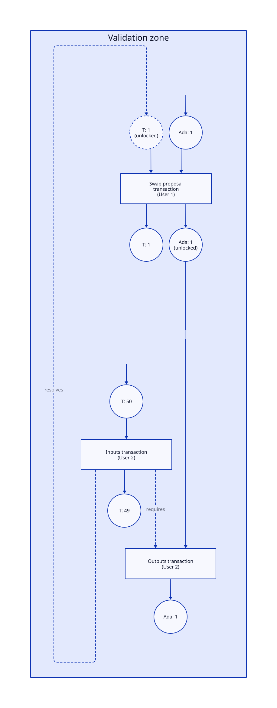
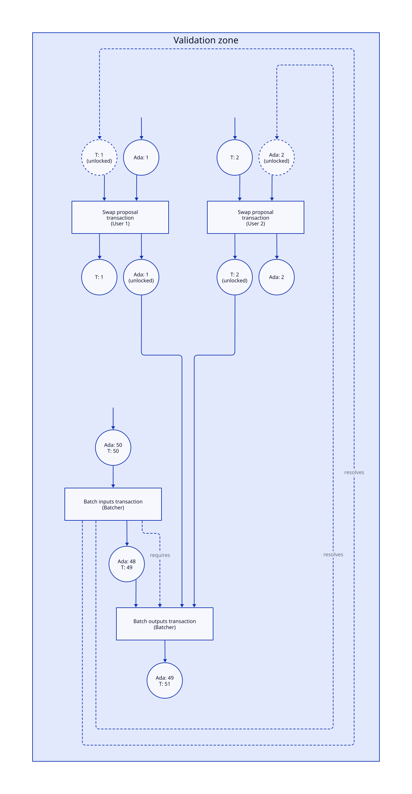

## Abstract

We propose a set of changes that revolve around validation zones, a construct for allowing greater interdependency between transactions. 
We use this to enable “unresolved transaction inputs”, and also atomic groups of transactions. 
We show how these features can be used to address a number of use cases from CPS-????.

## Motivation: why is this CIP necessary?

This CIP provides a partial solution to the problems described in CPS-????. 
In particular, it describes some ledger changes that allow intent settlement for a wide range of intents that require “counterparty irrelevance”, including most of the swap use cases and dApp fee sponsorship.

## Specification

### Validation zones

A validation zone is a container for transactions. 
The main property of a validation zone is that the node may need to look at all the transactions in the zone in order to decide if any of them are valid. 
Within validation zones we can therefore allow features that require “earlier” transactions to depend on “later” transactions for their validity.

At the ledger level, a validation zone:

- Is a new top-level element (an alternative to a transaction)
- Contains a sequence of transactions (not zones, there is no point nesting them)
- Carries no further data beyond this
- Triggers a special mode of validation for the transactions within (see “validating a zone” below)

### Unresolved inputs and resolving outputs

We add a new kind of transaction input, an “unresolved input” (UTXI). 
An unresolved input differs from a normal transaction input:

- It does not specify a transaction output that it spends
- It does specify the value that the input provides
- It has a credential and an optional datum

Unresolved inputs must be addressable. 
Current transaction inputs are not addressable by the combination of transaction ID and an index, since they are kept in a set. 
We therefore need to implement https://github.com/cardano-foundation/CIPs/pull/758, or to keep the unresolved inputs in a separate list.

We add a new kind of transaction output, a “resolving output”. 
A resolving output differs from a normal transaction output:
- It specifies that it “resolves” a particular unresolved transaction input, by specifying the transaction ID and index of the input
- It does not specify the value that it provides
- It does not have a credential

Unresolved inputs and resolving outputs are illegal outside a validation zone. 
They are included in the script context accurately, with one subtlety: in the same way that normal transaction inputs are decorated with the value that they provide, resolving transaction outputs are similarly decorated with the value that they provide.

### Required transactions

We add a new field to the transaction body, `requiredTxs`, which is a list of transaction IDs.

The `requiredTxs` field is special in that it is _not_ included when hashing the transaction body to create the transaction ID. 
It is however signed when the transaction body is signed.

The required transactions field is illegal outside a validation zone. 
It is included in the script context.

### Validating a zone

Validating a zone proceeds as follows:

#### 1: Check all zone-level properties
The following zone-level properties are checked:

1. (UTXIs are resolved) The unresolved inputs and resolving outputs in the zone match up exactly.
2. (Linearizability) The transactions are linearizable, that is: there is a reordering of the transactions in the zone such that every resolving output comes before every unresolved input which it resolves.
3. (Required transactions) For every transaction, all the transactions listed in `requiredTxs` are present in the zone.

If any of these fail, the entire zone is discarded.

#### 2: Validate transactions

All transactions are validated for phase 1 checks; then they are all validated for phase 2.

Resolving outputs are validated similarly to normal transaction inputs: we must check that the credential on the unresolved input accepts the resolving transaction, just as when spending a normal transaction output. 

The other tricky case is where a transaction is phase-2 invalid. 
To help us with this, we add two additional (phase-1) validity conditions inside the zone:

1. (Safe collateral) All collateral inputs come from outputs outside the zone.
2. (Excess collateral) The collateral required for a transaction containing scripts is increased: the base amount is now based on the fee for the transaction and _every transaction it depends on_ within the zone.
    - “A depends on B” here means that A is required in order to determine B’s validity. Note that this means that for unresolved-input-resolving-output pairs the dependency is the opposite way around to the relationship for a normal input-output pair.

If a transaction is phase-2 invalid, then the following occurs:

- The node constructs an invalidity witness for the transaction. This consists of the invalid transaction, along with every transaction that it depends on from within the zone. 
- The node posts the invalidity witness to the chain and claims the collateral associated with the failing transaction.

## Rationale: how does this CIP achieve its goals?
 
### Design

#### Linearizability and value flow

The requirement that validity zones must be linearizable ensures that we do not allow any value flow in the ledger that was not possible before. 
Value always flows from inputs to outputs, and there are no loops. 
We can see this because linearizability shows that we could produce a “normal” series of transactions by reordering the zone and translating unresolved inputs and resolving outputs into normal inputs and outputs.

What we gain is the ability to specify and authorise this normal value flow in an out-of-order fashion. 
Alice (whose transaction comes later in the value flow) can create their transaction first and send it to Bob (whose transaction comes earlier) and he can put them together into something valid.

The linearizability requirement is the major driving difference between the design in this CIP and the one published in the "Babel Fees via Limited Liabilities" paper. 
Both designs make use of the idea of “negative” inputs of one kind or another, but the liabilities’ design enables and embraces the possibility of loops in the value flow. 
It is difficult to make this secure, which led to the painful restriction that minting policies be run in many cases where liabilities are used. 
In practice that meant that many swap use cases could not be used with old tokens whose minting policies would not approve the new behaviour.

Similarly, the liabilities design allowed easy access to arbitrary “flash loans” in Ada, which has often been a source of attacks on other blockchains.

In contrast, if the value flow can be linearized then we know that nothing fundamentally new is possible here and we do not need to worry.

#### Counterparty irrelevance

Specifying transactions out-of-order allows us to leave more parts of a transaction unspecified. 
We are used to not specifying where the outputs of transactions go, now we can not specify where the inputs of transactions come from.

Not knowing where an output or input goes to gives you “counterparty irrelevance”: you don’t have to specify who is on the other side of that part of the trade. 
Again, we are used to this with outputs. 
We don’t in general know who is going to spend an output, although we generally restrict that with the credential on the output. 
Unresolved inputs are just the same, but for inputs.

Allowing counterparty irrelevance for inputs enables use cases where we expect someone to pay us, but we don’t know who. 
An example of this is Gas Station Network-style fee sponsorship, where a dApp operator agrees to pay the script fees for its users. 
Users could then create a transaction with an unresolved input covering the fees, which would later be resolved by the dApp operator.

Having counterparty irrelevance for both inputs and outputs allows us to do trades where we both give and receive assets: e.g. a swap. 
However, this presents us with a problem: we cannot resolve both the input and the output in one transaction, because this would violate linearizability. 
The same transaction cannot appear both earlier and later in the value flow!

We can solve this problem with atomic (indivisible) transaction groups: then we can use two transactions, one earlier and one later, but bind them together so that they cannot be split apart.

#### Atomic transaction groups

The required transactions feature enables us to bind transactions together such that they must be included either all together or not at all. 
We do this by creating a dependency loop, but without creating a loop at the level of value flow. 
We can construct dependency loops either just using required transactions, or by using the dependencies created by normal value flow and augmenting them with required transactions (e.g. tx A spends an output of tx B; tx B requires tx A; now we have a loop and hence atomicity).

The design is heavily inspired by [atomic transaction groups in Algorand](https://developer.algorand.org/docs/get-details/atomic_transfers/). 
Algorand’s design is equivalent to ours with the additional restriction that every transaction in the “group” must require every other transaction. 
We don’t want every transaction in a validity zone to require every other transaction, so if we were to use Algorand’s design we would need an additional kind of container for transactions to bound the atomic group.

In contrast, by allowing transactions to have a specific list of stated dependencies, that means that it is legal for transactions to not state any dependencies, which is for us the normal case. 
That means we can get away with only one kind of container: validation zones.

This design also gives us some additional power, in that it lets us express dependency graphs other than connected components, but we do not currently know of a use for this.

#### Handling validation failures

The main problem with handling validation failures is that generally we need to either apply a zone in its entirety or not at all.

That means that if we validate a transaction T1 early in a zone and then later hit a failure in a transaction T2, then we cannot just apply T1 (it might require T2!), which means we do not get the fees for the work done in validating T1.

The first thing is to flush out cheap phase 1 failures. 
We don’t want to discover a phase 1 failure late in the process that forces us to discard expensive transactions where we ran scripts. So we check all transactions for phase 1 failures first.

Phase 2 failures are, as usual, annoying. 
Of course, we want to claim the collateral from such a transaction if it fails. 
But we need a way to take the collateral and prove that we did the right thing without applying any other transactions from the zone.

Our first problem is how to get the collateral at all. 
Rule Safe Collateral helps us here: by ensuring that collateral inputs come from outside the zone, we can be sure that we will actually be able to take them if we discard the zone.

The second problem is how to ensure that the node is compensated for the work that it did validating transactions that came before the failing transaction in the zone. 
The solution here is Rule Excess Collateral: we require that transactions have enough collateral to cover earlier work as well.

The final problem is how to prove that the transaction really did fail. 
In order to reproduce this we need all the (unapplied) transactions that came earlier in the zone. So our “failure witness” must include all of these.

#### Distribution of transactions with UTXIs

Transactions that use UTXIs (or required transactions) cannot be put on the chain by themselves: they are fundamentally incomplete. 
As such, some kind of secondary networking is necessary to distribute these incomplete transactions to the counterparties who can complete them. 
That is: this proposal only addresses part of the intent-settlement problem, not the intent-processing problem.

The author’s belief is that this is the right way to go because off-chain intent-processing systems are superior for the reasons discussed in CPS-???.

#### Whither intents?

This CIP lays the foundation for specification and resolution of intents on Cardano. 
We gain the ability to leave more parts of transactions unspecified, allowing us to express more kinds of intent. 
We believe that this is a fruitful direction that we can extend in future, although we do not plan to do so here:

- Any design that has separately specified, individually incomplete intents needs some kind of structure to tell the node “here are a set of several of these things, look at them together to see that they work”. Validation zones fulfil this function.
- The general approach of gradually allowing transactions which specify fewer details seems promising. For example, we could consider trying to relax exact specifications of values into constraints.

As such, we think we can progress with this design even if we don’t have a full picture of where we might want to go with intents, although this is a significant risk.

### Use cases

In the following we will talk about “unlocked” outputs/inputs. 
These are outputs/inputs locked with a credential that allows anyone to spend it, e.g. a “0 of n” native script.

#### Open (atomic) swaps

Parties A and B want to do a swap. 
A offers 42 token U, B offers 12 Ada.

1. Party A creates a transaction T1 with an unlocked unresolved input I requiring 12 Ada, and with an unlocked output O containing 42 U. 
2. Party A sends T1 to Party B (or to some system that eventually routes it to B).
3. Party B creates two transactions:
    - T2 has a resolving output which resolves I, and requires T3
    - T3 spends O
4. Party B submits a validation zone consisting of T1, T2, and T3

Note that:

- Party B does not need to go back to Party A to finish the swap
- Party A’s swap proposal could be fulfilled by anyone, but Party A could restrict it by putting credentials (including scripts) on I or O.

Here is a diagram for an example:

#### DEX aggregators

This is a simple extension of the previous example. 
Instead of Party A, we have a set of parties A1 ... An who want to make various kinds of swap, and a batcher, Party B, who collects these and resolves them using some source of liquidity (in this example a big UTXO).

1. Parties A1 ... An create transactions T1 ... Tn with unresolved inputs and outputs representing their desired trade, as in the previous example.
2. Parties A1 ... An send T1 ... Tn to B  (or to some system that eventually routes it to B)
3. Party B creates two transactions:
    - T(n+1) has resolving outputs for all the unresolved inputs in T1 ... Tn, and spends Party B’s liquidity UTXO O1 in order to do so, creating a new output O2 with the remainder. It also requires T(n+2)
    - T(n+2) spends the outputs from T1 ... Tn as well as O2, creating a new increased liquidity output O3
4. Party B submits a validation zone consisting of T1 ... T(n+2)

Here is a diagram of this for a case with two users.

#### Babel fees

Babel fees are just a transaction paired with a swap to cover the fees, and as such work identically to the first use case. 
The main difference is likely to be at a higher level, in terms of how price discovery and order matching work.

#### DApp fee sponsorship

Party A wants to use a dApp operated by Party B (specifically, submit a transaction using a script S associated with the dApp). 
Party B wants to cover the fees for this.

1. Party A creates a transaction T1 that uses script S, and has an unresolved input I which requires Ada to cover the script fees.
2. Party A sends T1 to Party B
3. Party B creates a transaction T2 with a resolving output that resolves I
4. Party B submits a validation zone consisting of T1 and T2

### Alternatives

#### Liabilities

The use cases in this CIP can all be achieved using the liabilities approach from the "Babel Fees via Limited Liabilities" paper.

The advantages of the liabilities approach are:

- More power: we can do things we couldn’t do before thanks to loops
- Built-in support for atomicity, since a “mixed” output with positive and negative quantities already creates a dependency in both directions

The disadvantages of the liabilities approach are:

- We don’t need the additional power, and indeed it is actively undesirable since it leads to security problems
- To make the liabilities approach (probably!) secure we need to run the minting policy in many situations, in particular when we create a negative quantity of a token. That means that swaps offering to buy such a token would need to run the minting policy, which means that they would likely not be possible for “old” tokens that had not prepared to allow this.

The authors’ position is that:

- The requirement to run the minting policy often is bad enough from a cost and convenience perspective, but the fact that it implicitly prevents the use of old tokens in many circumstances is extremely bad.
- The additional power is generally questionable. Most of the examples of loops in value flow that we can come up with seem more like attacks, and very few of them seem genuinely useful.

The liabilities paper also proposes an on-chain intent-processing system for Babel-fee transactions. 
As previously discussed, this proposal is only focused on intent settlement, not intent processing.

#### Negative outputs

This proposal is functionally identical to a variant where instead of having unresolved inputs, we have negative outputs. 
Negative outputs differ from liabilities in that they are a separate type of output which contains values with only negative quantities.

The advantages of the negative outputs view are:

- Rather than having a separate set of UTXIs, we can consider unresolved negative inputs as a kind of UTXO
- Unresolved inputs behave similarly to outputs in many ways, e.g. having credentials to control their usage

The disadvantages of the negative outputs view are:

- We need to introduce negative quantities, all ledger rules and scripts need to be aware of these. In contrast, unresolved inputs look more like normal inputs during validation of the transaction itself.
- The linearizability condition looks backwards, since we would require negative outputs to be ordered after the inputs which “spend” them. Similarly ,the argument that we can view the linearized order as corresponding to a “normal” series of transactions is more subtle, since we would also need to translate negative outputs into inputs for that to be true.

The authors’ position is that: 

- Unresolved inputs are conceptually clearer
- Both UTXOs and UTXIs are “unresolved”, and hence need access control. This is a fine explanation of their similarities, and doesn’t mean that UTXIs are “really” outputs.

#### Westberg’s “Smart Transactions”

The design from https://github.com/input-output-hk/Developer-Experience-working-group/issues/47 has a lot of similarities to ours, in particular it follows the approach where transactions have partially unspecified inputs and outputs. 
However, it goes much further and proposes conditions on how those can be satisfied, as well as some kind of computed conditions for updating datums. 
It also proposes that intent-processing be done by the node.

We think that we can eventually move in the direction of adding more of the intent-settlement features from the proposal (e.g. conditions on values in inputs), but we should do so incrementally: even the machinery we need to support the more limited intents in this proposal is quite substantial.

A major point of disagreement is about intent processing. 
As previously discussed, this proposal only focuses on intent settlement, not intent processing.

#### A better design

It may be that the best way to implement intents on Cardano is different from the approach we are taking (transactions which leave more details unspecified). 
In that case such a design might entirely obsolete this one, making it an expensive and pointless burden to maintain in future.

## Path to Active

### Acceptance Criteria

- The use cases as described here can be implemented and tested on a testnet

### Implementation Plan

- Implementation of the proposed ledger changes in the formal ledger spec
- Updated CIP Specification with full detail
- Validation with community through Intersect
- Implementation in the Cardano ledger
- Deployment to mainnet

## Copyright

This CIP is licensed under [CC-BY-4.0](https://creativecommons.org/licenses/by/4.0/legalcode).
