## Abstract

The anticipated growth of the Cardano ecosystem necessitates a fundamental
enhancement of network throughput to accommodate increasing transaction volumes
and support complex decentralized applications.

We propose Ouroboros Leios, a consensus protocol designed for high-throughput
operation while preserving Ouroboros Praos security properties. Block producers
simultaneously create both a standard Praos block and a larger secondary block
referencing additional transactions. Secondary blocks undergo committee
validation before ledger inclusion, enabling significantly higher throughput.

This specification presents the first version of the Ouroboros Leios protocol
family, designed to deliver substantial throughput improvements with economic
sustainability and minimal added complexity through only few new protocol
elements.

> [!NOTE]
>
> For comprehensive research documentation, development history, and additional
> technical resources, visit the Leios Innovation R&D site at
> [leios.cardano-scaling.org][leios-website].

<details>
  <summary><h2>Table of contents</h2></summary>

- [Abstract](#abstract)
- [Motivation](#motivation)
- [Specification](#specification)
  - [Protocol Flow](#protocol-flow)
    - [Step 1: Block Production](#step-1-block-production)
    - [Step 2: EB Distribution](#step-2-eb-distribution)
    - [Step 3: Committee Validation](#step-3-committee-validation)
    - [Step 4: Certification](#step-4-certification)
    - [Step 5: Chain Inclusion](#step-5-chain-inclusion)
  - [Protocol Parameters](#protocol-parameters)
    - [Timing parameters](#timing-parameters)
    - [Size parameters](#size-parameters)
  - [Protocol Security](#protocol-security)
  - [Protocol Entities](#protocol-entities)
    - [Ranking Blocks (RBs)](#ranking-blocks-rbs)
    - [Endorser Blocks (EBs)](#endorser-blocks-ebs)
    - [Votes and Certificates](#votes-and-certificates)
  - [Node Behavior](#node-behavior)
    - [Transaction Diffusion](#transaction-diffusion)
    - [RB Block Production and Diffusion](#rb-block-production-and-diffusion)
    - [EB Diffusion](#eb-diffusion)
    - [Voting \& Certification](#voting--certification)
    - [Next Block Production](#next-block-production)
    - [Ledger Management](#ledger-management)
    - [Epoch Boundary](#epoch-boundary)
    - [Operational certficate issue numbers](#operational-certficate-issue-numbers)
  - [Network](#network)
    - [Praos Mini-Protocols](#praos-mini-protocols)
    - [Leios Mini-Protocols](#leios-mini-protocols)
  - [Incentives](#incentives)
    - [Adaptive EB production](#adaptive-eb-production)
    - [Hardware upgrade](#hardware-upgrade)
- [Rationale](#rationale)
  - [How Leios addresses CPS-18](#how-leios-addresses-cps-18)
  - [Evidence](#evidence)
    - [Performance Metrics](#performance-metrics)
    - [Simulation Results](#simulation-results)
  - [Feasible Protocol Parameters](#feasible-protocol-parameters)
  - [Trade-offs \& Limitations](#trade-offs--limitations)
  - [Alternatives \& Extensions](#alternatives--extensions)
- [Path to active](#path-to-active)
  - [Acceptance criteria](#acceptance-criteria)
  - [Implementation plan](#implementation-plan)
- [Versioning](#versioning)
- [References](#references)
- [Appendix](#appendix)
- [Copyright](#copyright)

</details>

<details>
  <summary><h2>Table of figures and tables</h2></summary>

**Figures**

- [Figure 1: Forecast of rewards on Cardano mainnet](#figure-1)
- [Figure 2: SPO profitability under Praos, as a function of transaction volume](#figure-2)
- [Figure 3: Leios chain structure showing the relationship between Ranking Blocks, Endorser Blocks, and Certificates](#figure-3)
- [Figure 4: Detailed timing mechanism showing the three critical timing constraints for EB certification](#figure-4)
- [Figure 5: Up- and downstream interactions of a node (simplified)](#figure-5)
- [Figure 6: LeiosNotify mini-protocol state machine](#figure-6)
- [Figure 7: LeiosFetch mini-protocol state machine](#figure-7)
- [Figure 8: SPO profitability forecast under Leios showing clear economic benefits once sustained throughput exceeds 50-70 TxkB/s (36-50 TPS equivalent)](#figure-8)
- [Figure 9: Time for transaction to reach the ledger](#figure-9)
- [Figure 10: Transactions reaching the ledger](#figure-10)
- [Figure 11: Number of TX references](#figure-11)
- [Figure 12: Disposition of transactions in blocks (RBs are so small as not to be visible in the histograms. When an EB is generated, it is labeled in the plot as to whether it will eventually be certified ("EB later certified") or not ("EB later not certified"). When the certificate is included in an RB, the EB is labeled "EB now certified".)](#figure-12)
- [Figure 13: Size of transactions referenced by EBs](#figure-13)
- [Figure 14: Arrival delays for transactions ("TX", upper left), ranking blocks ("RB", upper right), votes ("VT", lower left), and endorser blocks ("EB", lower right)](#figure-14)
- [Figure 15: Mean nodal ingress (left) and Mean CPU load among all nodes (right)](#figure-15)
- [Figure 16: Mean CPU load among all nodes ("Gen" = generated, "Val" = validated, "RH" = ranking block header, "RB" = ranking block body, "EH" = endorser block header, "EB" = endorser block body", "TX" = transaction)](#figure-16)
- [Figure 17: Fate of Plutus-heavy transactions in Leios](#figure-17)
- [Figure 18: CPU usage in Plutus-heavy workloads for Leios](#figure-18)
- [Figure 19: Comparison: Praos (red), proposed Leios (teal), and research Leios (orange)](#figure-19)

**Tables**

- [Table 1: Network Characteristics](#table-1)
- [Table 2: Ledger Characteristics](#table-2)
- [Table 3: Protocol Parameters](#table-3)
- [Table 4: Leios Information Exchange Requirements table (IER table)](#table-4)
- [Table 5: Performance Metrics](#table-5)
- [Table 6: Leios effficiency at different throughputs](#table-6)
- [Table 7: Feasible Protocol Parameters](#table-7)
- [Table 8: Operating Costs by Transaction Throughput](#table-8)
- [Table 9: Required TPS for Infrastructure Cost Coverage](#table-9)
- [Table 10: Required TPS for Current Reward Maintenance](#table-10)

</details>

## Motivation

Cardano's current throughput generally satisfies the immediate needs of its
users. However, the Ouroboros Praos consensus protocol imposes inherent
scalability limitations. To ensure timely and reliable global propagation of new
blocks, the protocol requires that blocks be distributed across the network
within a short time frame. This requirement forces a careful balance,
restricting both the maximum size of individual blocks and the computational
resources available for validating transactions and Plutus scripts. As a result,
there is a fixed ceiling on the network's transaction throughput that cannot be
raised by adjusting protocol parameters alone.

However, the dynamic growth of the Cardano ecosystem is increasingly revealing
the practical consequences of these inherent limitations. The Cardano mainnet
periodically experiences periods of significant congestion, where the volume of
transactions awaiting processing surpasses the network's ability to include them
in a timely manner. This congestion can lead to a tangible degradation in the
user experience, manifesting as delays in transaction confirmation. Moreover, it
poses substantial obstacles for specific use cases that rely on the efficient
processing of large volumes of transactions, such as the distribution of tokens
via airdrops, or the rapid and consistent updating of data by decentralized
oracles or partner chains.

The semi-sequential nature of block propagation in Ouroboros Praos, where blocks
are relayed from one block producer to the next across potentially
geographically distant nodes, is a key factor contributing to these limitations.
The necessity of completing this global dissemination within the few-second
period places a fundamental constraint on the rate at which new blocks, and
consequently the transactions they contain, can be added to the blockchain. This
architectural characteristic stands in contrast to the largely untapped
potential of the network's underlying infrastructure, where the computational
and bandwidth resources of individual nodes often remain significantly
underutilized.

To transcend these inherent scaling barriers and unlock the latent capacity of
the Cardano network, a fundamental systematic of the core consensus algorithm is
imperative. Ouroboros Leios maintains Praos's sequential transaction processing
model while introducing mechanisms for additional transaction capacity through
Endorser Blocks, parallel validation workflows, and more efficient aggregation
of transaction data. By reorganizing how transactions are proposed, validated,
and ultimately recorded on the blockchain, this protocol upgrade seeks to
achieve a substantial increase in the network's overall throughput, enabling it
to handle a significantly greater volume of transactions within a given
timeframe.

The Cardano Problem Statement [CPS-18 Greater Transaction Throughput][cps-18]
further motivates the need for higher transaction throughput and marshals
quantitative evidence of existing mainnet bottlenecks. Realizing higher
transaction rates is also necessary for long-term Cardano techno-economic
viability as rewards contributions from the Reserve pot diminish: fees from more
transactions will be needed to make up that deficit and keep sound the finances
of stakepool operations.

A major protocol upgrade like Leios will take significant time to implement,
test, and audit. It is therefore critical to have begun implementation well
before transaction demand on mainnet exceeds the capabilities of Ouroboros
Praos. The plot below shows the historically diminishing rewards and a forecast
of their continued reduction: the forecast is mildly uncertain because the
future pattern of staking behavior, transaction fees, and node efficiency might
vary considerably.

<div align="center">
<a name="figure-1" id="figure-1"></a>
<p>
  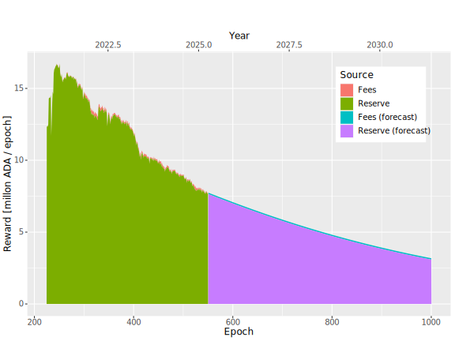
</p>

<em>Figure 1: Forecast of rewards on Cardano mainnet</em>

</div>

Ouroboros Praos cannot support the high transaction volume needed to generate
the fees that will eventually be needed to offset the diminishing rewards.
However, as sustained throughput of transactions grows beyond
[50 transactions per second](https://github.com/input-output-hk/ouroboros-leios/blob/d5f1a9bc940e69f406c3e25c0d7d9aa58cf701f8/docs/cost-estimate/README.md#required-tps-for-current-reward-maintenance),
there is more opportunity for simultaneously reducing fees, augmenting the
Treasury, and increasing SPO and delegator rewards.

<div align="center">
<a name="figure-2" id="figure-2"></a>
<p>
  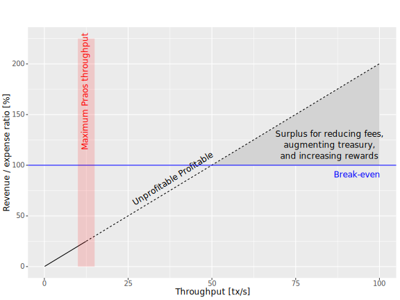
</p>

<em>Figure 2: SPO profitability under Praos, as a function of transaction
volume</em>

</div>

The Leios protocol specified in this document represents a balance between
immediate scalability needs and long-term protocol evolution. The approach
prioritizes practical deployment and ecosystem compatibility while establishing
the foundation for subsequent protocol versions with higher throughput capacity.

## Specification

Ouroboros Leios achieves higher transaction throughput by allowing block
producers to create additional blocks alongside the regular Praos chain. These
supplementary blocks, called **Endorser Blocks (EBs)**, reference extra
transactions that would otherwise wait for the standard Praos blocks (called
**Ranking Blocks** or **RBs** in this protocol) in future active slots. To
ensure data availability and correctness, these blocks undergo committee
validation before their transactions become part of the permanent ledger.

The key insight is that we can maintain Praos's security guarantees while
processing more transactions by carefully managing when and how these additional
blocks are validated and included in the chain.

> [!NOTE]
>
> The Agda formal specification for the proposed Leios protocol is available
> [here][linear-leios-formal-spec].

<div align="center">
  <a name="figure-3" id="figure-3"></a>
  <p name="protocol-overview">
    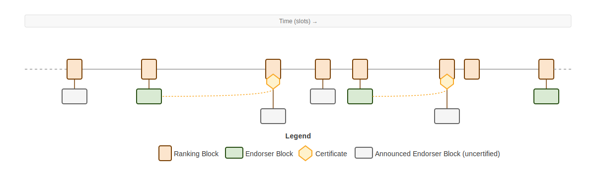
  </p>

<em>Figure 3: Leios chain structure showing the relationship between Ranking
Blocks, Endorser Blocks, and Certificates</em>

</div>

The horizontal spacing in Figure 3 reflects the opportunistic nature of EB
inclusion: some EBs get certified and are included in the chain (green), while
others cannot be certified in time (gray). This happens because Praos block
production is probabilistic - some RBs will naturally occur before there has
been sufficient time for the preceding EB to gather the necessary votes and
certification. The key insight is that proposed Leios utilizes the natural
intervals between Praos blocks to perform additional work on transaction
processing without interfering with the base chain operation.

EB inclusion is therefore opportunistic rather than guaranteed, depending on the
random timing of block production relative to the certification process. The
precise timing mechanism is detailed in the following section.

### Protocol Flow

The protocol operates through five sequential steps that involve three critical
timing constraints. Figure 4 visualizes the precise timing mechanism that
governs when certificates can be safely included in the chain, showing both the
protocol parameters and the underlying network characteristics ($\Delta$ values)
and protocol parameters ($L$ values) that inform their design.

<div align="center">
  <a name="figure-4" id="figure-4"></a>
  <p name="protocol-flow-figure">
    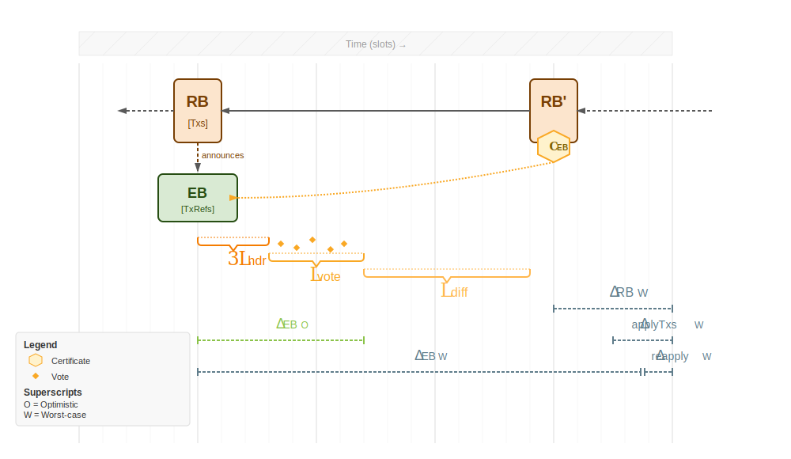
  </p>

<em>Figure 4: Detailed timing mechanism showing the three critical timing
constraints for EB certification</em>

</div>

#### Step 1: Block Production

Leios preserves the existing Praos chain structure while adding additional
transaction capacity through EBs. When a stake pool wins block leadership, it
may create two entities:

1. **[Ranking Block (RB)](#ranking-blocks-rbs)** A standard Praos block with
   extended header fields to optionally certify one previously announced EB and
   optionally announce one EB for the next subsequent RB (i.e., `RB'`) to
   certify.
1. **[Endorser Block (EB)](#endorser-blocks-ebs)** A larger block containing
   references to additional transactions.

The RB chain continues to be distributed exactly as in Praos, while Leios
introduces separate distribution mechanisms for EB headers (for rapid discovery
and <a id="equivocation" href="#equivocation-detection">equivocation
detection</a>), EB bodies, and their referenced transactions.

Due to the voting overhead per EB, EBs should only be announced if a transaction
cannot be included in the base RB. Empty EBs should not be announced in the
network as they induce a non-zero cost. Note that whether an RB is full is not
solely determined by its byte size; in particular, the per-block Plutus limits
could be the reason a full RB cannot contain additional transactions.
Additionally, transactions requiring higher size or Plutus execution limits
available through proposed Leios may necessitate placement in EBs rather than
RBs. The lower latency provided by RBs naturally incentivizes their use first,
enabling gradual adoption of Leios capabilities.

#### Step 2: EB Distribution

Nodes receiving the RB header discover the announced EB and fetch its body. The
EB body contains references to transactions. If a node does not already possess
a transaction referenced in the EB, it explicitly requests that transaction from
peers. The whole process of propagating EBs and referenced transactions is
called EB diffusion. Only minimal validation is done before forwarding this data
to ensure rapid dissemination while full validity is determined by the voting
committee.

#### Step 3: Committee Validation

After the [equivocation detection period](#equivocation-detection) of
$3 L_\text{hdr}$ slots, a voting committee of stake pools validates the EB and
votes within a [voting period](#voting-period) $L_\text{vote}$. Committee
members are [selected via sortition](#committee-structure) based on the slot
number of the RB that announced the EB. A committee member votes for an EB only
if:

1. The RB header arrived within $L_\text{hdr}$,
2. It has **not** detected any equivocating RB header for the same slot,
3. It finished validating the EB before $3 \times L_\text{hdr} + L_\text{vote}$
   slots after the EB slot,
4. The EB is the one announced by the latest RB in the voter's current chain,
5. The EB's transactions form a **valid** extension of the RB that announced it,
6. For non-persistent voters, it is eligible to vote based on sortition using
   the announcing RB's slot number as the election identifier.

where $L_\text{hdr}$ and $L_\text{vote}$ are
<a href="#protocol-parameters">protocol parameters</a> represented by a number
of slots.

While not strictly a required check, honest nodes should not vote on empty EBs
as that is obviously pointless and wasteful.

#### Step 4: Certification

During the voting period, if enough committee votes are collected such that the
total stake exceeds a **high threshold** parameter ($\tau$), for example 75%,
the EB becomes **certified**:

$$
\sum_{v \in \text{votes}} \text{stake}(v) \geq \tau \times \text{stake}_{\text{total-active}}
$$

The **high voting threshold** (e.g., 75%) ensures that any certified EB is
already known to a large portion of the network (>25% even with 50% adversarial
stake) by the end of the voting period. This widespread initial knowledge
enables the network assumption that the EB will reach all honest parties within
the additional diffusion period $L_\text{diff}$. See
[Protocol Parameters](#protocol-parameters) for details. A ranking block (RB)
producer can then construct a compact certificate proving the EB's validity by
aggregating the collected votes.

#### Step 5: Chain Inclusion

If an RB opportunity is after the [diffusion period](#diffusion-period)
$L_\text{diff}$, a block producer may include in block `RB'` a certificate for
the EB announced by the preceding block `RB`. As shown in Figure 4, this occurs
only after the complete timing sequence has elapsed. The inclusion rules for
valid chain inclusion are:

1. `RB'` contains **either**

   a. a certificate for the EB announced in `RB`, **or**

   b. a list of transactions forming a valid extension of `RB`.

2. The included certificate is valid as defined in
   [Certificate Validation](#certificate-validation).
3. A certificate may only be included if `RB'` is at least
   $3 \times L_\text{hdr} + L_\text{vote} + L_\text{diff}$ slots after `RB`.

where $L_\text{hdr}$, $L_\text{vote}$ and $L_\text{diff}$ are
<a href="#protocol-parameters">protocol parameters</a> represented by a number
of slots.

This **certificate inclusion delay** ensures certified EBs have sufficient time
to diffuse throughout the network before their transactions are included in the
ledger. If the next RB is produced before this minimum delay has elapsed, the EB
certificate cannot be included and the EB is discarded.

### Protocol Parameters

The protocol parameters are tunable values that can be adjusted via governance.
These parameters fall into two categories: timing parameters derived from the
network characteristics below and timing constraints, and size/resource
parameters that manage throughput.

The certificate inclusion process (Steps 3-5) involves three timing constraints
that work together to maintain Praos's security assumptions while enabling
higher throughput. These constraints prevent scenarios where honest nodes would
be forced to delay chain adoption due to missing data.

<a id="network-characteristics"></a>**Network Characteristics**

The protocol timing is built upon observed network characteristics that describe
how quickly different types of data propagate. All timing parameters target
propagation to ~95% of honest stake, which represents practical network-wide
availability:

<div align="center">
<a name="table-1" id="table-1"></a>

| Characteristic                                                       |            Symbol             | Description                                                                                                                 | Observed Range by Simulations |
| -------------------------------------------------------------------- | :---------------------------: | --------------------------------------------------------------------------------------------------------------------------- | :---------------------------: |
| <a id="delta-hdr" href="#delta-hdr"></a>Header propagation           |      $\Delta_\text{hdr}$      | Time for constant size headers (< 1,500 bytes) to propagate network-wide                                                    |            <1 slot            |
| <a id="delta-rb" href="#delta-rb"></a>RB diffusion                   |      $\Delta_\text{RB}$       | Complete ranking block propagation and adoption time                                                                        |           <5 slots            |
| <a id="delta-eb-H" href="#delta-eb-H"></a>EB optimistic diffusion    | $\Delta_\text{EB}^{\text{O}}$ | EB **diffusion** time (transmission + processing) under favorable network conditions                                        |           1-3 slots           |
| <a id="delta-eb-A" href="#delta-eb-A"></a>EB worst-case transmission | $\Delta_\text{EB}^{\text{W}}$ | EB **transmission** time for certified EBs starting from >25% network coverage (processing already completed during voting) |          15-20 slots          |

<em>Table 1: Network Characteristics</em>

</div>

> [!NOTE]
>
> **Network Condition**
>
> The exact definition of "optimistic" and "worst-case" network conditions may
> be refined based on empirical measurements and deployment experience. For
> example, optimistic conditions might be defined as "no fresher RB" or "at most
> 2 fresher RBs", depending on how these conditions impact throughput and
> $\Delta_\text{EB}^{\text{W}}$. The specific thresholds should be determined
> through testnet validation and performance analysis.

<div align="center">
<a name="table-2" id="table-2"></a>

| Characteristic                                                           |          Symbol          | Description                                                     | Observed Range by Simulations |
| ------------------------------------------------------------------------ | :----------------------: | --------------------------------------------------------------- | :---------------------------: |
| <a id="delta-reapply" href="#delta-reapply"></a>EB reapplication         | $\Delta_\text{reapply}$  | Certified EB reapplication with minimal checks and UTxO updates |            <1 slot            |
| <a id="delta-applytxs" href="#delta-applytxs"></a>Transaction validation | $\Delta_\text{applyTxs}$ | Standard Praos transaction validation time for RB processing    |            ~1 slot            |

<em>Table 2: Ledger Characteristics</em>

</div>

**Protocol Parameters**

<div align="center">
<a name="table-3" id="table-3"></a>

| Parameter                                                      |      Symbol      |    Units     | Description                                                                                 | Rationale                                                                                                                                                                                                                                        |
| -------------------------------------------------------------- | :--------------: | :----------: | ------------------------------------------------------------------------------------------- | ------------------------------------------------------------------------------------------------------------------------------------------------------------------------------------------------------------------------------------------------ |
| <a id="l-hdr" href="#l-hdr"></a>Header diffusion period length |  $L_\text{hdr}$  |     slot     | Duration for RB headers to propagate network-wide                                           | Per [equivocation detection](#equivocation-detection): must accommodate header propagation for equivocation detection.                                                                                                                           |
| <a id="l-vote" href="#l-vote"></a>Voting period length         | $L_\text{vote}$  |     slot     | Duration during which committee members can vote on endorser blocks                         | Per [voting period](#voting-period): must accommodate EB propagation and validation time. Set to minimum value that ensures honest parties can participate in voting                                                                             |
| <a id="l-diff" href="#l-diff"></a>Diffusion period length      | $L_\text{diff}$  |     slot     | Additional period after voting to ensure network-wide EB availability                       | Per [diffusion period](#diffusion-period): derived from the fundamental safety constraint. Leverages the network assumption that data known to >25% of nodes propagates fully within this time                                                   |
| Ranking block max size                                         |  $S_\text{RB}$   |    bytes     | Maximum size of a ranking block                                                             | Limits RB size to ensure timely diffusion                                                                                                                                                                                                        |
| Endorser-block referenceable transaction size                  | $S_\text{EB-tx}$ |    bytes     | Maximum total size of transactions that can be referenced by an endorser block              | Limits total transaction payload to ensure timely diffusion within stage length                                                                                                                                                                  |
| Endorser block max size                                        |  $S_\text{EB}$   |    bytes     | Maximum size of an endorser block itself                                                    | Limits EB size to ensure timely diffusion; prevents issues with many small transactions                                                                                                                                                          |
| Mean committee size                                            |       $n$        |   parties    | Average number of stake pools selected for voting                                           | Ensures sufficient decentralization and security                                                                                                                                                                                                 |
| Quorum size                                                    |      $\tau$      |   fraction   | Minimum fraction of committee votes required for certification                              | High threshold ensures certified EBs are known to >25% of honest nodes even with 50% adversarial stake. This widespread initial knowledge enables the network assumption that certified EBs will reach all honest parties within $L_\text{diff}$ |
| Maximum Plutus steps per endorser block                        |        -         |  step units  | Maximum computational steps allowed for Plutus scripts in a single endorser block           | Limits computational resources per EB to ensure timely validation                                                                                                                                                                                |
| Maximum Plutus memory per endorser block                       |        -         | memory units | Maximum memory allowed for Plutus scripts in a single endorser block                        | Limits memory resources per EB to ensure timely validation                                                                                                                                                                                       |
| Maximum Plutus steps per transaction                           |        -         |  step units  | Maximum computational steps allowed for Plutus scripts in a single transaction within an EB | Limits computational resources per transaction to enable higher throughput                                                                                                                                                                       |
| Maximum Plutus memory per transaction                          |        -         | memory units | Maximum memory allowed for Plutus scripts in a single transaction within an EB              | Limits memory resources per transaction to enable higher throughput                                                                                                                                                                              |

<em>Table 3: Protocol Parameters</em>

</div>

#### Timing parameters

There are three key parameters related to time, which are important for
[protocol security](#protocol-security). All relevant quantities are depdicted
in [Figure 4](#figure-4).

<a id="equivocation-detection"></a>

**Equivocation Detection ($3 L_\text{hdr}$)**

This period occurs immediately when an RB announces an EB. During this time, the
network detects any attempts by adversaries to create multiple conflicting
blocks for the same slot. The equivocation detection mechanism ensures that
honest nodes can reliably identify and reject equivocating behavior before
participating in voting. The equivocation detection period is $3 L_\text{hdr}$,
derived from the header diffusion parameter $L_\text{hdr}$.

**Equivocation Attack Model**: An adversary controlling a block production slot
may attempt to create multiple conflicting EBs and distribute different versions
to different parts of the network. This could potentially split the honest vote,
preventing certification of any EB, or worse, allow certification of an
adversarial EB if honest nodes vote on different versions.

**Detection Mechanism**: The protocol defends against equivocation through a
multi-step detection process that must accommodate the worst-case propagation
scenario:

1. **$L_\text{hdr}$**: Initial header propagation - the first (honest or
   adversarial) RB header reaches all honest nodes
2. **$L_\text{hdr}$**: Conflicting header propagation - any equivocating header
   from the same slot reaches honest nodes
3. **$L_\text{hdr}$**: Equivocation evidence propagation - proof of conflicting
   headers propagates network-wide, allowing all honest nodes to detect the
   equivocation

Therefore, the equivocation detection period is $3 L_\text{hdr}$ to ensure
reliable detection before voting begins. This constraint is derived from the
network model where headers must propagate within $L_\text{hdr}$ to maintain
Praos security assumptions.

**Security Guarantee**: By waiting $3 L_\text{hdr}$ slots before voting begins,
the protocol ensures that if any equivocation occurred soon enough to matter,
all honest nodes will have detected it and will refuse to vote for any EB from
the equivocating issuer. This prevents adversaries from exploiting network
partitions to gain unfair advantages in the voting process, as honest nodes will
only vote for EBs where no equivocation was detected during the detection
period.

Note that EB diffusion (but not voting) continues to happen during this phase.

> [!NOTE]
>
> **Comparison with Research Paper**: The [Leios research paper][leios-paper]
> describes a more complex protocol variant that requires $5\Delta_\text{hdr}$
> for equivocation detection due to additional coordination mechanisms between
> Input Blocks and Endorser Blocks. This specification's simplified approach,
> where EBs are directly announced by RBs, reduces the equivocation detection
> requirement to $3\Delta_\text{hdr}$ while maintaining the same security
> guarantees against equivocation attacks.

<a id="voting-period"></a>

**Voting Period ($L_\text{vote}$)**

The voting period must accommodate EB diffusion (transmission and processing):

$$3 \times L_\text{hdr} + L_\text{vote} > \Delta_\text{EB}^{\text{O}}$$

where $\Delta_\text{EB}^{\text{O}}$ (optimistic EB diffusion time including
transmission and processing) is defined in the
[network characteristics](#network-characteristics) section.

This ensures all honest committee members can participate by having sufficient
time to:

1. Receive the EB from the network
2. Fully validate it (verify signatures, execute scripts, update state)

<a id="diffusion-period"></a>

**Diffusion Period ($L_\text{diff}$)**

The diffusion period ensures network-wide EB availability through a combination
of factors: the high quorum threshold ensures certified EBs are initially known
to >25% of honest nodes, and the network assumption that data with such
widespread initial knowledge propagates fully within this period. The diffusion
period must satisfy:

$$L_\text{diff} \geq \Delta_\text{EB}^{\text{W}} + \Delta_\text{reapply} - \Delta_\text{RB'} - 3 \times L_\text{hdr} - L_\text{vote}$$

This ensures certified EBs reach all honest parties before any RB' that includes
their certificate needs processing.

#### Size parameters

Two separate parameters control EB sizes:

- $S_\text{EB}$ limits the size of the EB data structure itself, preventing
  issues when many small transactions create large numbers of transaction
  references (32 bytes each)
- $S_\text{EB-tx}$ limits the total size of transactions that can be referenced,
  controlling the actual transaction payload

For example, an EB referencing 10,000 transactions of 100 bytes each would have
$S_\text{EB-tx} = 1$ MB but the EB itself would be at least 320 KB for the
transaction hashes alone.

### Protocol Security

Leios security reduces to Praos security. The key insight is ensuring that any
RB containing an EB certificate is processed within the same $\Delta_\text{RB}$
time bound as standard Praos blocks.

<a id="eb-reapplication-constraint"></a>

**1. EB Reapplication Constraint**

Reapplying a certified EB cannot cost more than standard transaction processing.

$$\Delta_\text{reapply} < \Delta_\text{applyTxs}$$

<a id="certified-eb-transmission-constraint"></a>

**2. Certified EB Transmission Constraint**

Any certified EB referenced by an RB must be transmitted (but not necessarily be
processed) before that RB needs to be processed.

$$\Delta_\text{EB}^{\text{W}} < 3 \times L_\text{hdr} + L_\text{vote} + L_\text{diff} + (\Delta_\text{RB} - \Delta_\text{applyTxs})$$

The security argument can now be described. For simplicity, the analysis focuses
on the case where a single RB (referencing an EB) is diffused, and nodes have
already computed the ledger state that this RB extends.

The argument proceeds as follows: (i) The certified EB that the RB references
will be received within $\Delta_\text{RB} - \Delta_\text{applyTxs}$ from the
initial diffusion time of the RB. This follows directly from
[Constraint 2](#certified-eb-transmission-constraint) and the fact that the RB
was generated at least $3 \times L_\text{hdr} + L_\text{vote} + L_\text{diff}$
slots after the EB was generated. (ii) The RB will be processed within
$\Delta_\text{RB}$ slots, due to the fact that it is received within
$\Delta_\text{RB} - \Delta_\text{applyTxs}$ from its initial diffusion time, and
processing in the worst-case takes
$\Delta_\text{reapply} (< \Delta_\text{applyTxs})$ slots according to
[Constraint 1](#eb-reapplication-constraint).

Given that nodes are caught up when they are about to produce or process an RB,
Praos safety and liveness is thus preserved.

### Protocol Entities

The protocol extends Praos blocks, introduces endorser blocks, Leios votes and
certificates. While already introduced briefly, this section specifies these
entities in more detail.

#### Ranking Blocks (RBs)

RBs are Praos blocks extended to support Leios by optionally announcing EBs in
their headers and embedding EB certificates in their bodies.

1. **Header additions**:

   - `announced_eb` (optional): Hash of the EB created by this block producer
   - `announced_eb_size` (optional): Size in bytes of the announced EB (4 bytes)
   - `certified_eb` (optional): Single bit indicating whether this RB certifies
     the EB announced by the previous RB (the EB hash is already available via
     the previous header's `announced_eb` field)

2. **Body additions**:
   - `eb_certificate` (optional): aggregated certificate proving EB validity
   - Transactions (when no certificate is included)

<a id="rb-inclusion-rules" href="#rb-inclusion-rules"></a>**Inclusion Rules**:

- When an RB header sets `certified_eb` to true, the corresponding body must
  include a matching `eb_certificate`
- The content rules for RBs are detailed as part of
  [Step 5: Chain Inclusion](#step-5-chain-inclusion)
- The `certified_eb` bit enables syncing nodes to predict the total size of
  valid responses to their requests for batches of EBs certified on the
  historical chain.
- If the `announced_eb_size` field of an RB header is incorrect, then neither
  the RB header nor the RB are invalid. But no honest node should vote for the
  EB.

#### Endorser Blocks (EBs)

EBs are produced by the same stake pool that created the corresponding
announcing RB and reference additional transactions to increase throughput
beyond what is permitted to be included directly in the RB.

<a id="eb-structure" href="#eb-structure"></a>**EB Structure**: EBs have a
simple structure:

- `transaction_references`: Ordered list of transaction references, where each
  reference includes the hash of the complete transaction bytes and the
  transaction size in bytes

The precise structure is defined in the <a href="#endorser-block-cddl">Endorser
Block CDDL specification</a> in Appendix B.

The hash referenced in RB headers (`announced_eb` field) is computed from the
complete EB structure and serves as the unique identifier for the EB. The
`certified_eb` field is a boolean that references the EB announced by the
previous RB in the chain.

#### Votes and Certificates

Leios employs a voting and certificate scheme where committee members cast votes
that reference specific EBs, which are then aggregated into compact certificates
for inclusion in RBs. This specification uses BLS signatures as the
implementation example, though the protocol is designed to accommodate any
efficient aggregate signature scheme that Cardano may adopt.

The implementation meets the <a href="#appendix-a-requirements">requirements for
votes and certificates</a> specified in Appendix A. Alternative schemes
satisfying these requirements could be substituted, enabling unified voting
infrastructure across Ouroboros Leios, Ouroboros Peras, and other protocols.

To participate in the Leios protocol as voting member/ block producing node,
stake pool operators must register one additional cryptographic key for the
voting scheme alongside their existing VRF and KES keys. In the BLS
implementation described here, this would be a BLS12-381 key.

<a id="committee-structure" href="#committee-structure"></a>**Committee
Structure**: Two types of voters validate EBs, balancing security,
decentralization, and efficiency:

- **Persistent Voters**: Selected once per epoch using [Fait Accompli
  sortition][fait-accompli-sortition], vote in every election, identified by
  compact identifiers
- **Non-persistent Voters**: Selected per EB via local sortition with
  Poisson-distributed stake-weighted probability

This dual approach prevents linear certificate size growth by leveraging
non-uniform stake distribution, enabling faster certificate diffusion while
maintaining broad participation. With efficient aggregate signature schemes like
BLS, certificate sizes remain compact (under 10 kB) even with large committees,
as shown in the [BLS certificates specification][bls-spec].

<a id="vote-structure" href="#vote-structure"></a>**Vote Structure**: All votes
include the `endorser_block_hash` field that uniquely identifies the target EB:

- **Persistent votes**:
  - `election_id`: Identifier for the voting round (derived from the slot number
    of the RB that announced the target EB)
  - `persistent_voter_id`: Epoch-specific pool identifier
  - `endorser_block_hash`: Hash of the RB header that announced the target EB
  - `vote_signature`: Cryptographic signature (BLS in this implementation)
- **Non-persistent votes**:
  - `election_id`: Identifier for the voting round (derived from the slot number
    of the RB that announced the target EB)
  - `pool_id`: Pool identifier
  - `eligibility_signature`: Cryptographic proof of sortition eligibility (BLS
    in this implementation)
  - `endorser_block_hash`: Hash of the RB header that announced the target EB
  - `vote_signature`: Cryptographic signature (BLS in this implementation)

The `endorser_block_hash` identifies the header that announces the EB instead of
identifying the EB's hash directly. This ensures the voters validated the EB
against the same ledger state that it extends when certfied on chain; recall
that multiple RB headers could announce the same EB.

The precise structure is defined in the <a href="#votes-certificates-cddl">Votes
and Certificates CDDL specification</a> in Appendix B.

<a id="certificate-validation" href="#certificate-validation"></a>**Certificate
Validation**: When an RB includes an EB certificate, nodes must validate the
following before accepting the block:

1. **CDDL Format Compliance**: Certificate structure matches the specification
   format defined in the <a href="#votes-certificates-cddl">Votes and
   Certificates CDDL specification</a> in Appendix B
2. **Cryptographic Signatures**: All cryptographic signatures are valid (BLS
   signatures in this implementation)

3. **Voter Eligibility**:
   - Persistent voters must have been selected as such by the [Fait Accompli
     scheme][fait-accompli-sortition] for the current epoch
   - Non-persistent voters must provide valid sortition proofs based on the
     `election_id`
   - **Vote Eligibility Determination**: For non-persistent voters, sortition
     eligibility is determined using the `election_id` derived from the slot
     number of the RB that announced the target EB. This ensures that vote
     eligibility is verifiable and deterministic - nodes can independently agree
     on which stake pools are eligible to vote for a specific EB based solely on
     the EB's announcing RB slot, preventing multiple voting opportunities
     across different slots for the same EB. This requirement stems from the BLS
     sortition mechanism which uses the election identifier as input to the VRF
     calculation for non-persistent voter selection.
4. **Stake Verification**: Total voting stake meets the required quorum
   threshold
5. **EB Consistency**: Certificate references the correct EB hash announced in
   the preceding RB

Detailed specifications, performance, and benchmarks are available in the [BLS
certificates specification][bls-spec].

> [!NOTE]
>
> **Vote Bundling**
>
> The linked BLS specification mentions vote bundling as an optimization.
> However, this only applies when EB production is decoupled from RBs, which is
> not the case in this specification where each EB is announced by an RB.

### Node Behavior

The Leios protocol introduces new node responsibilities and message flows beyond
those in Praos, reflecting the additional steps of EB creation and announcement,
committee voting, and certificate aggregation. The following sections detail the
specific behaviors that nodes must implement.

<div align="center">
<a name="figure-5" id="figure-5"></a>
<p>
  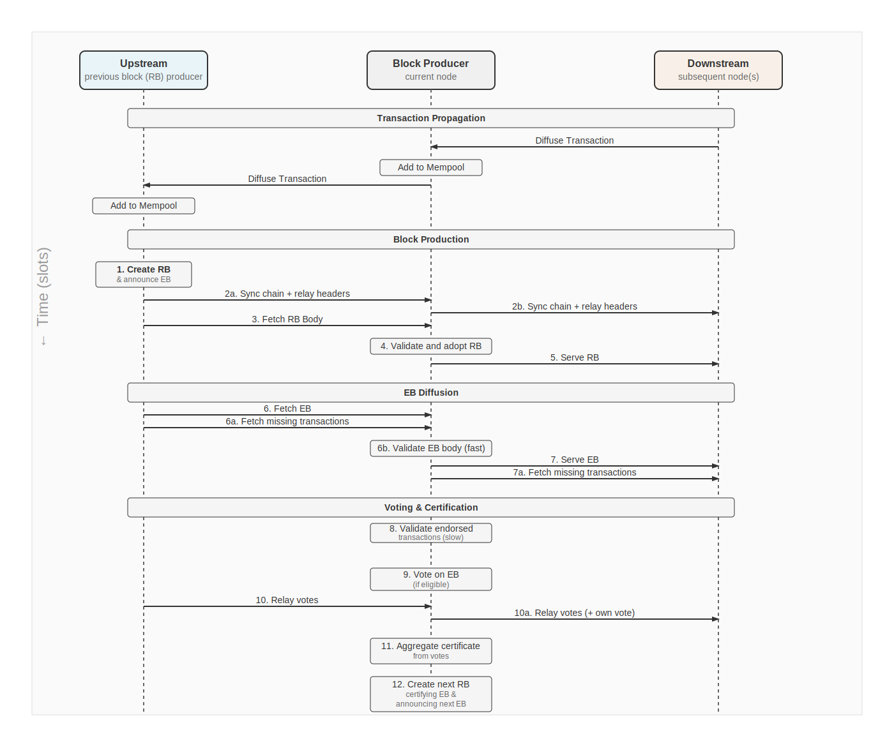
</p>

<em>Figure 5: Up- and downstream interactions of a node (simplified)</em>

</div>

The diagram above illustrates the Leios protocol in a simplified sequential
order. In practice, these operations occur concurrently and the actual execution
order depends on network conditions, timing, and node state. While many steps
introduce new behaviors, several core Praos mechanisms remain unchanged.

#### Transaction Diffusion

<a id="transaction-propagation" href="#transaction-propagation"></a>**Transaction
Propagation**: Uses the TxSubmission mini-protocol exactly as implemented in
Praos. Transactions flow from downstream to upstream nodes through diffusion,
where they are validated against the current ledger state before being added to
local mempools. The protocol maintains the same FIFO ordering and duplicate
detection mechanisms.

<a id="mempool-design" href="#mempool-design"></a>**Mempool Design**: The
mempool follows the same design as current Praos deployment with increased
capacity to support both RB and EB production. A node's mempool capacity must
accommodates expanded transaction volume:

<div align="center">

$\text{Mempool} \geq 2 \times (S_\text{RB} + S_\text{EB-tx})$

</div>

Nodes maintain a set $S$ of transactions seen in EBs to enable validation work
reuse, with detailed processing rules specified in the
<a href="#eb-transaction-handling">EB transaction handling</a> section.

#### RB Block Production and Diffusion

When a stake pool wins block leadership (step 1), they create a Ranking Block
(RB) and **optionally** an Endorser Block (EB) based on the
[chain inclusion rules](#step-5-chain-inclusion). The RB is a standard Praos
block with extended header fields to reference one EB and announce another EB
when such is created. The optional EB is a larger block containing references to
additional transactions. The RB chain continues to be distributed exactly as in
Praos, while Leios introduces a separate mechanism to distribute the same
headers for rapid EB discovery and
<a href="#equivocation-detection">equivocation detection</a>.

<a id="rb-header-diffusion" href="#rb-header-diffusion"></a>**RB Header
Diffusion**: RB headers diffuse independently of standard ChainSync (steps 2a
and 2b). This separate mechanism enables rapid EB discovery within the strict
timing bound $\Delta_\text{hdr}$. EBs are diffused freshest-first to facilitate
timely EB delivery, with nodes propagating at most two headers per (slot,
issuer) pair to detect <a href="#equivocation-detection">equivocation</a> -
where an attacker creates multiple EBs for the same block generation
opportunity - while limiting network overhead. The header contains the EB hash
when the block producer created an EB, allowing peers to discover the
corresponding EB.

<a id="rb-body-diffusion" href="#rb-body-diffusion"></a>**RB Body Diffusion**:
After receiving headers, nodes fetch RB bodies via standard BlockFetch protocol
(step 3). This employs ChainSync and BlockFetch protocols without modification
for fetching complete ranking blocks after headers are received. The pipelining
and batching optimizations for block body transfer remain unchanged from Praos.

<a id="rb-validation-adoption" href="#rb-validation-adoption"></a>**Validation
and Adoption**: Nodes validate the RB and any included EB certificate before
adopting the block (step 4). This includes cryptographic verification of
certificates and ensuring they correspond to properly announced EBs. The
complete validation procedure is detailed in
[Step 5: Chain Inclusion](#step-5-chain-inclusion). The node serves RBs to
downstream peers using standard Praos block distribution mechanisms (step 5),
which are permitted to include diffusion pipelining with delayed validation.

#### EB Diffusion

Whenever an EB is announced through an RB header, nodes must fetch the EB
content promptly (step 6), such that they receive it within
$3 \times L_\text{hdr} + L_\text{vote}$ and consequently enables them to vote.
EBs are fetched freshest-first to ensure timely delivery within the voting
window. Only the EB body corresponding to the first EB announcement/RB header
received for a given RB creation opportunity shall be downloaded. The EB
contains references to transactions.

<a id="eb-chain-selection" href="#eb-chain-selection"></a>**EB Propagation for
Chain Selection**: To support efficient chain selection, nodes must receive
**all EBs from competing forks**, not only those in their current preferred
chain. This ensures that when a node switches to a different fork due to the
longest-chain rule, it can immediately validate the new chain without additional
EB propagation delays. However, nodes do not need to fetch EBs from forks that
have diverged from the locally preferred chain older than the Praos security
parameter, as such forks cannot affect chain selection decisions. EBs are
forwarded before complete validity checks are performed.

<a id="transaction-retrieval" href="#transaction-retrieval"></a>**Transaction
Retrieval**: Nodes check transaction availability for the EB and fetch any
missing transactions from peers (steps 6a and 7a). Once all transactions are
available, nodes can serve EBs to downstream peers (step 7). This guarantees
that when a node announces an EB its downstream peers can trust it has all EB
transactions available.

<a id="eb-transaction-validation" href="#eb-transaction-validation"></a>**Transaction
Validation**: As endorsed transactions become available, nodes validate them in
the endorsed sequence against the appropriate ledger state (step 8), ensuring
the transactions form a valid extension of the announcing RB and meet size
constraints.

<a id="eb-transaction-handling" href="#eb-transaction-handling"></a> To optimize
validation work, nodes maintain a set $S$ of transactions seen in recently
received EBs. Each entry in $S$ contains:

1. The transaction itself
2. A validation flag indicating whether the transaction has been verified
   (signatures, scripts, etc.)

Transactions are only validated when they are seen the first time, either in the
mempool or as part of an EB, and validity information is retained to avoid
redundant fetching and validation.

#### Voting & Certification

<a id="VotingEB" href="#VotingEB"></a>**Voting Process**: Committee members
[selected through a lottery process](#votes-and-certificates) vote on EBs as
soon as [vote requirements](#step-3-committee-validation) are met according to
protocol (step 9). An honest node casts only one vote for the EB extending its
current longest chain.

<a id="VoteDiffusion" href="#VoteDiffusion"></a>**Vote Propagation**: Votes
propagate through the network during the vote diffusion period $L_\text{diff}$
slots (steps 10 and 10a). While nodes forward votes on EBs across all candidate
chains, they only forward at most one vote per committee member per slot.

Nodes maintain and relay votes for a bounded duration to limit resource usage.
Since freshest-first delivery ensures that newer votes are prioritized over
older ones, the exact bound is not critical for protocol correctness. A
conservative bound of a few minutes is sufficient to handle network delays while
allowing nodes to discard votes that are no longer relevant.

<a id="CertificateAggregation" href="#CertificateAggregation"></a>**Certificate
Construction**: All nodes receive votes from upstream peers, maintaining a
running tally for each EB to track progress toward the quorum threshold (step
11). However, only RB producers create certificates when they are about to
produce a new ranking block. Block producing nodes know their ownleadership
schedule, so they know when they are eligible to construct a certificate for an
upcoming RB they will produce. When enough votes are collected during the vote
diffusion period, the RB producer aggregates them into a compact certificate.
This certificate is embedded directly in the RB body and serves as cryptographic
proof that the EB has received sufficient committee approval.

#### Next Block Production

<a id="certificate-inclusion" href="#certificate-inclusion"></a>**Certificate
Inclusion**: Block producers creating new RBs include certificates for EBs where
at least $3 \times L_\text{hdr} + L_\text{vote} + L_\text{diff}$ slots have
elapsed since the slot of the RB that announced the EB (step 12). This timing
constraint ensures the certified EB has had sufficient time to diffuse
throughout the network. See the protocol flow section for detailed
[block production and inclusion rules](#step-5-chain-inclusion).

#### Ledger Management

<a id="ledger-formation" href="#ledger-formation"></a>**Ledger Formation**: The
ledger follows the same design as Praos with the addition of certificate
handling and EB attachment references. The ledger state is updated according to
the same validation rules used in Praos, with phase-1 and phase-2 validation
applying equally to both RB and EB transactions.

<a id="ledger-state-transitions" href="#ledger-state-transitions"></a>**State
Transitions**: EBs add transactions to the ledger only when properly certified
and included via RB references. RBs can include both certificates and their own
transactions. The ledger state for validating RB transactions is constructed
based on either the predecessor RB (when no EB certificate is included) or the
certified EB (when a valid certificate is present). Note that EB transactions
are validated against the ledger state from the RB that announced the EB (i.e.,
the predecessor RB of the certifying RB), ensuring the predecessor RB's
transactions are relevant in both validation scenarios.

<a id="chain-selection" href="#chain-selection"></a>**Chain Selection**: Chain
selection follows the densest chain rule as in Ouroboros Genesis. EBs are
treated as auxiliary data that do not affect chain validity or selection
decisions. Fork choice depends solely on RB chain density, with EB certificates
serving only as inclusion proofs for transaction content. The
[EB propagation for chain selection](#eb-chain-selection) requirement ensures
that nodes already possess all necessary EBs from alternative forks, eliminating
additional propagation delays during fork switches.

#### Epoch Boundary

<a id="persistent-voter-computation" href="#persistent-voter-computation"></a>**Persistent
Voter Computation**: Nodes must compute the set of persistent voters for each
epoch using the [Fait Accompli scheme][fait-accompli-sortition]. This
computation uses the stake distribution that becomes available at the epoch
boundary and represents a minimal computational overhead based on current
[BLS certificates benchmarks](https://github.com/input-output-hk/ouroboros-leios/blob/d5f1a9bc940e69f406c3e25c0d7d9aa58cf701f8/crypto-benchmarks.rs/Specification.md#benchmarks-in-rust).
Nodes complete this computation well before voting begins in the new epoch to
ensure seamless participation.

#### Operational certficate issue numbers

Each node must relay at most two EB announcements that equivocate the same Praos
election. This would be trivial for senders and receivers to enforce, if it were
not for
[operational certificates](https://docs.cardano.org/stake-pool-operators/creating-keys-and-certificates#creating-an-operational-certificate-and-registering-a-stake-pool),
which complicate the notion of which sets of headers qualify as equivocating.

With the current Praos system, an SPO is free to issue an arbitrary operational
certficate issue numbers (OCIN) every time they issue an RB header, but honest
SPOs will only increment their OCIN when they need to. Whether the OCIN carried
by some header is valid depends on the chain it extends, because the Praos
protocol rules along a single chain only allow an SPO's OCIN to be incremented
at most once per header issued by that SPO.

The Leios protocol, in contrast, is expected to diffuse contemporary EBs
regardless of which chain they are on, and so cannot assume that it has seen the
predecessor header of every EB announcement. It also cannot simply require that
it has seen all headers, because that would complicate the timing restrictions
and require tracking a potentially unbounded number of forks. Thus, neither of
the following simple extremes would be acceptable for Leios.

- If Leios ignores OCINs, then a leaked hot key would let the adversary issue
  impersonating EBs whenever the stake pool is elected until that KES period
  expires, which can be up to 90 days later on Cardano mainnet. That's
  unacceptably long. (Significantly shortening the KES period is not an option,
  because that would excessively burden SPOs by forcing them to utilize their
  cold key more often.)
- If Leios instead over-interprets distinct OCINs as separate elections, then
  any adversary can diffuse any number of EB announcements per actual election,
  with arbitrary OCINs. Those announcements would be an unacceptable unbounded
  burst of work for honest nodes to relay throughout the entire network, even if
  they still only relayed at most one EB body per actual election.

There is no simple compromise between those extrema. In particular, if there's
any way for the adversary to have revealed incremented OCINs to some nodes but
definitely not all, then the worst-case diffusion behavior of adversarial EBs
might be worse than that of honest EBs, which would complicate the acceptable
lower bound on $L_\text{diff}$, for example. On the other hand, if every OCIN
increment - even those disallowed by Praos - is always eventually relayed to all
nodes, then an adversary can create unbounded work by constantly incrementing
their OCINs. In the absence of the context provided by forks, there's no bound
on the OCINs the Leios protocol would relay.

Thus, the diffusion of EB announcements (regardless of who issued them) is only
tractable and robust if it is restricted to a bounded set of OCINs that all
honest nodes almost certainly agree on. For this reason, the Leios node should
ignore an EB announcement that is less than the OCIN on its settled ledger state
or more than one greater than that OCIN. After not ignoring two announcements
with the same election, the Leios node should ignore (including not relaying)
any subsequent announcements for that election.

With this rule, a node will crucially disconnect if and only if a peer sends
more than two announcements with the same election. It will also ignore headers
from leaked hot keys once the SPO increments their OCIN, but unfortunately - and
in contrast to Praos - not immediately. The Leios node will only ignore
unincremented OCINs after all honest nodes necessarily agree that the SPO
incremented their OCIN. In the strictest case, that could require the increment
to be at least 36 hr old on Cardano mainnet before Leios ignores the
unincremented OCIN. It seems plausible that the agreement could sometimes be
assumed sooner (e.g., after a certificate includes the incremented OCIN), but
further details are not a blocker for this CIP; 36 hr is already an acceptable
improvement over 90 days, and SPOs already must not frequently leak their hot
keys.

### Network

Unlike Ouroboros Praos, where the RB chain contains all necessary data, Leios
requires additional message types to:

- **Reconstruct ledger state**: EBs containing certified transactions
- **Participate in consensus**: Vote on EBs and construct certificates
- **Detect equivocation**: RB headers from competing forks

#### Praos Mini-Protocols

As described in [Node Behavior](#node-behavior), existing Praos mini-protocols
continue to operate with only minor modifications to support Leios. ChainSync
exchanges RB headers that now include optional fields for EB announcements
(`announced_eb`) and certifications (`certified_eb`). BlockFetch retrieves RB
bodies that may contain BLS aggregate certificates (`eb_certificate`) alongside
standard transactions. TxSubmission remains unchanged except for expanded
mempool capacity to support both RB and EB transaction pools.

#### Leios Mini-Protocols

Leios must introduce new mini-protocols to handle the additional message types
required for EB distribution, voting, and certificate construction. Despite the
precedent for some CIPs to leave those concrete details for implementors to
decide, the diffculty of satisfying all of the requirements on a Leios
implementation motivates including a concrete proposal in this CIP.

In addition, this section summarizes the requirements for the proposed
mini-protocols and why they're satisfied. This demonstrates the collective
requirements are satisfiable - that some implementation is feasible and not
prohibitively complicated.

**Requirements**

Any Leios implementation must satisfy the following requirements. Alternative
message exchange designs that meet these requirements may be considered as the
protocol evolves, with updates to this specification reflecting proven
improvements.

- **Leios Correctness**: The nodes must exchange the Leios data while
  prioritizing younger over older as implied by Leios's freshest-first delivery
  assumption. Because Leios is about improved resource utilization, wasting
  resources via unnecessary overhead/latency/etc can be considered a correctness
  violation, even more so than in Praos.
- **Praos Independence**. The Cardano network must grow RB chains — both
  adversarial and honest — of the same shape (i.e., forks and their lengths)
  regardless of whether it is executing the Leios overlay. In other words, the
  shape of all RB forks that exist at some instant would ideally not provide any
  indication whether the Leios overlay is being executed. Moreover, the honest
  majority must still have the same control over which transactions are included
  by the RBs on the best chain.
- **Existing Resources**: The Leios overlay enables Cardano to increase
  utilization of existing resources. The Leios overlay will use more resources
  than Praos does, but it simultaneously will not inherently require today's
  Cardano SPOs or users to provision additional resources, beyond some minor
  exceptions. The necessary resources already exist; Praos just cannot utilize
  them all.
- **Tolerable Implementation Complexity**: The above requirements must admit an
  implementation without incurring prohibitive costs for development and future
  maintenance. For example, at least the centralized logic to choose when to
  send each request in this mini-protocol will be very similar to TxSubmission,
  Peras vote requests, Mithril's Decentralized Message Queue, and likely
  additional protocols in the future. There is opportunity for significant code
  reuse even if the mini-protocols themselves are separate.

**Discussion**

**Existing Resources**: Because Praos cannot already fully utilize the existing
Cardano infrastructure, this CIP can increase utilization without disrupting
Praos; the currently unutilized resources are sufficient for Leios. More
aggressive Leios deployments/extensions in the future will have to navigate that
trade-off, but simulations indicate that it is not already required by this CIP,
with two exceptions. First, nodes will require additional disk capacity as a
direct result of the increased throughput. Second, parties with significant
stake will need to provision more resources across their relays since each of
the hundreds of downstream peers becomes more demanding on average.

**Praos Independence**. To prevent Leios from accidentally depriving Praos of
resources, the node implementation must prioritize Praos over Leios. For
example, when a node simultaneously issues an RB and the EB it announces, the
diffusion of the EB should not delay the diffusion of the RB; that RB is
strictly more urgent than that EB.

_Remark_. In contrast, the EB certified by a RB that also includes some
transactions is exactly as urgent as that RB, because the RB cannot be selected
without the EB. The $L_\text{diff}$ parameter prevents such urgency inversion
from occurring enough to matter, as explained in the
[Security Argument](#protocol-security) section, assuming nodes automatically
eventually recover when it does happen.

In reality, the prioritization of Praos over Leios does not need to be perfectly
strict (and in fact could never be on hardware and software infrastructure that
is mostly commodity and partly public). The fundamental requirement is that the
network assumptions that were originally used to parametrize Praos must still be
valid — up to some tolerated error probability — when the same nodes are
simultaneously executing the Leios overlay. Concretely, the worst case delay
between an honest block producer issuing a uniquely best RB and the last honest
block producer selecting that RB (i.e., Praos's $\Delta$) must not be protracted
by Leios so much that the existing Praos parameter values (e.g., the stability
window of 36 hr) are no longer sufficient.

**Leios Correctness**: The implementation of freshest-first delivery also does
not need to be perfect. The prioritization of young over old merely needs to be
robust enough to justify the chosen values of $L_\text{vote}$ and
$L_\text{diff}$ even during a burst of withheld-but-valid messages.

**Concrete Proposal and its Feasibility**

The following two new mini-protocols are proposed for the Leios implementation.
This is not the only feasible solution, but this CIP should be amended as
implementors refine these mini-protocols.

If the general structure and semantics of mini-protocols is not already
familiar, see the Chapter 2 "Multiplexing mini-protocols" and Chapter 3
"Mini-Protocols" of the `ouroboros-network`'s
[Ouroboros Network Specification PDF](https://ouroboros-network.cardano.intersectmbo.org/pdfs/network-spec/network-spec.pdf).
A brief summary is that a mini-protocol is a state machine that two nodes
cooperatively navigate; each node only sends a message when it has _agency_, and
at most one node has agency in any state. The agencies are indicated in this
document as gold or cyan. The gold agency is the client, the downstream peer
that initiated the connection, and cyan is the server. If some of a node's
upstream peers are also downstream peers, then there are two instances of the
mini-protocol running independently for each such peer, with the node as the
client in one and the server in the other. Recall that Cardano's topology
results in each relay having many more downstream peers than upstream peers.
Syncing peers will be discussed below.

<div align="center">
<a name="figure-6" id="figure-6"></a>

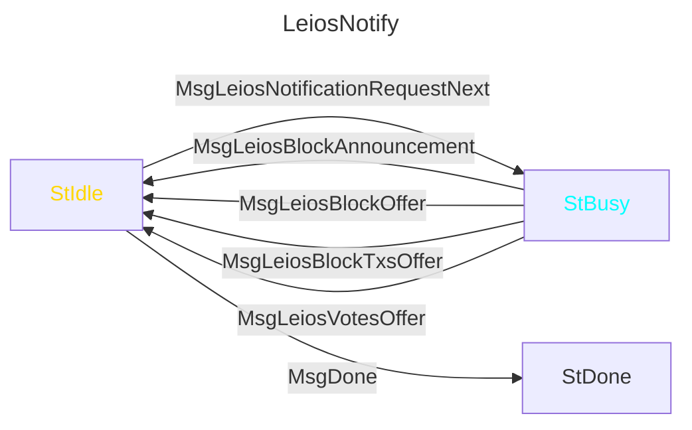
```mermaid
---
title: LeiosNotify
---
graph LR
   style StIdle color:gold;
   style StBusy color:cyan;

   StIdle -->|MsgLeiosNotificationRequestNext| StBusy
   StBusy -->|MsgLeiosBlockAnnouncement| StIdle
   StBusy -->|MsgLeiosBlockOffer| StIdle
   StBusy -->|MsgLeiosBlockTxsOffer| StIdle
   StBusy -->|MsgLeiosVotesOffer| StIdle

   StIdle -->|MsgDone| StDone
```

<em>Figure 6: LeiosNotify mini-protocol state machine</em>

</div>

<div align="center">
<a name="figure-7" id="figure-7"></a>

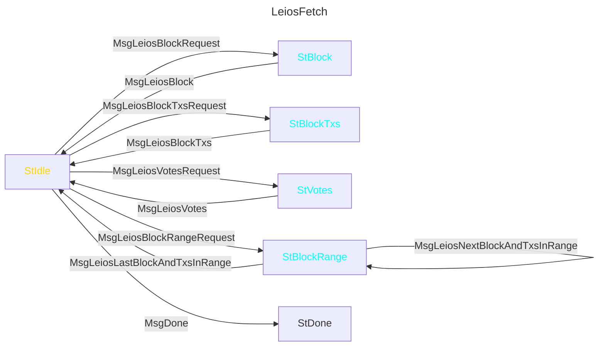
```mermaid
---
title: LeiosFetch
---
graph LR
   style StIdle color:gold;
   style StBlock color:cyan;
   style StBlockTxs color:cyan;
   style StVotes color:cyan;
   style StBlockRange color:cyan;

   StIdle -->|MsgLeiosBlockRequest| StBlock -->|MsgLeiosBlock| StIdle
   StIdle -->|MsgLeiosBlockTxsRequest| StBlockTxs -->|MsgLeiosBlockTxs| StIdle
   StIdle -->|MsgLeiosVotesRequest| StVotes -->|MsgLeiosVotes| StIdle
   StIdle -->|MsgLeiosBlockRangeRequest| StBlockRange -->|MsgLeiosNextBlockAndTxsInRange| StBlockRange -->|MsgLeiosLastBlockAndTxsInRange| StIdle

   StIdle -->|MsgDone| StDone
```

<em>Figure 7: LeiosFetch mini-protocol state machine</em>

</div>

The primary messages will carry information that is directly required by the
Leios description above: headers, blocks, transactions referenced by blocks, and
votes for blocks. However, some lower-level information must also be carried by
secondary messages, eg indicating when the peer is first able to send the block.

The required exchanges between two neighboring nodes is captured by the
following Information Exchange Requirements table (IER table). For the sake of
minimizing this proposal, each row is a mini-protocol message, but that
correspondence does not need to remain one-to-one as the mini-protocols evolve
over time.

<div align="center">
<a name="table-4" id="table-4"></a>

| Sender  | Name                            | Arguments                                                    | Semantics                                                                                                                                                                                                                             |
| ------- | ------------------------------- | ------------------------------------------------------------ | ------------------------------------------------------------------------------------------------------------------------------------------------------------------------------------------------------------------------------------- |
| Client→ | MsgLeiosNotificationRequestNext | $\emptyset$                                                  | Requests one Leios notifications, the announcement of an EB or delivery offers for blocks, transactions, and votes.                                                                                                                   |
| ←Server | MsgLeiosBlockAnnouncement       | RB header that announces an EB                               | The server has seen this EB announcement.                                                                                                                                                                                             |
| ←Server | MsgLeiosBlockOffer              | slot and Leios hash                                          | The server can immediately deliver this block.                                                                                                                                                                                        |
| ←Server | MsgLeiosBlockTxsOffer           | slot and Leios hash                                          | The server can immediately deliver any transaction referenced by this block.                                                                                                                                                          |
| ←Server | MsgLeiosVotesOffer              | list of slot and vote-issuer-id pairs                        | The server can immediately deliver votes with these identifiers.                                                                                                                                                                      |
| Client→ | MsgLeiosBlockRequest            | slot and Leios hash                                          | The server must now deliver this block.                                                                                                                                                                                               |
| ←Server | MsgLeiosBlock                   | EB block                                                     | The block from an earlier MsgLeiosBlockRequest.                                                                                                                                                                                       |
| Client→ | MsgLeiosBlockTxsRequest         | slot, Leios hash, and map from 16-bit index to 64-bit bitmap | The server must now deliver these transactions. The given bitmap identifies which of 64 contiguous transactions are requested, and the offset of the transaction corresponding to the bitmap's first bit is 64 times the given index. |
| ←Server | MsgLeiosBlockTxs                | list of transactions                                         | The transactions from an earlier MsgLeiosBlockTxsRequest.                                                                                                                                                                             |
| Client→ | MsgLeiosVotesRequest            | list of slot and vote-issuer-id                              | The server must now deliver these votes.                                                                                                                                                                                              |
| ←Server | MsgLeiosVoteDelivery            | list of votes                                                | The votes from an earlier MsgLeiosVotesRequest.                                                                                                                                                                                       |
| Client→ | MsgLeiosBlockRangeRequest       | two slots and two RB header hashes                           | The server must now deliver the EBs certified by the given range of RBs, in order.                                                                                                                                                    |
| ←Server | MsgLeiosNextBlockAndTxsInRange  | an EB and all of its transactions                            | The next certified block from an earlier MsgLeiosBlockRangeRequest.                                                                                                                                                                   |
| ←Server | MsgLeiosLastBlockAndTxsInRange  | an EB and all of its transactions                            | The last certified block from an earlier MsgLeiosBlockRangeRequest.                                                                                                                                                                   |

<em>Table 4: Leios Information Exchange Requirements table (IER table)</em>

</div>

This mini-protocol pair satisfies the above requirements in the following ways.

- These mini-protocols have less width than the LocalStateQuery mini-protocol
  and less depth than the TxSubmission mini-protocol. Thus, its structure is not
  prohibitively complicated, and e.g. per-state timeouts can be tuned
  analogously to existing protocols.
- ChainSync, BlockFetch, and TxSubmission are unchanged. Moreover, they can
  progress independently of the Leios mini-protocols because they are separate
  mini-protocols.
- Depending on how severely the node must prioritize Praos over Leios, the
  separation of their mini-protocols may simplify the prioritization mechanism.
  However, urgency inversion means that at least MsgLeiosBlockRangeRequest,
  MsgLeiosNextBlockAndTxsInRange, and MsgLeiosLastBlockAndTxsInRange may
  occasionally need to have the same priority as Praos. If it would benefit the
  prioritization implementation, those three messages could be isolated in a
  third Leios mini-protocol that has equal priorty as the Praos mini-protocols.
- LeiosNotify and LeiosFetch can also progress independently, because they are
  separate mini-protocols. A client can therefore receive notifications about
  new Leios data and when it could be fetched from this peer even while a large
  reply is arriving via LeiosFetch. This avoids unnecessary increases in the
  latency of Leios messages.
- The client can prioritize the youngest of outstanding offers from the peer
  when deciding which LeiosFetch request to send next, as freshest-first
  delivery requires.
- Because the client only has agency in one state, it can pipeline its requests
  for the sake of latency hiding.
- The client can request multiple transactions at once, which avoids wasting
  resources on overhead due to the potentially thousands of transactions
  exchanged per EB. (Most EBs' transactions will usually have already arrived
  via the Mempool, but the adversary can prevent that for their EBs.) The
  bitmap-based addressing scheme allows for compact requests for even thousands
  of transactions: a few hundred bytes of MsgLeiosBlockTxsRequest can request
  every transaction in even the largest EB, while a MsgLeiosBlockTxsRequest for
  a single transaction would old cost tens of bytes. Without a compact
  addressing scheme, a node that requires every transaction for some EB would
  essentially need to send a request that's the same size as the EB itself,
  which is large enough to be considered an unnecessary risk of increased
  latency.
- The client can request multiple votes at once, which avoids wasting resources
  on overhead due to the hundreds of votes exchanged per EB. Because the first
  vote in a bundle could have arrived sooner than the last vote in a bundle if
  it had not been bundled, maximal bundling risks unnecessary increases in
  latency. Some heuristic will balance the overhead decrease and latency
  increase, such as the client gradually stopps bundling its vote requests as
  its set of received votes approaches a quorum.
- The server can do the same when bundling vote offers, but it should be more
  conservative, in case the client is already closer to a quorum than it is.
- MsgLeiosBlockRangeRequest lets syncing nodes avoid wasting resources on
  overhead due to the (hopefully) high rate of EBs per RB. BlockFetch already
  bundles its RB requests when syncing, and this message lets LeiosFetch do the
  same. The starvation detection and avoidance mechanism used by Ouroboros
  Genesis's Devoted BlockFetch variant can be easily copied for
  MsgLeiosBlockRangeRequest if Ouroboros Genesis is enabled.
- Recall that the `certified_eb` bit enables the client to correctly predict the
  total payload size of the valid replies to a MsgLeiosBlockRangeRequest. This
  enables the client to manage its receive buffers, balance load across peers,
  etc.
- A server should disconnect if the client requests an EB (or its transactions)
  the server does not have. For young EBs, a client can avoid this by waiting
  for MsgLeiosBlockOffer (or MsgLeiosBlockTxsOffer) before sending a request.
  For old EBs, a ChainSync MsgRollForward for an RB that certifies its
  predecessor's EB would also imply the server has selected that EB, and so must
  be able to serve it. Whether additional restrictions would be useful is not
  yet clear. For example, it seems natural to restrict MsgLeiosBlockRequest and
  MsgLeiosBlockTxsRequest to young EBs (and perhaps also
  MsgLeiosBlockRangeRequest to old EBs), but it's not already clear what the
  benefit would be.
- If MsgLeiosBlockRequest and MsgLeiosBlockTxsRequest were restricted to young
  EBs, then MsgLeiosBlockRangeRequest would not only enable syncing nodes but
  also the unfortunate node that suffers from a $\Delta^\text{A}_\text{EB}$
  violation. The protocol design requires that that event is rare or at least
  confined to a small portion of honest stake at a time. But it will
  occasionally happen to some honest nodes, and they must be able to recover
  automatically and with minimal disruption.
- Every Leios object is associated with the slot of an EB, and so has an
  explicit age. This enables freshest-first delivery prioritization. In
  addition, votes of a certain age should no longer diffuse; they are no longer
  relevant once they are somewhat older than $L_\text{vote}$. Similarly, EBs
  above some age are no longer relevant unless they're on the historical chain.
  Because equivocation detection limits the amount of Leios traffic per Praos
  election and Praos elections have a stochastically low arrival rate, this
  memory bound is low enough to admit existing Cardano infrastructure.

The mini-protocol pair does not already address the following challenges, but
the corresponding enrichments - if necessary - would not contradict the
Tolerable Implementation Complexity requirement.

- Depending on how severely the node must prioritize younger Leios traffic over
  older, the mini-protocols' states might need to be less granular. Because
  distinct client requests transition to distinct cyan states, the server is
  unable to reply to the client's requests in a different order than the client
  sent them. If a client pipelined several requests and then learned of a new
  youngest EB and requested it, the server - if timing allows - could
  conceptually reply to that last request before the others, for the sake of
  freshest-first delivery. But it cannot do so if the mini-protocol's structure
  prevents those replies, as the existing granular states do. The existing
  support for pipelined requests within the Cardano mini-protocol infrastructure
  was only concerned about latency hiding, and so does not explicitly support
  server-side request reordering. It is already achievable with the existing
  infrastructure, but only by splitting the mini-protocol's requests and
  responses into different mini-protocols, which might be prohibitively
  obfuscated.
- With server-side reordering, LeiosFetch could also be free to interleave small
  replies to vote requests with large replies to block/transaction requests.
  Without it, however, the colocation of small replies and large replies in a
  single mini-protocol with granular states incurs head-of-line blocking. That
  risks occasionally increasing some key latencies, thereby threatening
  freshest-first delivery or even motivating inflations of $L_\text{vote}$
  and/or $L_\text{diff}$. One easy mitigation would run two instances of
  LeiosFetch and reserve one for requests that are small and urgent (e.g., small
  blocks, a few missing transactions, or perhaps any vote); the existing
  infrastructure would naturally interleave those with the larger and/or less
  urgent requests.

### Incentives

Leios does not require any changes to incentives in Cardano.

The current reward structure used on Cardano tracks the number of blocks created
by each SPO compared to the expected number of blocks they should have created.
It does not directly track the number of transactions in a block and empty
blocks count the same. The intent is to detect whether a party is offline or
not. Block producers are further incentivized to fill blocks with transactions,
for it increases fees flowing into the overall reward and thus their individual
rewards.

This indirect incentive to fill blocks holds the same with Leios, where
endorsing and voting would be equally incentivized by having more fee paying
transactions reach the ledger.

The current and unchanged specification of rewards is part of the
[ledger specification](https://intersectmbo.github.io/formal-ledger-specifications/site/Ledger.Conway.Specification.Rewards.html)
and more details on the
[design of incentives can be found here](https://github.com/intersectmbo/cardano-ledger/releases/latest/download/shelley-delegation.pdf#section.5).

#### Adaptive EB production

In time of low-traffic demand, the protocol will naturally incentivize usage of
RBs over EBs due to the lower inclusion latency. Only transactions which would
not fit into an RB (in terms of size or plutus budgets) would be processed
through Leios via an EB. When traffic levels can be adequately served by RBs
alone within both size and computational constraints, no EBs are announced,
reducing operational costs to Praos levels. This mechanism ensures that cost
structure scales with actual throughput demand rather than imposing fixed
overhead regardless of network utilization.

#### Hardware upgrade

The increased computational and bandwidth requirements for Leios operation are
offset by higher potential rewards from increased transaction throughput. As
demonstrated in the [operating costs analysis](#operating-costs), SPO
profitability improves significantly once sustained throughput exceeds 30-50
TPS, providing clear economic incentives for infrastructure upgrades.

## Rationale

Ouroboros Leios introduces a committee-based voting layer over Nakamoto-style
consensus to handle transaction surplus beyond current Praos block limits,
enabling substantial throughput increases while preserving existing security
properties.

### How Leios addresses CPS-18

The [Leios research paper][leios-paper] describes a highly concurrent protocol
with three block types - Input Blocks (IBs), Endorser Blocks (EBs), and Ranking
Blocks (RBs) - produced independently across decoupled, pipelined stages. This
specification simplifies that design by eliminating IBs and coupling EB
production with RB production, reducing complexity while preserving substantial
throughput gains.

This simplification avoids the complexity and ecosystem disruption of
implementing massive throughput increases immediately, while still delivering
substantial gains to address [CPS-18 Greater Transaction Throughput][cps-18]
challenges. Four strategic design priorities guided this approach:

1. [Economic sustainability](#economic-sustainability)
2. [Reasonable time to market](#time-to-market)
3. [Minimal downstream impact](#downstream-impact)
4. [Competitive positioning](#competitiveness)

<a name="economic-sustainability"></a>**1. Economic sustainability: Capacity
without utilization risk**

On one hand, this approach avoids over-engineering massive throughput capacity
without proven demand. Creating fundamental system changes to support multiple
orders of magnitude more throughput adds to the cost of running a more
expensive, more capable system that does not pay for itself until utilization
increases.

On the other hand, the minimum economic requirement establishes the lower bound.
As the Cardano Reserve diminishes, transaction fees must replace rewards to
maintain network security and SPO profitability. Currently, the Reserve
contributes more than 85% of epoch rewards, with less than 15% coming from
transaction fees. By 2029, to compensate for Reserve depletion, the network
requires approximately 36-50 TPS with average-sized transactions - roughly 10
times current mainnet throughput. This conservative lower bound represents the
breakeven point for running the protocol sustainably while maintaining the same
level of decentralization.

However, TPS is not an appropriate metric for defining these bounds. To properly
assess economic breakeven points, we measure throughput in Transaction Bytes per
second (TxB/s) rather than Transactions per second (TPS). TPS does not account
for transaction size or computational complexity, making systems with smaller
transactions appear "faster" while providing less utility. Current Cardano
mainnet provides 4,500 TxB/s, while this specification targets 140,000-300,000
TxB/s (equivalent to roughly 100-200 TPS) - a 30-65x increase sufficient for
economic sustainability.

<div align="center">
<a name="figure-8" id="figure-8"></a>
<p>
  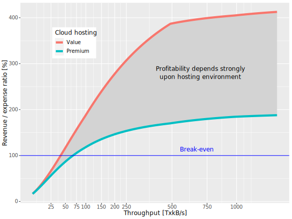
</p>

<em>Figure 8: SPO profitability forecast under Leios showing clear economic
benefits once sustained throughput exceeds 50-70 TxkB/s (36-50 TPS
equivalent)</em>

</div>

<a name="time-to-market"></a>**2. Reasonable time to market: Complexity
trade-offs**

The research protocol design is optimal in its usage of available network and
compute resources. However, it comes at the cost of significantly increased
inclusion latency and a high level of concurrency. Both of which are undesirable
in a real-world deployment onto the Cardano mainnet and need to be carefully
weighed against the throughput increase.

High concurrency allows for higher throughput by doing more transaction
processing at the same time. In the published design and otherwise discussed
variants concurrency is introduced by allowing agreement on sequences of
transactions independently of the Proas block production. This is the case for
when endorser blocks would be announced separately from Praos blocks or input
blocks be produced on a completely separate schedule. While such protocol
designs often result in higher latency due to more rounds, concurrency in itself
gives rise to the dedicated problem of _conflicting transactions_.

While some level of conflicting transactions and the network/compute waste
coming with it may be handled by the consensus protocol without giving
adversaries an edge, perpetually storing transactions that do not execute (only
one of multiple conflicting transactions can be applied), is a significant cost
factor. Techniques for minimizing conflicts arising through concurrent block
production like sharding, collateralization or sophisticated mempool
coordination have massive impacts on the ecosystem and could delay deployment by
years.

The proposed variant without concurrency and linearized processing, achieves
high enough throughput without changing transaction semantics, deterministic
ordering, and predictable finality patterns that existing dApps and
infrastructure depend on today.

<a name="downstream-impact"></a>**3. Minimal downstream impact: Ecosystem
preservation**

Beyond preserving transaction behavior, the design minimizes infrastructure and
operational disruption for the existing ecosystem. The proposed protocol still
functions as an overlay extending Praos - like the research paper version,
allowing SPOs to upgrade progressively without coordinated migrations.

The most obvious approach to increasing throughput while minimizing disruption
would be increasing Praos block sizes. However, this naive alternative would
create proportionally longer propagation times that violate Praos timing
assumptions and lack sufficient scalability for long-term viability.
Additionally, Praos blocks larger than approximately 3 MB would pose security
risks by increasing the frequency of short forks that adversaries could exploit
to compromise the common prefix property and enable attacks such as
double-spending. Nonetheless, improved Praos block times would be an improvement
also benefiting [Leios](#alternatives--extensions).

<a name="competitiveness"></a>**4. Competitive positioning**

The coupled block production design can be extended towards higher concurrency
models, as demonstrated in simulation results. It maintains compatibility with
more aggressive scaling approaches including full Leios variants, EB and IB
(input block) decoupling, and sharding extensions, ensuring current throughput
gains do not preclude 100x+ improvements when chain growth solutions mature and
once the ecosystem is ready to tackle the complexity coming with it.

<a name="optimal-tradeoffs"></a>**Conclusion**

This linearization proposal balances all four priorities. A delivered 30-65x
improvement provides substantially more value than the research paper's
higher-concurrency variants, which would impose major changes on the ecosystem
and take significantly longer to build.

The following evidence section shall provide quantitative support for these
trade-offs and validate the protocol's performance under realistic network
conditions.

### Evidence

This section provides protocol simulation results, feasible protocol parameters
with justifications, node-level simulation results, and operating cost analysis
that support the design decisions outlined in the rationale.

#### Performance Metrics

The performance of a protocol like Leios can be characterized in terms of its
efficient use of resources, its total use of resources, the probabilities of
negative outcomes due to the protocol's design, and the resilience to adverse
conditions. Metrics measuring such performance depend upon the selection of
protocol parameters, the network topology, and the submission of transactions.
The table below summarizes key metrics for evaluating Leios as a protocol and
individual scenarios (parameters, network, and load). Estimates for many of
these appear in the following section on Simulation Results. Additionally,
future implementations of Leios can be assessed in these terms.

<div align="center">
<a name="table-5" id="table-5"></a>

|  Category  | Metric                                             | Measurement                                                                                           |
| :--------: | -------------------------------------------------- | ----------------------------------------------------------------------------------------------------- |
| Efficiency | Spatial efficiency, $\epsilon_\text{spatial}$      | Ratio of total transactions size to persistent storage                                                |
|            | Temporal efficiency, $\epsilon_\text{temporal}(s)$ | Time to include transaction on ledger                                                                 |
|            | Network efficiency, $\epsilon_\text{network}$      | Ratio of total transaction size to node-averaged network usage                                        |
|  Protocol  | TX inclusion, $\tau_\text{inclusion}$              | Mean number of slots for a transaction being included in any EB                                       |
|            | Voting failure, $p_\text{noquorum}$                | Probability of sortition failure to elect sufficient voters for a quorum                              |
|  Resource  | Network egress, $q_\text{egress}$                  | Rate of bytes transmitted by a node                                                                   |
|            | Disk usage, $q_\text{disk}$                        | Rate of persistent bytes stored by a node                                                             |
|            | I/O operations, $\bar{q}_\text{iops}(b)$           | Mean number of I/O operations per second, where each operation writes a filesystem block of $b$ bytes |
|            | Mean CPU usage, $\bar{q}_\text{vcpu}$              | Mean virtual CPU cores used by a node                                                                 |
|            | Peak CPU usage, $\hat{q}_\text{vcpu}$              | Maximum virtual CPU cores used by a node over a one-slot window                                       |
| Resilience | Adversarial stake, $\eta_\text{adversary}(s)$      | Fractional loss in throughput due to adversial stake of $s$                                           |

<em>Table 5: Performance Metrics</em>

</div>

**_Spatial efficiency:_** Leios necessarily imposes some disk overhead beyond
the raw bytes needed to store transactions themselves. This overhead includes
the EBs and RBs associated with storing transactions. The spatial efficiency
metric is defined as the ratio of the total bytes of transactions included in
the ledger to the total persistent storage required by the protocol.

$$
\epsilon_\text{spatial} = \frac{\text{total bytes of transactions included in the ledger}}{\text{total bytes of EBs and RBs}}
$$

**_Temporal efficiency:_** As is true for Praos, there is a delay between
submitting a transaction and its being included in the ledger and there is a
finite chance that it never is included in the ledger. Before a transaction is
endorsed, it must be validated and placed in the memory pool. It is cleanest to
measure the time from the transaction reaching the local memory pool of the node
where it was submitted to the time when it is included in the ledger, via a
Praos block. The same metric applies both to Praos and to Leios. In aggregate,
we measure the temporal efficiency as the fraction of transactions that reach
the ledger, as function of the number of slots elapsed. The quantity
$\epsilon_\text{temporal}(\infty)$ is the fraction of submitted transactions
that ever reach the ledger.

$$
\epsilon_\text{temporal}(s) = \text{fraction of transactions included in the ledger within } s \text{ slots of their inclusion in a local memory pool}
$$

**_Network efficiency:_** Effective utilization of the network can be
characterized by the ratio of bytes of transactions reaching the ledger to the
average network traffic per node. (This could also be computed individually for
each node and used as a local metric.)

$$
\epsilon_\text{network} = \frac{(\text{bytes of valid transactions reaching the ledger}) \cdot (\text{number of nodes in the network})}{\text{total bytes of network traffic}}
$$

**_TX inclusion:_** In Leios, it is possible that a transaction might have to
wait for multiple EB production opportunities before being included in an EB.
The characteristic time for such inclusion in an EB depends on the EB production
rate and mempool management. This is correlated with how long the transaction
waits in the memory pool before being selected for inclusion.

$$
\tau_\text{inclusion} = \text{mean number of slots for a transaction to be included in any EB}
$$

**_Voting failure:_** An unlucky set of VRF evaluations might result in
insufficient voters being selected in a given pipeline, thus making it
impossible to certify an EB in that pipeline.

$$
p_\text{noquorum} = \text{probability of sufficient voters to achieve a quorum in a given pipeline}
$$

**_Network egress:_** Cloud service providers typically charge for network
egress rather than for network ingress. The quantity $q_\text{egress}$ is the
number of bytes sent from a node per unit time.

**_Disk usage:_** Leios requires that EBs and RBs be stored permanently; votes
need not be stored permanently, however. The quantity $q_\text{disk}$ is the
total number of EB and RB bytes generated per unit time.

**_I/O operations:_** Some cloud service providers limit or bill input/output
operations on a per-second capacity basis. The number of I/O operations depends
upon the filesystem's block size $b$, not on the logical number of writes to
disk by the protocol: e.g., writing an EB of 32,768 bytes might consist of 64
I/O operations on a filesystem having a 512-byte block size. We assume that disk
caching and delayed writes smooth out the unevenness in I/O operations, so that
the mean $\bar{q}_\text{iops}$ is the best metric here.

**_Mean CPU usage:_** Computation resources consumed by the number are
quantified as $\bar{q}_\text{vcpu}$, which is the mean number of virtual CPU
cores utilized by the protocol.

**_Peak CPU usage:_** Because CPU usage varies depending upon the node's
activity, the maximum number of virtual CPU cores utilized by the protocol
during any slot, $\hat{q}_\text{vcpu}$, provides a useful indication of
computational burstiness and of how a virtual machine should be sized for Leios.

**_Adversarial stake:_** Similarly, when adversarial stake is appreciable and
active, the throughput of Leios might be drop.

$$
\eta_\text{adversary}(s) = \frac{\text{bytes of transactions reaching the ledger without adversarial activity}}{\text{bytes of transactions reaching the ledger with adversarial activity given fraction } s \text{ of the total stake}}
$$

#### Simulation Results

The [Leios paper][leios-paper] provides a rigorous theoretical analysis of the
safety and throughput of the protocol. That has been reinforced and demonstrated
by prototype simulations written in Haskell and Rust.

The simulation results use a [mainnet-like topology][mainnet-topology] that
accurately reflects the characteristics of the Cardano mainnet. This includes a
realistic distribution of stake and a representative number of stake pools. The
network is designed with a total of 10,000 nodes
[pseudo-mainnet][pseudo-mainnet] or 750 nodes [mini-mainnet][mini-mainnet],
where each block producer is connected exclusively to two dedicated relays.
Furthermore, the topology incorporates realistic latencies based on the [RIPE
Atlas][ripe-atlas] ping dataset and bandwidth that aligns with the lower end of
what is typically found in cloud data centers. The node connectivity and
geographic distribution (across various countries and autonomous systems) are
also consistent with real-world measurements. [A simulation
study][topology-comparison] has demonstrated that analysis conclusions deriving
from the `mini-mainnet` topology are also valid for the `pseudo-mainnet`
topology; the advantage of using the former is that simulations run much more
quickly. Simulated RB diffusion is consistent with the Praos performance
model.[^praosp]

[^mnrm]:
    [Mainnet-like topologies for Leios](https://github.com/input-output-hk/ouroboros-leios/blob/6d8619c53cc619a25b52eac184e7f1ff3c31b597/data/simulation/pseudo-mainnet/ReadMe.md)

[^pseudo]:
    [Leios pseudo-mainnet topology](https://github.com/input-output-hk/ouroboros-leios/blob/6d8619c53cc619a25b52eac184e7f1ff3c31b597/data/simulation/pseudo-mainnet/topology-v1.md)

[^mini]:
    [Leios mini-mainnet topology](https://github.com/input-output-hk/ouroboros-leios/blob/6d8619c53cc619a25b52eac184e7f1ff3c31b597/data/simulation/pseudo-mainnet/topology-v2.md)

[^ripe]: [RIPE Atlas](https://atlas.ripe.net/)

[^mncp]:
    https://github.com/input-output-hk/ouroboros-leios/blob/6d8619c53cc619a25b52eac184e7f1ff3c31b597/analysis/sims/2025w30b/analysis.ipynb

[^praosp]:
    https://github.com/IntersectMBO/cardano-formal-specifications/blob/6d4e5cfc224a24972162e39a6017c273cea45321/src/performance/README.md

The simulation results in the remainder of this section use the Rust simulator
with a set of protocol parameters suitable for running Leios at 200 kB/s of
transactions, which corresponds to approximately 150 tx/s of transactions of
sizes typical on the Cardano mainnet. The maximum size of transactions
referenced by an EB is 12 MB and the stage lengths are
$3 \times L_\text{hdr} = 3$, $L_\text{vote} = 4$, and
$L_\text{diff} = 7 \text{ slots}$. In order to illustrate the minimal
infrastructure resources used by Leios at these throughputs, we have limited
nodes to 4 virtual CPUs each and limited inter-node bandwidth to 10 Mb/s. We
vary the throughput to illustrate the protocol's behavior in light vs congested
transaction loads, and inject transaction from the 60th through 960th slots of
the simulation; the simulation continues until the 1500th slot, so that the
effects of clearing the memory pool are apparent. The table below summarizes the
results of the simulation experiment. We see that a transaction at the front of
the memory pool can become referenced by an EB in as few as 20 seconds when the
system is lightly or moderately loaded and that it can reach certification on
the ledger in about one minute. These times can double under congested
conditions. In all cases there is little overhead, relative to the total bytes
of transactions, in data that must be stored permanently as the ledger history.

<div align="center">
<a name="table-6" id="table-6"></a>

| Throughput [TxMB/s] | TPS at 1500 B/tx | Conditions      | Mempool to EB [s] | Mempool to ledger [s] | Space efficiency [%] |
| ------------------: | ---------------: | --------------- | ----------------: | --------------------: | -------------------: |
|               0.100 |             66.7 | light load      |              19.6 |                  48.0 |                 94.2 |
|               0.150 |            100.0 | moderate load   |              21.6 |                  51.2 |                 96.3 |
|               0.200 |            142.9 | heavy load      |              31.3 |                  57.7 |                 96.4 |
|               0.250 |            166.7 | some congestion |              51.6 |                  81.9 |                 96.6 |
|               0.300 |            200.0 | much congestion |             146.6 |                 173.2 |                 97.2 |

<em>Table 6: Leios effficiency at different throughputs</em>

</div>

The first plot below demonstrates that most transactions reach the ledger in
under two minutes in these simulations when the system is not congested. This
transaction lifecycle time lengthens as congestion increases. The plot colors
transactions by the minute when they were submitted so that one can see that the
distribution of delays is independent of the submission time in the uncongested
cases, but that there are "lucky" or "unlucky" periods in the congested cases.
The variability arises from the randomness of the RB production scheduled.
First, a transaction may has to wait for an RB to be forged; second, a
transaction referenced by an EB has to wait for the following RB to be forged.
The EB is discarded, however, if the second RB is produced in fewer than
$3 \times L_\text{hdr} + L_\text{vote} + L_\text{diff}$ slots after the first
RB. Thus, both the time to the next RB and the RB following that introduce
unpredictability in a transaction reaching the ledger under even lightly loaded
conditions. When the sortition happens to produce RBs too close together,
transactions will accumulate in the memory pool, awaiting favorable sortition
conditions. If too many accumulate, there is not room for all of them to be
included in the next EB. The second plot below illustrates that all transactions
eventually do arrive on the ledger, but that they may have to wait long during
congestion. During light load a transaction takes one or two minutes to reach
the ledger, but in heavier load it might take three minutes or even longer. The
capacity parameter $S_\text{EB-tx}$ (12 MB/EB in these simulations)
fundamentally limits the amortized maximum throughput of Leios: furthermore, it
affects how long it takes transactions to reach the ledger as the throughput
approaches the capacity.

<div align="center">
<a name="figure-9" id="figure-9"></a>

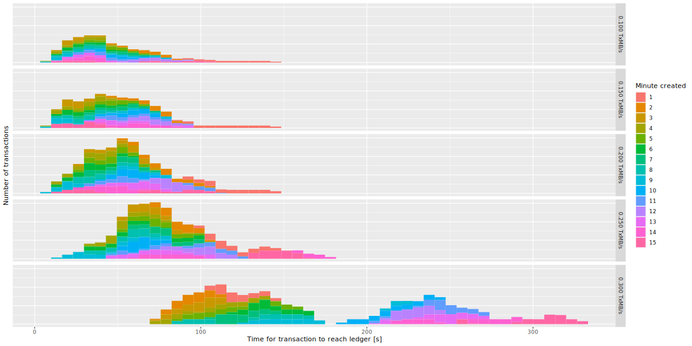

<em>Figure 9: Time for transaction to reach the ledger</em>

</div>

<div align="center">
<a name="figure-10" id="figure-10"></a>

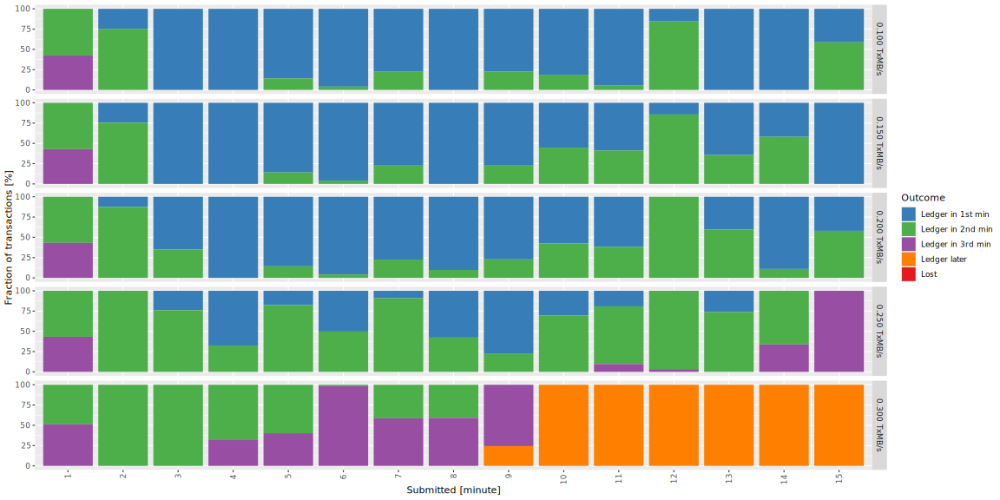

<em>Figure 10: Transactions reaching the ledger</em>

</div>

The effect of EBs being discarded when RBs are too close together is evidenced
in the following plot. A transaction referenced only once by an EB is one that
reaches the ledger on the first attempt. If a transaction is referenced by more
than one EB, it means that several attempts were made to before a relevant EB's
certificate was included in an RB. The subsequent plot shows Leios's irregular
rhythm of forging, sometimes discarding, and certifying EB. (Note that RBs are
so small relative to most EBs that they are difficult to see in the histogram.)
The diagram also provides a sense of the intermittency of successful
certification and the presence of periods of unfavorable sortition where RBs are
not produced or are produced too close together. The same phenomenon occurs in
Praos, but Leios amplifies the intermittency.

<div align="center">
<a name="figure-11" id="figure-11"></a>

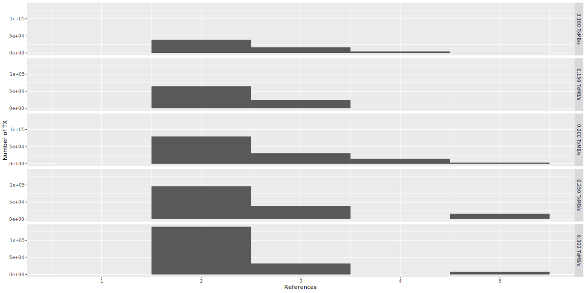

<em>Figure 11: Number of TX references</em>

</div>

<div align="center">
<a name="figure-12" id="figure-12"></a>

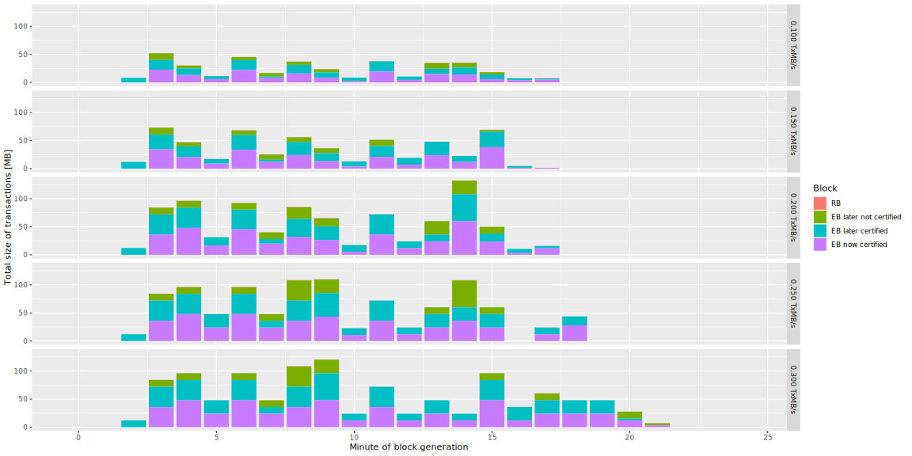

<em>Figure 12: Disposition of transactions in blocks (RBs are so small as not to
be visible in the histograms. When an EB is generated, it is labeled in the plot
as to whether it will eventually be certified ("EB later certified") or not ("EB
later not certified"). When the certificate is included in an RB, the EB is
labeled "EB now certified".)</em>

</div>

When demand is not high relative to capacity, the total size of transactions
referenced by an EB varies randomly and rarely reaches the maximum size of 12
MB/EB: see the following figure. One can see that at higher demands fully
utilized blocks predominate. The presence of those full blocks means that other
transactions are waiting in the memory pool for referencing by a subsequent EB.
Thus the capacity parameter provides a natural form of backpressure that limits
the potential EB-related work a node must do when demand is high.

<div align="center">
<a name="figure-13" id="figure-13"></a>

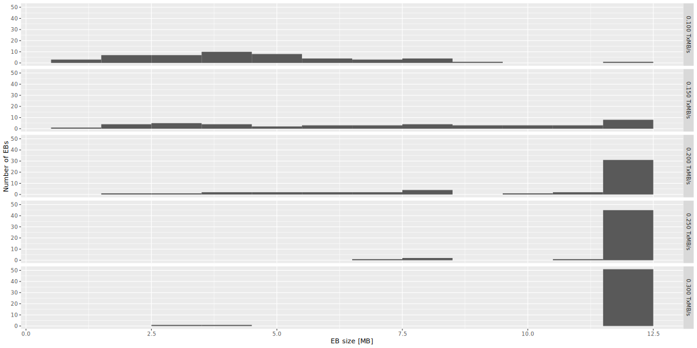

<em>Figure 13: Size of transactions referenced by EBs</em>

</div>

Because of the aforementioned backpressure, diffusion occurs in Leios in an
orderly manner even when demand is high. The following set of plots show
histograms of diffusion time (i.e., the time from a transaction's, RB's, EB's,
or vote's creation to its reaching the nodes in the network). Transactions and
votes typically diffuse rapidly throughout the whole network in fractions of a
second, due to their small sizes, often small enough to fit in a single TCP
transmission unit. RBs diffuse in approximately one second, with the empty RBs
at the start and end of the simulation diffusing fastest. Similarly, EBs diffuse
fast when empty or when demand is low, but once full EBs are diffusing, it can
take up to two seconds for them to diffuse. All of the distributions have long
tails where messages arrive much later for nodes with unfavorably topological
locations. The Leios protocol possesses the important property that traffic in
transactions, RBs, votes, and EBs do not interfere with one another: for
example, delays in EBs and high throughput do not also delay RBs in those cases.

<div align="center">
<a name="figure-14" id="figure-14"></a>

|                                                 |                                                 |
| ----------------------------------------------- | ----------------------------------------------- |
| 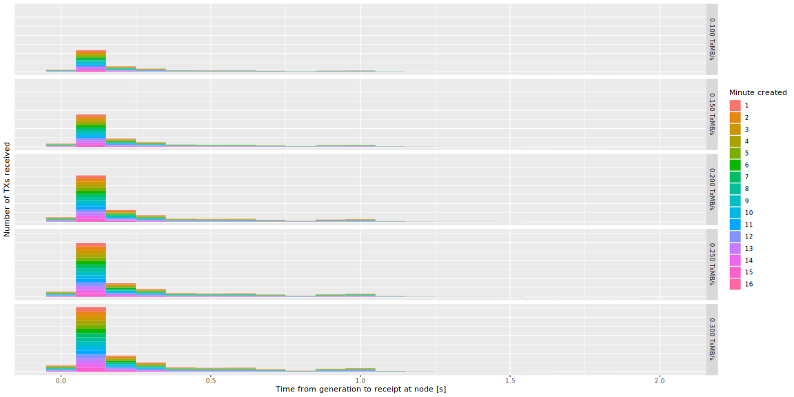 | 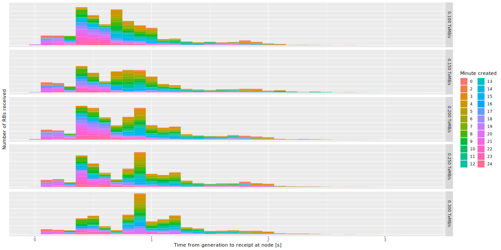 |
| 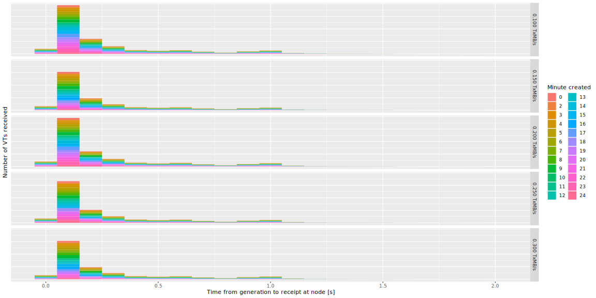 | 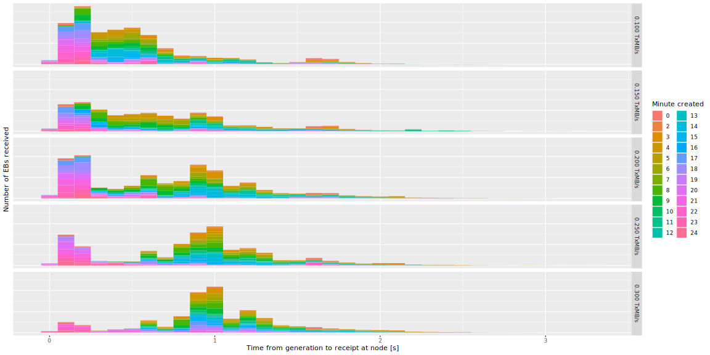 |

<em>Figure 14: Arrival delays for transactions ("TX", upper left), ranking
blocks ("RB", upper right), votes ("VT", lower left), and endorser blocks ("EB",
lower right)</em>

</div>

<a name="resource-requirements"></a>**Resource requirements**

The resource requirements for operating Leios nodes have been estimated from
benchmarking and simulation studies. The assumed values for various Leios
operations come either from measurements of the [cryptography
prototype][leioscrypto], from the IOG benchmarking cluster for the Cardano node,
or analysis of the Cardano mainnet ledger using the `db-analyser` tool. These
were input to the Haskell and Rust simulators for Leios to make holistic
estimates of resource usage of operating nodes.

In terms of resource usage, the throughputs in these simulations do no stress
the four virtual CPUs of each node or saturate the 10 Mb/s available bandwidth
between nodes. The figures below show that bandwidth usage does not exceed 4
Mb/s and that most of that is consumed by diffusion of transactions among the
nodes. Furthermore, vCPU usage stays below 100% (i.e., the equivalent of one
vCPU operating fully), though it is very bursty because of the uneven workload
of cryptographic and ledger operations. The last figure quantifies how
transaction and EB body validation dominate CPU usage. Averaged over time, CPU
usage is low: there may be opportunities in the implementation of the Leios node
for lazy computations, caching, etc. that will spread out the occasional spikes
in CPU usage over time.

<div align="center">
<a name="figure-15" id="figure-15"></a>

|                                                        |                                                                  |
| ------------------------------------------------------ | ---------------------------------------------------------------- |
|  | 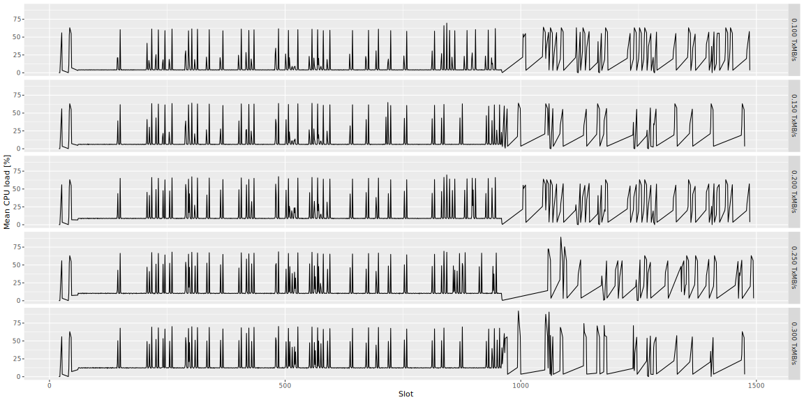 |

<em>Figure 15: Mean nodal ingress (left) and Mean CPU load among all nodes
(right)</em>

</div>

<div align="center">
<a name="figure-16" id="figure-16"></a>

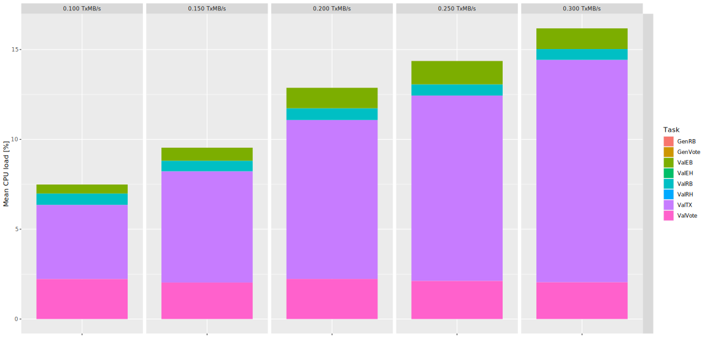

<em>Figure 16: Mean CPU load among all nodes ("Gen" = generated, "Val" =
validated, "RH" = ranking block header, "RB" = ranking block body, "EH" =
endorser block header, "EB" = endorser block body", "TX" = transaction)</em>

</div>

Note that the transaction workload in the simulations above was modeled upon the
_average_ amount of Plutus computation typical of the Cardano mainnet. The low
time-averaged CPU usage in the simulations (i.e., less than 15% of a vCPU)
suggests that the per-transaction and/or per-block Plutus budget could be
significantly increased under Leios: either every transaction could have a
modestly higher budget, or some transactions could use an order of magnitude
more Plutus execution units. Statistical analysis of [CPU usage in ledger
operations][timings] using the [db-analyser tool][dbanalyser] on Cardano mainnet
from epoch 350 through 573 yields the following simple models of the CPU cost of
validating signatures and executing Plutus in the transactions of a block.
Because of the noisiness in the raw mainnet data, these estimates are uncertain.

- Ledger "apply" operation, consisting of phase 1 & 2 validation along with
  updating the current ledger state:
  - CPU per transaction in a block: `620.1 μs/tx`.
  - Linear model that accounts for Plutus:
    `(262.4 μs/tx) * (number of transactions) + (948.7 μs/Gstep) * (billions of Plutus execution steps)`.
- Ledger "reapply" operation, consisting of updating the current ledger state,
  omitting previously performed phase 1 & 2 validation:
  - Linear model: `(353.9 μs) + (21.51 μs/kB) * (size of the block)`
  - Linear model that accounts for Plutus:
    `(347.8 μs) + (19.43 μs/kB) * (size of the block) + (21.27 μs/Gstep) * (billions of Plutus execution steps)`

The Leios simulators perform the "apply" operation when a transaction is first
seen, either when it is received for the memory pool or when it is fetched after
first being seen in an RB or EB; they perform the "reapply" operation when a
block is being generated or validated. A more nuanced model of CPU usage in the
simulators would account for Plutus execution explicitly, but the linear models
described above are used to account for Plutus workloads implicitly. The
following plot of simulation results limit each node to 4 vCPU cores and suggest
that workloads of 20,000e9 Plutus execution steps per EB may be feasible: this
is 1000 times the current Cardano mainnet limit of 20e9 steps for Praos blocks.
The subsequent plot shows the 4 vCPUs becoming progressively more saturated with
heavier Plutus execution. Although these results suggest that Leios's
_block-level_ Plutus budget can safely be 5000 billion steps or more, it is
important to remember that this is for conditions where honest nodes faithfully
and promptly diffuse the transactions requiring the relatively expensive phase 2
(Plutus) validation: adversarial nodes could attempt to delay diffusion of
transactions in order to overwhelm honest nodes with the sudden arrival of many
heavy Plutus transactions and little time to validate them all before voting
upon the newly seen EB. Experiments with prototype Leios nodes will be necessary
to more precisely quantify how much the Plutus budget could safely be increased.

<div align="center">
<a name="figure-17" id="figure-17"></a>

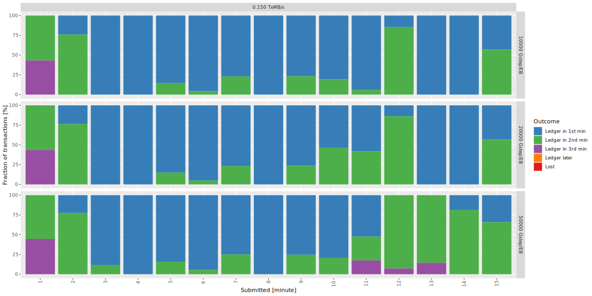

<em>Figure 17: Fate of Plutus-heavy transactions in Leios</em>

</div>

<div align="center">
<a name="figure-18" id="figure-18"></a>

|                                                                                             |                                                                                             |
| ------------------------------------------------------------------------------------------- | ------------------------------------------------------------------------------------------- |
| 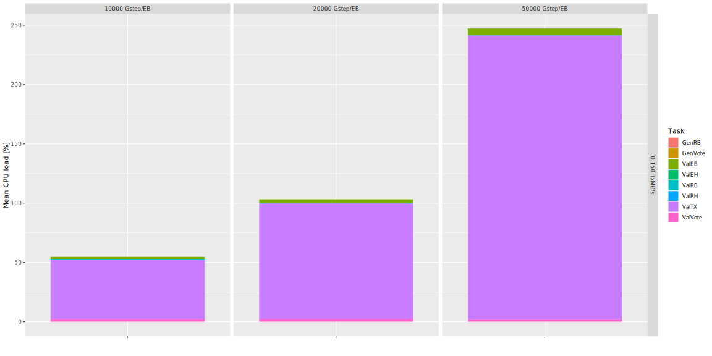 | 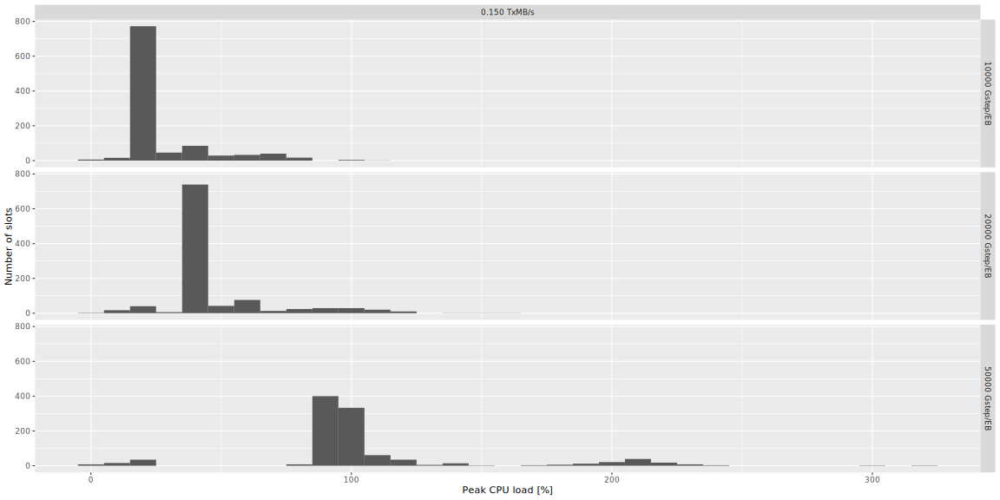 |

<em>Figure 18: CPU usage in Plutus-heavy workloads for Leios</em>

</div>

In summary, Leios will require a modest increase of the [recommended hardware
requirements][spohw]: a four-core machine will be required, but a network
upgrade will not be needed, as 10 Mb/s is well below the bandwidth of standard
network connections. At throughput much higher than 200 kB/s, network egress can
become a significant cost for nodes hosted on some cloud-computing providers.
The Leios simulations do not model memory or disk. With the advent of
[UTxO-HD][utxohd], 16 GB of memory will remain be sufficient for Leios if the
`OnDisk` option is used for the UTxO set. Disk requirements depend upon the
growth of the ledger, but a sustained 0.150 MB/s throughput amounts to ledger
size increasing by 4.7 TB each year: see the section below on Operating Costs
for further discussion.

### Feasible Protocol Parameters

**Parameter Relationships and Network Assumptions**

The key relation in the proposed protocol is between the voting threshold
($\tau = 75\%$) and propagation delay of EBs ($\Delta_\text{EB}$). The high
voting threshold ensures that any certified EB is already known to at least 25%
of honest nodes by the end of $L_\text{vote}$, even assuming 50% adversarial
stake. This widespread initial knowledge enables the critical network
assumption: an EB evidently known to >25% of the network will reach the
remaining (online) honest stake within $L_\text{diff}$ and $\Delta_\text{RB}$,
so to not impact blockchain safety and liveness.

**Example Parameter Calculation**

To illustrate how these relationships translate into concrete parameters,
consider the following example based on simulated network measurements:

**Given Network Characteristics:**

- $\Delta_\text{hdr} = 1$ slot, $\Delta_\text{RB} = 5$ slots (Cardano Mainnet
  assumption for Praos security)
- $\Delta_\text{EB}^{\text{O}} = 7$ slots (EB diffusion: transmission +
  processing), $\Delta_\text{EB}^{\text{W}} = 15$ slots (EB transmission time
  for certified EBs)
- $\Delta_\text{reapply} = 1$ slot (EB reapplication time)

**Timing Parameter Calibration:**

- $L_\text{hdr} = 1$ slot: Header diffusion period, where equivocation detection
  period is $3 \times L_\text{hdr} = 3$ slots (per
  [equivocation detection](#equivocation-detection))
- $L_\text{vote} = 4$ slots: Since voting begins after $3 \times L_\text{hdr}$,
  and EB propagation can occur during equivocation detection, nodes only need 4
  additional slots after $3 \times L_\text{hdr}$ for validation plus margin (per
  [voting period](#voting-period))
- $L_\text{diff} = 7$ slots: Using the [diffusion period](#diffusion-period)
  constraint with typical values gives minimum of 4 slots, we use 7 for safety
  margin
- **Total certificate inclusion delay:**
  $3 \times L_\text{hdr} + L_\text{vote} + L_\text{diff} = 3 + 4 + 7 = 14$ slots

**Simulation-Tested Parameters**

The table below documents protocol parameters that provided high throughput and
reasonably fast settlement in prototype Haskell and Rust simulations. The exact
choice of parameters for Cardano mainnet must be subject to discussion and
consideration of tradeoffs.

<div align="center">
<a name="table-7" id="table-7"></a>

| Parameter                                     |      Symbol      |   Feasible value   | Justification                                                                                                                                                                          |
| --------------------------------------------- | :--------------: | :----------------: | -------------------------------------------------------------------------------------------------------------------------------------------------------------------------------------- |
| Header diffusion period length                |  $L_\text{hdr}$  |       1 slot       | Per [equivocation detection](#equivocation-detection): accommodates header propagation for equivocation detection. Equivocation detection period is $3 \times L_\text{hdr}$.           |
| Voting period length                          | $L_\text{vote}$  |      4 slots       | Per [voting period](#voting-period): accommodates EB propagation and validation time, with equivocation detection handled separately by $3 \times L_\text{hdr}$.                       |
| Diffusion period length                       | $L_\text{diff}$  |      7 slots       | Per [diffusion period](#diffusion-period): minimum calculated as 4 slots with typical network values, use 7 for safety margin.                                                         |
| Endorser-block referenceable transaction size | $S_\text{EB-tx}$ |       12 MB        | Simulations indicate that 200 kB/s throughput is feasible at this block size.                                                                                                          |
| Endorser block max size                       |  $S_\text{EB}$   |       512 kB       | Endorser blocks must be small enough to diffuse and be validated within the voting period $L_\text{vote}$.                                                                             |
| Maximum Plutus steps per endorser block       |        -         |  2000G step units  | Simulations at high transaction-validation CPU usage, but an even higher limit may be possible.                                                                                        |
| Maximum Plutus memory per endorser block      |        -         | 7000M memory units | Simulations at high transaction-validation CPU usage, but an even higher limit may be possible.                                                                                        |
| Maximum Plutus steps per transaction          |        -         |  100G step units   | Raise per-transaction limit by a factor of twenty relative to Praos.                                                                                                                   |
| Maximum Plutus memory per transaction         |        -         | 350M memory units  | Raise per-transaction limit by a factor of twenty relative to Praos.                                                                                                                   |
| Ranking block max size                        |  $S_\text{RB}$   |    90,112 bytes    | This is the current value on the Cardano mainnet.                                                                                                                                      |
| Mean committee size                           |       $n$        |   600 stakepools   | Modeling of the proposed certificate scheme indicates that certificates reach their minimum size of ~8 kB at this committee size, given a realistic distribution of stake among pools. |
| Quorum size                                   |      $\tau$      |        75%         | High threshold ensures certified EBs are known to >25% of honest nodes even with 50% adversarial stake. This enables the network assumption for safe diffusion within L_diff.          |

<em>Table 7: Feasible Protocol Parameters</em>

</div>

This design trades a slightly longer total certification time (typically 13-15
slots) for significant protocol simplification by eliminating complex correction
mechanisms and ensuring all RB transactions are always valid.

Simulations on mainnet-like topologies indicate that seven slots is more than
sufficient to diffuse the transactions, blocks, and votes required by Leios.
Most nodes receive these in one second or less and even the tardiest nodes
receive them in under two seconds. The additional diffusion period provides
ample margin for worst-case scenarios while maintaining acceptable latency.
Higher-fidelity simulators, better empirical data on mainnet performance, and
Leios testnet operations will test the appropriateness of these parameters and
refine their values for final recommendations.

The aforementioned simulations also demonstrate that Leios operates up to 0.2
TxMB/s without experiencing congestion, provided endorser blocks reference no
more than 12 MB of transactions. Even under adversarial conditions, where
malicious nodes release transactions from their private memory pool at the same
time that they forge a ranking block and an endorser block, simulations
demonstrate that 12 MB of transactions diffuse rapidly enough for the protocol
to operate smoothly, achieving a quorum of votes before the voting period ends.
It is important to limit the number of transactions referenced by an endorser
block because the transaction-execution bitmap in a subsequent ranking block may
have to record information about conflicted transactions. A limit of 512 kB on
the size of the endorser block itself ensures fast diffusion and limits its
contents to 16,000 transactions, since each transaction hash is 32 bytes. That
limit keeps the size of the bitmap in the few-kilobyte range, ensuring that it
easily fits in the ranking block. The combination of 12 MB of transaction data
and 16,000 transactions implies an average transaction size of 2000 bytes when
both limits are reached: this is higher than the recent average transaction size
on Cardano mainnet.

Estimating the feasible limits for Plutus execution requires a more solid
grounding, than currently exists, of the Plutus cost model in terms of actual
CPU resources required to execute Plutus steps and memory. The empirical
analysis and simulations presented above suggest the the per-block Plutus budget
could be substantially increased. Results indicate that 2000 billion Plutus
steps would consume less than two CPU-seconds of computation on typical node
hardware. On a four-core machine there would be sufficient resources to evaluate
the Plutus rapidly enough so as not to interfere with voting for endorser
blocks. As in Praos, that block-level budget could be allocated to transactions
in such a manner that several Plutus-heavy transaction fit in a single endorser
block. Limiting a transaction to 100 billion steps, for instance, would allow 20
such transactions in each endorser block. For reference, this is ten times the
recent Praos limit on transaction execution steps. The per-transaction limit can
be adjusted to suit the needs of the community: i.e., it could be tuned to favor
many light Plutus transactions vs a few heavy Plutus transactions.

Although the Praos maximum block size could be modestly raised in Leios and the
active-slot coefficient adjusted slightly, there is no compelling reason to
alter these. They could, however, be re-evaluated in the context of the Leios
testnet.

The analysis [Committee size and quorum requirement][committee-size-analysis] in
the first Leios Technical Report indicates that the Leios committee size should
be no smaller than 500 votes and the quorum should be at least 60% of those
votes. However, the proposed [Fait Accompli][fait-accompli-sortition] scheme
wFA<sup>LS</sup> achieves compact certificates that do not become larger as the
number of voters increases, so larger committee sizes might be permitted for
broader SPO participation and higher security. The committee size should be
large enough that fluctuations in committee membership do not create an
appreciable probability of an adversarial quorum when the adversarial stake is
just under 50%. The quorum size should be kept large enough above 50% so that
those same fluctuations do not prevent an honest quorum. Larger committees
require more network traffic, of course.

<a name="operating-costs"></a>**Operating costs**

Approximate Leios operating costs are estimated based on the detailed cost
analysis of Leios deployment in [Leios node operating costs][cost-estimate], the
simulation results, and the hardware recommendation for Leios. However, these
costs depend on the specific choice of cloud provider hardware and the current
market conditions. The estimates below were made in April 2025 for the median
pricing of ten common hyperscale and discount cloud providers. The cost of a
10,000-node Leios network can be computed from the cost per node. Storage costs
increase each month as the ledger becomes larger.

<div align="center">
<a name="table-8" id="table-8"></a>

| Throughput | Average-size transactions | Small transactions | Per-node operation | Per-node storage | 10k-node network<br/>(first year) | 10k-node network<br/>(first year) |
| ---------: | ------------------------: | -----------------: | -----------------: | ---------------: | --------------------------------: | --------------------------------: |
| 100 TxkB/s |                   67 Tx/s |           333 Tx/s |      $112.99/month |    $17.85/month² |                            $14.6M |                       $200k/epoch |
| 150 TxkB/s |                  100 Tx/s |           500 Tx/s |      $119.51/month |    $26.80/month² |                            $15.9M |                       $218k/epoch |
| 200 TxkB/s |                  133 Tx/s |           667 Tx/s |      $128.35/month |    $38.35/month² |                            $17.7M |                       $242k/epoch |
| 250 TxkB/s |                  167 Tx/s |           833 Tx/s |      $133.07/month |    $44.61/month² |                            $18.6M |                       $255k/epoch |
| 300 TxkB/s |                  200 Tx/s |          1000 Tx/s |      $139.18/month |    $53.20/month² |                            $19.9M |                       $272k/epoch |

<em>Table 8: Operating Costs by Transaction Throughput</em>

</div>

_Required TPS for Infrastructure Cost Coverage:_ Using average transaction sizes
and fees, we can calculate the required TPS to generate enough fees to cover
infrastructure costs. Not that only about 20% of fees currently accrue to SPOs,
but the table assumes 100% would accrue to them: to maintain the current 80%-20%
split, fives times as much fee would have to be collected compared to what is
listed in the table.

<div align="center">
<a name="table-9" id="table-9"></a>

| Infrastructure cost | Required ada<br/>@ $0.45/ADA | Required transactions<br/>(average size)<br/>@ $0.45/ADA | Required transactions<br/>(small size)<br/>@ $0.45/ADA |
| ------------------: | ---------------------------: | -------------------------------------------------------: | -----------------------------------------------------: |
|         $14.6M/year |               444k ADA/epoch |                                                4.75 Tx/s |                                              6.19 Tx/s |
|         $15.9M/year |               485k ADA/epoch |                                                5.17 Tx/s |                                              6.75 Tx/s |
|         $17.7M/year |               537k ADA/epoch |                                                5.74 Tx/s |                                              7.49 Tx/s |
|         $18.6M/year |               566k ADA/epoch |                                                6.05 Tx/s |                                              7.89 Tx/s |
|         $19.9M/year |               605k ADA/epoch |                                                6.45 Tx/s |                                              8.42 Tx/s |

<em>Table 9: Required TPS for Infrastructure Cost Coverage</em>

</div>

_Required TPS for Current Reward Maintenance:_ To maintain current reward levels
(~48 million ADA monthly) through transaction fees as the Reserve depletes.

<div align="center">
<a name="table-10" id="table-10"></a>

| Year | Reserve Depletion | Rewards from Fees (ADA) | Required TPS (Average size) | Required Throughput |
| ---: | ----------------: | ----------------------: | --------------------------: | ------------------: |
| 2025 |               ~0% |                       0 |                           0 |            0 TxkB/s |
| 2026 |              ~13% |               6,240,000 |                        10.9 |           15 TxkB/s |
| 2027 |              ~24% |              11,520,000 |                        20.1 |           28 TxkB/s |
| 2028 |              ~34% |              16,320,000 |                        28.5 |           40 TxkB/s |
| 2029 |              ~43% |              20,640,000 |                        36.1 |           51 TxkB/s |
| 2030 |              ~50% |              24,000,000 |                        41.9 |           59 TxkB/s |

<em>Table 10: Required TPS for Current Reward Maintenance</em>

</div>

Note that by 2029, to compensate for Reserve depletion, the network would need
to process approximately 36 TPS with average-sized transactions, requiring a
transaction throughput of around 51 TxkB/s, roughly 20 times the current mainnet
throughput. Leios's design would comfortably support this increased throughput
while maintaining decentralization.

While the empirical evidence demonstrates Leios's performance capabilities, any
protocol modification introduces new attack vectors and operational constraints
that must be carefully assessed. The following section examines potential
security risks and practical constraints that inform deployment considerations.

### Trade-offs & Limitations

High-throughput blockchain protocols require fundamental trade-offs between
throughput, latency, complexity, and security. The proposed specification
balances these competing dimensions to achieve substantial throughput gains
while preserving ecosystem compatibility.

<div align="center">
<a name="figure-19" id="figure-19"></a>

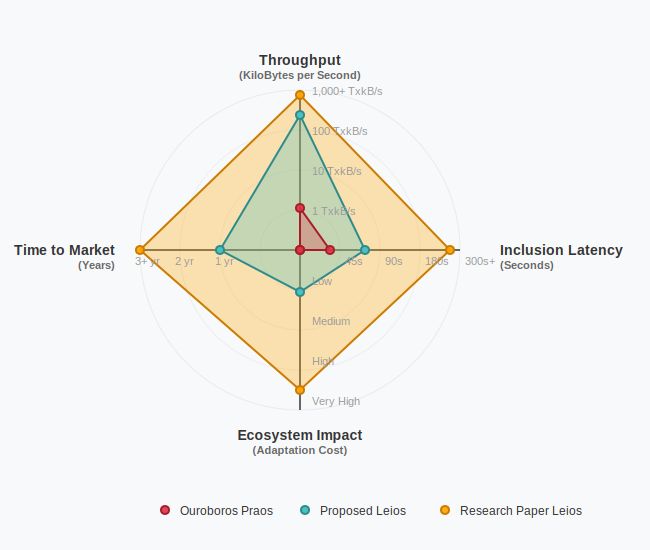

<em>Figure 19: Comparison: Praos (red), proposed Leios (teal), and research
Leios (orange)</em>

</div>

The comparison illustrates the fundamental trade-off between throughput capacity
and ecosystem disruption. While the research paper's approach (orange) achieves
higher throughput, it requires extensive ecosystem changes, significantly longer
confirmation times (2-3 minutes), and extended development timelines (2.5-3
years). The proposed specification (teal) strikes a strategic balance,
delivering substantial throughput improvements while maintaining manageable
latency increases and ecosystem compatibility.

**Key Trade-offs:**

- **Throughput**: 30-65x increase (from ~4.5 TxkB/s to ~140-300 TxkB/s)
  addresses economic sustainability and Reserve depletion timeline
- **Transaction Inclusion Latency**: Increases from ~20 seconds to 45-60 seconds
- **Infrastructure**: Requires modest hardware upgrades (4-core machines) and
  cryptographic key registration, offset by enhanced rewards
- **Time to Market**: ~1-1.5 years for deployment versus 2.5-3 years for
  higher-concurrency alternatives

**Protocol Limitations:**

The specification involves operational constraints including timing dependencies
that require careful parameter tuning, confirmation complexity through multiple
transaction states, and interdependent protocol parameters requiring ongoing
optimization. These represent acceptable trade-offs for achieving substantial
throughput improvements while maintaining familiar transaction structures and
ecosystem compatibility.

**Security Considerations:**

The proposed specification maintains Praos security properties through formal
timing constraints that ensure RB processing stays within Praos bounds. The
high-participation design (75% voting threshold) eliminates invalid transactions
in RBs and provides strong network assumptions for certified EB propagation. New
threats include equivocation by EB producers/voters and transaction availability
attacks, mitigated through cryptographic validation, equivocation detection, and
the high voting threshold requirement. Comprehensive analysis is documented in
the [Security Analysis](#security-analysis) section and
[threat model](https://github.com/input-output-hk/ouroboros-leios/blob/d5f1a9bc940e69f406c3e25c0d7d9aa58cf701f8/docs/threat-model.md).

### Alternatives & Extensions

The presented Leios specification provides a solid foundation for progressive
enhancement towards higher throughput while maintaining ecosystem compatibility.
Several alternative ideas and protocol variants were considered, which are
listed as possible extensions in this section.

As ecosystem priorities change, any of the following pathways could become more
attractive to implement, each offering distinct trade-offs in terms of user
experience, implementation cost, security considerations, and throughput
potential.

Furthermore, most aspects build incrementally upon the base protocol and may
form a roadmap of next steps.

**Increase Praos Parameters**

Enhancing Praos parameters through bigger blocks and higher active slot
coefficients offers a direct pathway to improved throughput. [Δ Q
analysis][praos-delta-q] and [simulations][praos-simulations] confirm there is
room for improvement, with analysis of 50 Tx/s and 100 Tx/s scenarios (84 TxkB/s
and 172 TxkB/s respectively) demonstrating feasibility within current network
constraints. The 50 Tx/s case would provide economically sustainable throughput,
though RB diffusion approaches the $\Delta$ assumption limits and leads to
increased network forks. While this change alone does not provide significant
room for future growth, it establishes a foundation for further enhancements.

As an extension, more frequent blocks rather than larger blocks could enhance
Leios variants by enabling more frequent certifications and lower inclusion
latency. This approach requires tighter constraints on EB diffusion but provides
better user experience through reduced transaction confirmation times.

**Relax EB diffusion constraints**

The current design requires $\Delta_\text{EB}^{\text{W}}$ (worst case) to be
fairly small to enable selection of reasonable $L_\text{diff}$ values that
ensure certified EBs do not impact Praos safety while maintaining frequent
enough certification for high throughput. Should worst-case EB diffusion prove
much larger than average or optimistic cases, introducing an additional recovery
period $L_\text{recover}$ after certificate inclusion could allow EBs to remain
unavailable for extended periods.

This approach provides greater freedom in selecting $L_\text{diff}$ parameters,
potentially allowing values as low as zero. However, the security argument must
account for nodes being unable to validate blocks within $L_\text{recover}$
periods. To preserve Praos safety and liveness, this requires relaxed chain
validity rules where potentially invalid transactions could be permitted in
ranking blocks during recovery periods.

The increased protocol optimism enables higher throughput at the cost of
significant complexity and downstream impacts on chain validity semantics. Light
node use cases would be particularly affected, requiring full ledger state to
determine transaction validity during $L_\text{recover}$ periods. Correction
mechanisms through invalid transaction lists in subsequent certified EBs or
ranking blocks could mitigate these issues, though at the expense of additional
protocol complexity.

**Transaction Groups**

Transaction grouping mechanisms offer natural throughput optimization by
reducing reference overhead in Endorser Blocks. Rather than individual
transaction references, EBs could reference transaction groups, enabling
inclusion of more transaction bytes within existing block size constraints. This
enhancement requires no fundamental protocol changes if nested transaction
approaches like [CIP-118](https://github.com/cardano-foundation/CIPs/pull/862)
provide the underlying grouping infrastructure. The approach maintains full
compatibility with existing transaction validation while improving space
efficiency.

**Interaction with Peras**

The integration pathway with Peras remains an active area of research, focusing
on optimizing the interaction between Leios's enhanced throughput mechanisms and
Peras's finality guarantees. Key considerations include synchronizing committee
selection processes, coordinating voting mechanisms to avoid redundancy, and
ensuring that enhanced throughput periods align effectively with finality
checkpoints. This integration could provide both higher throughput and stronger
finality assurances than either protocol achieves independently.

**Decoupling EB Production**

Introducing independent scheduling for Endorser Block production represents the
first step toward concurrent block production. This approach separates EB
cadence from Ranking Block timing through dedicated VRF lotteries or
deterministic schedules, providing greater flexibility in optimizing diffusion
timings and reducing censorship opportunities for stake-based attackers. While
this introduces potential conflicts between transactions in RBs and those
endorsed in EBs, the enhanced scheduling flexibility enables better parameter
tuning for diverse network conditions.

**EBs Referencing EBs**

Building chains of certified Endorser Blocks before anchoring them to the main
chain enables more granular transaction processing and improved inclusion
latency. This approach allows multiple smaller EBs instead of monolithic blocks,
reusing validation and voting work already performed while continuing
transaction processing during periods of poor chain quality. The shorter
possible cadence particularly benefits scenarios with unfavorable RB sortition,
providing more consistent transaction inclusion opportunities.

**Input Block Production**

Full concurrent block production through Input Blocks represents the highest
throughput pathway but introduces significant complexity. This approach
front-loads validation and diffusion work across multiple concurrent streams,
substantially increasing transaction conflict likelihood even under honest
operation. Resolution mechanisms include accepting conflicts with fee collection
from non-executed transactions, reducing conflict probability through ledger
sharding or controlled IB production, and implementing reconciliation systems
with tombstoning to manage storage efficiency. While offering the greatest
throughput potential, this pathway requires careful analysis of economic
incentives and conflict resolution trade-offs.

## Path to active

### Acceptance criteria

The proposal will be considered active once the following criteria are met:

- [ ] Protocol performance validated through load tests in a representative
      environment.
- [ ] Required changes are documented in an implementation-independent way via
      the
      [Cardano blueprint](https://cardano-scaling.github.io/cardano-blueprint/)
      including conformance tests.
- [ ] Formal specification of the consensus and ledger changes is available.
- [ ] ΔQSD model available for Leios parameter selection.
- [ ] Community agreement on initial Leios protocol parameters.
- [ ] A peer-reviewed implementation of a Leios-enabled node is available.
- [ ] Successful operation with open participation in testnet environments over
      several months.
- [ ] Key infrastructure signalled readiness for Leios-enhanced throughput.
- [ ] Hard-fork enabling Leios is successfully executed on mainnet.

### Implementation plan

Key steps on the roadmap to realize Leios, somewhat ordered but not sequential,
are:

- [x] Simulations to confirm general feasibility using a model of mainnet.
- [x] Ecosystem impact analysis and establish a threat model.
- [ ] Coordinate with related activities on other protocol enhancements
      (Phalanx, Peras, Mithril).
- [ ] Detailed node-level (as opposed to this protocol-level) technical
      specification.
- [ ] Complete ΔQSD analysis of new/changed network interactions.
- [ ] [Complete formal protocol specification in Agda][linear-leios-formal-spec]
      of ledger and consensus changes.
- [ ] Create network prototypes and conduct large scale experiments.
  - Load tests in a controlled topology
  - Validate protocol parameters
  - Stake- and network-based attacks
- [ ] Develop node-level, but implementation-independent conformance test suites
      (blueprint).
- [ ] Create a public leios-specific testnet with repeated load tests and
      encourage dependant infrastructure updates.
- [ ] Implement / integrate necessary changes to `cardano-node` and other node
      implementations (this is big).
- [ ] Audit protocol and implementation changes.
- [ ] Align on node releases and hard-fork schedule to mature pre-releases
      through preview and preprod testnets.

## Versioning

Leios changes the consensus algorithm used to create a valid chain on Cardano
and thus requires a new major protocol version. As the block format will change,
a new ledger era is also required and
[CIP-84](https://github.com/cardano-foundation/CIPs/tree/master/CIP-0084)
applies. A hard-fork event will enable Leios on the Cardano network and the
usual mechanisms of governing a hard-fork will be employed.

## References

**Primary Documents**

- **CPS-18: Greater transaction throughput** - [CPS-0018][cps-18]
- **Ouroboros Leios: Design Goals and Concepts** - [Research Paper][leios-paper]

**Leios Resources**

- **Leios R&D website** - [leios.cardano-scaling.org][leios-website]
- **Leios Discord channel** - [IOG Discord][leios-discord]
- **Leios R&D repository** - [GitHub][leios-github]
- **Leios formal specification** - [GitHub][leios-formal-spec]
- **Leios Agfa formal specification** - [Agda
  specification][linear-leios-formal-spec]
- **Leios cryptography prototype** - [GitHub][leioscrypto]

**Technical Specifications**

- **BLS certificates specification** - [Specification][bls-spec]
- **BLS certificates benchmarks** - [Benchmarks][bls-benchmarks]
- **Fait Accompli sortition** - [Specification][fait-accompli-sortition]

**Technical Reports**

- **Committee size and quorum requirement** -
  [Analysis][committee-size-analysis]
- **Threat model** - [Report #1][threat-model]
- **Leios attack surface** - [Report #2][threat-model-report2]
- **Node operating costs** - [Cost estimate][cost-estimate]

**Related**

- **CPS-0017** - [Settlement layer CPS][cps-17]
- **Praos performance model** - [Specification][praos-performance]

**Simulation Resources**

- **Synthetic mainnet** - [Mainnet-like topologies for Leios][mainnet-topology]
- **10k-node network** - [Leios pseudo-mainnet topology][pseudo-mainnet]
- **750-node network** - [Leios mini-mainnet topology][mini-mainnet]
- **Comparison of 10k-node and 750-node networks** - [Mainnet comparison
  study][topology-comparison]
- **Validation times** - [Analysis of mainnet transaction validation
  times][timings]

**External**

- **RIPE Atlas** - [Network measurements][ripe-atlas]
- **Ledger analyser tool** - [db-analyser][dbanalyser]
- **UTXO-HD** - [Cardano Node 10.5.1][utxohd]
- **SPO hardware requirements** - [Minimmum hardware requirements to run a stake
  pool][spohw]

<!-- Reference Index - DO NOT REMOVE -->
<!-- The following reference definitions enable consistent linking throughout the document -->

<!-- Primary references -->

[cps-18]:
  https://github.com/cardano-foundation/CIPs/blob/master/CPS-0018/README.md
  "CPS-18: Greater transaction throughput"
[leios-paper]:
  https://eprint.iacr.org/2025/1115.pdf
  "Ouroboros Leios: Design Goals and Concepts"
[fait-accompli-sortition]:
  https://github.com/input-output-hk/ouroboros-leios/blob/d5f1a9bc940e69f406c3e25c0d7d9aa58cf701f8/crypto-benchmarks.rs/Specification.md#sortition
  "Fait Accompli sortition specification"

<!-- Project resources -->

[leios-website]: https://leios.cardano-scaling.org/ "Leios R&D web site"
[leios-discord]:
  https://discord.com/channels/826816523368005654/1247688618621927505
  "Leios channel on IOG Discord"
[leios-github]:
  https://github.com/input-output-hk/ouroboros-leios
  "Github repository for Leios R&D"
[leios-formal-spec]:
  https://github.com/input-output-hk/ouroboros-leios-formal-spec
  "Github repository for Leios formal specification"
[linear-leios-formal-spec]:
  https://github.com/input-output-hk/ouroboros-leios-formal-spec/blob/V1.0/formal-spec/Leios/Linear.lagda.md
  "Leios formal specification in Agda"

<!-- Technical specifications and benchmarks -->

[bls-spec]:
  https://github.com/input-output-hk/ouroboros-leios/blob/d5f1a9bc940e69f406c3e25c0d7d9aa58cf701f8/crypto-benchmarks.rs/Specification.md
  "BLS certificates specification"
[bls-benchmarks]:
  https://github.com/input-output-hk/ouroboros-leios/blob/d5f1a9bc940e69f406c3e25c0d7d9aa58cf701f8/crypto-benchmarks.rs/Specification.md#benchmarks-in-rust
  "BLS certificates benchmarks"

<!-- Technical reports and documentation -->

[committee-size-analysis]:
  https://github.com/input-output-hk/ouroboros-leios/blob/d5f1a9bc940e69f406c3e25c0d7d9aa58cf701f8/docs/technical-report-1.md#committee-size-and-quorum-requirement
  "Committee size and quorum requirement"
[threat-model]:
  https://github.com/input-output-hk/ouroboros-leios/blob/d5f1a9bc940e69f406c3e25c0d7d9aa58cf701f8/docs/technical-report-1.md#threat-model
  "Threat model"
[threat-model-report2]:
  https://github.com/input-output-hk/ouroboros-leios/blob/d5f1a9bc940e69f406c3e25c0d7d9aa58cf701f8/docs/technical-report-2.md#notes-on-the-leios-attack-surface
  "Comments on Leios attack surface"
[cost-estimate]:
  https://github.com/input-output-hk/ouroboros-leios/blob/d5f1a9bc940e69f406c3e25c0d7d9aa58cf701f8/docs/cost-estimate/README.md
  "Leios node operating costs"

<!-- Other protocol references -->

[cps-17]:
  https://github.com/cardano-scaling/CIPs/blob/settlement-cps/CPS-0017/README.md
  "CPS-0017"
[praos-performance]:
  https://github.com/IntersectMBO/cardano-formal-specifications/blob/6d4e5cfc224a24972162e39a6017c273cea45321/src/performance/README.md
  "Praos performance model"

<!-- Simulation topology -->

[mainnet-topology]:
  https://github.com/input-output-hk/ouroboros-leios/blob/6d8619c53cc619a25b52eac184e7f1ff3c31b597/data/simulation/pseudo-mainnet/ReadMe.md
  "Mainnet-like topology documentation"
[pseudo-mainnet]:
  https://github.com/input-output-hk/ouroboros-leios/blob/6d8619c53cc619a25b52eac184e7f1ff3c31b597/data/simulation/pseudo-mainnet/topology-v1.md
  "Pseudo-mainnet topology"
[mini-mainnet]:
  https://github.com/input-output-hk/ouroboros-leios/blob/6d8619c53cc619a25b52eac184e7f1ff3c31b597/data/simulation/pseudo-mainnet/topology-v2.md
  "Mini-mainnet topology"
[topology-comparison]:
  https://github.com/input-output-hk/ouroboros-leios/blob/6d8619c53cc619a25b52eac184e7f1ff3c31b597/analysis/sims/2025w30b/analysis.ipynb
  "Topology comparison study"
[praos-simulations]:
  https://github.com/input-output-hk/ouroboros-leios/blob/d5f1a9bc940e69f406c3e25c0d7d9aa58cf701f8/analysis/sims/2025w26/analysis-praos.ipynb
[leioscrypto]:
  https://github.com/input-output-hk/ouroboros-leios/tree/19990728e09fd1d863f888a494d1930b59e5a0d7/crypto-benchmarks.rs
  "Leios cryptography prototype implementation"
[timings]:
  https://github.com/input-output-hk/ouroboros-leios/blob/d5f1a9bc940e69f406c3e25c0d7d9aa58cf701f8/analysis/timings/ReadMe.ipynb
  "Analysis of mainnet transaction validation times"

<!-- External resources -->

[ripe-atlas]: https://atlas.ripe.net/ "RIPE Atlas"
[spohw]:
  https://developers.cardano.org/docs/operate-a-stake-pool/hardware-requirements
  "Minimum hardware requirements to run a stake pool"
[utxohd]:
  https://github.com/IntersectMBO/cardano-node/releases/tag/10.5.1
  "Cardano Node 10.5.1 release notes"
[dbanalyser]:
  https://github.com/IntersectMBO/ouroboros-consensus/blob/main/ouroboros-consensus-cardano/README.md#db-analyser
  "Cardano instantiation of the Consensus Layer: db-analyser"
[praos-delta-q]:
  https://github.com/IntersectMBO/cardano-formal-specifications/tree/main?tab=readme-ov-file#performance-model
  "Praos performance model"

<!-- License -->

[apache-2.0]: http://www.apache.org/licenses/LICENSE-2.0 "Apache License 2.0"

<!-- Footnotes -->

[^fasort]: The Fait Accompli sortition scheme

[^2]: Leios: Dynamic Availability for Blockchain Sharding (2025)

[^leioscrypto]: Leios cryptography prototype implementation

[praos-delta-q]:
  https://github.com/IntersectMBO/cardano-formal-specifications/tree/main?tab=readme-ov-file#performance-model
[praos-simulations]:
  https://github.com/input-output-hk/ouroboros-leios/blob/d5f1a9bc940e69f406c3e25c0d7d9aa58cf701f8/analysis/sims/2025w26/analysis-praos.ipynb

## Appendix

<h3 id="appendix-a-requirements">Appendix A: Requirements for votes and certificates</h2>

The voting and certificate scheme for Leios must satisfy the following
requirements to ensure security, efficiency, and practical deployability:

1. **Succinct registration of keys:** The registration of voting keys should not
   involve excessive data transfer or coordination between parties. Ideally,
   such registration would occur as part of the already existing operational
   certificates and not unduly increase their size.

2. **Key rotation:** The cryptographic keys used to sign Leios votes and
   certificates _do not_ need to be rotated periodically because the constraints
   on Leios voting rounds and the key rotation already present in Praos secure
   the protocol against attacks such as replay and key compromise.

3. **Deterministic signatures:** While deterministic signatures can provide
   additional protection against attacks that exploit weak randomness in
   signature generation, they are not strictly required for protocol security.
   The main requirement for deterministic randomness is in the lottery
   mechanism, which is satisfied by the use of VRFs.

4. **Local lottery:** Selection of the voting committee should not be so
   deterministic and public as to open attack avenues such as denial-of-service
   or subversion.

5. **Liveness:** Adversaries with significant stake (e.g., more than 35%) should
   not be able to thwart an honest majority from reaching a quorum of votes for
   an EB.

6. **Soundness:** Adversaries with near majority stake (e.g., 49%) should not be
   able to form an adversarial quorum that certifies the EB of their choice.

7. **Small votes:** Because vote traffic is large and frequent in Leios, the
   votes themselves should be small. Note that the large size of Praos KES
   signatures precludes their use for signing Leios votes.

8. **Small certificates:** Because Leios certificates are frequent and must fit
   inside Praos blocks, they should be small enough so there is plenty of room
   for other transactions in the Praos blocks. Note once again that certificates
   based on Praos KES signatures are too large for consideration in Leios.

9. **Fast cryptography:** The computational burden of creating and verifying
   voting eligibility, the votes themselves, and the resulting certificate must
   be small enough to fit within the CPU budget for Leios stages.

The aggregate signature scheme implementation specified in this document (using
BLS as an example) satisfies all these requirements, as evidenced by the
performance characteristics and certificate sizes documented in the
[Votes and Certificates](#votes-and-certificates) section.

<h3 id="appendix-b-cddl">Appendix B: Wire Format Specifications (CDDL)</h2>

This appendix contains the complete CDDL specifications for all Leios protocol
messages and data structures. These definitions specify the exact wire format
for network communication.

<a id="ranking-block-cddl" href="#ranking-block-cddl">**Ranking Block**</a>

```diff
 ranking_block =
   [ header                   : block_header
   , transaction_bodies       : [* transaction_body]
   , transaction_witness_sets : [* transaction_witness_set]
   , auxiliary_data_set       : {* transaction_index => auxiliary_data}
+  , ? eb_certificate         : leios_certificate
   ]

block_header =
   [ header_body              : block_header_body
   , body_signature           : kes_signature
   ]

 block_header_body =
   [ block_number             : uint
   , slot                     : slot_no
   , prev_hash                : hash32
   , issuer_vkey              : vkey
   , vrf_vkey                 : vrf_vkey
   , vrf_result               : vrf_cert
   , block_body_size          : uint
   , block_body_hash          : hash32
+  , ? announced_eb           : hash32
+  , ? announced_eb_size      : uint32
+  , ? certified_eb           : bool
   ]
```

<a id="endorser-block-cddl" href="#endorser-block-cddl">**Endorser Block**</a>

```cddl
endorser_block =
  [ transaction_references   : [* tx_reference]
  ]

; Reference structures
tx_reference =
  [ tx_hash                  : hash32     ; Hash of complete transaction bytes
  , tx_size                  : uint16     ; Transaction size in bytes
  ]
```

<a id="votes-certificates-cddl" href="#votes-certificates-cddl">**Votes and
Certificates**</a>

```cddl
leios_certificate =
  [ election_id              : election_id
  , endorser_block_hash      : hash32
  , persistent_voters        : [* persistent_voter_id]
  , nonpersistent_voters     : {* pool_id => bls_signature}
  , ? aggregate_elig_sig     : bls_signature
  , aggregate_vote_sig       : bls_signature
  ]

leios_vote = persistent_vote / non_persistent_vote

persistent_vote =
  [ 0
  , election_id
  , persistent_voter_id
  , endorser_block_hash
  , vote_signature
  ]

non_persistent_vote =
  [ 1
  , election_id
  , pool_id
  , eligibility_signature
  , endorser_block_hash
  , vote_signature
  ]
```

## Copyright

> [!NOTE]
>
> The CIP must be explicitly licensed under acceptable copyright terms (see
> below).
>
> CIPs are licensed in the public domain. More so, they must be licensed under
> one of the following licenses. Each new CIP must identify at least one
> acceptable license in its preamble. In addition, each license must be
> referenced by its respective abbreviation below in the _"Copyright"_ section.

This CIP is licensed under [Apache-2.0][apache-2.0].
