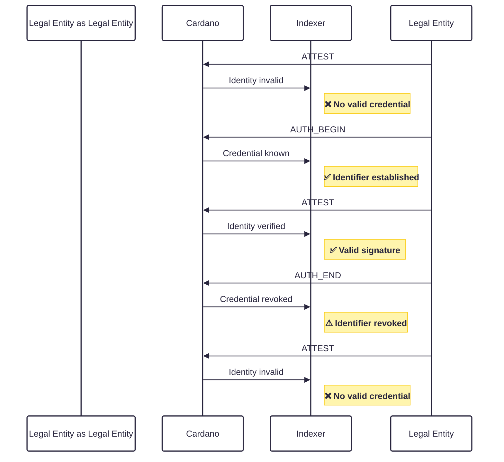
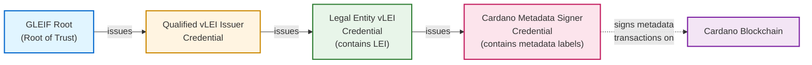

## Abstract

Accountability is essential for legal entities, organizations, and authorities operating in regulated environments. To establish accountability on the Cardano blockchain, it must be possible to prove the identity of entities responsible for on-chain actions in a verifiable and interoperable way.

This CIP defines a standardized mechanism to embed KERI ([Key Event Receipt Infrastructure](https://trustoverip.github.io/kswg-keri-specification/)) identifiers within Cardano transaction metadata. KERI provides self-certifying, portable, and decentralized identifiers known as Autonomic Identifiers (AIDs) that can be anchored to various roots of trust—such as verifiable Legal Entity Identifiers (vLEIs), organizational registries, or domain-specific trust frameworks.

By including KERI identifiers in transaction metadata, Cardano enables a flexible, trust-agnostic approach to identity binding. This approach supports accountability, legal and regulatory compliance, and interoperability with existing and emerging global identity ecosystems, while remaining compatible with self-sovereign identity principles.

## Motivation: why is this CIP necessary?

The demand for auditable and verifiable identifiers is increasing as accountability, traceability, and transparency become fundamental requirements for entities operating within regulated environments. Without a standardized mechanism, it is difficult to reliably associate on-chain activity with persistent and legally recognized identities.

KERI (Key Event Receipt Infrastructure) addresses this challenge by introducing a decentralized, key-oriented identifier system that supports secure, portable, and self-certifying digital identities. Instead of relying on centralized registries, KERI establishes identifiers through cryptographically verifiable event logs, enabling secure key rotation, continuity of control, and tamper-evident auditability. This approach ensures that an identifier can consistently represent the same entity over time, while remaining interoperable with verifiable credentials and roots of trust such as verifiable Legal Entity Identifiers (vLEIs).

By embedding KERI identifiers into Cardano transaction metadata, this proposal enables a standardized and verifiable linkage between on-chain actions and off-chain accountability frameworks. This allows transactions to be cryptographically bound to a specific identifier and, through verifiable credential chains, to a legally recognized entity, thereby enhancing trust and compliance across decentralized and regulated ecosystems.


## Specification

Below a generic solution is defined to enable metadata signing where a particular ecosystem or use-case may leverage a root of trust of its choosing – each most likely with its own credential chain format.

The credentials used in the KERI ecosystem are known as ACDCs, or [Authentic Chained Data Containers](https://trustoverip.github.io/kswg-acdc-specification/). This CIP will not explain at depth how KERI and ACDCs work due to their technical complexity. The [Appendix](#appendix) will however include some expanded explanations to help provide clarity.

> [!NOTE]
> The key words "MUST", "MUST NOT", "REQUIRED", "SHALL", "SHALL NOT", "SHOULD", "SHOULD NOT", "RECOMMENDED", "NOT RECOMMENDED", "MAY", and "OPTIONAL" in this document are to be interpreted as described in BCP 14 [RFC2119](https://www.rfc-editor.org/rfc/rfc2119) [RFC8174](https://www.rfc-editor.org/rfc/rfc8174) when, and only when, they appear in all capitals, as shown here.

### Key Event Log Discovery
In order to verify the validity of credential chains and metadata transactions, Key Event Logs, or KELs, for all issuing and holding identifiers in the credential chain must be made available to a verifier. KELs may live off-chain for interoperability and scalability reasons, so this CIP does not make assumptions on which medium the KELs are published.

A KERI watcher network SHOULD be used to discover up-to-date KELs for a given identifier for certain security reasons. Discovery of the watcher network relevant to a given ecosystem depends on the ecosystem itself.

However, as KERI is a maturing technology, wide-spread deployment of watcher networks is not yet guaranteed. Until then, the interim solution is to publish an [Out-of-Band-Introduction](#discovery-via-out-of-band-introductions-oobis) via a known persistent channel for the specific project for discovery, and this may be used by a verifier to discover and query for KEL events and updates.

In one way or another, chain indexers must query for Key Event Log updates to validate credential chains and metadata transactions during the process of verification.

### Visualized Identity Lifecycle
The following diagram illustrates the lifecycle of signing authority for a KERI identifier on Cardano. It demonstrates how [attestations](#creation-of-verifiable-records) (`ATTEST`) are invalid before [authority is established](#establishment-of-signing-authority) (`AUTH_BEGIN`), become valid during the authenticated period, and become invalid again after [revocation](#revoking-of-signing-authority) (`AUTH_END`).


### Establishment of signing authority
Before attesting to any transactions, the relevant [credential chain](#credential-chains) for the controller must be published on-chain with the following attributes – most of which are used to help simplify indexing:
- **t** — A transaction type of `AUTH_BEGIN` is used to establish a signer’s authority using a credential chain.
- **i** — The identifier of the signer in the CESR qb64 variant. This MUST match the issuee of the leaf credential in the chain.
- **s** — The schema identifier of the leaf credential in the chain in the CESR qb64 variant. This MUST match the schema of the [leaf credential](#identifying-a-credential-chain-type) in the chain.
- **c** — The byte-stream of the credential chain in the CESR qb2 or qb64b variant, for brevity.
- **m** —  An optional metadata block used to simplify indexing for a particular use-case. For example, the LEI of a legal entity could be contained here.

The credential chain should contain all credentials, relevant registry events and attachments. There are various types of ACDC registries, so for simplicity: the credential chain MUST validate with an ACDC v1 or v2 verifier, assuming that KEL events are already available.

These attributes can be embedded in the metadata of a transaction using a fixed metadata label. Compact field labels are used for brevity.

The metadata is structured as follows:
```JSON
{
  "????":
  {
    "t": "AUTH_BEGIN",
    "s": "{{saidOfLeafCredentialSchema}}",
    "i": "{{aidOfSigner}}",
    "c": "{{byteStream}}",
    "m": "{{optionalMetadataBlock}}"
  }
}
```
If valid for a given ecosystem, this transaction establishes the signing authority for `i` from this transaction onwards in the chain. The issuance date of the leaf credential SHOULD be ignored.

### Creation of verifiable records
To create a persistent signature over data with KERI, signers can anchor a digest of the data in their KEL, typically using an interaction event. Anchoring ensures that data remains verifiable even if the controller later rotates their keys.

 The relevant data recorded for each event includes:
- **t** — A transaction type of `ATTEST` is to create a verifiable record.
- **i** — The identifier of the signer in the CESR qb64 variant.
- **d** — The digest of the data being signed in the CESR qb64 variant.
- **s** — The sequence number of the KERI event, encoded as a hex string.
If the KEL of identifier `i` contains an event at sequence number `s` which has a seal value of `{ d: "{{digest}}" }`, it serves as cryptographically verifiable proof that the data was effectively signed by the controller.

A reference to this event in a metadata transaction is structured as follows:
```JSON
{
    "????": {
    "t": "ATTEST",
    "i": "{{aidOfSigner}}", 
    "d": "{{digest}}",
    "s": "{{hexEncodedSequenceNumber}}"
    },
    "YYYY": "{{someApplicationMetadata}}"
}
```
Such transactions are only considered valid if the digest value is correct, and can be found anchored in the KEL of the controller at the given sequence number.

### Revoking of signing authority
Signing authority may be removed after a period of time by revoking the relevant credential and publishing this revocation on-chain. As such, the validity of transactions associated with that credential chain are for all valid `ATTEST` transactions between issuance (`AUTH_BEGIN`) and revocation (`AUTH_END`).

The following attributes are used:
- **t** — A transaction type of `AUTH_END` is used to remove a signer’s authority with revocation registry events.
- **i** — The identifier of the signer in the CESR qb64 variant. This MUST match the issuee of the leaf credential in the chain.
- **s** — The schema identifier of the leaf credential in the chain in the CESR qb64 variant. This MUST match the schema of the leaf credential in the chain.
- **c** — The byte-stream of the revocation registry events in the CESR qb2 variant, for brevity.
- **m** — An optional metadata block used to simplify indexing for a particular use-case. For example, the LEI of a legal entity could be contained here.

A reference to this event in a metadata transaction is structured as follows:
```JSON
{
  "????":
  {
    "t": "AUTH_END",
    "s": "{{saidOfLeafCredentialSchema}}",
    "i": "{{aidOfSigner}}",
    "c": "{{byteStream}}",
    "m": "{{optionalMetadataBlock}}"
  }
}

```
If the successful parsing of the revocation events results in a credential chain that no longer gives authority to the signer, any later `ATTEST` transactions for this credential chain should be ignored (unless there is another subsequent `AUTH_START`).


## Reference Example - vLEI

The Global Legal Entity Identifier Foundation (GLEIF) serves as the root of trust for Legal Entity Identifiers (LEIs) worldwide. Their verifiable variant, the vLEI, is based on the KERI and ACDC standards, and are issued by Qualified vLEI Issuers (QVIs).

Legal entities holding valid vLEI credentials may issue other credentials chained to their vLEI which allows them to delegate authority to other persons or machines.

As a reference example, we define a `vLEICardanoMetadataSigner` credential. For a given use-case, the issuee of this credential is allowed to sign transaction metadata on Cardano on behalf of a particular legal entity. The LEI of this legal entity is embedded in their Legal Entity vLEI credential.



The above diagram contains 3 credentials which are cryptographically chained:
- **Qualified vLEI Issuer**: Issued by GLEIF to QVI entities.
- **Legal Entity vLEI**: Issued by a QVI to legal entities.
- **Cardano Metadata Signer**: Issued by the legal entity to a person or machine who may sign on behalf of the entity.

The schema for the signer credential may be found here. It contains an attribute `labels` which is an array of metadata label numbers for which the signer has the authority to create verifiable records over.

### Establishment of signing authority
For this example, a signer controlling the identifier `EKtQ1lymrnrh3qv5S18PBzQ7ukHGFJ7EXkH7B22XEMIL` is holding a metadata signer credential valid for label `1447`.

The following is the expected transaction format to publish the credential chain:
```JSON
{
  "????":
  {
    "t": "AUTH_BEGIN",
    "s": "ED_GbUPpS8ZJEY-u8OB3QVe9C_CAFBdSimS5KxclkgWT",
    "i": "EKtQ1lymrnrh3qv5S18PBzQ7ukHGFJ7EXkH7B22XEMIL",
    "c": "{{credentialChainByteStream}}",
    "m":
    {
      "l": [1447],
      "LEI": "50670047U83746F70E20"
    }
  }
}
```
For ease of indexing, the metadata block is used to contain the LEI of the legal entity, as well as an array of all relevant metadata labels. As such, an indexer can filter based on interested metadata labels, or based on a particular set of legal entities.

The credential chain `c` should be a qb2 CESR stream containing:
- Each ACDC credential and corresponding issuance event (`iss`)
- Registry events for each revocation registry (`vcp`)
- All necessary CESR attachments

A test example may be found here in qb64 format - this should be converted to qb2 before being pushed on-chain.

After verifying the validity of the credential chain with an ACDC verifier, there are a number of extra validation steps to complete as business logic:
1. `EKtQ1lymrnrh3qv5S18PBzQ7ukHGFJ7EXkH7B22XEMIL` is the issuee of the metadata signer credential with a schema ID of `ED_GbUPpS8ZJEY-u8OB3QVe9C_CAFBdSimS5KxclkgWT`.
2. The label attribute of the credential is `[1447]`.
3. The LEI attribute of the Legal Entity vLEI credential is `50670047U83746F70E20`.
4. The Qualified vLEI Issuer credential is issued by GLEIF’s External identifier, as listed [here](https://gleif-it.github.io/.well-known/).

### Creation of verifiable records
The following is an attestation transaction for metadata label `1447`.
```JSON
{
    "XXXX": {
    "t": "ATTEST",
    "i": "EKtQ1lymrnrh3qv5S18PBzQ7ukHGFJ7EXkH7B22XEMIL", 
    "d": "ELC5L3iBVD77d_MYbYGGCUQgqQBju1o4x1Ud-z2sL-ux",
    "s": "1a"
    },
    "1447": "{{someApplicationMetadata}}"
}
```

Validation steps:
1. `EKtQ1lymrnrh3qv5S18PBzQ7ukHGFJ7EXkH7B22XEMIL` currently has signing authority over label 1447.
2. The CESR digest of the data at label 1447 is `ELC5L3iBVD77d_MYbYGGCUQgqQBju1o4x1Ud-z2sL-ux`.
3. The event in the controller’s KEL at sequence number `1a` (26th event) is `{ d: “ELC5L3iBVD77d_MYbYGGCUQgqQBju1o4x1Ud-z2sL-ux” }`.

### Revoking signing authority

When a credential must be revoked (for example, due to employee termination, credential compromise, or policy changes) the legal entity publishes an `AUTH_END` transaction containing the revocation registry events.

The following is an example revocation transaction:
```JSON
{
  "????":
  {
    "t": "AUTH_END",
    "s": "ED_GbUPpS8ZJEY-u8OB3QVe9C_CAFBdSimS5KxclkgWT",
    "i": "EKtQ1lymrnrh3qv5S18PBzQ7ukHGFJ7EXkH7B22XEMIL",
    "c": "{{revocationRegistryEventsByteStream}}",
    "m":
    {
      "l": [1447],
      "LEI": "50670047U83746F70E20"
    }
  }
}
```

The revocation registry events in `c` should contain the necessary ACDC registry events that mark the credential as revoked. Once processed by the indexer, the following validation logic applies:

1. The indexer parses the revocation events and validates them against the credential chain.
2. If the revocation is valid, the identifier `EKtQ1lymrnrh3qv5S18PBzQ7ukHGFJ7EXkH7B22XEMIL` loses signing authority for label `1447` from this transaction forward.
3. Any subsequent `ATTEST` transactions using this identifier will be ignored and treated as unverified.

For example, if the following transaction appears after revocation:
```JSON
{
    "XXXX": {
    "t": "ATTEST",
    "i": "EKtQ1lymrnrh3qv5S18PBzQ7ukHGFJ7EXkH7B22XEMIL", 
    "d": "ELC5L3iBVD77d_MYbYGGCUQgqQBju1o4x1Ud-z2sL-ux",
    "s": "1b"
    },
    "1447": "{{someApplicationMetadata}}"
}
```

The indexer will reject this attestation because:
1. The credential chain for `EKtQ1lymrnrh3qv5S18PBzQ7ukHGFJ7EXkH7B22XEMIL` has been revoked.
2. No valid signing authority exists for this identifier on label `1447`.
3. The transaction is marked as **unverified** and should not be trusted by any application relying on the indexer.

Only if a new `AUTH_BEGIN` transaction is published with a fresh, valid credential chain would the identifier regain signing authority.


## Rationale: how does this CIP achieve its goals?

This CIP enables entities (including legal entities, organizations, DAOs, and individuals) to cryptographically prove their identity on Cardano by linking verifiable credential chains (such as vLEIs) to on-chain transactions. This connection establishes accountability and transparency, enabling blockchain adoption in highly regulated environments where transactions must be traceable to recognized entities, while also supporting flexible identity frameworks for various use cases beyond traditional corporate structures.

### Achieving Accountability Through Verifiable Identity

The core goal of establishing accountability is achieved through several key mechanisms:

**Persistent Identity Binding**: By anchoring KERI identifiers in transaction metadata, this CIP creates an immutable, publicly auditable link between a transaction and a specific entity. Unlike traditional blockchain addresses which are pseudonymous, KERI identifiers can be verified against credential chains that ultimately connect to legally recognized entities (e.g., through LEIs issued by GLEIF). This transforms anonymous blockchain activity into accountable actions.

**Temporal Authority Control**: The `AUTH_BEGIN` and `AUTH_END` lifecycle allows precise control over when an identifier has signing authority. This supports real-world scenarios like employee onboarding/offboarding or credential expiration, ensuring that only authorized representatives can act on behalf of an entity at any given time. Indexers can deterministically verify whether any attestation was made during a valid authority period.

**Multi-Layer Verification**: The credential chain structure enables verification at multiple levels—from cryptographic signature validity, to credential issuance by authorized issuers, to the root of trust (e.g., GLEIF). This layered approach means that breaking accountability would require compromising multiple independent systems, not just a single private key.

### Design Trade-offs

The metadata-based approach was chosen for its simplicity and flexibility:

**Advantages:**
- Straightforward implementation for wallets and transaction builders
- Flexible credential schemas without protocol changes
- Full backward compatibility with existing infrastructure

**Limitations:**
- Validation must occur off-chain through indexers (smart contracts cannot enforce credential checks) - This limitation can be solved by writing another CIP or extending this
- Requires additional infrastructure (indexers, KERI watcher networks)

The metadata is immutably recorded on-chain, and anyone can independently verify the cryptographic proofs by validating the credential chains against published Key Event Logs.

### Cryptographic Trust

Unlike oracle networks that rely on consensus among multiple nodes, KERI-based verification relies purely on cryptographic signatures and tamper-evident event logs. Verifiers can independently validate credentials without trusting any third party—the only trust assumption is in the root of trust (e.g., GLEIF for vLEIs), which is already established in real-world legal frameworks.

By adopting KERI, an existing standard from the Trust over IP Foundation, this CIP ensures interoperability across ecosystems, credential portability, and alignment with emerging regulatory requirements for digital identity. This standards-based approach means that implementations can leverage existing tooling, benefit from ongoing security research, and maintain compatibility as the KERI ecosystem evolves.

## Path to Active

## Appendix

### Credential chains

ACDCs can be chained together cryptographically in a similar manner to traditional X.509 certificate chains, yet with far more power and flexibility.

For a given ecosystem, there may be a particular credential chain type that can be used to create bindings between controllers and entities or people. For example, in the vLEI ecosystem, credential chains may be used to create a binding between a legal entity and one of its employees that has the authority to sign transactions on its behalf. The root of trust in the vLEI ecosystem is GLEIF.

### Identifying a credential chain type

Various credential chain types may represent various forms of compliance or bindings so it's important to be able to differentiate between credential chain types so that chain indexers can more easily filter out irrelevant transactions.

For this, the schema ID of the leaf credential in the credential chain may be used - that is, the credential which will be held by the person or software attesting to the metadata transaction. This is the strongest indicator of the credential chain type as child credential schemas reference parent credential schemas in a cryptographically strong manner.

### Discovery via Out-of-Band-Introductions (OOBIs)

In the context of this CIP, an OOBI provides a mechanism to discover verifiable information related to an identifier at an endpoint, such as the Key Event Log related to that identifier. All data is still verifiably signed, but a watcher network should be used to reduce the risk of discovering a forked, but verifiable version of a KEL.

### Root of trust discovery

GLEIF serves as the root of trust in the vLEI ecosystem. Discovery of their GLEIF Root identifier therefore must be carefully managed to avoid a Man-in-the-Middle attack where an attacker redirects a verifier to a different root identifier that is also verifiable.

GLEIF has published their identifiers in various mediums such as various GitHub organizations, websites and hardcopy publications to mitigate the risk of an attacker compromising each medium, and [here](https://gleif-it.github.io/.well-known/) is one such location. The issuer of production QVI credentials is the GLEIF External, which is delegated from the GLEIF Root.

## Copyright

This CIP is licensed under [CC-BY-4.0](https://creativecommons.org/licenses/by/4.0/legalcode)