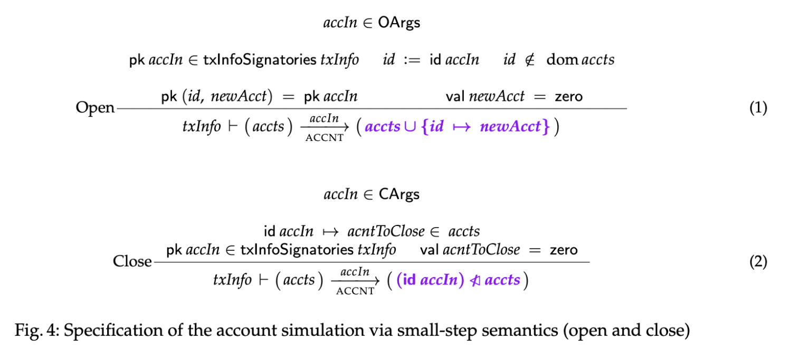

## Abstract

At this time, there exists an [Agda model](https://github.com/IntersectMBO/formal-ledger-specifications) 
of the Cardano ledger, which is used, among other things, as the source of truth 
for the design of the Cardano ledger implementation, as well as for conformance testing. 
This CIP describes a proposal for adding a framework for defining stateful computation called [structured contracts](https://omelkonian.github.io/data/publications/eutxo-struc.pdf) to this Agda specification model, 
using a certain class of boolean Agda predicates to model ledger scripts. A user may instantiate 
this framework by specifying the semantics of their desired stateful program, then defining Agda functions 
corresponding to smart contracts required to implement these semantics. 
Finally, to show the implementation is correct, fulfilling some proof obligations 
concerting the definitions of the program semantics and smart contract functions. The purpose of this CIP is to define a principled approach to *correctly implementing a program on Cardano*, and equip users with the tools and the examples
useful in developing formally verified Cardano applications. Any DApp developed on Cardano can be viewed 
as an instance of our proposed framework, including anything from minting policies, to a basic (single-execution) 
UTxO-locking script, to sophisticated stateful apps distributed across multiple UTxOs and scripts. We do not propose any 
automation for defining structured contract instances, however, the scope of this CIP should include automated conversion 
from completed Agda smart contract functions to Plutus code. 

## Motivation: Why is this CIP necessary?

Smart contracts in the Extended UTxO ledger model are an unusual programming paradigm. 
Smart contracts on Cardano are stateless boolean predicates. The purpose of smart contract scripts is to control updates made by transactions to certain data in the ledger state. For example, a minting policy regulates updating the total supply of tokens under this policy, and a validator (output-locking) script regulates the removal of that UTxO entry from the UTxO set.
Informally speaking, formal script verification entails checking that 
(i) transactions being applied to the ledger are limited to 
making certain kinds of changes to specific data on the ledger (i.e., ones that the script author intended to allow), and 
(ii) transactions are not prevented from 
making these approved changes. Roughly speaking (more details on this later), point (i) is related to safety, 
and (ii) related to liveness. 

To formalize the above statement about how scripts should be written requires a formal definition of 
"changes to ledger data which a contract author wants to allow or prevent". We argue that evolution of any 
specific data on the ledger 
(e.g., representation of a stateful contract state, existence of a specific UTxO, or the total amount of a specific type of token) can be itself described by a transition system, together with how such a data is encoded on the 
ledger. Some proof obligations must additionally be fulfilled 
to demonstrate that the encoding is correct, and data evolves according to its transition specification. 
A framework consisting of these elements (the transition system, encoding, and proof obligation), called the 
[**structured contract formalism**](https://iohk.io/jp/research/library/papers/structured-contracts-in-the-eutxo-ledger-model/), 
already exists for a 
minimal Extended UTxO model. In this CIP, we propose to implement a similar framework 
for the [Agda specification](https://github.com/IntersectMBO/formal-ledger-specifications) of the Cardano ledger.

Implementing such a framework entails adjusting the existing structured contract formalism to work with the 
more sophisticated datatypes and script functionality of the Cardano ledger. Implementing the framework, as well 
as the associated examples, will be useful for the purpose of smart contract formal verification  
in the following ways :

- allows script authors to specify, in a principled way, what data they want to keep track of on the ledger, and how they 
want that data to evolve in the presence of a transaction (which is the point of writing scripts in the first place)

- allows users to focus on reasoning about formal properties of the implemented transition 
system itself, rather than the scripts-ledger interaction 

- provides a principled way to define interactions of multiple scripts controlling data that 
may be distributed across multiple UTxOs (and other pieces of ledger state)  

Implementing this CIP will include a number of example instances of the structured contract framework for 
the purposes of demonstrating the versatility of the kinds of programs that it can be used to reason about. 


## Specification

### Value Instantiation and Ledger Specification Preparation

In the Agda Cardano ledger specification, heterogeneous combinations of assets are represented using 
a [token algebra](https://github.com/IntersectMBO/formal-ledger-specifications/blob/master/src/Ledger/TokenAlgebra/ValueSet.lagda),
given by :

```
  Value-TokenAlgebra :
    (specialPolicy : PolicyId)
    (specialAsset : AssetName)
    (size : AssetId ⇒ Quantity → ℕ)
    --------------------------------------
    → TokenAlgebra
  Value-TokenAlgebra specialPolicy specialAsset size = record
    { coin                      = totalMap↠coin
    ; inject                    = coin↪totalMap
    ; policies                  = policies
    ; size                      = size
    ; _≤ᵗ_                      = leq
    ; AssetName                 = AssetName
    ; specialAsset              = specialAsset
    ; property                  = compose-to-id
    ; coinIsMonoidHomomorphism  = CoinMonHom
    ; Dec-≤ᵗ = λ {x}{y} → Dec-lookup≤ {x}{y}
    }
    where

    specId : AssetId
    specId = (specialPolicy , specialAsset)
```

Here, `leq` is defined in the following way :

```
    leq : AssetId ⇒ Quantity → AssetId ⇒ Quantity → Type
    leq u v = ∀ {a}{p}{q} → lookup u (a , p) ≤ lookup v (a , q)
```

This definition makes it difficult to prove that `leq` is decidable because of the universal 
quantification. The first step is to address this, and instantiate `Value` (the data structure 
used to represent asset bundles in the ledger) to this version of a token algebra, `Value-TokenAlgebra`.
Work is [ongoing](https://github.com/IntersectMBO/formal-ledger-specifications/blob/alasdair/value-nft/src/ScriptVerification/LedgerImplementation.agda) to address this and related problems.

The next step in ledger preparation is to test using special boolean Agda functions as scripts in all the 
contexts that scripts are used in practice. If there is no obstacles at this stage, examples of 
the structured contract formalism can begin to be defined.


### Structured Contract Formalism

The structured contract formalism has been defined in Agda for a simplified EUTxO (with multi-assets)
ledger model, found [here](https://omelkonian.github.io/structured-contracts/). 
A draft of the structured contract implementation is located [here](https://github.com/IntersectMBO/formal-ledger-specifications/blob/polina-struc/src/Ledger/StructuredContracts.lagda)
https://github.com/IntersectMBO/formal-ledger-specifications/blob/polina-struc/src/ScriptVerification/NFTExample.lagda

In the draft structured contract implementation, we define the following record, `StrucSimulation`, which is a 
kind of datatype that can be instantiated with the details of the types and functions it requires :

```
record StrucSimulation S I (_⊢_⇀⦇_,STRUC⦈_ : SSRel ⊤ S I) : Type₁ where
  field
    πˢ : LState → Maybe S
    πⁱ : TxInfo → I
    extraAssmp : LEnv → LState → Tx → Type  

  _~ˢ_ : LState → S → Type 
  u ~ˢ s = πˢ u ≡ just s

    -- only for PlutusV3
  _~ᵉ_ : LEnv × Tx × LState → ⊤ × I → Type
  _~ᵉ_ = λ (le , tx , u) (tt , i) → πⁱ (txInfo PlutusV3 (le .LEnv.pparams) (u .LState.utxoSt .UTxOState.utxo) tx)  ≡ i

  field
    simulates : ∀ Γ s u tx i′ u′ → extraAssmp Γ u tx →
      ∙ Γ ⊢ u ⇀⦇ tx ,LEDGER⦈ u′
      ∙ (Γ , tx , u) ~ᵉ (tt , i′)
      ∙ u ~ˢ s
      ────────────────────────────────
        ∃ λ s′ → u′ ~ˢ s′
               × tt ⊢ s ⇀⦇ i′ ,STRUC⦈ s′
```

The record `StrucSimulation` can be instantiated by providing :

1. The type `S`, which is the type of the state of the transition system 

2. The type `I`, which is the type of the input to the transition system

3. A small-step transition system specification `STRUC`, written as `_⊢_⇀⦇_,STRUC⦈_ : SSRel ⊤ S I`, where 
`⊤` is the type of the environment. The reason the environment is trivial is that none of the environment 
data from the ledger state is ever exposed to any user-defined scripts. 

4. A projection function `πˢ : LState → Maybe S` which defines how the state of the transition 
system is encoded in the ledger state `LState`. That is, it computes the (implemented program) 
state from the given ledger state. For example, `S` is a natural number, and `πˢ` adds up the 
total quantity of tokens with a specific asset ID `a` that exist in the UTxO on the ledger
(we fill in the details of this example later). Note that the minting policy of this asset ID `a`
is the code that ensures that the quantity of that asset is updated in accordance with the 
transition system rules. 

Note also that `πˢ` returns a `Maybe` type because applying it to certain ledger states may fail, 
as not all ledger can yield a meaningful progression of the encoded program. For example, 
consider a thread token, which is a unique pointer NFT specifying what UTxO entry 
contains the datum representing the current state of a particular instance of a program. 
If a ledger state already contains duplicates of such a token, there is no correct pointer 
to the current program state, and it is therefore not correctly represented on the ledger. 

5. A projection function `πⁱ : TxInfo → I` which defines how the input of the transition 
system is encoded in the `TxInfo` that is shown to scripts. Continuing with the above 
example, `πⁱ` would return the quantity of tokens with asset ID `a` that are being minted 
(i.e. in the `mint` field in the `TxInfo`). 

6. Some predicate `extraAssmp` on the ledger environment, state, and transaction that may 
be required for the implemented transition system to be correctly implemented. Assuming these 
constraints are satisfied may be required in the case that they are necessary for the 
implementation, but are difficult or impossible in the general case. For example, 
we might assume that a transaction may not spend an output with output reference `i`
while simultaneously also making an output with reference `i`. While true for a 
correctly instantiated ledger (with a genesis state satisfying certain properties),
it is difficult to prove for a single transaction, ledger state, and environment.

7. `simulates` is a proof obligation that must be fulfilled for any given 
environment `Γ`, program state `s`, ledger state `u`, transaction `tx`, program 
input `i'`, and ledger state `u'`, that satisfy the `extraAssump Γ u tx` constraints.
The nature of the proof obligation can be summarized in the following way :

Given that 
- `Γ ⊢ u ⇀⦇ tx ,LEDGER⦈ u′` in a valid step in the `LEDGER` transition, 
- `(Γ , tx , u) ~ᵉ (tt , i′)` holds, which states that the program input `i′` is the result of applying 
`πⁱ` to `(Γ , tx , u)` in the right way
- `u ~ˢ s` holds, which states that a valid program state `s` is computed from the the 
ledger state `u` (by `πˢ`)

It is necessarily true that there is some program state `s'` such that 

- the updated ledger state `u′` maps to that program state `s'`, i.e. `u′ ~ˢ s′`, and

- the state `s'` is such that the program transitions from `s` to it in the presence of 
the input `i'`, i.e. `tt ⊢ s ⇀⦇ i′ ,STRUC⦈ s′`.

Note that instantiating this framework as written here is possible only when all scripts 
are written in the same language, in this case, `PlutusV3`.

We refer to any instance of `StrucSimulation` as a *structured contract*. To summarize, 
any data that a contract author cares about on the ledger is picked out by the function `πˢ` (given that 
the ledger state satisfies some constraints), 
and the proof obligation `simulates` guarantees that this data, as it is encoded on the ledger, evolves in 
accordance with the transition system specification `STRUC` (which represents how the contract author 
wants it to evolve). 

The transition specification `STRUC` may be to a large degree independent of 
the ledger structure, however, the projection functions `πˢ` and `πⁱ` to the state and input, respectively,
necessarily pick out outputs with specific references, tokens, and locking scripts, as well as specific 
tokens with certain policies, etc. This creates the robust connection between the contract specification 
and the ledger state evolution.

### Applications, Usecases, and Examples

The completion of this CIP should include implementations of specific applications, usecases, and 
examples of instances of `StrucSimulation` to showcase 
the usefulness of the framework and make it easier to build new contracts. The following should 
be included :

#### Single-execution Script (SES) and Single UTxO Contracts (SEC)

We begin by describing how the use of individual scripts, which are boolean predicates, can be viewed as 
instances of structured contracts. We call this kind of contract an `SES`, which 
stands for a single-execution script. 

Let us fix a script `s`, and let `S = UTxO`. We define `πˢ : LState → Maybe UTxO` to filter out only 
the UTxO entries locked by `s` (never returning `Nothing`), and let `πⁱ = id`. 
The transition step `_ ⊢ u ⇀⦇ txi ,SES u′` comes from exactly one rule. This rule has
the set of constraints consisting of `s` applied to the appropriate `ScriptContext` (built from the `TxInfo`
together with the output reference of the UTxO being spent). The updated state `u'` is calculated 
by removing inputs in `TxInfo`, and adding the outputs of `TxInfo`, in the same way that 
a transaction updates the ledger UTxO state. 
It call this a *distributed contract*, as it `πˢ` returns data from multiple 
UTxOs in the ledger state.

Similarly simple is a contract `SEC`, tracking the presence of specific UTxO `(txid tx, ix) ⇀ q` on the ledger, 
such that some transaction `tx` is such that `q` is in position `ix` of the list of outputs in `tx`.
Here, `S = bool`, `πⁱ = id`, and `πˢ` returns `Just T` whenever `q` is on the ledger, and 
`Just F` when `r ⇀ q` is not. The `SEC` contract has two rules `r1, r2`, one for adding 
`(txid tx, ix) ⇀ q` to the ledger, and one for removing.

The rule `r1` (for adding the UTxO entry) allows the step `_ ⊢ F ⇀⦇ txi ,SES T` any 
time the `txid txi = txid tx`. Additional assumptions (via `extraAssmp`) may be required here.
The rule `r2` (for removing the UTxO entry) 
has only one constraint for deriving transition step `_ ⊢ T ⇀⦇ txi ,SES F` :
it requires that the script locking the output `q` validates. 
We call such a contract 
*consolidated*, since it concerns only a single UTxO. 

#### NFT

As discussed in the [Specification](#specification) section, the state of a contract 
can be a natural number, intended to represent the quantity of a token with asset ID `a`. 
A transition system representing the evolution of the quantity of an NFT-type token should constrain, 
for any valid step from quantity `q1` to `q2`, that `q2 ≤ 1`. 

At this time, since the `Value` type 
is not fully implemented, we replace the natural number, i.e. the `Quantity` type, with the 
`Value` type, and use `myNFT : Value` to represent a token bundle containing a single NFT. 
The state-computing function `πˢ` should "fail", outputting `Nothing` whenever there are already more tokens 
with asset ID `a` in the UTxO than `myNFT` (which would make it not an NFT-type token). 
Note that it is irrelevant for the `πˢ` computation what UTxO the NFT is actually contained in.
The resulting transition system can be defined as follows :

```
data _⊢_⇀⦇_,NFT⦈_ : SSRel ⊤ Value TxInfo where
  UpdateNFTTotal :
    let 
      v′ : Value
      v′ = v + filterNFT (txi .TxInfo.mint)
    in
    ∙ (inject 0 ≤ᵗ v′)
    ∙ (v′ ≤ᵗ myNFT)
      ────────────────────────────────
    _ ⊢ v ⇀⦇ txi ,NFT⦈ v′
```

This transition system is made up of a single rule, `UpdateNFTTotal`, which checks that 
the `v′ : Value`, which is the updated state, is necessarily non-negative, and not greater 
than `myNFT : Value`. The function `πⁱ` computing the contract input does not transform the `TxInfo`,
and it is passed directly as the input to the `NFT` program. 

The function `filterNFT` returns, for a given `w : Value`, only the `Value` containing tokens 
of the asset ID of `myNFT` that are also contained in `w`. The transition system itself can be 
defined in a way that is agnostic of the specific policy of `myNFT` (i.e. parametrized by 
this policy). For the implementation, including the proof obligation, the policy must be specified.

We propose two options for the implementation of this program, i.e. the Agda function specifying 
the minting policy script of `myNFT`.

  - always forbid minting when the validity interval `[t1, t2]` in `TxInfo` is such that `t2 > c` 
  for some constant `c`. This option will require the assumption that the current slot number 
  is `> c`, which can be made via `extraAssmp`

  - only allow minting of `myNFT` whenever `TxInfo` contains a specific output reference `r` in 
  its inputs. This approach requires that `πˢ` returns `Nothing` whenever `myNFT` exists in the 
  UTxO at the same time as the output reference `r`. Here, we also require, in `extraAssmp`, 
  that there is the constraint that `TxInfo` cannot have a `TxId` that is the same as 
  the `TxId` part of the reference `r`.

#### Account Simulation 

Accounts are a familiar feature of tracking the transfer of value, 
especially on the more intuitive account-based ledger model. They can be represented on the 
UTxO ledger as well. The specifics of the implementation depend on the intended use of the 
account model. For this CIP, a basic account simulation model example would be a
starting point for future implementations of more sophisticated, realistic, and useful account models. 
The specification of the full account simulation we propose is described in the attached PDF, 
`accound-simulations-paper.pdf`. 

We define `ACCNT`, a transition system defined by 
rules that correspond to an API for interacting with a collection of accounts, including 
`Open`, `Close`, `Withdraw`, `Deposit`, and `Transfer`. The state must contain an unique 
account ID, as well as the public keys that are required to sign off on the account operations, 
and the `Value` contained in that account. The following image contains the `Open` and `Close`
rules :



An important feature to include in the account simulation example is at least two options for the 
implementation :

  - Naive implementation : a single UTxO entry contains the full collection of all accounts, 
  including their IDs, owner keys, and values

  - Distributed implementation : the data of each account is contained in a separate UTxO entry

Then, properties of account simulation can be proved separately from 
analyzing the implementation code. Moreover, the implementations themselves can be compared 
across certain parameters, such as concurrency and transaction memory use per operation.

#### Distributed Linked List

An **ordered linked list** can be implemented by storing the data 
of each item in the list in the datum of a separate UTxO, such that it is possible for a 
script to check  
that a specific element is absent from the list without including the entire list 
(i.e. all the UTxO entries containing its elements) in a transaction. 

The way this can be done is by including in the datum, alongside the listed item value, 
the output reference of UTxO entry containing the next smallest and next largest element in the list. 
These links to neighboring elements have to be updated accordingly as items are added to
and removed from the list. 

The transition system representing this program is made up of a state representing an ordered linked list 
type, and the rules for the system should include `Add`, `Remove`, and `Retrieve` (which should 
fail when an element is missing). A naive implementation can, as in the case of accounts, 
require that the entire list is contained in a single UTxO. A distributed implementation 
will require that each element of the list is stored in a separate UTxO. 

The reason for including this example is to provide further evidence that distributed contracts, with 
components interacting in a rather sophisticated way, can be instances of the structured 
contract framework. 

#### Message-passing

There is currently no standardized or principled way to formalize communication between 
contracts. Existing work on [message-passing](https://fc24.ifca.ai/wtsc/WTSC24_2.pdf) partially 
addresses this issue. It resents an asynchronous communication scheme that formalizes message-passing
between scripts whose redeemers can be decoded as messages. 

A message is a data structure that includes 
a "from" sender (UTxO), a "to" receiver (output), some data, and a value (as well as possibly other components).
The sender UTxO must be spent when a message is sent (produced) "from" it, and a receiver output must be spent 
when a message addressed "to" it is received (consumed). The message data structure is encoded as the *token name*
of a token with a specific message-token minting policy. This policy is shared by all message tokens, and ensure that 
sending and receiving is done correctly, as well as that the value specified in the message is present in the 
same output that the message is in. To send and receive messages, the sender and recipient must get redeemers 
that can be decoded as the message being sent (i.e. the token name of the message token being minted).

This scheme can be used to deal with double satisfaction in a uniform way, as discussed in the 
paper, as well as to perform cached computation. 

#### Stateful Computation Template

Consider a consolidated stateful contract whose state is encoded as a datum of a UTxO entry containing 
a specific NFT. This is a very common design pattern, and should should be provided as 
an instantiable template. Perhaps even including the use of the message-passing contract.

#### A DEX

A transition system specification and Agda implementation of an on-chain component of distributed 
exchange contract would be nice to have.

#### On-Chain Component of Hydra

[Hydra](https://docs.cardano.org/developer-resources/scalability-solutions/hydra) is an isomorphic 
state/payment channel family of protocols designed as Layer-2 solutions on Cardano. This includes an on-chain 
component. Many instances and versions of the Hydra protocol may be run at the same time. This amounts 
to a potentially very large sum of assets controlled by the same code. This would be a very 
good candidate for formalizing as a structured contract, as the effort is likely to be worth the 
resulting security guarantees.

### Properties

Some (proved) properties of the transition systems and their implementations should be included.
In this section, we outline which kinds of properties may be included, which follow 
directly from the structured contract definition, and which can be ignored in this CIP.

#### Correctness of Implementation (Safety)

The proof obligation `simulates` corresponds to a safety property of the ledger. A safety property 
is one that is of the form "a specific bad thing never happens". In the case of `simulates`, proving 
it demonstrates that "the encoding of a given program state on the ledger never evolves in a way that is 
contrary to that program's specification". This tells us that the contract is correctly implemented, i.e.
it never violates its specification. For example, for an NFT contract, the actual total of tokens 
under the NFT's policy will be increased by the amount being minted unless the total being minted, 
plus the existing amount, exceeds 1. 

Additional safety properties can be proven for the program's transition specification, and will be guaranteed 
to hold for its ledger encoding/implementation, since it can never evolve contrary to the specification.
An example of a safety property should be defined and proved for at least one use case, e.g. 
the NFT cannot be burned once it is minted.

#### Liveness

The `simulates` proof tells us nothing about liveness. In fact, it is easy to write scripts that 
prevent anything from ever happening to a program's state, which thus ensure that the specification is 
never violated. An important property to prove for guaranteeing other liveness conditions would 
be that for any valid step in a program, there exists a corresponding valid ledger step. 
This is more challenging than proving safety properties, and will likely look different 
for each structured contract program. We leave this out of the CIP, and for future work.

#### Composition

Structured contracts compose. Give structured contracts with specifications `STRUC` and `STRUC'`, 
state projection functions `πˢ, πˢ'`, and `πⁱ = id` for both, we get a new structured contract `STRUC''`.
It has the projection function `<πˢ, πˢ'>` which pairs the two states, `πⁱ = id`, and the specification 

`{ ((a, a'), (b, b'), (c, c'), (d, d')) ∈ STRUC'' | (a, b, c, d) ∈ STRUC AND (a', b', c', d') ∈ STRUC'}`

This allows reasoning about contract interaction. For example, each account in the account simulation 
can be viewed as an individual stateful program, and composing all accounts together in this way 
also defines a stateful program. Such a composition allows us to reason about account transfers, which 
requires the interaction of at least two accounts. This should be proved formally.

## Rationale: How does this CIP achieve its goals?

This CIP defines a framework for building stateful programs running on the ledger, implemented in a 
way that guarantees that their small-steps specifications are never violated. The examples 
and discussion we give in this CIP should hopefully convince the reader that 

- structured contracts are the right approach for reasoning about specifying and implementing  
any stateful program on the ledger, and

- all script verification should be viewed as an effort to ensure that some corresponding stateful program 
is an instance of the right structured contract. That is, one that satisfies some properties desired by 
the author, and describes the evolution of the the relevant data on the ledger.

We provide the specification and set of examples that must be implemented as part of this CIP
to demonstrate the above statements, and give users the tools to implement their own formally 
verified stateful programs on the Cardano ledger.

### Automation Potential

The ideal eventual outcome of this script verification effort is automation of implementing 
a given program specification. However, at this time, there is no specific plan for
how to achieve this goal in the general case. However, building specific structured 
contract templates for common design patters will make this framework much more 
user-friend and accessible.

### Comparison with Other Designs

The most advanced smart contract verification effort is the 
[SmartCodeVerifier: Automated Formal Verification Tool for Smart Contract Code](https://cardano.ideascale.com/c/cardano/idea/132861).
Both efforts can coexist alongside each other, filling different needs.

Our proposal has the advantage that it is build on a full Cardano ledger model, 
ensuring that everything scripts can do on the real Cardano ledger can be encoded and 
structured contract instances in our framework. The `SmartCodeVerifier` 
is written in Lean, and is associated with a reduced ledger model. Therefore, it is  
less versatile. However, 
it does support far better push-button verification automation.


## Path to Active

### Acceptance Criteria

Two to four of the examples/usecases are implemented. 


### Implementation Plan

1. Prepare the ledger as [described](#value-instantiation-and-ledger-specification-preparation)
2. Establish the scope of examples required for completion
3. Implement the presented examples 

## Copyright

This CIP is licensed under [Apache-2.0](https://www.apache.org/licenses/LICENSE-2.0).
