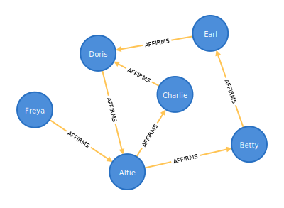

## Abstract
We need a truly decentralized alternative to KYC for when we need to establish the authenticity of a wallet or make some judgement about its trustworthiness in a systematic and repeatable manner. This CIP defines a mechanism whereby any member of the community can publicly vouch for the authenticity of a wallet by submitting an "affirmation" transaction, it also provides a mechanism to revoke such an affirmation, if, for example a wallet becomes compromised, or its owner turns out to be a charlatan. 
It is consequently possible to observe the current UTxO set and draw an "Affirmation Graph", a multidigraph representing the trust relationships between wallets - we can then use an algorithm to assign trust rankings and decide whether or not to trust an unknown wallet.



## Motivation: why is this CIP necessary?
When transacting with an unknown person, currently if we want to make sure we're not dealing with a bot or a grifter, we have to perform our own detective work - examining their current token holdings and transaction history, then we make some informed guess about what we're dealing with. This is both laborious and inconsistent. This CIP aims to provide a better alternative which is repeatable and automatable, this could drastically reduce the risk of fraud and accidental loss of funds.

Now that we are in Cardano's Voltaire era; governance is top of the agenda, it would be really nice to be able to hold ballots where each community member gets an equal vote - true democracy requires it. Currently all voting is stake-weighted - ie. 1 Ada = 1 vote - this results in a plutocracy, not a democracy. In order to deliver a fair democracy, we must have some way of identifying unique individuals. Traditionally this would be done with KYC - each voting participant would be required to identify themselves with some form of government ID - however, this relies on a central authority having issued the ID, and another central authority verifying it. It also excludes people who wish to (or must) remain anonymous for whatever reason, as well as those who may not have any government ID, perhaps because they are stateless. 

If we are to bank the unbanked, we should also provide ID for those who have none.

In this CIP we propose a simple, truly decentralized mechanism for identity verification and trust.

### Why does this require a CIP? 
We are aiming to create a scheme which is generic and becomes the accepted standard for registering your affirmation of a particular wallet, such that everyone may participate and we can be sure that there is one definitive affirmation graph for the blockchain and that all affirmation transactions will follow a consistent format. As such, a defined standard that everyone can follow is necessary - a CIP is the way to acheive this. 

To that end, a smart contract conforming to this specification has been defined which attempts to be the most simple and generic possible.  No fee is required (aside from the inherent blockchain fees), the smart contract contains nothing specific to the author's websites or implementation. It is designed so that it can be integrated into any blockchain explorer, wallet or dApp. It is expected that the majority will use this generic smart contract, but it's also possible to define your own smart contract that is compliant with this CIP - it must meet the specific requirements detailed below.

## Specification
[v1 of the affirmation contract](https://github.com/kieransimkin/affirmation-graph/blob/main/validators/affirmation.ak)  

Definitions:  
`target` - the recipient of the affirmation  
`source` - the creator of the affirmation (the person or entity who is vouching for them)  
`target hash` - if the `target` is a normal wallet, this should be their stake key hash. If the `target` is a script, this should be the script hash  
`source hash` - if the `source` is a normal wallet, this should be their stake key hash. If the `source` is a script, this should be the script hash  
`affirmation contract` - any smart contract which conforms to this specification (details below)  
`contract hash` - the hash of the `affirmation contract`  
`affirmation address` - An address where the spending part is `contract hash` and the delegation part is `target hash`  

An affirmation consists of a UTxO at the `affirmation address` with an inline datum containing the `source hash`. To be valid, this UTxO must contain one token minted by the `affirmation contract`, and the `affirmation contract` itself must be valid as defined below:

A valid `affirmation contract` _MUST_ allow minting exactly one token at a time. In order to mint:  
  - it _MUST_ ensure that it receives a signature matching the `source hash` or is otherwise authorized by `source`, 
  - it _MUST_ ensure that the output containing the newly minted token contains an inline datum with a matching `source hash` and 
  - it _MUST_ ensure that this output it sent to an address where the spending part is equal to the `contract hash`.

In order to enable revokation, the contract should allow spending. When spending, the contract:  
  - _MUST_ ensure that it receives a signature matching the `source hash` in the datum, or is otherwise authorized by `source` and 
  - _MUST_ ensure that exactly one token matching the `affirmation contract`'s policy ID is burned. 

A generic `affirmation contract` has been provided which meets these requirements - you should use that unless you have specific requirements which are not met by that script.

It should be noted that if you do write your own custom `affirmation contract`, your affirmations will not automatically be picked up by the [affirmation graph indexer](https://github.com/kieransimkin/affirmation-graph-index) - this is because the indexer maintains a list of known valid affirmation contracts. If you wish to add your contract to the list you should submit a pull request to the indexer repository in which you must prove that your contract meets the requirements detailed above - only then will your affirmations be included in the global Affirmation Graph. If in doubt, simply use the generic affirmation contract that has been provided as part of this CIP unless you have a good reason not to. 

MeshJS (the Typescript Cardano library) [has been updated](https://github.com/MeshJS/mesh/commit/fbfc8dd922ddf4c4df0d59f5fbd4f260af34da5d) so that it knows how to build these transactions, so you can do it in one easy step if you're in TS/JS. [A Python implementation](https://github.com/kieransimkin/affirmation-graph/blob/main/examples/affirm.py) is also available. 

### Datum specification 
```cddl
keyhash = bytes .size 28
datum = #6.121([keyhash])
```

Example datum as JSON:

```json
{
    "constructor": 0,
    "fields": [
        {
            "bytes": "4ec65f9ad80492c187df2d9d7428d5c1fef10de7687cdf9356170816"
        }
    ]
}
```

### Versioning
This is version 1 of the affirmation graph specification - any material change in the specification will necesssarily require a new smart contract, which will result in new set of `affirmation addresses`. Consequently an affirmation contract will always target a specific version of the specification. Any new version of this specification should be separately defined in its own CIP.

## Rationale: how does this CIP achieve its goals?
It could be argued that, with enough Ada, it is always possible to create many wallets and then submit affirmations for yourself - thus returning the system to being weighted by how much Ada you have - however, this would be a failure to understand the purpose of a decentralized Affirmation Graph - in a this regime, each individual person is responsible for interrogating the graph to establish a trust score for a particular wallet - but they have complete freedom on how they choose to interpret the graph - for example, you could decide to only trust wallets that have been affirmed by a specific person (perhaps yourself, or a person you know who has affirmed a lot of people and whose judgement you trust), or only trust wallets that have a minimum number of affirmations from anyone, or you could specify that at least two of your friends must have affirmed a wallet. You could even require that a centralized KYC provider has affirmed a wallet - this would allow actual KYC gating in a semi-decentralized manner - multiple KYC providers might exist, and you might choose to give a higher trust rating to some than others, perhaps depending on how thorough their ID verification process is. Other providers might exist which offer affirmations in return for proving you own a unique Facebook or Google account. 

It is expected that there could be a flood of services offering affirmations in return for jumping through any number of different hoops. It is also expected that mutual affirmations will be offered; "I'll affirm you if you affirm me". Stake pools might choose to offer affirmations in return for keeping your delegation with them for some amount of time. None of this does any harm to the value of the graph since we can design our algorithms to sift through the data and derive whatever meaning we please from it - the more we expand the size of the graph, the more we have to work with.

I would also suggest that affirmations should be given in return for certain "good citizen" behaviours - for example, affirmations could be given to Catalyst participants upon successful completion of their project milestones. Affirmations could also be given in return for participation in voting events, or in return for helping moderate Catalyst proposals. SPOs could receive affirmations in return for upgrading to the latest node version - any behaviour which we wish to incentivise could be rewarded with affirmations - this provides a great way to incentivise good behaviour, whilst also allowing us to judge wallets based on their behaviour.

The algorithms for interpreting the graph are expected to become numerous and varied - some examples will be provided as part of the Affirmation Graph toolchain, and users will be free and encouraged to build their own and contribute them back to the library. These algorithms will function by assigning a trust score to a wallet, based on a set of weighted judgement criteria - different algorithms will assign different weights to affirmations depending on where they came from. For example, an algorithm that requires KYC verification would assign positive weights to known KYC providers, and zero weights to all other affirmations. A "trust my friends" algorithm could measure each affirmer's distance from yourself on the graph, and weight affirmations from people close to you on the graph highly, with an exponential fall-off as the affirmer is an increasing number of steps away from you on the graph. 

Wallets could choose to display a trust score whenever they prompt you to sign a transaction - this could help users identify if they're dealing with a potential scammer, before they send them Ada. Since smart contracts can also receive affirmations, and consequently can be given a trust score, wallets might also decide to display this score every time you interact with a smart contract.

### Could this amount to a form of social credit scoring?   
Well, you could describe it that way, but the biggest problem with social credit is that it's decided by a centralized authority - there's no centralized authority here, it's an egalitarian collective. I think of it as similar to the way we all have an understanding of how reputable we consider a given person - some of that will be biased by our own position, but some people will be fundamentally more "reputable" than others, we all have an instinctive understanding of who we consider these people to be. There is, perhaps, a danger in making something like reputation so publicly visible - generally these reputation judgements are something we do so regularly in real life that it's an unconscious process a lot of the time, and we're often not even immediately aware of why we've judged a certain person as untrustworthy or not. The Affirmation Graph does still give you the privacy of your own judgements though as there's no way to know what criteria you're basing your decisions on. The only thing thing you're sharing publicly is the set of wallets you endorse - this is really no different to a public friend or follow list like you have on most social networks. 

This system allows even a user who wishes to remain completely anonymous to develop a reputation and gain a trusted rating, even if they do not not wish to prove their indentity in any way - if they have an online persona, there will be people willing to affirm them based on that persona alone. Plus, they may accrue affirmations by displaying good behaviour if such behaviour is rewarded by affirmation as suggested.

This CIP is fundamentally about linking the social graph with the blockchain, so that you can have the same level of confidence that you're dealing with a real human-being as you do on Facebook or X. While this is never 100% certain, I would argue that most people can tell the difference between a real human or a bot on social media with a high degree of accuracy - we need to acheieve a similar level of confidence in our judgements about whether or not we trust a wallet on the blockchain. Only then can we have a hope of implementing 1-person-one-vote and having any meaninful form of democractic system - and that's the end goal; to enable Cardano governance to be truly democractic by removing the biases of stake-weighted voting, and instead move to something more closely representing 1 person = 1 vote.

We would also have the option of implementing a true meritocracy where a user's voting power is actually weighted by their trust score - so instead of 1 person = 1 vote, we'd actually give stronger weight to those with very high trust ratings - this would work particularly well in a scenario where we were rewarding good behaviour with affirmations, but there would potentially be a risk of power being centralized among a few very highly trusted individuals - for example if we rewarded Catalyst participants for meeting their milestones, we could find that regular Catalyst participants received very high trust ratings which enabled them to outvote everyone else. We'd therefore have to carefully design the weighting algorithm to avoid this - it may be simpler to stick to 1 person = 1 vote, and simply require a minimum trust score threshold in order to verify that a wallet represents a unique person. 


## Path to Active

### Acceptance Criteria
- [ ] Implementation of "Affirm this wallet" button in a couple of third-party dApps
- [ ] The mainnet graph needs to have a good number of affirmations in it

### Implementation Plan
- [X] Design and test [the smart contract](https://github.com/kieransimkin/affirmation-graph/blob/main/validators/affirmation.ak) along with its [transaction builders in Typescript](https://github.com/kieransimkin/affirmation-graph/blob/main/examples/affirm.mesh.cjs) and [Python](https://github.com/kieransimkin/affirmation-graph/blob/main/examples/affirm.py)
- [ ] Get feedback on the smart contract with a view to permanently setting it in stone 
- [ ] A React control to enable blockchain explorers and dApps to easily add an "Affirm this wallet" button.
- [ ] Implement "Affirm this wallet" into [Cardano Looking Glass](https://clg.wtf/)
- [ ] Build out [a specialized chain indexer](https://github.com/kieransimkin/affirmation-graph-index) to enable queries on the graph.
- [ ] Create the first examples of trust scoring algorithms
- [ ] A React control for visualising the graph as a network diagram.
- [ ] Build a service which offers affirmations in return for KYC.

## Copyright
This CIP is licensed under [CC-BY-4.0](https://creativecommons.org/licenses/by/4.0/legalcode).

