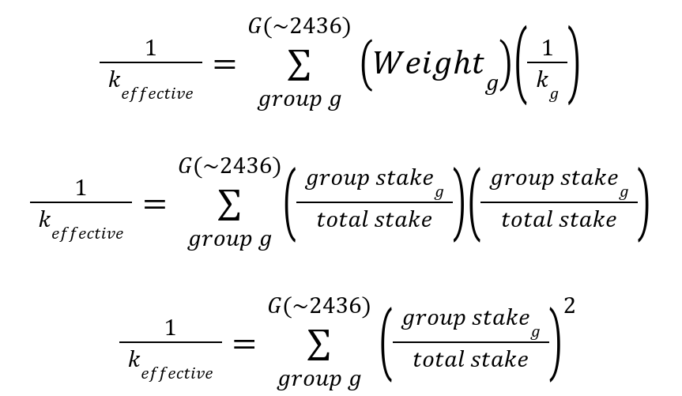
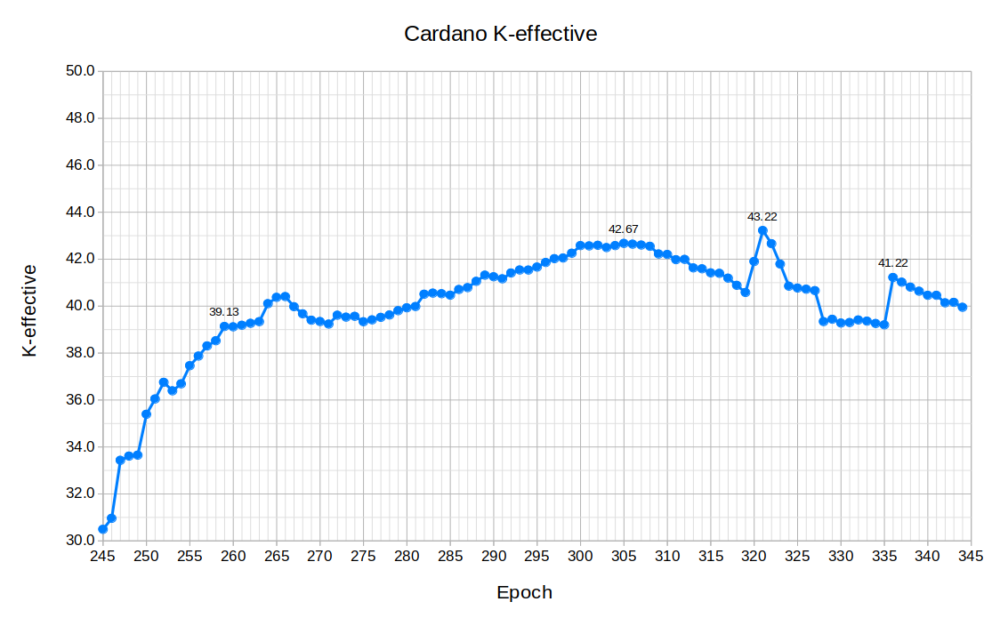
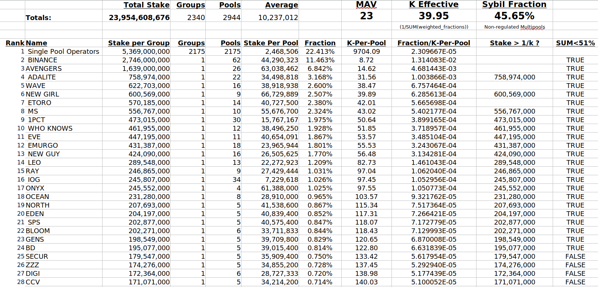

# List of Potential Reviewers:

- Lars Brünjes
- Aggelos Kiayias
- Elias Koutsoupias
- Aikaterini-Panagiota Stouka
- Charles Hoskinson
- Shawn McMurdo
- Tobias Francee
- Colin Edwards
- Tim Harrison
- Tom Stafford
- Francisco Landino
- Mark Stopka

# Abstract

Improving decentralization is absolutely necessary for the long term health and growth of the Cardano ecosystem. The current reward formula has resulted in a stable but stagnant level of decentralization. With the benefit of hindsight over the last year the intent of (a0, k) has not resulted in the desired decentralization outcome. This CIP provides the justification, methods, metrics, and implementation schedule for an improvement program to increase decentralization of the Cardano network.

The proposed reward equation retains the function of k for diminishing rewards based on stake but repurposes the a0 parameter for enforcing diminishing rewards based on pledge leverage. The proposed equation enforces a set of principles to ensure stakeholders of dramatically different size can all reach the same maximum yield. The yield ceiling feature prevents the formation of two classes of stakeholders and removes some of the benefits of centralization. The economic motivations of the largest stakeholders will be aligned with decentralization, reward diversification, fault tolerance, and ensuring the sybil protection of the entire community.


# Motivation

Improving decentralization is absolutely necessary for the long term health and growth of the Cardano ecosystem. The current reward formula has resulted in a stable but stagnant level of decentralization. The motivation is to provide the justification, methods, metrics, and implementation schedule for an improvement program to increase decentralization of the Cardano network.

K and a0 are input parameters to the reward formulation designed to promote decentralization. The original intention for parameter k was for it to set a ‘soft-cap’ on a pool’s size and thereby encourage the system to converge toward k pools of equal size delivering equal return per unit of stake for all delegates. In the ideal world this would mean k pools that are roughly equally saturated producing a roughly equal proportion of the blocks [1]. An underlying assumption was that one entity would run only one pool and design discussions about these parameters have described running multiple pools as a form of Sybil attack [2].

However, the input parameters have not achieved these goals. Currently there are single entities that run 10,20,30 or even 62 separate pools. It is proposed that the “average resulting decentralization” should be measured based on the stake held by entire entities/groups, rather than a count of individual pools. “k-effective” is hereby used to measure the “average resulting decentralization” and is computed using Equation 1.

The Cardano network currently produces ~21,600 blocks per epoch with ~2400 groups producing between 0 and ~3600 blocks per group. If averaged, 41 equal sized groups would each be creating ~527 blocks per epoch. The historical decentralization of the network shown in Figure 1 has improved from 30.0 in epoch 245 to between 39.0 and 43.0 after epoch 260. This “effective decentralization” or “k-effective” is not even close to the 500 figure targeted by the current k=500 parameter. A partial example of the table used to compute k-effective is shown in Figure 2.

(1) https://iohk.io/en/blog/posts/2020/11/05/parameters-and-decentralization-the-way-ahead/

(2) https://iohk.io/en/blog/posts/2018/10/29/preventing-sybil-attacks/




Figure 1. Historical k-effective from epoch 245 to present.




## The Intent of (a0,k)

To cite Aggelos Kiayias, Chief Scientist of IOG:

> “Central to the mechanism’s behavior are two parameters: k and a0. The k-parameter caps the rewards of pools to 1/k of the total available. The a0 parameter creates a benefit for pledging more stake into a single pool; adding X amount of pledge to a pool increases its rewards additively by up to a0*X. This is not to the detriment of other pools; **any rewards left unclaimed due to insufficient pledging will be returned to the Cardano’s reserves and allocated in the future**.” [3]
 
> “Paired with the assessment of stake pools performed by the delegates, **this mechanism provides the right set of constraints for the system to converge to a configuration of k equal size pools with the maximum amount of pledge possible**.” [3]
 
The analysis of the current reward formula in [4] equated 1 pool to 1 entity. In the real world 1 entity can choose to delegate to another entity, operate one pool, **or operate many pools**. This oversight in the original analysis contributed to the proliferation of multipools in defiance of k parameter increases.

(3) https://iohk.io/en/blog/posts/2020/11/13/the-general-perspective-on-staking-in-cardano/

(4) https://arxiv.org/ftp/arxiv/papers/1807/1807.11218.pdf

## The Current Reward Formula

From “4.1 Our RSS construction” of “Reward Sharing Schemes for Stake Pools” [5] the current rewards equation is:


where:
λ’ = min{λ,β}, σ’ = min{σ,β} and β,α are fixed parameters.
A natural choice is β = 1/k, where k is the target number of pools.
and the following are current protocol parameters:
k = 500
α = a0 = 0.3
 
The a0 parameter represents the fraction of the rewards (R/(1+a0)) which are not paid out unless all of the stake is pledged. An a0 of 0.3 ensures that 1-1/(1.0+0.3) = **23% of the total rewards R will be withheld from low pledge fraction pools and returned to the reserve**. The effect of this formula is that increased pledge results in retaining more of the available rewards R. However, this benefit is not linear, rather it is drastically biased towards the saturation limit. The σ’ = min{σ,β} term enforces diminishing rewards based on k. Visualizing the resulting field of outcomes at various pledge amounts from 0.00% to 100.0% is necessary. The red dotted line “Max Reward” represents the maximum available yield available from R at current network stake size.


## If the minimum fee is 30


## If the minimum fee is 0


## If a0 is increased to 0.5


## If a0 is increased to 1.0


## If a0 is decreased to 0.2


## If a0 is decreased to 0.1


## If a0 is decreased to 0.0


## If a0 is decreased to 0.0 and minFee = 0


## The Reality of (a0,k)

The intent of parameters (a0, k) has not been realized. The graph of k-effective shows that increasing k from 150 to 500 did not result in a proportional increase to decentralization. The k parameter is currently 500 / 41 = 12.2 times larger than the effective decentralization k-effective.

Another important determinant of the ability for small pools to compete with larger pools is the mandatory minimum fee (minFee parameter) which is currently 340₳. This minimum fee is a higher percentage of the total rewards for a small pool compared to a larger pool. It means that delegator yields for a small pool will not exceed 4% until the pool has at least 10% saturation (currently ~6.8M₳). This is a significant barrier to entry for small pools.

Billions of ADA is currently staked in pools with nearly 0 pledge and extremely high leverage. Also, a billion ADA is currently pledged in nearly saturated private pools closed to community delegation. There are very few public pools accepting community delegation with pledge amounts between 5M₳ and 60M₳ and the vast majority of public pools have less than 1M₳ pledge. The following chart shows the distribution of stake as a function of group leverage on a log(Leverage)-log(Stake) scale.


In the original design, parameter a0 represented the influence the operator’s pledge had on the desirability of the pool. In other words, more pledge should mean the pool would be more desirable for stake delegation. However the current reward formula has not produced this effect. See Figure 2. With increasing pledge as a proportion of total stake there is little noticeable effect on rewards until very high pledge percentages. These very high pledge percentages are not attainable except by extremely large stakeholders. Furthermore having such a high pledge percentage would defeat the purpose of staking since the pool would already be saturated when the maximum pledge benefit is earned.

The reality of the past 18 months is that pool operators have split pledge across multiple pools because it is more profitable to earn fees (minFee + margin%) than it is to benefit from increasing their pledge to a single pool. The small increase in yield for pools with less than 10M₳ pledge is also much less than the random statistical uncertainty of rewards per epoch. The current reward equation has sacrificed fair egalitarian rewards for an incentive that is not providing Sybil protection as intended.

## The SundaeSwap Effect

The SundaeSwap Initial Stake Offering (ISO) proved that community delegator stake can be very mobile. More than a couple billion in stake centralized into ISO groups. After realizing the popularity of their ISO resulted in a centralization of the network SundaeSwap launched a ‘Reverse’ ISO for the benefit of single pools. The RISO temporarily reversed the centralization trend as a billion ADA was delegated to small pools. The Cardano network reached a decentralization factor of 43.22 in epoch 321. After the RISO these decentralization gains reversed because the underlying incentives of the reward formula have not changed. This proves that the community is engaged and their stake is mobile, especially for yield and gains.

## a0: The pledge yield boosting parameter

An intentional design of the current reward equation is to purposefully allow large stakeholders pleading to private pools to earn the maximum possible yields while excluding community delegation. The vast majority of pools with pledge <10% stake saturation have an asymptotic yield currently approaching a maximum yield of 4.25%. A high pledge fraction in a private pool can earn up to the maximum available 5.5% yield, 30% more yield than low pledge community pools. 

The R/(1+a0) term guarantees that small pools will not earn the same fraction of the reserve as large pledged pools. Currently, approximately 1.25B₳ is earning full rewards in 19 pools. If left unchanged over time custodial wealth management companies will be able to offer materially higher yields than individuals. Wave financial is an example of a company currently providing this business model to clients. Eternl/ccvalut is introducing multi-signature features to allow many individuals to collectively pledge to pools. Over time this difference results in two different classes of stakeholders and erodes the decentralized self-custodial appeal of Cardano.

## The danger of ‘just increase k’

Forcing the k-parameter to be radically different from the effective decentralization, k-effective, of the network has resulted in unintended consequences. Large differences between k-parameter and the k-effective of the network represents a stress on the current state of the network. A k-effective of >100 with an adjustable k-parameter of ~2*k-effective is a numerically justifiable long term goal.

When k was increased large groups created new pools to retain delegators. More pools in the hands of a smaller number of groups does not improve decentralization and in fact takes more time and network resources to propagate the blockchain to more relays and nodes. If the k-parameter is increased without updating the rewards formula, more large stakeholders will be able to earn full yields by pledging to private pools excluding community delegation.

# Specification

## Statement of Principles

“Principles matter.” -CH

1. Everybody in the community should be treated fairly from tiny starfish delegators (1-2k₳) to massive blue whales (>100M₳) and exchanges.
2. Everybody in the community should have the opportunity to on average earn the same yield and there should not be two classes of stakeholders.
3. There should be a very clear cause and effect relationship between the (a0,k) input parameters and the resulting K-effective decentralization.
4. The a0 input parameter must require, not incentivize, pool operators to pledge to support community delegation and sybil protection.
5. The decentralization result will be quantified in terms of group decentralization of block production, not stake saturation relative to pools.
6. Implementation should be smooth, easy, clear, and beneficial for all stakeholders and operators.
7. A new reward equation should be computationally simple and elegant.

## The Proposed Reward Formula

The proposed reward Equation 2 retains the function of k for diminishing rewards based on stake but repurposes the a0 parameter for enforcing diminishing rewards based on pledge leverage. The equation equally balances both diminishing reward parameters. Instead of a0 ranging from 0.0 to 1.0 the a0 parameter is intended to range from 100 down to 1. An a0 value of 100 would require pools to pledge 1% of stake and an a0 of 1 would require all pools to be 100% pledged.


Equation 2 is computationally simple and purposefully does not use logarithms, exponents, or geometric curves. Instead of an incentive based tradeoff between egalitarian rewards and a perceived Sybil resilience Equation 2 enforces both egalitarian rewards and pledge-based Sybil resilience.

# Rationale

## Recast of a0

The a0 parameter will be redefined to establish a maximum pledge leverage before diminishing rewards, similar to the k parameter for pool size. The recast a0 parameter enforces the principle that pledge is absolutely required to support community delegation. This change will directly align the a0 parameter for protecting the network from Sybil attacks. Pledge will not be a statistically unnoticed slight incentive used only by large private stakeholders. Community governance to reduce/adjust a0 would be the preferred mechanism to constrain sybil behavior. 

The new a0 parameter will range from 100 to 1. The initial value of the maximum pledge leverage ratio a0 should initially be set conservatively high at 100 and optionally decreased slightly over time to a healthy equilibrium by community governance. At (a0=100, k=500) approximately 680k₳ pledge would be required to support a fully saturated pool. 

## The new reward equation

The proposed reward formula should be visualized on a log(saturation)-linear(yield) scale independent of k. Figure 3 shows the field of possible outcomes for various levels of pledge and stake spanning more than 3 orders of magnitude. The effect of a recast a0 becomes obvious, pool saturation will be limited first by pledge amount and then eventually by k. A very important feature of this relationship is that 0₳ pledge will always result in 0₳ rewards. At a0=100 to support a 100% saturated stake pool 1% pledge will be required.


## The new reward equation without a minimum fee


## The new reward equation zone


## The yield ceiling

Equation 2 is purposefully designed so that stakeholders of dramatically different size can all reach the exact same maximum reward R. The yield ceiling feature prevents the formation of two classes of stakeholders and removes the economic benefits of centralization. The yield ceiling is the ‘egalitarian reward’ described but not implemented by the original paper.

With the minFee < 30 once a pool grows to >0.5% of saturation the intermittent rewards will, on average, provide a competitive yield for delegators at >5.0%. At k=500 and a0=100 this corresponds to a pool size 500k₳ with a minimum pledge of only 5k₳. The yield ceiling is also compatible with a potential future implementation of the Conclave collective stake pool concept. Because of the yield ceiling large collective stake pools will only provide more predictable returns, not a materially larger yield which would compete with smaller independent pools.

## A small pool advantage

The winners of block forks and slot battles are determined by which pool has a lower VRF score. If multi-pool operators consolidate to improve network efficiency and reduce operating costs a slight advantage will be in favor of all smaller pools. Smaller pools will also have a slight advantage against future collective stake pools. This advantage is not well known but it does slightly bias in favor of smaller pools.

## The economic motivations of large stakeholders and collective pools

The new formula will not decrease the yields of any large stakeholders pledging to private pools. Large ADA stakeholders such as exchanges, liquidity pools, or smart contracts would not be required to pledge a vast majority of those holdings to earn yields currently only achievable with fully pledged pools. The only economic motivation remaining for groups with large stake including founder(s), founding organizations, exchanges, investment capital, trusts, and venture capital would be to secure diversification and enhance the value of the entire network by dividing delegation.

The large stakeholders who are able to divide their stake to dozens of pools will also achieve more reward diversification and fault tolerance than self-operating a small number of private pools. A number of wallets including Eternl/ccvault are offering the capability to divide stake delegation to many pools. This design decision aligns the interest of the largest stakeholders with the interests of the whole community.

## Relevant prior CIP proposals and drafts

1. https://cips.cardano.org/cips/cip7/
2. https://github.com/cardano-foundation/CIPs/pull/163
3. https://github.com/cardano-foundation/CIPs/pull/229 
4. https://forum.cardano.org/t/cip-leverage-based-saturation-and-pledge-benefit/95632
5. https://forum.cardano.org/t/cip-change-the-reward-formula/33615
6. https://forum.cardano.org/t/an-alternative-to-a0-and-k/42784

## Methods and paradigms for equation validation

To validate any reward equation simulations must consider that an entity can choose to delegate to another entity, operate one stake pool, or operate many stake pools. Any new equation should be compared to the current equation with a0=0.3 and the current equation with minFee=0, a0=0.0. A large number of entities (>100) should be simulated for each trial of each equation. Additionally, during each epoch of each simulation for each equation block production could be sampled from a normal distribution. Block production and rewards have statistical uncertainty.

```
Each equation:
  Each epoch:
    sample block production (rewards) per pool from a normal distribution
    Each entity may choose to:
      create/retire 1 or more pools
      adjust the fee/margin structure of their pool(s)
      delegate to the pool of a different entity
```

For each equation in consideration the average (and variation) of the nakamoto coefficient, k-effective coefficient (or an entity/group based equivalent), and a sybil coefficient shall be computed for every epoch until conclusion. It is likely that the nakamoto coefficient will be approximately half of k-effective. The sybil coefficient would quantify the fraction of stake controlled by all entities operating multiple pools.

# Backwards compatibility

Implementation will occur in two distinct phases with the first phase being only parameter changes requiring no hard fork. During this first phase any changes will be reversible. The second phase will require a hard fork.

# Path to Active

The implementation of this proposal must be slow, smooth, staged, deliberate, and well communicated through advertising and education. Each change in the implementation schedule should include clear communication to the community on expectations. Transparent education on how the parameters will work and the effect on rewards is important.

1. Get statements of support from a large fraction of the Cardano community.
2. Reduce minFee from 340₳ to 0-30₳.
3. Wait 5 to 10 epochs, measure decentralization, gather community feedback.
4. Get more statements of support from a larger fraction of the Cardano community.
5. Reduce a0 from 0.3 to 0.2.
6. Wait 5 to 10 epochs, measure decentralization, gather community feedback.
7. Reduce a0 from 0.2 to 0.1.
8. Wait 5 to 10 epochs, measure decentralization, gather community feedback.
9. Reduce a0 from 0.1 to 0.0.
10. At this point the influence of the large stakeholder pledge yield boosting parameter a0 will be eliminated and the yield curve will have a flat fair ceiling at ~5.5%.
11. Wait 0 to 10 epochs, measure decentralization, gather community feedback.
12. Reduce k from 500 to approximately 2-3 times K-effective. Allow multipools and large groups time to consolidate pledge and delegation. Group consolidation will not decrease decentralization of group block production, will improve network efficiency, will allow for unifying pledge, and make life easier for operators. It’s a rare win-win-win.
13. Wait 5 to 10 epochs, measure decentralization, measure pledge concentration, and gather community feedback.
14. HARDFORK implementation of the new formula enforcing pledge leverage diminishing returns ( a0 = 100, k = 3.0*k-effective ).
15. Measure decentralization, gather community feedback.
16. Adjust a0 and k by 5% at most every 10 epochs until the end of Voltaire.
17. After Voltaire adjust a0 and k annually/bi-annually by community vote.

# Copyright

Copyright 2022 Michael Liesenfelt

This CIP is licensed under  [CC-BY-4.0](https://creativecommons.org/licenses/by/4.0/legalcode)

# Conflict of Interest Declaration 

The author is employed full time as a Research Assistant Professor in Nuclear Engineering at the University of Tennessee, earns no revenue from the Cardano ecosystem, does not operate a stake pool, is not seeking Cardano Foundation stakepool delegation support, and owns 23k ADA delegated to the THOR stake pool.
