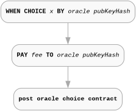
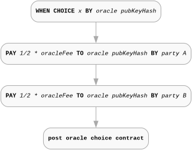
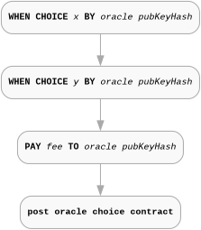
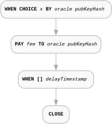

## Abstract

Smart contracts running on Cardano require access to external data of various kinds from oracle providers: exchange rates between crypto- and fiat currencies; “real world” data, such as weather information; information of significance for betting and gaming apps, including details of play from sporting events; and, not least, reliable and secure sources of randomness. Current Cardano oracles primarily publish (we call this "push" model from now on) a fixed repertoire of data on-chain, critically limiting their ability to provide the range and depth of data outlined above. Additionally access and usage of this data is non trivial - it requires a Plutus smart contract which through reference can properly read and verify the authenticity of the published data. The specific format is non standardized and can be different for different oracles.

This CIP describes a more flexible, transparent and composable oracle solution for Cardano, based on the Marlowe smart contract language, using the `Choice` and `Pay` constructs in Marlowe to deliver the oracle value within a running smart contract and perform a fee payment for the service. This data point can be available to other Cardano other smart contacts, whether written in Marlowe, Aiken, Plutus or other languages.

## Motivation: why is this CIP necessary?

External data is used within the vast majority of smart contracts running on blockchain, and provision of this data by oracle providers is essential to these contracts running effectively and securely. The “push” model of data provides an ~80:20 solution: 80% of needs are satisfied by a limited set of data feeds, particularly those based on DeFi information of various kinds; it is, however, unable to service the “long tail” of potential demands for data of a more specialized kind, and to do this in practice a “pull” model of data provision is required. In here by "pull" we mean a model where the smart contract can request on-chain a specific data point from an oracle provider.

The mechanism outlined delivers data through the `Choice` construct in the Marlowe smart contract language. Executing an instance of this construct in a running contract delivers an external integer value that can be directly accessed within the contract, and also be made available for use by other smart contracts on Cardano.

For this approach to work in practice, this CIP needs to address the following high-level questions:

* How to identify what data is requested, and from which source, including an access mechanism for the source.
* How results of oracle requests are rendered for use within Marlowe.
* How results are made available on-chain to other Cardano smart contracts, including information about the data source, format and rendering.
* How the results of particular instances of data requests are identified, both within and outside running Marlowe contracts.
* The security model assumed by the oracle protocol.

These high-level questions are answered in the next section, together with a discussion of implementation-related issues such as timeouts and error handling, and potential extensions of the protocol, such as access mechanisms.

## Core protocol

This section describes the minimal core of the Marlowe Oracle Protocol, focusing on essential mechanisms for requesting and delivering oracle data via Marlowe's `Choice` construct. Optional features and extensions are detailed in the subsequent section.

### Assumptions

* No distinction is made between the data source and the oracle provider. In future versions of this protocol, this distinction may be possible.
* [CIP-26](https://cips.cardano.org/cip/CIP-26) or IPFS or any other mechanism for storing and retrieving data off-chain is used. We are not prescriptive about this.
* We take a pragmatic approach to trust, assuming that users of the system are able to identify trustworthy oracles for themselves. Specifically, the protocol allows tracking and ranking of oracles based on their performance or misbehaviours, but does not propose a mechanism for this. This is a topic for future work.

### Oracle query

#### Marlowe `Choice` construct

The Marlowe Oracle protocol is based on using the choice mechanism in Marlowe, by which choices “external” to a contract are made available to the contract. The Marlowe construct that handles external actions is `When`, which selects between a number of `Case`s. Each `Case` is triggered by an `Action`: in this case the `Choice` action. On that action happening, the continuation contract is initiated; if no action is made before the timeout, the fallback contract is initiated: in a few places for the simplicity sake we assume that the fallback contract is just `Close` contract. `Close` simply ends the execution by distributing the funds locked in the contract to the participants according to the internal accounts state. The fallback contract could implement more complex logic than `Close` and the protocol does not impose any restrictions on it.
The relevant Marlowe syntax constructs are (eliding irrelevant constructors):

```haskell
data Contract = … | When [Case] Timeout Contract | …
data Case     = Case Action Contract
data Action   = … | Choice ChoiceId [Bound] | …
```

Choices are identified by a `ChoiceId`, which combines a `ChoiceName` – a `ByteString` – with a `Party` to the contract. On forming the action, a set of `Bound`s are given that constrain the `Integer` value to be chosen.

```haskell
data ChoiceId   = ChoiceId ChoiceName Party
type ChoiceName = ByteString
data Bound      = Bound Integer Integer
```

The `ChoiceId` construct is used to describe an oracle value:

* The `Party` is `PubKey pkh`, where `pkh` is the hash of a public key for the oracle that is the source of the data. Only the owner of corresponding private key can deliver the data. Marlowe interpreter will verify a signature under the transaction which provides the `Choice` value.

* The `ChoiceName` `ByteString` is used at minimum to precisely identify the data requested so the oracle can provide them in a consumable by the contract form.

#### Query context

The pair of `Party` and `ChoiceName` is sufficient to specify an oracle request - it securely and uniquely identifies the oracle and the data requested. The `ChoiceName` (a `ByteString`) must precisely identify the data so the oracle can provide it in a form consumable by the contract (as an `Integer`).

Additional context (e.g., resolution details, human-readable descriptions) may be embedded in the `ChoiceName` or referenced externally, but these are optional and covered in Protocol Extensions.

#### Direct and reference queries

The query and the metadata represented by the `ChoiceName` should be a UTF-8 encoded string prefixed with an ASCII-encoded identifier to distinguish its type. This string can either directly contain the query details as a CSV (Comma-separated values) format or serve as a reference to an external, immutable location where the full CSV query is stored. This dual approach balances expressiveness with on-chain efficiency, allowing large queries to be referenced without bloating transaction sizes.

To distinguish between a direct query and a reference:

* Direct query: The string starts with an integer version field (e.g., 1,query_value,...), which distinguishes it from prefixed references. Parse it as CSV and validate against the structure below.

* Reference: The string starts with an ASCII-encoded prefix: https:// or ipfs:// (followed by the rest of the URI), or sha256: (followed directly by the raw 20-byte prefix of the SHA-256 hash of the full CSV query). In the case of a hash reference, the full query must be resolved out-of-band (e.g., via a known registry, off-chain tooling, or user-provided content), and its SHA-256 hash must match the referenced prefix for verification; tooling should display the raw bytes as hexadecimal for readability. For URI schemes, fetch the content from the specified location and verify its immutability (e.g., by hashing and comparing to an embedded or expected value).

In both cases, the resolved content must conform to the CSV structure described below. References must be content-addressable to ensure immutability and tamper-resistance. Oracle providers and users are responsible for making referenced queries accessible and verifiable.

#### Query structure

```
version, data_query, ...
INT,     ANY, ...
```

* The required fields are `version` and `data_query`. Empty fields are not permitted in the core protocol.

* The `version` field contains an integer representing the protocol version (current: `1`). This allows future extensions without breaking existing queries.

* The `data_query` contains a query to the data source, such as a URL-encoded query string, CSV-escaped JSON object, or CBOR hex value.

* `Query` allows to include additional three optional fields as described in Protocol Extensions.

* `Query` can also include any number of additional custom fields at the end but after the all required and optional fields.

### Oracle request

#### The `Pay` construct

We already covered the first element of the request which is a `Choice` action. To make a request complete we need to provide a reward payment for the oracle. This can be expressed in Marlowe using the `Pay` construct.

```haskell
data Contract = … | Pay AccountId Payee Token Value Contract | …
```

So the simplest form of the payment itself could be expressed as:

```haskell
Pay (Party (PubKey fundingAccount)) (Party (PubKey oraclePkh)) ADA amount postOracleChoiceContinuation
```

#### Minimal request

The minimal request consists of a single `Choice` action followed by a single `Pay` action, all wrapped in a `When` construct to handle timeouts. The `When` construct waits for the oracle to make the choice within a specified timeout period. If the oracle does not respond in time, the contract proceeds with a timeout continuation. If the choice is made on time, the contract pays the oracle and continues with the post-choice continuation.

```haskell
When
  [ Case (Choice (ChoiceId "<Query or Query reference>" (PubKey pkh)) [Bound minValue maxValue])
         (Pay (Party (PubKey fundingAccount)) (Party (PubKey oraclePkh)) ada amount postOracleChoiceContinuation)
  ]
  timeoutContinuation
```

Where:
* `oraclePkh` is the public key hash of the oracle
* `fundingAccount` is some funding account from the contract.
* `ada` is the currency symbol for Ada
* `postOracleChoiceContinuation` is the continuation contract after the oracle choice is made and the payment is done.
* `timeoutContinuation` is the continuation contract if the oracle does not provide the data.

A schematic depiction with simplified pseudo-code of the minimal request is shown below:



#### Request variations

Because of pragmatical reasons (transaction fees, number of transactions etc.) as a part of the core protocol we allow two variations of the minimal request.

##### Split fee payment

Marlowe and the proposed protocol allows to split the payment into multiple payments so the oracle fee can be covered by multiple contract participants. For example a payment can be split into two equal parts paid by two different funding accounts:

```haskell
When
  [ Case (Choice (ChoiceId "<Query or Query reference>" (PubKey pkh)) [Bound minValue maxValue])
         (Pay (Party (PubKey fundingAccount1)) (Party (PubKey oraclePkh)) ada (oracleFee / 2)
           (Pay (Party (PubKey fundingAccount2)) (Party (PubKey oraclePkh)) ada (oracleFee / 2)
             postOracleChoiceContinuation))
  ]
  timeoutContinuation
```

Schematic depiction of that example:



##### Multiple choices

The request can also contain multiple choices to be made by the oracle before the total fee is paid. This can save the oracle resources as the whole action set can be processed in a single transaction.

```haskell
When [ Case Choice ...
        (When [ Case Choice ... (Pay ... (Pay ... postOracleChoiceContinuation))
                  timeoutContinuation
              ])
     ]
     timeoutContinuation
```

Schematic depiction of the multiple choices request is shown below:



The protocol allows mixing both variations - multiple choices and split payments.

### Data usage in Marlowe

The `postOracleChoiceContinuation` contract can use the value provided by the oracle in the `Choice` action. The value can be accessed using the `choiceValue` function:

```haskell
data Value
  = ChoiceValue ChoiceId
  | Constant Integer
  | ..

data Observation
  = ValueEQ Value Value
  | ValueGE Value Value
  | ValueGT Value Value
  ...

data Contract
  = If Observation Contract Contract
  | Pay AccountId Payee Token (Value Observation) Contract
  ...
```

In essence `Observation` is a boolean expression which can be used in control flow constructs like `If`. `Value` is an integer expression which can be used in conditional expressions but also to drive the cash flow through `Pay` constructs etc.

The choice value with a specific `ChoiceId` is stored at the datum level of the Marlowe validator and can be used in the `postOracleChoiceContinuation` contract through `ChoiceValue (ChoiceId "<Query or Query reference>" (PubKey pkh))`.


### Request discoverability and response execution

Given the structure of the request, an oracle can monitor the chain for UTxOs that match the request pattern in their datum. When such a UTxO is found, the oracle can verify that it contains sufficient funds to cover the payment and that the request is valid (contains valid query, proper bounds etc.). The oracle can then construct a transaction to provide the requested data and claim the payment. The whole response will be atomic encoded as single transaction. Both discovery and response will be facilitated by the Marlowe Runtime which exposes a regular REST API. Given that the whole procedure should not be resource intensive or impose significant developer burden.

## Protocol extensions

This section describes optional extensions to the core protocol, including additional query fields and advanced data sharing mechanisms. These are not required for basic oracle interactions but enhance flexibility, discoverability, and composability. Those aspects are very important in the context of a good user experience. The generic Marlowe diagnostic and validation tooling can provide better assistance and assurance to the users  if those suggestions are implemented. These are also important for cross-contract data sharing and verification.

### Extended query structure

The core Query can be extended with optional fields such as `data_source` (URI for provider verification), `data_endpoint` (URI for endpoint details and validation) and `resolution` (e.g., JQ expression for transforming data to Integer), and custom fields. These are appended to the CSV structure. If any of those fields is empty we require that all the fields are present but some can be empty (e.g., `,,` for two empty fields).

For example:
```
version, data_query, data_source, data_endpoint, resolution, ...
INT,     ANY,        URI,         URI,          (URI | JQ | ...), ....
```

* The `data_source` should contain a URI which identifies the data provider. This URI should be a URL which also allows to verify the public key hash of the oracle:

  * When visited directly (e.g., in a web browser), the URL should return an HTML response that provides identifying information about the data provider, such as its name, description, contact details, and optionally a list of associated public key hashes.

  * To perform a verification check for a specific public key hash (PKH), append a query parameter to the URL in the format `?verify=<PKH>`, where `<PKH>` is the hexadecimal-encoded public key hash to check or a base32 address format of that key with `addr` prefix.

    * For end-user verification (e.g., default HTML requests via a web browser), the response should be an HTML page clearly indicating whether the PKH belongs to the oracle (e.g., "Verified: This public key hash is associated with our oracle" or "Not Verified: This public key hash does not belong to our oracle"), along with any additional context or evidence.

    * For automated tooling (e.g., requests with an `Accept: application/json` header), the response should be a JSON object with at least the following structure: `{"verified": true/false, "message": "optional explanatory text"}`. Additional fields may be included for more details, such as timestamps or proofs.

  * Oracle providers are encouraged to support both response formats based on the client's `Accept` header, ensuring compatibility for both human-readable and machine-readable checks.

* The `data_endpoint` should contain a URI which identifies the data source endpoint. This URI should be a URL which allows users to access documentation about the data provided and to verify if a specific `data_query` is valid for that endpoint.

  * When visited directly (e.g., in a web browser), the URL should return an HTML response that provides detailed information about the endpoint, such as its purpose, supported data types, request and response formats (e.g., examples of valid `data_query` strings, schemas like JSON Schema), usage guidelines.
  * To perform a validation check fora a specific `data_query`, append a query parameter to the URL in the format `?validate_query=<data_query>`, where `<data_query>` is URL-encoded version of the `data_query` value to check.

    * For end-user verification (e.g., default HTML requests via a web browser), the response should be an HTML page clearly indicating whether the `data_query` is valid for the endpoint (e.g., "Valid: This data query is supported by our endpoint" or "Invalid: This data query is not supported by our endpoint"), along with any additional context or evidence.
    * For automated tooling (e.g., requests with an `Accept: application/json` header), the response should be a JSON object with at least the following structure: `{"valid": true/false, "message": "optional explanatory text", "resolution": { "message": "optional explanatory text", "expression": "JQ expression" }}`. We discuss the `resolution` value in more details below. Additional fields may be included for more details, such as examples of valid queries or error codes or schema references.

  * Providers are encouraged to support both response formats based on the client's `Accept` header, ensuring compatibility for both human-readable and machine-readable checks.

  * If the `resolution` is fixed, the `resolution` field of the `Query` should be empty and the response from `data_endpoint` should provide the details about the `resolution` used (if it is an identity the `.` JQ expression should be used).

  * If the `resolution` is custom, the `resolution` field of the `Query` should contain a JQ expression that can be used to extract an `Integer` from the result of the query. We strongly suggest that `data_endpoint` allows in such a case validation of the `resolution` by using the `?validate_resolution=<resolution>` query parameter, where `<resolution>` is a URL-encoded JQ expression to check.

### Cross script data sharing

As described above value provided by the oracle can be easily used in the following contract continuation. On the other hand we can imagine scenarios where non Marlowe smart contracts would like to request and consume oracle data.
In order to achieve that we need to consider two aspects of the data sharing:

* On-chain data access - how to preserve and read the data from the UTxO set.
* Data reliability and execution safety - how to ensure that the data was provided by the trusted source.

#### On-chain data access

An on-chain data consumer - any smart contract - can only access a subset of the UTxO set during transaction validation (we ignore here more exotic ledger states like stake registry or DRep registry). This UTxO subset should be provided to the transaction as regular inputs or reference inputs.
Validators can not inspect any historical (consumed) outputs or any other transactions beside the one currently being validated.
Of course data can be provided directly to the validators as well through a redeemer in the transaction. We will explain why this data sharing flow is not applicable in the case of this version of the protocol.

#### Marlowe state management

Marlowe validator enforces a "removal" of the contract thread UTxO together with the state and choices from the UTxO set when a contract reaches its execution end. What we really mean by "removal" here is not any historical data deletion - blockchain is an immutable ledger. When Marlowe execute intermediate contract step it removes (consumes) one UTxO and creates another one with the updated state. When the contract reaches its end the final UTxO is consumed and no new UTxO is created so the state is in essence removed from the UTxO set.

<!--
For example if we consider the minimal contract from the first section's diagram above the data point will disappear from the accessible UTxO set together with transaction in which it is provided. We just reach the `Close` step together with the `Choice` and `Pay` in the same on-chain transaction - `Pay` and `Close` are evaluated "eagerly" after the `Choice` suspension point (they are not suspension points on themselves).
-->

##### Enforced delay

Marlowe provides a couple of ways to enforce a delay of the contract execution in a predictable way. The ability to suspend contract can be used to provide guarantees for the consumers that the contract state will be present on the chain for a certain amount of time. One such a pattern is to use `When [] delayTimestamp continuation` pattern - the `continuation` in this case can be reached only after the `delayTimestamp`. So a simple self contained Marlowe contract which requests data from the oracle and enforces a delay before closing can be expressed as:

```haskell
When
  [ Case (Choice (ChoiceId "<Query or Query reference>" (PubKey pkh)) [Bound minValue maxValue])
         (Pay (Party (PubKey fundingAccount)) (Party (PubKey oraclePkh)) ada oracleFee
            (When [] delayTimestamp Close)
  ]
  timeoutContinuation
```

Or graphically:



We propose to use this extra separate step as a basis of a reliable data sharing protocol. This step can follow a `Choice` and `Pay` steps directly or be used as some future step in the contract following them for example after multiple choice steps by the oracle(s). What is important is that the delay is unconditionally present on all the following execution paths.

We can also imagine completely different approaches to data locking. For example we could lock oracle choice on the chain and await for a particular party or group of parties to close the contract by approving the action. In Marlowe we can express many more complex patterns of that kind.

#### Authenticity Of The Data

In the current version of Marlowe validator the thread token pattern is not directly implemented or enforced. On the other hand Marlowe Runtime provides by default a weaker form of `thread token` pattern without initial state condition checks by utilizing Marlowe asset management capabilities.

We propose to enhance Marlowe validator so it uses the [CIP-0069](https://cips.cardano.org/cip/CIP-69) and mints a unique thread token which is not only proof of execution but also proof of correctness of the initial state. The correctness of the state means that the choice map is empty at the beginning. Marlowe validator will preserve thread token leaking ensuring that the token is present on the continuation UTxO output. Every thread token will be burned at the end of the contract execution.

Given the above modification we can imply that:
  * If there is a UTxO which contains a token of the Marlowe currency it means that it belongs to a valid thread of Marlowe execution.
  * The Marlowe validator mints the thread token at the beginning of the execution.
  * From that we get an assurance that the initial state of the Marlowe contract had empty choice map.
  * If that UTxO contains Marlowe state with non empty choice map and specifically contains a choice `X` provided by pkh `Y` with a value `Z`.
  * We can be sure that the choice `X` was provided by pkh `Y` with exactly `Z` value. The thread token presence Marlowe proves uninterrupted execution of Marlowe validator from the initial empty state to the current state.

In other words any UTxO which contains Marlowe state with a choice `X` provided by pkh `Y` with a value `Z` and a token of the Marlowe currency can be trusted as authentic without any further assurance like signature checking.

#### Dynamically requesting data from other validators

By using the described approach we can imagine that a separate smart contract can dynamically request data from the oracle by creating a UTxO with the Marlowe contract which requests the data and enforces a delay before closing. The data consumer contract can then expect that a UTxOs with the results can be found and provided as a reference input.

## Rationale: how does this CIP achieve its goals?
>> CIP section spec:
> The rationale fleshes out the specification by describing what motivated the design and what led to particular design decisions. It should describe alternate designs considered and related work. The rationale should provide evidence of consensus within the community and discuss significant objections or concerns raised during the discussion.
> It must also explain how the proposal affects the backward compatibility of existing solutions when applicable. If the proposal responds to a CPS, the 'Rationale' section should explain how it addresses the CPS and answer any questions that the CPS poses for potential solutions.

> **TODO**
This v0.3.0 reorganization separates core functionality from extensions to improve clarity and modularity, with minimal changes to backward compatibility.

## Path to Active

>> CIP section spec:
> Organised in two sub-sections (see Path to Active for detail):
>
> * Acceptance Criteria
>   Describes what are the acceptance criteria whereby a proposal becomes 'Active'.
> * Implementation Plan
>   Either a plan to meet those criteria or N/A if not applicable.

> **TODO**

## Appendix

### Marlowe Datum Encoding


> **TODO**: provide section of Marlowe validator blueprint.


## Optional Sections

>> CIP section spec:
> May appear in any order, or with custom titles, at author and editor discretion:
>
> * Versioning: if Versioning is not addressed in Specification
> * References
> * Acknowledgements

> **TODO**

## Copyright

The CIP must be explicitly licensed under acceptable copyright terms (see below).

> **TODO**
