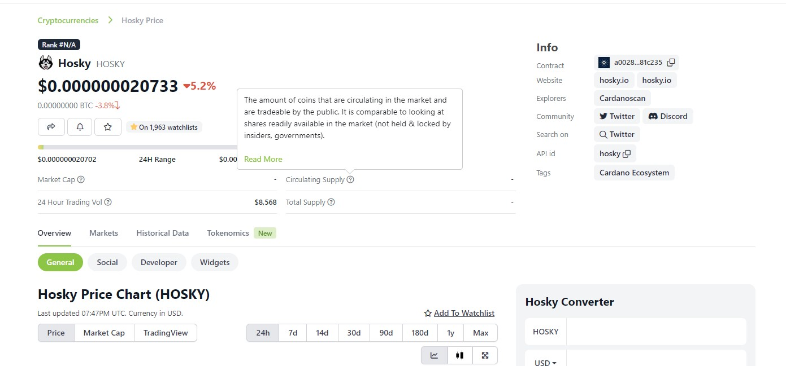
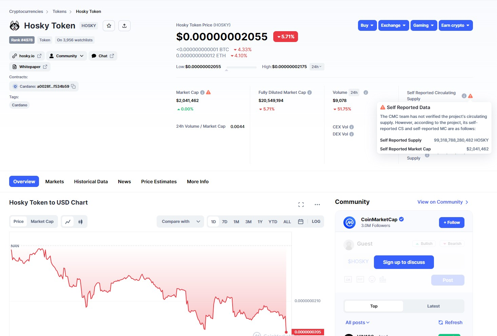

## Abstract

Cardano Financial Updates & Disclosure Specification (FUDS) details a specification allowing on-chain projects to
publicly publish and disclose financial information that has historically been hosted in disparate locations and
formats; leading to confusion and lack of investor clarity.

Projects can benefit by having a template to follow for well-rounded financial disclosure and the community and
third-party services can benefit by easily being able to consume, analyze, and report findings based on publicly
published information.

## Motivation: why is this CIP necessary?

One of the primary arguments for "Why blockchain?" is due to its nature as a publicly distributed, immutable and
auditable ledger which should increase consumer confidence through an ethos of ***"Don't trust. Verify."***
transparency. However, when it comes to many projects building and developing atop blockchain technologies we see the
development of opaqueness, obfuscation, and confusion in relation to how project funds and tokens are managed, housed,
and distributed.

This can substantially "muddy the waters" when it comes to a potential investor attempting to do their own research and
due diligence prior to investing in projects. Potential investors are asked to review "white papers" that often range
from exceptionally simplistic pie charts to math-heavy formulas and archaic "technobabble". Very seldom are things like
token distributions and project wallets clearly and transparently communicated to the investing public.

While most of the documentation in this CIP applies to token projects building atop the blockchain, the specification
contained herein could also be used as a template for similar disclosures for entities such as: NFT Projects, DAOs, and
other projects.

### Goal: Increase Transparency

By creating a community-accepted standard format for financial updates and disclosures we can simplify the disclosure
process for both token projects and marketplace aggregator services (DEXes, etc.) that attempt to provide information to
consumers and investors. Following standards allows us to educate and inform investors, consumers, and developers around
a common set of data points, minimizing the time it takes to "Do Your Own Research" (DYOR) while increasing confidence
in the reported dataset and verification of on-chain data to corroborate information contained within the disclosure.

### Goal: Utilize On-Chain Published Information

Currently, both CoinMarketCap<sup>[[1](#fn1)]</sup> and CoinGecko<sup>[[2](#fn2)]</sup>; two of the most relied upon
aggregator resources for blockchain token projects, utilize Google Docs as a method for token projects to submit
"self reporting" information about their projects. This process lacks transparency and verifiability.

By utilizing on-chain published information via a shared document standard we can:

1. Minimize the difficulty in the discovery and listing of new tokens projects
2. Cryptographically validate the authenticity (provenance) of the published information
3. Provide a set of open source software (OSS) tooling making it as easy as possible for third-party services to
   integrate
   Cardano token projects into their services.

### Goal: Allow Auditors to Verify Information

By creating a standard for projects to follow and third party services to consume, we can enable an ecosystem of
verifiable trust. This is pertinent to aforementioned projects like CoinMarketCap and CoinGecko but also to
community-internal tool providers such as TapTools and Xerberus that attempt to provide project analytics and data
insights.

The screenshots below show the current inconsistency in non-native Cardano aggregators with relation to their display
of information about Cardano token projects.

[CoinMarketCap HOSKY Listing](https://coinmarketcap.com/currencies/hosky-token/)



[CoinGecko HOSKY Listing](https://www.coingecko.com/en/coins/hosky)



## Specification

`Version: 1.0.0`

Documentation on the standard format will be presented in CBOR format below and JSON schema documentation will
also be provided.

### Document Format

```cbor

uri.scheme = text
uri.path = text

uri = {
    uri.scheme,
    + uri.path
}

asset.bech32 = text .size (44)
asset.policy_id = text .size (56)
asset.asset_id = text .size (0..32)

asset-id = {
    bech32 : asset.bech32,
    policy_id : asset.policy_id,
    asset_id : asset.asset_id
}

owners = (
    airdrops-bounty : 0,
    burn : 1,
    ecosystem-incentives : 2,
    exchange-cold-wallet : 3,
    exchange-hot-wallet : 4,
    escrow : 5,
    marketing-operations : 6,
    masternodes-staking : 7,
    private-sale-investor : 8,
    public : 9,
    team-advisors-contractors : 10,
    treasury : 11,
    liquidity-provisioning : 12
)

allocation-types = (
    private-sale : 0,
    public-sale : 1,
    team-controlled : 2
)

unlock-data = {
    timestamp : text,
    unlock_quantity : uint,
    unlock_percentage : float
}

funding-types = (
    seed-sale : 0,
    ico-sale  : 1
)

allocation-wallet = {
    name : text,
    description : text,
    address : text,
    owner : &owners,
    ? lock_status : "locked" / "unlocked",
    ? future_use : &owners,
    ? proof : uri / text,
    ? allocated_quantity : uint,
    ? allocated_percentage : float,
    ? allocation_type : &allocation-types,
    ? unlock_schedule : [* unlock-data]
}

funding-detail = {
    timestamp : text,       ; time of investment
    type : &funding-types,  ; type of funding/round
    price : float,          ; price per token (USD)
    raised : float,         ; amount raised (USD)
    ? valuation : float,    ; valuation at time of raise (USD)
    ? investor : text,      ; name of the investor
    ? source : uri          ; URI to more information about the raise
}

financial-disclosure = {
    subject : asset-id,
    name : text,
    symbol : text,
    ? explore : uri,
    ? holders : uri,
    ? max_supply : uint,
    ? emission : "inflationary" / "fixed" / "deflationary"
    generation_date : text,
    ? allocation : [* allocation-wallet],
    ? funding : [* funding-detail]
}
```

### Fields

#### Financial Disclosure

| Name            | Type                                            | Required | Rationale                                                                                                                                                                |
|-----------------|-------------------------------------------------|----------|--------------------------------------------------------------------------------------------------------------------------------------------------------------------------|
| subject         | Object\<[asset-id](#asset-id)>                  | Yes      | An asset identifier object as documented below.                                                                                                                          |
| name            | String                                          | Yes      | The full name of the token                                                                                                                                               |
| symbol          | String                                          | Yes      | The shortened "ticker" of the token. Usually all uppercase and 3-5 characters in length                                                                                  |
| explore         | Array<[URI](#uri)>                              | No       | A URI object describing the path to an explorer page. (Example: https://cardanoscan.io/token/0ef620255db71b69adf4cf7eb6619027a7a74f05)                                   |
| holders         | Array<[URI](#uri)>                              | No       | A URI object describing the path to a page showing holders of the token. (Example: https://cardanoscan.io/token/0ef620255db71b69adf4cf7eb6619027a7a74f05?tab=topholders) |
| max_supply      | Unsigned Integer                                | No       | For fixed-supply tokens, what is the maximum, total supply that will ever exist.                                                                                         |
| emission        | String                                          | No       | One of: "inflationary", "deflationary", or "fixed". Whether the tokenomics model for this token is inflationary, fixed, or deflationary.                                 |
| generation_date | String                                          | Yes      | An ISO-8601 Extended timestamp of when the token was first created. (Example: 2020-01-01T01:05:37+00:00)                                                                 |
| allocation      | Array\<[allocation-wallet](#allocation-wallet)> | No       | An array of wallets that received an allocation as part of the tokenomics of the project. (Examples: Treasury, Team, Vesting, and Reserve wallets)                       |
| funding         | Array\<[funding-detail](#funding-detail)>       | No       | An array of information about funding rounds that have been conducted                                                                                                    |

#### Asset ID

| Name      | Type   | Required | Rationale                                                                                                     |
|-----------|--------|----------|---------------------------------------------------------------------------------------------------------------|
| bech32    | String | Yes      | The bech32 representation of the token. Example: `asset1pmmzqf2akudknt05ealtvcvsy7n6wnc9dd03mf`               |
| policy_id | String | Yes      | The hex-encoded "Policy ID" of the token. Example: `d894897411707efa755a76deb66d26dfd50593f2e70863e1661e98a0` |
| asset_id  | String | Yes      | The hex-encoded "Asset ID" of the token. Example: `7370616365636f696e73` (spacecoins)                         |

#### URI

Where a URI is defined to be used, the URI should consist of an array of two or more strings that represent the complete
URI path when concatenated together. The first element of the URI array should always contain the `scheme` of the URI
and subsequent entries should describe the path. By utilizing this standardized format it is possible to use other,
non-HTTP, protocols for storage and reference including IPFS (ipfs://), Arweave (ar://), FTP (ftp://), and more.

***Formatted Example***

```json
{
  "explore": [
    "https://",
    // URI Scheme
    "cardanoscan.io/",
    // URI Path Part #1
    "token/0ef620255db71b69adf4cf7eb6619027a7a74f05"
    // URI Path Part #2
  ]
}
```

***Concatenated Example***

`https://cardanoscan.io/token/0ef620255db71b69adf4cf7eb6619027a7a74f05`

#### Allocation Wallet

| Name                 | Type                                                     | Required | Rationale                                                                                                                                                                                                                  |
|----------------------|----------------------------------------------------------|----------|----------------------------------------------------------------------------------------------------------------------------------------------------------------------------------------------------------------------------|
| name                 | String                                                   | Yes      | A "name" assigned to the wallet in question by the team. Example: `Reserves`                                                                                                                                               |
| description          | String                                                   | Yes      | A description of the wallet and its purpose. Example: `Holds tokens for future distributions`                                                                                                                              |
| address              | String                                                   | Yes      | The bech32-format ID of the wallet where tokens are being held. Example: `addr1vyd8rqr3758gs06xl5wkr6l3glr57huv2rqgs8pywnf9euczfg78e`                                                                                      |
| owner                | Unsigned Integer\<[owners](#owners)>                     | Yes      | The unsigned integer representation of one of the defined "owners". Example: `2`                                                                                                                                           |
| lock_status          | String                                                   | No       | Either "locked" or "unlocked" representing whether the tokens are locked. Example: `unlocked`                                                                                                                              |
| future_use           | Unsigned Integer\<[owners](#owners)>                     | No       | The unsigned integer representation of one of the defined "owners" that will control the purpose of the wallet in the future. Example: `0`                                                                                 |
| proof                | Array\<[URI](#uri)>                or String             | No       | A URI object to an explorer page showing the address in question or a text explanation of the purpose for the wallet. Example: `https://cardanoscan.io/address/addr1vyd8rqr3758gs06xl5wkr6l3glr57huv2rqgs8pywnf9euczfg78e` |
| allocated_quantity   | Unsigned Integer                                         | No       | The total number of tokens allocated to this wallet. Example: `1000000`                                                                                                                                                    |
| allocated_percentage | Float                                                    | No       | The percentage of `max_supply` that was allocated to this wallet and purpose. Example: `12.5`                                                                                                                              |
| allocation_type      | Unsigned Integer\<[allocation-types](#allocation-types)> | No       | The unsigned integer representation of one of the defined "allocation types". Example: `1`                                                                                                                                 |
| unlock_schedule      | Array\<[unlock-data](#unlock-data)>                      | No       | If funds are locked or subject to some vesting schedule, this array provides the vesting/unlock schedule of tokens.                                                                                                        |

##### Owners

The "owner" and "future use" of a defined allocation wallet represent a purpose for the allocation wallet. They should
use one of the pre-defined types below, represented by an unsigned integer to minimize ambiguity and errors.

| ID  | Name                         | Explanation                                                                           |
|-----|------------------------------|---------------------------------------------------------------------------------------|
| 0   | Airdrops or Bounties         | Tokens to be used and distributed via either airdrops or ecosystem bounties           |
| 1   | Burn                         | A "burn" address. For tokens that may have locked policies but want to "burn" supply. |
| 2   | Ecosystem Incentives         | Tokens reserved for incentives to participate in the token ecosystem.                 |
| 3   | Exchange Cold Wallet         |                                                                                       |
| 4   | Exchange Hot Wallet          |                                                                                       |
| 5   | Escrow                       | Tokens held in escrow for some purpose                                                |
| 6   | Marketing & Operations       | Tokens allocated to the team for the purpose of marketing or operations               |
| 7   | Masternodes & Staking        | Tokens allocated to provide "staking" rewards                                         |
| 8   | Private Sale Investor        | Tokens allocated to a private investor during a funding round                         |
| 9   | Public                       | Tokens allocated for public                                                           |
| 10  | Team, Advisors & Contractors | Tokens allocated for the team, its advisors and/or contractors                        |
| 11  | Treasury                     | Tokens allocated to serve as a project treasury                                       |
| 12  | Liquidity Provisioning       | Tokens to be used by the project for the purpose of providing DEX liquidity           |

##### Allocation Types

The "allocation type" of a defined allocation. There are only a few defined at the moment but disclosure documents
should use one of the pre-defined numeric types below, represented by an unsigned integer to minimize ambiguity and
errors and allow for ease of future expansion based on community need.

| ID  | Name            | Explanation                                   |
|-----|-----------------|-----------------------------------------------|
| 0   | Private Sale    | Tokens allocated for or during a private sale |
| 1   | Public Sale     | Tokens allocate for or during a public sale   |
| 2   | Team Controlled | Tokens allocated to or under team control     |

##### Unlock Data

An _Unlock Data_ object provides information about when the funds held in an allocation wallet will become fully vested
or unlocked.

| Name              | Type             | Required | Rationale                                                                                                                  |
|-------------------|------------------|----------|----------------------------------------------------------------------------------------------------------------------------|
| timestamp         | String           | Yes      | ISO-8601 Extended timestamp signalling when funds will become "unlocked" or "vested". Example: `2024-01-01T00:00:00+00:00` |
| unlock_quantity   | Unsigned Integer | No       | The amount of tokens that will become unlocked at the specified timestamp                                                  |
| unlock_percentage | Unsigned Float   | No       | The percentage of locked tokens that will become unlocked at the specified timestamp                                       |

#### Funding Detail

Funding details attempt to provide context and information to raises (public or private) that were held by the project,
the valuation of both the project and individual tokens at the time of the raise, and the total amount raised.

| Name      | Type                                               | Required | Rationale                                                                                                                      |
|-----------|----------------------------------------------------|----------|--------------------------------------------------------------------------------------------------------------------------------|
| timestamp | String                                             | Yes      | ISO-8601 Extended timestamp signalling when funds will become "unlocked" or "vested". Example: `2024-01-01T00:00:00+00:00`     |
| type      | Unsigned Integer\<[funding-types](#funding-types)> | Yes      | The unsigned integer representation for a given "type" of funding round. Example: `1`                                          |
| price     | Unsigned Float                                     | Yes      | The price per token, in USD, charged during the funding round. Example: `0.001`                                                |
| raised    | Unsigned Float                                     | Yes      | The total amount raised, in USD, during this funding action. Example: `5000000.420690`                                         |
| valuation | Unsigned Float                                     | No       | The project valuation, in USD, at the time of this funding action. Example: `5000000000.00`                                    |
| investor  | String                                             | No       | The name of the party providing the funding during this round (if applicable/desired). Example: `C-Fund-World-Fund`            |
| source    | Array<[URI](#uri)>                                 | No       | A URI to an article or news source about the funding round. Example: `https://medium.com/token-project/Seed-Round-A-Completed` |

##### Funding Types

The "funding type" of a funding detail event. These should be defined and documented here by the community and should
use one of the pre-defined numeric identifiers below, represented by an unsigned integer to minimize ambiguity and
errors and allow for ease of future expansion based on community need.

| ID  | Name         | Explanation                                  |
|-----|--------------|----------------------------------------------|
| 0   | Public Sale  | Funds raised during a public token sale      |
| 1   | Private Sale | Funds raised during a private token sale     |
| 2   | ITO/ICO Sale | Funds raised during an initial coin offering |

**TODO**

- [X] Expand on explanation of fields and what purpose they aim to serve.
- [ ] Add JSON schema docs
- [ ] Add examples

## Rationale: how does this CIP achieve its goals?

This specification is written and designed to work in conjunction with a registration and validation
specification such as [CIP-88](https://github.com/cardano-foundation/cips/pull/467). Validation and connection
of the data contained herein to a specific token project is considered out of scope for the purpose of this
CIP which should focus on the development and iteration of the disclosure standard.

For the first draft of this CIP the specification has been attempted to model after the CoinMarketCap and
CoinGecko information requested from their Google Docs solutions<sup>[[1](#fn1),[2](#fn2)]</sup> to attempt to be as
compatible as possible with existing ecosystem-agnostic platforms for simplicity of integration.

In order to maximize cross-platform compatibility it is recommended that these financial disclosure documents
be published as well-formed JSON documents utilizing decentralized, quasi-permanent storage solutions such as
Arweave or IPFS. However, platforms should accept documents published via traditional means such as HTTPS or FTP.

In order to prove the validity of the document, when publishing to the blockchain the document should be
published in the format of a URI that points to the document itself along with a SHA256 checksum of the document
contents (similar to how stake pool metadata is currently handled).

## Path to Active

### Acceptance Criteria

- [ ] Complete all "TODO" tasks based on currently identified shortcomings as well as feedback received.
- [ ] Receive community feedback and refinement from affected parties and potential implementors.
- [ ] Achieve buy-in from ecosystem participants to analyze and display data based on this spec

### Implementation Plan

- [ ] Invite identified stakeholders and market experts to review and provide feedback to the specification.
- [ ] Published OSS solutions for generation of FUDS documentation for projects
- [ ] Published OSS solutions for indexing of FUDS documentation for aggregators

## Copyright

This CIP is licensed under [CC-BY-4.0](https://creativecommons.org/licenses/by/4.0/legalcode).

## Footnotes

<sup id="fn1">1</sup>:
[CoinMarketCap Google Doc](https://docs.google.com/spreadsheets/d/1ON2o9fZtdj6aa_uaT7ALtGx1VxFnIDUi8-uS-fWji0o/edit#gid=1300521795)
for token project financial disclosure

<sup id="fn2">2</sup>:
[CoinGecko Google Doc](https://docs.google.com/spreadsheets/d/1Lh7HF2cJf5ElaGxoeMARU1XN6kB_EAeaMeyZKn6FMGI/edit?folder=0AGn_XsJsQytxUk9PVA#gid=743142986)
for token project financial disclosure
