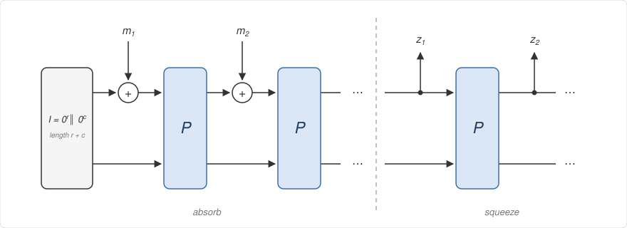

## Abstract

This CIP introduces a new built-in to Plutus, the Poseidon hash function.

## Motivation: Why is this CIP necessary?

Many zk applications require the same hash function to be evaluated both in-circuit and onchain.
An example of such a use case is a Merkle tree whose root is committed onchain while membership proofs are verified inside a circuit (or vice versa).

Traditional hash functions like SHA-256 or Blake2b are ill-suited for this: they are designed for CPUs, operating on 32- or 64-bit registers with bitwise operations (XOR, AND, rotations) and additions that wrap around at the register size.
A zk circuit, however, natively expresses only additions and multiplications in a prime field.
To evaluate a bit-oriented hash in-circuit, every register must be emulated: each word is decomposed into individual bits (one field element per bit, each with its own constraint forcing it to be 0 or 1), every bitwise operation costs constraints per bit, and every register addition needs extra constraints to reproduce the 32/64-bit overflow behaviour, since field arithmetic wraps around at the field prime instead.
This emulation inflates a single hash evaluation to tens of thousands of constraints, and the constraint count directly determines circuit size and proving time.

This gap is filled by zk-friendly hash functions, which are built from native field additions and multiplications so no bit decomposition or overflow emulation is needed.
Of these, Poseidon is the most established.

## Specification

### Poseidon

Poseidon is a cryptographic hash function designed to be efficient inside zero-knowledge proof systems (ZK-SNARKs, STARKs, PLONK, etc.).
Unlike "traditional" hashes such as SHA-256 or Blake2b, which operate on bits and are
cheap on a CPU but extremely expensive to prove in a circuit, Poseidon operates directly over the elements of a large prime field $\mathbb{F}_p$, where $p$ is usually the scalar field prime of the elliptic curve underlying the proof system.
Because the operations of which the Poseidon hash function is comprised of are native field additions and multiplications, the number of constraints needed to prove a Poseidon evaluation in-circuit is orders of magnitude smaller than for a bit-oriented hash.
This is what makes it "arithmetization-friendly".

#### Prime fields

A **prime field** $\mathbb{F}_p$ is the set of integers $\{0, 1, \dots, p-1\}$ for a prime modulus $p$, with addition and multiplication performed modulo $p$.
Because $p$ is prime, every non-zero element has a multiplicative inverse, so $\mathbb{F}_p$ supports the four basic arithmetic operations: it behaves like ordinary arithmetic that wraps around at $p$.
An element of such a field is a single number in $\{0, \dots, p-1\}$; this is the basic unit of data Poseidon operates on.

Elliptic-curve-based proof systems come with two prime fields: the *base field*, over which the curve's point coordinates are defined, and the **scalar field**, whose modulus is the (prime) order of the cryptographic subgroup of the curve.
The arithmetic of a circuit — and hence the values a prover commits to — lives in the scalar field, so a hash function that is cheap to prove must operate natively on scalar-field elements.

Plutus exposes exactly one pairing curve via built-ins, **BLS12-381**, whose scalar field has the 255-bit prime modulus

```text
p = 52435875175126190479447740508185965837690552500527637822603658699938581184513
```

All Poseidon parameters in this document are instantiated over this field.

#### Overview of the construction

Like SHA-3, Poseidon is built in two independent layers:

1. An inner **permutation** $P$: a fixed, invertible function $\mathbb{F}_p^t \to \mathbb{F}_p^t$ that supplies all of the cryptographic mixing.
   It is not a hash function by itself — it takes no variable-length input and, being invertible, hides nothing on its own.
   It is constructed by iterating a simple *round function* (add constants, apply a non-linear S-box, multiply by a mixing matrix) a fixed number of times.
2. An outer **mode of operation**, the *sponge construction*: a thin wrapper that repeatedly invokes $P$ to obtain the interface of a hash function — variable-length input, fixed-length output, one-wayness.
   The mode contains no cryptographic hardness of its own; its security reduces to that of the permutation it wraps.

Importantly, there is no canonical, unique "*the* Poseidon hash function": Poseidon is a *family* of hash functions.
Both layers are parameterized — the permutation by the field, the state width, the S-box exponent, the round counts, and the round constants; the mode by conventions such as how inputs and domain-separation tags are placed into the state — and every combination of choices yields a different function, producing digests incompatible with all others.
Two implementations agree only if every single one of these choices matches.
For this reason the built-in proposed here does not fix a single canonical instance: it is an interface that is *modular over instances*, backed by a set of known instances that is **append-only** — new instances can be added over time, but once added, an instance can never be removed.

The two subsections that follow describe these layers top-down: first the sponge, treating $P$ as a black box, then the internal round structure of $P$ itself.

#### The sponge construction

Recall from the overview that the permutation $P$ maps exactly $t$ field elements to $t$ field elements, and that accepting input of any other length is the job of the mode wrapped around it.
This subsection describes that mode: the same **sponge** construction as used by Keccak/SHA-3, which feeds the message into the state in fixed-size chunks, invoking $P$ in between.
The internal state is a vector of $t = r + c$ field elements:

- $r$ (the *rate*): how many field elements of input are absorbed per step, and how many are squeezed out per step (this is where the word **sponge** comes from).
- $c$ (the *capacity*): reserved elements that are never touched directly by input/output; they carry the security of the construction.

Starting from an **initial state** $I = 0^r \Vert 0^c$ of $t = r + c$ field elements — a fixed public constant of all zeros, where a protocol-defined tag (a domain-separation or input-length tag) may take the place of the zeros in the capacity part — hashing proceeds in two phases:

1. **Absorb**: the input (padded to a multiple of $r$) is split into chunks $m_1, m_2, \dots$ of $r$ field elements each.
   Each chunk $m_i$ is added into the first $r$ elements of the state, then the whole state is run through the Poseidon **permutation** $P$.
2. **Squeeze**: after all input is absorbed, the first $r$ elements of the state are read off as the output $z_1$.
   If more output is needed, $P$ is applied again and further outputs $z_2, \dots$ are read.



*Message chunks $m_i$ are added into the rate part of the state, interleaved with applications of the permutation $P$; once all input is absorbed, output elements $z_i$ are read from the rate part.*

In practice, however, most deployments of Poseidon do not hash arbitrary-length data but use a **fixed-arity** instance.
This is a consequence of how zk circuits work: a circuit is fixed at compile/setup time, meaning its entire structure — every wire, every constraint, and therefore the number of permutation calls — must be known before any input exists.
A circuit thus cannot branch on the length of its input; "hash however many chunks arrive" is simply not expressible.
Variable-length hashing can only be emulated by building the circuit for a maximum length and padding shorter inputs up to it, paying the worst-case constraint cost on every proof.
Consequently, protocols are designed around hashes of a fixed, known arity — which is also what their typical uses need: a Merkle node always hashes exactly two children, a commitment always binds the same number of field elements.
The most common instance has width $t = 3$ ($r = 2$, $c = 1$) and acts as a 2-to-1 compression function, e.g. hashing the two children of a Merkle tree node.

##### Framing conventions

While the permutation of an instance is fully determined by its parameters, the way a fixed-arity hash is *framed* on top of $P$ is not.
Which state element plays the role of the capacity, what value the capacity is initialized with, in which order the inputs are laid into the rate, and which element of the final state is read off as the digest are all conventions layered on top of the permutation — and none of them is canonical.
Real-world implementations disagree on every one of these choices.
Two deployed examples over the BLS12-381 scalar field, both cross-validated against the reference implementation accompanying this proposal:

- **circom-style** ([`jmagan/poseidon-bls12381-circom`](https://github.com/jmagan/poseidon-bls12381-circom) [7], following the framing of the widely used `circomlib` library [5]): an $n$-input hash uses width $t = n + 1$; the capacity element is the *first* state element and is initialized to zero; the whole hash is a *single* application of $P$ to $(0, \text{in}_1, \dots, \text{in}_n)$; the digest is the *first* element of the output state — i.e. it is read from the position the capacity occupied, not from the rate.
  There is no domain-separation or length tag.
  (This lineage's extended `PoseidonEx` template does allow a caller to initialize the capacity element to an arbitrary value, which is how a domain-separation tag *can* be injected in that ecosystem, but the plain `Poseidon` template used in practice fixes it to zero.)
- **[midnight-zk](https://github.com/midnightntwrk/midnight-zk) fixed-arity hash** [6]: the capacity element is the *last* state element and is initialized to the *number of inputs* (a length tag); inputs are absorbed in rate-sized chunks with one application of $P$ per chunk; the digest is the *first* element of the output state.
  Concretely, the 3-input hash on the width-3 instance runs:

  1. start from the initial state $(0, 0, 3)$ — the capacity element (last) holds the length tag;
  2. absorb the chunk $(\text{in}_1, \text{in}_2)$, giving $(\text{in}_1, \text{in}_2, 3)$, and apply $P$ to obtain $(x, y, z)$;
  3. absorb $\text{in}_3$ as the next (partial) chunk, giving $(x + \text{in}_3,\ y,\ z)$, and apply $P$ to obtain $(x', y', z')$;
  4. read the digest $x'$ from the rate part — as the diagram shows, squeezing begins with a read, not with another application of $P$.

  The *same codebase's* variable-length transcript mode uses yet a third convention: the capacity is initialized to $2^{64}$ and a queue-length padding element is absorbed alongside the message.

All of these framings invoke the same kind of permutation, yet they produce mutually incompatible digests for the same inputs.
Because no framing is canonical — a single ecosystem may even use several, over the same constants — this proposal deliberately standardizes only the permutation and leaves the framing to the calling script (see *The built-in* for the full argument).
The framing used by the ecosystem each registered instance originates from is documented alongside the instance — machine-readably, in its constants file — together with known-answer vectors, so that script authors targeting that ecosystem can reproduce it exactly; it is documentation of one use, not a property of the instance.

#### The permutation (HADES design)

The core of Poseidon is a fixed permutation $P$ over $\mathbb{F}_p^t$, built as a substitution-permutation network following the **HADES** strategy.
It applies a sequence of rounds, each composed of three steps:

1. **AddRoundConstants (ARC)**: add fixed, round-specific constants $c_i$ to every state element.
   This breaks symmetry and acts like a key schedule.
2. **S-box (SubWords)**: the non-linear layer, raising elements to a fixed power, $x \mapsto x^\alpha$.
   $\alpha$ is the smallest integer (commonly $\alpha = 5$, sometimes $3$) such that $\gcd(\alpha, p - 1) = 1$, which guarantees the map is a bijection.
3. **MixLayer (linear layer)**: multiply the state vector by a fixed $t \times t$ MDS (Maximum Distance Separable) matrix $M$.
   This diffuses each element across the entire state.

The key HADES insight is mixing two kinds of rounds:

- **Full rounds ($R_F$)**: the S-box is applied to *all* $t$ state elements.
- **Partial rounds ($R_P$)**: the S-box is applied to *only one* element; the rest pass through the non-linear layer untouched.

The rounds are arranged as $R_F/2$ full rounds, then $R_P$ partial rounds, then $R_F/2$ full rounds.
Full rounds provide strong security against statistical attacks (differential/linear), while the cheaper partial rounds provide algebraic security (against interpolation / Gröbner-basis attacks) at a fraction of the constraint cost.

> **Notation:** the paper [1] uses two symbols for full rounds: $R_f$ (lowercase) for the full rounds on *one* side, and $R_F = 2R_f$ (uppercase) for the *total*.
> Throughout this document $R_F$ always denotes the total number of full rounds (so $R_F/2$ on each side equals the paper's $R_f$).
> The paper's statistical-security minimum is $R_F \geq 6$; the value $R_F = 8$ used below is that minimum plus the recommended safety margin.

The S-box is the most expensive operation in a circuit, so applying it to one element instead of $t$ for most rounds is where the savings come from.
The exact round counts $(R_F, R_P)$ are derived from $p$, $t$, and $\alpha$ to give a target security level (typically 128 bits).

#### Parameters

A concrete Poseidon instance is fully specified by the *numeric* parameters:

- the field $p$;
- the state size $t$ (and hence rate $r$ and capacity $c$);
- the S-box exponent $\alpha$;
- the round numbers $(R_F, R_P)$;
- the round constants $c_i$ and the MDS matrix $M$, together with the exact procedure that generated them (typically a Grain-LFSR-based script; the precise script *and its arguments* differ between ecosystems and must be pinned per instance);

**and** by structural choices that the Poseidon paper leaves open and that implementations in the wild resolve differently:

- the order of operations within a round — this document defines a round as ARC → S-box → Mix, as above; implementations may internally reorder or pre-compose constants (e.g. the common "shifted" schedule that applies an initial ARC and then folds each round's constants into the end of the previous round) provided the result is observationally identical to the definition;
- which state element the partial-round S-box applies to (e.g. the circom implementations use the *first* element; midnight-zk and the reference implementation backing this proposal use the *last*);
- the orientation of the MDS multiplication: row-major $\text{state}'_i = \sum_j M_{ij} \cdot \text{state}_j$, versus multiplying by the transpose;
- the consumption order of the round-constant list (which constant goes to which round and lane).

These structural choices are not cosmetic.
For example, the circom BLS12-381 instance and the reference implementation differ *only* in the partial-round S-box position, and importing the circom constants requires an exact state-reversal conjugation — $M'_{ij} = M_{(t-1-i)(t-1-j)}$ with each round's constant chunk reversed, inputs fed in reverse order and the digest read from the mirrored lane.
Applied blindly, the same numeric constants produce entirely different digests.

(A concrete *hash*, finally, additionally requires a **framing** on top of the permutation — see *Framing conventions*; the built-in exposes the permutation only, so framings are documented per instance rather than baked into its semantics.)

Because all of the above must match exactly on both the prover and verifier side, each instance in the built-in's append-only set must be specified by a single, unambiguous parameter set covering the numeric *and* the structural choices.

#### Concrete parameters

Round counts are not universal constants: they are derived from the field $p$, the state size $t$, the S-box exponent $\alpha$, and a chosen security margin, so they are meaningful only relative to a fixed field.

One property is **normative** for every instance of this built-in, present and future: it is instantiated over the **BLS12-381 scalar field** introduced above, the only pairing curve exposed by Plutus built-ins and the field the reference implementation's arithmetic is built on.

The other agreements between the instances below are **descriptive, not normative**: each happens to target **128-bit security** with S-box exponent **$\alpha = 5$** and **$R_F = 8$** full rounds (split as 4 before and 4 after the partial rounds).
The recurrence of $\alpha = 5$ is no coincidence: $\alpha$ is conventionally chosen as the *smallest* integer such that $\gcd(\alpha, r - 1) = 1$, which is what makes $x \mapsto x^\alpha$ a bijection.
For the BLS12-381 scalar field this smallest choice is $5$ — the candidate $3$ is ruled out because $3$ divides $r - 1$, so $x^3$ is not a bijection over this field.
Nevertheless, none of these values is fixed forever.
Instead, a future instance must satisfy the registry's admission criteria: $\gcd(\alpha, r - 1) = 1$, a declared security level of at least 128 bits, and round counts meeting the Poseidon paper's minima (plus its recommended margin) for the declared $(t, \alpha)$ at that level.
The deployed BLS12-381 instances that have been cross-validated against the reference implementation backing this proposal are:

| Origin | $t$ (rate $r$ / capacity $c$) | $\alpha$ | $R_F$ | $R_P$ | Constant generation |
| --- | --- | --- | --- | --- | --- |
| [midnight-zk](https://github.com/midnightntwrk/midnight-zk) [6] | 3 ($r=2$, $c=1$) | 5 | 8 | 60 | `generate_parameters_grain.sage 1 0 255 3 8 60 <r>` (pasta-hadeshash) |
| [circom BLS12-381 port](https://github.com/jmagan/poseidon-bls12381-circom) [7] | 3 ($r=2$, $c=1$) | 5 | 8 | 56 | `generate_params_poseidon.sage 1 0 255 3 5 128 <r>` (hadeshash) |
| [circom BLS12-381 port](https://github.com/jmagan/poseidon-bls12381-circom) [7] | 4 ($r=3$, $c=1$) | 5 | 8 | 56 | `generate_params_poseidon.sage 1 0 255 4 5 128 <r>` (hadeshash) |

Note that two of these share the same $(p, t, \alpha)$ yet use different partial-round counts, 60 versus 56: both include a security margin over the paper's minima, but the margin and the derivation script differ.
The Poseidon paper's own `calc_round_numbers.py` can likewise produce slightly different counts depending on the margin and attack assumptions chosen.
Neither instance is "wrong" — but they are different hash functions, and their digests are incompatible.

> **Caveat:** for exactly this reason, this specification fixes for each registered instance the exact generator script and its inputs (not merely a round-count table), so that round constants, the MDS matrix, and round counts are reproducible bit-for-bit.
> **Note:** *Poseidon2* [3] is a newer successor that keeps the same round structure but uses a cheaper linear layer and constant schedule.
> It is explicitly **out of scope** for this CIP: this specification standardizes the original, battle-tested Poseidon, which has seen years of deployment and cryptanalysis across the ZK ecosystem.

### The built-in

This CIP adds a single built-in function exposing the Poseidon *permutation* — deliberately not a hash — over the BLS12-381 scalar field:

```text
bls12_381_poseidonPermutation : integer -> list integer -> list integer
```

(The name carries `bls12_381` following the existing family of BLS12-381 built-ins; the final spelling is to be agreed with the Plutus Core team.)

Its semantics:

1. The first argument is the **variant index**, selecting one instance from the append-only instance registry (next section).
   An index with no registered instance makes evaluation fail.
2. The second argument is the **full input state**: a list of exactly $t$ integers, where $t$ is the selected instance's width.
   A list of any other length makes evaluation fail — the input is **never padded** (see below).
3. Each input integer is **reduced modulo $r$** into a field element, with exactly the semantics the existing BLS12-381 built-ins use when converting an integer to a scalar: the representative is $n \bmod r$, so inputs $\geq r$ wrap around and negative inputs land in $[0, r)$ (e.g. $-1$ becomes $r - 1$).
   The reduction is total; callers for whom an out-of-range input is an error must check the range themselves before calling.
4. The instance's permutation $P$ is applied to the state, and the **full output state** — $t$ integers, each a canonical representative in $[0, r)$ — is returned.

For a fixed variant index the function is a pure, constant-cost map from $t$ field elements to $t$ field elements; it has no other failure modes and no dependence on chain state.
One call computes one *complete* permutation — all $R_F + R_P$ rounds run inside the implementation; the caller never iterates rounds.

> [!IMPORTANT]
> **Terminology, used normatively throughout this document.**
> The **permutation** is what this built-in computes: a public bijection on $\mathbb{F}_r^t$ with *no security properties of its own*.
> A **hash** is a construction: a specific framing of permutation calls (initial capacity value, absorption schedule, digest lane), chosen by the calling script — never by the registry, which identifies permutations only.
> "Poseidon hash" in this document always means *permutation plus framing*, never a bare built-in call — and the output of a single built-in call is a **state**, never a digest.
> Conflating the two is the root of every attack in *Misuse warnings* below.

#### Why the permutation and not a hash

As the *Framing conventions* section shows, deployed Poseidon hashes disagree on everything above the permutation: capacity position and initialization, input order, chunking, tags and digest lane.
The permutation is the layer where implementations actually agree — and the layer that carries all of the cryptographic cost.
A script reproduces any framing with a handful of cheap operations around the built-in: list construction, integer additions, and reading elements of the result.

The deeper reason is that the two layers evolve on different timescales.
The permutation is the *unchangeable core* of every Poseidon deployment: once its constants are fixed, it never changes — which is exactly the shape of commitment a permanent built-in interface can safely make.
How the permutation is *operated*, by contrast, is never fixed and cannot be predicted: what value the capacity is initialized with, in which order inputs are absorbed, how message boundaries are encoded — and, on the output side, how much is read.
The framings deployed today happen to squeeze a single element, but the sponge naturally produces more: a future application may squeeze the full rate per call, or squeeze repeatedly (with interleaved permutations, $z_1, z_2, \dots$ as in the sponge diagram) to derive several field elements from one absorbed message — multi-element commitments, transcript randomness, key derivation, duplex-style authenticated constructions.
None of these need anything from the chain that the permutation built-in does not already provide — and, because an index identifies a *permutation* and not a way of operating it, none of them needs a new registry entry either: the same index serves every framing over its constants.
A hash-shaped built-in, by fixing "absorb everything, squeeze one designated lane" into protocol law, would make each of them wait for a protocol upgrade instead.

A hash-level alternative was seriously considered: a built-in taking the raw message and an index that pins the constants *and* a framing, absorbing internally.
It has real merits — a script author cannot misapply a framing, an index alone identifies a complete hash function, it mirrors the hash-level interface circuit libraries expose (in midnight-zk a circuit calls `std_lib.poseidon(layouter, &message)` and never touches $P$), and it saves per-built-in-call overhead on multi-chunk hashes.
It was nevertheless rejected, because built-in interfaces are permanent and the hash-level semantics does not stay uniform across entries: each entry would carry its own accepted arities, absorption schedule and cost shape (the midnight framing hashes three inputs with *two* internal permutations, the circom framing with *one*), and every future mode — midnight's variable-length transcript framing, a duplex construction, a framing not yet invented — would require a new registry entry to become expressible at all.
The permutation-level built-in has one uniform signature, one constant cost per index, and leaves *every* present and future framing expressible in script today.
The misuse concern is addressed instead by documentation and data: each registry entry ships its ecosystem's framing in machine-readable form together with known-answer vectors (see `test-vectors.json`), from which audited script-level wrappers can be built and checked.

#### Why no implicit padding

Zero-padding an under-length input inside the built-in would not be injective: the states $(a, 0, 0)$ obtained from input $[a]$ and from input $[a, 0]$ would be identical, making the two inputs collide by construction — the same ambiguity class exploited by known second-preimage attacks on Merkle trees.
Padding and domain separation are security-relevant decisions that must remain the script author's explicit, auditable choice.

#### Why the rate/capacity split is not an argument

The signature contains $t$ but says nothing about the split $t = r + c$, and deliberately so: the split is not a property of the permutation.
$P$ is a bijection on $\mathbb{F}_r^t$ with no distinguished lanes — the reference C context accordingly stores only the width, round counts and constants.
"Rate" and "capacity" only come into existence in a *mode*: the rate is the set of lanes a mode chooses to add message into, and the capacity is the set of lanes it promises never to touch.
Since the built-in never absorbs, there is nothing for it to be ambiguous about: how an arity-6 hash splits its inputs — three chunks of two on a width-3 instance, or a single chunk on a width-7 instance — is written out explicitly in the calling script, one permutation call per chunk, and different splits are simply different (individually well-defined) hash functions.
The split does matter for *security*: the sponge indifferentiability argument [4] applies only to scripts that leave the instance's $c$ designated capacity lanes untouched by input and output.
Each registry entry therefore documents its ecosystem's rate/capacity split and lane positions — as the contract a script must follow to inherit the instance's security analysis, not as behaviour the built-in enforces.

#### Why the full state is returned

Returning the full output state is maximally general: callers can build sponges, fixed-arity compression functions, or duplex-style constructions, and can squeeze whichever elements their framing designates.
Note that the sponge security arguments cover squeezing only the *rate* portion of the state; which elements those are is part of the framing a script chooses, and at least one deployed framing (circom-style) reads the lane that held the capacity.
This generality has sharp edges, spelled out next.

#### Misuse warnings: what the built-in does *not* provide

> [!WARNING]
> **The permutation is invertible — a call to this built-in is *not* a hash.**
> $P$ is a public bijection: anyone can compute $P^{-1}$ just as cheaply as $P$.
> Every hash-like property a script obtains — one-wayness, compression, binding — comes exclusively from the *framing* it builds around the built-in, never from the built-in itself.
> A script that deviates from a documented, analyzed framing forfeits that framing's security argument, usually silently: the digests still look random.

In particular:

- **The full output state is never a commitment.**
  Given all $t$ output elements, the entire input state is recoverable exactly by running $P$ backwards.
  More generally, *revealing* (or absorbing into) all $t$ lanes leaves no hidden state: an attacker who learns the full state after any permutation call can run the sponge backwards to recover everything absorbed and forwards to compute digests of arbitrary extensions.
  Preimage resistance exists only because the $c$ capacity lanes of the final state are withheld — a digest must be a *truncation* of the output (the sponge construction bounds security by $c \cdot \log_2(r) / 2$ bits [4], about 127 bits for a width-3, $c = 1$ instance).
  Consequently: publish only the framing's designated digest lane(s); never absorb message elements into the capacity lane; never build keyed constructions (MAC-like uses) that expose more of the state than the framing's digest.

- **Prefix and extension attacks on home-made framings.**
  A framing without a length tag, padding rule, or fixed arity does not fix message boundaries, and distinct messages then collide or extend each other by construction:
  zero-extension collisions — $[a]$ and $[a, 0]$ absorb to identical states (as in *Why no implicit padding*), and in general any message collides with itself extended by zeros up to the next chunk boundary, at every chunk boundary; and length-extension-style forgeries whenever intermediate states leak.
  Tree constructions need *domain separation* on top: a Merkle tree whose leaves and internal nodes are hashed identically admits second preimages by reinterpreting an internal node as a leaf — the classic Merkle-tree second-preimage attack, which standard designs prevent by tagging leaves and internal nodes differently (as in RFC 6962's `0x00`/`0x01` prefixes).
  The deployed framings avoid these pitfalls by construction — midnight's capacity length tag pins the arity, circom's fixed width pins it structurally — which is precisely why scripts should reproduce a documented framing (its machine-readable description and known-answer vectors ship with each instance) rather than invent one.

- **The integer reduction is not injective.**
  Inputs $n$ and $n + r$ are the same field element and produce identical outputs.
  A script hashing data that can numerically exceed $[0, r)$ (e.g. values parsed from 32-byte strings, which range up to $2^{256} > r$) must range-check before calling, or two distinct pieces of data collide trivially.

#### Non-normative examples

The two framings documented in *Framing conventions*, exactly as their ecosystems compute them (each reproducible against `test-vectors.json`):

**midnight-zk's 3-input hash** (variant 0).
The width-3 instance has rate 2, so three inputs are absorbed in two chunks — one permutation call per chunk, as in the sponge diagram above — with the capacity lane (last) initialized to the input count:

```text
hash3 in1 in2 in3 =
  let [x, y, z]    = bls12_381_poseidonPermutation 0 [in1, in2, 3]   -- absorb the first chunk (rate = 2 elements)
      [x', y', z'] = bls12_381_poseidonPermutation 0 [x + in3, y, z] -- absorb the second chunk
  in x'                                                              -- digest = first lane
```

**The circom BLS12-381 port's 2-input hash** (variant 1).
This framing sizes the width to the arity — an $n$-input hash uses a width-$(n{+}1)$ instance, so all inputs fit into the rate of a single chunk and one call suffices, with the capacity lane (first) fixed to zero:

```text
hash2 in1 in2 = head (bls12_381_poseidonPermutation 1 [0, in1, in2]) -- digest = first lane
```

### Instance registry

The built-in's first argument selects an instance from the registry specified here.
The registry contract:

- indices are **append-only**: new instances can be added, none can ever be removed;
- the meaning of an index, once assigned, is **never changed or reused** — onchain scripts depend on it;
- a faster but observably identical implementation of an existing index is **not** a new instance;
- an index identifies a **permutation, never a hash**: framings are not part of an entry, and operating an existing index with a different framing — a different capacity tag, another absorption order, squeezing more output elements — never requires (and never receives) a new index.

#### What a registry entry specifies

Each entry must pin, bit-for-bit, everything the *Parameters* section identifies — numerically and structurally:

| Field | Meaning |
| --- | --- |
| width $t$, $\alpha$, $(R_F, R_P)$ | the shape of the permutation (the field is always the BLS12-381 scalar field — the one normative constant of this built-in) |
| MDS matrix, round constants | full values, in a machine-readable constants file; MDS orientation and constant consumption order declared in the same file |
| partial-round S-box lane | the state element the partial rounds apply the S-box to |
| round-operation order | ARC → S-box → Mix, as defined in *The permutation*; equivalent schedules permitted if observationally identical |
| provenance | the exact generation procedure: script, version and arguments |
| test vectors | at least one normative permutation vector (input state → full output state) in `test-vectors.json` |

Alongside the normative fields, each entry's constants file also records — **non-normatively, as provenance documentation** — the framing used by the ecosystem the constants originate from (rate/capacity split and lane positions, capacity initialization, absorption schedule, accepted arities, digest lane), together with secondary hash vectors, so that script authors targeting that ecosystem can reproduce its hash exactly instead of inventing a framing (see *Misuse warnings*).
This documentation describes one *use* of the entry, not a property of it: the entry is the permutation alone, and any framing may operate it.

#### Registered instances

| Index | Instance | $t$ | $\alpha$ | $R_F$ | $R_P$ | Partial S-box lane | Constants |
| --- | --- | --- | --- | --- | --- | --- | --- |
| 0 | midnight-zk [6] | 3 | 5 | 8 | 60 | last | [`midnight-poseidon-constants.json`](./midnight-poseidon-constants.json) |
| 1 | circom BLS12-381 port [7], 2-input | 3 | 5 | 8 | 56 | first | [`circom-bls-t3-poseidon-constants.json`](./circom-bls-t3-poseidon-constants.json) |

**Index 0 — midnight-zk.**
The instance behind midnight-zk's Poseidon chip: width 3, $R_F = 8$, $R_P = 60$, S-box $x^5$, partial-round S-box on the last lane, row-major MDS ($\text{state}'_i = \sum_j M_{ij}\,\text{state}_j$), constants consumed in ARC → S-box → Mix order.
Provenance: `generate_parameters_grain.sage 1 0 255 3 8 60 <r>` (the pasta-hadeshash generator); source of truth `circuits/src/hash/poseidon/constants/blstrs.rs` in [6] (`Fq::from_raw` little-endian limbs, canonical form), converted to the decimal integers in the constants file and cross-validated against midnight's own Rust implementation.
The ecosystem it originates from operates it as: capacity lane last, initialized to the input count; digest = first lane (an example use, documented non-normatively in the constants file and demonstrated in *Non-normative examples*).

**Index 1 — circom BLS12-381 port, 2-input (R1CS ecosystem).**
The width-3 instance of the circom port [7], serving the circomlib-style R1CS ecosystem: width 3, $R_F = 8$, $R_P = 56$, S-box $x^5$, partial-round S-box on the **first** lane, row-major MDS, constants consumed in ARC → S-box → Mix order.
Provenance: `generate_params_poseidon.sage 1 0 255 3 5 128 <r>` (the hadeshash generator); source of truth `circuits/poseidon255_constants.circom` in [7], cross-validated against the circom tooling on the compiled circuit.
The entry is *defined* by this upstream form; an implementation whose permutation core fixes the S-box on the last lane may realize it through the exact state-reversal conjugation shipped as `conjugated_form` in the constants file — observationally identical, hence not a distinct variant under the registry contract.
The ecosystem it originates from operates it as: a single permutation of $(0, \text{in}_1, \text{in}_2)$ — capacity lane first, fixed to zero, exactly two inputs; digest = first lane (an example use, documented non-normatively in the constants file).

#### Candidate instances

The following instance is fully validated against its upstream implementation and its constants, framing and vectors ship with this CIP, but it is **not registered**: it will be assigned an index by amendment once a user demonstrates a need for it.

| Instance | $t$ | $\alpha$ | $R_F$ | $R_P$ | Partial S-box lane | Constants |
| --- | --- | --- | --- | --- | --- | --- |
| circom BLS12-381 port [7], 3-input | 4 | 5 | 8 | 56 | first | [`circom-bls-t4-poseidon-constants.json`](./circom-bls-t4-poseidon-constants.json) |

Provenance: `generate_params_poseidon.sage 1 0 255 4 5 128 <r>` (the hadeshash generator); the same first-lane S-box and conjugation remarks as index 1 apply.

#### Admission criteria for future instances

A proposed instance is added by amending this CIP with a complete registry entry.
Beyond completeness, the entry must satisfy:

1. **Field**: the BLS12-381 scalar field — this built-in never hosts another field.
2. **S-box**: $\gcd(\alpha, r - 1) = 1$, so $x \mapsto x^\alpha$ is a bijection.
3. **Security level**: a declared level of at least 128 bits, with $(R_F, R_P)$ meeting the Poseidon paper's minima plus its recommended margin for the declared $(t, \alpha)$ [1].
4. **Constant properties**: all constants canonical in $[0, r)$; round constants pairwise distinct and nonzero; the matrix genuinely MDS (every square minor nonzero [1, footnote 7], hence invertible); and no infinitely long subspace trail keeping the partial-round S-box inactive — the only $M$-invariant subspace contained in $\{x : x_{\text{S-box lane}} = 0\}$ is the trivial one, checked as full rank of the matrix with rows $e_l M^j$, $j = 0, \dots, t-1$ [1, §2.3; 8].
   (The stronger condition that no power $M^i$ has *any* eigenvalue in $\mathbb{F}_r$ is sufficient but **not necessary** — the registered midnight instance and the circom candidates have such eigenvalues yet satisfy the criterion above.)
5. **Cross-validation**: test vectors reproduced against the upstream implementation the instance claims compatibility with, plus the normative permutation vector.
6. **Demonstrated demand**: a concrete user or protocol that needs this instance.

Criteria 2 and 4 (and the re-derivation of every shipped vector) are mechanically checkable: [`check-constants.py`](./check-constants.py) in this CIP's directory implements them for all shipped constants with a dependency-free `python3 check-constants.py`, and must pass for any amended entry.

#### Known-answer test vectors

[`test-vectors.json`](./test-vectors.json) accompanies this CIP.
For each instance it contains a **normative permutation vector** — one call of the built-in, input state to full output state — which is what conformance means for `bls12_381_poseidonPermutation`; for index 0:

```text
bls12_381_poseidonPermutation 0 [1, 2, 3] =
  [ 0x5e7d844fc6e217cb53a21928cdd831c73fe626f0b62fe012e9e3883a05b88b1a
  , 0x6727d5f45b85a106452257dab75c34fab4edec2544ba49a4c7b73edef7a7f5da
  , 0x339d99829dc3bb8b18fcc17a2dc7cda7628f2fcdc6c7f71f83c3f5e5466e2c4a ]

bls12_381_poseidonPermutation 1 [0, 1, 2] =
  [ 0x3fb8310b0e962b75bffec5f9cfcbf3f965a7b1d2dcac8d95ccb13d434e08e5fa
  , 0x43fe5dfa886bfae59d015ed8b2a8c9328230f299203c89b9c78d8b40ccdc7dda
  , 0x05153d5d7d0f9122550ecc902c0f5248d8ddcacfa1b911699c982099efc48aa7 ]
```

and, per instance, **secondary hash vectors** that demonstrate the *correct* construction of the origin ecosystem's hash out of permutation calls — each vector carries the full trace (every permutation call's input and output state, following the framing documented in the instance's constants file) ending in the digest, so a script-level hash implementation can be checked call by call, not just against the final digest.
These are worked examples of one use, not registered modes: a script operating the same index with a different framing — a different tag, or squeezing more elements — is equally legitimate (subject to *Misuse warnings*) and needs no new registry entry.
For index 0:

```text
midnight_poseidon_hash [1, 2]    -- one call:  P([1, 2, 2]); note the capacity tag is the arity, 2
  = 0x4ad818f39d91567d105c5bea1ec4b5ac201dc45b784e39a2beef781790bf5177
midnight_poseidon_hash [1, 2, 3] -- two calls: P([1, 2, 3]), then P over the updated state
  = 0x2416a898714a84833f3690e09279c3b175418c956399a8c8928b8d1d4150ab7b
```

The pair illustrates the terminology split above and the role of the length tag: `hash [1, 2]` is *not* any element of the `permutation [1, 2, 3]` vector — the 2-input hash absorbs into initial state $(0, 0, \mathbf{2})$, while $P([1,2,3])$ is merely the first *call* inside `hash [1, 2, 3]` (capacity tag $3$), whose output state is an intermediate value, not a digest.
For index 1, the circom 2-input hash of $[1, 2]$ is a single call and its digest is the first element of the permutation vector above — the upstream repository's own shipped test vector.

Digest provenance: the midnight 3-input hash, the midnight permutation vector, and both circom digests were produced by the upstream implementations themselves (midnight-zk's Rust; the circom tooling on the compiled circuits); the midnight 2-input hash vector is derived from the framing exactly as upstream's fixed-length code path computes it (`init(Some(2))`, no padding).
All vectors are independently re-derived from the shipped constants files by `check-constants.py`.

## Rationale: How does this CIP achieve its goals?

Poseidon could in principle be implemented in Plutus itself on top of the existing integer or BLS12-381 built-ins, but each evaluation requires on the order of 60+ rounds of field exponentiations and an MDS matrix multiplication, which is prohibitively expensive within current script budgets.
Exposing Poseidon as a native built-in, costed like the existing hash primitives (SHA-256, Blake2b, Keccak-256), makes onchain verification of Poseidon-based commitments practical and closes the gap between what zk provers produce and what Plutus scripts can verify.

## Path to Active

### Acceptance Criteria

- [ ] The Poseidon exact parameter sets (fields, $t$, $\alpha$, round counts, constant generation) are fixed in this specification.
- [ ] The built-in is implemented in Plutus with a benchmarked costing function, validated against reference implementation test vectors.
- [ ] The built-in is released on mainnet in a protocol upgrade enabling a new Plutus language version or built-in set.

### Implementation Plan

- [ ] Agree on the parameter sets with the Plutus Core team.
- [ ] Implement the primitive (e.g. in `cardano-base`/`plutus`) with test vectors cross-checked against the upstream implementation of each registered instance.
- [ ] Align the `cardano-base` variant registry with the table in this CIP: the preliminary implementation registers a different width-3 instance at index 0; index 1 needs either a generalized partial-S-box lane in the C core or the shipped `conjugated_form`; and its constant test suite asserts the eigenvalue-freeness condition that the criteria above deliberately relax to the subspace-trail criterion.
- [ ] Benchmark and propose costing parameters.

## References

1. L. Grassi, D. Khovratovich, C. Rechberger, A. Roy, M. Schofnegger. *Poseidon: A New Hash Function for Zero-Knowledge Proof Systems.* USENIX Security 2021. IACR ePrint [2019/458](https://eprint.iacr.org/2019/458).
2. L. Grassi, R. Lüftenegger, C. Rechberger, D. Rotaru, M. Schofnegger. *On a Generalization of Substitution-Permutation Networks: The HADES Design Strategy.* EUROCRYPT 2020. IACR ePrint [2019/1107](https://eprint.iacr.org/2019/1107).
3. L. Grassi, D. Khovratovich, M. Schofnegger. *Poseidon2: A Faster Version of the Poseidon Hash Function.* AFRICACRYPT 2023. IACR ePrint [2023/323](https://eprint.iacr.org/2023/323). Reference parameters: [HorizenLabs/poseidon2](https://github.com/HorizenLabs/poseidon2/blob/main/poseidon2_rust_params.sage).
4. G. Bertoni, J. Daemen, M. Peeters, G. Van Assche. *Cryptographic Sponge Functions* / *On the Indifferentiability of the Sponge Construction*, EUROCRYPT 2008. [keccak.team/sponge_duplex.html](https://keccak.team/sponge_duplex.html).
5. iden3. *circomlib*. Reference Poseidon circuit: [circuits/poseidon.circom](https://github.com/iden3/circomlib/blob/master/circuits/poseidon.circom).
6. Midnight Network. *midnight-zk*, the zero-knowledge library of the Midnight blockchain; Poseidon instance and constants under [`circuits/src/hash/poseidon`](https://github.com/midnightntwrk/midnight-zk/tree/main/circuits/src/hash/poseidon). [github.com/midnightntwrk/midnight-zk](https://github.com/midnightntwrk/midnight-zk).
7. J. Magán. *poseidon-bls12381-circom*, a circom Poseidon implementation over the BLS12-381 scalar field. [github.com/jmagan/poseidon-bls12381-circom](https://github.com/jmagan/poseidon-bls12381-circom).
8. L. Grassi, C. Rechberger, M. Schofnegger. *Proving Resistance Against Infinitely Long Subspace Trails: How to Choose the Linear Layer.* IACR ToSC 2021(2). IACR ePrint [2020/500](https://eprint.iacr.org/2020/500).

## Copyright

This CIP is licensed under [CC-BY-4.0](https://creativecommons.org/licenses/by/4.0/legalcode).
