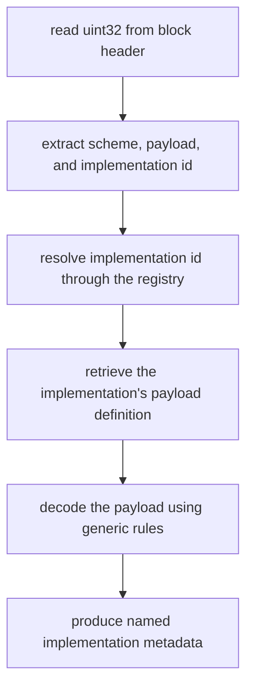

## Abstract

[CIP-203](https://github.com/cardano-foundation/CIPs/pull/1276/) defines a new
registry for Block-Producing Node Identifiers. CIP-203 v0 defines a 32-bit field
consisting of a 2-bit `scheme`, an 8-bit `implementation id`, and a 22-bit
implementation-defined `payload`.

CIP-203 defines the rules and versioning scheme for the registry itself. That
scheme includes a `payload_specification` defined as either a URL or `null`
value.
CIP-203 [intentionally leaves](https://github.com/cardano-foundation/CIPs/pull/1276#discussion_r4107897607)
the `payload_specification` undefined and out of scope. This CIP aims to provide
at least one option for the interpretation of the payload bits.

## Motivation: Why is this CIP necessary?

I believe it is necessary to define a standard for `payload_specification`
before the various individuals and teams working on block-producing node
implementations begin ad hoc implementations. The purpose of the proposed format
is to allow any generic consumer, including explorers, monitoring systems,
dashboards, and governance tooling to interpret the payload values without
requiring implementation-specific decoding logic.

The `payload` bits are intended to allow block-producing implementations to
communicate implementation-specific information such as:

- software release or version
- enabled capabilities
- configuration state
- protocol-readiness indicators
- other implementation-defined metadata

If the interpretation of the payload is described only in human-readable
documentation, downstream consumers must implement custom logic for each
registered implementation.

For example, an explorer shuold not require code such as:

```
if implementation == "Dingo":
    decode payload according to Dingo rules
    
if implementation == "Gerolamo":
    decode payload according to Gerolamo rules
```

Instead, a consumer implementing this extension should be able to:


```mermaid
flowchart TD
    A[read uint32 from block header]
    B[extract scheme, payload, and implementation id]
    C[resolve implementation id through the registry]
    D[retrieve the implementation's payload definition]
    E[decode the payload using generic rules]
    F[produce named implementation metadata]
    A --> B
    B --> C
    C --> D
    D --> E
    E --> F
```

For example, a monitoring system could derive information such as:

``` 
Dingo 2.4.1     31.4% of observed block production
Dingo 2.5.0     18.7%

hardForkReady
    true        43.2%
    false       6.9%
```

The interpretation and significance of these values remain
implementation-defined. This extension only standardizes how those terms are
described.

## Specification

The payload namespace is implementation-defined, but its description is
standardized.

This extension does not assign meaning to any payload bit.

The keywords "MUST", "MUST NOT", "REQUIRED", "SHALL", "SHALL NOT", "SHOULD",
"SHOULD NOT", "RECOMMENDED", "NOT RECOMMENDED", "MAY", and "OPTIONAL" in this
document are to be interpreted as described
in [RFC 2119](https://datatracker.ietf.org/doc/html/rfc2119)
and [RFC 8174](https://datatracker.ietf.org/doc/html/rfc8174) when, and only
when, they appear in all capitals.

### Registry Integration

A registered implementation MAY provide a URI referencing a payload definition.

An example registry entry might contain:

```json 
{
  "id": 69,
  "name": "Dingo",
  "payload": "https://example.org/dingo/block-producer-payload.json"
}
```

The referenced resource, if not null, MUST contain valid JSON conforming to the
payload definition format described by this extension.

### JSON Schema

The full "Format 1" JSON Schema file is available
at [payload-definition.format-1.schema.json](payload-definition.format-1.schema.json)

### Reserved Words

The payload metadata MUST NOT be capable of redefining information established
by the CIP-203 registry or the enclosing signal. For this reason, the following
names are reserved:

- `name` - implementation name comes from the CIP-203 registry
- `id` - implementation ID comes from the CIP-203 registry
- `scheme` - comes from the outer 32-bit signal defined by CIP-203
- `format` - defined by this extension for versioning and extensibility

The JSON schema defines the above reserved words as-is (not attempting to block
every weird capitalization edge case).

Consumers SHOULD normalize the reserved words to lowercase. Consumers SHOULD NOT
flatten the payload into one namespace. Consumers SHOULD normalize the
downstream data model to help make the payload metadata logically distinct:

```json 
{
  "scheme": 0,
  "id": 69,
  "name": "Dingo",
  "payload": {
    "release": "1.2.0",
    "p2p": true,
    "hardForkReady": false
  }
}
```

### Payload Definition

A payload definition describes how the 22-bit payload is transformed into named
values.

The top-level document contains a format version and either:

- a set of fields or
- an implementation-defined layout selector

**Example (non-versioned):**

```json 
{
  "format": 1,
  "fields": [
    {
      "name": "version",
      "bits": [
        0,
        21
      ],
      "type": "enum",
      "values": {
        "1": "1.0.0",
        "2": "1.1.0",
        "3": "1.2.0"
      }
    }
  ]
}
```

**Example (versioned):**

```json 
{
  "format": 1,
  "selector": {
    "bits": [
      20,
      21
    ],
    "values": {
      "0": {
        "fields": [
          {
            "name": "release",
            "type": "enum",
            "bits": [
              0,
              19
            ],
            "values": {
              "1": "1.0.0",
              "2": "1.1.0"
            }
          }
        ]
      },
      "1": {
        "fields": [
          {
            "name": "major",
            "type": "integer",
            "bits": [
              14,
              19
            ]
          },
          {
            "name": "minor",
            "type": "integer",
            "bits": [
              8,
              13
            ]
          },
          {
            "name": "patch",
            "type": "integer",
            "bits": [
              2,
              7
            ]
          },
          {
            "name": "p2p",
            "type": "boolean",
            "bits": [
              0,
              0
            ]
          },
          {
            "name": "hardForkReady",
            "type": "boolean",
            "bits": [
              1,
              1
            ]
          }
        ]
      }
    }
  }
}
```

> The `format` field identifies the version of the payload definition format
> defined by this or future CIPs.
>
> It MUST NOT be confused with any version or layout selector encoded by the
> block-producing implementation within its own payload.

### Normative Semantic Constraints

JSON Schema cannot elegantly enforce all the relationships between arbitrary bit
ranges used by this specification. Therefore, the following normative semantic
constraints are defined:

1. The first value of every `bits` raneg MUST be less than or equal to the
   second.
2. A `boolean` field MUST identify exactly one bit; therefore its two `bits`
   values MUST be equal.
3. Fields within the same active layout MUST NOT overlap.
4. When `selector` is used, field ranges MUST NOT overlap the selector's bit
   range.
5. Every `enum.values` key MUST be representable by the width of its `bits`
   field.
6. Every `selector.values` key MUST be representable by the width of its `bits`
   field.
7. Bits not described by a field MAY contain any value and have no
   machine-readable meaning under the payload definition.
8. Consumers encountering an `enum` value or `selector` value not defined in the
   document MUST preserve the numeric value and MUST NOT infer a meaning.

### Bit Numbering

Payload bits are numbered from least-significant to most-significant.

For a 22-bit payload:

```
bit 21                                      bit 0
  |                                           |
  v                                           v
+-----------------------------------------------+
|                 payload                       |
+-----------------------------------------------+
```

Bit ranges are inclusive:

```json
{
  "bits": [
    4,
    9
  ]
}
```

identifies the six bits numbered 4 through 9

### Primitive Field Types

Version 1 of the payload definition format defines a deliberately small set of
primitive field types (integer, boolean, or enum).

Consumers implementing this extension SHOULD be able to decode all conforming
definitions using a small, deterministic parser.

#### integer

An integer field interprets a contiguous range of payload bits as an unsigned
integer.

```json
{
  "name": "release",
  "bits": [
    0,
    15
  ],
  "type": "integer"
}
```

#### boolean

A boolean field describes a single bit

A value of `0` is interpreted as `false` and a value of `1` is interpreted as
`true`.

```json
{
  "name": "p2p",
  "bits": [
    16,
    16
  ],
  "type": "boolean"
}
```

#### enum

An `enum` field interprets a contiguous bit range as an unsigned integer and
maps that integer to a named value.

```json
{
  "name": "version",
  "bits": [
    0,
    21
  ],
  "type": "enum",
  "values": {
    "1": "1.0.0",
    "2": "1.1.0-beta",
    "3": "1.2.0",
    "4": "2.3.4-rc1",
    "5": "10.11.20260925^beta"
  }
}
```

A consumer encountering a value not present in the map SHOULD preserve the
numeric value and MUST NOT infer a meaning.

### Versioned Schemes

Implementors MAY wish to reserve some number of bits to allow their payload
definition to be versioned over time. Implementors SHOULD make this decision
before introducing any payload values to ensure backwards compatibility.

### Example 1: Entire payload as a release identifier

```json
{
  "name": "version",
  "bits": [
    0,
    21
  ],
  "type": "enum",
  "values": {
    "1": "1.0.0",
    "2": "1.1.0",
    "3": "1.2.0"
  }
}
```

A consumer may then decode the payload value into:

```json
{
  "version": "1.2.0"
}
```

### Example 2: Semantic version and feature flags

``` 
21     20     19       14 13        7 6         0
+------+------+-----------+-----------+-----------+
| HFC  | P2P  |   major   |   minor   |   patch   |
+------+------+-----------+-----------+-----------+
```

```json
{
  "format": 1,
  "fields": [
    {
      "name": "version",
      "type": "semver",
      "major": [
        14,
        19
      ],
      "minor": [
        7,
        13
      ],
      "patch": [
        0,
        6
      ]
    },
    {
      "name": "p2p",
      "bits": [
        20,
        20
      ],
      "type": "boolean"
    },
    {
      "name": "hardForkReady",
      "bits": [
        21,
        21
      ],
      "type": "boolean"
    }
  ]
}
```

A consumer may then decode that payload into:

```json 
{
  "version": "10.3.2",
  "p2p": true,
  "hardForkReady": false
}
```

The implementation defines names and meanings of fields entirely. The presence
of a field named `hardForkReady`, for example, does not cause this CIP to define
what conditions constitute hard-fork readiness.

### Consumer Requirements

A consumer implementing this extension:

1. MUST decode the outer 32-bit block producer signal according to CIP-203
2. MUST use the registered implementation `id` to locate the corresponding
   registry entry
3. MAY retrieve the referenced payload definition
4. MUST interpret the definition according to the format version it supports
5. MUST NOT require implementation-specific decoding logic for a conforming
   definition
6. MUST NOT infer semantic meaning for unknown fields or enum values
7. SHOULD preserve unknown numeric values when they cannot be mapped to a known
   semantic value
8. If the payload has a value of `0` a consumer MUST NOT apply any
   implementation payload definition. A consumer MAY represent the absence of
   payload metadata as `null`, `false`, or by omitting the decoded payload
   entirely; provided that representation cannot be confused with a successfully
   decoded payload value.

A consumer MAY expose decoded values directly, aggregate them, graph them, or
use them as input to higher-level monitoring or governance tooling.

### Producer Requirements

An implementation publishing a payload definition:

1. MUST publish valid JSON
2. MUST declare the payload-definition format
3. MUST restrict field definitions to the 22-bit `payload`
4. MUST use the bit numbering defined by this extension
5. MUST NOT define overlapping fields within the same layout
6. SHOULD use stable field names once deployed
7. SHOULD preserve the meaning of previously emitted payload values where
   practical
8. MUST document any semantic meaning that cannot be represented by the
   machine-readable definition itself

### Field Naming

Field names SHOULD be concise, stable, and suitable for use by generic software.

Examples include:

``` 
version
p2p
hardForkReady
protocolVersion
networkMode
```

Consumers SHOULD NOT interpret field names as having protocol-wide semantic
meaning unless separately standardized.

A consumer MUST NOT assume equivalent semantics between two implementations
solely based on the field name being equal.

## Rationale: How does this CIP achieve its goals?

This design was created to deliberately favor simplicity over expressiveness,
although it can be quite expressive in its own right.

A more expressive binary-description language would increase complexity for both
producers and consumers without materially improving the primary use case.

The small set of supported field types is intended to cover the common cases of:

- direct release identifiers
- numeric version components
- boolean capability flags

More complex semantics SHOULD remain in the implementation-specific
documentation rather than being embedded in the payload description language.

## Path to Active

### Acceptance Criteria

This CIP should be considered active when the following are true:

- [ ] At least two block-producing nodes have registered a conforming payload
  definition in the CIP-203 registry.
- [ ] At least two block-producing nodes have produced blocks on mainnet
  leveraging payload bits that can be parsed per their payload definition.
- [ ] At least one blockchain explorer leverages deciphered payloads to show
  rich information about block production.

### Implementation Plan

The author will take the following steps to make a best effort to help this CIP
achieve its acceptance criteria:

- [ ] Reach out to blockchain explorers to encourage them to leverage deciphered
  payloads to show rich information about block production.
- [ ] Reach out to block-producing node software developers to encourage them to
  produce blocks on mainnet leveraging payload bits that can be parsed per their
  payload definition.
- [ ] Create a reference implementation parser in common languages to enable
  deciphering payloads.

## Versioning

Future revisions or extensions of this payload format MAY introduce additional
field types or capabilities.

Each revision MUST increment the top-level `format` value.

A consumer encountering an unsupported `format` MUST treat the payload
definition as unsupported rather than attempting to guess its meaning.

The outer block producer signal remains governed by the `scheme` field defined
by CIP-203.

Revisions to this schema MUST be presented as new CIPs, maintaining this
definition for backwards compatibility.

## Acknowledgements

Thanks and acknowledgement to the following:

- Joshua Marchand (@jshy) for the original definition
  of [CIP-203](https://github.com/cardano-foundation/CIPs/pull/1276)
- Samuel Leathers (@disassembler) for our early work on the
  withdrawn [CIP-180](https://github.com/cardano-foundation/CIPs/pull/1157)
  block producer graffiti/agent string concept
- Markus Guffler (@gufmar) for his work on node observability throughout the
  years,
  including [CIP-202](https://github.com/cardano-foundation/CIPs/pull/1275)
- All of the many teams working on Cardano Node Implementations

## Copyright

CIP content written with assistance from ChatGPT, particularly for bitwise logic
which I haven't had to do in a few decades or so.

Example parsers and conformance tests designed with Claude Code, model Opus 5.5.

This CIP is licensed
under [CC-BY-4.0](https://creativecommons.org/licenses/by/4.0/legalcode).
