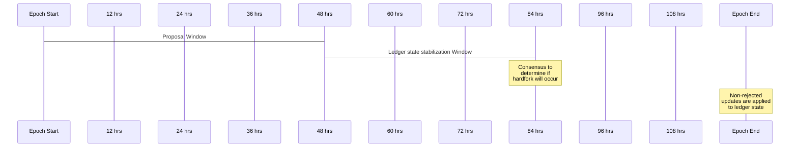

## Simple Summary / Abstract

This CIP proposes lifting a specific, manual safety check to the protocol.
In particular, a new on-chain mechanism will replace the step in the off-chain
hardfork procedure where the governance body gathers information about which
stake pool operators have upgraded to the version of the software which
supports an upcoming hardfork.

Ever since the Shelley ledger era, block headers have included a protocol
version indicating the maximum supported protocol version that the block
producer is capable of supporting (see section 13, Software Updates, of the
[Shelley ledger specification](https://hydra.iohk.io/job/Cardano/cardano-ledger/shelleyLedgerSpec/latest/download-by-type/doc-pdf/ledger-spec)).

This (semantically meaningless) field provides a helpful metric for determining
how many blocks will be produced after a hardfork,
since nodes that have not upgraded will no longer produce blocks.
(Nodes that have not upgraded will fail the `chainChecks` check from Figure 74
of the Shelley ledger specification, since the major protocol version in the
ledger state will exceed the node's max major protocol version value,
and hence can no longer make blocks.)

If most of the blocks in the recent past (e.g. the last epoch) are
broadcasting their readiness for a hardfork,
we know that it is safe to propose an update to the major protocol version
which triggers a hardfork.

This CIP proposes automating this specific check,
making the protocol version in the header semantically meaningful.
The ledger state will determine the stake
(represented as the proportion of the active stake) of all the block producers
whose last block contained the next major protocol version.
Moreover, a new protocol parameter `hardforkThreshold` will be used to reject
any protocol parameter update that proposes to change the major protocol
version but does not have enough backing stake.

## Motivation / History

Currently, the governance key holders collectively agree to increase the major
protocol version.  This allows them to make a human judgment as to the
readiness of the network for a hardfork (using the mechanism described above).
Since only a few, well-aligned parties are involved, this is currently easy to
coordinate.  As we move into the Voltaire phase, where the governance of the
network is decentralized,
it is imperative that we codify this human judgment in the protocol itself.

## Specification

### New Protocol Parameter

There will be a new protocol parameter named `hardforkThreshold`,
containing a rational number.

The bounds of `hardforkThreshold` need to be considered with care
so that unsafe values are not possible and to place checks and balances on the
governance mechanism.
The minimum value should greater than a half, and the maximum value should be
less than one.
The exact bounds need further, careful consideration.

### Tracking Hardfork endorsements

The ledger state will maintain a set of stake pool IDs corresponding to the
block producers whose last block endorsed the next major protocol version.
Endorsing here means that the major protocol version in the block header is
exactly one more than the current major protocol version in the ledger state.
Note that the protocol version in the block header is set by the particular
cardano-node release being used by the block producer.
When no hardfork is anticipated, the node will be configured to place the
current major protocol version in the block header, indicating that the node
is not ready for any hardfork.
When a new release is introduced which can handle an upcoming hardfork,
the node will be configured to use the next major protocol version in the
block header.

Note that there is no ambiguity regarding what the endorsement in the
block header is referring to, since the major protocol version is only allowed
to increase by one.
Moreover, regardless of what update proposals the governance keys have
proposed, each block header indicates that the corresponding block producer is
either prepared for the major protocol version to increase, or that it is not
prepared for it to increase.
This CIP does not address the problems that arise from multiple versions of
the software (potentially with different semantics) broadcasting the same
major protocol version. These problems will have to be addressed as progress
is made towards a full decentralized governance.

Whenever the major protocol version is updated, the set of endorsements is
reset to the empty set.

In order to track the endorsements, the `TICK` ledger rule will need two items
added to the environment (since the Shelley era, the `TICK` rule has had an
empty environment).
In particular, it will need the following from the block header:
* The pool ID of the block producer
* The major protocol version

### Rejecting Updates

The main point of the safeguard introduced in this CIP is the ability to reject
protocol parameter updates which propose to increase the major protocol version
when not enough block producers are prepared.
The rejection will happen in both the consensus layer and the ledger layer.

The timing of the rejection is critical, and requires understanding a bit about
the timing of the hardfork combinator (see the diagram below).
Ouroboros (Praos and Genesis) have a notion of a stability window,
corresponding to the duration of slots after which the consensus mechanism will
no longer roll back a block.
The stability window is currently three tenths of the epoch length
(36 hours on mainnet).
The hardfork combinator requires that the changes to the ledger state which
enact a hardfork (confirmed proposals to increase the major protocol version)
be stable two stability windows before the end of the epoch.
See section 17.4, Ledger restrictions, of the
[consensus report](https://github.com/input-output-hk/ouroboros-network/tree/314845c4087bc6e662d7df0d376ab1910a5b5476/ouroboros-consensus/docs/report).
Therefore protocol parameter updates for the next epoch boundary must be
submitted during the first four tenths of the epoch.
Call this first four tenths of each epoch the "proposal window" for the
purposes of this document.
The consensus layer
[analyzes](https://github.com/input-output-hk/ouroboros-network/blob/314845c4087bc6e662d7df0d376ab1910a5b5476/ouroboros-consensus-shelley/src/Ouroboros/Consensus/Shelley/Ledger/Inspect.hs#L77-L96)
the ledger state one stability window after the proposal window has ended to
determine if the major protocol version will be increased at the next epoch
boundary.
The ledger itself does not apply the protocol parameter update until the
epoch boundary.

To apply the new safeguard, the consensus layer will now use new logic for
determining if the major protocol will be increased, and the ledger will
need to use the exact same logic on the epoch boundary.
The new logic will take the same parameters that are currently being
used to make the determination.
See [protocolUpdates](https://github.com/input-output-hk/ouroboros-network/blob/314845c4087bc6e662d7df0d376ab1910a5b5476/ouroboros-consensus-shelley/src/Ouroboros/Consensus/Shelley/Ledger/Inspect.hs#L106-L110),
and note that the set of endorsements, the stake distribution, and the
protocol parameters will all included in what the consensus layer calls the
`LedgerState`, and what the ledger layer calls the `NewEpochState`
(the endorsements will be added to `LedgerState`, but the pool stake
distribution and the protocol parameters are already included).

The new logic for determining if the major protocol version will change is:
  * Has quorum been met on the proposed protocol parameter updates?
    * If not, there is nothing else to do.
    * If so, proceed.
  * Does the update modify the major protocol parameter version?
    * If not, the update will be applied on the epoch boundary, and there is
      nothing else to do.
    * If so, proceed.
  * What is the sum of the relative, active stake of the block producers listed
    in the endorsement set defined in the
    [previous section](#tracking-hardfork-endorsements)?
    Note that the stake distribution used here is the same as stake
    distribution currently being used for block production.
  * Is the sum computed above at least as large as the value of the
    `hardforkThreshold` protocol parameter?
    * If not, the entire update is rejected.
    * If so, the update will be applied on the epoch boundary.

#### Timing diagram

The following table illustrates the timing described above,
using the durations on mainnet (five-day epochs).

## Rationale

The safeguard presented in this CIP aligns very closely with the manual check
currently performed
today before any hardfork.
Moreover, we have strived to make the minimal changes needed to automate
the check.

## Backwards compatibility

This change is not backwards compatible; it requires a hardfork.
Since it only adds a new safeguard to the ledger rules, however,
no changes are needed to the serialization or to any downstream components.

## Path to Active

A hardfork is required for these changes.
A new ledger era is needed, containing the changes described.
The consensus layer will require minimal changes, namely
support for the new ledger era and adopting the new logic for determining if a
hardfork is immanent.

## Copyright

This CIP is licensed under [CC-BY-4.0](https://creativecommons.org/licenses/by/4.0/legalcode)
