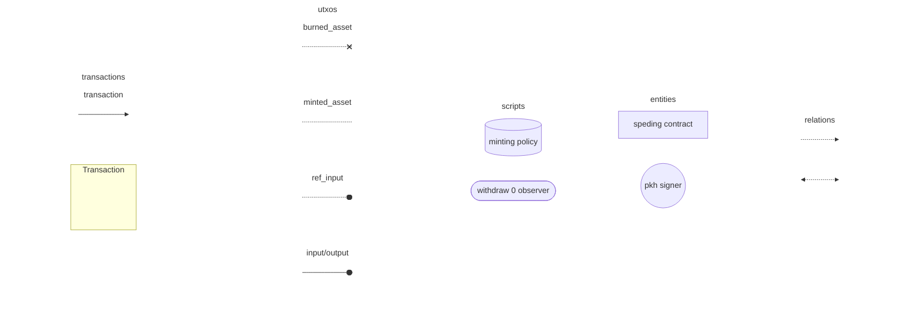
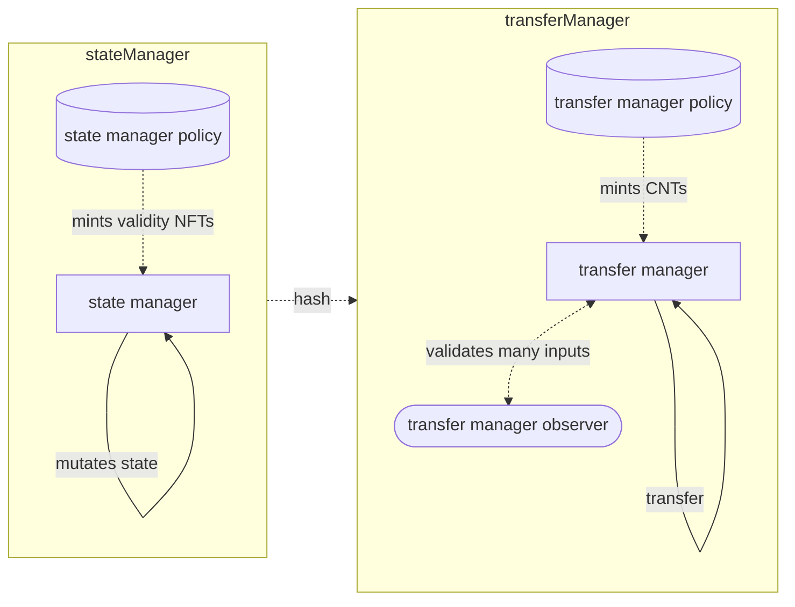
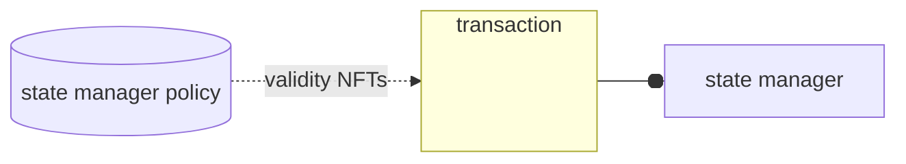
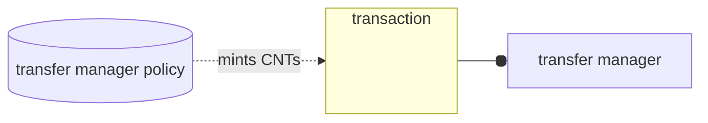
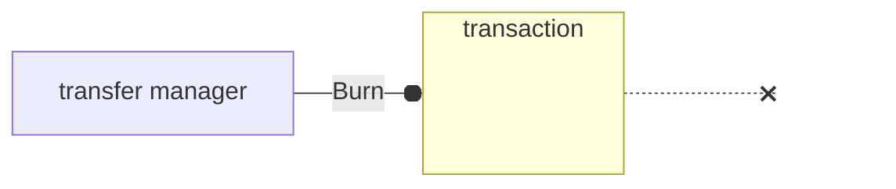
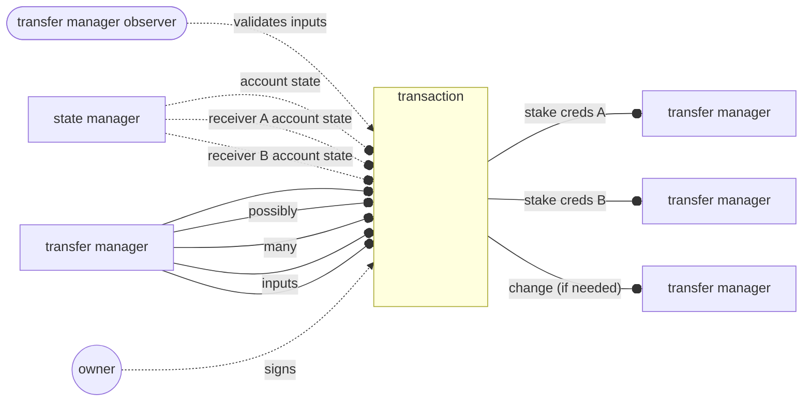

## Abstract
This CIP proposes a standard that if adopted would allow the same level of programmability of other ecosistems at the price of the token true ownership.

This is achieved imitating the way the account model works laveraging the UTxO structure adopted by Cardano.

## Motivation: why is this CIP necessary?

This CIP proposes a solution at the Cardano Problem Statement 3 ([CPS-0003](https://github.com/cardano-foundation/CIPs/pull/382/files?short_path=5a0dba0#diff-5a0dba075d998658d72169818d839f4c63cf105e4d6c3fe81e46b20d5fd3dc8f)).

If adopted it would allow to introduce the programmability over the transfer of tokens (meta-tokens) and their lifecycle.

The solution proposed includes (answering to the open questions of CPS-0003):

1) very much like account based models, wallets supporting this standard will require to know the address of the smart contract (validator)

2) the standard defines what is expected for normal transfer transaction, so that wallets can independently construct transactions

3) the solution can co-exist with the existing native tokens

4) the implementation is possible without hardfork since Vasil

5) optimized implementations SHOULD NOT take significant computation, especially on transfers.

## Specification

The key words "MUST", "MUST NOT", "REQUIRED", "SHALL", "SHALL
NOT", "SHOULD", "SHOULD NOT", "RECOMMENDED",  "MAY", and
"OPTIONAL" in this document are to be interpreted as described in
[RFC 2119](https://datatracker.ietf.org/doc/html/rfc2119).

In the specification we'll use the haskell data type `Data`:
```hs
data Data
    = Constr Integer [Data]
    | Map [( Data, Data )]
    | List [Data]
    | I Integer
    | B ByteString
```

we'll use the [plu-ts syntax for structs definition](https://pluts.harmoniclabs.tech/onchain/Values/Structs/definition#pstruct) as an abstraction over the `Data` type.

finally, we'll use [`mermaid`](https://mermaid.js.org/) to help with the visualization of transactions and flow of informations.

In order to do so we introduce here a legend

### Legend



### High level idea

The core idea of the implementation is to emulate the ERC20 standard; where tokens are entries in a map with addresses (or credentials in our case) as key and integers (the balances) as value. ([see the OpenZeppelin implementation for reference](https://github.com/OpenZeppelin/openzeppelin-contracts/blob/9b3710465583284b8c4c5d2245749246bb2e0094/contracts/token/ERC20/ERC20.sol#L16));

Unlike the ERC20 standard; this CIP:

- allows for multiple entries with the same key (same credentials can be used for multiple accounts, though not particularly useful)
- DOES NOT include an equivalent of the `transferFrom` method; if needed it can be added by a specific implementation but it won't be considered part of the standard.
- allows for multiple inputs (from the same sender, scripts and multisigs MAY also be used) and multiple outputs (possibly many distinct reveivers)

> **NOTE: Multiple Inputs**
>
> the UTxO model allows for multiple transfers in one transaction
>
> this would allow for a more powerful model than the account based equivalent but implies higher execution costs
>
> with the goal of keeping the standard simple we allow only a single sender
>
> we MUST however account for multiple inputs from the same sender due to
> the creation of new UTxOs in receiving transactions.

### Design

with the introduction of [CIP-69](https://github.com/cardano-foundation/CIPs/tree/master/CIP-0069) in Plutus V3 the number of contracts required are only 2, covering different purposes.

1) a `stateManager` contract
    - with minting policy used to proof the validity of account's state utxos
    - spending validator defining the rules to update the states
2) a `transferManager` parametrized with the `stateManager` hash
    - having minting policy for the tokens to be locked in the spending validator
    - spending validator for the validation of single utxos (often just forwarding to the withdraw 0)
    - certificate validator to allow registering the stake credentials (always succeed MAY be used) and specify the rules for de-registration (always fail MAY be used, but some logic based on the user state is RECOMMENDED)
    - withdraw validator to validate the spending of multiple utxos.




an external contract that needs to validate the transfer of a programmable token should be able to get all the necessary informations about the transfer by looking for the redeemer with withdraw purpose and `transferManager` stake credentials. 


### Datums and Redeemers

#### `Account`

The `Account` data type is used as the `stateManager` datum; and is defined as follows:

```ts
const Account = pstruct({
    Account: {
        credentials: PCredential.type,
        state: data
    }
});
```

The only rule when spending an utxo with `Account` datum is that the NFT present on the utxo
stays in the same contract.

The standard does not impose any rules on the redeemer to spend the utxo,
as updating the state is implementation-specific.

#### `TransferRedeemer`

redeemer to be used in the withdraw 0 contract
when spending (possibly many) utxos from the `transferManager` contract.

> NOTE:
>
> there is no standard datum for the `transferManager` since the utxos might not have a datum at all
>
>

```ts
const TransferOutput = pstruct({
    TransferOutput: {
        credential: PCredential.type,
        amount: int
    }
});

const TransferRedeemer = pstruct({
    Transfer: {
        inputIndicies: list( int ),
        outputs: list( TransferOutput.type ),
        firstOutputIndex: int
    }
});
```

#### `SingleTransferRedeemer`

redeemer to be used on a single utxo of the `transferManager`;

```ts
const SingleTransferRedeemer = pstruct({
    Transfer: {},
    Burn: {}
});
```


### Transactions

#### New Account generation




The only purpose of this transaction is to validate the initial state at the moment of creation of an account


#### Account State Update


also here, the standard does not impose any rules, as state update is meant to be implementation-specific

#### Minting Tokens



implementation specific

#### Burning Tokens



#### Transfer




## Rationale: how does this CIP achieve its goals?
<!-- The rationale fleshes out the specification by describing what motivated the design and what led to particular design decisions. It SHOULD describe alternate designs considered and related work. The rationale SHOULD provide evidence of consensus within the community and discuss significant objections or concerns raised during the discussion.

It MUST also explain how the proposal affects the backward compatibility of existing solutions when applicable. If the proposal responds to a CPS, the 'Rationale' section SHOULD explain how it addresses the CPS, and answer any questions that the CPS poses for potential solutions.
-->

The [first proposed implementation](https://github.com/cardano-foundation/CIPs/pull/444/commits/525ce39a89bde1ddb62e126e347828e3bf0feb58) (which we could informally refer as v0) was quite different by the one shown in this document

Main differences were in the proposed:
- [use of sorted merkle trees to prove uniqueness](https://github.com/cardano-foundation/CIPs/pull/444/commits/525ce39a89bde1ddb62e126e347828e3bf0feb58#diff-370b6563a47be474523d4f4dbfdf120c567c3c0135752afb61dc16c9a2de8d74R72) of an account during creation;
- account credentials as asset name

this path was abandoned due to the logaritmic cost of creation of accounts, on top of the complexity.

Other crucial difference with the first proposed implementation was in the `accountManager` redeemers;
which included definitions for `TransferFrom`, `Approve` and `RevokeApproval` redeemers, aiming to emulate ERC20's methods of `transferFrom` and `approve`;

after [important feedback by the community](https://github.com/cardano-foundation/CIPs/pull/444#issuecomment-1399356241), it was noted that such methods would not only have been superfluous, but also dangerous, and are hence removed in this specification.

After a first round of community feedback, a [reviewed stadard was proposed](https://github.com/cardano-foundation/CIPs/pull/444/commits/f45867d6651f94ba53503833098d550326913a0f) (which we could informally refer to as v1).
[This first revision even had a PoC implementation](https://github.com/HarmonicLabs/erc20-like/commit/0730362175a27cee7cec18386f1c368d8c29fbb8), but after further feedback from the community it was noted that the need to spend an utxo on the receiving side could cause UTxO contention in the moment two or more parties would have wanted to send a programmable token to the same receiver at the same time.

The specification proposed in this file addresses all the previous concerns.

The proposal does not affect backward compatibilty being the first proposing a standard for programmability over transfers;

exsisting native tokens are not conflicting for the standard, instead, native tokes are used in this specification for various purposes.

## Path to Active

### Acceptance Criteria
<!-- Describes what are the acceptance criteria whereby a proposal becomes 'Active' -->

- having at least one instance of the smart contracts described on:
    - mainnet
    - preview testnet
    - preprod testnet
- having at least 2 different wallets integrating meta asset functionalities, mainly:
    - displayning balance of a specified meta asset if the user provides the address of the respecive account manager contract
    - independent transaction creation with `Transfer` redeemers

### Implementation Plan
<!-- A plan to meet those criteria. Or `N/A` if NOT applicable. -->

- [ ] [PoC implementation](https://github.com/HarmonicLabs/erc20-like)
- [ ] [showcase transactions](https://github.com/HarmonicLabs/erc20-like)
- [ ] wallet implementation 

## Copyright

This CIP is licensed under [CC-BY-4.0](https://creativecommons.org/licenses/by/4.0/legalcode).
