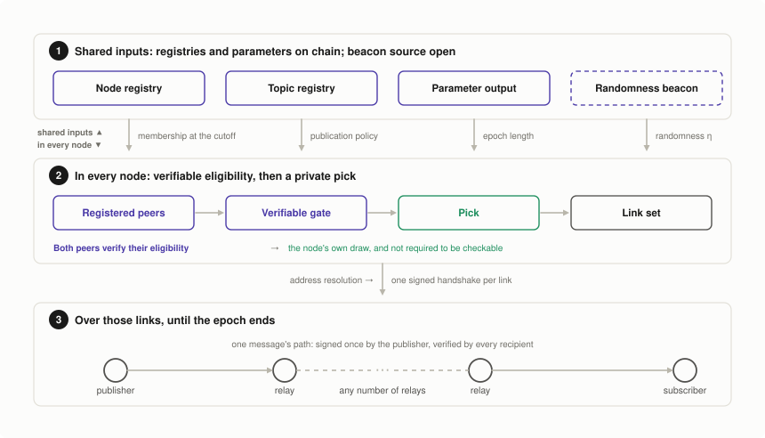
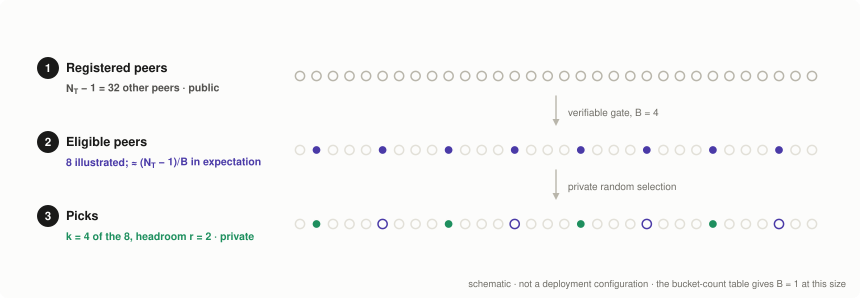
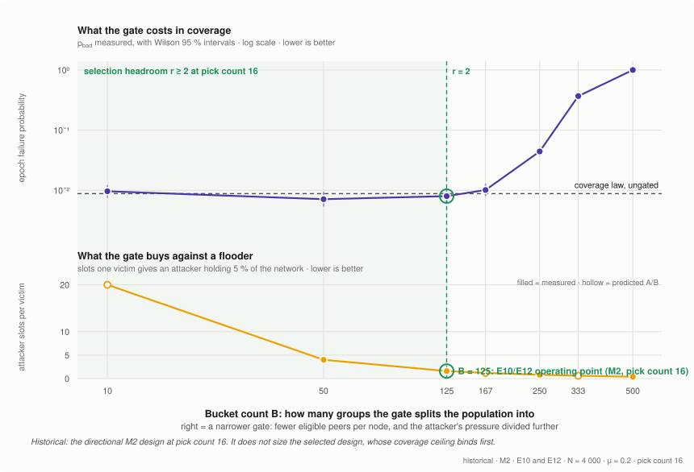

## Abstract

Cardano applications need to exchange trustworthy messages outside the ledger: emergency alerts to stake pool operators, pool announcements, governance updates and dApp notifications. Existing channels do not provide a common way to authenticate publishers against Cardano identities and resist targeted suppression.

This proposal defines a topic-based publish/subscribe protocol that runs alongside Cardano. PubSub nodes register on chain and lock a refundable deposit. For each **dissemination epoch**, a protocol period distinct from a Cardano ledger epoch, public randomness determines which pairs of registered nodes may connect; each node privately selects peers from that eligible set. The resulting links carry signed messages in both directions. Every subscriber relays messages, while sequence numbers and temporary caches support gap detection and recovery. Message content stays off chain.

The selected design combines a verifiable eligibility rule with a per-node admission limit. Analysis and simulation support its cost and coverage estimates under stated assumptions about adversarial participation and independent downtime. Rotation gives isolated subscribers another opportunity to reconnect; it does not guarantee delivery within one epoch.

The beacon, deployment parameters and several interoperability rules remain open. This draft specifies the architecture and selected dissemination design; the Rationale separates evidence from predictions, and Path to Active lists the work needed for deployment.

<details>
  <summary><h2>Table of contents</h2></summary>

- [Abstract](#abstract)
- [Motivation: Why is this CIP necessary?](#motivation-why-is-this-cip-necessary)
- [Specification](#specification)
  - [Overview](#overview)
  - [Epochs](#epochs)
  - [Topology derivation](#topology-derivation)
    - [The registered peers on a topic](#the-registered-peers-on-a-topic)
    - [The verifiable gate](#the-verifiable-gate)
    - [The bucket count](#the-bucket-count)
    - [Selection](#selection)
    - [The relay link and the pick count](#the-relay-link-and-the-pick-count)
    - [The serving cap](#the-serving-cap)
    - [Small topics](#small-topics)
  - [Link establishment](#link-establishment)
  - [Messages](#messages)
  - [Dissemination, recovery and retention](#dissemination-recovery-and-retention)
  - [Services](#services)
    - [Identity and keys](#identity-and-keys)
    - [The node registry](#the-node-registry)
    - [The topic registry](#the-topic-registry)
      - [Topic identifier derivation](#topic-identifier-derivation)
    - [The parameter output](#the-parameter-output)
    - [The randomness beacon](#the-randomness-beacon)
    - [Address resolution](#address-resolution)
    - [Lifecycle and the registration cutoff](#lifecycle-and-the-registration-cutoff)
  - [Parameters](#parameters)
  - [Canonical encoding and domain separation](#canonical-encoding-and-domain-separation)
  - [Versioning](#versioning)
- [Rationale: How does this CIP achieve its goals?](#rationale-how-does-this-cip-achieve-its-goals)
  - [The adversary this proposal defends against](#the-adversary-this-proposal-defends-against)
  - [What the symmetric relay link gives](#what-the-symmetric-relay-link-gives)
  - [How the evidence was obtained](#how-the-evidence-was-obtained)
  - [Alternatives considered](#alternatives-considered)
  - [Sizing the parameters](#sizing-the-parameters)
    - [Choosing the admission parameters](#choosing-the-admission-parameters)
    - [What can be turned, and what it costs](#what-can-be-turned-and-what-it-costs)
  - [What a subscriber is guaranteed](#what-a-subscriber-is-guaranteed)
    - [Two classes of fault, with different guarantees](#two-classes-of-fault-with-different-guarantees)
    - [What the protocol guarantees instead](#what-the-protocol-guarantees-instead)
    - [How long an epoch may be](#how-long-an-epoch-may-be)
  - [Limits of this evidence](#limits-of-this-evidence)
  - [Backward compatibility](#backward-compatibility)
  - [Open Questions](#open-questions)
    - [Responses to CPS questions](#responses-to-cps-questions)
    - [Remaining design choices](#remaining-design-choices)
      - [Deposit decay](#deposit-decay)
      - [Authority over the parameter output](#authority-over-the-parameter-output)
- [Path to Active](#path-to-active)
  - [Acceptance Criteria](#acceptance-criteria)
  - [Implementation Plan](#implementation-plan)
- [References](#references)
  - [Prior art](#prior-art)
  - [External specifications this proposal builds on](#external-specifications-this-proposal-builds-on)
  - [Related CIPs](#related-cips)
  - [This proposal's own prior work](#this-proposals-own-prior-work)
  - [This proposal's evidence](#this-proposals-evidence)
  - [This proposal's reference implementation](#this-proposals-reference-implementation)
  - [Companion tools](#companion-tools)
  - [Open items tracked outside this document](#open-items-tracked-outside-this-document)
  - [Method notes](#method-notes)
- [Appendices](#appendices)
  - [Terminology](#terminology)
  - [Sizing derivations](#sizing-derivations)
    - [The coverage law](#the-coverage-law)
    - [Including admission refusals](#including-admission-refusals)
    - [The three ceilings](#the-three-ceilings)
    - [Admission parameter bands](#admission-parameter-bands)
    - [Below the gate](#below-the-gate)
    - [What remains to be measured](#what-remains-to-be-measured)
  - [Registry schemas](#registry-schemas)
- [Acknowledgements](#acknowledgements)
- [Copyright](#copyright)

</details>

<details>
  <summary><h2>Index of figures</h2></summary>

- [Figure 1: The protocol at a glance](#figure-1)
- [Figure 2: Deriving one node's links for one epoch](#figure-2)
- [Figure 3: Establishing one link](#figure-3)
- [Figure 4: Joining as a node](#figure-4)
- [Figure 5: Measured against predicted epoch failure probability, across the five designs the companion describes](#figure-5)
- [Figure 6: Historical directional gate experiment (M2, 4,000 nodes, 16 picks)](#figure-6)
- [Figure 7: M4 measurements and reference predictions](#figure-7)

</details>

<details>
  <summary><h2>Index of tables</h2></summary>

- [Table 1: The services the protocol reads](#table-1)
- [Table 2: Candidate bucket counts by topic population, for 10 picks, 20% adversarial nodes and a failure target of 10⁻⁴](#table-2)
- [Table 3: Measured reference at N = 20,000, B = 500 and C = 23](#table-3)
- [Table 4: The protocol's parameters](#table-4)
- [Table 5: The assumptions a deployment chooses](#table-5)
- [Table 6: Reference configuration: measurements and predictions](#table-6)
- [Table 7: Per-node cost against topics subscribed, at 1 kB and one message per second](#table-7)
- [Table 8: The constants this section is measured at](#table-8)
- [Table 9: Structural comparison of the dissemination designs](#table-9)
- [Table 10: The two candidates under the admission rules](#table-10)
- [Table 11: Per-epoch isolation risk, per node and network-wide, at the ungated pick count the comparison was run at](#table-11)
- [Table 12: Departure interval required per epoch length](#table-12)
- [Table 13: The protocol's vocabulary](#table-13)
- [Table 14: What each closed row gives up at its top](#table-14)

</details>

## Motivation: Why is this CIP necessary?

The accompanying [CPS](https://github.com/input-output-hk/pubsub/blob/main/docs/cps/README.md) describes the communication gap, its stakeholders and the outcomes a solution should provide. This proposal addresses it through authenticated publication, deposit-backed membership and verifiable limits on peer selection.

The principal evaluation scenario is emergency alerts to thousands of stake pool operators. The main comparisons use topics of 4,000 and 20,000 registered nodes. Wallet-mediated use cases may involve only tens of direct participants; the proposed small-topic rules still require validation at that scale.

## Specification

This section introduces the protocol, follows one dissemination period, then defines the services it reads.

The key words MUST, MUST NOT, SHOULD, SHOULD NOT and MAY are to be interpreted as described in [RFC 2119](https://www.rfc-editor.org/rfc/rfc2119).

A [reference prototype](#this-proposals-reference-implementation) supplies the node logic used in the experiments. It does not yet implement the complete specification; its omissions and encoding differences are recorded in the correspondence document.

### Overview

A publisher uses PubSub to send a message to a [topic](#term-topic), a named message stream such as a stake pool's announcements. Subscribers choose the topics whose messages they want to receive. PubSub [nodes](#term-node) are the processes that exchange these messages; they run separately from Cardano nodes. Every subscribing node also forwards messages to other nodes it is connected to on that topic, so the publisher does not have to send a separate copy to every subscriber.

The protocol has two parts. Shared services record which nodes participate in each topic, who is allowed to publish there, and the settings the network uses. Nodes read these records from the services and use them to build an off-chain network that carries the messages. This proposal stores those records on Cardano. A shared source of randomness helps determine which nodes may connect; this source may be outside Cardano. Message content stays off chain.

For each topic, a node periodically chooses other nodes, its **peers**, to exchange messages with. It keeps that selection for a [dissemination epoch](#term-epoch), then chooses again. The process has four steps:

1. **Read the shared records.** Find the nodes registered for the topic, the keys permitted to publish on it, and the shared settings. Every node reads the same agreed version of these records, so they start from the same information. In this proposal, that version is fixed by a position in the Cardano chain.
2. **Choose which peers to contact.** For each other registered node on the topic, apply the **gate**: an agreed rule that decides whether these two nodes are allowed to open a link on this topic during this epoch. Both endpoints must be able to verify that decision. From the peers that pass, choose a limited number using the node's own private randomness.
3. **Ask the selected peers to connect.** Send each peer a signed request to open a [link](#term-link), a channel for exchanging messages on this topic. The peer checks the request and the gate rule. It also limits the additional links it accepts beyond its own selections, so a permitted connection can still be refused for lack of capacity. An accepted link carries messages in both directions.
4. **Publish, forward and recover messages.** Publishers sign their messages. A receiving node checks that a message is valid and its publisher is allowed to publish on the topic before delivering it to the subscribed application or forwarding it to connected peers. Each publisher numbers its messages on a topic. A gap in those numbers reveals a missing message, which the node tries to recover from copies its peers have temporarily stored.

At the next epoch, nodes choose peers again using fresh randomness. They ask their new peers for the latest signed messages they hold and request any missing ranges. A subscriber whose current peers are all offline or withholding messages gets another opportunity to connect to peers that will forward them. Repeated isolation remains possible; choosing again does not guarantee delivery.

<div align="center">
<a name="figure-1" id="figure-1"></a>



<em>Figure 1: The protocol at a glance</em>

</div>

The top band of Figure 1 shows the three shared records used in step 1: the node registry, topic registry and parameter output. The randomness beacon supplies the common random value used in step 2. Its dashed box marks a source that may be off-chain; the three records are stored on Cardano in the implementation specified here. Each node also uses its identity key and private randomness, which are not shown as separate inputs. After selecting a peer, the node uses address resolution to find the network address to contact in step 3. Table 1 lists these services; [Services](#services) specifies their requirements and proposed providers in detail.

<div align="center">
<a name="table-1" id="table-1"></a>

| Service | Supplies | What the protocol needs of it | Specified provider |
| --- | --- | --- | --- |
| [Node registry](#the-node-registry) | Registered nodes, their topics, identity keys and deposits | Every node can read the complete list at the agreed chain position; creating an entry has a cost, and it remains until retired | One Cardano script output per node |
| [Topic registry](#the-topic-registry) | Existing topics, permitted publishers and how long messages are kept | Every node can read the complete list at the same position; only the topic's owner may change its entry | One script output per topic |
| [Parameter output](#the-parameter-output) | Which deployment this is and how long its epochs last | One shared record per deployment, read at the same position; changes announced an epoch ahead | A single script output |
| [Randomness beacon](#the-randomness-beacon) | One shared random value for each epoch | Every node can obtain the same value from public data; an attacker cannot steer it towards preferred connections, including by trying many alternatives; it becomes known only after membership is fixed | Source still open: derived from Cardano or supplied externally |
| [Address resolution](#address-resolution) | The network address at which a registered node can be contacted | Every peer can look it up and verify it against the node's identity key; it can change during an epoch; a failed lookup leaves the node unreachable | The network address in the node's own registry entry |

<em>Table 1: The services the protocol reads</em>

</div>

Table 1 separates what each service must provide from how this proposal provides it. Other providers can be assessed against those requirements. The proposed registries and parameter record still depend on Cardano; choosing an external randomness source does not remove that dependency. Behaviour during a chain halt, fork or unavailable service remains an [open question](#open-questions).

Because nodes start from a shared registry, they do not depend on peers to recommend whom to contact. Both endpoints must be able to verify whether their link is allowed for that topic and epoch. The evaluated hash-based gate also makes eligibility publicly recomputable; this is a property of that baseline, not a requirement to publish every node's eligible peers. The gate limits an attacker's choice of connections, but it cannot prove that a node chose its peers randomly or forwarded messages.

### Epochs

A **dissemination epoch**, indexed *e*, is the period for which nodes keep their selected topology. Its duration, *T*<sub>epoch</sub>, is read from the [parameter output](#the-parameter-output) and is independent of Cardano's five-day ledger epoch. In this CIP, “epoch” means a dissemination epoch unless explicitly qualified. Nodes draw fresh links for the next epoch. Repeated isolation remains possible; the Rationale states its [probability and assumptions](#what-the-protocol-guarantees-instead).

To derive that topology, nodes read a [snapshot](#term-snapshot) of both registries and the parameter output at a fixed chain position, the **registration cutoff**. This records PubSub state, separately from the ledger's stake-distribution snapshots. The cutoff must precede determination of the epoch's randomness, *η*<sub>e</sub>, so membership changes cannot be chosen after seeing where an identity would land. [Lifecycle and the registration cutoff](#lifecycle-and-the-registration-cutoff) specifies the snapshot rules; the [beacon](#the-randomness-beacon) supplies the randomness.

Epoch length must allow topology formation and a fresh beacon value, while remaining within the downtime budget. These constraints are discussed under [How long an epoch may be](#how-long-an-epoch-may-be).

### Topology derivation

Nodes start from the epoch's snapshot and randomness, *η*<sub>e</sub>, and apply an agreed gate to determine which peers they may contact. The gate gives one shared eligibility decision for each pair, verifiable by both endpoints. Selecting actual peers from the eligible set additionally uses private randomness. The public hash construction below is the evaluated baseline; the final gate construction remains open.

<div align="center">
<a name="figure-2" id="figure-2"></a>



<em>Figure 2: Deriving one node's links for one epoch</em>

</div>

The three rows are the same peers, marked three times over.

- **Row 1** is the other nodes whose [node-registry](#the-node-registry) entries are active and list the topic at that epoch's [registration cutoff](#term-snapshot), so every node reads the same membership.
- **Row 2** is the smaller set this node may link with; the [bucket count](#term-b) *B* decides how much smaller, and a node looks it up in [Table 2](#table-2) by how many peers the topic has.
- **Row 3** is the *k* peers the node picks from row 2, using randomness of its own.

The figure uses a schematic example: 32 peers, eight shown as eligible and four selected. These illustrate the three sets, not a deployment configuration; Table 2 switches the gate off at this population. [Selection headroom](#term-r) measures how much choice the node has: the expected number of eligible peers in row 2 for each peer it plans to pick in row 3. It does not guarantee the size of any individual node's eligible set.

Row 1 is public. Each endpoint must be able to verify its pairwise eligibility in row 2; the evaluated hash baseline additionally lets anyone recompute that row. Row 3 is private and cannot be checked for uniform selection or participation. The full acceptance procedure, including signature, epoch, membership, gate and capacity checks, is specified under [Link establishment](#link-establishment).

#### The registered peers on a topic

Write *N*<sub>T</sub> for the number of nodes whose entries in the epoch's agreed snapshot are active and list topic *T*. Entries marked withdrawing in that snapshot MUST be excluded from both this count and the eligible peer list. A node remains included for any epoch whose fixed snapshot still records it as active. *Active* refers to the registry state; offline nodes with active entries still count.

For a node *a* among them, the potential peers are the other *N*<sub>T</sub> − 1 members, shown in row 1 of [Figure 2](#figure-2). The node starts from this complete list. It does not depend on another peer to supply a sample of that list. Registration alone does not establish a link or mean that the gate below permits one.

#### The verifiable gate

The gate is the step from row 1 to row 2 of [Figure 2](#figure-2): it narrows the candidates to those a node is permitted to link with in this epoch.

The gate MUST give one shared decision for each unordered pair of registered nodes on a topic in an epoch. Both endpoints MUST be able to verify that decision using the agreed epoch inputs and any additional inputs or evidence required by the chosen construction. The choice of which endpoint initiates a link MUST NOT give the pair a second chance to pass. Public enumeration of every node's eligible peers is not required.

The analysis assumes each pair is eligible with probability 1/*B*, with membership fixed before the epoch randomness is known. A replacement construction must justify the eligible-pool distribution and dependencies used by that analysis; matching the pass rate alone is insufficient.

**Evaluated hash baseline.** The current evidence uses a public hash-based gate. Its calculation below fixes the baseline's byte inputs; it does not select hashing as the final eligibility mechanism. For a pair (*a*, *b*) on topic *T* under randomness *η*, with an operation label *d* (the **domain tag**) and [bucket count](#term-b) *B*:

$$\mathrm{gate}_d(a, b, T, \eta, B) \iff \mathrm{trunc}_{64}\big(\mathrm{SHA\text{-}256}(P)\big) \bmod B = 0$$

A pair passes when its digest lands in bucket zero, so one pair in *B* is admitted. Every value of *B* in [Table 2](#table-2) is a power of two, which makes that reduction a mask on the low bits rather than a division, and the pass rate exactly 1/*B*.

To compute this baseline gate, both nodes build the same byte string *P*, the input to the hash, also called its **preimage**. [Canonical encoding and domain separation](#canonical-encoding-and-domain-separation) defines the shared rules for constructing hash and signature inputs. For this gate:

$$P = \mathrm{LP}(d) \,\|\, \mathrm{LP}(\eta) \,\|\, \mathrm{LP}(T) \,\|\, \mathrm{LP}(a) \,\|\, \mathrm{LP}(b)$$

Here `LP` adds a length prefix and ‖ joins byte strings; *T* is the raw 32-byte topic identifier and *a*, *b* are the raw identity public keys, never a display form. The two keys MUST be sorted by their raw bytes before they enter *P*, so that both ends compute the same preimage and the same answer, and neither can claim a link the other cannot see. `trunc`<sub>64</sub> takes the first eight bytes of the digest as a big-endian unsigned integer. *B* = 1 makes the gate vacuous and every registered peer eligible, which is the correct degenerate behaviour on a topic too small to bucket.

The sorted-pair gate gives one eligibility draw per relationship. The [companion](design-comparison.md#the-either-direction-rule) compares it with admitting a pair when either directional draw passes.

The evaluated hash gate uses the domain tag `pubsub/gate/relay/v1`.

The **eligible set** *S*(*a*, *T*) is the peers among those *N*<sub>T</sub> − 1 members for which the gate holds. In this baseline, SHA-256[^hashes] is modelled as a random oracle over the fixed identities and the epoch randomness, so roughly (*N*<sub>T</sub> − 1)/*B* of them are eligible, and an adversary holding *A* identities has roughly *A*/*B* of its own eligible for any chosen victim. That division is the gate's purpose: it is what an attacker cannot escape by registering more identities, because each of them lands in a bucket it did not choose.

For a chosen victim, each adversarial identity passes the gate with probability 1/*B*. Obtaining one eligible hostile identity therefore costs about *B* deposits in expectation, provided identities are fixed before the randomness is known. The [serving cap](#the-serving-cap) separately limits peer-initiated admissions.

A private gate construction remains open. Any proposal must specify its key registration, eligibility verification and proof exchange, and assess grinding, computation cost and the resulting topology. No VRF-based or other private construction has been selected or validated by the evidence cited here.

#### The bucket count

A larger bucket count makes eligible peers scarcer for both attackers and honest nodes. As the number of eligible peers approaches the pick count, a node has less choice among them. If no more than *k* peers are eligible, it requests links to all of them. Its selections then involve no further private choice, although the gate still draws the eligible set using epoch randomness. The [selection headroom](#term-r) measures the expected number of eligible peers per planned pick — row 2 against row 3 of [Figure 2](#figure-2) — for a node with pick count *k*:

$$r = \frac{N_\text{T} - 1}{B \cdot k}$$

Since the gate leaves a node roughly (*N*<sub>T</sub> − 1)/*B* eligible peers, *r* is how many of them it has for each pick it must make. At *r* = 1 the expected pool size equals the pick count; individual pools can be larger or smaller. The candidate sizing rules below retain expected headroom of at least two where the gate is on, as a provisional constraint.[^floor]

**Only one of these has to be identical across nodes.** An acceptor verifies pairwise eligibility on every dial it receives, so two nodes that disagree about the [bucket count](#term-b) *B* disagree about which links are legal, and refuse each other. Nothing checks a dialler's [pick count](#term-pick-count) *k*, and the [serving cap](#term-cap) *C* is the acceptor's own capacity, so a node that sizes either badly loses coverage or capacity without disagreeing with anyone.

In the table-based proposal, implementations include the agreed bucket table in the node software; [Table 2](#table-2) gives the candidate values. Each node MUST use *N*<sub>T</sub>, counting active entries at the epoch's [snapshot](#term-snapshot) as defined above, to look up *B* locally, and all nodes on that topic MUST use the same table and value. Nodes do not fetch the table from this document or GitHub at runtime. Whether to obtain *B* from an on-chain record instead remains open.

The pick count *k* and admission budget *C* are configured profile values, described under [the relay link and the pick count](#the-relay-link-and-the-pick-count) and [the serving cap](#the-serving-cap). Choosing *B* must account for those values: narrowing the eligible pool affects both the peers a node selects and the requests it receives through symmetric links.

<div align="center">
<a name="table-2" id="table-2"></a>

| Active registrations on the topic | *B* | Mask bits | Candidate *k* |
| ---: | ---: | :--: | ---: |
| 2 – 40 | 1 | 0 — gate off | 10 |
| 41 – 80 | 2 | 1 | 10 |
| 81 – 160 | 4 | 2 | 10 |
| 161 – 320 | 8 | 3 | 10 |
| 321 – 640 | 16 | 4 | 10 |
| 641 – 1,293 | 32 | 5 | 10 |
| 1,294 – 2,703 | 64 | 6 | 10 |
| 2,704 – 5,666 | 128 | 7 | 10 |
| 5,667 – 11,880 | 256 | 8 | 10 |
| 11,881 and above | 512 | 9 | 10 |

<em>Table 2: Candidate bucket counts by topic population, for 10 picks, 20% adversarial nodes and a failure target of 10⁻⁴</em>

</div>

For the evaluated hash baseline, the mask-bits column gives the number of low hash bits that must be zero for a pair to be eligible.

The baseline calculation rounds the adversarial population to the nearest whole node and assumes no honest downtime or admission refusals.

The table values are provisional. [Sizing derivations](#sizing-derivations) explains the coverage, eligible-pool and headroom constraints used to propose them. The values and population boundaries need checking with the pick count, admission budget, failure target, adversarial participation and downtime assumptions together. A fixed pool-to-pick ratio alone does not establish coverage. Nodes perform the lookup above; these derivations are used to prepare and validate the table before deployment.

#### Selection

For each topic, a node selects *k* distinct eligible peers uniformly at random — row 3 of [Figure 2](#figure-2) — and requests a link to each. If fewer than *k* peers are eligible, it requests links to all of them. Some requests may fail or be refused; selecting a peer does not guarantee that a link will be established. The randomness used for this pick MUST be private to the node, unpredictable to others, and independent of other nodes' selection randomness. It is not derived from [*η*<sub>e</sub>](#param-eta). Independent selections may result in the same set of peers.

#### The relay link and the pick count

**Each topic uses bidirectional links that carry both locally published messages and messages forwarded from other peers.** A link is established once per pair. Every subscriber acts as a [relay](#term-relay) by forwarding messages for its topics; this is a role, not an SPO relay node. No separate relay tier or publication-seeding link is required. The gate tag and sorted-key rule are defined under [The verifiable gate](#the-verifiable-gate).

With at most *k* selections and *C* peer-initiated admissions, a node holds at most *k* + *C* links per topic. This design is called M4 in the analysis and [companion comparison](design-comparison.md).

<div align="center">
<a name="table-3" id="table-3"></a>

| Direction | Picks per node, *k* | Links per node, mean / ceiling |
| :--: | ---: | ---: |
| symmetric | 10 | 17.5 / 33 |

<em>Table 3: Measured reference at N = 20,000, B = 500 and C = 23</em>

</div>

The ceiling is exact rather than typical: the [serving cap](#the-serving-cap) bounds admissions, a node's own picks are never charged against it, and so a node's degree on a topic cannot exceed *k* + *C* whatever order requests arrive in.

**Sizing status.** A deployment MUST publish the integer pick count *k* and admission budget *C* its nodes are configured to use, together with the population range, adversarial assumptions and honest downtime they are intended to cover. The coverage estimate must account for both counts at the agreed bucket count *B*. The uncapped isolation formula alone does not size a capped protocol.

The candidate pick count is *k* = 10. The [Rationale](#what-can-be-turned-and-what-it-costs) compares it with *k* = 9 at the measured reference. Independent honest downtime enters the coverage estimate through *μ*<sub>eff</sub> = *μ* + *p*(1 − *μ*), where [*μ*](#param-mu) is the assumed adversarial fraction and [*p*](#param-p) the fraction of honest nodes unavailable during the epoch. The [appendix](#the-coverage-law) distinguishes the baseline estimate from the cap correction and their limitations.

A universal rule for the smallest *k* meeting the failure target [*δ*](#param-delta) remains open: the existing estimates do not establish an error allowance for every population, cap and downtime profile. Validating a deployment profile, including that allowance, is an [activation requirement](#acceptance-criteria). Nodes must agree on the bucket count, gate rule and epoch inputs; they do not need a shared numerical sizing solver.

#### The serving cap

The gate determines which peers may request a link. The [serving cap](#term-cap) *C* limits the total number of new peer-initiated links a node accepts during an epoch, excluding peers it selected itself. It is an **admissions budget**: a node MUST refuse a peer-initiated request for a link it did not itself select, once *C* such admissions have been granted for that topic in the current epoch. A request that answers the node's own pending selection — a *crossing*, where both ends picked each other — is not an admission, and MUST be completed whatever the state of the budget.

A node's own selections do not consume its admission budget. Admitting other peers cannot make it refuse a request from a peer it selected itself.

- **A node MUST count an admission as it grants it.** It MUST NOT calculate the admission count from only the links still open.
- **The budget runs for one epoch, and is NOT restored when a link is severed.** Closing a link does not undo the admission already granted.

For example, with *C* = 23, accepting the 23rd such link exhausts the budget until the next epoch, even if some of those links have already closed.

**Provisional sizing recipe.** The budget must leave room for honest arrivals as well as adversarial ones. For the studied large-topic regime at *k* = 9 or 10, use the empirical candidate

$$\widetilde m = \min\!\left(1,\frac{kB}{N_\text{T}-1}\right),\qquad
L=(1-\widetilde m)\left[k(1-\mu)+\frac{A}{B}\right],\qquad
C_\text{candidate}=\left\lceil L+3.5\sqrt{L}\right\rceil.$$

Here *L* estimates fresh incoming admissions, and $\widetilde m$ approximates the crossing probability. Size against the entire declared adversarial population, *A* = ⌈*μN*<sub>T</sub>⌉, with every adversarial identity dialling every eligible peer. A smaller coordinated budget requires a separately justified threat model. The ceiling rounds upward to an integer; 3.5 is an empirical coefficient for these pick counts, not a function established for arbitrary *k*.[^synthesis] Small topics use the [gate-off rule](#small-topics) instead.

At *N* = 20,000, *μ* = 0.2 and *k* = 10, the recipe gives *C* = 25 for *B* = 500 and *C* = 24 for the proposed *B* = 512. The existing experiment used *B* = 500, *C* = 23, a tighter budget corresponding to a coefficient of about 3.18.

For this reference configuration, the model estimates the probability that an epoch's topology fails to connect all honest participants on the topic. This probability is approximately 5.1 × 10⁻⁶ when adversarial nodes select peers normally but withhold messages, and 1.25 × 10⁻⁵ when all 4,000 adversarial identities request links to every peer the gate permits. These are model predictions, not measured failure rates or proven bounds. Keep this reference configuration distinct from the candidate profile.

This recipe proposes a budget to evaluate; it does not certify coverage. The cap's effect is estimated under [Including admission refusals](#including-admission-refusals), and the candidate *B* = 512, *C* = 24 profile still needs simulation and an explicit model-error allowance. A larger cap reduces admission refusals but increases the maximum number of links a node serves: *k* = 10 and *C* = 24 permit at most 34 links, compared with the reference cell's 33.

The cap limits incoming admissions. It does not limit adversaries encountered through the node's own selections; the [Rationale](#choosing-the-admission-parameters) accounts for that remaining exposure.

#### Small topics

Everything specified so far is sized for a topic with thousands of members, where the [bucket count](#term-b) *B* runs into the hundreds. On a topic of thirty, [Table 2](#table-2) gives *B* = 1: the gate is off, a node that cannot find [*k*](#term-pick-count) eligible peers requests links to all of them, and what stands behind coverage is the [deposit](#term-deposit) rather than the gate. Cutting a subscriber off still needs every peer it picked to be adversarial **and** no honest node to have picked it, which is improbable when each node picks a quarter of the topic, and with the gate off every identity an attacker needs still has to be paid for. The rules need no separate mode for it. Where the gate is off a deployment should set the serving cap to *C* ≥ *N*<sub>T</sub> − 1, and on the order of ten participants should raise the pick count until the topology is complete; [Sizing derivations](#below-the-gate) gives the link density between the two, and [Limits of this evidence](#limits-of-this-evidence) states that a topic of fifty lies outside the measured range rather than inside it.

### Link establishment

Links are opened by a signed handshake. The dialler sends a **Request** naming the topic. The acceptor evaluates it using the [request checks](#link-request-checks) below, which determine whether it replies **Accepted**, replies **Rejected**, or silently drops the request. Either end MAY send **Terminated** to tear down an established link, and MUST send one for each link it holds when shutting down.

<div align="center">
<a name="figure-3" id="figure-3"></a>


<em>Figure 3: Establishing one link</em>

</div>

**Wire-format status.** The `v2` preimage below is an incomplete draft and MUST NOT be used as a deployment handshake. It authenticates the emitter, topic and epoch, but does not bind the message to its intended recipient or deployment. Forwarding a captured message can therefore preserve its signature while changing where it is processed. Membership, gate and local link-state checks limit which replays can take effect; they do not supply the missing binding.

Recipient and deployment binding, replay handling and the complete handshake state machine remain [activation requirements](#acceptance-criteria). Their design is separate from this draft preimage and must follow [Versioning](#versioning).

The current draft signs every handshake message with the emitter's node identity key over

$$\mathrm{LP}(\texttt{pubsub/link/v2}) \,\|\, \mathrm{LP}(id) \,\|\, \texttt{action} \,\|\, \mathrm{LP}(T) \,\|\, e$$

where *id* is the emitter's identity key, `action` is one byte, *T* is the topic identifier and *e* is the eight-byte epoch index.

The peer's identity is authenticated by the signed preimage. A transport-independent handshake must also authenticate the recipient and deployment bindings described above; taking the emitter from signed bytes alone is insufficient. The framing and session layer remain open.

<a name="link-request-checks" id="link-request-checks"></a>

An acceptor evaluates a Request in the order numbered in [Figure 3](#figure-3), and the order is normative because it determines what a refusal reveals:

1. **Signature.** The signature MUST verify against the emitter's key, and the emitter MUST NOT be the acceptor itself.
2. **Epoch.** The epoch index MUST equal the acceptor's current epoch. An acceptor MUST NOT evaluate the gate at an epoch the requester claims, only at its own; the index rejects messages from other epochs; it does not prevent replay within the current epoch or select the randomness.
3. **Membership.** The acceptor and emitter MUST each have an active registry entry listing *T* in this epoch's snapshot.
4. **Already held.** If the link already exists, the acceptor re-sends Accepted and stops. Accepting twice is idempotent, which lets a lost reply be repaired by re-dialling.
5. **Gate.** The acceptor MUST verify that the gate holds for the pair under the agreed construction. The evaluated hash baseline recomputes it from public data with identities sorted by their raw bytes; any replacement must specify its verification inputs and any additional evidence exchanged.
6. **Cap.** If the request answers a selection the acceptor has itself made — a *crossing* — it is completed regardless of the budget. Otherwise it is an admission, and the acceptor refuses it once *C* admissions have been granted on *T* in this epoch.

A failure at 1, 2, 3 or 5 is dropped without reply. These checks establish whether the request is valid for the local epoch before the node reveals its admission capacity. A failure at 6 is answered with **Rejected**, because capacity is a normal and honest outcome that the dialler should distinguish from unreachability.

A dialler that is rejected does not retry that peer within the epoch, and its realised degree may therefore fall short of *k*. The provisional cap recipe aims to make these refusals rare; the deployment profile must validate that expectation. The next epoch redraws the topology regardless.

> [!NOTE]
> A [link](#term-link) is logical. It is identified by a peer and a topic within an epoch, and an implementation MAY carry any number of links to the same peer over a single transport connection; doing so is RECOMMENDED. Every count in this proposal is a count of links, which [What the symmetric relay link gives](#what-the-symmetric-relay-link-gives) shows is an upper bound on transport connections.

Nodes derive fresh links for each epoch and tear down the outgoing epoch's links at its end. They MUST NOT forward messages over links derived for an epoch that has ended.

The handover procedure, including whether next-epoch links may be established before the boundary, remains to be specified as an [activation requirement](#acceptance-criteria). Uninterrupted forwarding during rotation is not yet guaranteed.

### Messages

Each publisher numbers its messages separately for each topic. The combination of topic, publisher and sequence number — the identifying triple — lets a node identify missing messages and request them from peers. Sequence numbers begin at zero and increase by one for each new message that publisher publishes on the topic. A publisher MUST NOT publish different signed content under the same sequence number on the same topic.

Nodes also compute a hash of each message's signed fields to recognise copies they have already received. Two validly signed messages with the same topic, publisher and sequence number but different signed content are evidence of conflicting publications, called **equivocation**. They are not duplicates. The [Rationale](#two-classes-of-fault-with-different-guarantees) distinguishes this evidence from an invalid signature or an absence of messages.

This evidence could support penalties for equivocating publishers under a future incentive model. This proposal does not define those penalties, the assets or privileges they could affect, or how they would be enforced.

Each message additionally carries the hash of the publisher's previous message on the topic, which chains a publisher's messages so that a recovered range can be checked to be the range that was published rather than a plausible substitute, and a publisher timestamp, which is signed but carries no consensus meaning and MUST NOT be relied on for ordering.

```cddl
message =
  [ topic      : topic_id
  , publisher  : publisher_key
  , parent     : bytes .size 32   ; hash of the previous message; zero if first
  , sequence   : uint .size 8
  , timestamp  : uint .size 8     ; publisher wall clock, milliseconds
  , payload    : bytes            ; opaque to the protocol
  , signature  : bytes .size 64
  ]
```

Implementations MUST construct the signature input in exactly the field order shown below, using the byte encodings defined under [Canonical encoding and domain separation](#canonical-encoding-and-domain-separation). The publisher MUST sign these bytes, and recipients MUST verify the signature against the same bytes.

$$\mathrm{LP}(\texttt{pubsub/message/v1}) \,\|\, \mathrm{LP}(\text{topic}) \,\|\, \mathrm{LP}(\text{publisher}) \,\|\, \text{parent} \,\|\, \text{sequence} \,\|\, \text{timestamp} \,\|\, \mathrm{LP}(\text{payload})$$

Here `sequence` and `timestamp` are eight-byte unsigned big-endian integers, and `parent` is the raw 32-byte hash. The topic identifier and publisher key are their raw 32 bytes, length-prefixed as shown. The [message encoding test vector](message-encoding-vector.md) gives example field values, the exact signature-input bytes and the resulting message hash.

The publisher produces the signature once. Relays forward the message unchanged and never re-sign it, so authenticity is end to end and independent of the path. Implementations MUST compute the **message hash** as the SHA-256 of that same preimage, excluding the signature. Changes to signature bytes alone therefore do not change the message hash.

A recipient MUST make these checks, in this order, before acting on a message.

1. **Topic.** The topic is registered.
2. **Authorisation.** The publisher key is permitted by the topic's [publication policy](#the-topic-registry) in the epoch's snapshot. For an open topic, it matches a node identity key in the node registry at that snapshot; for a restricted topic, it appears in the policy's publisher list.
3. **Revocation.** The key has not been revoked.
4. **Signature.** The signature verifies.

The order is normative for the same reason it is on a handshake: an unverified message must never be recorded, forwarded, or allowed to occupy the duplicate-suppression cache. Authorisation is read at the epoch's snapshot and revocation at the chain tip, as [The topic registry](#the-topic-registry) sets out.

**Publication order and delivery order.** Sequence numbers establish a publisher's order on a topic. A node MUST deliver each new verified message to its subscribed application on arrival, with its sequence number, even if earlier messages are missing. Delivery can therefore be out of sequence, including after recovery. The application is responsible for buffering if it needs in-order delivery. The protocol defines no order across publishers.

### Dissemination, recovery and retention

**Forwarding.** On receiving a message that verifies and is not a duplicate, a node delivers it to its local application if it subscribes to the topic, and forwards it on its links for that topic, excluding the link it arrived on. Publishing is the same path with no arrival link to exclude.

**Duplicate suppression.** A node keeps the message hashes it has seen and drops a message whose hash it already holds. Suppression is by content hash rather than by the identifying triple, deliberately: two different messages bearing the same triple are equivocation, and both must propagate so that any node holding both can recognise it. Two is also the ceiling: a node MUST NOT forward more than two messages with distinct signed content for one triple, the pair being proof enough, and MUST drop further ones, since anything beyond the pair is amplification under a key that is compromised or equivocating.

**Gap detection.** A node tracks received sequence numbers and missing ranges per (topic, publisher). A later message reveals any missing positions before it. The node MUST notify the application when a gap is detected and when recovered messages change or close that gap. Sequence numbers alone reveal only losses before a message the node has received: if a publisher falls silent after a missed final message, no later publication arrives to expose the loss. Catch-up discovery can reveal that final message if a queried peer still holds it.

**Catch-up after rotation.** As links for a new epoch become available, a node MUST attempt catch-up discovery on each live topic it subscribes to. It SHOULD ask several peers for the latest signed messages in their caches for each publisher on the topic. The query covers the topic, including publishers the requester has not previously heard from.

A responding peer MUST supply the cached message with the highest sequence number for each publisher covered by the response. If it holds two conflicting messages at that sequence number, it MUST supply both, subject to the existing two-message limit. The recipient MUST apply the normal topic, authorisation, revocation and signature checks before using a returned message to update its sequence or gap state. A bare sequence number or message hash is not sufficient evidence of a publication. New verified messages follow the normal delivery and forwarding rules; missing ranges are requested through recovery below.

A returned valid message shows that its publisher used that sequence number; it does not prove that no later message exists. An empty or incomplete response MUST NOT be treated as proof that no publications were missed. Catch-up can succeed only where reachable peers retain acceptable copies and the exchange completes before those copies expire. Request and response formats, response completeness and pagination, retry timing and resource limits remain part of the [activation requirements](#acceptance-criteria).

**Recovery.** A node requests a missing range for that (topic, publisher) from its peers and SHOULD request from several. Every returned message MUST pass the normal topic, authorisation, revocation and signature checks.

Revocation checks also apply to recovered messages. Once a publisher key's [revocation](#the-topic-registry) takes effect, nodes reject newly received messages signed by that key on the topic, including messages published before revocation. A gap may therefore remain unrecoverable while the key is revoked, even when peers still have the missing messages cached. The protocol does not retract messages already delivered to an application.

Parent hashes are checked against the preceding sequence number, not the most recently delivered message. A returned range MUST have consecutive sequence numbers and matching parent hashes internally, and MUST match any predecessor or successor the node already holds at its boundaries. Missing boundary messages leave that chain check incomplete; they do not make a valid publisher signature invalid. A hash-chain conflict MUST be reported to the application and MUST NOT be reported as a successfully repaired range.

If the recovery attempt cannot obtain a missing range, the node MUST report that range as currently unrecoverable and continue delivering newer messages. This report describes the attempt's outcome, not proof that the content no longer exists. A missing message that arrives later and passes the normal checks MUST be delivered with its sequence number and identified as late; the gap report MUST be updated. Retry limits and recovery timeouts remain part of the recovery exchange specification.

**Retention.** Nodes cache messages they accept for forwarding, including locally published messages and messages accepted during catch-up or recovery. The same cache supports duplicate suppression, equivocation detection and recovery. The chain stores no message content, and this proposal defines no archival nodes.

The retention setting, *R*, is an integer count of complete dissemination epochs following the epoch of a message's first local acceptance. It is a per-topic parameter in the topic registry, **MUST be at least one** and **SHOULD be at least two**. Its value beyond that floor remains open.

A node records the epoch *e*<sub>first</sub> when it first accepts a message after all normal checks. It MUST retain the cached copy for the remainder of that epoch and throughout epochs *e*<sub>first</sub> + 1 through *e*<sub>first</sub> + *R*. The copy becomes eligible for eviction when epoch *e*<sub>first</sub> + *R* + 1 begins. Receiving a duplicate MUST NOT change the recorded first-acceptance epoch or extend that expiry. The publisher's timestamp MUST NOT determine cache expiry. A node first accepting the message during recovery starts its own retention window, so different nodes may have different expiry epochs for the same message.

For example, with *R* = 2, a message first accepted during epoch 10 remains cached through epochs 11 and 12 and becomes eligible for eviction at the start of epoch 13. A node eclipsed during epoch 10 can therefore attempt catch-up after a better draw in epoch 11, or still in epoch 12 if its isolation continues through epoch 11. This gives a recovery opportunity, not a guarantee: reachable peers must hold acceptable copies, and discovery and transfer must finish before expiry. Repeated isolation, delayed discovery or revocation can still prevent recovery.

Cache eviction does not itself establish that a publication is invalid. The lifetime and persistence of duplicate, equivocation and gap-tracking metadata after message bodies are evicted remain to be specified as an [activation requirement](#acceptance-criteria).

A node offline beyond the retention window may be unable to recover missed content. Longer-term persistence requires a separate storage service and is a CPS non-goal.

### Services

The protocol reads the five services of [Table 1](#table-1). This section specifies each: the interface it presents, and the mechanism this proposal recommends for it. Three hold state and are specified as script outputs on the Cardano chain, a **parameter output** that identifies the deployment and fixes its epoch length, a **topic registry**, and a **node registry**. Each output's datum carries its content, and creating, updating and retiring an entry are ordinary transactions spending and recreating that output; the datums are given in CDDL under [Registry schemas](#registry-schemas), and the validator implementation is left to the deployment. Both registries are the protocol's own: an entry in either neither requires nor implies stake pool or dRep registration.

**Which registry holds what.** The two registries divide by who may write an entry, not by what it is about.

- **A node entry is written by the PubSub node operator:** the person or organisation responsible for registering and managing that node. The entry holds the node's identity key, its deposit, its endpoints, and the topics it takes part in.
- **A topic entry is written by the topic's owner.** It holds what is the topic's own to declare: that it exists, which keys may publish on it, and how long messages are retained.

Subscribing is a node's decision, so it sits on the node entry. Authorising a publisher is the owner's, so it sits on the topic entry. [Figure 4](#figure-4) puts the two in the order a PubSub node operator meets them.

<div align="center">
<a name="figure-4" id="figure-4"></a>


<em>Figure 4: Joining as a node</em>

</div>

Stage 1 is specified under [Identity and keys](#identity-and-keys) and stage 5 under [Topology derivation](#topology-derivation). The two entries of stages 2 and 3 are specified below, and the registration and cutoff of stages 3 and 4 under [Lifecycle and the registration cutoff](#lifecycle-and-the-registration-cutoff).

#### Identity and keys

This section fixes the three key roles the protocol distinguishes, the constraints the rest of the Specification places on an identity, and the registration proof that binds one. It does not fix whether an identity is anchored to a credential that already carries a trust relationship; that question is posed in the [Open Questions](#open-questions), and the requirement any anchoring would have to meet is stated below.

**The three key roles.** The protocol distinguishes three roles for keys and credentials:

- The **PubSub node operator credential** authorises registration, updates, retirement and deposit claims for the node's registry entry. It is a Cardano payment credential (a key hash or script hash), managed by the PubSub node operator and never used by the running node. The person or organisation managing a PubSub node need not operate a stake pool or act as a dRep; this credential does not establish either of those identities.
- The **node identity key** identifies the node when deriving the topology and signs its link-establishment messages. The private key is held by the node process.
- The **publisher key** signs published messages.

On an open topic, a registered node publishes using its node identity key as the publisher key. A restricted topic MAY authorise either a node identity key or a separate publisher key, including one that does not belong to a registered node. A publisher key MAY be authorised on several topics. These roles grant different permissions: permission to publish does not register a node, and node registration alone does not authorise publication on a restricted topic.

**Requirements for identity anchoring.** The protocol relies on two properties:

1. **Identity is the raw Ed25519 public key.** Peers use that key to verify handshake signatures, and the [hash-baseline gate preimage](#the-verifiable-gate) consumes its raw bytes. A hash of the key is not a substitute.
2. **Participation eligibility is snapshottable.** Anything that gates participation MUST be evaluable at a fixed chain position, identically by every node. Topology derivation uses the [registration-cutoff snapshot](#term-snapshot), rather than the chain tip.

Any future anchoring to an existing credential MUST preserve the raw Ed25519-key identity and snapshot-based eligibility requirements.

**Registration authorisation and proof of possession.** A registration transaction MUST be authorised by the PubSub node operator credential recorded in the entry and carry a signature by the node identity key, in the notation [Canonical encoding](#canonical-encoding-and-domain-separation) fixes, over

$$\mathrm{LP}(\texttt{pubsub/register/v1}) \,\|\, \mathrm{LP}(id) \,\|\, \mathrm{LP}(op)$$

where *id* is the node identity key and *op* is the PubSub node operator's payment credential, stored in the entry's `operator` field. This signature proves that the node key holder approved binding the node identity to that credential. Without it, someone could lock a deposit against a node identity key they do not hold, and because an identity may hold at most one entry, squatting a key that is known in advance would block its legitimate holder from registering at all.

When *op* is a key hash, the on-chain registration rules MUST require a valid signature of the registration transaction by the corresponding key. When *op* is a script hash, they MUST require that the corresponding script's authorisation conditions are satisfied for that registration. Including *op* in the node-signed bytes does not establish this authorisation: without checking authorisation under that credential, someone could register their own node naming another person's credential in the `operator` field.

Any future anchoring to a stake pool operator (SPO), dRep or other existing identity MUST specify its own proof of possession or authorisation for the credential it uses, in addition to these registration checks.

**Display encoding.** A node identity is displayed as Bech32[^bech32] under the human-readable prefix `pubsub`. The encoding is for display and interchange only: every preimage in this proposal consumes the raw key bytes, never a display form.

#### The node registry

One entry per participating node. It binds a node identity to the topics that node takes part in, to a locked [deposit](#term-deposit), and optionally to a network endpoint at which it can be reached.

Keeping the subscription on the node entry is what keeps both registries free of contention. A subscriber list on the topic entry would be one output that every node must spend to join or leave. A large topic would then serialise its subscriptions behind a single UTxO, and a validator would have to resolve the ordering. Each PubSub node operator spends only its own output, so no registry operation waits on another party's transaction. The derivation reads the edge from the same side: *N*<sub>T</sub> is [the number of active snapshot entries listing *T*](#the-registered-peers-on-a-topic).

The topic-interest set is authoritative. A node's effective subscriptions are the topics in its registry entry, never a local configuration file, because every other node derives that node's obligations from the registry and the two must agree.

The deposit makes identities costly to mass-produce and is the whole of the protocol's Sybil resistance. It is neither pledge nor stake: it is not delegated, earns nothing, and confers no weight in the protocol beyond the right to hold one identity. It is returned to the PubSub node operator when the entry is retired, after a delay. It MUST NOT be forfeitable for failing to deliver messages: as the [Rationale](#two-classes-of-fault-with-different-guarantees) establishes, the protocol cannot attribute an absence of messages to any node, so a bond conditioned on delivery would be a bond conditioned on something unobservable. Whether deposits could instead decay is an [open design choice](#deposit-decay).

The withdrawal delay, *D*, is an integer count of complete dissemination epochs. The deposit remains locked until both this delay has elapsed and the last epoch requiring the node's participation has ended.

- **The delay MUST be at least one complete dissemination epoch.** Counting starts at the first epoch boundary at or after the on-chain retirement; any remainder of the retirement epoch is additional waiting time.
- **The deposit MUST remain locked through every epoch whose already-fixed snapshot still requires the node to participate.** This can include an epoch that has not yet started when the node retires.
- The delay also limits how quickly capital can be reused for new identities. Its adequacy against repeated registration depends on the cutoff and retirement schedule.

The [claim rule](#deposit-claim) combines these two release conditions. The delay beyond its one-epoch floor remains open, as does whether the deposit must additionally remain locked through message retention.

#### The topic registry

One entry per topic. It binds a topic identifier to its **publication policy**, to the owner permitted to change that policy, and to the topic's retention window. The policy explicitly chooses one of two modes:

- **Open:** any registered node may publish to the topic. The publisher key MUST match a node identity key recorded in the node registry at the epoch's agreed snapshot. The entry need not list this topic in its topic-interest set.
- **Restricted:** only the listed publisher keys may publish. An empty list authorises nobody.

Recipients check the key that signed the message. Relaying a message through a registered node does not authorise a separate publisher key on an open topic.

Removing the last publisher from a restricted policy MUST leave the topic restricted. Opening it requires the owner to select the open policy explicitly. A restricted topic with no authorised publishers remains a live topic; it has not been ended.

The topic registry is global and read by every node, because whether a topic exists and who may publish on it are facts about the network rather than about any node.

The following operations create the topic, change its publication policy, or announce its end.

**Step 1. Creation.** Creates the entry and brings the topic into existence.

1. A transaction MUST create at most one new topic in this deployment. Its identifier MUST be derived from the transaction's first ordinary spending input as specified under [Topic identifier derivation](#topic-identifier-derivation). The validator MUST check both the creation count and the derived identifier.
2. The retention window MUST be at least one epoch, for the reason [Dissemination, recovery and retention](#dissemination-recovery-and-retention) gives.
3. The entry MUST specify an open or restricted publication policy. A restricted policy MAY have an empty publisher list.

The topic identifier is derived from an input spent by the creation transaction. This makes the identifier known before submission, allowing the same transaction to create the topic and register its first node.

**Step 2. Changing the publication policy.** Changes between open and restricted publication, or replaces a restricted policy's publisher list.

1. Only the owner credential named in the entry MAY change the policy. That credential MUST NOT be a publisher key: the authority to revoke has to be separate from the authority to publish.
2. A key is **granted** authority to publish on the topic from the first epoch whose snapshot authorises it under the new policy, in the same way a node's topic interests are, so a grant is predictable and every node in the epoch agrees on it.
3. Removing a key from a restricted list, or changing the policy so that a previously authorised key is no longer permitted, is a **revocation**. It takes effect at the chain tip, once it is deep enough that a rollback will not restore it; a deployment SHOULD require the same confirmation depth it uses for any other consequential registry read.
4. Once a revocation takes effect, a recipient MUST reject every newly received message from that key on the topic, including older messages returned during recovery. A valid signature does not establish when a message was signed: a compromised key can sign new content with an earlier timestamp. This rule changes whether a message is accepted; it does not invalidate its cryptographic signature or retract messages already delivered to an application.[^retroactive]
5. For a restricted topic, an owner replacing a publisher key in the ordinary course SHOULD grant publication rights to the successor, begin publishing under that key, and keep the predecessor authorised through *R* complete epochs following the epoch of its last publication. This follows the [retention rule](#dissemination-recovery-and-retention), since removal prevents acceptance of the predecessor's still-cached messages while that key is revoked. Delayed receipt or recovery can leave copies cached beyond this interval; the delay does not establish that every recipient has evicted its copies.

These timing rules apply per publisher when changing between open and restricted policies too. Permissions retained by the new policy continue; newly granted permissions wait for a common snapshot, and revoked permissions cease once the change is confirmed. An open policy permits registered nodes, while a restricted list may also name publisher keys that do not belong to registered nodes, so either direction of policy change can both grant and revoke permissions.

For example, removing the only key from a restricted list stops acceptance of messages from that key once the removal is confirmed. It does not grant publication rights to anyone else. Switching that topic to open publication later grants registered nodes permission only from the first epoch whose snapshot contains the open policy.

Revocations are checked against recent confirmed chain state so a compromised key can be removed sooner. Nodes at different chain positions can temporarily disagree about acceptance. This protocol does not require consensus on delivery history.

**Step 3. Ending the topic.** A topic ends at an epoch boundary, announced in advance.

1. The owner MUST announce the end by recording in the entry the epoch *e*<sub>end</sub> at which it takes effect.
2. *e*<sub>end</sub> MUST be an epoch whose registration cutoff has not yet passed, so that every node sees the announcement in the snapshot of the epoch the end takes effect in.
3. Until *e*<sub>end</sub> the topic is live in every respect: nodes keep their subscriptions, derive links for it, and publish and relay on it as normal.
4. From *e*<sub>end</sub> the topic MUST be excluded from topology derivation, and nodes MUST drop their subscriptions and tear down their links for it at that epoch boundary.
5. The owner MAY move *e*<sub>end</sub> later or cancel the end, provided the change is itself announced before the cutoff of the epoch it affects.
6. The entry MAY be removed from the chain once *e*<sub>end</sub> has passed.

Announcing termination before the cutoff lets nodes end a topic at the same epoch boundary, consistent with snapshot-based topology derivation.

Two consequences follow.

- **A node entry may outlive a topic it lists.** A listed topic that has ended is simply excluded from that node's derivation, and a node left with no live topic takes part in no topology until it updates its entry, which the announcement gives it an epoch's notice to do.
- **Retention and recovery.** Messages already forwarded remain cached for the retention window. Recovery after topic termination requires rules for contacting former peers and validating messages against the topic's authorisation state; these rules remain to be specified as an [activation requirement](#acceptance-criteria).

##### Topic identifier derivation

Order the ordinary spending inputs lexicographically by their raw 32-byte transaction identifiers, then by unsigned output index. Select the first in that order, regardless of the transaction's serialised input order. Reference inputs and collateral inputs MUST NOT be used. For the selected output reference (*tx*<sub>id</sub>, *index*), compute

$$T = \mathrm{BLAKE2b}_{256}\bigl(\mathrm{LP}(\texttt{pubsub/topic/v1}) \,\|\, \mathrm{tx}_{\mathrm{id}} \,\|\, \mathrm{uint32be}(index)\bigr).$$

The tag uses the four-byte length prefix from [Canonical encoding](#canonical-encoding-and-domain-separation). The transaction identifier is its 32 raw bytes, without a length prefix or byte reversal; the output index is a four-byte unsigned big-endian integer. BLAKE2b is configured for a 32-byte digest.[^hashes] The spent output reference is known before submission and can be consumed only once on a ledger branch, so the derivation avoids a dependency on the creating transaction's own hash. The one-topic restriction prevents two creations in that deployment from sharing the seed. Registration of a node in the same transaction remains allowed.

Test vector (*tx*<sub>id</sub> is 31 zero bytes followed by `01`, *index* = 0):

```text
tag bytes: 7075627375622f746f7069632f7631
preimage (concatenate these three lines):
  0000000f7075627375622f746f7069632f7631
  0000000000000000000000000000000000000000000000000000000000000001
  00000000
topic_id:
  852f36c8c08fd0013031bbb81b7bd5ac397393cd784556adf54c506cad41d37a
```

#### The parameter output

One output per deployment, created when the registries are deployed. It does two jobs.

**It identifies the deployment.** It names the script hashes that constitute this deployment's node and topic registries, so every other on-chain object a node reads is reached from here. Two deployments — a test network and a production one, or successive revisions of this proposal — are distinct parameter outputs and never share a topology.

A node is configured with the script hash of the parameter output itself: one value, supplied rather than discovered, that settles which deployment the process has joined. It is this layer's counterpart to the genesis hash a **Cardano** node is given, and not that same value. The script hash and the deployment's declared assumptions are what a PubSub node operator supplies out of band; every other object the protocol reads is reached from the chain.

**Exactly one parameter output MUST exist per deployment, and the validator MUST enforce that.** The RECOMMENDED mechanism marks the authoritative output with a unique token. A one-shot minting policy permits that token to be created only once. The validator, which controls spending of the output, requires the token to remain with the parameter data through updates. Nodes read the output holding that token. Without enforcing uniqueness, someone could create another output at the same script with plausible parameter data, leaving nodes unable to identify the authoritative one.

**A node that cannot read the parameter output MUST NOT participate.** If the output is absent, unreachable, or cannot be parsed as this proposal's schema, the node MUST NOT derive a topology for the epoch and MUST NOT open links. It MUST NOT substitute a default, and MUST NOT carry forward a value read in an earlier epoch. A node acting on an epoch length other than the agreed one derives from a different snapshot under different randomness, so its dials are refused by peers that used the agreed one; it would be participating in name only. Declining to participate is also indistinguishable from downtime, which the analysis already accounts for.

**It carries the epoch length.** *T*<sub>epoch</sub> MUST be read from this output. No node may substitute its own value. One that did would derive from a different snapshot under different randomness, and be refused by peers that used the agreed one. Holding it here rather than in configuration is what lets a change be *scheduled*: the rules below announce a new value against a future epoch, and a configuration file has no way to say which epoch a value takes effect from. Whether that is worth an on-chain output at all remains [open](#authority-over-the-parameter-output).

**It does not carry the sizing assumptions.** *μ*, *δ*, *p* and *A* are declared by the deployment. A node reads them from its configuration at startup; an implementation MUST NOT compile them in. [Parameters](#parameters) sets out why they need no on-chain home. Whether they should instead vary per topic is posed in the [Open Questions](#open-questions).

**Authority.** The current [schema](#registry-schemas) supports an immutable output or one controlled by the credential in its `authority` field. The choice of authority and alternative arrangements remain [open](#authority-over-the-parameter-output).

**Epoch-schedule status.** The current [parameter schema](#registry-schemas) records a length and a pending change, but no epoch origin or persistent schedule anchor. It is not sufficient to derive epoch numbers from slots after a length change. Dividing a slot by the latest `t_epoch` would renumber past epochs, while retaining only local history would leave a newly joined node unable to derive the same schedule from the current output.

Completing epoch numbering and boundaries is an [activation requirement](#acceptance-criteria). The design must let existing and newly joined nodes derive the same epoch schedule, including the origin and effective boundaries of length changes, from agreed verifiable data. The schema below does not yet provide that rule.

Subject to that unfinished schedule definition, three rules govern changes.

1. A change MUST be read from the [registration-cutoff snapshot](#term-snapshot), as the registries are, and MUST NOT be read at the chain tip.
2. A change MUST take effect at an **announced epoch**, recorded as a pending change against the epoch it applies from. Moving it alters what every node computes, so a change effective at the tip would split the network mid-epoch — the failure the [registration cutoff](#lifecycle-and-the-registration-cutoff) exists to prevent. This is the same rule [Versioning](#versioning) states for any change to what a conforming node computes.
3. A pending change MUST be announced before the registration cutoff of the epoch it applies from, MAY be moved later or cancelled before that cutoff, and MUST NOT be brought forward — bringing one forward would apply values that some nodes had already derived an epoch without. Once the epoch has arrived the pending value is promoted to current; until it is, a node reading the snapshot MUST use the pending value from that epoch onward and the current one before it.

#### The randomness beacon

Each epoch has one randomness value *η*<sub>e</sub>, a byte string, supplied by a **beacon**. The choice of source is open, so the beacon is specified here as an interface rather than a mechanism, and it is the one service the protocol reads that need not be on the chain at all. A conforming source MUST meet all four of:

1. **Unbiasable.** No participant, and no coalition of the size the protocol is analysed against, may influence *η*<sub>e</sub> towards a value of its choosing.
2. **Grinding-resistant.** The same requirement stated against a party that can cheaply enumerate candidate values: no adversary may search over anything it controls to move where it lands in the topology. The requirement is quantitative: the gate divides a topic into [*B*](#param-b) buckets, so a source biasable by *b* bits weakens it by a factor of 2^*b*, and at [Table 2](#table-2)'s largest band, *B* = 512, about nine bits suffice to make a chosen hostile edge free. A candidate source conforms only with a stated bias tolerance, priced against the deployment's *B*.
3. **Publicly recomputable.** Every node obtains the identical value from public data alone, with no service to trust at the time of use and no round of agreement. A value derived from chain data meets this by construction. A beacon operated outside the chain meets it when its value for the epoch is committed where every node reads it at one position, so that no node can be shown a different one.
4. **Fixed after the epoch's registration cutoff.** The membership the topology is drawn over is settled before the randomness that draws it.

Requirements 3 and 4 are the pair that interact. Public recomputability means *η*<sub>e</sub> becomes knowable at some point; the cutoff ordering means membership is already closed when it does. Neither alone suffices, and the [Rationale](#what-the-protocol-guarantees-instead) states why the independence of successive draws depends on both.

Three kinds of source are candidates, and each floors *T*<sub>epoch</sub> differently, since an epoch cannot be shorter than the interval at which a fresh conforming value is available.

- **A per-block value derived from the chain**, which permits epochs of seconds.
- **The ledger's own per-epoch nonce**, which forces five days.
- **A beacon run for the purpose**, a threshold VRF among named parties or a public randomness service, at whatever cadence it publishes, committed on chain or read from the same public record by every node.

The source therefore decides whether epoch length is constrained by the beacon or by the churn ceiling, and the choice is tracked as [issue #22](https://github.com/input-output-hk/pubsub/issues/22). A chain-derived source stops when the chain does, and rotation with it; the [Open Questions](#open-questions) pose what the topology should do then.

#### Address resolution

Turning a registered identity into an address that can be dialled is specified here as an interface rather than a mechanism, in the same way the [beacon](#term-beacon) is. The topology never depends on an address: the snapshot fixes identities and topic interests, and nothing in the derivation, the gate, the handshake or the analysis reads an endpoint. What the protocol needs is only that a node which another node has derived a link to can be found, and that finding it cannot be spoofed. Any mechanism meeting four requirements conforms.

1. **Authenticated to the node identity key**, so that an address is usable only where the identity the topology is derived over vouches for it.
2. **Resolvable by every node that derives a link** to the one being addressed, since a dialler learns who its peers are from the registry rather than from whoever told it about them.
3. **Refreshable within an epoch**, because a PubSub node whose address changes mid-epoch would otherwise be unreachable until the next cutoff for no gain.
4. **Failing closed:** an address that cannot be resolved MUST be treated exactly as silence, since a node that cannot be reached is indistinguishable from one that is registered and not forwarding — the [adversary](#the-adversary-this-proposal-defends-against) the analysis already assumes.

Recording the endpoint in the node's registry entry is the RECOMMENDED mechanism, and it is the one this proposal specifies. It meets all four by construction, and it removes the bootstrap problem rather than relocating it: the chain is the entry point, so there are no seed nodes to advertise, attack, or keep online. Its cost is that every participant's address is public and permanent, which for stake pool operators inverts the practice of keeping block-producing infrastructure unadvertised. A deployment unwilling to pay that cost MAY leave the endpoint list empty and resolve addresses off-chain instead. Signed address records are the candidate: because identity is rooted in the registry rather than in the layer that distributes addresses, such a record is self-authenticating, so that layer can withhold an address but cannot forge one. What it does not supply is an entry point, and that gap, along with the choice between the two mechanisms, is among the questions [Path to Active](#acceptance-criteria) leaves open.

One participant needs no address at all. An authorised [publisher](#identity-and-keys) key need not belong to a registered node, so it has no position in the topology, no deposit and no endpoint; a PubSub node run by the publisher key holder injects the messages it signs. Because [the signature is end to end](#messages), that injecting node is trusted for availability only, never for authenticity or integrity. Only a topic that names its publisher keys allows this, since an open one reserves publishing to registered nodes.

#### Lifecycle and the registration cutoff

A node entry moves through four operations, and every epoch is derived from a snapshot taken at a fifth point. Registration and the snapshot are stages 3 and 4 of [Figure 4](#figure-4); the other three operations come after joining and are what an entry does for the rest of its life. Each step below states its constraints normatively, with the reasoning after them.

**Step 1. Registration.** Creates a node entry and locks the [deposit](#term-deposit).

1. The on-chain registration rules MUST enforce both PubSub node operator authorisation and the node identity's proof of possession, as specified under [Identity and keys](#identity-and-keys).
2. The entry MUST list at least one topic, and every topic it lists MUST have an active entry in the topic registry. A topic entry created in the same transaction satisfies that, and a validator MUST accept it: the transaction's own outputs are visible to it, and the topic identifier uses the [first ordinary spending input](#topic-identifier-derivation) under the specified ordering, so it is known before submission. A PubSub node operator can therefore bring up a new topic and the first node on it atomically, and never needs to do the reverse, since creating a topic takes no registered identity.
3. The transaction MUST lock the deposit, which stays locked for as long as the entry stands.
4. An identity MUST NOT hold more than one entry. The identity key is the entry's key, so a second entry for it is not a second identity but a malformed registry.
5. The entry participates in dissemination from the first epoch whose snapshot contains it, never from the moment it lands on chain.

**Step 2. Update.** Replaces the topic-interest set, the endpoint, or both.

1. Only the PubSub node operator credential named in the entry MAY update it.
2. Every newly listed topic MUST have an active entry in the topic registry, and the set MUST remain non-empty.
3. A changed topic set takes effect at the next registration cutoff, because the topic set is an input the topology is derived from.
4. A changed endpoint list takes effect at the chain tip, because reachability is not such an input, and it MAY be emptied by a node resolving its address off-chain instead.

That asymmetry is deliberate: a PubSub node operator can restore reachability by updating endpoints in one transaction, while topic changes take effect at the next registration cutoff. A node whose address changed mid-epoch would otherwise be unreachable until the next cutoff for no gain.

**Step 3. Retirement.** Marks an entry withdrawing and starts the withdrawal delay.

1. Only the PubSub node operator credential MAY retire the entry.
2. Retirement does not change an already-fixed snapshot. The node MUST continue serving each epoch whose agreed snapshot still includes it as an active participant.
3. An epoch whose snapshot records the entry as withdrawing MUST exclude the node from topology derivation.

For example, a node retiring during epoch 10 remains a participant in epoch 11 if that epoch's snapshot was already fixed with the node active. Retirement cannot remove it from that snapshot.

Retirement is the orderly path. A node that simply stops responding leaves its entry standing and is treated by everyone else as a registered node that happens not to be forwarding, which is indistinguishable from the adversary the [Rationale](#the-adversary-this-proposal-defends-against) analyses.

<a name="deposit-claim" id="deposit-claim"></a>

**Step 4. Claim.** Takes the deposit back.

1. The claim MUST NOT succeed before the epoch recorded in the entry as `claimable_from`.
2. `claimable_from` MUST identify the first epoch whose start is at or after both the withdrawal-delay expiry and the end of the last epoch requiring participation under an already-fixed snapshot. The retirement validator MUST enforce this calculation when the entry becomes withdrawing.

Let *e*<sub>wait</sub> be the first epoch whose start is at or after the on-chain retirement, and *e*<sub>last</sub> the last epoch requiring participation under an already-fixed snapshot. The configured withdrawal delay *D* counts the complete epochs from *e*<sub>wait</sub> through *e*<sub>wait</sub> + *D* − 1. The first claimable epoch is

$$e_\text{claim} = \max\!\left(e_\text{wait} + D,\ e_\text{last} + 1\right).$$

The entry records *e*<sub>claim</sub> as `claimable_from`, an epoch number rather than a duration. If no epoch requires the node's participation, `claimable_from` is *e*<sub>wait</sub> + *D*. Epoch boundaries follow the agreed schedule: a change to epoch length changes the elapsed waiting time, not the number of epochs counted or the recorded `claimable_from`.

In the example above, retirement partway through epoch 10 gives *e*<sub>wait</sub> = 11. With *D* = 1 and participation required through epoch 11, the deposit becomes claimable at the start of epoch 12; with *D* = 2, it waits until epoch 13. If retirement occurs exactly at the start of epoch 10, that complete epoch counts towards the delay. Message retention adds no further lock under this rule; whether it should do so remains open.

**Step 5. The snapshot and the registration cutoff.** Each epoch is derived from a *snapshot* of both registries and of the parameter output, taken at that epoch's **registration cutoff**.

1. The cutoff MUST fall strictly before the point at which the epoch's randomness *η*<sub>e</sub> is determined.
2. A node MUST derive the epoch from the snapshot, and MUST NOT derive it from the chain as it currently stands.
3. The snapshot fixes exactly the inputs the topology is a function of: the registered identities, their topic interests, and the parameters the admission rules read. The endpoint is read at the tip and is not fixed by it.
4. The snapshot MUST be read only once the cutoff lies deep enough that a rollback will not change it; a deployment SHOULD require the same confirmation depth it uses for any other consequential registry read. Nearer the tip, two nodes reading the same position across a rollback can disagree about the snapshot itself, and everything above rests on the snapshot being identical everywhere.

The cutoff ordering is what makes neighbour selection non-influenceable: a node registering, retiring or changing its topics cannot see the randomness it will be positioned by, so it cannot choose an identity or a moment that places it near a chosen victim. The converse obligation falls on the beacon, and is stated in [The randomness beacon](#the-randomness-beacon).

A registration visible at the chain tip after the cutoff is excluded from that epoch. Implementations must retain access to the agreed snapshot.

The datum schemas for all three, in CDDL,[^cddl] are under [Registry schemas](#registry-schemas). What every implementation needs from the chain is the ability to **enumerate both registries, and read the parameter output, at a fixed chain position**, since the topology derives from that snapshot rather than from the tip.

### Parameters

Table 4 collects protocol parameters; Table 5 collects deployment assumptions used to evaluate a profile. Nodes must agree on the epoch schedule, snapshot, beacon value and bucket table to evaluate the same gate. Pick counts and serving caps are configured profile values: differences affect coverage or capacity, even when links remain interoperable.

<div align="center">
<a name="table-4" id="table-4"></a>

| Symbol | Controls | Value |
| :--: | --- | --- |
| <a name="param-t-epoch" id="param-t-epoch"></a>*T*<sub>epoch</sub> | How long a topology stands before another opportunity to reconnect | **Open.** Carried in the [parameter output](#the-parameter-output); bounded below by the beacon interval and above by the [churn budget](#churn-budget) |
| <a name="param-cutoff" id="param-cutoff"></a>n/a | The [registration cutoff](#term-snapshot): the chain position each epoch is derived from | **Fixed by rule:** strictly before *η*<sub>e</sub> is determined |
| <a name="param-eta" id="param-eta"></a>*η*<sub>e</sub> | The epoch's randomness | **Open source**, fixed requirements |
| <a name="param-b" id="param-b"></a>*B* | How narrowly a node's permitted peers are drawn from a topic | **Candidate:** local lookup in a table included in node software, by the topic's registered population; [Table 2](#table-2) gives provisional values. An on-chain source remains open |
| <a name="param-r" id="param-r"></a>*r* | Expected eligible peers per peer a node plans to select | **Provisional:** ≥ 2 in the candidate sizing rules; binds for some smaller-topic ranges and is not a validated coverage threshold |
| <a name="param-k" id="param-k"></a>*k* | Peers a node selects to contact per topic | **Candidate:** 10; deployment configuration must state its population and downtime profile. A universal minimum-count solver and error allowance remain open |
| <a name="param-c" id="param-c"></a>*C* | Peer-initiated admissions per topic and epoch | **Provisional recipe:** ⌈*L* + 3.5√*L*⌉ at *k* = 9 or 10; gives 24 at *N* = 20,000, *B* = 512 and *μ* = 0.2. The measured reference used 23 at *B* = 500 |
| <a name="param-retention" id="param-retention"></a>retention, *R* | Integer count of complete dissemination epochs a cached message must survive after its first-acceptance epoch, for dedup, equivocation and recovery | **Floor fixed:** ≥ 1; 2 recommended. Value open, per topic; also includes the remainder of the first-acceptance epoch |
| <a name="param-deposit" id="param-deposit"></a>deposit | The cost of one registered identity, and so the Sybil surface | **Open.** Not forfeitable for non-delivery |
| <a name="param-withdrawal-delay" id="param-withdrawal-delay"></a>withdrawal delay, *D* | Integer count of complete dissemination epochs to wait from the first epoch boundary at or after on-chain retirement | **Floor fixed:** ≥ 1. Value open; release also waits for the last required participation epoch to end, under the [claim rule](#deposit-claim) |

<em>Table 4: The protocol's parameters</em>

</div>

The assumptions *μ*, *δ*, *p* and *A* are declared by the deployment and read from configuration. Peers cannot verify them. Changing them requires reassessing the bucket table, pick count and serving cap. A change to epoch length also requires restating per-epoch failure and downtime assumptions. Pick count and cap are explicit profile values; the draft does not require a node to derive them by inverting an approximate law.

<div align="center">
<a name="table-5" id="table-5"></a>

| Symbol | What it assumes | Value |
| :--: | --- | --- |
| <a name="param-mu" id="param-mu"></a>*μ* | The share of registered nodes that accept their links and forward nothing | **Open.** Declared by the deployment; what [Table 2](#table-2) was built at |
| <a name="param-a" id="param-a"></a>*A* | How many registered identities one adversary holds. Bounded by *μ* and the population, not implied by them: the same *μ* may be one adversary or many | **Default for cap sizing:** the full declared adversarial population, ⌈*μN*<sub>T</sub>⌉; a lower coordinated budget needs separate justification |
| <a name="param-delta" id="param-delta"></a>*δ* | The per-epoch coverage failure a deployment is willing to accept | **Open.** Declared by the deployment; the target against which its profile is evaluated |
| <a name="param-p" id="param-p"></a>*p* | The share of honest nodes absent across an epoch, which is what this proposal means by churn: nodes going offline and returning within a membership fixed at the cutoff, not turnover in who is registered. The drop-out rate *λ* read against the epoch length, by *p* = 1 − e<sup>−λ·*T*</sup> | **Open.** Declared by the deployment; shifts the fraction used in the baseline coverage estimate |

<em>Table 5: The assumptions a deployment chooses</em>

</div>

The Rationale introduces the performance metrics alongside the results; [Table 3 of the companion](design-comparison.md#table-3) collects their definitions.

### Canonical encoding and domain separation

The [gate](#the-verifiable-gate), [link handshake](#link-establishment), [published messages](#messages), [registration proof](#identity-and-keys) and [topic identifier](#topic-identifier-derivation) above all depend on the exact bytes hashed or signed. Implementations must construct those bytes identically: otherwise they can disagree about permitted links or topic identifiers, or reject each other's signatures. The following rules define those cryptographic inputs, independently of the format used to transmit messages:

- Variable-length fields are **length-prefixed**, written `LP(x)`: a four-byte big-endian length followed by the bytes.
- Fields are joined by plain byte **concatenation**, written ‖, with no separator between fields.
- Integers are **big-endian and fixed width**.
- Every preimage begins with a length-prefixed **domain tag** naming what is hashed or signed, so a signature valid in one role cannot be replayed into another.

For example, `pubsub/register/v1` distinguishes a registration proof from a handshake signed under `pubsub/link/v2`, even though both use the node's identity key. This separation by purpose is **domain separation**.

A node identity is an Ed25519 public key,[^ed25519] and wherever it enters a preimage it is consumed raw, never in a display form.

### Versioning

Three things version independently, because they change for unrelated reasons and on unrelated timescales.

**On-chain schemas** version with the validators that enforce them. An entry's shape is fixed by the validator guarding it, and the [parameter output](#the-parameter-output) names both registries by script hash, so a reader always reaches an entry through the hash that determines how to read it. There is no version field in a datum. Changing a schema means new validators, and so a new parameter output: the `registries` pair is immutable, and no redeemer rewrites it.

A deployment therefore migrates by standing up a second one. It publishes the new parameter output and announces the epoch at which nodes cut over. Nothing switches the old validators off, and nothing can: a script on chain goes on accepting whatever its own rules allow, and anyone may keep writing entries to it. What ends the old deployment is that nodes stop reading it, since a node derives from the parameter output it is configured with and from the registries that output names. Its entries stay spendable in the meantime, so PubSub node operators can retire them and take their deposits back once the [claim conditions](#deposit-claim) are met. The two deployments never share a topology, for the reason [the parameter output](#the-parameter-output) gives, so a node runs in one or the other and never in both.

**Signature preimages** carry their version in the domain tag, as `pubsub/message/v1` and `pubsub/link/v2`. Any change to what a preimage covers, or to how it is encoded, MUST increment that suffix. Because the tag is inside the signed bytes, a signature made under one version can never verify under another, so incompatible implementations fail closed instead of accepting each other's messages under the wrong interpretation. The gate's domain tags version by the same rule, and a change there changes which links are legal, so it MUST take effect at an epoch boundary and never within one.

**The protocol as a whole** is versioned by this CIP. A change that alters what a conforming node computes, rather than what it encodes, is a new revision of this document. Because every node in an epoch must derive the same topology, such a change cannot be rolled out gradually: it takes effect at an announced epoch, and nodes MUST agree on which epoch that is before it arrives.

Future changes to the gate construction, beacon source or per-topic policy must follow these versioning and activation rules. The specification defines one bidirectional link role for both publication and forwarding.

## Rationale: How does this CIP achieve its goals?

The proposal responds to the six [CPS goals](https://github.com/input-output-hk/pubsub/blob/main/docs/cps/README.md#goals), with the following scope and remaining work:

1. **Authenticity and integrity — mechanism specified.** [Messages](#messages) are signed by the publisher and checked against [topic authority](#the-topic-registry). This establishes control of an authorised key, not the identity of a named organisation. Applications still need a trusted association between that organisation, its topic and its keys; this draft does not specify a common mechanism for establishing that association.
2. **Censorship resistance — conditional evidence.** The [coverage estimates](#how-the-evidence-was-obtained) concern reachability between participating honest nodes. They do not establish delivery to a wallet user beyond a receiving backend, or delivery within an emergency deadline. [Recovery and rotation](#what-the-protocol-guarantees-instead) provide further opportunities, subject to cache availability and independent draws.
3. **Resistance to targeted peer selection — conditional evidence.** The [gate](#the-verifiable-gate) limits eligible pairs after membership is fixed. It does not compel uniform selection. The [adversary model](#the-adversary-this-proposal-defends-against) excludes adaptive corruption and repeated re-registration; the deposit's adequacy against those behaviours remains unestablished.
4. **Practical per-node cost — partly evaluated.** The [cost measurements](#what-the-symmetric-relay-link-gives) cover links and dissemination traffic at stated workloads. Registry enumeration grows with membership; verification, recovery and cache costs still need budgets and measurements. A bounded link count alone does not bound total resource use.
5. **Openness to application payloads — mechanism specified.** The [message envelope](#messages) carries opaque bytes. Payload-size and publication-rate limits remain to be defined; payload independence does not imply unlimited capacity.
6. **Application-level addressing — supported by the payload.** An application may include a recipient identifier, but dissemination still forwards the message throughout the topic. Selective processing, onward delivery and any confidentiality are application responsibilities.

The proposal follows the CPS non-goals: it provides no confidentiality, archival persistence or shared delivery log. Temporary recovery caches support delivery rather than long-term storage. The CPS remains open because the conditional evidence and outstanding work do not yet establish all its required outcomes.

### The adversary this proposal defends against

The protocol is analysed against an adversary controlling a bounded fraction [*μ*](#param-mu) of registered [nodes](#term-node), each *silent*: it accepts its allotted [links](#term-link) and forwards nothing. It is deliberately the *least capable* adversary that still defeats delivery, rather than the least damaging one: it forges nothing, corrupts nothing and adapts to nothing, and withholding alone is enough. Silence alone does not establish whether a node withheld a message or had nothing to forward. An eclipse attack against a specific subscriber reduces to this behaviour among that subscriber's peers.

Three things are outside this model, for different reasons.

1. **Withholding selectively rather than entirely.** A stronger capability, but not against the metric measured here: an adversary that forwards nothing on every link it holds is already the worst case for those links. Selective withholding differs in being harder to notice, not in what it costs delivery, and detection is treated under [Two classes of fault](#two-classes-of-fault-with-different-guarantees).
2. **Forwarding corrupted content.** Bounded by construction, since a recipient verifies before it forwards, records or caches, so altered content is rejected. An invalid signature does not identify who altered the message. Wasted bandwidth and verification work remain possible.
3. **Resource exhaustion and denial of service.** Genuinely out of scope, as is an adversary that re-registers between epochs to re-target a chosen victim.

The analysis also assumes the adversarial share is fixed before the topology is drawn and independent of it. An adversary that corrupts *chosen* nodes after the draw is stronger, and against it the cost of stranding a victim turns on that victim's own links rather than the network-wide fraction.

That cost depends on what the adversary knows. Under the evaluated public hash baseline, which links are *permitted* can be recomputed by anyone; which of them a node opened is its own private draw.

An attacker that knows a victim's actual connections can target its honest neighbours. An attacker that knows only which peers are eligible cannot directly identify those neighbours. Controlling every honest peer in the eligible pool would cover every possible selection, although a smaller attack could also succeed. The additional attack cost resulting from private peer selection has not been quantified for the proposed configuration.[^eclipse]

[Churn](#term-churn), honest nodes dropping offline and returning, is not a separate threat model: a node offline for an epoch holds its allotted links and forwards nothing, indistinguishable to every other node from a silent adversary. Independent honest downtime with per-epoch probability [*p*](#param-p) therefore enters the coverage analysis as a shift in the adversarial fraction, from μ to μ + *p*(1−μ), and the same results apply at the shifted value; the shift has been checked against simulation, by marking nodes down and re-measuring coverage.[^churn] What a single independent *p* cannot represent is correlated downtime, such as upgrade waves or region outages.

### What the symmetric relay link gives

The symmetric relay link was selected for three reasons.

1. **One eligibility draw per pair.** Both endpoints share one decision; the evaluated hash baseline achieves this by sorting the keys. Drawing each direction separately gives approximately twice the reach at equal bucket count.
2. **Either endpoint can provide an honest connection.** A node can avoid isolation through its own selections or through an honest peer selecting it. In the ungated approximation, the isolation probability includes both factors, *μ*<sup>*k*</sup>e<sup>−*k*(1−*μ*)</sup>.
3. **One link kind serves publication and relaying.** This reduces connection state and requires one gate and admission budget per topic.

The main trade-off is traffic: M3, the alternative design with separate publication links ([Table 9](#table-9)), uses less bandwidth, while M4 uses fewer standing links and offers more downtime margin at the compared configurations. The [companion](design-comparison.md) contains the mechanisms and full comparison.

**Reference results.** At *N* = 20,000 and *μ* = 0.2, the experiment used *k* = 10, *B* = 500 and *C* = 23. Table 6 combines measured costs with predicted failure probability and downtime tolerance. The proposed bucket table instead gives *B* = 512; that configuration still needs a rerun.

Here *p*<sub>bad</sub> is the probability that a drawn topology leaves some honest publisher unable to reach every honest subscriber. Deliveries count copies per publication received by an average honest node, including duplicates. Links count logical peer relationships held in either direction. Full-coverage hops measure forwarding depth to the last honest subscriber, not elapsed time. Downtime absorbed is the largest independent honest downtime fraction for which the predicted failure probability remains at or below the target used here, *δ* = 10⁻⁴.

<div align="center">
<a name="table-6" id="table-6"></a>

| Parameters | Predicted *p*<sub>bad</sub> | Measured deliveries per node | Measured links, mean | Maximum links observed | Measured mean full-coverage hops | Predicted downtime absorbed |
| --- | ---: | ---: | ---: | ---: | ---: | ---: |
| *k* = 10, *B* = 500, *C* = 23 | 5.1 × 10⁻⁶ | 13.0 | 17.5 | 33 | 5.0 | 7.57 % |

<em>Table 6: Reference configuration: measurements and predictions</em>

</div>

The maximum observed is the largest link count held by any honest node over the sampled graphs. In this capped reference configuration it also reaches the protocol ceiling, *k* + *C* = 33, derived under [The relay link and the pick count](#the-relay-link-and-the-pick-count).[^degrees] [Limits of this evidence](#limits-of-this-evidence) explains why failure probabilities and downtime tolerance are predicted rather than directly measured.

Both measured costs are per topic, and a node that subscribes to several pays for each. For one-kilobyte messages arriving once a second on each topic, at *k* = 9, the pick count the ungated comparison was run at:

<div align="center">
<a name="table-7" id="table-7"></a>

| Topics a node subscribes to | Ingress | Mean links |
| :--: | ---: | ---: |
| 1 | 107 kbit/s | 18 |
| 5 | 536 kbit/s | 90 |
| 10 | 1.1 Mbit/s | 180 |
| 25 | 2.7 Mbit/s | 450 |

<em>Table 7: Per-node cost against topics subscribed, at 1 kB and one message per second</em>

</div>

These are mean costs; individual nodes may hold more or fewer links. At the stated message rate and size, traffic and logical links grow with subscriptions. Actual transport costs also include framing, connection maintenance, verification and recovery. Multiple links to the same peer may share a transport connection; the [companion](design-comparison.md#per-node-cost-against-subscriptions) estimates that saving for different populations.

### How the evidence was obtained

The experiments assess one topic and one fixed epoch topology at a time.

The guarantee is a property of the drawn topology, not of an individual message: a draw is **good** when every honest publisher reaches every honest subscriber, and **bad** when some publisher is cut off for the whole epoch. The criterion is all-or-nothing because an average hides the failure that matters: 99.99 % delivery may be a tolerable trickle of losses or one publisher silenced completely. The central quantity is the probability that a draw is bad, written *p*<sub>bad</sub>.

The ungated coverage work compares two independently built instruments: a mathematical model with its own simulator, and a deterministic scheduler that runs the reference prototype's node logic. The gated admission experiments use the latter instrument; their closed forms were independently re-derived and reproduced in review, without a second implementation of the gated protocol.[^synthesis] Agreement supports the models where failures can be sampled. These experiments do not exercise a real transport, on-chain registries or production cryptography. A tool commit, configuration and master seed identify each measurement.[^reproduction]

**Evaluation settings.** Table 8 states the populations, assumptions and pick counts used in the comparisons.

<div align="center">
<a name="table-8" id="table-8"></a>

| Constant | Value | What it is | Where it comes from |
| --- | :--: | --- | --- |
| *N* | 20,000, and 4,000 | The registered population on a topic | 4,000 and 20,000 are the main experimental populations; the project reports pool-count observations separately[^sponumbers] |
| [*μ*](#param-mu) | 0.2 | Fraction of registered nodes assumed adversarial | An assumption about who registers and what registration costs them, not a measurement. Swept from 0.20 to 0.40 to check the laws hold across it[^musweep] |
| [*δ*](#param-delta) | 10⁻⁴ per epoch | The failure probability a configuration is sized to meet | A choice, and one that cannot be read independently of epoch length |
| [*p*](#param-p) | 0 | Honest downtime during this section's comparisons | Every design is priced with all honest nodes up; downtime enters as a shift in *μ*, and what the design absorbs is its churn budget, defined below |
| [*k*](#param-k) | 10, and 9 where the comparison was run ungated | Peers a node picks per topic | The knob the design is tuned by; the comparison holds *δ* fixed and lets *k* differ |

<em>Table 8: The constants this section is measured at</em>

</div>

**The adversarial fraction and failure target are assumptions rather than results.** [*μ*](#param-mu) and [*δ*](#param-delta) are assumptions about the deployment; every failure probability in this document is conditional on them, and both are posed as open questions below. A reader who disagrees with either should read the figures as shape rather than values.

Every design's coverage law can be [evaluated interactively](https://pubsub.cardano-scaling.org/experiments/compare-designs/) with *μ*, *N* and *δ* as controls, and the [parameter surface](https://pubsub.cardano-scaling.org/experiments/parameters/) explores candidate sizing against topic size, a target and a downtime rate. Its outputs require the profile validation described above.

<a name="churn-budget" id="churn-budget"></a>

**_Churn budget._** Reading a design's own [coverage law](#the-coverage-law) at the shifted fraction, the budget is the largest downtime a configuration absorbs while still meeting the target:

$$p_\text{max} = \max \{\, p : p_\text{bad}(\mu + p(1-\mu)) \le \delta \,\}$$

Downtime relates to the drop-out rate and the epoch length by [*p*](#param-p) = 1 − e<sup>−λ·T</sup>, which is why *p*<sub>max</sub> bounds epoch length as well as resilience.

**Agreement and extrapolation.** Figure 5 compares predicted and observed failure rates at *N* = 4,000 and 20,000. Its 25 baseline datasets comprise the initial 23 cells, with 150–30,000 draws each, and two independent deep-tail reruns: 170,000 draws for M3 and 110,000 for M4. The reruns repeat existing parameter configurations; they are additional samples, not new configurations. Bars show 95 % Wilson intervals; the shaded band illustrates the interval at a common sample size. Hollow marks show additional downtime configurations.[^wilson]

<div align="center">
<a name="figure-5" id="figure-5"></a>


<em>Figure 5: Measured against predicted epoch failure probability, across the five designs the companion describes</em>

</div>

In the downtime evaluation, 38 of 40 predictions fall within their measurement's 95 % interval. This supports treating independent downtime as a shift in the adversarial fraction at the tested settings.[^churn] Proposed operating points fail too rarely for these sample sizes to resolve their probabilities directly. The quoted tail probabilities and downtime budgets are predictions; [Limits of this evidence](#limits-of-this-evidence) states the extrapolation and model error. Detailed methods and comparisons are in the [companion](design-comparison.md#agreement-between-analysis-and-simulation).

### Alternatives considered

The five evaluated designs differ in which endpoint selects a link and which messages it carries.

<div align="center">
<a name="table-9" id="table-9"></a>

| Design | Structure | Main finding in the ungated comparison |
| --- | --- | --- |
| M1 | Select peers to send to | Does not directly control incoming reachability; requires 24 picks at the target |
| M2 | Select peers to receive from | Does not directly control outgoing reachability; requires 24 picks |
| M3 | M2 plus links for the node's own publications | Lowest traffic, with 19 total picks and separate link budgets |
| M5 | Independently selected incoming and outgoing relay links | Covers both directions with 17 picks |
| M4 | One bidirectional relay link | Covers both directions with 9 picks; the gated reference configuration uses 10 |

<em>Table 9: Structural comparison of the dissemination designs</em>

</div>

The ungated comparison identifies M3 as the bandwidth alternative to M4. The subsequent comparison includes the gate and admission budget and uses expected eligible reach per identity as its comparison metric, rather than the numerical bucket count.

<div align="center">
<a name="table-10" id="table-10"></a>

| | M3 gated reference | M4 gated reference |
| --- | ---: | ---: |
| Parameters | *RF* = 13, *s* = 7, *B* = 769 | *k* = 10, *B* = 500, *C* = 23 |
| Predicted failure probability | 5.8 × 10⁻⁵ | 5.1 × 10⁻⁶ |
| Predicted honest downtime absorbed[^m3budget] | 1.58 % | 7.57 % |
| Expected peers reachable per identity[^seam] | 52 | 40 |

<em>Table 10: The two candidates under the admission rules</em>

</div>

At the expected eligible reach of the M4 reference configuration, the evaluated M3 model predicts a best failure probability of 1.8 × 10⁻³, above the 10⁻⁴ target. In a separate comparison where failures were frequent enough to count, at an expected eligible reach of 32 peers per identity, M3 failed 17 of 400 runs and M4 failed none of 400. The zero count is not a measurement of a zero failure probability.[^synthesis]

This supports selecting M4 within the evaluated family and assumptions. It does not establish superiority over all gossip protocols or deployments. The [companion](design-comparison.md#the-two-candidates-under-the-admission-rules) preserves the alternative mechanisms, parameter searches and full cost comparison.

**Related work.** The project previously evaluated hardened peer sampling and found targeted withholding attacks in its SecureCyclon analysis.[^peersampler] That motivates replacing peer-discovered membership here. GossipSub can use other discovery and admission arrangements; the concern is freely inflated membership, not a requirement inherent to GossipSub. CIP-0137 also proposes topic-based diffusion in the Cardano ecosystem. Its relationship to this proposal remains an explicit acceptance item.

### Sizing the parameters

Three counts govern the selected design: the bucket count *B*, pick count *k* and serving cap *C*. This section explains the trade-offs behind their specification.

#### Choosing the admission parameters

A larger *B* reduces the number of identities eligible to contact a chosen node, but also leaves honest nodes fewer candidates. Figure 6 shows the coverage cost above and the attacker's reduced reach below. Expected headroom *r* = (*N*<sub>T</sub> − 1)/(*B*·*k*) is useful for sizing, but does not alone establish coverage.

<div align="center">
<a name="figure-6" id="figure-6"></a>



<em>Figure 6: Historical directional gate experiment (M2, 4,000 nodes, 16 picks)</em>

The highlighted *B* = 125 is the historical experiment's recommendation, not Table 2's value or a recommendation for M4. The headroom threshold shown must not be transferred to the selected design without its coverage check.

</div>

The early directional experiments found little coverage cost while pools were sufficiently large.[^floor][^gate] The later symmetric experiments show why that finding cannot be applied as a universal headroom threshold: at the smaller pick counts used here, gate-induced isolation consumes reliability margin even before the expected pool approaches *k*. The bucket table therefore uses the coverage, pool and headroom ceilings together.[^synthesis]

The cap bounds incoming admissions while leaving a node's own selections outside that budget. Flooding experiments confirm that too small a cap also rejects honest dials. Its effect must be included in coverage estimates when it binds; simply counting adversarial slots is insufficient.[^symgate]

#### What can be turned, and what it costs

**Pick count.** More picks reduce isolation risk at the cost of traffic and standing links. At the *B* = 500 reference configuration, nine picks meet the target up to about 2.6 % independent honest downtime; ten increase the predicted tolerance to about 7.6 %. Both figures depend on the stated population and adversarial fraction.[^synthesis]

**Gate and cap.** A narrower eligible pool raises the price of targeted contact but can hurt coverage. A tighter cap reduces admissions but can crowd out honest peers. Neither substitutes for choosing enough peers.

**Membership assumptions.** Every probability depends strongly on the adversarial share. Registration cost is intended to constrain that share, but the draft does not yet establish an economic relationship between the deposit and the assumed *μ*.

### What a subscriber is guaranteed

Coverage estimates describe reachability under a model. Subscribers also need to know what can be detected, recovered and attributed when delivery fails.

#### Two classes of fault, with different guarantees

Publisher equivocation is verifiable when two correctly signed messages carry the same topic, publisher and sequence number but different content. An invalid signature establishes only that the message fails verification; it is not proof that the claimed publisher created it.

Silence provides no comparable signed evidence. A subscriber cannot determine from a missing message alone whether a peer withheld it, never received it or was unreachable. The accountable-liveness work discusses the additional assumptions needed for attributing liveness failures; applying its results here requires matching those assumptions to this protocol.[^accountable-liveness]

Accordingly, the registration deposit prices membership and MUST NOT be forfeited for non-delivery. The protocol provides verification of received content and probabilistic opportunities for recovery, without identifying which peer suppressed a message.

#### What the protocol guarantees instead

**Repeated isolation.** Each epoch gives a subscriber a fresh draw. If a named node has isolation probability *q* and successive outcomes are independent, isolation in two specified consecutive epochs has probability *q*². Conditional on isolation in the first epoch, the probability in the next remains *q*.

Table 11 illustrates this distinction at the **ungated** comparison configuration, *N* = 20,000, *μ* = 0.2 and *k* = 9. It is not the proposed gated configuration.

<div align="center">
<a name="table-11" id="table-11"></a>

| | *k* = 9 |
| --- | ---: |
| One named node cut off in a given epoch | 3.8 × 10⁻¹⁰ |
| The same named node cut off in both of two specified consecutive epochs | 1.4 × 10⁻¹⁹ |
| *Some* node cut off, network-wide | 6.1 × 10⁻⁶ |

<em>Table 11: Per-epoch isolation risk, per node and network-wide, at the ungated pick count the comparison was run at</em>

</div>

The per-node probability differs from the probability that any honest node is isolated. Neither supplies a maximum isolation duration. Consecutive bad draws remain possible; their probabilities multiply only under the independence assumptions. Rotation itself has not been measured, and correlated outages or an unavailable beacon can invalidate the repeated-draw argument.

**Detectability.** Sequence numbers alone reveal missing messages only after a later message arrives. [Catch-up after rotation](#dissemination-recovery-and-retention) therefore asks new peers for the signed messages with the highest sequence numbers in their caches. This can expose a missed final publication without waiting for a new one to be published, provided a queried peer still holds an acceptable copy. It cannot reveal publications unknown to every queried peer or prove that a response is globally current. The exchange format, timing and resource limits still need specification; neither a one-epoch detection deadline nor detection of every omission is established here. An external position commitment remains a possible extension.

**Recovery.** Once a gap is known, the subscriber requests the missing range from reachable caches. The Specification retains each accepted message for the rest of its first-acceptance epoch and at least one complete following epoch, recommending two. This gives nodes an opportunity to discover and recover missed publications after rotation. Repeated isolation, detection delay, cache expiry and revocation can still prevent recovery. Archival persistence is outside this proposal.

Topics with delivery deadlines need an explicit application policy for late or missing messages, such as independent publication paths or end-to-end acknowledgements. A successful later rotation does not make a delayed emergency alert timely.

#### How long an epoch may be

Epoch length sets the interval between new opportunities to reconnect. It must accommodate topology formation and beacon availability, and be short enough that downtime does not exceed the chosen coverage budget.

The simulator formed topologies in two dial rounds across the 200 runs at each operating point. A real-time formation bound still requires transport measurements; simulated rounds alone do not establish a deadline in seconds.

For the dropout model *p* = 1 − e<sup>−λ*T*</sup>, setting *p* to the predicted downtime budget gives *T* = −ln(1 − *p*<sub>max</sub>)/*λ*. This models accumulated departures, not a general steady-state availability process with returns. The population's departure rate *λ* has not been measured.

**Example using the ungated comparison.** Table 12 uses *k* = 9 and its predicted 7.43 % downtime budget, read from [Table 4 of the companion](design-comparison.md#table-4). It illustrates how a candidate epoch length translates into a required mean departure interval; it is not a deployment recommendation.

<div align="center">
<a name="table-12" id="table-12"></a>

| Epoch length | 1 hour | 6 hours | 1 day | 5 days |
| :--: | ---: | ---: | ---: | ---: |
| Departure interval required, *k* = 9 | 13 hours | 3 days | 13 days | 2 months |

<em>Table 12: Departure interval required per epoch length</em>

<em>Computed from the churn budget by the relation above, not separately measured; the budget itself is read off the coverage law rather than sampled, for the reason [How the evidence was obtained](#how-the-evidence-was-obtained) gives.</em>

</div>

A beacon based on the Cardano ledger epoch nonce would provide fresh values only at the ledger's epoch cadence. A faster source could permit shorter dissemination epochs if it satisfies the beacon requirements and snapshot timing. The choice remains open; a per-block source cannot be assumed to be sufficiently unbiasable merely because it is chain-derived.

### Limits of this evidence

**The gated layer has been reproduced, but not formally derived.** The closed forms behind the admission rules were derived after the measurements, on one instrument, then validated against them and independently re-derived and reproduced number for number in review; what they still lack is a derivation document in the style of the formal analysis behind the ungated coverage laws.

**Tail probabilities are extrapolated.** Figure 7 separates M4's ungated *k* = 9 comparison from the gated reference at *k* = 10, *B* = 500 and *C* = 23. The upper row connects countable failures at weaker configurations to the comparison-point prediction. The lower row gives the reference predictions: 5.1 × 10⁻⁶ at baseline and 1.25 × 10⁻⁵ under wholesale flooding by all 4,000 adversarial identities. Each corresponding experiment observed zero bad draws in 400 trials; that sample cannot resolve either predicted rate.[^synthesis] The proposed *B* = 512 configuration has not been rerun and is not plotted. The five-design chart is retained in the [companion](design-comparison.md#figure-7).

The gated reference experiment measures costs at *B* = 500. Its failure probability remains a prediction, and the proposed *B* = 512 still needs validation.

<div align="center">
<a name="figure-7" id="figure-7"></a>


<em>Figure 7: M4 measurements and reference predictions</em>

</div>

The laws are trusted across that span because the dominant failure there is a single node with no usable links, which the models approximate and [Figure 5](#figure-5) tests where failures can be counted; still, the operating points are predictions, and agreement at 10⁻² is not a measurement at 10⁻⁴.

**Rotation is argued, not measured.** The instrument never advances the epoch: a run holds the topology derived at its genesis randomness from the first message to the last. Every figure describing a *sequence* of epochs is therefore arithmetic rather than observation: [Table 11](#table-11)'s second row is its first row squared, and the independence that licenses the squaring is a property the [beacon requirements](#the-randomness-beacon) are chosen to secure and that no measurement here exercises.

**The main operating-point comparisons use thousands of participants; some use cases involve tens.** The main comparisons run at *N* = 4,000 and *N* = 20,000, and auxiliary finite-size work also uses 1,000 and 2,000. Three of the four scenarios in the [CPS](https://github.com/input-output-hk/pubsub/blob/main/docs/cps/README.md) reach their audience through wallet backends and may put tens of nodes directly on a topic. There is reason to expect the design differs there in kind rather than degree: the coverage laws are asymptotic in *N*, the gate cannot divide a population finer than the population itself, and the connection advantage separating the two candidates weakens as topics shrink ([What the symmetric relay link gives](#what-the-symmetric-relay-link-gives)). A topic of fifty is outside this analysis rather than a small instance of it.

**Correlated failure is out of scope.** Downtime is modelled as independent across nodes and epochs; region outages and upgrade waves violate both, in the direction that weakens the guarantee, and are not quantified here.

**Model error varies by design and configuration.** The roughly 2 % average discrepancy in the ungated comparisons does not establish the accuracy of the proposed gated estimates. Some candidate bucket-table entries lie very close to the failure target. Deployment validation therefore needs to establish an allowance for model error and confirm that the chosen parameters still meet the target. The historical discrepancy is broken down by design in the [companion](design-comparison.md#where-the-laws-lose-accuracy).[^finiten]

**The adversarial fraction is chosen, not derived.** The design is sized at a single [*μ*](#param-mu), an assumption about who registers and what registration costs them. The laws have since been measured from 0.20 to 0.40 natively and to 0.48 through churn, so *reading* the design off its law at another fraction is evidence-backed;[^musweep] *picking* the fraction is not. The ungated comparison predicts that M4 at *k* = 9 meets the target up to *μ* = 0.259, and M3 at (13, 7) up to 0.217; the [companion](design-comparison.md#sensitivity-to-the-adversarial-fraction) plots every design against the fraction.

### Backward compatibility

This proposal adds an optional off-chain layer and new script outputs without changing Cardano ledger rules or existing node-to-node protocols. A node runs alongside a Cardano node and reads from it; the protocol's registries are ordinary script outputs. Nodes that do not register take no part in any topology and are not addressable by it. The compatibility questions that do arise are internal to the protocol and are governed by [Versioning](#versioning).

### Open Questions

#### Responses to CPS questions

These answers follow the order of the [CPS Open Questions](https://github.com/input-output-hk/pubsub/blob/main/docs/cps/README.md#open-questions). Each states what this draft establishes and what still needs evidence or a deployment decision.

1. **Adversarial participation.** The comparisons assume an adversarial fraction and explore sensitivity to it; they do not derive it from registration cost. A deployment needs to justify both its fraction and coordinated identity budget, including concentration and identity reuse. See [Limits of this evidence](#limits-of-this-evidence).
2. **Delivery targets.** The reference target is 10⁻⁴ bad topologies per epoch, not a measured application deadline. [Subscriber guarantees](#what-a-subscriber-is-guaranteed) distinguish individual and network-wide risk. Required deadlines, retention and detection policy remain to be agreed for each scenario.
3. **Availability.** Independent downtime is modelled as a shift in the adversarial fraction. PubSub node operator departure rates, outage duration and correlated failures have not been established. [Epoch sizing](#how-long-an-epoch-may-be) is therefore conditional, and no epoch length is selected.
4. **Topic populations.** The main comparisons use 4,000 and 20,000 nodes; the CPS's wallet-mediated scenarios may involve tens. Actual memberships and overlap between topics need validation with the intended participants before those comparisons can size a deployment.
5. **Small topics.** [Small-topic rules](#small-topics) reduce or disable the gate, but evidence does not yet establish their coverage at tens of participants. The [measurement programme](#what-remains-to-be-measured) is needed to decide whether the same mechanism suffices.
6. **Participation costs and incentives.** The [node registry](#the-node-registry) specifies a refundable deposit and withdrawal delay, but not their final values. Non-delivery is not attributable under this protocol. Rewards or [deposit decay](#deposit-decay) conditioned on proven service would require an additional verifiable-evidence mechanism; identity anchoring and identities per anchor also remain open.
7. **Dependency failures.** [Service interfaces](#services) allow alternative providers to be assessed, but define no automatic failover. An external beacon alone does not replace membership, revocation or parameter reads. Nodes cannot participate without the required parameter output; behaviour through a halt or fork, including what can continue from existing state, still needs specification and analysis.

#### Remaining design choices

- **Gate construction:** choose the shared, peer-verifiable eligibility mechanism. The public hash gate is the evaluated baseline; a private alternative needs its own key and verification rules and topology analysis.
- **Bucket-count source:** choose between the proposed table included in node software and an on-chain value, with every node on a topic using the same value for an epoch. Table values and their derivation also need review.
- **Parameter authority:** choose who may change the epoch length from the arrangements in [Authority over the parameter output](#authority-over-the-parameter-output).
- **Per-topic profiles:** decide whether topics need different failure and downtime assumptions, with an agreed bucket table for each profile. Different targets need not require different epoch lengths; different schedules would also require compatible beacon and snapshot timing.
- **Withdrawal and retention:** decide whether the deposit must remain locked through message retention in addition to satisfying the withdrawal-delay and participation-epoch conditions in the [claim rule](#deposit-claim).
- **Timing assumptions:** decide whether partial synchrony is acceptable and what guarantees it would enable beyond the current reachability analysis.

##### Deposit decay

One option is **decay**: a deposit that erodes wherever a node supplies no positive evidence of having participated, as Ethereum's inactivity leak treats liveness faults. That reverses what has to be observed — evidence of presence rather than evidence of absence. This remains undecided and would require an additional mechanism for verifiable participation evidence; the current [node registry](#the-node-registry) specifies a refundable deposit.

##### Authority over the parameter output

An output that can be changed is an authority, and this proposal does not settle who holds it. Whoever may spend the parameter output can move the epoch length, and with it how long a subscriber can be cut off and how much churn a topology must absorb. The authority is bounded, since the value is public, every node reads it, and its effect is recomputable and auditable by anyone, but it is real, and it is the one place in this design where a single party changes what every node computes. Five arrangements are under consideration.

- **No parameter output at all.** The registry script hashes and the epoch length ship in node configuration, named by hash as a genesis file is, and a change is a coordinated restart. No standing authority, at the cost of the scheduling a pending on-chain change provides.
- **An immutable output.** Created at deployment and never spent; a change is a new deployment that nodes migrate to.
- **Governance-controlled.** A Cardano governance action moves the value: no privileged party, and the heaviest process for the smallest change.
- **An authorised credential**, named in the output and held by whoever deployed it. Simplest, and standing central control.
- **Per topic, set by its owner.** No party sets a length for the whole network and a topic rotates on the schedule its use case wants, at the cost of a beacon value at each topic's cutoff, a snapshot per topic, the same announcement discipline for an owner moving a boundary, and *δ* and *p* restated per topic.

The current [schema](#registry-schemas) supports the immutable and authorised-credential arrangements. The remaining alternatives would require revisiting the specified deployment model.

## Path to Active

### Acceptance Criteria

This draft is not yet implementation-ready. Activation requires observable deliverables in the following areas:

- [ ] Complete the interoperability specification: gate construction and any associated keys or proofs, beacon selection, epoch numbering and boundaries, snapshot confirmation, link retries and handover, wire encodings (including handshake recipient and deployment binding), and recovery exchanges implementing the delivery and gap-notification contract.
- [ ] Specify and test post-rotation catch-up discovery: requests for the latest cached signed messages from each publisher on a topic, response completeness and pagination, retries, timeouts and resource limits. Exercise recovery after one or more bad topology draws, including a missed final publication, conflicting messages and cache expiry at an epoch boundary.
- [ ] Specify how duplicate, equivocation and gap-tracking metadata persists or expires after message bodies are evicted, including behaviour after restart.
- [ ] Specify recovery after topic termination: how former peers are contacted and how message acceptance, including revocation checks, uses registry state after the topic's entry is removed.
- [ ] Resolve the on-chain rules and schemas, including validators for the topic-creation rule, registration authorisation and uniqueness, publisher authorisation, credential encodings and deployment parameter authority.
- [ ] Publish a deployment profile stating adversarial participation, identity cost, failure target, expected downtime, epoch length, retention and resource limits. Reconcile its bucket table, pick count and cap with the coverage estimate, with a stated allowance for model error and a justified treatment of downtime under flooding.
- [ ] State how applications establish the intended publisher's topic and key, and where delivery responsibility ends. Validate the intended topic populations and workloads, including verification, recovery and cache costs. Explain how PubSub node operators cover those costs and sustain participation.
- [ ] Specify behaviour during a chain halt, fork or unavailable service, including which operations may continue from existing state and which guarantees are suspended.
- [ ] Document the gated derivation and validate the candidate *B* = 512, *k* = 10, *C* = 24 profile, band boundaries and small-topic behaviour. Exercise rotation, recovery and realistic transport behaviour in addition to fixed-topology simulations.
- [ ] State the relationship to CIP-0137, including whether the proposals are alternatives or can interoperate, with input from its authors.
- [ ] Release two interoperating implementations and publish conformance results covering the completed specification.
- [ ] Agree a numerical adoption threshold with the intended PubSub node operators and demonstrate that it has been reached. The draft does not yet fix that threshold.

### Implementation Plan

The selected symmetric design and existing experiments provide the starting point. First resolve the protocol and schema questions, then publish the deployment profile and formal gated derivation. Run the validation programme in [What remains to be measured](#what-remains-to-be-measured), followed by transport, rotation and recovery tests. Use common conformance vectors and cross-implementation tests before a pilot with PubSub node operators.

Implementors and delivery commitments remain to be recorded in the preamble. No Cardano hard fork is proposed.

Long-term persistence and optional off-chain address discovery are separate extensions for a deployment using on-chain endpoints and bounded recovery caches. Native fees and rewards are optional where participation can be sustained without them; any such mechanism a deployment relies on must be specified and validated before activation.

## References

Footnote markers throughout this document carry method notes on individual measurements.
Rendered pages collect those at the foot of the page rather than here. This section lists the
external work the proposal relies on, the related process documents, and where its own
evidence and tooling live.

### Prior art

- Vyzovitis, Napora, McCormick, Dias and Psaras. *GossipSub: Attack-Resilient Message
  Propagation in the Filecoin and ETH2.0 Networks.* arXiv:2007.02754.
  <https://arxiv.org/abs/2007.02754>
- *gossipsub v1.1 — Security extensions to improve on attack resilience and bootstrapping.*
  <https://github.com/libp2p/specs/blob/master/pubsub/gossipsub/gossipsub-v1.1.md>
- libp2p. <https://libp2p.io> — and its Kademlia DHT, the peer discovery layer in the usual
  deployment: <https://github.com/libp2p/specs/tree/master/kad-dht>
- Antonov and Voulgaris. *SecureCyclon: Dependable Peer Sampling.* ICDCS 2023, pp. 1–12.
  <https://doi.org/10.1109/ICDCS57875.2023.00041> — the hardened peer-sampling protocol this
  design was originally built on top of, and the peer-reviewed state of the art for the layer
  this proposal replaces.
- Lewis-Pye, Neu, Roughgarden and Zanolini. *Accountable Liveness.* IACR ePrint 2025/693.
  <https://eprint.iacr.org/2025/693>

### External specifications this proposal builds on

- RFC 2119 — the normative keywords. <https://www.rfc-editor.org/rfc/rfc2119>
- RFC 8032 — EdDSA, of which Ed25519 is the instantiation used here.
  <https://www.rfc-editor.org/rfc/rfc8032>
- FIPS 180-4 — SHA-256.
  <https://nvlpubs.nist.gov/nistpubs/FIPS/NIST.FIPS.180-4.pdf>
- RFC 7693 — BLAKE2b with a 32-byte digest for topic identifiers.
  <https://www.rfc-editor.org/rfc/rfc7693>
- RFC 8610 — CDDL, the schema language the registry datums are written in.
  <https://www.rfc-editor.org/rfc/rfc8610>
- BIP-0173 — Bech32, used for the display form of a node identity.
  <https://github.com/bitcoin/bips/blob/master/bip-0173.mediawiki>

### Related CIPs

- CIP-0137, *Decentralized Message Queue*. <https://github.com/cardano-foundation/CIPs/tree/master/CIP-0137> — a Network-category proposal for topic-based message
  diffusion on Cardano, and the closest existing work in the ecosystem. Its participants are
  stake pool operators authenticated by their operational certificates, so its Sybil resistance
  comes from active stake; its overlay is built by the existing connection-churn machinery. It
  states no delivery guarantee and no resistance to targeted censorship, which is the gap the
  [CPS](https://github.com/input-output-hk/pubsub/blob/main/docs/cps/README.md) is about. The two proposals overlap in purpose and differ in where
  identity and topology come from; a full relationship statement is
  [outstanding work](#acceptance-criteria).
- CIP-0019 — Cardano addresses, whose credential form the registry datums reuse.
- The problem statement this proposal answers: [CPS](https://github.com/input-output-hk/pubsub/blob/main/docs/cps/README.md).

### This proposal's own prior work

- *PubSub Technical Report 1: Three-Layer Stack Findings and a Path Forward* — the evaluation of
  the inherited three-layer design this proposal replaces:
  <https://github.com/input-output-hk/pubsub/blob/5d6391813904159a04908dbdd20b03d1a56f85d1/docs/technical-report-1.md>
- The architecture building blocks and the staged design synthesis behind the current shape:
  <https://github.com/input-output-hk/pubsub/tree/5d6391813904159a04908dbdd20b03d1a56f85d1/docs>

### This proposal's evidence

Every measurement is identified by a tool commit, a sweep configuration and a master seed.

- The five dissemination designs compared, with every figure and table the Rationale summarises: [`design-comparison.md`](design-comparison.md), beside this document.
- Experiment write-ups, including the statistical conventions:
  <https://github.com/input-output-hk/pubsub/tree/5d6391813904159a04908dbdd20b03d1a56f85d1/pubsub-node/docs/experiments>
- The per-configuration record the figures are generated from:
  <https://github.com/input-output-hk/pubsub/blob/5d6391813904159a04908dbdd20b03d1a56f85d1/pubsub-node/docs/experiments/cells.json>
- Sweep configurations:
  <https://github.com/input-output-hk/pubsub/tree/5d6391813904159a04908dbdd20b03d1a56f85d1/pubsub-node/configs/experiments>
- The formal analysis, including the cost of an adaptive eclipse:
  <https://github.com/input-output-hk/pubsub/blob/5d6391813904159a04908dbdd20b03d1a56f85d1/formal_spec/hybrid_dissemination/models/m4/properties/adaptive_eclipse_cost.md>
- The peer-sampling survey, and the analysis of SecureCyclon under a silent adversary that
  motivated deriving the topology rather than sampling peers:
  <https://github.com/input-output-hk/pubsub/blob/5d6391813904159a04908dbdd20b03d1a56f85d1/formal_spec/related_work/related_peersampling.md>
  and <https://github.com/input-output-hk/pubsub/blob/5d6391813904159a04908dbdd20b03d1a56f85d1/formal_spec/peer_sampling/secure_cyclon/REPORT.md>

### This proposal's reference implementation

A Rust node implements the rules this Specification states, and is the code the
[Evidence](#how-the-evidence-was-obtained) measures: the experiment driver builds populations of
its state machine and disseminates real messages over them, so what the measurements run is this
code rather than a model of it. It covers the second and third bands of [Figure 1](#figure-1):
what a node derives, and what then travels over the links it holds. The first band, the shared inputs, is stubbed:
signing is a mock scheme and both registries are held in memory, so the node decides the
protocol's rules and not the byte strings this document fixes. The correspondence, rule by rule
and pinned to one commit, is kept with the node:
[reference-node correspondence](https://github.com/input-output-hk/pubsub/blob/5d6391813904159a04908dbdd20b03d1a56f85d1/pubsub-node/docs/cip-correspondence.md).

- The node, at the commit this document cites:
  <https://github.com/input-output-hk/pubsub/tree/fe75f49338487377fcf54180988f498c87770df9/pubsub-node>
- The decision records behind each seam:
  <https://github.com/input-output-hk/pubsub/tree/fe75f49338487377fcf54180988f498c87770df9/pubsub-node/docs/decisions>

### Companion tools

These evaluate the rules this document states, at points other than the ones it fixes.

- The parameter surface — derives the bucket count, the admissions budget and the pick count
  from a topic size, a failure target and a downtime rate, and shows which bound binds:
  <https://pubsub.cardano-scaling.org/experiments/parameters/>
- Design comparison — each design's coverage law, with the adversarial fraction, network size
  and failure target as controls:
  <https://pubsub.cardano-scaling.org/experiments/compare-designs/>
- The dissemination simulator, steppable message by message:
  <https://pubsub.cardano-scaling.org/experiments/models/#m4>

### Open items tracked outside this document

- The randomness beacon source: <https://github.com/input-output-hk/pubsub/issues/22>

### Method notes

[^bech32]: Bech32 address format, BIP-0173, as used across Cardano for human-facing identifiers. <https://github.com/bitcoin/bips/blob/master/bip-0173.mediawiki>. Used here for display only; every preimage in this proposal consumes raw key bytes.

[^ed25519]: Edwards-Curve Digital Signature Algorithm (EdDSA), RFC 8032, of which Ed25519 is the instantiation used here. <https://www.rfc-editor.org/rfc/rfc8032>. It specifies the Ed25519 scheme used by this proposal.

[^peersampler]: Antonov and Voulgaris, *SecureCyclon: Dependable Peer Sampling*, ICDCS 2023, the hardened peer sampler this project started from, analysed under a silent adversary in <https://github.com/input-output-hk/pubsub/blob/5d6391813904159a04908dbdd20b03d1a56f85d1/formal_spec/peer_sampling/secure_cyclon/REPORT.md>; the survey it was chosen from is <https://github.com/input-output-hk/pubsub/blob/5d6391813904159a04908dbdd20b03d1a56f85d1/formal_spec/related_work/related_peersampling.md>.

[^symgate]: The admission parameters under symmetric links, experiments E18 and E19 at N = 4,000. E18 prices what the gate costs in coverage once links are symmetric; E19 prices what it buys against a Sybil flooder that dials every honest node the gate admits, over a grid of bucket count, admissions budget and attacker fraction, with 400 runs per cell and the tail arms at 8,000. Every cell's predictions were committed before it ran and the refuted ones are kept as corrections rather than rewritten. The cap semantics are fixed in [ADR 0042](https://github.com/input-output-hk/pubsub/blob/5d6391813904159a04908dbdd20b03d1a56f85d1/pubsub-node/docs/decisions/0042-symmetric-acceptance-cap-semantics.md) and the comparison against the direction-dependent gate in [ADR 0043](https://github.com/input-output-hk/pubsub/blob/5d6391813904159a04908dbdd20b03d1a56f85d1/pubsub-node/docs/decisions/0043-ordered-symmetric-comparison-predicate.md). Method and full grids: [`docs/experiments/gated-symmetric.md`](https://github.com/input-output-hk/pubsub/blob/5d6391813904159a04908dbdd20b03d1a56f85d1/pubsub-node/docs/experiments/gated-symmetric.md) and [`docs/experiments/symmetric-flooding.md`](https://github.com/input-output-hk/pubsub/blob/5d6391813904159a04908dbdd20b03d1a56f85d1/pubsub-node/docs/experiments/symmetric-flooding.md).

[^hashes]: SHA-256 is specified in FIPS 180-4. <https://nvlpubs.nist.gov/nistpubs/FIPS/NIST.FIPS.180-4.pdf>. The topic identifier's blake2b-256 is BLAKE2b configured for a 32-byte digest (not a truncated 64-byte digest), specified in RFC 7693 <https://www.rfc-editor.org/rfc/rfc7693>, and is the hash Cardano already derives on-chain identifiers with.

[^synthesis]: The gated parameter set at the operating shape these designs propose, experiment E20. Eleven pre-registered cells, the first of the programme at *N* = 20,000, composing the measured results of E10, E12, E18 and E19 through an (*N*, *k*)-parameterised prediction ledger whose forms recover each design's published ungated law at *B* = 1. It is the first pass to measure the gate and the admissions budget at the pick counts these designs use rather than at the larger pick count the directional work was calibrated at, and the bucket-count and serving-cap rules above are its. Its gated closed forms are validated against measurement and were independently re-derived and reproduced number for number in the branch's formal review; a derivation document in the formal specification's style is the named hardening step. Method, cells and full results: [`docs/experiments/m4-synthesis.md`](https://github.com/input-output-hk/pubsub/blob/5d6391813904159a04908dbdd20b03d1a56f85d1/pubsub-node/docs/experiments/m4-synthesis.md).

[^retroactive]: Why revocation affects historical recovery. A compromised key can sign new content with an earlier timestamp, so a signature alone does not establish that a message predates revocation. Recipients therefore reject newly received messages from the key while it is revoked, including older messages returned during recovery. Those signatures may still be cryptographically valid, and the protocol does not retract messages already delivered. An owner rotating a key can stage the change as described under [The topic registry](#the-topic-registry); immediate revocation can prevent acceptance of still-cached messages or an alert in flight. Bounding a grant to a stated span of epochs was considered and is not an alternative: evaluated at the recipient's own epoch it adds nothing to the rule, and evaluated against an epoch the message asserts it is forgeable by exactly the key it is meant to bound. What expiry would buy is an authorisation that lapses without the owner acting, the only protection where a compromise is never detected or the owner credential is lost; it is recorded as a possible per-topic extension in the form the topic-end announcement uses, least suited to the emergency-alert scenario, where a lapsed grant is a silent network-wide outage.

[^cddl]: Concise Data Definition Language (CDDL), RFC 8610. <https://www.rfc-editor.org/rfc/rfc8610>. The registry schemas in this proposal are written against it, as CIP-0001 requires of a proposal that defines the structure of on-chain data.

[^eclipse]: Earlier [adaptive eclipse analysis](https://github.com/input-output-hk/pubsub/blob/5d6391813904159a04908dbdd20b03d1a56f85d1/formal_spec/hybrid_dissemination/models/m4/properties/adaptive_eclipse_cost.md) studies the cost of corrupting a victim's realised honest neighbours in ungated M4 at *k* = 9. It does not measure the cost of an attack based only on public eligibility information or establish a cost multiplier for private peer selection in the proposed gated configuration.

[^churn]: Churn tolerance, experiment E13. Forty configurations in three rounds: twenty-five across the five designs with downtime swept from 0 to 12 % of the honest population, then nine at the then-published operating points at 20 to 30 %, then six at the two configurations this proposal names, M3 at (13, 7) and M4 at RF = 9, the latter at 25 to 35 %. About 121,000 draws; each scored against its design's coverage law evaluated at the shifted adversarial fraction, which together span 0.20 to 0.48. Method, full results and the residual: [`docs/experiments/churn-tolerance.md`](https://github.com/input-output-hk/pubsub/blob/5d6391813904159a04908dbdd20b03d1a56f85d1/pubsub-node/docs/experiments/churn-tolerance.md) and [`docs/experiments/churn-proposed-points.md`](https://github.com/input-output-hk/pubsub/blob/5d6391813904159a04908dbdd20b03d1a56f85d1/pubsub-node/docs/experiments/churn-proposed-points.md).

[^m3budget]: M3 gated downtime is calculated from `m3_isolation(20000, 13, 769, S, 7, 769)` at the shifted adversarial count. The [reproduction note](https://github.com/input-output-hk/pubsub/blob/5d6391813904159a04908dbdd20b03d1a56f85d1/pubsub-node/docs/experiments/m3-gated-downtime.md) records the threshold, rounding and assumptions. This is a baseline model prediction without admission refusals or wholesale flooding.

[^seam]: The M3 reach figure covers eligibility through its relay links only. M3 also uses separate links to introduce its own publications, with their own gates and admission limits. M4 carries publication and relay traffic on the same bidirectional links.

[^degrees]: Links per node. Counted as the distinct (peer, link kind) pairs a node holds an established link with, in either direction and regardless of the counterparty's class, since an adversary still occupies a connection slot; a symmetric link is counted once. The ungated measurements use 200 graphs per operating point (M2: 40); the gated reference comes from E20's 400-graph cell. The propagation-digraph degrees the framework reports elsewhere are a different and smaller quantity, omitting the publication-seeding links from the relay propagation graph. At M3's current (RF = 13, s = 7) configuration these account for twelve of its thirty-eight mean standing links; the historical (12, 8) configuration in the linked study has fourteen. Seeding links carry their owner's publications, but do not relay other publishers' traffic. Method and the one unresolved discrepancy against the earlier figures: [`docs/experiments/standing-degree.md`](https://github.com/input-output-hk/pubsub/blob/5d6391813904159a04908dbdd20b03d1a56f85d1/pubsub-node/docs/experiments/standing-degree.md).

[^reproduction]: Reproducing the measurements. Each result is identified by a tool commit, a sweep configuration, and a master seed; those three reproduce the output files byte-for-byte, independently of how many runs execute in parallel. All three are recorded per configuration in [`cells.json`](https://github.com/input-output-hk/pubsub/blob/5d6391813904159a04908dbdd20b03d1a56f85d1/pubsub-node/docs/experiments/cells.json), which is also the source the figures in this section are generated from; the configurations themselves are under [`configs/experiments/`](https://github.com/input-output-hk/pubsub/tree/5d6391813904159a04908dbdd20b03d1a56f85d1/pubsub-node/configs/experiments) and the per-design comparisons, including the statistical conventions, under [`docs/experiments/`](https://github.com/input-output-hk/pubsub/tree/5d6391813904159a04908dbdd20b03d1a56f85d1/pubsub-node/docs/experiments).

[^sponumbers]: Stake-pool counts read from Blockfrost over epochs 210 to 646: at no epoch were more than 2,696 pools registered at once, and the pools holding 99 % of stake never numbered more than 899.

[^musweep]: The adversarial fraction as a swept axis. Twenty-nine cells across five designs, μ from 0.20 to 0.40, two network sizes, 116,000 draws; the law falls inside the measurement's interval in 24 of them, mean standardised deviation +0.36, pooled ratio 1.017 ± 0.012. What it licenses is narrow: inverting a design's law at a fraction other than 0.2 in order to size it, which every re-provisioning argument does. Method and full results: [`docs/experiments/mu-sweep.md`](https://github.com/input-output-hk/pubsub/blob/5d6391813904159a04908dbdd20b03d1a56f85d1/pubsub-node/docs/experiments/mu-sweep.md).

[^wilson]: The Wilson score interval, used throughout for a proportion estimated from a finite number of draws. It is preferred to the normal approximation here because the failure rates measured are small and the approximation's coverage degrades badly as a proportion approaches zero. Intervals are quoted at 95 % and computed at each sample's own size.

[^floor]: The headroom value of two comes from directional experiments. [E18](https://github.com/input-output-hk/pubsub/blob/5d6391813904159a04908dbdd20b03d1a56f85d1/pubsub-node/docs/experiments/gated-symmetric.md) examined symmetric links at a pick count of 16. [Later analysis](https://github.com/input-output-hk/pubsub/blob/5d6391813904159a04908dbdd20b03d1a56f85d1/pubsub-node/docs/experiments/m4-synthesis.md#2-the-gates-cost-at-the-cips-pick-count) at pick counts of 9–10 shows that neither two nor three can be carried over as a general coverage guarantee. Headroom describes available peer choice; meeting the failure target requires evaluating the full parameter profile.

[^gate]: The admission parameters, directional case. Both experiments run model M2 at N = 4,000; M4's symmetric handshake is covered separately.[^symgate] Two experiments over the calibrated bulk point: the coverage cost of the verifiable gate across a ladder of bucket counts, and its value against a slot-flooding attacker over a grid of bucket count, serving cap and attacker size; 10,350 runs in the flooding grid alone. Method, full grids and the sizing rules: [`e10-selection-fidelity.md`](https://github.com/input-output-hk/pubsub/blob/5d6391813904159a04908dbdd20b03d1a56f85d1/pubsub-node/docs/experiments/e10-selection-fidelity.md) and [`e12-flooding-mitigation.md`](https://github.com/input-output-hk/pubsub/blob/5d6391813904159a04908dbdd20b03d1a56f85d1/pubsub-node/docs/experiments/e12-flooding-mitigation.md).

[^accountable-liveness]: Andrew Lewis-Pye, Joachim Neu, Tim Roughgarden and Luca Zanolini. *Accountable Liveness.* IACR ePrint Archive, Report 2025/693. <https://eprint.iacr.org/2025/693>. Establishes accountability for liveness violations as a distinct problem from accountability for safety violations, and proves it unattainable both in networks that are more often asynchronous than synchronous and under an adversarial majority, neither restriction applying to safety accountability. Also formalises the guarantees underlying Ethereum's inactivity-leak mechanism.

[^finiten]: Where the laws lose accuracy. Sixteen cells at μ = 0.2, 60,000 draws each, isolating what the corpus-wide 2 % optimism actually is. M3 measures 1.059, 1.064 and 1.056 against its law at N = 1,000, 2,000 and 4,000 with the pick count held at RF = 6, so the deviation does not follow the population; sorted by pick count it falls to about 2 % at RF = 12–13. M2 measures 0.961, 0.986 and 0.991 across the same populations at RF = 11, so its deviation does follow the population. Three intermediate readings were overturned, two by control cells and one by a confound in the sweep's own design, and the document keeps them. Method and full results: [`docs/experiments/finite-n.md`](https://github.com/input-output-hk/pubsub/blob/5d6391813904159a04908dbdd20b03d1a56f85d1/pubsub-node/docs/experiments/finite-n.md).

## Appendices

### Terminology

The text introduces these terms where they are needed. This table collects their definitions and distinguishes their meanings from established Cardano terminology. The quantities used to *measure* a design rather than to configure one are in [Table 3 of the companion](design-comparison.md#table-3).

<div align="center">
<a name="table-13" id="table-13"></a>

| Term | In this proposal | Not to be confused with |
| --- | --- | --- |
| <a name="term-epoch" id="term-epoch"></a>**epoch** | One dissemination period: the interval for which a drawn topology stands, indexed *e*. Its length is a parameter of this proposal. | The Cardano **ledger epoch** of five days. The two are independent; this proposal does not require them to coincide, and the dissemination epoch is expected to be far shorter. |
| <a name="term-snapshot" id="term-snapshot"></a>**snapshot**, **registration cutoff** | Both registries and the parameter output as they stand at one fixed chain position. That position is each epoch's **registration cutoff**, which falls *before* the epoch and strictly before the epoch's randomness is determined. The epoch's topology is derived from the snapshot, never from the chain tip. | The Cardano **stake distribution snapshot**. The PubSub cutoff need not coincide with a ledger epoch boundary; it must precede the randomness used to draw the topology. |
| <a name="term-node" id="term-node"></a>**node** | A process that has registered in the node registry and participates in dissemination. | A **Cardano node**, block-producing or otherwise. A pub/sub node runs alongside one and reads from it; it does not validate blocks. |
| <a name="term-node-operator" id="term-node-operator"></a>**PubSub node operator** | The person or organisation responsible for registering and managing a PubSub node. The node entry's `operator` field records the payment credential authorising that management. | A **stake pool operator (SPO)**. One person or organisation may perform both roles, but PubSub node registration neither requires nor establishes an SPO identity. |
| <a name="term-relay" id="term-relay"></a>**relay** | A role, not a class of machine: any node forwarding another party's message on a topic it subscribes to. Every subscriber relays. | An **SPO relay node**, which is a distinct, privileged piece of infrastructure. There is no relay tier here, and no node is designated to carry traffic for others. |
| <a name="term-registry" id="term-registry"></a>**registry**, **registration** | The protocol's own two on-chain registries, holding participating nodes and topics. | **Stake pool registration**, **dRep registration**, or the entries these create. Registering here neither requires nor implies either. |
| <a name="term-deposit" id="term-deposit"></a>**deposit** | Ada locked by a registration entry for as long as it stands, making identities costly to mass-produce. Returned after retirement once both the withdrawal delay and the last required participation epoch have ended, at the boundary set by the [claim rule](#deposit-claim). | **Pledge**, delegated **stake**, or a governance deposit. It is not delegated, earns nothing, and confers no weight in the protocol beyond the right to hold one identity. |
| <a name="term-link" id="term-link"></a>**link** | A bidirectional logical channel identified by a peer and a topic within an epoch. Not a transport connection: many links MAY share one, and doing so is RECOMMENDED; see [Link establishment](#link-establishment). | |
| <a name="term-topic" id="term-topic"></a>**topic** | A named stream of publisher-signed messages. Its registry entry states who may publish and how long messages are retained. | |
| <a name="term-message" id="term-message"></a>**message** | An application payload published to a topic, signed end to end by its publisher. | A **transaction**, or a Cardano network-protocol message. Messages are never written to the chain. |
| <a name="term-muting" id="term-muting"></a>**muted**, of a subscriber | Isolated on a topic because it has no usable honest link in that epoch. A new epoch gives it another draw; repeated isolation remains possible. | The directional designs distinguish inability to receive from inability to publish. In the symmetric design, isolation prevents both. |
| <a name="term-churn" id="term-churn"></a>**churn** | Registered nodes going offline and returning within an epoch's fixed membership. Measured as *p*, the share absent across an epoch. | **Membership turnover.** Which nodes are registered is fixed at the epoch's [registration cutoff](#term-snapshot), so a node that goes offline is still in the snapshot and still holds the links drawn to it. Churn here is a liveness property, not a change in who participates. |
| <a name="term-beacon" id="term-beacon"></a>**beacon** | The source of the per-epoch randomness *η*, treated here as an interface with stated requirements. | The ledger's **epoch nonce** specifically. That nonce is one candidate source among others; the choice is open. |
| <a name="term-pick-count" id="term-pick-count"></a>**pick count**, *k* | How many peers one node picks to link to, per topic. Written *RF* in the measurement write-ups and the [companion](design-comparison.md), which label the relay case that way. | A **replication factor**, which in this project means how many replication servers hold a topic and belongs to the deferred storage layer. Nor the relay-tier extension's fanout, which that proposal also writes *k*: there is no relay tier here, and nothing is replicated to *k* places. |
| <a name="term-eligible" id="term-eligible"></a>**eligible peers** | The peers a node may connect to on a topic in a given epoch, as determined by the agreed snapshot and gate. The node selects from this set; if it contains no more than *k* peers, it requests links to all of them. | |
| <a name="term-b" id="term-b"></a>**bucket count**, *B* | How narrow the verifiable gate is. Roughly one candidate in *B* survives it for a given node and epoch. | |
| <a name="term-r" id="term-r"></a>**selection headroom**, *r* | The expected number of eligible peers per peer a node plans to select. Its floor leaves room for private peer selection in expectation. Individual eligible sets can still be smaller than the pick count. | |
| <a name="term-cap" id="term-cap"></a>**serving cap**, *C* | The total number of new peer-initiated links a node may accept per topic and epoch, excluding peers it selected itself. Closing a link does not restore the budget; refusing further admissions when it is exhausted is normal behaviour. | Not a bound on a node's total degree; a node's own picks are never charged against it. |
| <a name="term-coverage-law" id="term-coverage-law"></a>**coverage law** | An analytical estimate of topology failure probability. The baseline estimates isolation and omits admission refusals and larger disconnected components; the empirical cap correction and limits are given under [Sizing derivations](#sizing-derivations). **Gated** means the estimate includes the bucket count *B*. | The coverage *figures* under [Evidence](#how-the-evidence-was-obtained), which are measurements the law is checked against. |

<em>Table 13: The protocol's vocabulary</em>

</div>

### Sizing derivations

These derivations explain the candidate bucket table and the coverage estimates used to assess a deployment profile under the evaluated hash gate. Applying them to another gate construction requires justifying the same distributional assumptions. The baseline estimate assumes admissions are not refused; the next subsection adds the empirical cap correction. Neither is a proved full-reachability bound. A node reads the agreed bucket table and its configured pick count and cap; it need not evaluate these expressions at runtime.

#### The coverage law

A draw is **bad** when the honest topology fails to connect an honest publisher to every honest subscriber. The baseline approximation below estimates this through isolated honest nodes and assumes no admission refusals. It does not count every disconnected component. It takes the bucket count *B* as an argument, which is what *gated* means here; at *B* = 1 it becomes the ungated estimate. It contains no *C*, so a binding cap requires the correction below.

Take a topic with *N*<sub>T</sub> registered nodes, a declared integer adversarial population *S*, and *H* = *N*<sub>T</sub> − *S* honest nodes, gated at *B* with pick count *k*. The gate admits each other node into a given node's eligible set independently with probability 1/*B*, so an honest node sees *h* ~ Bin(*H* − 1, 1/*B*) honest and *a* ~ Bin(*S*, 1/*B*) adversarial eligible peers. It is **isolated** in one of two ways:

- no honest peer is eligible at all, *h* = 0, which no pick count repairs; or
- every one of its *k* picks lands on an adversarial peer, *and* none of its *h* honest eligible peers picked it.

An honest peer whose eligible set contains the node picks it with probability

$$m = \mathbb{E}\!\left[\frac{\min(k, P)}{P}\right], \qquad P = 1 + \mathrm{Bin}(N_\text{T} - 2,\ 1/B),$$

so the approximation for the probability that one honest node is isolated is

$$I = \sum_{h \ge 0} \Pr[h]\,(1 - m)^{h}\,Q(h), \qquad Q(0) = 1, \qquad Q(h) = \sum_{a \ge k} \Pr[a]\,\frac{\binom{a}{k}}{\binom{a + h}{k}} \quad (h \ge 1),$$

and the Poisson approximation is

$$p_\text{bad} \approx 1 - e^{-H \cdot I}.$$

At *B* = 1 and *k* ≤ *N*<sub>T</sub> − 1, every peer is eligible, so *h* = *H* − 1, *a* = *S* and *m* = *k*/(*N*<sub>T</sub> − 1), and *I* collapses to

$$I = \binom{S}{k}\Big/\binom{N_\text{T}-1}{k}\,\left(1 - \frac{k}{N_\text{T}-1}\right)^{H-1} \approx \mu^{k}\,e^{-k(1-\mu)},$$

the ungated form the Rationale quotes. The law counts isolated nodes only; a stranded component of two or more nodes is a second-order term, measured at about a tenth of the first in the deep tail ([`full_coverage.md`](https://github.com/input-output-hk/pubsub/blob/5d6391813904159a04908dbdd20b03d1a56f85d1/formal_spec/hybrid_dissemination/models/m4/properties/full_coverage.md)), so the law is mildly optimistic there. The [parameter surface](https://pubsub.cardano-scaling.org/experiments/parameters/) evaluates it, in the arithmetic of [`gated_symmetric_predictions.py`](https://github.com/input-output-hk/pubsub/blob/5d6391813904159a04908dbdd20b03d1a56f85d1/pubsub-node/docs/experiments/gated_symmetric_predictions.py), and [Agreement between analysis and simulation](#how-the-evidence-was-obtained) checks it against the reference implementation.

#### Including admission refusals

The E20 prediction ledger adds an empirical cap correction to the expected isolated-node count *E*<sub>0</sub> = *HI*. The following defines the same calculation as `cell` and `cap_composition` in the [E20 ledger](https://github.com/input-output-hk/pubsub/blob/5d6391813904159a04908dbdd20b03d1a56f85d1/pubsub-node/docs/experiments/m4_synthesis_predictions.py), for the studied wholesale-flood model, with *S* adversarial identities and all honest nodes online. This is an estimate for evaluating profiles, not a replacement full-coverage theorem.[^synthesis]

Use the pool distributions *h*, *a* and member-pick probability *m* above. For a realised pool, put *u* = *h* + *a*, *j* = min(*k*, *u*) and *v* = *j/u* (zero when *u* = 0). The node picks *X* adversarial peers, where *X* has the hypergeometric distribution for *j* draws without replacement from *u* peers containing *a* adversaries. Fresh adversarial requests number *F*<sub>A</sub> = *a* − *X*. Fresh honest requests have distribution *F*<sub>H</sub> ∼ Bin(*h* − (*j* − *X*), *m*).

Under the model's proportional admission race, the fraction of fresh honest requests refused is

$$\rho_C = \frac{\mathbb E\!\left[F_H\left(1-\min\!\left(1,\frac{C}{F_H+F_A}\right)\right)\right]}{\mathbb E[F_H]}.$$

Set the numerator's contribution to zero when there are no requests, and set *ρ*<sub>C</sub> = 0 when the denominator is zero. Expectations include the pool, pick and arrival distributions. Pools with *h* = 0 contribute zero to the correction, which is

$$\sigma_\rho = mv + \bigl(v(1-m)+m(1-v)\bigr)(1-\rho),$$
$$\Delta E_C = H\,\mathbb E_{h,a}\!\left[(1-\sigma_{\rho_C})^h-(1-\sigma_0)^h\right],\qquad
\widehat p_\text{capped}=1-\exp\!\left[-(E_0+\Delta E_C)\right].$$

Thus *C* affects *ρ*<sub>C</sub>, which affects the predicted failure probability. The calculation reproduces E20's approximately 1.25 × 10⁻⁵ at *N* = 20,000, *S* = 4,000, *k* = 10, *B* = 500, *C* = 23. Evaluating it at the candidate *B* = 512, *C* = 24 gives approximately 8.26 × 10⁻⁶, against a baseline estimate of 5.37 × 10⁻⁶. These last values are newly evaluated model predictions; that profile has not been simulated.

**Limits for sizing.** The correction uses marginal pick probabilities and an assumed admission race. It overpredicts some measured configurations and underpredicts others; it is not a proven upper bound. The isolated-node approximation also omits disconnected components. No uniform numerical error allowance is established by the cited evidence. Before claiming a profile meets *δ*, its validation must justify that allowance and test its population, cap, arrival behaviour and downtime assumptions. Treating offline honest nodes as silent adversaries supports the baseline estimate; treating them as active flooders in the cap calculation is an additional assumption that needs justification.

#### The three ceilings

- ***B*<sub>target</sub>**, the largest *B* at which the [gated coverage law](#the-coverage-law) meets the failure target *δ*.
- ***B*<sub>pool</sub>** = ⌊(*N*<sub>T</sub> − 1)(1 − *μ*) / ln(*H*/*δ*)⌋, using the nominal honest population *H* = (1 − *μ*)*N*<sub>T</sub> for this arithmetic ceiling. The coverage calculation separately uses the rounded integer populations stated below. This keeps the candidate pool large enough to draw from at all.
- ***B*<sub>headroom</sub>** = ⌊(*N*<sub>T</sub> − 1) / 2*k*⌋, which holds the [selection headroom](#term-r) at *r* ≥ 2. This is a provisional constraint; its numerical threshold has not been validated for the proposed symmetric profile.[^floor]

Only the first requires evaluating the [coverage law](#the-coverage-law); the other two are arithmetic. All three can be walked interactively in the [parameter surface](https://pubsub.cardano-scaling.org/experiments/parameters/), a companion web page that plots the bounds against topic size with the network size, the attacker's identity count, *μ*, *p* and the pick count as controls. It shows which of the three is binding at any point, and marks where the curves stop being backed by measurement.

Past the pool floor the gate stops being a defence rather than merely narrowing further. The probability that a node's pool contains no honest peer is about e<sup>−(1−*μ*)(*N*<sub>T</sub>−1)/*B*</sup>, and it does not depend on the pick count, so no amount of fanout compensates for a pool that was never populated. If an individual node's eligible pool has no more than *k* peers, it requests links to all of them; private selection adds no further choice to the gate's random draw. The [serving cap](#the-serving-cap) inverts at the same boundary — past it no value of *C* both binds and stays harmless. The [Rationale](#choosing-the-admission-parameters) prices both edges.

#### Admission parameter bands

**Candidate row boundaries.** The baseline recipe places a row's population floor at the
smallest population where all three ceilings permit that power of two, evaluated at
*μ* = 0.2, *δ* = 10⁻⁴ and *k* = 10. For this table, the integer adversarial count is
*S* = ⌊*N*<sub>T</sub>/5 + 1/2⌋, rounding to the nearest whole node; *H* = *N*<sub>T</sub> − *S*.
Integer rounding can produce small increases in the estimate as the population grows, so
checking only each row's floor is insufficient.

The [bucket-table checker](https://github.com/input-output-hk/pubsub/blob/5d6391813904159a04908dbdd20b03d1a56f85d1/pubsub-node/docs/experiments/check_cip_bucket_table.py)
evaluates every integer population from 2 through 20,000 against the baseline estimate and
the two arithmetic ceilings. All pass under the stated assumptions. This covers every
closed row and part of the open last row; it makes no claim for all larger populations.
The population range, pick count and admissions budget still need validation together,
including cap refusals and downtime, before deployment.

**What a row gives up.** A row holds one *B* across a range in which the ceiling keeps rising, so
a topic near the top of a row runs a narrower divisor than the ceiling would allow. An adversarial
registration is then eligible to a larger share of any given node's candidate pool, so an attacker
reaches a given share of a target's neighbourhood with fewer registered identities. Every closed
row keeps that below a factor of two, by construction: a row's top is one node below the
population at which the ceiling reaches twice the row's *B*.

| At the top of row | Ceiling | Row *B* | Loss |
| ---: | ---: | ---: | ---: |
| 80 | 3 | 2 | 1.50× |
| 160 | 7 | 4 | 1.75× |
| 320 | 15 | 8 | 1.88× |
| 640 | 31 | 16 | 1.94× |
| 1,293 | 63 | 32 | 1.97× |
| 2,703 | 127 | 64 | 1.98× |
| 5,666 | 255 | 128 | 1.99× |
| 11,880 | 511 | 256 | 2.00× |

<a name="table-14" id="table-14"></a>

<em>Table 14: What each closed row gives up at its top</em>

At the populations this proposal is sized for the loss is much smaller, because those sit low in
their rows rather than at the top: **1.10×** at three thousand nodes, the delivery-critical
population; **1.44×** at four thousand; **1.63×** at twenty thousand.

> [!WARNING]
> **The open last row has no twofold loss limit.** From 11,881 nodes the table holds
> *B* = 512 however large the topic becomes. Under the baseline sizing calculation, the ceiling
> reaches 1,024 at 24,969 nodes: exactly twice the row's value. The calculated loss is 3.09×
> at forty thousand and 7.05× at a hundred thousand. These are model extrapolations beyond
> the table check's population range, not measurements. The twofold limit holds for the closed
> rows only. A deployment expecting to exceed roughly twenty-five thousand nodes on one topic
> needs a further row and validation of its profile; this proposal does not add that row.

#### Below the gate

The first row switches the gate off. That is not the same as a complete graph.

Two things a deployment should do at that size.

- **Where the gate is off, set the serving cap to *C* ≥ *N*<sub>T</sub> − 1.** A node that accepts everyone cannot be crowded out of anything, and a tight cap with no gate has the worst of both.
- **On the order of ten participants, raise the pick count until the topology is complete.** An online honest node linked to every other online honest member has no topology-induced isolation, which is stronger than the gate gives at any size, and cheap at that membership.

Completeness is not automatic: at a pick count sized for large topics, a topic of forty is well short of it, because each node selects only a subset of its eligible peers.

#### What remains to be measured

The baseline arithmetic has been checked through twenty thousand nodes. Simulation of
the candidate band boundaries and validation with admission limits and downtime remain
outstanding. The rows are listed here in the order it is worth measuring them.

1. **The corrected row floors.** Validate *B* = 256 from 5,667 nodes and *B* = 512 from 11,881
   nodes with the candidate admission budgets and downtime assumptions. Check populations
   around each boundary too. The baseline estimates pass there with very little margin;
   they do not certify full coverage or absorb the omitted effects.
2. **The last row at twenty thousand.** Re-run the measured configuration at *B* = 512 rather than
   500, using the candidate *C* = 24 and including wholesale flooding. Keep a *C* = 23
   comparison cell to separate the gate change from the cap change. It leaves 39.1 expected eligible peers
   against 40.0, which is the safe direction for an attacker's reach and the marginally unsafe
   one for coverage. Until this lands, the figures quoted elsewhere in this proposal are at 500
   and the table specifies 512.
3. **The delivery-critical row**, 2,704 – 5,666. Measure coverage at three thousand nodes at
   *B* = 128, and re-run the existing four-thousand-node cell at *B* = 128 against its own ceiling
   of 184.
4. **The tight rows**, 41 – 1,293. The cited experiments do not cover three-digit populations, and
   these are the rows where the gate leaves the least headroom. Measure at each floor.
5. **The first row.** Confirm completeness at eleven nodes and below, and measure realised degree
   and isolation at twelve, twenty, thirty and forty against finite-population predictions.
6. **The selected design's gate trade-off.** Measure an M4 bucket-count ladder at *k* = 10,
   with the cap and adversarial budget stated for every cell. Figure 6 is historical M2
   evidence, and E18's symmetric ladder used *k* = 16; neither directly supplies this chart.

**What the table does not carry.** The serving cap is not in it. The cap is the acceptor's own
capacity commitment, so two nodes that size it differently do not disagree about which links are
legal — one simply admits fewer. It follows the rule under
[the serving cap](#the-serving-cap) instead, and its value depends on the adversarial identity
count a deployment sizes against, which is not a property of a topic's population. The pick count
is carried as a recommendation for the same reason: nothing checks a dialler's pick count, so
getting it wrong costs the node coverage rather than interoperability.

### Registry schemas

```cddl
; --- parameter output --------------------------------------------------------
; INCOMPLETE: epoch origin and a persistent schedule anchor remain to be
; specified under "Epoch-schedule status". This is not a deployable update schema.
; One output per deployment. Identifies the deployment and fixes its epoch
; length. The assumptions the admission rules were sized at -- mu, delta, p
; and A -- are declared in node configuration and are not held here.

parameters =
  [ registries     : [ node_registry : script_hash, topic_registry : script_hash ]
  , t_epoch        : uint          ; epoch length, in slots
  , pending        : null / [ t_epoch : uint, effective_from : epoch_no ]
  , authority      : authority
  ]

authority =
    [ 0 ]                          ; immutable; the output is never spent
  / [ 1, credential ]              ; this credential may announce a change

; Redeemer for spending the parameter output.
parameters_redeemer =
    [ 0, t_epoch : uint, effective_from : epoch_no ]  ; announce a change
  / [ 1 ]                                          ; cancel a pending change
  / [ 2 ]                                          ; promote a pending change once its
                                                   ; epoch has arrived

; --- node registry -----------------------------------------------------------
; Datum of one node-registry entry. One entry per participating node.

node_registration =
  [ node_id       : node_key       ; identity public key; also the entry's key
  , operator      : credential     ; PubSub node operator; may update, retire and claim
  , topics        : [+ topic_id]   ; authoritative topic interests, non-empty
  , endpoints     : [* endpoint]   ; ordered, most preferred first; MAY be empty
  , deposit       : coin           ; locked while the entry stands
  , state         : node_state
  ]

node_state =
    [ 0 ]                          ; active
  / [ 1, claimable_from : epoch_no ]  ; withdrawing; first epoch meeting both Claim conditions

; Redeemer for spending a node-registry entry.
node_redeemer =
    [ 0, topics : [+ topic_id], endpoints : [* endpoint] ]  ; update
  / [ 1 ]                                                   ; retire
  / [ 2 ]                                                   ; claim the deposit

; --- topic registry ----------------------------------------------------------
; Datum of one topic-registry entry. One entry per topic.

topic_registration =
  [ topic_id           : topic_id
  , owner              : credential     ; may change publication policy, or end the topic
  , publication_policy : publication_policy
  , retention          : uint           ; count of complete dissemination epochs after first acceptance epoch; >= 1
  , state              : topic_state
  ]

; The first element selects the mode. Only restricted policies carry a list.
publication_policy =
    [ 0 ]                                ; open to registered node identity keys
  / [ 1, publishers : [* publisher_key] ]  ; restricted; empty authorises nobody

topic_state =
    [ 0 ]                          ; live
  / [ 1, ends_at : epoch_no ]      ; ending, effective at that epoch

topic_redeemer =
    [ 0, publication_policy : publication_policy ]  ; set the publication policy
  / [ 1, ends_at : epoch_no ]                        ; announce the end, or move it later
  / [ 2 ]                                           ; cancel a pending end
  / [ 3 ]                                           ; remove the entry, once ended

; --- shared ------------------------------------------------------------------

node_key      = bytes .size 32     ; Ed25519 public key
publisher_key = bytes .size 32     ; Ed25519 public key
topic_id      = bytes .size 32     ; BLAKE2b-256 of the Creation preimage (spent input)
credential    = $hash28            ; key hash or script hash, as in CIP-0019
script_hash   = $hash28            ; the hash of a registry validator
ratio         = [ numerator : uint, denominator : uint ]  ; exact; never floating point
coin          = uint
epoch_no      = uint               ; dissemination epoch index, not a ledger epoch

endpoint  = [ host : host_name / ipv4 / ipv6, port : uint .size 2 ]
host_name = text .size (1..255)
ipv4      = bytes .size 4
ipv6      = bytes .size 16
```

## Acknowledgements

This proposal rests on work by the formal-methods and experiments teams on the Cardano
pub/sub project, whose independent analysis and simulation produced the coverage laws and
the measurements this document reports, and whose disagreements are the reason several of
its claims are stated as narrowly as they are. The design questions it leaves open were
sharpened in review by the authors listed above.

## Copyright

This CIP is licensed under [CC-BY-4.0](https://creativecommons.org/licenses/by/4.0/legalcode).
