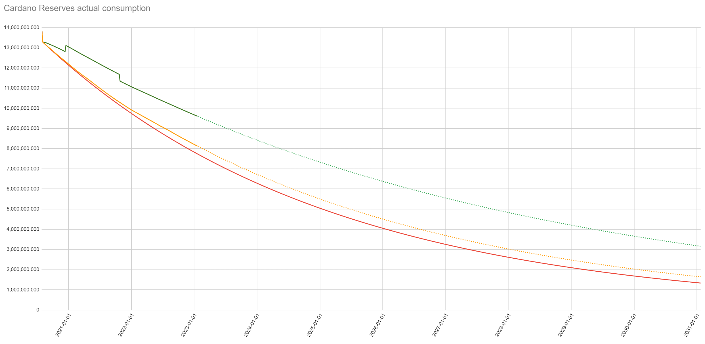
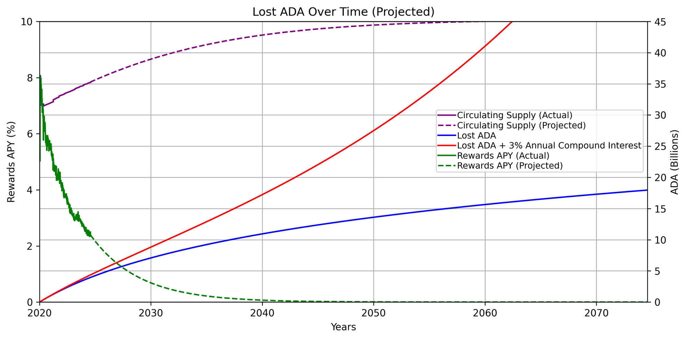
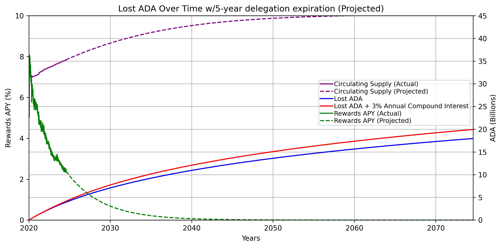

## Abstract

Cardano’s staking and on‑chain voting have drifted toward passivity. As described in CPS-0022, long‑lived “set‑and‑forget” delegations let rewards and governance weight ossify, particularly in wallets that have been permanently lost, diluting staking rewards and voting power engaged participants and harming network security. This CIP reframes delegation as an **active, periodically affirmed contribution to network security** and realigns incentives so rewards flow to those presently and capable of participating. At a high level, it introduces (i) **time‑bound, renewable delegations** for stake pools and dReps, and (ii) **full‑pot reward distribution** to currently eligible delegators and pools each epoch. 

If the network’s total staking ratio remains roughly unchanged, these changes are expected to increase rewards for all delegators and stake pool operators by approximately 1–3% annually. Together, these changes encourage ongoing engagement, reduce sticky/lost‑stake externalities, and keep realized emissions consistent with monetary policy while respecting user property rights.

## Motivation: why is this CIP necessary?

Many users interpret staking rewards as akin to bank interest. If that were the intent, the ledger would not need operator selection, delegation, or performance‑based rewards. Yield could simply accrue automatically. In Cardano, **staking is voluntary and active**. It is how the protocol decides who gets to make blocks, and rewards compensate the combination of (a) **committing stake** to secure the network and (b) **selecting and monitoring** a competent, honest operator.

- Delegation is a liquid vote for a pool operator. Delegators are expected to reevaluate and move if performance, fees, or behavior change.
- Lost or inactive stake no longer contributes to present‑day security yet can lock in block‑production influence and siphon rewards from active participants.

This CIP addresses the broader drift toward **passive and indifferent delegations.** Securing the network is an **active act**, periodically affirmed by the holder, and rewarded accordingly. Expirations introduce a light‑touch proof‑of‑life for delegation and dRep voting power. Furthermore, full‑pot distribution provides a stabilizing incentive: if total stake falls low enough to threaten security, yields rise automatically for active delegators and SPOs, encouraging new delegation rather than letting rewards drip back to reserves.

## Specification

#### Current behavior (for context)

- **Indefinite delegations.** Delegation certificates today have no expiry. Once a stake credential delegates to a stake pool or a dRep, that delegation remains valid indefinitely until the holder submits a new delegation (or deregisters the stake key).
- **Rewards return-to-reserves.** After monetary expansion and fees are combined and the treasury cut is taken, the distributable rewards pot is scaled by the network’s active‑stake ratio; only that fraction is paid out, and the remainder is returned to reserves. This occurs because rewards are computed using only the active stake snapshot and any residual R not assigned to reward accounts (∆r₂ = R − Σrs) is returned to reserves, per the epoch‑boundary and reward‑update rules (SL‑D5 §11.1, §11.5, §11.8–§11.10).

This CIP intentionally limits itself to two changes to the ledger rules. All other reward mechanics (e.g., pledge influence, saturation, treasury cut) are unchanged:

### 1) Delegation certificate expiration

- Add **two protocol parameters** (measured in epochs), to be set via governance:
  - stakePoolDelegationLifetime
  - drepDelegationLifetime
- A delegation (to a stake pool or dRep) becomes **invalid at the start of the epoch** when its lifetime elapses.
- **Renewal** is performed by submitting a standard delegation transaction at any time; wallets may prompt or bundle renewals but such UX is out of scope for this CIP.
- **Independence:** stake‑pool and dRep delegations expire and renew independently; expiry of one does not imply any fallback for the other.
- **Migration:** upon CIP activation, all existing delegations are backdated to their original activation epochs; any older than the chosen lifetime expire immediately. No funds are seized, but rewards will stop accruing and voting power will no longer count.
- **Exception: always_auto_abstain.** Delegations to this pre‑defined protocol dRep do not expire. This is because voting power that is delegated here is excluded from governance quorum, so lost delegations cannot ossify decision power. Moreover, many users who use Cardano for other things (DeFi, NFTs, etc.) might select this option only to withdraw staking rewards. Exempting it avoids unnecessary UX hurdles.

### 2) Full‑pot reward distribution

- In each epoch, distribute the **full rewards pot** (monetary expansion + fees, less the treasury cut, blocks not produced [Eta], and unmet pledge) to eligible delegators and pools without returning any remainder to reserves **(i.e., eliminate the residual ∆r₂ described in SL‑D5 §11.10 and distribute that proportion as well)**.
- “Eligibility” remains exactly as today, except that stake tied to an **expired** delegation does **not** earn rewards (and expired dRep delegations contribute **no** voting power).

**Note:** Initial numeric values for the two lifetime parameters are intentionally **left undefined** here and will be chosen through community governance and deliberation. Potential jittering or lottery mechanisms to stagger per-epoch expiries are not mentioned in this proposal, but may be considered separately if operational data warrants it.

## Rationale: how does this CIP achieve its goals?

- **Active security & correct economics.** Periodic renewal makes delegation an affirmative act of securing the network. Engaged holders are compensated for informed operator selection, not mere passage of time.
- **Mitigate sticky stake.** Long‑dormant delegations can prop up legacy control of block production. Expirations reduce that inertia by requiring a simple, periodic affirmation from real, reachable owners.
- **Curbing ossification & compounding.** Expirations prevent unreachable wallets from indefinitely accumulating rewards or voting power without threatening their principal investment.
- **Dynamic & responsive yields.** Full‑pot distribution increases pool/delegator yield when participation drops and compresses it when participation rises, creating a simple and transparent balancing mechanism.
- **Alignment with policy.** Realized emissions track the monetary expansion set by Rho more closely (rather than being artificially reduced by the active‑stake ratio).
- **Respect for property.** No seizure or clawback occurs. Expired delegations simply stop earning and can be renewed at any time.
- **Governance clarity.** With no fallback for expired dRep delegations, governance power reflects currently affirmed participation (CIP‑1694’s “inactive dRep” guardrails remain complementary but insufficient on their own).
- **Sharper SPO accountability.** Periodic renewal nudges delegators to review operator fees, performance, and conduct. If a pool underperforms or raises costs, stake can organically reallocate on renewal.
- **Fairer path for new pools.** Expirations free stake that would otherwise remain inert with incumbents, reducing entrenched advantages from lost delegations and lowering barriers for competent new operators to attract delegation.

### Option to adjust Rho

Distributing the full-rewards pot will stop sending residual rewards back to reserves. If Rho is left unchanged, reserves will deplete faster by roughly that amount and true emissions will track much closer to the monetary expansion set by Rho. As a result, this will cause active participants to see roughly ~1–3% higher annual yields. 

If the community prefers to preserve the current rate of emissions, the community can instead reduce Rho to offset this through a parameter change governance action. However, this will trade away the increase in rewards. This CIP intentionally leaves this choice out of scope.

### Prior rationale and revised censorship assessment

The Shelley-era design explicitly worried about an incentive for large pools to **censor delegation certificates** if rewards were distributed in ways that made existing actors worse off when new delegations appeared. To mitigate this, the specification chose (a) to normalize reward shares by **total stake** rather than active stake so that new delegations do not dilute incumbents’ proportional rewards. Also, (b) to send **undistributed** rewards back to reserves. See *Shelley Delegation & Incentives Design Spec.*, SL‑D1 v1.21 (2020‑07‑23), §5.5.1 “Relative Stake: Active vs Total” (p. 35), and change log rev. 17 (“undistributed rewards go to the reserves”). The spec also anticipated concerns about pools rejecting or disadvantaging delegation transactions (Appendix D.2, p. 52).

**Why this is acceptable to revisit now.** Today’s network conditions and incentives make sustained censorship of delegation renewals economically implausible and strategically dominated by other attack vectors:

- **Healthy stake distribution & coordination threshold.** With broad dispersion of block‑producing power, a would‑be censor would need to withhold a large number of small delegation transactions across many blocks and coordinate with many other producers to move rewards meaningfully. Any unilateral attempt simply fails whenever other producers include those transactions.
- **Externality of “success.”** Under full‑pot distribution, even a successful bout of censorship raises everyone else’s yields, not just the censor’s. This dilutes the payoff while increasing incentives for others to defect and include the transactions.
- **Richer targets exist.** In a DeFi‑enabled ecosystem, **selective censorship of high‑value transactions (e.g., liquidations/arbitrages) offers a concentrated, private payoff from censoring few targeted transactions, whereas delegation censorship requires suppressing many of them for marginal gains.
- **Operational risk and visibility.** Prolonged, coordinated censorship would be conspicuous, invite social and governance backlash, and likely degrade a censor’s reputation and delegation flow, offsetting any transient gain.

These factors, together with periodic expiration/renewal that naturally spreads delegation updates over time, support removing the “return to reserves” scaling while keeping incentives aligned with **active participation**.

### Security consideration: participation shocks after large expirations

Introducing expirations could, in the short term, allow portions of stake to lapse if large wallets forget or delay renewal. This temporarily reduces the **active‑stake ratio**, widening the gap between total and active stake. In such windows, the cost for an adversary to assemble a large share of active stake is lower than usual, and block production can concentrate among a smaller set of pools until new delegations occur.

**Balancing mechanism in this CIP.** The proposal deliberately pairs expirations with full‑pot reward distribution. Because the entire pot is distributed over the then‑active stake, the per‑unit yield rises automatically when participation drops and compresses when it rises. This creates a fast, transparent negative‑feedback loop:

- If active stake decreases, epoch yield increases for active delegators/SPOs. Capital is attracted back until the security margin normalizes.
- Likewise if active stake increases, epoch yield decreases. Though without changes to Rho the net result of this CIP will still increase rewards all the way up to 100% of active-stake ratio.

This dynamic couples network security to real participation and reduces the risk of active-stake dropping too low.

### Evidence and modeling

- **Reserves trajectory** will be closer to true Rho after this CIP is implemented
  - Red = ADA in reserves if we followed Rho exactly
  - Yellow = ADA in reserves account for actual blocks produced (Eta) and missing pledge. This is the track the reserves is expected to follow after the inclusion of this CIP.
  - Green = Actual amount of ADA in reserves

  

*Source: [https://x.com/C1cADA_Markus/status/1636023370532749314](https://x.com/C1cADA_Markus/status/1636023370532749314)*

- Estimated **+1–3% APY uplift** from full‑pot distribution:

Given:

We can calculate the expected ROI for an average pool with 35M stake and 1M pledge before this CIP as follows:

**Constants:**

- \( S = 35698219658 \) (circulating supply)
- \( \text{Reserves} = 6955875027 \)
- \( k = 500 \Rightarrow z_0 = 0.002 \)
- \( a_0 = 0.3 \)
- \( \text{Rho} = 0.003 \)
- \( \tau = 0.2 \)

**Epoch rewards pot after treasury (not accounting for fees or missed blocks):**

\[
R = (\text{Rho} \cdot \text{Reserves}) \cdot (1 - \tau) = (0.003 \cdot 6955875027) \cdot 0.8 = 16694100.0648
\]

**Pool (average pool with 35M stake and 1M pledge):**

- \( x = 35,000,000 \) (stake)
- \( y = 1,000,000 \) (pledge)

\[
z = \frac{35,000,000}{35,698,219,658} = 0.0009804140510981708
\]
\[
s = \frac{1,000,000}{35,698,219,658} = 0.000028011264155988
\]
\[
z' = \min(z, z_0)
\]
\[
s' = \min(s, z_0)
\]

**Base reward (from Shelley formula):**

\[
B = \frac{R}{1 + a_0} \cdot \left[z' + s' \cdot a_0 \cdot \frac{z_0 - z'}{z_0}\right] = 0.0000845007526134465 \cdot R
\]

**Standard distribution (spec):** distributes \( R \) to active pools and returns the rest to reserves

\[
f_{\text{std}} = R \cdot 0.0000845007526134465 = 1,414,612.80
\]

\[
\text{ROI}_{\text{pool, std}} = \frac{f_{\text{std}}}{x + y} = \frac{1,414,612.80}{36,000,000} = 0.03929
\]

\[
\text{Annual ROI} = (1 + \text{ROI}_{\text{pool, std}})^{73} - 1 \approx 0.0267 \text{ or } 2.67\%
\]

This gives us the result of about **2.67% Annual ROI** for that pool.

Now to re-calculate what it would be for this same pool if we instead distributed the full rewards pot to all eligible pools and their delegators:

**Full pot rewards distribution: distribute all of \( R \) with no residual**

Let \( W = \sum_i B_i \) over all eligible pools (whole circulation). Typically \( W \approx 1 \);

then normalize: \( f_{\text{full}} = R \cdot \frac{B}{W} \).

Using \( W \approx 1 \) (tight when total pledge term is small):

\[
f_{\text{full}} \approx R \cdot B = 16694100.0648 \times 0.000984507526134465 = 16435.354078,
\]
\[
\text{ROI}_{\text{epoch, full}} = \frac{f_{\text{full}}}{x + y} = \frac{16435.354078}{35000000} = 0.0004695815415 \approx 1.40\%
\]
\[
\text{ROI}_{\text{annual, full}} = (1 + \text{ROI}_{\text{epoch, full}})^{73} - 1 = 0.03486543814
\]

The result is about **3.49% Annual ROI**. Roughly a 1% increase.

**Note:** These calculations do not take into account any collected transaction fees, pool performance, or pool fees.

These effects are also modeled in the open source tool available at [https://spo-incentives.vercel.app/](https://spo-incentives.vercel.app/). Setting the rewards formula radio button to “Current” represents the current rewards calculation behavior. Setting it to “Full” represents the rewards calculation after applying this CIP. It is also recommended to experiment with the “Staked Ratio” slider under both of those settings to see how it will affect rewards.

- **Runaway lost‑stake mitigation efficacy**

  - Before:

    

  - After:

    

**Note:** The baseline numbers in the previous two charts were rough estimates taken from CPS-0022. These estimates may be off by a wide margin, but the effects in preventing the compounding of lost ADA beyond their expiration date will apply generally regardless.

## Path to Active

### Acceptance Criteria

- **CIP Editor Approval** – Cardano CIP Editors must confirm that the specification is complete, unambiguous, and internally consistent with existing CIPs.
- **Consensus on initial parameter values** – An initial values of for the new protocol parameters stakePoolDelegationLifetime and drepPoolDelegationLifetime must be agreed upon before hard-fork combinator (HFC) activation. The choice should consider operational viability, empirical analyses (e.g., RSS results), and community feedback.
- **Endorsement by Technical Bodies** – The Cardano Parameter-Change Proposals (PCP) Committee and the Intersect Technical Steering Committee (TSC) should both recommend the proposal as technically sound and aligned with the protocol’s long-term roadmap.
- **Stakeholder Concurrence** – A majority of stake pool operators (SPOs), ecosystem tooling maintainers, dReps, and other infrastructure providers must signal readiness to upgrade.
- **Governance Ratification** – The on-chain Hard-Fork Governance Action must pass the requisite dRep and Constitutional Committee thresholds, establishing legal-constitutional legitimacy and stakeholder support for the change.

### Implementation Plan

- **Community Deliberation (Preparation Phase)**
  - Publish the finalized CIP revision and present it to the PCP committee, TSC, CIP Editors, and wider community channels (Discord, X, Cardano Forum, etc.).
  - Collect structured feedback, particularly on candidate values for the new parameter values and iterate until broad technical consensus emerges.
- **Specification & Code Integration (Development Phase)**
  - **Once initial parameter values are determined, integrate the new rewards calculation logic, delegation certificate expiry, and governance features for the new parameters into cardano-node and related libraries (ledger, CLI, wallet APIs).**
  - **Submit pull requests to the canonical repositories; obtain code reviews from IOG, CF, and community contributors.**
  - **Release a new protocol version that includes the changes made in this CIP.**
  - **Use a dedicated pre-production testnet that mirrors main-net parameters but enforces the new changes, allowing SPOs and exchanges to test end-to-end flows.**
- **Readiness Sign-off (Testing Phase)**
  - **Require at least two weeks of uninterrupted testnet stability plus green results from regression and property-based tests.**
  - **Monitor ecosystem dApps and tooling to confirm that major node implementations, explorers, wallets, and exchange integrations support the new rule set.**
- **On-chain Governance (Ratification Phase)**
  - **File the Hard-Fork Governance Action on-chain with the agreed initial parameter values tagged for the next hard fork event.**
  - **Modify the existing Cardano Constitution to include definitions and guardrails for the new protocol parameters and have it ratified by the tripartite government of Cardano.**
  - **Mobilize dRep outreach to ensure quorum and super-majority passage; concurrently, the Constitutional Committee validates procedural compliance.**
- **Hard-Fork Activation (Deployment Phase)**
  - **Upon successful vote, the hard fork event is automatically triggered upon epoch turnover.**
  - **Monitor main-net metrics during the changeover epoch; provide real-time support for any late-upgrading SPOs.**

## References

- Kant, P.; Brünjes, L.; Coutts, D. *Design Specification for Delegation and Incentives in Cardano — Shelley* (SL‑D1 v1.21, 23 Jul 2020). Especially §5.5.1 “Relative Stake: Active vs Total” (p. 35); Appendix D.2 “Won’t stake pools reject delegation certificates that delegate away from them?” (p. 52); and change log rev. 17 (“Undistributed rewards go to the reserves, not to the treasury.”).
- Corduan, J.; Vinogradova, P.; Güdemann, M. *A Formal Specification of the Cardano Ledger* (Shelley Ledger: SL‑D5 v1.0, updated 23 Mar 2023). Section 11: Rewards and the Epoch Boundary — overview (§11.1), snapshots (§11.5), epoch transition (§11.8), rewards distribution (§11.9), and reward update/return‑to‑reserves residual (∆r₂) (§11.10).
- Wiley, R. *CPS-0022: Sticky Stake and Time-Bound Delegation* (2025). Available at: https://github.com/Cerkoryn/CIPs/blob/sticky-stake/CPS-0022/README.md.

## Acknowledgements

This CPS could not have been created without the support, assistance, and input of all participants in the community-led SPO Incentives Working Group.

- Stef M [RABIT]
- Rich Manderino [ECP] 
- Wayne Cataldo [OTG]
- Homer [AAA]
- Chad [BBHMM]
- Mark H [UPSTR]
- Carlos Lopez de Lara [Input|Output]
- Pedro Lucas
- Seomon
- OYSTR Pool

## Copyright
This CIP is licensed under CC‑BY‑4.0.