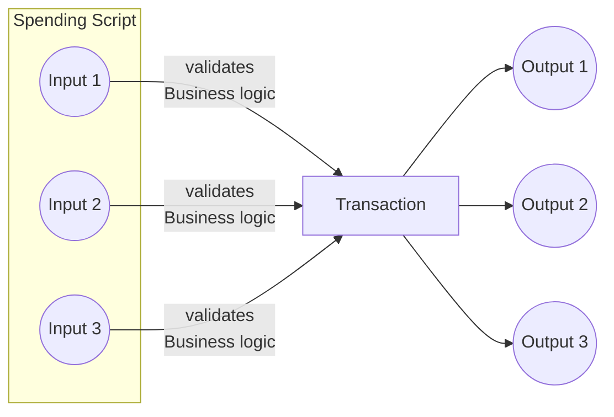
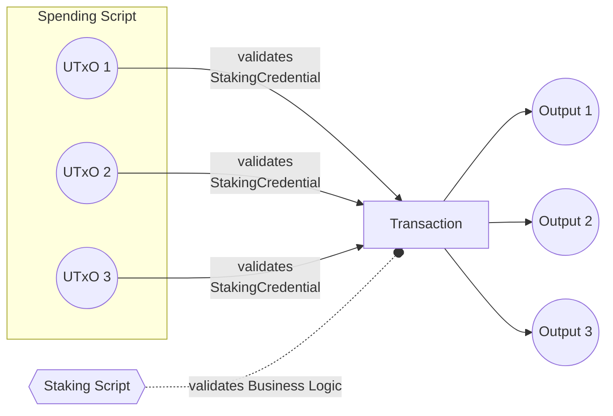

## Abstract
We propose the introduction of a new structure for transaction inputs aimed at significantly enhancing the execution efficiency of Plutus contracts. 

This CIP facilitates explicit ordering of transaction inputs, diverging from the current state. This explicit ordering enables seamless arrangement of input scripts intended for utilization within the application's business logic. 

Consequently, this implementation alleviates the necessity to set an index list through the redeemer to gather the required inputs from the transaction. Additionally, it mitigates the computational overhead associated with ensuring the uniqueness of the index list.

## Motivation: why is this CIP necessary?
According to the Alonzo CDDL [Transaction body](https://github.com/IntersectMBO/cardano-ledger/blob/c158b4298d34cdef3340e600739422ca72a713cd/eras/alonzo/impl/cddl-files/alonzo.cddl#L55), the inputs of a transaction body are represented as a set, leading to the inputs being ordered lexicographically by the ledger.

The primary issue with strictly ordering inputs lexicographically is that many projects must resort to passing index numbers through the redeemer to select the correct input from the transaction inputs. This practice introduces inefficiencies and potential vulnerabilities to vector attacks if the passing of indexes through the redeemer is incorrectly implemented.

Currently, most projects are transitioning away from housing all business logic within the spending validator, as it is executed for every unspent transaction output (UTxO). This can be illustrated as follows:


Consequently, projects are now relying on implementing minting policies or staking validators to validate their business logic. This dramatically reduces the script execution of the spending validator and increases the throughput of their applications.


However, in this approach, the minting or staking validator requires a list of indices to be passed from the redeemer to select the correct inputs within the transaction input list. One vulnerability of this implementation is that the list of indices must be unique to prevent double validation, which could allow someone to unlock inputs without proper validation.

To mitigate such attacks, one approach is to compute the uniqueness of this index list, but this can result in costly computations if the business logic requires validation of a large number of inputs. A simpler approach to mitigate these hacks is to offer flexibility by explicitly allowing the order of inputs to be determined by a transaction builder instead of the ledger. This eliminates the need to pass indexes through the redeemer.

## Specification
As per protocol specifications, the transaction body is structured as follows:
```
transaction_body =
 { 0 : set<transaction_input>    ; inputs
 , 1 : [* transaction_output]
 , 2 : coin                      ; fee
 , ? 3 : uint                    ; time to live
 , ? 4 : [* certificate]
 , ? 5 : withdrawals
 , ? 6 : update
 , ? 7 : auxiliary_data_hash
 , ? 8 : uint                    ; validity interval start
 , ? 9 : mint
 , ? 11 : script_data_hash       ; New
 , ? 13 : set<transaction_input> ; Collateral ; new
 , ? 14 : required_signers       ; New
 , ? 15 : network_id             ; New
 }
```

Specifically, the inputs are currently represented as a set:
```
0 : set<transaction_input>    ; inputs
```

The proposed solution suggests modifying the inputs to a list format:
```
0 : [* transaction_input]    ; inputs
```


## Rationale: how does this CIP achieve its goals?
The motivation behind this CIP stems from the observed limitations and inefficiencies associated with the current lexicographical ordering of transaction inputs. Currently, the strict lexicographical ordering necessitates the passing of index numbers through the redeemer to select the appropriate input, leading to potential inefficiencies and vulnerabilities to vector attacks.

To mitigate these issues, the proposed solution suggests transitioning from a set-based representation of transaction inputs to a list-based representation.

This CIP tries to revive the original draft [CIP-0051](https://github.com/cardano-foundation/CIPs/pull/231)

### Alternatives
#### 1. Retain the existing set-based representation with additional validation mechanisms: 

This approach involves maintaining the current set-based representation of transaction inputs while implementing additional validation mechanisms to guarantee the uniqueness of index lists.
However, it was determined that such approaches could introduce complexity and computational overhead

#### 2. Hash the spending outref and use it for datum tagging: 
  
This alternative suggests hashing the spending outref of the script input and employing it for datum tagging to enforce the uniqueness of outputs. However, this method introduces extra overhead to the datum structure.

## Path to Active

### Acceptance Criteria
[] Fully implemented in Cardano.

### Implementation Plan
[] Passes all requirements of both Plutus and Ledger teams as agreed to improve Plutus script efficiency and usability.


## Copyright

This CIP is licensed under [CC-BY-4.0](https://creativecommons.org/licenses/by/4.0/legalcode).
