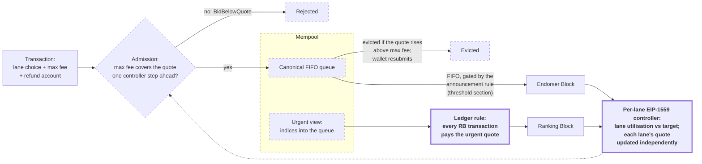
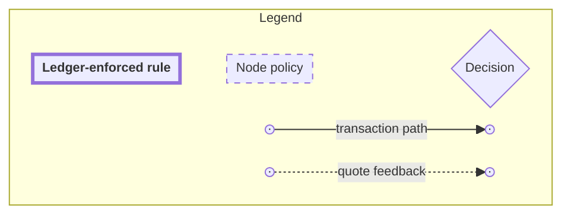
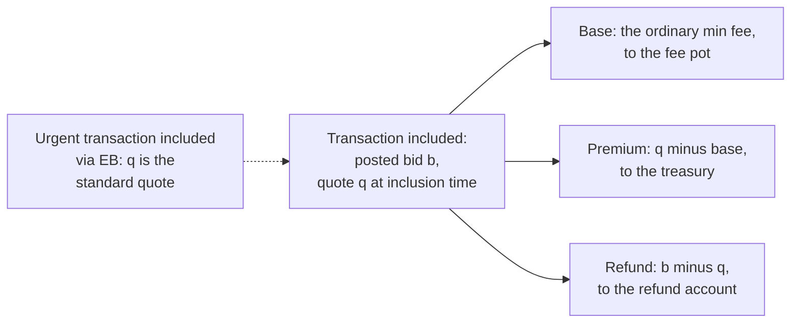
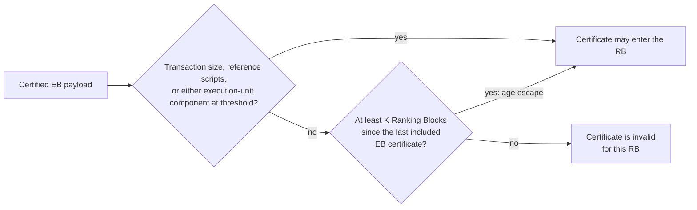
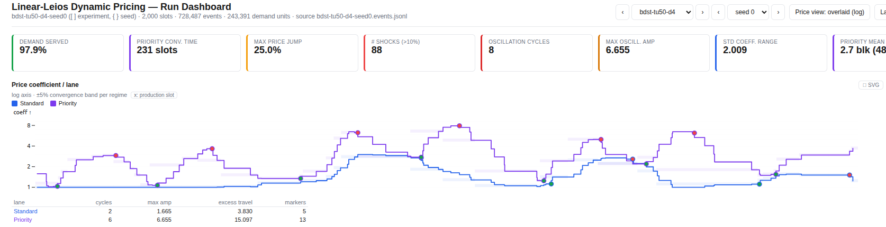
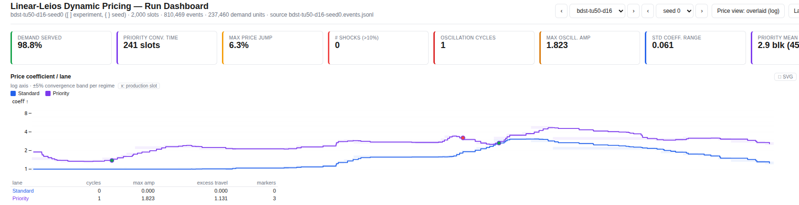
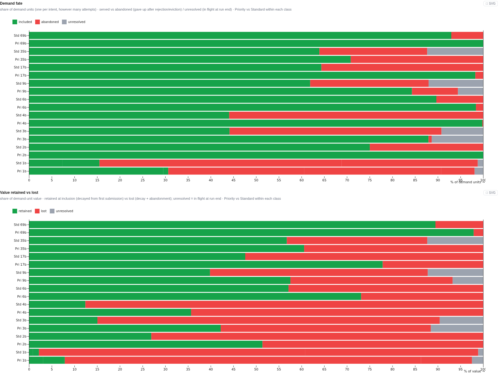
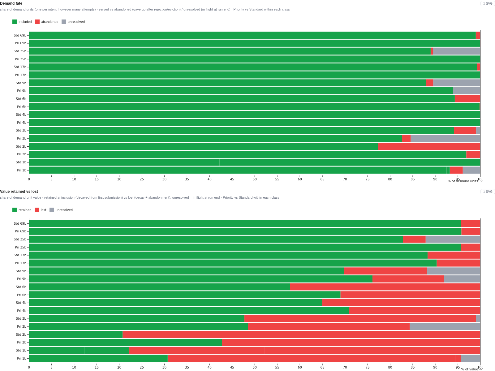

<details>
<summary><strong>Table of contents</strong></summary>

- [1. Abstract](#abstract)
- [2. Motivation: Why is this CIP necessary?](#motivation-why-is-this-cip-necessary)
- [3. Specification](#specification)
  - [3.1 The recommended construction](#the-recommended-construction)
  - [3.2 Controller updates and signals](#controller-updates-and-signals)
    - [3.2.1 Shared update rule](#shared-update-rule)
    - [3.2.2 When block activity enters the signals](#when-block-activity-enters-the-signals)
    - [3.2.3 Urgent controller: 5-sample reservation-utilisation window](#urgent-controller-5-sample-reservation-utilisation-window)
    - [3.2.4 Standard controller: 10-block capacity-weighted window](#standard-controller-10-block-capacity-weighted-window)
  - [3.3 Mempool](#mempool)
    - [3.3.1 Leios Mempool Specifications](#leios-mempool-specifications)
    - [3.3.2 Urgency Signaling Mempool Specifications](#urgency-signaling-mempool-specifications)
    - [3.3.3 Safe Reordering of Urgent Transactions](#safe-reordering-of-urgent-transactions)
      - [3.3.3.1 Alternative: a lazy inclusion buffer for non-commuting transactions](#alternative-a-lazy-inclusion-buffer-for-non-commuting-transactions)
    - [3.3.4 Queue structure](#queue-structure)
    - [3.3.5 Revalidation and stale fees](#revalidation-and-stale-fees)
    - [3.3.6 Dependencies and conflicts](#dependencies-and-conflicts)
    - [3.3.7 Capacity, eviction, and DoS](#capacity-eviction-and-dos)
  - [3.4 Ledger](#ledger)
    - [3.4.1 Transaction representation](#transaction-representation)
    - [3.4.2 Ledger Rule Changes](#ledger-rule-changes)
    - [3.4.3 Block validity](#block-validity)
    - [3.4.4 Additional post-transaction-application validation](#additional-post-transaction-application-validation)
      - [3.4.4.1 Computing the windowed utilisation](#computing-the-windowed-utilisation)
    - [3.4.5 New PParams](#new-pparams)
    - [3.4.6 Plutus](#plutus)
  - [3.5 Block production and node policy](#block-production-and-node-policy)
  - [3.6 Endorser Block announcement threshold](#endorser-block-announcement-threshold)
    - [3.6.1 Validation evidence](#validation-evidence)
      - [3.6.1.1 Experiment 1: low-load threshold](#experiment-1-low-load-threshold)
      - [3.6.1.2 Experiment 2: announcement age escape](#experiment-2-announcement-age-escape)
      - [3.6.1.3 Experiment 3: parameter stress](#experiment-3-parameter-stress)
      - [3.6.1.4 Experiment 4: default-point byte-threshold sensitivity](#experiment-4-default-point-byte-threshold-sensitivity)
  - [3.7 Incentives](#incentives)
- [4. Rationale: How does this CIP achieve its goals?](#rationale-how-does-this-cip-achieve-its-goals)
  - [4.1 How this CIP addresses CPS-0031](#how-this-cip-addresses-cps-0031)
    - [4.1.1 Goal 1: reduce value destroyed by avoidable delay](#goal-1-reduce-value-destroyed-by-avoidable-delay)
    - [4.1.2 Goal 2: permissionless access](#goal-2-permissionless-access)
    - [4.1.3 Goal 3: predictability over raw speed](#goal-3-predictability-over-raw-speed)
    - [4.1.4 Constraints](#constraints)
    - [4.1.5 Open questions](#open-questions)
  - [4.2 Experimental evidence](#experimental-evidence)
    - [4.2.1 D16/K10 headline rerun](#d16k10-headline-rerun)
    - [4.2.2 Thousand-seed replication at low and severe-congestion load](#thousand-seed-replication-at-low-and-severe-congestion-load)
    - [4.2.3 Independent standard-lane target screen and confirmation](#independent-standard-lane-target-screen-and-confirmation)
    - [4.2.4 Window-removal experiment](#window-removal-experiment)
    - [4.2.5 Non-certificate window contribution](#non-certificate-window-contribution)
    - [4.2.6 Announcement semantics and the standard-window length](#announcement-semantics-and-the-standard-window-length)
  - [4.3 Prototype](#prototype)
  - [4.4 Why not full tiered pricing?](#why-not-full-tiered-pricing)
  - [4.5 Optional extensions](#optional-extensions)
    - [4.5.1 Tipping](#tipping)
- [5. Path to Active](#path-to-active)
  - [5.1 Acceptance Criteria](#acceptance-criteria)
  - [5.2 Implementation Plan](#implementation-plan)
- [6. Versioning](#versioning)
  - [6.1 Relationship to CIP-183: conflict-based fee priority](#relationship-to-cip-183-conflict-based-fee-priority)
  - [6.2 If the linear-Leios mechanism changes](#if-the-linear-leios-mechanism-changes)
- [7. Copyright](#copyright)

</details>

## Abstract

We propose two lanes by which a user can submit a transaction to a node: urgent and standard. Only urgent transactions can enter Ranking Blocks. Both urgent and standard transactions can enter Endorser Blocks. Nodes produce Ranking Blocks more frequently than Endorser Blocks, and a Ranking Block enters the chain immediately. When capacity and queue order permit, an urgent transaction can therefore enter an earlier Ranking Block instead of the later Endorser Block path. This creates an earlier inclusion opportunity, not a guarantee of earlier inclusion.

The ledger enforces the urgency signalling rule: every transaction in a valid Ranking Block must carry a fee that covers the urgent quote for that block. In simulation under severe congestion, the mechanism preserves more urgent-class transaction value than linear-Leios with today's flat fee. Retained value means the modelled gross transaction value that remains at inclusion, before fees. Urgent-class retained value improved across most simulated loads. At light load, the mechanism slightly reduces overall retained value, because transactions on the standard path wait longer while Endorser Blocks fill. The Rationale gives exact figures.

### Common misconceptions: clarified

* The premium above the ordinary minimum fee goes to the treasury, so producers cannot earn it by favouring urgent transactions over EB certificates.
* Under the normal block-production policy, a ready, qualifying EB certificate takes precedence over a direct RB transaction payload, regardless of urgent backlog. Urgent backlog therefore does not defer that certificate under this policy.
* A transaction entering the urgent lane is eligible but not guaranteed to be included in an RB. If it instead enters an EB, it pays the standard quote at inclusion time, with the excess being refunded (assuming the transaction specifies a registered refund account).
* Each lane’s quote is a posted price calculated by its controller. A larger fee cap provides headroom against quote increases; under the reference FIFO policy, it does not buy an earlier queue position.
* The standard lane has its own controller; it is not derived from the urgent quote.
* A standard transaction is _never_ eligible to enter an RB, even if a produced RB would be otherwise empty.
* Both lanes are dynamically priced. This doesn't mean, however, that either lane will be priced higher than min fee all the time. Only once windowed utilisation exceeds the target (by default in our specification, 50% for the urgent lane and 75% for the standard lane) does the price increase; below the target, conversely, the price decreases again.

### A note on linear-Leios, as specified in CIP-0164

Not all transactions go through EBs in unmodified linear-Leios as specified in [CIP-0164](https://github.com/cardano-foundation/CIPs/tree/master/CIP-0164). CIP-0164 specifies the timing formula: `A certificate may only be included if RB' is at least 3×Lhdr+Lvote+Ldiff slots after RB` [in the chain inclusion section](https://github.com/cardano-foundation/CIPs/tree/master/CIP-0164#step-5-chain-inclusion). In the [feasible protocol parameters](https://github.com/cardano-foundation/CIPs/tree/master/CIP-0164#feasible-protocol-parameters) section, the CIP specifies an EB cooldown of 14 slots (meaning the next 13 slots after the announcing RB are too early to include that EB's certificate): `Total certificate inclusion delay:3×Lhdr+Lvote+Ldiff=3+4+7=14slots`.

With an RB production probability of 0.05 per slot, the probability of an EB surviving the cooldown is the probability that no RB is produced in the 13 slots following the RB that announced it:

0.95^13 = ~51.33%

That means there's a ~51.33% chance of an EB surviving the cooldown period, meaning, statistically, ~48.67% of blocks can be expected to be transaction-carrying RBs.

## Motivation: Why is this CIP necessary?

Some transactions lose value when delayed, but users currently have no protocol-level way to signal that urgency.

Linear-Leios introduces a new block type: the Endorser Block. Vanilla linear-Leios uses this additional path only when traffic exceeds Ranking Block capacity. This proposal instead routes standard transactions through Endorser Blocks at every load. Endorser Blocks are slightly slower than Ranking Blocks, so latency variability increases. An urgency signal offsets this cost: it lets nodes allocate block space to serve users' intents.

From CPS-0031:

> During periods of congestion, high-urgency transactions lose value when they cannot obtain timely inclusion. A protocol-recognised urgency signal could help preserve more transaction value during congestion, especially for transactions whose value is highly delay-sensitive.

> Candidate solutions should be evaluated by how they handle prioritising high-urgency transactions, and by how they affect ordinary and low-urgency users during sustained congestion.

<!-- PORTABILITY: once CPS-0031 (PR #1194) merges, repoint this at the repo-relative ../CPS-0031 -->

See [CPS-0031](https://github.com/cardano-foundation/CIPs/pull/1194) for more information.

We initially planned a mechanism based on full tiered pricing, then set it aside in favour of the two-lane design specified here. The Rationale section [Why not full tiered pricing?](#why-not-full-tiered-pricing) gives the comparison.

## Specification

The mechanism at a glance, with a legend below. Fee settlement and the EB announcement gate are drawn in their own figures in the sections that specify them.





This CIP introduces a transaction-level urgency signal with two lanes: standard and urgent. Both lanes are dynamically priced, each with its own fee quote controlled by its own EIP-1559 controller. Urgent transactions are eligible for inclusion in both Ranking Blocks and Endorser Blocks. Standard transactions are eligible only for Endorser Blocks. The ledger enforces that Ranking Blocks contain only urgent-paying transactions.

We specify that Ranking Blocks can contain only transactions whose on-ledger fee authorisation covers the urgent quote. A block that breaks the rule is invalid, so a producer cannot substitute a transaction admitted below that quote. The premium goes to the treasury, not the producer. An urgent-paying transaction therefore pays a producer no more than any other transaction of the same size. This rule does not by itself prevent off-chain side payments or other producer manipulation. Those remain part of the Incentives analysis. The rule does remove a key bribery incentive: a producer cannot include a standard-paying transaction in an RB at any price.

We also specify a modification that corrects a problem at moderate load, when RB fill sits between the fill target (0.5 by default) and the RB maximum. Under the modification, a certificate for a non-empty EB can enter the chain in only two cases: the EB's payload reaches the threshold described below, or, as an age-gated escape, at least K Ranking Blocks have been produced since an EB certificate last entered the chain. The modification defends against the following case. At this load, a steady flow mixes some standard transactions with urgent transactions. Without the modification, a producer announces an EB at every opportunity, so RBs frequently carry EB certificates. The outcome is self-sabotaging. Standard transactions wait longer, because a non-full RB cannot carry them. Urgent transactions also wait longer, because certificate-carrying RBs exclude them.

<details>
<summary>Show glossary of terms</summary>

**Transactions and reservation**

- **Standard transaction:** A transaction that does not pay to enter the urgent lane. Cardano's current transactions.
- **Urgent transaction:** A transaction that pays to enter the urgent lane. The payment asks nodes to include the transaction before standard transactions, where possible.
- **Reserved:** An urgent-lane mechanism that reserves RB block space for urgent transactions. The ledger enforces the reservation.

**Lanes and routing**

- **Standard lane:** A pathway for transactions that do not pay the urgent fee.
- **Urgent lane:** A pathway for transactions that pay the urgent fee.
- **Lane choice (the user-side decision):** The choice of lane, made by the constructor of a transaction.

**Pricing primitives**

- **Pricing coefficient:** The value that multiplies the ordinary minimum fee to produce the quote. Also called *tier coefficient*.
- **Quote:** The pricing coefficient multiplied by the ordinary minimum fee. In effect, a snapshot of the dynamic fee for a given transaction.
- **Urgent premium:** The difference between the urgent lane quote and the standard lane quote.
- **Absolute coefficient floor:** The minimum allowed lane pricing coefficient, set to `1.0`: no quote can fall below the ordinary Cardano minimum fee.
- **Fixed (pricing):** Basic Cardano fee, as today.
- **Dynamic (pricing):** EIP-1559 style dynamic fee.
- **EIP-1559 (controller):** The feedback mechanism that adjusts a lane's pricing coefficient after each block: up when utilisation is above target, down when below, by a bounded step.
- **Max-change denominator (D):** The scale in the controller update. Before the coefficient floor, the largest downward step is `1/D`. The largest upward step is `(1 - targetUtilisation) / (targetUtilisation × D)`. At target 0.5 these are equal, so the price rises and falls at the same maximum rate. Below 0.5 the price can rise faster than it falls. Above 0.5 it rises more slowly.
- **Signal window:** The number of recent blocks over which the controller measures utilisation, so a single unusual block cannot swing the price.
- **Target utilisation:** The block fill level the controller steers towards (0.5 for the urgent controller and 0.75 for the standard controller in the default configuration). Utilisation above the target raises the price. Utilisation below it lowers the price.
- **Quote movement:** The difference between the quote at submission time and the quote at inclusion time.

**User-side fee fields**

- **Posted fee vs actual fee:** The posted fee is the amount attached to the transaction at submission. The actual fee is the quote at inclusion time. The ledger refunds the difference.
- **Refund:** The return of the excess fee to a specified address.
- **Max fee (the fee ceiling on the user side):** The most a user agrees to pay, posted with the transaction. In the transaction representation this is the ordinary `txfee` field; the excess over the actual fee is credited to the transaction's `feeChangeAccount`. It buffers against quote movement. If the quote exceeds it, the transaction cannot be included.

**Value / actors**

- **Urgency:** The rate at which the value of a transaction decays.
- **Urgent demand class:** The fastest-decaying demand class in the model. It is independent of the lane a transaction selects.
- **Retained value metric:** The numerator is the sum of modelled delay-discounted gross transaction value remaining at inclusion, before fees. It is not the simulator's fee-subtracted utility measure, and it is not an observed economic quantity. Unless a table states a different denominator, a retained-value ratio is `retained / (retained + lost)`. The ratio excludes value still unresolved at the simulation horizon.
</details>

<br>

### The recommended construction

The settled recommendation in one place. Each component is specified in detail in the sections that follow, except the controller update rule and signals, which are defined immediately below the table.

| Component | Specification |
|---|---|
| Lanes | Two: standard and urgent |
| Ranking Blocks | Urgent-only at all loads (ledger-enforced). FIFO selection over the urgent view |
| Endorser Blocks | Open to both lanes. FIFO selection over the canonical queue |
| EB announcement threshold | Let `thresholdFraction = max(1 - urgentTargetUtilisation, 1/2)`. Unless the age escape applies, a non-empty certified EB qualifies when any one of its serialised transaction size, its reference-script size, or either component of its execution-unit budget reaches that fraction of the corresponding RB limit. The default fraction is 1/2 (45,056 B for the simulated transaction-size component) |
| EB announcement age escape | A certificate for a non-empty EB below the threshold can enter an RB once at least K = 10 Ranking Blocks have been produced since the last certified EB |
| Fee semantics | Per-lane EIP-1559: each lane's quote is its pricing coefficient × the ordinary min fee |
| Fee-cap basis | For an urgent transaction under rb-only settlement, wallet choice and every max-fee validity check use max(standard quote, urgent quote). Temporary quote crossings are permitted and do not alter either controller |
| Premium scope | rb-only: the applicable inclusion quote is the urgent quote in an RB and the standard quote in an EB |
| Admission, revalidation, and selection (node policy) | Admission requires the posted max fee to cover the maximum applicable lane quote after one worst-case lane-specific controller step. While the transaction is queued, the max fee must cover the current fee-cap quote, or the node evicts the transaction. Prudent EB selection takes a transaction only if the max fee also covers one further lane-specific step (RB selection needs only the current quote, since inclusion is immediate) |
| Settlement and refund | Inclusion charges the applicable inclusion quote. The ordinary min-fee component goes to the fee pot, the premium above it goes to the treasury, and the posted excess goes back to the refund account. A posted maximum below the applicable quote is invalid |
| Standard controller | Target utilisation 0.75, max-change denominator 16, capacity-weighted utilisation over a window of the 10 most recent processed blocks, initial coefficient 1.0 |
| Urgent controller | Target utilisation 0.5, max-change denominator 16, reservation utilisation over a 5-sample window, initial coefficient 2.0 |
| Floors | Absolute coefficient floor 1.0 (no quote below the ordinary min fee). No cross-lane multiplier floor |
| Enforcement boundary | Ledger rules enforce RB lane eligibility, inclusion-point fee validity, settlement, and the deterministic per-lane quote update. The EB threshold and the age escape are ledger rules checked at certificate inclusion, specified in the Endorser Block announcement threshold section. Wallet choice, the urgent queue view, FIFO construction, admission headroom, revalidation, eviction, and producer headroom are node policy |

The adopted simulator configuration is [`block-window-10-cert-reset.json`](./block-window-10-cert-reset.json), a copy of `abstract-sim-hs/config/variants/standard-window-confirm/block-window-10-cert-reset.json` from the tiered-pricing repository. The historical canonical configuration for the earlier experiments is [`thr-k10.json`](./thr-k10.json). [Announcement semantics and the standard-window length](#announcement-semantics-and-the-standard-window-length) records the differences and the evidence for the adoption. Each file's embedded load is only the simulator's default workload, and experiment manifests override it. Neither file is part of the mechanism recommendation. The simulator implements only the byte component of the multidimensional EB threshold specified above. The max-of-two fee-cap rule is the simulator's rb-only fee semantics rather than a configurable alternative. The simulator's fee-cap headroom retains a `1/D` floor on each lane's stepBound (the historical policy); the comparison recorded in [Revalidation and stale fees](#revalidation-and-stale-fees) found that floor bit-identical to the specified stepBound over the tested seeds and loads.

The parameter values, the grid points tested, and the loads at which each was stressed are tabulated in the "Endorser Block announcement threshold" section.

### Controller updates and signals

The design uses two independent pricing controllers, one for each lane:

- the **urgent controller** sets the urgent-lane pricing coefficient;
- the **standard controller** sets the standard-lane pricing coefficient.

A pricing controller is a feedback mechanism. It observes recent utilisation of its lane and adjusts that lane's pricing coefficient. Utilisation above the target raises the coefficient; utilisation below the target reduces it. The lane's quote is obtained by applying its current coefficient to the ordinary minimum fee.

The two controllers use the same update rule and the same recommended `D` value. They differ in their recommended target utilisation, their initial coefficient and, more importantly, in how they calculate utilisation:

| Controller | Target utilisation | Initial `coeff` | Utilisation signal | Window |
|---|---:|---:|---|---:|
| Urgent | `0.5` | `2.0` | Urgent usage measured against RB reservation capacity | **5 payload samples** |
| Standard | `0.75` | `1.0` | Standard usage measured against the combined capacity of recent blocks | **10 processed-block summaries** |

The urgent window of **5 samples** is an experimentally selected compromise between responsiveness and stability. Windows of `3` and `5` samples were tested, while windows of `10–20` reduced the number of price shocks but generally increased latency and peak-to-trough price movement and reduced urgent retained value.

The standard window of **10 processed-block summaries** was selected by a dedicated length screen. The screen swept 10, 13, 15, and 20 blocks on seeds 0-99. The confirmation on disjoint seeds 700-799 showed the candidate matches or exceeds the historical behaviour at every load. It retained more launch-day value than the historical behaviour in 90 of 100 individual seed pairs ([Announcement semantics and the standard-window length](#announcement-semantics-and-the-standard-window-length)).

An experiment removed each window in turn, on fresh seeds, at the recommended calibration ([Window-removal experiment](#window-removal-experiment)). The result confirms that both windows are necessary, for different reasons. Without the standard window, launch-day throughput and retained value decrease. Without the urgent window, retained value shows no measurable loss, but the quotes move much more at every load.

The recommended `D = 16` was tested for both controllers in lockstep. The standard-lane target of `0.75` was selected and confirmed by a dedicated experiment that swept it independently while the urgent target stayed at `0.5`; see [Independent standard-lane target screen and confirmation](#independent-standard-lane-target-screen-and-confirmation).

#### Shared update rule

Both controllers are evaluated independently once per slot in which a block is produced. Each applies the same update rule to its own utilisation signal:

$$ \mathrm{coeff}' = \max\left( 1.0,\; \mathrm{coeff} \times \max\left( 0,\; 1+ \frac{\mathrm{utilisation}-\mathrm{target}} {\mathrm{target}\times D} \right) \right) $$

Before applying the rule, the controller clamps `utilisation` to `[0, 1]`. The outer `max` prevents the coefficient from falling below `1.0`, so a lane's quote cannot fall below the ordinary minimum fee.

The recommended shared parameters are:

| Parameter | Recommended value | Effect |
|---|---:|---|
| `target` | `0.5` urgent, `0.75` standard | Utilisation above the lane's target raises the coefficient; utilisation below it lowers the coefficient |
| `D` | `16` | Bounds the size of each coefficient update |
| Absolute coefficient floor | `1.0` | Prevents a quote from falling below the ordinary minimum fee |

With `D = 16`, a single update changes a coefficient by no more than `±6.25%`. At the urgent target of `0.5` the largest step is `6.25%` in both directions. At the standard target of `0.75` the largest upward step is `2.08%`, while the largest downward step remains `6.25%`.

This section states the update rule in real-number form for readability. On-chain, a coefficient is stored as the fixed-point `uint` described in [Transaction representation](#transaction-representation) and [Ledger Rule Changes](#ledger-rule-changes). The update is computed by substituting `10^tierDec` for `1.0` and truncating the result after scaling. The coefficient update truncates, but the separate `minfeeAt` conversion from a coefficient to a lovelace amount rounds up (see [Ledger Rule Changes](#ledger-rule-changes)).

#### When block activity enters the signals

A block-production event contributes utilisation information only when transaction payload is applied:

| Block-production event | Transaction payload applied? | Contributes utilisation? |
|---|---|---|
| Non-certificate Ranking Block | Yes — RB payload | Yes |
| Certificate-carrying Ranking Block | No — payload-free | No |
| Endorser Block announcement | No — announcement only | No |
| Certified Endorser Block | Yes — EB payload | Yes |

Each transaction payload therefore enters the controller signals exactly once:

- an RB payload when its non-certificate Ranking Block is produced;
- an EB payload when its Endorser Block is certified.

An EB announcement is not a controller event and gets no window entry. An announcement is a claim in an RB header, and no ledger rule can check that a real, available EB stands behind it. If announcements counted, a producer can move the standard quote with cost-free fake announcements. The window entries are therefore processed blocks only: non-certificate Ranking Blocks, certificate-carrying Ranking Blocks, and certified Endorser Blocks.

Both controllers observe the same payload-application events, but they calculate different utilisation values from them.

#### Urgent controller: 5-sample reservation-utilisation window

The urgent controller measures urgent demand against the scarce capacity available for urgent service. Its window contains the **five most recent payload samples**, not necessarily the five most recent slots or block-production events.

For each sample:

1. Measure urgent-lane usage in bytes and execution units.
2. Compare that usage with the urgent reservation capacity of a Ranking Block.
3. Cap the measured usage at that reservation capacity.
4. Compute utilisation separately for bytes and execution units.
5. Use the larger of the two results.

A certified EB uses the same RB reservation capacity as its denominator, rather than the EB's much larger capacity. The urgent signal therefore asks how many Ranking Blocks' worth of urgent traffic the payload carried; it does not measure how full the Endorser Block was.

Across the five-sample window:

$$ \mathrm{urgentUtilisation} = \max\left( \frac{\sum \mathrm{urgentBytes}}      {\sum \mathrm{RBReservationBytes}}, \; \frac{\sum \mathrm{urgentExUnits}}      {\sum \mathrm{RBReservationExUnits}} \right) $$

Each sample's urgent usage is capped at the corresponding RB reservation capacity before being added to the numerator.

#### Standard controller: 10-block capacity-weighted window

The standard controller measures standard-lane usage against the combined capacity represented by the **ten most recent processed-block summaries** (non-certificate RBs, certificate-carrying RBs, and certified EBs, with no entry for announcements, as specified above).

Across the window:

1. Sum standard-lane usage.
2. Sum the corresponding block capacities.
3. Divide total usage by total capacity.
4. Compute the ratio separately for bytes and execution units.
5. Use the larger ratio.

The resulting signal is:

$$ \mathrm{standardUtilisation} = \max\left( \frac{\sum \mathrm{standardBytes}}      {\sum \mathrm{blockCapacityBytes}}, \; \frac{\sum \mathrm{standardExUnits}}      {\sum \mathrm{blockCapacityExUnits}} \right) $$

The window entries contribute as follows:

- certificate-carrying RBs occupy a window position but contribute neither usage nor capacity;
- non-certificate RBs contribute their full capacity to the denominator, even when empty and even though standard transactions cannot occupy them;
- certified EBs contribute their EB capacity and the standard traffic they carry;
- EB announcements are not entries and do not occupy a position.

This is a capacity-weighted signal: each block affects the result in proportion to its capacity. At the capacities used in the experiments, a certified EB provides `12,000,000` bytes of capacity, compared with `90,112` bytes for a Ranking Block. A certified EB therefore carries approximately 133 times the byte weight of an RB, so the standard quote responds primarily to Endorser Block utilisation.

The size of the non-certificate contribution is a measured choice, not an assumption. A dedicated experiment replaced it with alternatives from zero up to a third of an empty EB, and with a controller that updates only on certified EBs ([Non-certificate window contribution](#non-certificate-window-contribution)). That experiment ran under the historical 20-entry window. Every contribution larger than the Ranking Block's own capacity lost retained value under launch-day load, and so did the certificate-only controller. Contributions smaller than the Ranking Block's capacity changed outcomes by less than half a percent.

The window length and the exclusion of announcement entries are also measured choices. The historical simulator let zero-width announcement entries occupy window positions, which shortened the effective window at contended loads. [Announcement semantics and the standard-window length](#announcement-semantics-and-the-standard-window-length) records why announcement entries cannot be a ledger rule, the length screen that selected 10 blocks, and the confirmation on disjoint seeds.

**The standard signal measures service, not demand.** Every non-certificate Ranking Block adds a full
block's capacity to the denominator while contributing structurally zero standard usage, so a stretch of
chain with few certified Endorser Blocks pins the standard coefficient to its floor — including when
standard transactions are piling up unserved precisely because no Endorser Block is being certified.

This is the price of the determinism argument in [Block validity](#block-validity): a backlog-sensitive
price would need consensus over what nodes are holding, and mempool depth is not on the chain.

The standard lane's relief is therefore temporal rather than economic, via the
[age escape](#endorser-block-announcement-threshold), which bounds *latency* at one certificate per `K`
Ranking Blocks but not queue *depth*.

Under sustained standard demand exceeding what one Endorser Block per `K` blocks can clear, the queue
grows without the price rising to shed it, so sizing `K` is a liveness question and not only a latency
one.


### Mempool

Our urgency signaling design includes changes to the consensus protocol, the Leios protocol specifically. 
For this reason, we [specified](https://github.com/IntersectMBO/ouroboros-consensus/compare/polina/mempool-spec?expand=1) three mempool variants in Agda:
- the **Praos mempool** (`Mempool.lagda.md`);
- the **baseline Leios mempool**;
- the **Leios mempool with urgency signaling**.

In all three specifications, the mempool imposes the same constraints on the block as enforced 
at the time of block validation for inclusion in the chain,
e.g. block size limits, the constraint that an RB has either transactions or an 
EB certificate and never both, etc. 
The Praos specification is based on the current mempool design directly. 

#### Leios Mempool Specifications 

The Leios mempool (`MempoolLeios.lagda.md`) design features two distinct types of blocks (RB and EB), and 
an extra stored ledger state `ebLedger`. This ledger state 
variable is `Nothing` whenever *no EB* has been sent across the network for inclusion in a future RB, and is set to 
the ledger state updated with `heldEB` when that EB arrives across the network. All transactions in the mempool 
are applied to/validated against `ebLedger` (if non-`Nothing`), and the resulting updated ledger state is stored 
in `updatedLedger`.

For *non-epoch boundary blocks*, the ledger state can be updated in O(1) in some cases. Specifically, when an RB 
arrives containing a certificate for the `heldEB` block, the `ebLedger` becomes the new ledger state at the tip
with only some minor additional block-level bookkeeping. For epoch boundary blocks, a full ledger state recomputation 
for the incoming RB/EB must be performed. The function generating blocks from mempool content, `forgeBlock`, 
returns a pair `(RB, Maybe EB)`. The `RB` is sent across the network to be added to nodes' chain tips, whereas 
`EB` is sent across the network to be added to the nodes' mempools' `heldEB` variable. 

#### Urgency Signaling Mempool Specifications

The urgency signaling mempool design, specified in `MempoolLeiosPricing.lagda.md`,
features two distinct ledger states in place of `updatedLedger`: 

- **`urgentUpdatedLedger`**: the result of applying every transaction in `urgentTxs` to:
  - `ebLedger`, when a valid EB has arrived; or
  - `ledger`, otherwise.

  The `urgentTxs` queue contains transactions that specify the urgent tier.
- **`standardUpdatedLedger`**: the result of applying every transaction in `standardTxs` on top of `urgentUpdatedLedger`.

The `standardTxs` queue contains transactions that specify the standard tier, and the
`urgentTxs` queue contains transactions that specify the urgent tier.

The mempool is able to request transactions of a specific tier from its peers. 
It first requests the urgent tier transactions, 
and only when none are available, requests standard transactions. 

**The lane field in the transaction envelope.**
Tier-selective fetch requires a node to know a transaction's tier *before* it downloads the body, so the
`tier_no` component of `tx_tier` is repeated in the transaction envelope used by the diffusion layer,
alongside the identifier a peer offers. 

The envelope copy is **not authenticated**: it is outside the transaction body and therefore outside the
signature. A peer may advertise a standard transaction as urgent and, on a node that acts on the claim
without checking, obtain fetch precedence it did not pay for. The envelope copy is therefore an
optimisation hint only, and the following are required of any implementation:

- a node MUST compare the envelope's `tier_no` against the body's after download, and MUST treat the body
  as authoritative for every subsequent decision — queue placement, fee validation, and block selection;
- a mismatch MUST be attributed to the peer that supplied it, and repeated mismatches from one peer MUST
  reduce that peer's fetch precedence and eventually disconnect it;
- fetch precedence granted on an unverified envelope claim MUST be bounded independently per peer, so that
  mislabelling cannot be amplified into a share of a node's bandwidth larger than the peer would otherwise
  receive.

This is enforced by the mempool when fetching transactions, and not enforced at the time of block application.

#### Safe Reordering of Urgent Transactions 

The mempool designed to support urgency signaling in Leios requires urgent transactions to be placed ahead 
of standard ones, out of FIFO queue order. 
That is, an incoming urgent transaction enters the queue after all `urgentTxs` and in front of `standardTxs`.
The mempool update cost for each urgent transaction is proportional to the number of standard transactions 
that need to be revalidated against the new `urgentUpdatedLedger`.

To address this inefficiency, we have 
[proved](https://github.com/IntersectMBO/formal-ledger-specifications/compare/polina/txcomm?expand=1) 
a theorem stating that two lists containing the same transactions 
produce the same *updated* ledger state 
when applied to the same state and in the same environment.
It has the following (also proved) corollary:

> **Corollary.** Let `urgentTxs` and `standardTxs` be lists of transactions, `tx : Tx`,
> `s : LState`, and `e : LEnv`. Suppose `Cpri(tx :: urgentTxs)` and `Cstd(standardTxs)` hold,
> and that `tx` is conflict-free against every transaction in `standardTxs`.
> Suppose also that, in `e` starting from `s`: applying `urgentTxs` reaches `s₀`; applying
> `standardTxs` from `s₀` reaches `s₁`; `tx` is valid at `s₀`; and `tx` is valid at `s₁`,
> reaching `s₂`.
> Then `urgentTxs ++ (tx :: standardTxs)` is applicable from `s`, and the state it reaches is
> equivalent to `s₂`.


The two `tx` validations in the hypotheses are the mempool's two checks — at the insertion point
(the back of `urgentTxs`) and at the back of the standard queue — and `s₂` is the state the second
one already computed. The conclusion is exactly what lets the node adopt `s₂` and leave the standard
queue alone. Note the conclusion is state *equivalence* rather than syntactic equality, which is all
the mempool needs and all the proof gives.

`Cpri` is the condition on the **incoming urgent transaction**:

1. it validates at its insertion point, the back of the urgent queue;
2. it validates at the back of the standard queue;
3. its footprint conflicts with no transaction in `standardTxs`.

`Cstd` is the condition on the **standard queue**, held as an invariant of that queue rather than
rechecked per urgent admission. For each transaction it checks that:

1. it validates at the insertion point;
1. none of them carries a governance action that never commutes — governance **action proposals** and
   DRep **(de)registration** (`GovDomStable` in the proof).

Condition 2 is a lane restriction rather than a conflict check.

Conflict detection appears in `Cpri` only, and that asymmetry is the point. The incoming urgent
transaction is the one that gets *moved* — ahead of the entire standard queue — so it is the only
transaction required to commute with anything. A standard transaction is appended and validated at
exactly the position it will be applied; nothing reorders it, so it owes commutation to nothing. It
may conflict freely with urgent transactions, which are applied ahead of it in any case. That is
ordinary FIFO ordering, not a reordering that needs licensing.

Note also that `Cpri` places no restriction on an urgent transaction's *shape*: any transaction may be
urgent, including one carrying governance. What constrains it is condition 3, not class membership.
Nothing is required of the urgent transactions already queued ahead of it either.

One consequence is worth noting: a standard transaction's admissibility is node-independent, since
`GovDomStable` is a property of the transaction alone and decidable at submission, whereas an urgent
transaction's depends on what the local standard queue happens to hold. The same urgent transaction
may therefore be admitted by one node and discarded by another, with neither wrong.

These are the conflicts condition 3 checks for, against the transactions in `standardTxs`:

- the urgent transaction **consumes an input that some standard transaction reads without consuming**: a reference
  input, collateral it does not also spend, or (for a phase-2-invalid standard transaction) an unconsumed input;
- overlapping **certificate targets** or **deposit keys**;
- overlapping **withdrawal credentials**, or a withdrawal credential matching the other transaction's certificate target;
- overlapping **governance vote targets** (same action and voter);
- the urgent transaction **deregisters a DRep that some standard transaction votes with, or delegates
  to**. A deregistration triggers a re-filter of recorded votes, dropping those cast by DReps that are
  no longer registered, and it also invalidates any later delegation to that DRep, since delegating
  requires the delegatee to be registered. 

Governance placement follows from that last class, and is worth stating as a table, because the four
kinds of governance content behave differently:

| content | effect on state the other lane reads | urgent | standard |
| --- | --- | --- | --- |
| votes | neither domain changes | yes | yes, gated pairwise on `(action, voter)` |
| proposals | `dom govSt` grows | yes | **no** |
| DRep registration | `dom dreps` grows | yes | **no** |
| DRep deregistration | `dom dreps` shrinks | yes, gated by the class above (votes *and* delegations) | **no** |

Only shrinking `dom dreps` can invalidate anything, which is why deregistration is the one governance
class needing a pairwise key and the others do not: a proposal or a registration only ever makes the
sets the standard queue reads *larger*, so a standard vote's premise cannot break under reordering.

Proposals and DRep certificates are excluded from the standard lane rather than conflict-checked, for
a reason that is not about commuting: a proposal created by a *standard* transaction would have a
`GovActionId` that does not exist until it is applied, so an urgent transaction voting on it has no
key to be checked disjoint against. Confining them to one lane removes the case by construction. That
lane must be the urgent one: when Leios falls back to Praos-mode operation, only the urgent queue
feeds Ranking Blocks and no standard transaction gets in, so placing governance in the standard tier
would censor it for the whole duration of the fallback. Governance-proposing transactions therefore
always pay the urgency price.

  This constraint is mempool node policy, not a ledger validity rule: no rule in
  [Ledger Rule Changes](#ledger-rule-changes) restricts governance-proposing or DRep-(de)registration
  transactions to the urgent tier, and the chain accepts such a transaction at any tier that pays its
  quote. It is not a chain security requirement — the ledger stays safe either way — it is needed only
  so a node's mempool keeps governance transactions reachable during a Praos-mode fallback. A node
  that fails to enforce it degrades only its own mempool's fallback behaviour, and gains no
  consensus-level advantage from doing so.

To address these conflicts and maintain a better than linear (in the size of the `standardTxs` queue) time 
for including incoming urgent transactions, we adopt the following strategy, proved correct in the
commutativity branch linked above. An incoming urgent transaction is validated twice: once at the back of
the standard queue, and once at its insertion point. It is then checked for the conflicts listed above against
the `standardTxs` queue. If all checks pass, no standard transaction needs revalidation.
On any conflict, the urgent transaction is simply discarded. 

The lookups use one counted multiset (a map from key to occurrence count) per conflict source, maintained
alongside the standard queue: non-consumption reads keyed by `TxIn`, certificate targets and withdrawal
credentials keyed by `Credential`, deposit keys keyed by `DepositPurpose`, vote targets keyed by
`(GovActionId, Voter)`, and — both keyed by `Credential` — the DRep credentials the queue votes with
and the DRep credentials it delegates to. Disjointness from these unions indicates a lack of conflict, so admission
costs `O(|footprint of the incoming transaction|)` lookups. Counts are incremented at standard admission,
decremented when a single transaction leaves, and rebuilt for free during events that already reapply the
whole queue. There may be some over-approximation in this strategy; however, users of the same Voter 
ID or credential are likely the same user, and therefore it is not necessary to provide 
a scheme for users to undercut their own actions. Governance proposals form a kind of linked list in the 
order of appearance. Reordering this list by allowing urgent transactions to get ahead of standard 
ones is not a necessary feature to support. 

##### Alternative: a lazy inclusion buffer for non-commuting transactions

An alternative to discarding a conflicting urgent transaction is to hold it. Besides `urgentTxs` and
`standardTxs`, the mempool keeps a third list, `lazyTxs`, for incoming urgent transactions that fail the
conflict check above. A `lazyTxs` entry is applied against the ledger state of the currently selected
chain — before any mempool transaction — and the buffer behaves as an ordinary FIFO queue on top of it.

`lazyTxs` is flushed on every new chain selection: its contents are appended to `urgentTxs` and the whole
queue revalidated, as it already is whenever a new block arrives (see
[Capacity, eviction, and DoS](#capacity-eviction-and-dos)). Basing the buffer on the chain-selected state
is what makes the flush cheap to reason about — once a new chain is selected, no existing guarantee about
which queued transactions survive revalidation holds anyway. Diffusion is unchanged.

**Evaluation against the discard mechanism above.**

- *Behaviour change.* Discarding relies on the commutativity result. Conflict-freedom is the
  theorem's hypothesis, and the buffer bypasses it, admitting conflicting transactions and
  re-establishing validity by revalidating the whole queue. Flushed entries of incoming urgent 
  txs land ahead of the standard queue, so where one consumes an input a
  standard transaction reads without consuming, that standard transaction is evicted contrary to the intent of 
  this CIP.
- *Loss of transactions.* Discarding forces the submitter to notice and resubmit; the buffer holds the
  transaction, so one that conflicted only transiently gets a chance at inclusion without user action.
- *Latency.* A buffered transaction cannot be selected into an RB or EB until the next chain-selection
  event flushes it, trading the discard mechanism's immediate accept/reject for a wait of up to one block.
- *State and complexity.* A third piece of mempool state, needing its own capacity and eviction policy —
  otherwise an uncapped surface for filling with non-commuting transactions. Buffering cannot be used to
  avoid conflict detection either: the check is what decides buffer-versus-queue in the first place.
- *Cost.* Under an unconditional flush the merge is nearly free — the queue is revalidated at a
  chain-selection boundary regardless, so the flush adds no extra pass, only a longer one. Under the
  conditional flush the first bullet requires, most of that saving goes: the conflict check must run
  again for every buffered entry at every chain selection, rather than once at admission.

Note that while the queue structure in the 
specification is made up of two lists, it can also be expressed via a view (as discussed next).

#### Queue structure

RB construction must identify the urgent transactions in the mempool without a scan of the whole queue. The queue structure therefore remains as it is today, but with an additional component: a view of urgent transaction indices (the indices point at the main queue). RB construction consults this view.

EB construction operates the same way block construction operates on Cardano today: the node consults the canonical queue in FIFO order.

Mempool structure remains node policy, so the ledger does not enforce it.

#### Revalidation and stale fees

A dynamic quote can rise after admission. A posted max fee that covered the quote at submission can then fall short when the transaction is selected. We handle this with three layers of node policy, ordered by when each acts.

The two controllers are independent, so the standard quote can temporarily rise above the urgent quote. This is a permitted controller state, not a reason to impose a cross-lane multiplier floor. Because an urgent transaction can settle through either path, its fee-cap quote is `max(standard quote, urgent quote)` throughout wallet lane choice, admission, revalidation, and producer selection. Its actual fee remains inclusion-point-specific: the urgent quote in an RB and the standard quote in an EB.

A possible alternative is a 1× cross-lane clamp, which enforces `urgent quote ≥ standard quote`: it raises the urgent quote whenever the lanes invert. We do not adopt it because it couples the controllers and can raise the RB price when urgent-lane utilisation does not justify it. Max-of-two instead changes only the fee cap needed to cover both settlement paths. It does not change either controller or the inclusion-point-specific charge.

At admission, the posted max fee must cover the applicable lane quotes one worst-case controller step ahead: both lanes for an urgent transaction, since it can settle at either quote, and the standard lane alone otherwise. One step is the right horizon because an EB producer requires the same at selection, so nothing enters the mempool that a producer then refuses. At the recommended D = 16, that is exactly 6.25% of headroom on the urgent lane (target 0.5) and 2.08% on the standard lane (target 0.75). The urgent lane requires headroom because of eviction. An urgent transaction that offers exactly the urgent fee and no more can be priced out while it waits during a price increase. The node must then evict it, and the transaction wasted mempool space for its whole stay.

This headroom matters most for a transaction that posts only the bare minimum for its own tier. If an urgent transaction's posted max fee covers only the current urgent quote, and the standard quote later rises past it before the transaction reaches an RB, the transaction becomes temporarily invalid for EB inclusion: its posted fee no longer covers the standard quote it would be charged there (see the explicit fee-sufficiency rule for the adjusted tier in [Ledger Rule Changes](#ledger-rule-changes)). It is not overcharged — that rule is what keeps it from ever being charged more than it posted — it is simply excluded from EB inclusion until the standard quote falls back within its cap, or evicted under ordinary stale-fee eviction if it never recovers a valid path. Posting the one-step-ahead `max(standard quote, urgent quote)` headroom recommended above avoids this.

If lane $l$ has a controller:

$$ \mathrm{stepBound}_{l} = \frac{1-\mathrm{targetUtilisation}_{l}}{\mathrm{targetUtilisation}_{l} \times D} $$

Otherwise:

$$ \mathrm{stepBound}_{l} = 0 $$

For a standard transaction:

$$ \mathrm{maxFee} \ge \mathrm{quote}_{\mathrm{standard}} \times \left(1+\mathrm{stepBound}_{\mathrm{standard}}\right) $$

For an urgent transaction:

$$ \mathrm{maxFee} \ge \max\left( \mathrm{quote}_{\mathrm{standard}} \times \left(1+\mathrm{stepBound}_{\mathrm{standard}}\right), \mathrm{quote}_{\mathrm{urgent}} \times \left(1+\mathrm{stepBound}_{\mathrm{urgent}}\right) \right) $$

The stepBound above is the largest single-update rise the update rule permits, so one step of headroom is exact rather than conservative. The historical experiment code floored this bound at `1/D` per lane, which demands 6.25% of standard-lane headroom where this rule demands 2.08%. A paired experiment compared the two bounds at the recommended calibration (seeds 430-439, 2,000 slots, independent random streams, all five headline loads). Every reported scalar was bit-identical in all ten seed pairs on every load, so the experimental evidence in this CIP applies unchanged to the rule as specified. This is a bounded check rather than an equivalence test, and it is conditional on the sender model: the simulated senders post twice the current quote, so the admission check cannot bind on this margin, and only Endorser Block producer selection could have separated the two arms. The [preserved comparison record](./headroom-bound-smoke.json) holds the per-seed comparison and provenance hashes. The manifest and runner are [headroom-bound-smoke.json](https://github.com/input-output-hk/tiered-pricing/blob/bd3de91fc0afe6cea83ff7842c6ba1e6c2aa892a/abstract-sim-hs/config/sweeps/headroom-bound-smoke.json) and [run_headroom_bound_smoke.sh](https://github.com/input-output-hk/tiered-pricing/blob/bd3de91fc0afe6cea83ff7842c6ba1e6c2aa892a/abstract-sim-hs/scripts/run_headroom_bound_smoke.sh).

The node rejects a transaction that cannot survive even one price update at the door. The rejection is visible, and the user can cheaply resubmit with a larger buffer. The alternative is worse: an admitted transaction sits against the mempool cap until it goes stale.

At selection into an EB, a producer takes only transactions that remain valid through the one further price update that can fire before the certification check. This guarantees that a certified EB cannot fail fee validation. The producer re-checks against current prices because prices can rise while a transaction queues. This extra step applies only to EBs. RB inclusion is immediate: no price update can fire between selection and inclusion, so RB selection checks the current quote alone.

The node evicts an admitted transaction whose max fee is overtaken anyway. Eviction must be the outcome here. The transaction must not enter an invalid block, and a transaction that cannot be included wastes mempool space.

The ledger enforces none of this, since mempool state is not observable on-chain.

#### Dependencies and conflicts

An urgent transaction may be in conflict with transactions in the standard queue.
Conflict may be detected at the time a transaction `tx` is Phase-1 validated both at the end 
of the urgent 
queue and the end of the standard queue (and one of those validations fails), as well as when additional conflict 
checks are performed. 
Then, `tx` will not be 
admitted to the mempool because doing so requires evicting one or more standard transactions from the 
standard queue (or, potentially,
changes the result of their application), 
which is outside the scope of the kind of urgency signaling this CIP is designed to enable. 
A common cause of such conflict is that `tx` is spending the same UTxO entry as some transaction in the 
standard queue. Additional conflicts requiring rejection of an incoming urgent transaction may arise,
see [Safe Reordering of Urgent Transactions](#safe-reordering-of-urgent-transactions).

#### Capacity, eviction, and DoS

Urgent transactions get at least an RB's worth of space and ExUnits allocated to them in the 
mempool, and may be admitted to an EB when that space is full. The eviction process for 
transactions that become Phase-1 invalid remains the same as in prior eras. That is, 
when a new block arrives, the entire mempool is revalidated (kicking out stale transactions, 
or ones whose inputs were spent, etc.). If the newly arrived block is an RB containing 
an EB certificate which (1) matches the one in the `heldEB` variable in the mempool, and (2) the RB 
is not an epoch boundary block, revalidation of the entire queue is not required. 
Otherwise, it is required.

### Ledger

Only transactions that pay a sufficient fee for the urgent lane can enter Ranking Blocks. To enforce this rule, we must make [ledger changes](https://github.com/IntersectMBO/formal-ledger-specifications/compare/polina/dynamic).

#### Transaction representation

The CDDL changes are as follows:

```
tier_no    = 0 / 1          ; 0 = urgent, 1 = standard
tx_tier    = [tier_no]

transaction_body = { ...
  , ? x     : tx_tier          ; claimed tier, defaults to standard if omitted
  , ? x + 1 : account_address  ; feeChangeAccount, per CIP-0192
  }
```

`x` is the first free transaction-body key in the era this CIP is deployed into. It is not
fixed here because this CIP does not name a target era.

A transaction body may optionally specify the `tier_no` which indicates whether it's an urgent or standard 
transaction. It carries no coefficient because the amount charged is the ledger's own quote for the tier the 
transaction lands in ([Ledger Rule Changes](#ledger-rule-changes)). The transaction is rejected if the
ledger quote exceeds its `txfee` amount.

Tier coefficients operate on a fixed number of decimal places: a `rawCoeff`/`PolicyClause.coeff` value `c` always
represents the real coefficient `c / 10^tierDec`, where `tierDec` is a fixed constant. 

Wherever a coefficient meets a lovelace amount, the ledger computes

```
minfeeAt(c) = ⌈ (minfee × c) / 10^tierDec ⌉
```

**Rounding.** The single division rounds `minfee × c` **up**, so the ledger never 
collects less than the quote. At
  the floor `c = 10^tierDec` the division is exact, so `minfeeAt(10^tierDec) = minfee` and a standard
  lane at rest charges exactly today's minimum fee.


#### Ledger Rule Changes


We define a `PolicyClause` record, and an `SDPolicy` record containing the following variables:

```
record PolicyClause : Set where
  field
    coeff         : ℕ         -- fixed-decimal-point tier coefficient in force while this block was processed
    size          : ℕ         -- Σ txsize, this tier, this block
    refScriptSize : ℕ         -- Σ refScriptsSize, this tier, this block
    exUnits       : ExUnits   -- Σ totExUnits, this tier, this block
    capSize       : ℕ         -- byte capacity this sample is charged against, this tier
    capExUnits    : ExUnits   -- execution-unit capacity this sample is charged against, this tier

record SDPolicy : Set where
  field
    currentClause   : TierNo ⇀ PolicyClause
    diversityPolicy : TierNo ⇀ List PolicyClause
```

A `PolicyClause` records the lane space, reference script, and `ExUnit` usage for a single block, 
along with the allowed 
capacity and the lane coefficient recorded for that block. `refScriptSize` is carried for the
[Endorser Block announcement threshold](#endorser-block-announcement-threshold) only; neither
controller reads it.

**`size`** sums `txsize`, the serialised-transaction measure. `size` is strictly the sum of the
  transactions, without any additional data found in the encoding of the block that carries them.

**`refScriptSize`** sums `refScriptsSize`, which is reference **scripts only**. Datums are not
  included. Treatment of inline datums (i.e. not including a separate field for the aggregate of their 
  size in `PolicyClause`) is consistent with how the ledger itself budgets and bounds size and ExUnits 
  usage by transactions.

**`exUnits`** sums `totExUnits`, the execution-unit budgets **declared in the transaction's
  redeemers** — not the units a script actually consumes.

Per-tier attribution is by the transaction's `adjusted_tier_no`, the tier it is actually charged at, not
the tier it claimed. Every transaction in a block contributes to exactly one tier's clause.

`capSize` and `capExUnits` are set differently in the two lanes
([Controller updates and signals](#controller-updates-and-signals)):

- in the `urgent` clause they are always the RB limits `maxBlockBodySize` and `maxBlockExUnits` (the
  Agda ledger specification calls the first of these `maxBlockSize`),
  whatever block produced the sample. Urgent traffic carried by a certified EB is therefore recorded
  against an RB's capacity rather than the EB's, so the signal asks how many RBs' worth of urgent
  traffic the payload carried, not how full the block was.
- in the `standard` clause they are the producing block's own limits: the RB limits for a
  non-certificate RB, and `maxEBSize`/`maxEBExUnits` for a certified EB. A non-certificate RB stores its
  full capacity against a `size` of zero, since standard traffic cannot occupy an RB at all.

The fee change address specifies where change is returned when a transaction specifies a `txfee` that is
larger than necessary. This is the `feeChangeAccount` field of
[CIP-0192](https://github.com/cardano-foundation/CIPs/pull/1218), and its type is an
**account address** in the sense of CIP-159. 
Crediting an account leaves the UTxO set changes of a transaction predictable at
construction time; however, the resulting account balance may not be.

The Agda ledger specification types this field as `Maybe RewardAddress` and credits a
`feeRewards` map, an expedient to keep the Conway model compiling since Conway has no CIP-159 accounts.

We use the `SDPolicy` fields in the following way:

  1. `currentClause : TierNo ⇀ PolicyClause` - the in-progress accumulation for the block currently 
  being processed: as each transaction in the block has its size, reference-script 
  size, and execution units added to `size`, `refScriptSize`, and `exUnits` fields of the 
  clause for its tier. The `coeff`, `capSize`, and `capExUnits` fields of a `currentClause` entry are 
  not meaningful until the block is finalized, at which point they are filled in from the block type 
  and the newly computed coefficient (see 
  [Additional post-transaction-application validation](#additional-post-transaction-application-validation))

  1. `diversityPolicy : TierNo ⇀ List PolicyClause` - a map assigning to each tier the list of that 
  tier's *finalized* policy clauses from the most recent processed blocks, most recent first, of 
  which at most `windowSize(t)` are stored (see [New PParams](#new-pparams)). 

There is a new state variable 

  ```
  policyState : SDPolicy
  ```

in the `UTxOState`. At mechanism activation
`diversityPolicy(t)` is seeded with a single initial coefficient
(`2.0 × 10^tierDec` urgent, `1.0 × 10^tierDec` standard, per
[The recommended construction](#the-recommended-construction)) and zero usage and capacity.

The Agda ledger specification has no seeding rule, and its fallback for an empty window
is the `10^tierDec` floor, so it would start the urgent lane at `1.0` rather than `2.0`.

The urgent and standard controllers remain fully independent
as specified in 
[Controller updates and signals](#controller-updates-and-signals). In particular, `rawCoeff(urgent)` can 
be either larger, smaller or the same as `rawCoeff(standard)`.

In the rules below, `rawCoeff(t)` is read from `policyState` at the point of validation. It is not a
field of its own: it is derived, as the `coeff` of the head entry of `diversityPolicy(t)`. When
`rawCoeff(standard) = 10^tierDec`, `minfeeAt(rawCoeff(standard)) = minfee`, so the standard lane
requires no more than the ordinary minimum fee. If `tx` omits `tx_tier`, the rules below apply as
though `tx` had specified `tx_tier = [standard]`. 

Let `adjusted_tier_no` be `urgent` if `tx` was in an RB with a *transaction list*, 
and `standard` if `tx` was in an EB. Let `adjusted_tier_coeff` be `effectiveTierCoeff(adjusted_tier_no)`. 
The following are the key rule changes (to transaction application)
having to do with processing the *fee payment*:

  1. min-fee constraint (enough to cover the tier the transaction is actually *charged*, which may differ 
  from the tier it claimed when `rawCoeff(urgent)` and `rawCoeff(standard)` are inverted) : 
  `minfeeAt(adjusted_tier_coeff) ≤ txFee`; a transaction that fails this constraint is invalid for inclusion at 
  its adjusted tier
  1. `txfee - minfeeAt(adjusted_tier_coeff)` is credited to the `feeChangeAccount` if the transaction names one and
  it is registered, and goes to the treasury if it does not
  1. exactly `minfee` is sent to the fee pot
  1. `minfeeAt(adjusted_tier_coeff) - minfee` is sent to the treasury

When **phase-2 validation fails** and collateral is collected instead of `txfee`, settlement follows the
same shape and the fee change credit goes to the same place: `minfee` to the fee pot,
`minfeeAt(adjusted_tier_coeff) - minfee` to the treasury, and the remainder of the collected collateral
to the `feeChangeAccount` if the transaction names a registered one, or to the treasury if it does not.

<!-- PORTABILITY: once CIP-0192 (PR #1218) merges, repoint this at the repo-relative ../CIP-0192 -->
Note that this diverges from
[CIP-0192](https://github.com/cardano-foundation/CIPs/pull/1218), which states that
collateral collection needs no change and that any overpayment goes to the fee pot.

The following changes to transaction application ensure correct tier specification 
with respect to `policyState`:

  1. The tier number in `tx_tier` must be either `urgent` or `standard`
  1. The tier number in `tx_tier` is `≤ adjusted_tier_no` 
  1. `policyState` is updated so that `currentClause`'s aggregated values 2-4 reflect `tx`, as described above

Rule 2 depends on the numeric encoding of the tier labels, so it is worth stating what it relies on:
`urgent = 0` and `standard = 1`, i.e. **the more urgent tier is the numerically smaller one**. Under that
encoding `tier_no ≤ adjusted_tier_no`.

Note that these constraints together guarantee that the change amount is never negative.
A transaction that does not post enough to cover its 
adjusted tier's coefficient is simply invalid for inclusion at that tier (see 
[Revalidation and stale fees](#revalidation-and-stale-fees) for the resulting eviction risk).

#### Block validity

This CIP relies on Leios block structure. For this reason, we change the top-level block processing.
The block requires an additional field `ebCert : Maybe EBCert`, which is an endorsement block certificate, 
and the block header body also must specify the block type (`EB` or `RB`). 

A block can either contain a list of transactions or an `ebCert`. If a block is of `RB` type and contains a list of transactions, 
it is processed similarly to a Praos block:
  - block-level checks are performed (including that `ebCert` is not included), 
  - the list of transactions is processed
  - after processing the transactions, additional 
  [computation and validation](#additional-post-transaction-application-validation) 
  is performed to modify the state variables used to 
keep track of dynamic pricing.

A block of `RB` type that contains an `ebCert` requires that:
  - block-level checks are performed (same as above),
  - the block-processing rule is called again on the `EB` block corresponding to the `ebCert`

If a block is one that corresponds to an `ebCert` (and is therefore an `EB` block), 
  - it must contain a list of transactions,
  - block-level checks are performed (may be specific to `EB` blocks)
  - each transaction is processed
  - additional [computation and validation](#additional-post-transaction-application-validation) is performed


#### Additional post-transaction-application validation 

The `SDPolicy` state is updated during the application of the transactions in the block. After this is complete,
additional checks 
are performed, and this state is further updated, given the current protocol parameters and 
the block type, with the following steps.

This rule runs once per **processed block**, i.e. a non-certificate Ranking Block, a certificate-carrying
Ranking Block, or a certified Endorser Block. A certificate-carrying Ranking Block has no transaction payload, so it enters the window carrying zero usage *and* zero capacity
EB announcements are not processed blocks (as they don't go on-chain until they're put in an RB).

The steps are:

  1. Check that if the block containing the transaction list is an EB, it qualifies under the 
  [Endorser Block announcement threshold](#endorser-block-announcement-threshold) rule: unless the age escape applies, 
  at least one of the resource totals in `currentClause` (`size`, `refScriptSize`, or either component of `exUnits`) 
  reaches the threshold fraction of the corresponding per-block RB limit specified in the protocol parameters
  1. For each tier `t`, fill in the capacity fields of `currentClause(t)` from the block type, as described 
  under [Ledger Rule Changes](#ledger-rule-changes): the RB urgent reservation capacity for the `urgent` 
  clause, and the producing block's own capacity for the `standard` clause. Full RB limits are for a 
  non-certificate Ranking Block (and 0 for a 
  certificate-carrying Ranking Block), and EB limits are for a certified Endorser Block.
  1. For each tier `t`, prepend `currentClause(t)` to `diversityPolicy(t)`, dropping the oldest entry 
  whenever the list exceeds `windowSize(t)` entries. Write the resulting list as 
  `P_t = [p_0, p_1, …, p_{k−1}]`, most recent first, with `k = min(windowSize(t), |P_t|)`: `p_0` is the 
  clause for the block being finalized, and `p_1` the clause for the previous processed block
  1. For each tier `t`, set `p_0.coeff` to the coefficient produced by applying the controller update of 
  [Controller updates and signals](#controller-updates-and-signals) to `p_1.coeff`, at the utilisation 
  `u_t` computed over `p_0 … p_{k−1}` as set out in 
  [Computing the windowed utilisation](#computing-the-windowed-utilisation) below. The update reads 
  *utilisation*, never past coefficients: `p_1.coeff` is the value being adjusted, and `u_t` comes from 
  the usage and capacity fields alone. Each controller is updated independently — `rawCoeff(urgent)` and 
  `rawCoeff(standard)` are never combined, and `effectiveTierCoeff(t) = rawCoeff(t)` reads each tier's 
  coefficient off its own controller (see [Ledger Rule Changes](#ledger-rule-changes))
  1. Update the age-escape counter: set `rbsSinceCert` to zero if this block is a certified Endorser 
  Block, since the count resets at **certificate inclusion** and not at announcement, and otherwise 
  increment it by one 
  (see [Endorser Block announcement threshold](#endorser-block-announcement-threshold))
  1. Reset `currentClause` to the empty clause for every tier (`size = refScriptSize = 0`, `exUnits`, 
  `capSize` and `capExUnits` all zero), so it can accumulate the next block's totals

Setting `p_0.coeff` from a window that contains `p_0` is not circular: the utilisation reads only the
usage and capacity fields, never `coeff`. The lag is therefore one block — a block's utilisation sets
the coefficient that prices the next block, since `effectiveTierCoeff(t)` reads `p_0.coeff`.

##### Computing the windowed utilisation

Let `P_t = [p_0, …, p_{k−1}]` be tier `t`'s window as of step 3 — `diversityPolicy(t)` after the
prepend and truncation. For each resource dimension `d` (byte size, execution-unit memory, and
execution-unit steps), reading `size`/`exUnits.memory`/`exUnits.steps` for usage and the matching
`capSize`/`capExUnits.memory`/`capExUnits.steps` for capacity:

```
used(t, d)  = Σ over i in 0 … k−1 of min(usage(p_i, d), capacity(p_i, d))
avail(t, d) = Σ over i in 0 … k−1 of capacity(p_i, d)
u(t)        = max { used(t, d) / avail(t, d)  |  d with avail(t, d) > 0 }
```

Capping each sample at its own capacity is what makes the urgent signal a count of
Ranking-Block-loads rather than a raw ratio, and it bounds every dimension's ratio at 1 without a
separate clamp. If no dimension has positive capacity, `p_0.coeff` is set to `p_1.coeff` unchanged.

Writing `N` and `C` for `used(t, d)` and `avail(t, d)` at the maximising dimension,
`target(t) = tNum / tDen`, `D` for the max-change denominator and `F = 10^tierDec`, the update of
[Shared update rule](#shared-update-rule) is evaluated entirely in natural-number arithmetic:

```
p_0.coeff = max( F, ( p_1.coeff × (C·tNum·D + tDen·N − tNum·C) ) / (C·tNum·D) )
```

with the division truncating toward zero. The multiplier's numerator is never negative, since `D ≥ 1`,
so the real-valued form's `max(0, …)` is discharged rather than dropped. The outer `max` with `F` is a
ledger invariant rather than a controller recommendation: settlement sends
`minfeeAt(adjusted_tier_coeff) − minfee` to the treasury, which underflows if a coefficient ever falls
below `F`. Floating-point arithmetic is not part of consensus.

**NOTE: This section is normative: the state shape, the windowed utilisation computation, and the
update rule of step 4. The inputs to the rule (`target`, `D`, and the window lengths) are protocol
parameters ([New PParams](#new-pparams)). Their definitions are ledger rules, and governance sets
their values. The values that this CIP recommends are rationale, not rules. The Agda specification
keeps the update function abstract, and the rule given here is the required instantiation. The
acceptance criterion for the formal specification ([Path to Active](#acceptance-criteria)) covers
this instantiation.**

The Agda ledger specification takes `u(t)` from the byte dimension alone rather than the
maximum over all three, because its `ExUnits` is abstract and exposes only a comparison relation, so
ratios across dimensions cannot be compared. This divergence is not a permitted implementation
choice. The rule given here is normative (the NOTE above), and the acceptance criterion for the
formal specification resolves the divergence at instantiation.

#### New PParams

This CIP introduces the following new protocol parameters. All are updatable by governance in the ordinary
way:

**Window lengths.** `windowSize` is *per tier*, because the two controllers are specified over windows of
different lengths and different sample kinds:

- `urgentWindowSize : ℕ` — the maximum number of finalized `PolicyClause` entries retained in
  `diversityPolicy(urgent)`, and therefore the length of the urgent controller's sliding window.
  Recommended initial value **5** payload samples.
- `standardWindowSize : ℕ` — likewise for `diversityPolicy(standard)`. Recommended initial value **10**
  processed-block summaries.

We write `windowSize(t)` for whichever of the two applies to tier `t`. Larger values smooth a coefficient's
trajectory at the cost of a slower response to changes in demand. A single shared parameter would not do:
the recommended construction requires 5 for urgent and 10 for standard, and
[Controller updates and signals](#controller-updates-and-signals) records that windows of 10–20 samples
measurably reduce urgent retained value.

**Controller calibration.** Each controller's update, specified under
[Computing the windowed utilisation](#computing-the-windowed-utilisation), is instantiated from:

- `urgentTargetUtilisation`, `standardTargetUtilisation : UnitInterval` — the per-lane target utilisation `p/q`,
  recommended `1/2` and `3/4` respectively. `urgentTargetUtilisation` additionally determines
  `thresholdFraction` in the
  [Endorser Block announcement threshold](#endorser-block-announcement-threshold) rule.
- `maxChangeDenominator : ℕ` (`D`) — bounds the size of a single coefficient update. Recommended **16**,
  applied to both lanes.

**Endorser Block certificate rules.**

- `ebAgeEscape : ℕ` (`K`) — the number of Ranking Blocks after which a certificate for a below-threshold
  Endorser Block may enter the chain. Recommended **10**. The accompanying counter is ledger state, not a
  parameter: see [Endorser Block announcement threshold](#endorser-block-announcement-threshold).
- `maxEBSize : ℕ` and `maxEBExUnits : ExUnits` — Endorser Block capacity. These are what the standard
  controller charges a certified-EB sample against (`capSize`/`capExUnits` of that tier's
  `PolicyClause`).

**Bounds the ledger enforces.** A governance update proposal violating any of them is
invalid:

- `urgentWindowSize`, `standardWindowSize` **≥ 2** (must wait for settlement of lane usage data)
- `maxChangeDenominator` **≥ 1** (cannot be 0 because it's a denominator)
- `urgentTargetUtilisation`, `standardTargetUtilisation` **> 0** (avoiding division by 0)
- `maxEBSize`, `maxEBExUnits`, `ebAgeEscape` **> 0** (a zero EB capacity makes the standard lane's
  utilisation undefined, and a zero age escape exempts every Endorser Block from the threshold).

Retuning any of these outside the grid recorded in
[Endorser Block announcement threshold](#endorser-block-announcement-threshold) is a mechanism change
requiring fresh analysis, not a routine parameter update.

This CIP also fixes the decimal-point location of the fixed-point coefficient representation,
**`tierDec = 6`** (so `10^tierDec = 1000000`; see [Transaction representation](#transaction-representation)
and [Ledger Rule Changes](#ledger-rule-changes)). `tierDec` is **not** a protocol parameter: it is a
constant fixed in the ledger specification.


#### Plutus

The transaction data `TxInfo` that is shown to Plutus scripts will be affected as follows:

- include the `tx_tier` as a field 
- include `account_address` as a field

For this reason, a new version of Plutus will be required. 
The new-version Plutus scripts will be unable to see the amount of change given to the account, 
or the tier coefficient 
the transaction will be charged at. However, in addition to being able to view the two new fields, new-version 
scripts must also be written with the following change in mind:
the preservation of value calculation has been changed by this proposal in a way that 
they would be unable to reconstruct internally. This is because new-version scripts will not have access 
to the exact fee change or the 
exact amount sent to the treasury.

### Block production and node policy

Block producers must account for fee change over time under dynamic fees. Consider this case:

1. A transaction is submitted to the dynamically priced urgent lane during a time of congestion, with more urgent transactions than Ranking Block space. The transaction's posted fee covers the necessary fee _at that time_ but no more.
2. A Ranking Block is produced, but the submitted transaction misses it due to the congestion.
3. The price increases, and the submitted transaction becomes stale. It wasted mempool space while it queued.

The producer-side rule follows from this: a prudent producer fills an EB only with transactions whose max fee covers the quote one price update ahead. One update can fire between selection and the certification check, and an EB filled this way cannot fail fee validation when certified. The rule is EB-specific: RB inclusion is immediate, so RB selection needs only the current quote. The "Revalidation and stale fees" section describes the admission-side counterpart of this rule.

Reminder:

If lane $l$ has a controller:

$$ \mathrm{stepBound}_{l} = \frac{1-\mathrm{targetUtilisation}_{l}}{\mathrm{targetUtilisation}_{l} \times D} $$

Otherwise:

$$ \mathrm{stepBound}_{l} = 0 $$

For a standard transaction:

$$ \mathrm{maxFee} \ge \mathrm{quote}_{\mathrm{standard}} \times \left(1+\mathrm{stepBound}_{\mathrm{standard}}\right) $$

For an urgent transaction:

$$ \mathrm{maxFee} \ge \max\left( \mathrm{quote}_{\mathrm{standard}} \times \left(1+\mathrm{stepBound}_{\mathrm{standard}}\right), \mathrm{quote}_{\mathrm{urgent}} \times \left(1+\mathrm{stepBound}_{\mathrm{urgent}}\right) \right) $$

These fee-cap rules mean the bare current quote is never sufficient: a user must submit with a buffer against quote movement. With the lane-specific $\mathrm{stepBound}$ values defined under the "Revalidation and stale fees" section, a lane's quote can rise to at most $\mathrm{quote} \times (1 + \mathrm{stepBound})^k$ over $k$ worst-case updates. The ledger itself demands no buffer at all: at inclusion, the posted maximum need only cover the quote at that moment. The one-step requirements are node policy: admission checks one worst-case step ahead of the quote at admission, and an EB producer repeats the same check against the quote at selection. Anything beyond that is the user's insurance against eviction while they wait. A transaction that queues through $k$ price updates keeps its place only while its posted maximum covers the current fee-cap quote. A user who expects to wait $k$ updates must therefore post enough to cover every applicable lane's quote after $k$ worst-case steps (for an urgent transaction, the larger of the two). At the recommended $D = 16$, the urgent-lane $\mathrm{stepBound}$ is $1/16$ (target $0.5$) and the standard-lane $\mathrm{stepBound}$ is $1/48$ (target $0.75$). A transaction that expects to wait four updates therefore posts roughly 27% above the current urgent quote, or roughly 8.6% above the current standard quote. An urgent transaction posts the larger of its two lane requirements. A buffer is palatable only with a refund of the difference between the posted fee and the actual quote charged at inclusion. [CIP-0192](https://github.com/cardano-foundation/CIPs/pull/1218) describes this refund mechanism.

The urgent premium is scoped to the Ranking Block (rb-only). An urgent transaction included via an Endorser Block instead pays the standard quote at inclusion time, and the refund returns everything above it. The premium buys the reserved lane. A user whose transaction does not receive Ranking Block inclusion does not pay for it.

Settlement must never silently cap the charge below the applicable quote. If the posted maximum does not cover the inclusion-point quote, the transaction is invalid for inclusion. The max-of-lane fee-cap rule above makes that invariant hold even while the lane quotes are inverted.

Settlement at inclusion splits the posted bid three ways:



### Endorser Block announcement threshold

The name describes the producer policy: a prudent producer does not announce an EB whose certificate cannot yet qualify. Nodes check the consensus rule itself when an RB includes the EB certificate.

The reservation rule above creates a problem at light loads. When the RB is reserved for urgent transactions, any standard traffic, however small, can trigger the announcement of an Endorser Block. Each EB that is later certified consumes Ranking Block space for its certificate. Announcements that cannot be certified are discarded. At loads below RB saturation the EBs are thin. A certificate then costs more RB capacity than the payload it delivers, and urgent transactions lose Ranking Blocks to certificates.

At certificate inclusion, the certificate-bearing RB rule evaluates the `qualifies(EB)` predicate below. The rule uses the three resource groups that `SDPolicy` accumulates in `currentClause` while processing the certified EB's transaction list: `size`, `refScriptSize`, and the memory and step components of `exUnits`. The rule derives the K age escape from the chain state.

Each total below (`totalSize`, `totalRefScriptSize`, `totalExUnits`) is the sum across tiers of the corresponding `currentClause` field, over the whole immutable EB, and so is accounted exactly as [Ledger Rule Changes](#ledger-rule-changes) defines those fields: `txsize`, reference scripts only, and declared execution-unit budgets. With the corresponding positive RB limits (`maxBlockBodySize`, `maxRefScriptSizePerBlock`, and `maxBlockExUnits`) from the protocol parameters that validate the certifying RB, define

```
thresholdFraction  = max(1 - urgentTargetUtilisation, 1/2)
txThreshold        = ceil(thresholdFraction × maxBlockBodySize)
refScriptThreshold = ceil(thresholdFraction × maxRefScriptSizePerBlock)
memoryThreshold    = ceil(thresholdFraction × maxBlockExUnits.memory)
stepsThreshold     = ceil(thresholdFraction × maxBlockExUnits.steps)

resourceQualified(EB) = totalSize >= txThreshold
                        or totalRefScriptSize >= refScriptThreshold
                        or totalExUnits.memory >= memoryThreshold
                        or totalExUnits.steps >= stepsThreshold

qualifies(EB) = EB is non-empty
                and (resourceQualified(EB) or the K age escape applies)
```

Any single resource component reaching its threshold qualifies the EB alone. The rule neither adds ratios nor treats the resources as interchangeable. At the default urgent-controller target utilisation of 0.5, each threshold is half its corresponding RB limit, including a transaction-size threshold of 45,056 B under the simulated RB cap.

Comparisons use integer totals and rounded-up integer thresholds. Floating-point arithmetic is not part of consensus. For any scalar component with usage `x` and positive RB limit `L`, if `urgentTargetUtilisation = p/q`, where `0 <= p <= q` and `q > 0`, the component reaches its threshold exactly when `q × x >= (q - p) × L` and `2 × x >= L`. Implementations evaluate products as mathematical natural numbers or with checked, sufficiently wide intermediates.

The fraction follows the urgent target because a displaced non-certificate Ranking Block carries urgent traffic. A lower urgent target runs Ranking Blocks deliberately emptier, so the urgent lane needs more of them to move the same traffic. Certificates must then be rarer, and qualifying EBs correspondingly fuller. At the default target, qualification requires half the RB limit in any single resource component. This does not claim that the resources are fungible or that an EB replaces the displaced RB component by component. When the controller target rises above 0.5, the half-RB floor holds the threshold at half. Under the threshold alone, an EB below the qualifying fraction cannot be certified, and standard transactions queue for the next worthwhile batch. The age escape below relaxes that per-certificate property to an amortised one. The Ranking Block rule remains untouched: RBs carry only urgent-paying transactions, at all loads, at all times.

None of these rules requires a validator to know anything about any mempool. Fee validation enforces that every Ranking Block transaction pays the urgent quote, and the quote itself is recomputable from the chain alone: each controller update is a fixed formula over the utilisation of the blocks before it. When `LEDGERS` processes the immutable EB named by a certificate, it accumulates the `SDPolicy` resource totals in `currentClause`, and the certificate-inclusion rule compares them with the RB-relative thresholds above. The age escape only counts Ranking Blocks since an EB certificate last entered the chain. A validator that holds only the chain can decide every rule in this section. What a producer's mempool contained never enters into it.

A valid Ranking Block cannot contain a transaction whose on-ledger fee authorisation fails to cover the applicable urgent quote. The premium goes to the treasury rather than the producer, so the protocol offers the producer no direct fee revenue when it undercuts that quote or suppresses an EB. This is an incentive argument, not a broader anti-bribery guarantee: off-chain rebates and side payments, paid ordering within the urgent lane, censorship, withholding, and MEV remain open for the Incentives section. The residual behaviour here is EB suppression: a producer declines to announce a qualifying EB. The RB remains urgent-only regardless, and a later producer can announce the batch. This argument addresses latency only. Withholding also moves the standard quote ([Standard controller: 10-block capacity-weighted window](#standard-controller-10-block-capacity-weighted-window)). The simulator announces eligible EBs eagerly and does not model withholding, off-protocol side payments, or other adversarial producer behaviour. We explored work-conserving variants that admitted standard transactions into underfull RBs at the standard rate. They retain more value at light loads, but they do not ledger-enforce the applicable urgent quote for RB inclusion, and they leave below-quote side-payment incentives open. We rejected them.

The threshold by itself can starve a trickle load. At very light standard traffic, pooled transactions below every resource threshold can wait indefinitely, and anything that depends on their outputs waits with them. We therefore add a time-gated escape: a certificate for a below-threshold EB can enter the chain once at least K Ranking Blocks have been produced since an EB certificate was last included. The inclusion of any EB certificate resets the count. Both the threshold and the escape are ledger rules, checked when a Ranking Block includes a certificate. A Ranking Block that includes a certificate for a non-qualifying EB is invalid. The rule extends the certificate-inclusion checks that CIP-164 already defines, which every node performs before it accepts a block. Both inputs are on the chain: the count comes from the chain itself, and the certified EB's immutable body determines the `SDPolicy` resource totals that the certificate-inclusion rule checks. Because every certificate inclusion resets the count, at most one below-threshold certificate can appear per K intervals. A reset on certificate inclusion, rather than on announcement, matches what the rule rations: an announced EB that never certifies consumes no Ranking Block space, so it does not reset the count. The escape is permissive, not compulsory. Announcement remains a producer action, and the suppression analysis above is unchanged. The rule remains removable without change to any other rule.

For a candidate certificate-bearing RB `R`, the age count is the number of Ranking Blocks in `(lastCertificateRb, R]`, including `R` itself. Acceptance of any EB certificate resets the count, whether the EB qualified by resource use or by age. If no earlier EB certificate exists, the count starts at mechanism activation.

So that this never requires walking back an unbounded stretch of chain, the count is carried explicitly as ledger state rather than recovered by search: a counter `rbsSinceCert : ℕ` alongside `policyState`, initialised to zero at mechanism activation, incremented once per non-certificate Ranking Block, and reset to zero whenever an EB certificate is accepted. Because a certificate-bearing Ranking Block carries no transaction payload, it never increments the counter itself, so the candidate block `R` is counted by adding one: the age escape applies exactly when `rbsSinceCert + 1 ≥ K` at the point the certificate is checked. That `+ 1` is what makes the counter agree with the half-open interval `(lastCertificateRb, R]` above, which includes `R`. This is bookkeeping, not a change of rule: the counter is a deterministic function of the chain, so it records what "the count comes from the chain itself" above already means, at O(1) cost per block.

The certificate-inclusion decision for a non-empty certified payload:



#### Validation evidence

Every threshold experiment below used the simulator's byte-only gate. The results inform the transaction-size branch and the choice of qualification fraction. They do not validate the reference-script or execution-unit branches of the normative rule.

The experiment report and linked configurations provide the supporting setup and detailed results.

##### Experiment 1: low-load threshold

**Hypothesis.** Preventing thin EB announcements should remove the urgent-lane regression caused by certificate overhead at low load.

**Experiment description.** Paired low-load runs compared two otherwise identical reserved-RB designs: one allowed any non-empty EB to be announced, while the other required the EB payload to reach half the RB byte cap ([supporting setup and detailed results](https://github.com/input-output-hk/tiered-pricing/blob/bd3de91fc0afe6cea83ff7842c6ba1e6c2aa892a/docs/phase-2/preliminary-experiment-report.md#low-load-below-rb-capacity)).

**Result.** In the historical shared-stream runs, the runs with the threshold recorded +3.03 ± 1.11 percentage points more urgent-class retained value than plain reservation and no statistically detectable difference from the flat-fee baseline (+1.01 ± 1.46 percentage points, interval spanning zero).

**Interpretation.** The observed pattern is consistent with the intended mechanism: standard traffic batches into fuller EBs, which avoids spending Ranking Block capacity on certificates for thin EBs, while Ranking Blocks stay urgent-only.

##### Experiment 2: announcement age escape

**Hypothesis.** An age escape at K = 10 should repair simulated standard-lane starvation under trickle traffic while remaining inert at ordinary low load.

**Experiment description.** Runs compared the pure threshold with the K = 10 age escape at 0.1 tx/slot and under the ordinary low-load profile ([full methods and results](https://github.com/input-output-hk/tiered-pricing/blob/bd3de91fc0afe6cea83ff7842c6ba1e6c2aa892a/docs/phase-2/preliminary-experiment-report.md#trickle-loads-and-the-announcement-age-escape)).

**Result.** At 0.1 tx/slot the runs with the age escape recorded +83.39 ± 8.59 percentage points more standard retained value, while at ordinary low load they were bit-identical to the pure threshold.

**Interpretation.** The escape corrects the threshold's low-volume starvation edge case without adding observed certificate overhead at ordinary low load. This experiment used the simulator's historical policy: it decides eligibility and resets the count at announcement. Announced EBs frequently fail to certify in the simulator (an EB certifies only when the next block production comes at least `D` slots after its announcement), and a failed announcement still reset the count under this policy. The specified rule instead resets on certificate inclusion. A later dedicated comparison implemented the specified reset and confirmed it ([Announcement semantics and the standard-window length](#announcement-semantics-and-the-standard-window-length)). At this trickle load it improves standard retained value by a further +5.9 percentage points over the announcement-reset policy. Everywhere else it is within noise.

##### Experiment 3: parameter stress

**Hypothesis.** The announcement threshold should rise with controller headroom but should not fall below half the Ranking Block byte cap, and the controller defaults should remain robust across different loads.

**Experiment description.** Runs under four load profiles (low, severe congestion, launch day, and EB-capacity stress) swept target utilisation and max-change denominator, and used fixed-threshold variants intended to isolate the headroom term and half-RB floor ([full methods and results](https://github.com/input-output-hk/tiered-pricing/blob/bd3de91fc0afe6cea83ff7842c6ba1e6c2aa892a/docs/phase-2/preliminary-experiment-report.md#parameter-stress-test-controller-settings-and-the-threshold-rule)).

**Result.** Target utilisation 0.25 failed under launch-day load, denominator 4 was unstable, and the historical fixed-threshold comparison runs favoured retaining both branches of the threshold expression.

**Interpretation.** Most sweep comparisons are descriptive because paired runs saw different random demand. The audited target-0.25 comparison is the exception. It provides clean evidence that the threshold should track urgent-controller headroom. Evidence for the half-RB floor is weaker: it relies on the unaudited target-0.75 comparison and the fixed cost of a certificate. The independent-stream D16/K10 rerun and the thousand-seed replication separately confirmed the recommended defaults. Retuning outside the tested range requires new analysis. See the Rationale for the full evidence scope.

##### Experiment 4: default-point byte-threshold sensitivity

**Hypothesis.** At low and mid load under the canonical controller settings, a material byte gate should improve urgent outcomes, while progressively higher gates should expose the corresponding cost to standard traffic.

**Experiment description.** A post-correction experiment compared byte gates of 1 B, one-quarter, one-half, and three-quarters of the RB byte cap under the target-0.5, D16, K = 10 mechanism. It paired seeds 0-99 for 2,000 slots with independent random streams across the five headline loads. The arms differed only in the byte threshold. A directional 20-seed check extended the low- and mid-load comparison from three-quarters to one RB.

**Result.** At low and mid load, higher gates improved urgent retention and latency while delaying standard traffic. Relative to half an RB, three-quarters raised the urgent retained-value ratio by 1.94 and 0.52 percentage points and increased standard latency by 0.232 and 0.026 blocks, respectively. The recorded decision-facing contrasts at the three heavier loads were zero or near zero. The one-RB extension continued the same trade-off. The [preserved comparison record](https://github.com/input-output-hk/tiered-pricing/blob/bd3de91fc0afe6cea83ff7842c6ba1e6c2aa892a/docs/phase-2/experiment-results/default-threshold-ablation.json) holds the paired contrasts and provenance, and the [one-RB check report](https://github.com/input-output-hk/tiered-pricing/blob/bd3de91fc0afe6cea83ff7842c6ba1e6c2aa892a/docs/phase-2/experiment-results/full-rb-quick-20.md) records the directional extension's summary statistics and simulator hash (its per-seed data is not preserved).

**Interpretation.** These experiments map an urgent/standard policy frontier. They do not identify an unconditional optimum. Half an RB remains the conservative initial default because, in the byte-only simulator branch at target 0.5, it matches the minimum qualifying EB byte payload to the expected urgent byte payload displaced by a certificate. The heavier-load checks had no prespecified equivalence margin, and the one-RB run is directional rather than a replacement for the 100-seed experiment. Every arm retained K = 10 and tested only a byte gate. Neither experiment validates an execution-unit predicate or the threshold expression away from target 0.5.

The starvation and its repair are visible directly in the simulation's demand-fate panels (one representative seed, identical crop and scale):


The threshold fraction tracks the urgent controller's headroom, but never falls below half an RB. The normative rule applies the same fraction to each `SDPolicy` resource component, and any single component can qualify independently. The experiments varied only the transaction-size threshold and therefore do not validate the other branches.

The historical parameter stress test (ten seeds, four load profiles, detailed in the experiment report) motivates each half of the fraction separately. The sweep derived its byte thresholds from the headroom term at each swept urgent target, while it moved both controller targets together. Fixed-byte-threshold comparison runs at targets 0.25 and 0.75 favoured a qualifying bar that never drops below half the RB byte cap.

In the corrected target-0.25 low-load comparison there were no conditional retry draws, so same-seed runs of the two configurations faced the same exogenous demand and Ranking Block opportunities. The lane and submission outcomes that differ are part of the simulated threshold response. The target-0.75 comparison remains descriptive because no equivalent path audit was preserved. At urgent targets at or below 0.5 the floor does not bind (`1 - urgentTargetUtilisation` is at least `1/2`), so those grid runs realise the completed fraction's values. The completed max() expression was therefore exercised through them and the target-0.75 fixed variant, rather than swept as a unit.

The intuition has two parts. A low urgent target deliberately runs Ranking Blocks emptier, so the urgent lane needs more of them to move the same traffic, and certificates must be correspondingly rarer: the threshold rises with urgent-lane headroom. But a certificate's cost does not shrink when the urgent controller runs blocks hotter, so the threshold must not follow shrinking headroom downward: hence a conservative half-RB floor that limits certificate overhead as headroom shrinks.

The same stress test explores the controller parameters themselves. The sweep set both controllers together at each grid point. Independent per-lane settings were not swept in this stress test, so its results apply only to the two lanes retuned in lockstep. A later dedicated experiment swept the standard-lane target independently and selected 0.75; see [Independent standard-lane target screen and confirmation](#independent-standard-lane-target-screen-and-confirmation).

At the tested grid points with both targets at 0.5 or both at 0.75, and max-change denominator 8 or 16, the observed comparisons were generally favourable or near-baseline. The strength of the evidence differs by load. Launch-day grid points are paired against flat fee, with intervals that exclude zero. Severe-congestion and EB-capacity-stress grid points are paired against the anchor calibration rather than flat fee. The low-load comparison is unpaired against the flat-fee aggregate and sits within about a point either way (two target-0.75 points marginally below it).

With both targets at 0.5 the advantage holds at every contended load. At 0.75 the EB-saturating result is 31.4% urgent-class retained value against flat fee's 30.1%, without an equivalence margin. With both targets at the tested 0.25, the mechanism retains less value than a flat fee under launch-day load.

The threshold expression uses the urgent-controller target. The historical sweep changed both targets together, so it does not estimate independent standard-controller retuning. The controller parameters are specified as updatable protocol parameters, declared in [New PParams](#new-pparams), with the tested grid recorded alongside them. Retuning to untested settings is a mechanism change that requires re-analysis, not a routine parameter update. The parameters, their recommended defaults, and the tested points:

| Parameter | Recommended default | Tested points and observations |
|---|---|---|
| Target utilisation (standard and urgent controllers, swept in lockstep) | 0.5 urgent, 0.75 standard | lockstep grid points 0.5 and 0.75 tested. 0.25 tested and excluded (retains less value than flat fee under launch-day load). At lockstep 0.75 the EB-saturating result is 31.4% urgent-class retained value against flat fee's 30.1%, with no equivalence margin. The independent standard-lane target of 0.75 (urgent held at 0.5) was screened on seeds 0-199 and confirmed on seeds 200-299; see [Independent standard-lane target screen and confirmation](#independent-standard-lane-target-screen-and-confirmation) |
| Max-change denominator (both lanes, swept in lockstep) | 16 | grid points 8 and 16 tested. 4 tested and excluded (price instability at every load). Independent per-lane settings not swept |
| Urgent signal window (`urgentWindowSize`) | 5 samples | {3, 5}. Windows of 10-20 trade retention for larger price swings |
| Standard signal window (`standardWindowSize`) | 10 processed blocks, capacity-weighted, with no entry for announcements | {10, 13, 15, 20} swept under processed-block semantics on seeds 0-99, against the historical announcement-diluted 20-entry window and flat fee. 10 selected. The confirmation on disjoint seeds 700-799 showed the candidate matches or exceeds the historical behaviour at every load. It won launch day outright in 90 of 100 seed pairs ([Announcement semantics and the standard-window length](#announcement-semantics-and-the-standard-window-length)) |
| EB announcement threshold | `thresholdFraction = max(1 - urgentTargetUtilisation, 1/2)`. Unless the age escape applies, a non-empty EB qualifies when any single resource component (transaction size, reference-script size, or either execution-unit component) reaches `ceil(thresholdFraction × corresponding RB limit)`. The default fraction is 1/2 (45,056 B for the simulated transaction-size component) | only the transaction-size threshold was tested: the headroom branch was swept while both controller targets moved together over 0.25-0.75. Historical shared-stream fixed-byte-threshold comparisons exercised 45,056 B at targets 0.25 and 0.75. The reference-script and execution-unit branches remain untested |
| EB announcement age escape (K) | 10 RB intervals | K ∈ {5, 10, 20} swept under the simulator's historical announcement-reset policy. 10 is bit-identical to no escape at ordinary low load and repairs trickle starvation with no statistically detectable urgent-class cost. The specified certification-time reset was later implemented and confirmed. At trickle load it improves standard retained value further ([Announcement semantics and the standard-window length](#announcement-semantics-and-the-standard-window-length)) |
| Absolute coefficient floor | 1.0 × ordinary min fee (i.e. `10^tierDec` in the fixed-point representation) | not swept |
| Cross-lane multiplier floor | none. Temporary quote crossings are permitted, and urgent max-fee checks use the larger current quote | tested at 3× and 16×, rejected |

See the [parameter stress test section of the experiment report](https://github.com/input-output-hk/tiered-pricing/blob/bd3de91fc0afe6cea83ff7842c6ba1e6c2aa892a/docs/phase-2/preliminary-experiment-report.md#parameter-stress-test-controller-settings-and-the-threshold-rule).

The instability that excludes denominator 4 is visible directly in the price trace. The figures below show the per-lane price coefficient over historical severe-congestion runs with the same numbered seed (2,000 slots, seed 0, target utilisation 0.5) and configurations that differ in the max-change denominator. Because these runs used the shared random stream described above, they are descriptive traces rather than a same-exogenous-draw counterfactual. At denominator 4 the run records 88 price moves over 10% (the largest a 25% jump), and the urgent coefficient completes six full oscillation cycles with a peak-to-trough amplitude of 6.7×. At denominator 16 the run records no move over 10% (the largest is 6.3%), one oscillation cycle, and an amplitude of 1.8×, with similar service rates (98.8% vs 97.9%).





### Incentives

From an incentives perspective, we focus on three properties introduced in the [analysis](https://timroughgarden.org/papers/eip1559.pdf) of EIP-1559:

**Incentive-compatibility for myopic miners (MMIC):** Block producers should be incentivized to follow the prescribed transaction inclusion rule.

**User-incentive compatibility (UIC):** There should be an obvious optimal bidding strategy when creating a new transaction. This property is related to having good user experience, and thus making it easy for users to use the system efficiently.

**Off-chain agreement proof (OCA-proof):** It should not be profitable for a user and a block producer to collude in order to include some transaction in the blockchain.

Before arguing for these properties, it helps to fix where each component of a posted bid flows at settlement. Every bid splits into three parts:

- the ordinary min-fee component, which enters the existing fee pot and is redistributed through the reward mechanism to all block producers;
- the urgent premium, which is donated to the treasury rather than paid to the current block producer, so no producer directly captures the congestion rent; and
- any excess above the applicable quote, which is returned to the transaction's refund account, making `maxFee` a spending ceiling rather than the amount the user necessarily pays.

Settlement is conservative: for every included transaction the three components sum to the posted bid, each is checkable from on-chain data, and fee handling neither mints nor destroys value.

Next, we briefly argue that our design satisfies all three properties outlined above: MMIC, UIC, and OCA-proof. As in the EIP-1559 analysis, the arguments are phrased in a limited model — myopic block producers, no off-chain payments or MEV; the limitations that appear as the model is expanded are described at the end of this section.

**MMIC:** The utility maximizing strategy for the block producer is to include all transactions that pay their fees (if possible), and avoid including any "fake" traffic it generates as it will have to pay the cost — the min-fee component is shared with all producers through the reward mechanism, and the urgent premium goes to the treasury, so the producer recovers only a fraction of what its fake traffic pays. This is exactly the transaction inclusion rule defined by our mechanism.

**UIC:** When prices are not set excessively low, which should be the typical case as prices dynamically adapt to traffic, the optimal bidding strategy for an *urgent* user is to set its fee cap to the maximum value it is willing to pay and submit to the urgent lane. Otherwise, it may either (i) not get the best possible service, if it sets a lower fee-cap or submits its tx to the standard lane, or (ii) risk losing money, if it sets a higher fee-cap. The refund of any excess above the applicable quote is what makes the high fee-cap safe to post, and the premium is charged only on Ranking Block delivery: an urgent transaction included via an Endorser Block pays the standard quote, so the user never pays for a lane it did not get.

**OCA-proof:** A user directly paying/bribing a block producer for quick inclusion does not increase their joint utility; someone at the end of the day has to pay the inclusion fee. Ledger validation additionally rejects Ranking Block inclusion below the urgent quote, and the premium's destination (the treasury) leaves the producer nothing to discount against.

The standard lane is insulated from urgent demand: its quote responds only to standard-lane utilisation and cannot fall below the ordinary min fee, so an uncontended standard transaction pays the same protocol fee as today. The trade-off is batching latency — standard transactions wait until the selected Endorser Block payload reaches the announcement threshold or until the `K = 10` age escape opens.

Beyond the limited model, the arguments above are not a formal proof. FIFO ordering is node policy rather than a ledger rule, so tips, paid ordering among already eligible transactions, censorship, and Endorser Block withholding remain possible; off-chain rebates and side payments likewise. The mechanism closes a specific collusion channel — selling below-quote Ranking Block access — rather than establishing the properties in full generality.

Further, as a side-effect, the mechanism proposed may reveal/leak information about the value of certain transactions; a transaction submitted to the urgent lane may be correlated with high-value, and further with high miner extractable value (MEV). While this may make MEV attacks simpler to launch, as it would be easier to identify potential targets, we note that the quick inclusion of txs submitted to the urgent lane offers some protection against them--high value urgent txs settle faster through our mechanism. Further, a tx that is highly sensitive to MEV attacks can still be submitted privately to some node operator first. Note also, that in Cardano today high-MEV txs are not fully protected against attacks, i.e., a block producer that observes such a tx in some block, may decide to fork the chain in order to take the MEV opportunity itself. Thus, besides possibly leaking some information about a tx's value, a public urgency signal does not create extra/new MEV opportunities compared to a publicly submitted txs in current mainnet.


## Rationale: How does this CIP achieve its goals?

This CIP specifies a design, reinforces the design choice with experimental evidence, validates the design with formal specifications and proofs, and demonstrates the mechanism's behaviour in a working simulator.

### How this CIP addresses CPS-0031

[CIP-9999](../CIP-9999) requires a proposal that answers a problem statement to carry that statement's open questions in its Rationale and to give an argued answer to each. This section does that for [CPS-0031](https://github.com/cardano-foundation/CIPs/pull/1194), and it also answers the goals against which CPS-0031 asks candidate solutions to be judged. Where an answer rests on measurements, the measurements are in [Experimental evidence](#experimental-evidence) below and the argument here does not repeat them.

#### Goal 1: reduce value destroyed by avoidable delay

CPS-0031 asks that urgent transactions have a way to avoid value-destroying delay when they compete with traffic that has no time sensitivity. Retained value measures the value that delay destroys, so this goal is judged on the retained-value results. Measured at the adopted configuration, the mechanism preserves more urgent-class value than the flat fee at every contended load. The gains are +6.63 percentage points under severe congestion in the thousand-seed replication, +3.69 at mid load, and +3.68 under EB-capacity stress. Under the launch-day profile the measured improvement covers all traffic: overall retained value rises by +13.11 points. Urgent-class mean latency falls with it, from 2.97 to 2.58 blocks under severe congestion. Two channels carry the improvement, with different weights by load. The reserved Ranking Block path gives urgent-paying transactions an earlier inclusion opportunity at every contended load. The rising standard quote makes low-surplus demand decline to submit under the launch-day surge, where submitted demand falls by about 14% against flat fee. Under sustained severe congestion at the adopted calibration, overall submissions barely change and the reserved path carries the improvement. The cost sits at low load, where overall retained value is 0.41 percentage points below flat fee while the urgent-class difference is null (95% CI [-0.22, +0.03] points). CPS-0031 lists guaranteed value retention as a non-goal, and this mechanism does not promise it: the improvement is a measured shift in the distribution of outcomes, detailed in [Experimental evidence](#experimental-evidence).

#### Goal 2: permissionless access

CPS-0031 requires that priority be available to anyone willing to fulfil the necessary prerequisites, and not negotiated through relationships or private arrangements. Under this mechanism the only prerequisite is the fee. Any transaction whose posted fee covers the urgent quote is eligible for the urgent lane. The quote is a single posted price that every node computes from the chain by the same formula, so every user sees the same cost at the same time, and no gatekeeper sits between a user and the lane. A relationship cannot substitute for the quote either: a Ranking Block that contains a transaction whose fee authorisation does not cover the urgent quote is invalid, so a producer cannot sell below-quote access at any price. The premium above the ordinary min fee goes to the treasury rather than to the producer, and [Incentives](#incentives) argues that this removes the direct benefit of an off-chain agreement to sell below-quote access, while recording that other off-chain arrangements remain possible. This is the public counterpart of the private SPO arrangements that CPS-0031 reports and rejects: the same priority, but uniformly priced, open to all, and verifiable on-chain.

#### Goal 3: predictability over raw speed

CPS-0031 asks for a more consistent wait for high-urgency transactions. We report two figures, counted in Ranking Blocks: the wait of a typical transaction, which is the median, and the wait of the 95th percentile. The distance between them is the width of the band that separates the two cases. We count this in blocks because this mechanism decides which block a transaction enters, not when that block is produced.

The answer is affirmative at both replicated loads, measured at the adopted configuration. Under severe congestion the urgent class's 95th-percentile wait falls from 5.74 to 5.03 blocks. The distance between its median and its 95th percentile falls from 3.29 to 3.02 blocks. At low load that distance falls from 0.96 to 0.55 blocks, in a regime where the retained-value difference is null. The historical calibration, with its 0.5 standard target, improves the severe-congestion percentiles by more (95th-percentile wait 4.79 blocks in its own replication). The 0.75 target deliberately trades part of that wait margin for admitted demand ([Independent standard-lane target screen and confirmation](#independent-standard-lane-target-screen-and-confirmation)). The [thousand-seed replication](#thousand-seed-replication-at-low-and-severe-congestion-load) gives the confidence intervals, the per-seed counts, the slot measurements, and the two limits that qualify the result.

A testnet pass criterion follows. Because a percentile is itself a wait, it can be written straight into an acceptance criterion, in the form "the urgent class's 95th-percentile wait improves by at least N blocks". A tester reads one number off a run and decides whether the criterion holds. [Path to Active](#acceptance-criteria) uses this form.

#### Constraints

CPS-0031 sets four constraints on candidate solutions.

**Ledger determinism.** Every rule this CIP adds is a deterministic function of the chain. Each lane's quote follows from a fixed update formula over the utilisation of the blocks before it, the threshold comparisons use integer totals against rounded-up integer thresholds with no floating-point arithmetic, and the age escape counts Ranking Blocks on the chain itself. A validator that holds only the chain can decide every rule. Mempool contents, wall-clock time, and producer behaviour never enter validation.

**On-chain record.** The cost of signalling and its update rule are ledger state and ledger rules. The per-tier coefficients live in the `SDPolicy` state inside `UTxOState`, the [post-transaction-application validation](#additional-post-transaction-application-validation) rule updates them during block processing from the windowed utilisation each `PolicyClause` records, and the controller parameters are [protocol parameters](#new-pparams). Anyone can read the current cost of urgency from the chain and verify that every update was computed correctly, which is the equal access the constraint asks for.

**Censorship resistance.** Access to priority is by posted price alone, as argued under Goal 2, so the mechanism replaces the pressure toward opaque off-chain priority with a public channel. The premium goes to the treasury, so preferential treatment earns a producer no direct fee revenue. The constraint also asks for an evaluation of new opportunities for selective exclusion, and there are two. The public lane field gives a censoring producer one extra bit to select on, which is inseparable from having a signal at all. A producer can also suppress a qualifying Endorser Block by declining to announce it. The latency harm is limited, because a later producer can announce the batch and Ranking Blocks remain urgent-only regardless ([Endorser Block announcement threshold](#endorser-block-announcement-threshold)). Withholding also moves the standard quote ([Standard controller: 10-block capacity-weighted window](#standard-controller-10-block-capacity-weighted-window)). Censorship and withholding beyond these arguments stay within the scope of the independent audit required in [Path to Active](#acceptance-criteria).

**Linear-Leios compatibility.** The mechanism is not an existing design ported onto linear-Leios: it is made of linear-Leios parts. Its two lanes are the two CIP-164 block types, its certificate rules extend the certificate-inclusion checks that CIP-164 already defines, and the acceptance criteria require CIP-164 to be active before or with this mechanism. The block-structure question below gives the detail.

#### Open questions

CPS-0031 closes with seven open questions. Each is answered in turn.

**How can whatever protocol-level commitments are decided upon be enforced or incentivised?**

This CIP separates protocol commitments, which ledger rules enforce, from implementation policies, which incentives hold in place. The "Enforcement boundary" row in [The recommended construction](#the-recommended-construction) records the split. The ledger enforces the protocol commitments: Ranking Block lane eligibility, inclusion-point fee validity, settlement, deterministic quote updates, and Endorser Block certificate eligibility. A block that breaks any of them is invalid, so every validating node enforces them and no trust in the producer is needed. Mempool organisation, transaction ordering, admission headroom, revalidation, and eviction are implementation policies rather than protocol commitments. The reference policy preserves the canonical FIFO queue and adds an urgent view, providing an efficient implementation. [Incentives](#incentives) argues that the fee flows support the policies: the producer keeps its existing protocol rewards while the premium goes to the treasury, a user can post its maximum willingness to pay without automatically paying it, and selling below-quote Ranking Block access earns a producer nothing. The same section records the limits of these arguments. Sending the premium to the treasury removes the key bribery incentive, because a producer cannot earn anything by placing a standard-paying transaction in a Ranking Block. Two producer behaviours remain outside ledger enforcement: suppression of a qualifying Endorser Block, and off-chain side payments. Suppression does limited harm to latency: a later producer can announce the withheld Endorser Block, and Ranking Blocks stay urgent-only in the meantime ([Endorser Block announcement threshold](#endorser-block-announcement-threshold)). Withholding also moves the standard quote ([Standard controller: 10-block capacity-weighted window](#standard-controller-10-block-capacity-weighted-window)). The incentive argument above removes the direct fee benefit of side payments, but it does not rule them out.

**How should updated fee or urgent quotes be propagated?**

They do not need to be propagated at all. Each lane's quote is recomputable from the chain alone: every controller update is a fixed formula over the utilisation of the blocks before it, so any two nodes that agree on the chain tip agree on both quotes. Quote propagation therefore reduces to block propagation, which linear-Leios already provides, and a wallet reads the current quotes from any synchronised node. What remains is drift between the quote at submission and the quote at inclusion. That is a validity question, not a propagation question, and the repricing-interval answer below covers it.

**How would an urgent signal interact with the linear-Leios block structure?**

The signal is built out of the block structure rather than layered over it. Linear-Leios provides two block types with different latencies, and the mechanism assigns one lane to each: Ranking Blocks carry only urgent-paying transactions, while Endorser Blocks can carry both lanes. Vanilla linear-Leios uses Endorser Blocks only when traffic exceeds Ranking Block capacity; this proposal routes standard traffic through them at every load, and the resulting latency gap between the two paths is what the urgent premium buys. The structural point of friction is that a certificate-carrying Ranking Block is payload-free, so Endorser Block certificates and urgent transactions compete for the same Ranking Block space. The announcement threshold and its age escape exist to manage exactly that competition. The interaction extends into transaction diffusion: the transaction envelope repeats the lane field, so a mempool can request urgent transactions from its peers before standard ones without inspecting transaction bodies ([Mempool](#mempool)).

**Can we achieve our goals without starving low-urgency users of block space, especially in the context of linear-Leios?**

Yes, at a measured delay cost and with a rule that repairs the worst case. Standard transactions keep access to Endorser Blocks at every load, and an Endorser Block carries two orders of magnitude more capacity than a Ranking Block. The starvation risk is specific to light traffic, where the announcement threshold makes standard transactions pool until an Endorser Block is worth its certificate. At a trickle the pure threshold does starve them, and the age escape repairs it: at 0.1 tx/slot the escape restored +83.39 ± 8.59 percentage points of standard retained value, and at ordinary low load it was bit-identical to the pure threshold. Under sustained congestion, the case the CPS highlights, standard traffic pays no measured delay cost, because Endorser Blocks fill on their own: every standard-lane mean and quantile difference is at or near zero. The cost falls on the loads where standard traffic must pool. At low load, transactions that stay standard wait a mean of 2.99 blocks against 1.78 under flat fee, and overall retained value sits 0.41 percentage points below the flat fee. At mid load the ten-seed rerun also records a longer standard wait. The [thousand-seed replication](#thousand-seed-replication-at-low-and-severe-congestion-load) prices that trade, and the acceptance criteria require declared standard-class regression bounds, including the 95th-percentile delay, before any testnet pass.

**How can we retain fee quote validity across repricing intervals?**

Three tools keep a queued transaction's fee valid while prices move: a posted maximum fee, a refund, and bounded price steps. A user posts the most they agree to pay. Settlement charges only the applicable quote at inclusion and returns the excess to the refund account, so posting a buffer against repricing costs nothing at inclusion. Each controller step is bounded at the recommended parameters: the urgent quote moves at most 6.25% per update in either direction, and the standard quote rises at most 2.08% and falls at most 6.25% per update. The buffer that survives k updates is therefore computable in advance: roughly 27% covers four worst-case urgent updates, and roughly 8.6% covers four standard ones. Node policy then layers the checks by when they act. Admission requires the posted maximum to cover one worst-case controller step, an Endorser Block producer requires one further step at selection so that a certified Endorser Block can never fail fee validation, and eviction removes the transactions that a rising quote overtakes anyway. The ledger itself demands validity only at the inclusion point. [Revalidation and stale fees](#revalidation-and-stale-fees) and [Block production and node policy](#block-production-and-node-policy) specify the two sides.

**What information is leaked when a transaction signals urgency?**

One bit of lane choice, plus a fee ceiling. The lane field appears in the transaction body and is repeated in the transaction envelope, so the network can read it without inspecting the body. The posted fee reveals an upper bound on what the submitter will pay, and the bidding strategy that [Incentives](#incentives) describes sets that bound at the submitter's true maximum, so an observer can estimate what timely inclusion is worth to an urgent submitter. The refund account is the only other new field. One bit is the minimum for any mechanism that signals urgency at all, and a two-lane design stays at that minimum. Finer tiers would reveal a transaction's urgency, and so potentially its purpose, more precisely; [Why not full tiered pricing?](#why-not-full-tiered-pricing) notes this front-running surface as a security-adjacent concern with the tiered design. The CPS's own on-chain-record constraint requires the price of the signal to be public.

**What MEV opportunities are created or amplified by public urgency signals?**

The new information an extractor gains is the mark itself: the urgent lane collects transactions that are worth watching, such as liquidations and oracle updates, without any inspection of their contents. The design limits what that mark is worth. The quote is a posted price set by the controller, not a bid set by competition between users, so the signal creates no priority auction that an extractor can outbid, and the optimal user strategy stays the obvious one. The premium goes to the treasury, so a producer gains no direct fee revenue by reordering or displacing urgent transactions, and [Incentives](#incentives) argues that the collusive variant, an off-chain agreement between a user and a producer, earns the producer no direct fee revenue, though such agreements remain possible. Ordering within a lane is node policy rather than a ledger rule, so ordering-dependent extraction that exists today is neither created nor removed by this CIP. Two limits remain. Once urgent demand alone exceeds Ranking Block capacity the signal stops discriminating, and the [Tipping](#tipping) extension discusses the explicit in-lane priority market that could follow. And the simulator does not model adversarial producer behaviour, so these are incentive arguments rather than measurements; the independent audit in [Path to Active](#acceptance-criteria) covers the incentives analysis.

### Experimental evidence

> **Evidence scope.** Most quantitative tables below and in the preliminary report predate the max-of-two fee-cap correction and used the simulator’s historical shared random stream. Apart from the dedicated 3×/16× multiplier-floor experiment, they also used no cross-lane floor (multiplierFloor: null). Treat their non-identical comparisons as descriptive historical results, not post-correction causal estimates. The matched denominator-16 and integrated canonical D16/K10 checks were exactly unchanged across all 550 reported scalars, but were bounded checks rather than equivalence tests. The D16/K10 headline rerun, both thousand-seed replications, the default-point byte-threshold sensitivity experiment, the standard-lane target screen, replication, and confirmation (seeds 0-299), and the window-removal experiment (pilot seeds 300-304, confirmation seeds 400-409) postdate the correction and use independent random streams. All experiments before the announcement-semantics work also used the simulator's historical announcement semantics: zero-width announcement entries occupied standard-window positions, and the age-escape count reset at every announcement. The adopted configuration removes both behaviours and shortens the standard window to 10 processed blocks. [Announcement semantics and the standard-window length](#announcement-semantics-and-the-standard-window-length) records the selection, the confirmation on disjoint seeds, and refreshed headline figures. The thousand-seed replication was regenerated under the adopted configuration, and this CIP quotes the regenerated record. The hundred-seed attribution rerun was not regenerated, and its decomposition describes the historical calibration. Every experiment, including those at the adopted configuration, fixes the threshold-or-age qualification at announcement rather than at certificate inclusion. A dedicated smoke bounded that divergence: it is conservative for the specified rule and within noise ([Announcement semantics and the standard-window length](#announcement-semantics-and-the-standard-window-length)). Confidence intervals measure seed-sampling uncertainty conditional on the simulator and its fixed behavioural assumptions; they do not capture model or calibration uncertainty. In a one-round severe-congestion sensitivity check, recalibrating lane-latency beliefs moved the ten-seed urgent-class retained-value difference from +7.29 to +6.69 percentage points.

Our experimental setup was as follows:

| Family | Reservation policy | Standard lane | Urgent lane | Signal variants |
|---|---|---|---|---|
| flat-fee | none | fixed | n/a | n/a |
| single-lane-eip1559 | none | dynamic | n/a | n/a |
| priority-only-open | open priority-first | fixed | dynamic | instant, windowed 3-20 |
| priority-only-reserved | RB reserved | fixed | dynamic | instant, windowed 3-20 |
| priority-only-strict-threshold | RB reserved. Simulator announces an EB only at ≥ half-RB byte payload | fixed | dynamic | windowed 5 |
| both-dynamic-open | open priority-first | dynamic | dynamic | instant, windowed 3-20 |
| both-dynamic-reserved | RB reserved | dynamic | dynamic | instant, windowed 3-20 |
| both-dynamic-strict-threshold | RB reserved. Simulator announces an EB only at ≥ half-RB byte payload | dynamic | dynamic | windowed 5 |

We ran 10 seeds of a 2000 slot simulation under five load profiles: `severe-congestion` (mean 40 tx/slot in slots 0-249 and 1750-1999, mean 160 tx/slot in slots 250-1749), `low` (constant 3 tx/slot, below RB saturation), `mid-load` (constant 5 tx/slot, just above RB saturation), `eb-capacity-stress` (repeated peaks up to 400 tx/slot driving demand against the EB byte cap), and `launch-day` (measured January 2022 SundaeSwap byte-fullness stages rescaled to the simulator's EB capacity, with modelled onset overshoot and urgency multipliers).

The byte-only simulator realisation of the recommended mechanism is both-dynamic-strict-threshold with a 5-sample signal window and max-change denominator 16. The headline figures in this section were generated with both controller targets at 0.5 and the historical announcement semantics. The recommended standard-lane target was later raised to 0.75 by a dedicated experiment; on its confirmatory seeds, the 0.75 standard target retained at least as much overall and urgent-class value as the 0.5 calibration at every load where the comparison exists, so the headline value figures are not overstated for the recommended configuration ([Independent standard-lane target screen and confirmation](#independent-standard-lane-target-screen-and-confirmation)). The same holds for the adopted window and reset semantics, whose confirmation found launch-day retained value higher and every other load within noise. Under severe congestion, the historical D16/K10 headline rerun reports that the mechanism increased the urgent-class retained-value ratio from 43.56% under flat fee to 50.85% (+7.29 percentage points; 95% CI [+6.00, +8.58]) and reduced urgent-class mean latency from 2.98 to 2.50 blocks. At the full adopted configuration, the ten-seed headline refresh reports an increase from 43.56% to 50.10% (+6.54 percentage points; 95% CI [+5.40, +7.69]) and a reduction in urgent-class mean latency from 2.98 to 2.60 blocks; its summary is tabulated in [Announcement semantics and the standard-window length](#announcement-semantics-and-the-standard-window-length).

All per-load figures in this and the following paragraph are from the D16/K10 headline rerun below. The experiment report's comparison tables were generated on the denominator-8 anchor configuration. In the historical shared-stream parameter sweep, the reported paired D16-versus-D8 retained-value intervals for severe congestion and EB-capacity stress span zero. Low-load context is unpaired, and mid load was not swept. Denominator 16 bounds every controller step to 6.25%, so single-step price shocks cannot occur by construction. The empirical stability evidence is the oscillation behaviour: in the severe-congestion price traces, one cycle at 1.8× peak-to-trough amplitude against six cycles at 6.7× for denominator 4. Under an extreme high-value demand mix, denominator 8 retains ~2 percentage points more at a large stability cost. 16 remains the default because of the asymmetry of those error modes. 8 remains among the tested settings if persistently steep demand emerges.

At mid load the mechanism beats flat fee by +3.69 ± 1.06 percentage points (ten of ten seeds), and under the EB-stressing load by +8.57 ± 2.24 (ten of ten). Low load is the regime where plain reservation regresses below flat fee. There, the EB threshold repairs the regression and leaves no statistically detectable urgent-class difference from the flat-fee baseline (+0.47 ± 1.62 over ten seeds, and the regenerated thousand-seed replication below, at the adopted configuration, bounds it to -0.09 [-0.22, +0.03]). Under the launch-day profile the mechanism beats flat fee by +8.15 ± 2.04 percentage points of overall offered value (ten of ten seeds, where offered value is proxied per seed by the flat-fee control's total submitted value, retained + lost + unresolved, because the summary output does not record demand that declines before first submission). Admission is a central channel. The rising standard quote makes low-surplus demand decline to submit. The demand that remains is included with much higher probability, and included transactions also wait less than under flat fee.

We eliminated the other families as follows. Flat fee and single-lane EIP-1559 provide no way to signal urgency, and they leave urgent-class value on the table at every contended load. The historical open-versus-reserved runs record a small gap where capacity is slack (~1-1.6 percentage points at low and mid load). Because the variants differ in more than ledger enforcement, this is a descriptive tradeoff rather than an isolated price of enforcement. Plain reservation falls below the flat-fee baseline at low load, because any standard overflow, however small, triggers a thin EB whose certificate consumes Ranking Block space. Work-conserving variants that admitted standard transactions into underfull RBs at the standard rate retained the most value at light loads. But they likewise leave below-quote RB access and side-payment incentives open, so we rejected them. Long signal windows (10-20 samples) reduce shock counts but trade retention for larger peak-to-trough price swings. The 5-sample window is the compromise point. We prefer both-dynamic over priority-only for two reasons. First, under the EB-stressing load (37.50% vs 32.92% urgent-class retained value), the recorded behaviour is consistent with a standard-lane price that sheds the demand that saturates the Endorser Block. Second, under the historical launch-day load, reservation over a statically-priced standard lane showed no statistically detectable improvement over flat fee, while both-dynamic under the same reservation rule recorded a clear improvement. Within the tested simulator designs, this favours both-dynamic rather than making it a protocol-level requirement. At low and mid load the two families produce identical results: standard traffic never touches the Ranking Block and the standard controller rests at its floor, so both-dynamic degenerates to its priority-only counterpart. Under severe congestion they differ slightly on the denominator-8 anchor tables (51.55% vs 50.74% urgent-class retained value, with both-dynamic carrying roughly five fewer transactions per slot as the standard price sheds demand).

The launch-day contrast is visible in the demand-fate and value panels for a representative seed. In the first figure, note the urgent (Pri) rows: under reservation over a statically-priced standard lane, urgent demand itself is heavily abandoned, because it bounces at admission behind the standard-lane jam. Under both-dynamic with the same reservation rule, most demand is included and most value retained.





Finally, we stress-tested the controller calibration and byte-only threshold design along the parameter axis as well as the load axis: a sweep of target utilisation {0.25, 0.5, 0.75} × max-change denominator {4, 8, 16}, applied in lockstep to both controllers, ten seeds, under low, severe-congestion, launch-day, and EB-capacity-stress loads. At the tested grid points with target utilisation 0.5 or 0.75 and denominator 8 or 16, the observed comparisons were generally favourable or near-baseline. The strength of the evidence differs by load. Launch-day was paired against flat fee, with intervals that exclude zero. Severe and EB-stress were paired against the anchor calibration. Low load was unpaired and within about a point of the flat-fee aggregate. At target 0.5 the advantage holds at every contended load. At 0.75 the EB-stressing result is 31.4% urgent-class retained value against flat fee's 30.1%, without an equivalence margin. At the tested target utilisation of 0.25 the mechanism retains less value than flat fee under launch-day load, and at denominator 4 price stability degrades at every load. This sweep moved both targets together; the later independent standard-lane target experiment, which holds the urgent target at 0.5 and moves only the standard target, is described under [Independent standard-lane target screen and confirmation](#independent-standard-lane-target-screen-and-confirmation). We also tested and rejected a cross-lane multiplier floor (a rule that holds the urgent quote at or above a fixed multiple of the standard quote). It overprices the urgent lane precisely when capacity is slack, at a cost of 9-15 percentage points of urgent-class retained value at low load. A demand-elasticity stress test (all values scaled 10×, 10-25% of arrivals at 100× values, each mix against its own flat-fee control) preserves the advantage at every mix. Under launch-day load the advantage grows with the share of high-value demand, while under severe congestion it stays roughly constant across mixes. The byte-threshold fraction and the simulated announcement age escape are direct products of these tests. The application of that fraction to the other `SDPolicy` resource dimensions is a specification completion rather than an experimentally validated result. Protocol enforcement is defined in the Endorser Block announcement threshold section.

#### D16/K10 headline rerun

We separated the simulator's fresh-demand, ranking-block-production, and retry-jitter random streams. We then reran the canonical byte-only D16/K10 simulator configuration against flat fee over the five headline loads (paired seeds 0–9, 2,000 slots each). The rerun was successful. Low load showed no statistically detectable urgent-class difference (+0.47 percentage points retained value, 95% CI [-1.16, +2.09]). Mid, severe-congestion, and EB-capacity-stress loads improved by +3.69, +7.29, and +8.57 percentage points respectively, with all ten seeds better in each case. Launch-day overall retained value improved by +8.15 percentage points (95% CI [+6.11, +10.19], ten of ten seeds). The recommendation is unchanged within the tested scope. Full results are in the [experiment report](https://github.com/input-output-hk/tiered-pricing/blob/bd3de91fc0afe6cea83ff7842c6ba1e6c2aa892a/docs/phase-2/preliminary-experiment-report.md#d16k10-headline-rerun), and the [preserved headline record](https://github.com/input-output-hk/tiered-pricing/blob/bd3de91fc0afe6cea83ff7842c6ba1e6c2aa892a/docs/phase-2/experiment-results/canonical-headlines.json) retains every table-driving per-seed scalar plus the raw-output, effective-input, executable, and comparison-time source hashes.

#### Thousand-seed replication at low and severe-congestion load

Ten-seed comparisons bound seed-sampling error loosely, so we replicated the flat-fee versus mechanism pairing at 1,000 paired seeds (0-999, 2,000 slots, summary-only, independent random streams) under the two extremes of the load axis: low and severe congestion. The other three loads remain ten-seed. The figures below are from the regenerated replication at the adopted configuration. The earlier replication of the historical 0.5/0.5 canonical calibration is preserved alongside it.

Under severe congestion the replication confirms and sharpens the ten-seed refresh figure from [Announcement semantics and the standard-window length](#announcement-semantics-and-the-standard-window-length). Urgent-class retained value improves from 43.56% to 50.19%, a paired difference of +6.63 percentage points (95% CI [+6.53, +6.72]), with improvement in all 1,000 seeds. Urgent-class mean latency falls from 2.97 to 2.58 blocks, again in every seed. Overall retained value rises by +0.25 percentage points (95% CI [+0.25, +0.26]).

The gain at this load is larger at the tail of the wait distribution than at its centre. The urgent class's 95th-percentile wait falls from 5.74 to 5.03 blocks (-0.72, 95% CI [-0.76, -0.67], longer in 0 of 1,000 seeds), while its median wait falls from 2.45 to 2.00 blocks. The distance between the median and the 95th percentile therefore narrows from 3.29 to 3.02 blocks (-0.27, 95% CI [-0.32, -0.22], wider in 189 seeds). The mechanism's median is 2.00 blocks in almost every seed, so part of that narrowing is a median that has stopped moving. The 95th percentile fell by more than the median did, so the narrowing is not only that effect.

Measured in slots rather than blocks, the same distribution shifts earlier by a comparable margin (95th percentile -5.82 slots, 95% CI [-6.09, -5.55]) but does not narrow: the distance between the median and the 95th percentile is 63.09 slots under flat fee and 64.46 slots under the mechanism. Block position is the quantity this mechanism decides. The interval between Ranking Blocks is exogenous and has the same distribution under both variants, so it contributes dispersion to both arms that no fee rule can remove. We therefore report the block measure as the predictability result. The slot spread does not improve: it widens by 1.37 slots (95% CI [+1.09, +1.65], wider in 664 of 1,000 seeds).

At the adopted calibration the two arms describe nearly the same population at this load. Urgent-class submissions differ by only about 0.3% (a mean 3,439 against 3,428 per run), and the urgent-class service rate rises from 98.21% to 98.36%. Under the historical 0.5/0.5 calibration, submissions instead fell by about 9.8%. The experiment report measures that entry effect and bounds its contribution to the historical headline.

At low load the interval narrows by an order of magnitude. The urgent-class retained-value difference is -0.09 percentage points with a 95% CI of [-0.22, +0.03], so the 95% interval bounds any effect on urgent-class retention at this load within roughly a quarter of a percentage point. Urgent-class service rate is likewise indistinguishable, and urgent-class mean latency is marginally lower (-0.22 slots, 95% CI [-0.40, -0.04]). The urgent class's wait distribution nonetheless tightens in block terms here too: its 95th-percentile wait falls from 2.91 to 2.53 blocks (-0.38, 95% CI [-0.41, -0.34]), and the distance between its median and its 95th percentile falls from 0.96 to 0.55 blocks (-0.41, 95% CI [-0.45, -0.37], wider in 36 of 1,000 seeds). Measured in slots that distance does not move (+0.68, 95% CI [-0.03, +1.38]). These are demand-class metrics: they track the fastest-decaying demand across both variants, whichever lane it uses, not the set of transactions that pay the urgent quote. The mechanism records about 7.6% more urgent-class submissions than flat fee, with the retention and service-rate differences inside the reported intervals. That is consistent with a reserved lane that makes entry attractive to marginal demand, but this comparison does not isolate that channel from the rest of the mechanism.

The larger sample also resolves a cost invisible at ten seeds: overall retained value at low load sits 0.41 percentage points below flat fee (95% CI [-0.42, -0.40], flat fee better in 985 of 1,000 seeds, where ratios count value whose fate resolved within the horizon). The urgent demand class's measured retention and service-rate differences sit within the bounds above, and its mean latency is slightly lower. Attribution of the 0.41 is less clean than a per-lane split, because the mechanism also changes lane choice. Under flat fee effectively all transactions travel the standard path (a mean 5,945 per run). Under the mechanism most of that demand selects the urgent lane instead, leaving 2,137. The transactions that stay standard wait a mean of 57.84 slots against 34.25 under flat fee (2.99 against 1.78 blocks) while they pool for Endorser Blocks worth their certificate. Their tail lengthens by proportionally more than their mean: the 95th-percentile standard wait rises from 2.96 to 5.72 blocks (+2.77, 95% CI [+2.69, +2.85]), and from 87.93 to 113.70 slots. Under severe congestion every standard-lane mean and quantile difference is at or near zero, so pooling for worthwhile Endorser Blocks costs standard traffic nothing once Endorser Blocks fill on their own. Yet the retained ratio among them is marginally higher than flat fee's (+0.68 percentage points, higher in 911 of 1,000 seeds). The 0.41 is therefore the net of longer standard-lane waits and the shifted lane composition, not a retention loss inside either lane taken alone. It prices the low-load trade in the byte-only simulator realisation. That simulated mechanism costs 0.41 ± 0.01 percentage points of overall retained value against flat fee at this load, in exchange for the +6.63-point urgent-class improvement under severe congestion. (The pairing does not isolate the announcement threshold's own contribution from the reservation rule's.)

A dedicated hundred-seed attribution rerun (paired seeds 0-99, the historical canonical calibration, per-lane value levels preserved) decomposes this cost. It was not regenerated at the adopted configuration. The low-load figures above match the historical calibration to within a few hundredths of a point, so the decomposition carries over. It reproduces the overall difference at -0.399 percentage points (95% CI [-0.443, -0.356]). The deficit does not come from lost entry. The mechanism submits marginally more units and more value than flat fee, in all 100 seeds. The per-lane value levels sum exactly to the overall totals in every seed. The difference therefore arises among submitted transactions. There are two accountings, kept separate. The -0.399 ratio counts only value whose fate resolved, and its driver is more value that decays before inclusion (+39.6M lovelace lost). In absolute terms the mechanism also carries more value still unresolved at the horizon (+38.8M), which the ratio excludes. The lane split at this load: about 71% of submitted value selects the urgent lane and keeps the flat-fee latency profile (mean 35.0 slots against flat fee's 35.2), while the value that stays standard waits 59.1 slots. Both per-lane retained ratios are composition-shifted. The slower-decaying value stays standard, so its ratio rises even as its wait lengthens. The faster-decaying value migrates to the urgent lane, whose ratio sits below flat fee's overall figure despite equal latency. The [attribution record](./low-load-attribution-smoke.json) preserves the per-seed values for every metric, the derived residual check, and provenance hashes. `scripts/smoke_low_load_attribution.sh` reproduces it.

The [preserved evidence record](./thousand-seed-low-severe-recommended.json) holds the per-seed values for every metric above, the paired statistics, provenance hashes, and the reproduction command (`scripts/run_thousand_seed_recommended.sh` regenerates the sweeps and the record). The [historical record](./thousand-seed-low-severe.json) preserves the same metrics for the 0.5/0.5 canonical calibration (`scripts/compare_thousand_seed.py` regenerates it from its sweep outputs).

#### Independent standard-lane target screen and confirmation

The parameter stress test above retunes both controllers in lockstep. This experiment moves only the standard-lane target, holding the urgent target at 0.5 and every other input fixed, to ask whether the two lanes want different equilibrium loads.

An exploratory screen compared standard targets 0.625, 0.75, and 0.875, a fixed-standard arm (a variant with no standard controller), the canonical 0.5/0.5 calibration, and flat fee over 100 paired seeds (0-99) and 2,000 slots, with independent random streams, under severe-congestion and launch-day loads. A patient demand-census arm supplied each seed's common offered-demand denominators. A full rerun of the screen on seeds 100-199 reproduced every arm ordering. In both seed ranges, targets 0.625 and 0.75 retained more overall value than the canonical calibration on both loads, while 0.875 and the fixed-standard arm gave up most of the launch-day gain. We selected 0.75, the arm with the largest minimum improvement over canonical across the two loads, and reran only that arm against flat fee and canonical on the disjoint seed range 200-299.

The confirmation reproduces the screen. All figures below are paired over the 100 confirmation seeds with 95% confidence intervals, in modelled gross value (mean offered value 456 G lovelace under severe congestion, 1,357 G under launch day). Under severe congestion the 0.75 standard target retains +6.84 G [+5.86, +7.82] more than canonical, and unlike canonical it also beats flat fee (+0.94 G [+0.87, +1.02] against canonical's -5.90 G [-6.90, -4.89]); urgent-class retained value is higher than canonical's (+0.144 G [+0.127, +0.163]) at a wait cost of +0.06 blocks mean and +0.23 blocks p95. Under launch day it retains +31.13 G [+23.65, +38.60] more than canonical. At low and mid load the 0.75 and 0.5 configurations are bit-identical over all 100 seeds and every reported scalar: the standard coefficient rests at its 1.0 floor under either target, so the change is inert there.

EB-capacity stress prices the change. Lower standard quotes draw 29% more urgent-class submissions (3,889 to 5,015 per run), so relative to canonical the urgent-class service rate falls by 4.1 percentage points, mean wait rises +0.35 blocks, and p95 wait rises +1.05 blocks, while urgent-class retained value still rises (+0.094 G [+0.066, +0.121]) and overall retained value rises (+9.28 G [+7.05, +11.50]). Relative to flat fee every urgent-class comparison remains an improvement: +0.327 G [+0.311, +0.343] retained, -0.39 blocks mean wait, -0.62 blocks p95 wait. At this load the 0.75 target converts part of the 0.5 calibration's wait margin into admitted demand rather than surrendering any value.

The screen and confirmation manifests and runners are [standard-target-screen.json](https://github.com/input-output-hk/tiered-pricing/blob/bd3de91fc0afe6cea83ff7842c6ba1e6c2aa892a/abstract-sim-hs/config/sweeps/standard-target-screen.json), [standard-target-confirm.json](https://github.com/input-output-hk/tiered-pricing/blob/bd3de91fc0afe6cea83ff7842c6ba1e6c2aa892a/abstract-sim-hs/config/sweeps/standard-target-confirm.json), [run_standard_target_screen.sh](https://github.com/input-output-hk/tiered-pricing/blob/bd3de91fc0afe6cea83ff7842c6ba1e6c2aa892a/abstract-sim-hs/scripts/run_standard_target_screen.sh), and [run_standard_target_confirm.sh](https://github.com/input-output-hk/tiered-pricing/blob/bd3de91fc0afe6cea83ff7842c6ba1e6c2aa892a/abstract-sim-hs/scripts/run_standard_target_confirm.sh); `scripts/compare_standard_target_screen.py` generates the paired comparison reports from the sweep outputs.

#### Window-removal experiment

The recommended signals smooth over windows. This experiment ran under the historical 20-entry standard window (before the 10-block adoption) and the 5-payload-sample urgent window. It asks whether the windows are necessary at all. It replaces each window with an instantaneous signal that reads only the current block-production event. All arms use the recommended calibration (standard target 0.75, urgent target 0.5, D = 16, the announcement threshold, and the K = 10 age escape).

A four-arm pilot (paired seeds 300-304, five loads) selected the two effects to confirm: the launch-day throughput loss without the standard window, and the severe-congestion increase in quote movement without the urgent window. We recorded hashes of the pilot report and the analysis plan before any confirmation seed ran. The confirmation then compared three arms on fresh seeds 400-409. Under the plan, an effect is confirmed only if it passes two tests. Its 97.5% confidence interval must exclude zero. The stricter level (97.5% in place of the usual 95%) keeps the total chance of a lucky pass across the two effects at 5%. The effect must also point in the expected direction in at least nine of the ten seed pairs. Both effects passed both tests, in ten of ten seeds:

- **Instantaneous standard signal.** Launch-day throughput decreases by 18.69 tx/slot (97.5% CI [-22.28, -15.11]) against the windowed design. Overall retained value decreases by 121.3 G lovelace (95% CI [-139.1, -103.5]). The retained ratio decreases from 68.8% to 56.3%. The cause is structural. Certified Endorser Blocks arrive only every ten to twenty blocks. A signal that reads one block-production event at a time sees mostly payload-free Ranking Blocks. It therefore holds the standard quote at its floor, and it admits demand that the lane cannot serve (757k versus 658k submissions). At low and mid load the two signals give bit-identical results, because the standard coefficient rests at its floor under both.
- **Instantaneous urgent signal.** Quote movement increases at every load. Under severe congestion, the excess log-coefficient travel increases from 0.53 to 3.49 (+2.96, 97.5% CI [+2.50, +3.41]). The increase is comparable at the other loads, from +1.56 at low load to +3.09 at launch day. Retained value and latency show no meaningful change. Under severe congestion, urgent-class retained value is marginally higher without the window (+0.013 G [+0.001, +0.025]). The benefit of the urgent window is therefore quote stability, not retained value.

The result supports both windows: the standard window for service during demand surges, and the urgent window for quote stability. It does not show that the window lengths are optimal. The standard length was later swept and set to 10 processed blocks ([Announcement semantics and the standard-window length](#announcement-semantics-and-the-standard-window-length)); the urgent length of 5 remains as selected in [Controller updates and signals](#controller-updates-and-signals). The size of the non-certificate contribution is tested separately ([Non-certificate window contribution](#non-certificate-window-contribution)). Manifests and runners: [window-ablation-smoke.json](https://github.com/input-output-hk/tiered-pricing/blob/bd3de91fc0afe6cea83ff7842c6ba1e6c2aa892a/abstract-sim-hs/config/sweeps/window-ablation-smoke.json), [window-ablation-confirm.json](https://github.com/input-output-hk/tiered-pricing/blob/bd3de91fc0afe6cea83ff7842c6ba1e6c2aa892a/abstract-sim-hs/config/sweeps/window-ablation-confirm.json), [run_window_ablation_smoke.sh](https://github.com/input-output-hk/tiered-pricing/blob/bd3de91fc0afe6cea83ff7842c6ba1e6c2aa892a/abstract-sim-hs/scripts/run_window_ablation_smoke.sh), and [run_window_ablation_confirm.sh](https://github.com/input-output-hk/tiered-pricing/blob/bd3de91fc0afe6cea83ff7842c6ba1e6c2aa892a/abstract-sim-hs/scripts/run_window_ablation_confirm.sh). `scripts/compare_window_ablation_confirm.py` regenerates the confirmation report and verifies the pinned analysis plan.

#### Non-certificate window contribution

The standard controller's window counts a non-certificate Ranking Block as its own capacity with zero standard usage ([Controller updates and signals](#controller-updates-and-signals)). This experiment asks whether that contribution has the right size. It replaces the contribution with alternatives from zero up to a third of an empty EB. It also tests a controller that updates only when a certified EB is applied, so that the quote freezes between certificates.

Exploratory sweeps on paired seeds 300-304 tested ten alternative contributions and the certificate-only controller over the five headline loads. The arm configured with the Ranking Block's exact capacity reproduced the recommended design bit-for-bit on every load, which validates the comparison path. Above the Ranking Block's capacity, launch-day overall retained value fell monotonically: -11.7 G lovelace at EB/32 down to -116.5 G at EB/3. Below it, every outcome moved by less than half a percent. At low and mid load, every arm was bit-identical to the recommended design, because the standard coefficient rests on its floor either way.

A pre-registered confirmation then tested the two selected effects on fresh seeds 420-429. We recorded hashes of the pilot report and the analysis plan before any confirmation seed ran. Each effect must exclude zero at a two-sided 97.5% confidence level (Bonferroni-adjusted across the two effects). Each must also point in the expected direction in at least nine of the ten seed pairs. Both effects passed both tests, in ten of ten seeds:

- **Certificate-only updates.** Launch-day overall retained value decreases by 54.6 G lovelace (97.5% CI [-60.5, -48.7]). The retained ratio falls by 6.2 percentage points, and the standard service rate falls by 7.6 points. Certified EBs arrive only every ten to twenty blocks, and one update moves the coefficient upward by at most 2.08%. The quote therefore cannot follow rising demand between certificates.
- **A third of an empty EB.** Launch-day overall retained value decreases by 119.2 G lovelace (97.5% CI [-130.2, -108.2]). The retained ratio falls by 12.7 percentage points, and the standard service rate falls by 15.1 points. Each certificate-free block adds 4,000,000 bytes of unused capacity to the window, so measured utilisation collapses between certificates and holds the quote near its floor while demand rises.

The result supports the recommended contribution, the Ranking Block's own capacity. That choice needs no synthetic constant, and the sweep brackets it from both sides. It is not shown to be globally optimal: the sub-RB region moved outcomes by less than half a percent, and only the two selected effects were confirmed. The tested loads always keep some demand above the quote, so certificate droughts stay short (a pending EB is announced after the K = 10 age escape). The case where the quote prices out all standard demand, so that no EB can form and only the window's decay can lower the price, remains an argument rather than a measurement.

Manifests, runners, and the pinned evaluator: [cert-void-smoke.json](https://github.com/input-output-hk/tiered-pricing/blob/bd3de91fc0afe6cea83ff7842c6ba1e6c2aa892a/abstract-sim-hs/config/sweeps/cert-void-smoke.json), [void-size-sweep.json](https://github.com/input-output-hk/tiered-pricing/blob/bd3de91fc0afe6cea83ff7842c6ba1e6c2aa892a/abstract-sim-hs/config/sweeps/void-size-sweep.json), [void-size-sweep-low.json](https://github.com/input-output-hk/tiered-pricing/blob/bd3de91fc0afe6cea83ff7842c6ba1e6c2aa892a/abstract-sim-hs/config/sweeps/void-size-sweep-low.json), [cert-void-confirm.json](https://github.com/input-output-hk/tiered-pricing/blob/bd3de91fc0afe6cea83ff7842c6ba1e6c2aa892a/abstract-sim-hs/config/sweeps/cert-void-confirm.json), and [run_cert_void_confirm.sh](https://github.com/input-output-hk/tiered-pricing/blob/bd3de91fc0afe6cea83ff7842c6ba1e6c2aa892a/abstract-sim-hs/scripts/run_cert_void_confirm.sh). `scripts/compare_cert_void_confirm.py` regenerates the confirmation report and verifies the pre-registered plan.

#### Announcement semantics and the standard-window length

A code review found two places where the historical simulator diverged from this specification. First, its standard-controller window selected the last 20 summaries before it filtered them. A zero-width EB-announcement entry therefore occupied a window position and could push a capacity-bearing block out. Under load an announcement accompanied almost every production, so the effective window was roughly 10 to 13 processed blocks, and the depth varied with load. Second, the age-escape count reset at every announcement, including announcements whose EB was later dropped without certifying. The specified rule resets at certificate inclusion.

The announcement-counting window cannot become the ledger rule. An announcement is a cost-free producer claim with no availability check and no penalty. A rule that counts announcements therefore gives every producer a free lever on the standard quote ([When block activity enters the signals](#when-block-activity-enters-the-signals)). The question was therefore which fixed processed-block length best replaces the historical behaviour.

Three paired experiments answered it, all with independent random streams:

- **Smoke (seeds 440-449, ten seeds, five headline loads plus the 0.1 tx/slot trickle).** A 20-processed-block window lost launch-day retained value against the historical window (-12.0 G lovelace, 95% CI [-16.1, -8.0], worse in 10 of 10 seeds) and was within noise elsewhere. The certification-time reset was bit-identical at the four contended loads and within noise at low and trickle load. The trickle point estimates favoured the specified rule.
- **Length screen (seeds 0-99, lengths 10, 13, 15, and 20, against the historical window and flat fee).** Launch-day retained value was monotone in the length: +2.32 G [+1.98, +2.66] at 10 blocks, better than historical in 94 of 100 seeds. The longer lengths lost progressively more: -2.37 G at 13, -5.32 G at 15, and -12.70 G at 20. All lengths were bit-identical to historical at low, mid, and trickle load in every seed. At severe congestion and EB-capacity stress they stayed within a few thousandths of a percentage point of historical, and every length kept the full margin over flat fee. We selected 10 blocks.
- **Confirmation (seeds 700-799, disjoint from the screen and from every other selection experiment).** The candidate was the full adopted configuration: the 10-block processed-block window plus the certification-time reset. The pre-registered criteria gated what adoption required: the enforceable configuration had to match the historical behaviour, with the overall retained-value ratio within 0.05 percentage points at severe congestion, EB-capacity stress, and launch day, the trickle standard-lane ratio within 1 percentage point, and the margin over flat fee kept at every contended load. Every criterion passed. Severe-congestion and EB-stress ratios stayed within 0.005 percentage points of historical. The candidate beat flat fee at every contended load (launch day +134.0 G [+129.1, +138.9]). Trickle standard-lane retained value improved on historical by +5.9 percentage points [+4.1, +7.7], so the certification-time reset is an improvement, not only a safe substitution. Superiority over the historical behaviour was a declared secondary, reported and not gated. It was observed anyway: launch-day overall retained value was +1.91 G above historical [+1.60, +2.23], higher in 90 of 100 seed pairs, and the launch-day ratio was +0.26 percentage points above it.

One divergence remained after these adoptions: the simulator fixes the threshold-or-age qualification at announcement, with the announcing RB's count. The specified certificate-inclusion rule counts the certifying RB itself, so the earliest below-threshold certificate can land one RB earlier than the simulator allows. A fourth paired smoke (seeds 450-459, ten seeds, the same six loads) bounded this difference. The four contended loads were bit-identical in every seed, because the byte threshold gates announcements there. At trickle load every interval spans zero, and the point estimates favour the specified rule (standard mean wait -0.34 blocks, 95% CI [-1.01, +0.33]). The simulated evidence is therefore conservative for the specified rule, by a margin within noise at this sample size. The simulator implements the specified rule behind a configuration flag (`ebQualifyAtCertification`), left off in the adopted evidence configuration.

The two window experiments together make the choice of 10 legible. The signal needs some depth. An instantaneous signal reads mostly payload-free Ranking Blocks, holds the standard quote at its floor, and admits demand the lane cannot serve ([Window-removal experiment](#window-removal-experiment)). But every extra block of depth also delays the quote's response to a demand surge. At launch day that lag costs retained value monotonically across the swept lengths. Ten blocks matches the effective depth the historical window ran at under load. The adopted rule therefore keeps the responsiveness that the earlier evidence implicitly validated, under an enforceable definition. Lengths below 10 were not swept, so 10 is the best tested length, not a proven optimum.

A headline refresh then repeated the five headline comparisons against flat fee at the full adopted configuration (0.75 standard target, 10-block window, certification-time reset), on paired seeds 0-9 over 2,000 slots:

| Load | Metric | Adopted configuration minus flat fee |
|---|---|---|
| Low | urgent-class retained-value ratio | +0.37 pp [-1.27, +2.00] (null) |
| Mid | urgent-class retained-value ratio | +3.69 pp [+2.63, +4.74] |
| Severe congestion | urgent-class retained-value ratio | +6.54 pp [+5.40, +7.69] |
| EB-capacity stress | urgent-class retained-value ratio | +3.68 pp [+2.86, +4.50] |
| Launch day | overall retained-value ratio | +13.11 pp [+11.69, +14.54] |

Every contended-load improvement held in 10 of 10 seeds, and urgent-class mean latency fell at every contended load (severe congestion: 2.98 to 2.60 blocks). At low load the overall cost is -0.30 pp, with the standard mean wait rising from 1.80 to 3.03 blocks, as in the historical calibration. The EB-capacity-stress figure is smaller than the historical headline's +8.57 because of the 0.75 standard target, not because of the window or the reset. The lower standard quote admits about 29% more urgent-class demand. The class average falls while the class retains more absolute value (+0.34 G over flat fee). The incumbents wait longer than under the 0.5 calibration while still beating flat fee on every urgent-class comparison ([Independent standard-lane target screen and confirmation](#independent-standard-lane-target-screen-and-confirmation)).

Manifests and runners: [announcement-semantics-smoke.json](https://github.com/input-output-hk/tiered-pricing/blob/bd3de91fc0afe6cea83ff7842c6ba1e6c2aa892a/abstract-sim-hs/config/sweeps/announcement-semantics-smoke.json), [standard-window-screen.json](https://github.com/input-output-hk/tiered-pricing/blob/bd3de91fc0afe6cea83ff7842c6ba1e6c2aa892a/abstract-sim-hs/config/sweeps/standard-window-screen.json), [standard-window-adoption-confirm.json](https://github.com/input-output-hk/tiered-pricing/blob/bd3de91fc0afe6cea83ff7842c6ba1e6c2aa892a/abstract-sim-hs/config/sweeps/standard-window-adoption-confirm.json), [recommended-headlines.json](https://github.com/input-output-hk/tiered-pricing/blob/bd3de91fc0afe6cea83ff7842c6ba1e6c2aa892a/abstract-sim-hs/config/sweeps/recommended-headlines.json), [cert-qualification-smoke.json](https://github.com/input-output-hk/tiered-pricing/blob/bd3de91fc0afe6cea83ff7842c6ba1e6c2aa892a/abstract-sim-hs/config/sweeps/cert-qualification-smoke.json), and the matching `run_*.sh` scripts and `compare_*.py` evaluators in `abstract-sim-hs/scripts/`. The confirmation evaluator checks the declared criteria mechanically. Preserved records, each with its comparison-time source patch alongside: [announcement-semantics-smoke.json](https://github.com/input-output-hk/tiered-pricing/blob/bd3de91fc0afe6cea83ff7842c6ba1e6c2aa892a/docs/phase-2/experiment-results/announcement-semantics-smoke.json), [standard-window-screen.json](https://github.com/input-output-hk/tiered-pricing/blob/bd3de91fc0afe6cea83ff7842c6ba1e6c2aa892a/docs/phase-2/experiment-results/standard-window-screen.json), [standard-window-adoption-confirm.json](https://github.com/input-output-hk/tiered-pricing/blob/bd3de91fc0afe6cea83ff7842c6ba1e6c2aa892a/docs/phase-2/experiment-results/standard-window-adoption-confirm.json), [recommended-headlines.json](https://github.com/input-output-hk/tiered-pricing/blob/bd3de91fc0afe6cea83ff7842c6ba1e6c2aa892a/docs/phase-2/experiment-results/recommended-headlines.json), and [cert-qualification-smoke.json](https://github.com/input-output-hk/tiered-pricing/blob/bd3de91fc0afe6cea83ff7842c6ba1e6c2aa892a/docs/phase-2/experiment-results/cert-qualification-smoke.json).

Full details, including method, configs, per-load tables, paired seed deltas, and figures: [preliminary experiment report](https://github.com/input-output-hk/tiered-pricing/blob/bd3de91fc0afe6cea83ff7842c6ba1e6c2aa892a/docs/phase-2/preliminary-experiment-report.md).

### Prototype

https://github.com/user-attachments/assets/6a4ef69a-516f-4517-bfbd-d7b8a97b09cf

The two lanes running on the devnet (8 min 50 s): a walkthrough of the mechanism, followed by sustained demand, quote increases and transaction evictions, certification pressure and recovery, and the return to an idle network. Captions are included.

The mechanism has been implemented end to end in a prototype based on the Linear Leios prototype node. The implementation covers four integration boundaries:

- ledger validation, controller updates, fee settlement, and refunds;
- consensus mempool admission, selection, and revalidation;
- transaction construction and submission; and
- Endorser Block announcement, voting, certification, and tracing.

The prototype runs a three-node Dijkstra devnet with a live dashboard and generated senders that select lanes using the published quotes. It therefore complements the discrete-event simulator with implementation evidence from a running multi-node protocol. The code, launcher, change sets, design notes, and the mapping between the prototype terminology and this CIP are available in the [prototype repository](https://github.com/nhenin/dynamic-pricing).

The prototype exercises the following transaction lifecycle:

- A Ranking Block containing a transaction whose fee cap does not cover the applicable urgent quote fails ledger validation with `BidBelowQuote`.
- Controller updates are executed as part of block processing. A certified Endorser Block contributes its payload to the utilisation signals exactly once, when it is certified.
- At settlement, the posted fee cap is decomposed as:

  $$ \mathrm{postedFeeCap} = \mathrm{baseFee} + \mathrm{premium} + \mathrm{refund} $$

  The base fee enters the fee pot, the premium enters the treasury through the donation pot, and the excess is credited to the refund account specified by the transaction.
- Node policy admits transactions using the one-step fee-cap buffer and revalidates them as quotes move. A transaction is evicted when its fee cap no longer satisfies the applicable admission requirement.
- Endorser Block announcement is gated by the byte threshold—45,056 bytes with the tested configuration—and by the `K = 10` age escape. Below the threshold, standard transactions remain pooled until additional transactions arrive or the age escape opens.
- All three nodes participate in the Linear Leios voting and certification pipeline. The certification-miss scenario suppresses votes at their source rather than fabricating a certificate or ledger outcome.

The tested configuration uses a target utilisation of `0.5`, a max-change denominator of `16`, a five-sample urgent window, a twenty-block standard window, the urgent lane's initial `2×` coefficient, the announcement threshold, and the `K = 10` age escape. Utilisation is computed independently for bytes and execution units, using the larger ratio.

Ledger validity requires the posted fee cap to cover the applicable quote at inclusion. Admission and producer selection additionally apply the one-step node-policy buffer described above. For an urgent transaction, this policy considers both possible delivery paths. If the transaction is delivered through a certified Endorser Block, it is charged the standard quote and the excess is refunded.

The prototype FIFO-merges the urgent remainder with the standard lane when constructing an Endorser Block. A certificate-carrying Ranking Block contains no separate transaction payload: its unresolved transaction sequence is empty, and block resolution applies only the certified Endorser Block payload. This gives every transaction in the resolved block the same certified-delivery semantics.

The most difficult integration issue was preserving a single transaction lifecycle while an Endorser Block was in flight. Announced transactions must leave the selectable mempool to prevent duplicate inclusion. Transactions from superseded uncertified payloads must be readmitted without violating dependencies, while certified transactions must be applied in dependency order. The prototype includes targeted tests and live traces for these behaviours.

The prototype provides implementation evidence, but it is not production-ready. Production integration would additionally require governed protocol parameters, era-versioned serialization, complete dependency and governance-action handling, adversarial mempool and DoS analysis, wallet support, restart and rollback testing, fork-convergence testing, and shared conformance tests across the formal model, simulator, ledger, consensus, and wallet implementations.

### Why not full tiered pricing?

We initially planned a mechanism based on the paper [Tiered Mechanisms for Blockchain Transaction Fees by Kiayias et al](https://arxiv.org/pdf/2304.06014) as the subject of this CIP. After discussion with stakeholders and investigation into the technical requirements, we decided that a reduced-complexity version is adequate for community needs. A simpler version is also easier to prove, is less likely to cause regression, and ships sooner. Earlier delivery can offset any value-retention differential anyway.

The discarded tiered mechanism involved n tiers. Some designs used n tiers for each block type, and others used n tiers across block types. In both cases, each tier was independently and dynamically priced, and each tier carried an artificial delay: a transaction assigned to that tier had to wait out the delay before it became eligible for inclusion in a block. The most fundamental reason against the paper's model was that linear-Leios' structure supports multiple lanes naturally (one lane per block type), without manufactured delays. Beyond that, the main challenges we encountered were:

* The paper specifies delay eligibility abstractly: a transaction assigned to a tier is ignored until that tier's delay elapses. It does not specify how to implement that rule in Cardano or linear-Leios. In our attempted mapping, enforcement appeared to require ledger machinery to anchor and track the delay, define admission and validation of waiting transactions, handle dependencies and rollbacks, and bound the associated mempool and DoS exposure. It also mapped awkwardly onto linear-Leios: EB-bound transactions already follow a higher-latency path, so it is unclear whether they must incur the same additional artificial delay.
* Division of block space by tier is complex even without linear-Leios, because of Cardano's multi-dimensional fee and fullness model (bytes and execution units)
* The paper did not handle UX, retry, rejection, or mempool overflow, which added more complexity to the design process
* A security-adjacent concern: more tiers reveal a transaction's urgency, and thus potentially its purpose, more precisely, which increases the surface for front-running

The two-lane mechanism specified here is a first increment, not a ceiling: if evidence emerges that finer-grained tiers retain meaningfully more value, a successor CIP can extend it.

### Optional extensions

#### Tipping

The urgency signal stops discriminating once urgent demand itself exceeds Ranking Block capacity: every RB candidate already pays the urgent quote, so the flag can no longer separate them. In this case, users could use [nested transactions](https://github.com/cardano-foundation/CIPs/pull/862) to offer the block producer a tip that buys priority within the urgent lane. The nested-transactions proposal does not itself specify producer tips or selection priority. Specifying a tipping mechanism is outside the scope of this CIP; this section only points out that one is possible using existing proposals.

With the nested transactions [CIP-0118](https://github.com/cardano-foundation/CIPs/tree/master/CIP-0118) implemented, any user can create an incomplete transaction whose `produced` value 
is less than its `consumed` value. The funds
that make up the difference can be directed to any user running a nested transaction aggregator. The aggregator 
can then construct a complete transaction `tx'` containing `tx` directing the funds difference to the aggregator's
address. This schema for paying an aggregator and thereby incentivising them to include your
incomplete transaction in the next block they produce is how tipping is expected to work.  

The schema works regardless of which aggregator receives `tx`, but only the aggregator who successfully submits 
a block that contains `tx'` (and gets included in the chain) will receive the "tip". This way, the transaction author 
can tip whoever's completed transaction makes it on-chain, likely the same user that is running the aggregator alongside 
a node whose turn it happened to be to produce the block. Note here that the aggregator is not yet a standardized 
piece of software, however, we assume that it would be capable of identifying incomplete transactions that are 
offering a tip. The criteria would be as follows: any sub-transaction that (1) consumes more ada than it produces, 
and (2) does not require a top-level script. As an alternative to (2), specific analysis of required top-level scripts
may determine that the sub-transaction is offering a tip *conditionally*, but investigating the details of this
approach is outside the scope of this CIP.

## Path to Active

### Acceptance Criteria

The proposal is active when all of the following are true:

- [ ] CIP-164 (linear-Leios) is active on mainnet, or one hard fork activates both CIP-164 and this mechanism.
- [ ] The fee change CIP, which specifies the refund mechanism, is merged and active.
- [ ] The formal ledger specification of the new rules is complete and merged upstream. The rules are: RB lane eligibility, fee settlement, the per-lane quote update, and the EB certificate threshold with the age escape.
- [ ] The Agda mempool specifications for Leios with urgency signalling are complete and merged upstream.
- [ ] Simulation or testnet evidence covers the reference-script and execution-unit branches of the EB threshold rule.
- [ ] A peer-reviewed node implementation of the mempool changes, the block production policy, and the ledger rules is available.
- [ ] An implementation-independent conformance test suite covers the new rules, and the node implementation passes it.
- [ ] Load tests on a public testnet replay a published synthetic workload with assigned value-decay profiles against a flat-fee comparator. The metrics and pass margins are declared before the tests run, and they include both a central measure and a 95th-percentile measure of urgent-class inclusion delay in blocks. Under congestion, urgent-class results improve by at least the declared margins. At low and trickle load, standard-class and overall results stay within the declared regression bounds, and those bounds cover the 95th-percentile standard-class delay as well as its mean.
- [ ] An independent audit of the specification, the implementation, and the incentives analysis is published. Material findings from the audit are resolved.
- [ ] Wallets and transaction-construction libraries support the new transaction fields: lane choice, maximum fee, and refund account.
- [ ] The community agrees on the initial values of the protocol parameters listed in "The recommended construction".
- [ ] A hard fork enables the mechanism on mainnet.

### Implementation Plan

The work items, in approximate order:

- [ ] Merge the ledger and mempool specifications into their upstream repositories.
- [ ] Extend the experimental evidence to the reference-script and execution-unit branches of the EB threshold.
- [ ] Write a node-level technical specification, coordinated with the CIP-164 node work.
- [ ] Implement the changes in `cardano-node`, integrated with the linear-Leios implementation.
- [ ] Develop implementation-independent conformance tests, aligned with the CIP-164 blueprint work.
- [ ] Update wallets and libraries for the new CDDL fields.
- [ ] Publish the synthetic testnet workload, the metrics, and the pass margins. Then run load tests on a Leios testnet, and compare the results with the declared margins.
- [ ] Audit the specification, the implementation, and the incentives analysis.
- [ ] Schedule the hard-fork activation with, or after, the linear-Leios rollout.

## Versioning

Transaction urgency signalling changes the rules by which transactions are admitted to Ranking Blocks under linear-Leios. Where this affects ledger validation, transaction format, fee calculation, or block validity, it requires a new major protocol version and a new ledger era, and [CIP-84](../CIP-0084) applies.

A hard-fork event enables the mechanism, either as part of the linear-Leios hard fork or in a later hard fork. Incompatible changes require a successor CIP and a subsequent protocol version.

This CIP also depends on [the fee change CIP](https://github.com/cardano-foundation/CIPs/pull/1218).

### Relationship to CIP-183: conflict-based fee priority

[CIP-183](https://github.com/cardano-foundation/CIPs/pull/1178) proposes a node-local replacement policy for transactions that conflict over spent or reference UTxOs. This CIP addresses a different scarcity: timely block inclusion under linear-Leios. CIP-183 affects mutually conflicting transactions while leaving uncontested traffic under FIFO; this CIP assigns transactions to standard or urgent delivery paths and adjusts protocol quotes from lane utilisation. CIP-183 therefore does not provide a general urgency signal, while this CIP does not auction access to contested UTxOs.

The proposals could coexist in principle, but their current specifications cannot simply be layered. CIP-183 compares a fee that the winning transaction pays. Here, the posted fee is a maximum authorisation whose excess over the inclusion quote is refunded; using that maximum as a replacement bid would make refundable headroom determine conflict priority. The reference mempool policy in this CIP also rejects an incoming urgent transaction when admitting it would evict a conflicting standard transaction, whereas such eviction is CIP-183's defining operation.

A combined design would need to define an economically binding contention bid or other comparison metric, cross-lane replacement rules, descendant handling, fee settlement, and the point at which a transaction committed to an Endorser Block can no longer be replaced. CIP-183 is therefore neither a dependency nor an alternative to this proposal. It is related work on a separate fee-market dimension, and the experimental and prototype evidence in this CIP does not evaluate the combined mechanism.

### If the linear-Leios mechanism changes

If a future linear-Leios revision permits a certificate-bearing RB to also carry a transaction payload, the effective capacity for urgent-lane transactions increases.

Under this CIP, only urgent-paying transactions can enter a direct RB payload. Because of this rule, the change can only increase urgent-lane throughput. If the added capacity is not used, urgent-lane throughput does not change.

The change also decreases the opportunity cost of EB certification. As a result, a revision can relax or remove the announcement threshold and the age escape.

## Copyright

This CIP is licensed under [CC-BY-4.0](https://creativecommons.org/licenses/by/4.0/legalcode).
