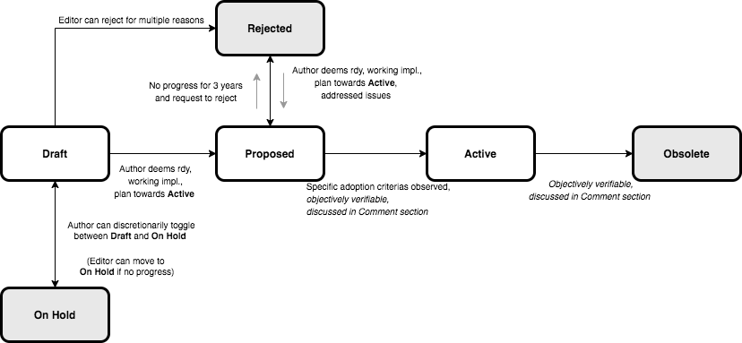

## Abstract

A Cardano Improvement Proposal (CIP) is a formalized design document for the Cardano community, providing information or describing a new feature for the Cardano network, its processes, or environment in a concise and technically sufficient manner. In this CIP we describe what a CIP is, how the CIP process functions, and how users should go about proposing, discussing and structuring a CIP.

The Cardano Foundation intends CIPs to be the primary mechanisms for proposing new features, collecting community input on an issue, and for documenting design decisions that have gone into Cardano. Because the CIPs are maintained as text files in a versioned repository, their revision history is the historical record of the feature proposal.

## Specification

### CIP types

There are three kinds of CIP:

1. A **Standards Track** CIP describes any change that affects most or all Cardano implementations, such as a change to the network protocol, a change in block or transaction validity rules, or any change or addition that affects the interoperability of applications using Cardano. Standards Track CIPs consist of two parts, a design document and a reference implementation.
1. A **Process** CIP describes a process surrounding Cardano, or proposes a change to (or an event in) a process. Process CIPs are like Standards Track CIPs but apply to areas other than the Cardano protocol itself. They may propose an implementation, but not to Cardano's codebase; they often require community consensus; unlike Informational CIPs, they are more than recommendations, and users are typically not free to ignore them. Examples include procedures, guidelines, changes to the decision-making process, and changes to the tools or environment used in Cardano development. Any meta-CIP is also considered a Process CIP.
1. An **Informational** CIP describes a Cardano design issue, or provides general guidelines or information to the Cardano community, but does not propose a new feature. Informational CIPs do not necessarily represent a Cardano community consensus or recommendation, so users and implementors are free to ignore Informational CIPs or follow their advice.

### CIP format and structure

CIPs should be written in [Markdown](https://guides.github.com/features/mastering-markdown/) format. Each CIP should have the following parts:

| Name | Description |
| --- | --- |
| Preamble | Headers containing metadata about the CIP ([see below](#cip-header-preamble)). |
| Abstract | A short (\~200 word) description of the technical issue being addressed. |
| Motivation | The motivation is critical for CIPs that want to change the Cardano protocol. It should clearly explain why the existing protocol is inadequate to address the problem that the CIP solves. |
| Specification | The technical specification should describe the syntax and semantics of any new feature. The specification should be detailed enough to allow competing, interoperable implementations for any of the current Cardano platforms. |
| Rationale | The rationale fleshes out the specification by describing what motivated the design and why particular design decisions were made. It should describe alternate designs that were considered and related work. The rationale should provide evidence of consensus within the community and discuss important objections or concerns raised during discussion.|
| Backwards compatibility | All CIPs that introduce backwards incompatibilities must include a section describing these incompatibilities and their severity. The CIP must explain how the author proposes to deal with these incompatibilities.|
| Reference implementation | The reference implementation must be completed before any CIP is given status "Active", but it need not be completed before the CIP is accepted. It is better to finish the specification and rationale first and reach consensus on it before writing code. The final implementation must include test code and documentation appropriate for the Cardano protocol.|
| Copyright | The CIP must be explicitly licensed under acceptable copyright terms ([see below](#CIP-licensing)).|

### CIP Workflow

A CIP begins as an idea about how to improve the Cardano network or its surrounding processes, with one or more individuals who are willing to propose and discuss the idea with the Cardano community. After initial discussion and feedback, the idea is then formalized into a properly formatted proposal and submitted as a pull request to the CIP repository. The resulting new Draft CIP is then publicly processed and progressed as follows:  

  

#### How to progress from an idea into a draft CIP

  
1. Skim through existing discussions and proposals.

If you have an idea you would like to propose, first search through previously proposed or discussed ideas in this repository and in public forums, and aim to extend an existing conversation if similar enough. If your idea is original or sufficiently distinct, start a new conversation thread to enable a discussion with the community. Favor public forums such as the [Cardano Developer forum](https://forum.cardano.org/c/developers/), [Cardano subreddit](https://reddit.com/r/cardano), or other active Cardano discussion places so that the community can weigh in on the proposition. You should seek feedback and try to build informal consensus, as well as keep track of any critical feedback so that you can address it later. 

---

  
2. Post a draft to the forum; engage with the community.

When enough of an engaged conversation has taken place and the idea resonates with some, prepare a draft of your proposal. The draft proposal should be posted to the [Cardano CIPs forum](https://forum.cardano.org/c/developers/cips/122). 
This provides formal visibility beyond the original discussion, and helps the author(s) clarify details of the proposal as it is circulated more widely. 
Because the author or authors are responsible for collecting and summarizing community feedback in the next phase, long open-ended discussions should be avoided when creating the initial draft. Consider accepting private comments during the early design phases, setting up a wiki page, GitHub repository, or some other method to keep the discussion focused.

---

  
3. Post a matured draft to the CIP repository.

Once you've allowed enough time for feedback and a properly formatted ([see below section](#CIP-format-and-structure)) draft CIP has been written, it should be submitted to the [Cardano Improvement Proposals GitHub repository](https://github.com/cardano-foundation/CIPs) as a pull request, accompanied by a summary of the discussion so far in the comment section, with links where possible. 

Name the pull request in an informative fashion, such as "CIP-authorname-FormalVerificationMethods" so the function can be inferred from the title. Do not self-assign a CIP number. An editor will review and approve or reject your CIP, based on the following criteria.

> To be accepted, a CIP must be a clear and complete description of the proposed enhancement, a net improvement to the ecosystem, without unduly complicating the protocol.

> A rejection might be due to duplication of effort, disregard for formatting rules, being too unfocused, being too broad, being technically unsound, not providing proper motivation, not addressing backwards compatibility, or not keeping with the Cardano philosophy.

---

  
4. Wait for approval and/or feedback from the CIP editors.

A CIP editor will assign a CIP number, select the appropriate CIP type (Standards, Informational, or Process), and merge the accepted draft CIP into the CIPs GitHub repository. Merging does not imply acceptance or agreement, merely the formalizing of the discussion. From here, the CIP status is said to be in "Draft" mode. To update the draft, the CIP author should submit pull requests as necessary. 

---

> :bulb: **Keep in mind:**
>
> The community should resonate with a proposed idea before its formalization, no need formalizing a CIP nobody wants.
> Not every change should be a CIP, a minor patch or small feature is probably better submitted as an issue in the relevant repository (use your best judgement, the CIP editors can provide guidance).
>
> The more focused a CIP is, the easier it is to formalize and decide on. Strive to integrate a single key proposal, idea or concept. If in doubt, split it into smaller well-focused CIPs. 
>
> Your weighing in publicly (on ideas or proposals you are qualified to review) is just as important as pushing new ideas - thanks for fostering an atmosphere of openness, welcoming critical opinions and supporting logical argumenting. Help others and provide advice when able to. 

#### CIP statuses

| Status   | Description                                                                                                                    |
| ---      | ---                                                                                                                            |
| Draft    | The idea has been formally accepted in the repository, and is being worked on by its authors.                                  |
| Proposed | A working implementation exists, as well as a clear plan highlighting what is required for this CIP to transition to "Active". |
| Active   | The proposal is deemed to have met all the appropriate criterias to be considered Active.                                      |
| On Hold  | The CIP author is not currently working on this effort.                                                                        |
| Obsolete | The CIP was either retired or made obsolete by a newer CIP.                                                                    |
| Rejected | There is some issue with the CIP that makes it not acceptable at this point.                                                   |

#### How to champion a CIP beyond Draft / Progression to Active status

Once a CIP has been merged into the CIP GitHub repository, it benefits from public exposure and the review of the CIP editors. However, work should still be driven by the author(s) towards the CIP being considered active.

The author or authors of a CIP can decide at any time to change the status from draft to on hold if they are currently unable to proactively progress the CIP.
A CIP editor may also change the status to on hold if no progress is being made on the CIP for some time.

A CIP's status should only be changed from draft (or rejected) to proposed when the author or authors deem it complete, it has a working implementation (where applicable), and has community plans to progress it to the Active status.

A CIP can be rejected by a CIP editor for a few specific reasons. CIPs should be changed from draft or proposed status to rejected status, upon request by any person, if they have not been progressed for more than three years. A rejected CIP can be changed to proposed status if it meets the criteria described in the previous paragraph, and if the author or author(s) provide revisions that meaningfully address the original criticism of the proposal that caused it to be rejected.

A proposed CIP may progress to active only when specific criteria reflecting real-world adoption have been met. These will be different for each CIP, depending on the nature of its proposed changes, which will be expanded on below. Evaluation of this status change should be objectively verifiable, and/or be discussed in the [Cardano CIPs forum](https://forum.cardano.org/c/developers/cips).

When an active CIP is no longer relevant, its status may be changed to obsolete. This change must also be objectively verifiable and/or discussed.

The procedure for a Process CIP to progress from draft to active is slightly different: a Process CIP may change status from draft to active when it achieves rough consensus in the community. Such a proposal is said to have rough consensus if it has been open to discussion on the [Cardano CIPs forum](https://forum.cardano.org/c/developers/cips) for at least one month, and no person maintains any unaddressed, substantiated objections to it. Addressed or obstructive objections may be ignored or overruled by general agreement that they have been sufficiently addressed, but clear reasoning must be given in such circumstances.

For a CIP to progress to active status, it requires adoption from the majority of the Cardano economy, including ada holders, stake pools, and exchanges, among others. Adoption must be demonstrated by de facto usage of the CIP in practice.

Software authors are encouraged to publish summaries of what CIPs their software supports to aid in the verification of CIP status changes. Good examples of this (at the time of writing) can be observed in the [Bitcoin Core BIPs.md file](https://github.com/bitcoin/bitcoin/blob/master/doc/bips.md).

These criteria are considered objective ways to observe the de facto adoption of a CIP, and are not to be used as reasons to oppose or reject a CIP. Should a CIP become unambiguously adopted despite not meeting the criteria outlined here, it should still be updated to active status.

### CIP header preamble

Each CIP must begin with an [RFC 822](https://www.ietf.org/rfc/rfc822.txt) style header preamble, preceded and followed by three hyphens (`---`). The headers are required in the following order but the ones flagged with "\*" are optional.

| Field                | Description                                                 |
| ---                  | ---                                                         |
| `CIP`                | CIP number, or "\?" before being assigned                   |
| `Title CIP title`    | maximum 44 characters                                       |
| `Author`             | list of authors' real names and email addrs                 |
| * `Discussions-To`   | email addrs                                                 |
| * `Comments-Summary` | summary tone                                                |
| `Comments-URI`       | links to wiki page for comments                             |
| `Status`             | Draft | Proposed | On Hold | Rejected | Active | Obsolete   | 
| `Type`               | Standards Track | Informational | Process                   |   
| `Created`            | date created on, in ISO 8601 (yyyy-mm-dd) format            |
| `License`            | abbreviation for approved license(s)                        |
| * `License-Code`     | abbreviation for code under different approved license(s)   |
| * `Post-History`     | dates of postings to Cardano Dev Forum, or link to thread   |
| * `Requires`         | CIP number(s)                                               |
| * `Replaces`         | CIP number                                                  |
| * `Superseded-By`    | CIP number                                                  |

The Author(s) header lists the names and email addresses of the author or authors of the CIP.
The format of the Author(s) header value must be:

  Random J. User \<address@dom.ain\>

If there are multiple authors, each should be on a separate line following RFC 2822 continuation line conventions.

While a CIP is in private discussions (usually during the initial draft phase), a Discussions-To header will indicate the mailing list or URL where the CIP is being discussed. No Discussions-To header is necessary if the CIP is being discussed privately with the author.

The Type header specifies the type of CIP: Standards Track, Informational, or Process.

The Created header records the date that the CIP was assigned a number, while Post-History is used to record when new versions of the CIP are posted to Cardano mailing lists.
Dates should be in yyyy-mm-dd format, e.g. 2001-08-14.

CIPs may have a Requires header, indicating the CIP numbers that this CIP is dependent on.

CIPs may also have a Superseded-By header, indicating that a CIP has been rendered obsolete by a later document. The value is the number of the CIP that replaces the current document. The newer CIP must have a Replaces header containing the number of the CIP that it rendered obsolete.

### Auxiliary Files

CIPs may include auxiliary files such as diagrams. Auxiliary files should be included in that CIP's directory, or must be named CIP-XXXX-Y.ext, where "XXXX" is the CIP number, "Y" is a serial number (starting at 1), and "ext" is replaced by the actual file extension (e.g. "png").

### CIP Editors

CIP editors serve as stewards of the Cardano ecosystem, here to support and progress CIPs in their various stages within the community and protocol. If you have questions regarding the CIP process, they can point you in the right direction. They provide support for users trying to create a CIP, monitor that the CIP process is fair, formalized, objective, and to facilitate knowledge transfer through the CIPs themselves.

Frederic Johnson - @crptmppt 

Matthias Benkort - @KtoZ 

Sebastien Guillemot - @SebastienGllmt

Duncan Coutts - @dcoutts 

CIP editors should strive to keep up to date with general technical conversations and Cardano proposals. For each new draft proposal submitted in <https://forum.cardano.org/c/developers/cips>, an editor might review it as follows:

- Read the proposal to check if it is ready, sound, and complete.
- Check if it has been [properly formatted](#CIP-format-and-structure).
- Check if sufficient time has been allowed for proper discussion amongst the community.
- Ensure the motivation behind the CIP is valid and (if applicable) backward compatibility is addressed.
- Confirm licensing terms are acceptable.

If the draft proposal isn't ready, an editor might notify the author and request appropriate revisions.

Draft proposals submitted to the [CIPs GitHub repository](https://github.com/cardano-foundation/CIPs) that get accepted will see an editor:
- Assign a CIP number
- Assign a type
- Merge the pull request
- List the CIP in the parent directory's [README.md](../README.md)

Proposals that get rejected by an editor will have the reason for the rejection in the comment section.

CIP Editors are intended to fulfill administrative and editorial responsibilities: monitor CIP changes, update CIP headers, and facilitate the CIP discussion and submition process. Off-list CIP-related correspondence should be sent (or CC'd) to <CIP@cardanofoundation.org>.

### CIP comments

Each CIP should, in its preamble, link to a public page with a summary tone of the comments on that page.
Reviewers of the CIP who consider themselves qualified, should post their own comments on that public page.
The comments page should generally only be used to post final comments for a completed CIP.
If a CIP is not yet completed, reviewers should instead post on the applicable development mailing list thread to allow the CIP author(s) to address any concerns or problems pointed out by the review.

Some CIPs receive exposure outside the development community prior to completion, and other CIPs might not be completed at all. To avoid a situation where critical CIP reviews may go unnoticed during this period, reviewers may, at their option, still post their review on the comments page, provided they first post it to the forum and plan to later remove or revise it as applicable based on the completed version. Such revisions should be made by editing the previous review and updating the timestamp. Reviews made prior to the complete version may be removed if they are no longer applicable and have not been updated in a timely manner.

Pages must be named after the full CIP number (eg, "CIP 0001") and placed in the "Comments" namespace.
For example, the link for CIP 1 will be <https://github.com/cardano-foundation/CIPs/wiki/Comments:CIP-0001>.

Comments posted to this wiki should use the following format:

    <Your opinion> --<Your name>, <Date of posting, as YYYY-MM-DD>

CIPs may also choose to list a second forum for CIP comments, in addition to the CIPs wiki.
In this case, the second forum's URI should be listed below the primary wiki's URI.

After some time, the CIP itself may be updated with a summary tone of the comments.
Summary tones may be chosen from the following, but this CIP does not intend to cover all possible nuances and other summaries may be used as needed:

- No comments yet.
- Unanimously recommended for implementation
- Unanimously discourage for implementation
- Mostly recommended for implementation, with some discouragement
- Mostly discouraged for implementation, with some recommendation

For example, the preamble to CIP 1 might be updated to include the line:

    Comments-Summary: No comments yet.
    Comments-URI: https://github.com/cardano-foundation/CIPs/wiki/Comments:CIP-0001
                  https://some-other-wiki.org/CIP_1_Comments

These fields must follow the "Discussions-To" header defined in CIP 1 (if that header is not present, it should follow the position where it would be present; generally this is immediately above the Status header).

To avoid doubt: comments and status are unrelated metrics to judge a CIP, and neither should be directly influencing the other.

- Due to the low barrier of entry for submission of new CIPs, it seems advisable for a way for reviewers to express their opinions on them in a way that is consumable to the public without needing to review the entire development discussion.
- Those commenting on CIPs should refrain from commenting outside of their area of knowledge or expertise. However, comments should not be censored, and participation should be open to the public.

### Transferring CIP ownership

It occasionally becomes necessary to transfer ownership/authorship of a CIP. The original author might no longer have the time or interest to update the CIP, progress, or simply has disappeared. Not agreeing with the direction of the CIP shouldn't be a reason to transfer ownership. 

If you feel a CIP has been abandoned and want to take over ownership of it, send a message addressed to both the original author and the CIP editor, with the reasoning for your stepping up. The CIP editor will, at their discretion, decide if you should be made the author and the original author moved to co-author to preserve historical ties (circumstances permitting, pending a response from the original author, who might prefer to be taken off the CIP altogether). All changes will also be considered reversible.

### CIP licensing

New CIPs may be accepted with the following licenses. Each new CIP must identify at least one acceptable license in its preamble. The License header in the preamble must be placed after the Created header. Each license must be referenced by their respective abbreviation given below.

#### Recommended license

- for Software (for code): Apache-2.0: [Apache License, version 2.0](http://www.apache.org/licenses/LICENSE-2.0)
- for documentation: CC-BY-4.0: [Creative Commons Attribution 4.0 International Public License](https://creativecommons.org/licenses/by/4.0/legalcode)

Example: This file is documentation, and therefore subject to CC-BY-4.0 (and not subject to Apache 2.0).

#### Unacceptable licenses

All licenses not explicitly included in the above lists are not acceptable terms for a Cardano Improvement Proposal unless a later CIP extends this one to add them.

## Motivation

The motivation for this CIP is to create a public platform that can be used for sharing Cardano improvement ideas and specifications with the community, allowing the Cardano network to grow and advance over time.

## Rationale

This CIP is needed to establish a process by which other CIPs can be implemented. It draws heavily on Bitcoin's BIP process.

## Copyright

This CIP is licensed under [CC-BY-4.0](https://creativecommons.org/licenses/by/4.0/legalcode)

### See Also

- [BIP 2: BIP process, revised](https://github.com/bitcoin/bips/blob/master/bip-0002.mediawiki)
- [RFC 7282: On Consensus and Humming in the IETF](https://tools.ietf.org/html/rfc7282)
