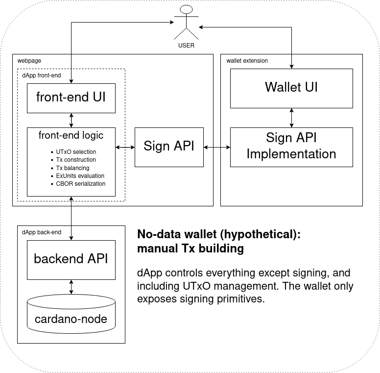
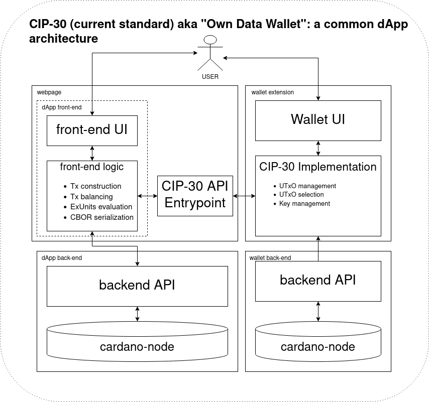
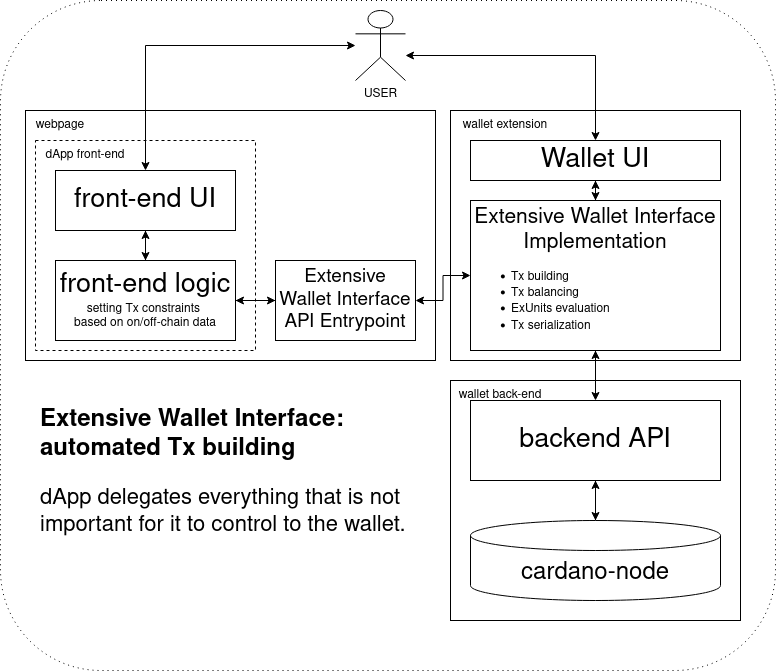

## Abstract
Wallets the foundational element of Web3, being the primary interface between users and blockchains.
Wallet connectors allow users to connect their wallet to client stacks (i.e. dApps), facilitating a wide range of specialized user experiences.

Wallet connector standards largely consist of two parts: the connection standard and the API.
The connection standard defines how the wallet and dApp initiate communication, for example, using an injected Javascript object.
The API defines what communications look like between the dApp and wallet post connection.

This problem statement is concerned with the issues surrounding Cardano's current and future wallet connectors.
These interfaces are difficult to define and historically have been even harder to iterate upon.
We wish to provide a comprehensive catalogue of the current offerings and their drawbacks to be able to make suggestions on future standards.

For the many contributors to this proposal, see [Acknowledgements](#acknowledgements).

## Problem
The motivation for this document is to outline the current state of Cardano's wallet connectors, discuss their flaws, and identify key concerns for future connector authors to be aware of.
We hope that by discussing the issues, we will inspire the next generation of Cardano wallet connectors so that the ecosystem can grow beyond its first connector iterations.

Ineffective connectors can cause a range of issues for wallets, dApp developers, and thus users.
Due to the nature of these connections, there can often be unforeseen impacts from small design decisions.

For users, connectors should offer secure and reliable compatibility with a wide range of dApps.
For dApps, connectors should be reliable and provide stable and rich APIs.
For wallets, connectors should be secure, optionally extendable, and with APIs which do not expect wallets to go beyond standard expectations.

### Core Concerns
Here we outline what we see as the necessary concerns which connector authors should consider.

#### 1. Security
Security should remain of paramount concern within Web3.
Connection standards must strive to, above all, not compromise the security of wallets or dApps.
Connection standards should be aware of the potential impacts of standard security vulnerabilities, such as man-in-the-middle attacks.

The security of the API should remain eminent.
An example of this is that no secret information should ever be allowed to leave the wallet.

#### 2. Range of supported connection
Connection standards should support a wide range of wallets and client platforms.
This means we shouldn't assume a software environment (e.g. JavaScript in the browser) and define the APIs using schema languages widely used in language-agnostic contexts.
With the base-level connections only offering an indication of supported APIs bidirectionally.

#### 3. API Expressiveness
APIs should allow for an expressive range of information to be exchanged.
Information should be able to be passed in both directions.

#### 4. Versioning
Connection standards and APIs should be explicitly versioned to clearly allow upgrades.
Furthermore, ideally, APIs should allow for optional extendability to facilitate specialization of connection.

#### 5. Adherence to Expected Roles
APIs should be written to have a clear scope, understanding the potential strains placed on wallet providers.

### Context

#### Cardano's Wallet Connector*s*
[CIP-30](https://github.com/cardano-foundation/CIPs/blob/master/CIP-0030/README.md) is *the* wallet connector for Cardano.
This standard has facilitated the emergence of dApp development on Cardano by defining both a connection standard and an API.
It is, to date, the only wallet connector to see wide adoption in the ecosystem.
Using an injected Javascript object for communication between wallets and web-based dApps.
Since its' authoring, CIP-30 has seen continued iteration with many tweaks to its API.

##### CIP-30 Alternatives
Post CIP-30's acceptance there have only been two other competing standards, in CIP-45 | Decentralized WebRTC dApp-Wallet Communication ([#395](https://github.com/cardano-foundation/CIPs/pull/395)) and CIP-90 | Extendable dApp-Wallet Web Bridge ([#462](https://github.com/cardano-foundation/CIPs/pull/462/)).
With neither of these standards gaining significant adoption.

With CIP-45 offering an alternative connection standard based on initiating a WebRTC connection via WebTorrent tracker, taking a similar to [Wallet Connect](https://walletconnect.com/).
This was motivated by a want to diversify the connection standards in Cardano.
Unlike CIP-30 this proposal does not define any standards for the API shared after connection time, instead it just reuses the [CIP-30 Full API](https://github.com/cardano-foundation/CIPs/blob/master/CIP-0030/README.md#full-api).

CIP-90 was created in reaction to the last major changes to CIP-30, within [#446](https://github.com/cardano-foundation/CIPs/pull/446).
This proposal aims to reuse the CIP-30 connection standard, whilst making the CIP-30 API optional, allowing for other CIPs to specify further APIs.
This contrasted the ideas presented within [#446](https://github.com/cardano-foundation/CIPs/pull/446) which stipulated that all connections should include the CIP-30 Full API. 

Although not a direct competitor, [CIP-13 | Cardano URI Scheme](https://github.com/cardano-foundation/CIPs/blob/master/CIP-0013/README.md) could be seen as an alternative standard, fitting some wallet-client niches.
This URI scheme allows a sort-of one way connection, where information can be passed to a wallet to trigger a function.

#### Historical Issues
CIP-30 is likely the most iterated upon CIP, post merger into the CIPs repository.
These changes have been attempting to remedy issues with the initial proposal.

##### Versioning
Despite the CIP-30 API including a [versioning mechanism](https://github.com/cardano-foundation/CIPs/blob/master/CIP-0030/README.md#cardanowalletnameapiversion-string) it was not utilized.
Alterations to the API were accepted without incrementing the version number.

These changes resulted in diverging implementations and thus broken compatibility.
At connection time there would be no way to tell which version of CIP-30 the wallet had implemented.
Often resulting in errors during dApp-wallet communication, degrading usability.

A result of this has been that dApps whitelist only those wallets which they have tested against.
This completely undermines the benefits of having such a standard.
Furthermore this whitelisting has encouraged those smaller wallets to emulate the whitelisted wallets, by injecting themselves under the name of the whitelisted wallets.
This sort of arms race, is completely unnecessary and results in future complexities for both sides.

##### Unclear Responsibilities
CIP-30 does not provide rationale to what should be the concern of the wallet and clients.

The knock-on effect of this is uncertainty regarding the direction future CIP-30 development should follow.

##### Limited Scope
By it's nature CIP-30 is a base level connector designed to get the first dApps on Cardano moving.
It does, of course, have a finite scope which cannot support future upgrades or specialized connections.

##### Language Dependent
CIP-30's connection standard and API is defined using Typescript.
Whilst this is convenient for Javascript-based clients this is not convenient for other stacks. 

Tying the wallet connector to a single language is naturally limiting and will cause friction for potential adopters.

##### Limited to Web-based Stacks
The CIP-30 connection standard is based upon injecting code into shared web windows.
This is convenient for browser extension wallets and web-based client stacks, but is awkward for all other implementors.

One consequence of this is that mobile wallets are thus required to reimplement web browsers in their applications, which is wasted effort.
A similar novel solution would be required for the current full node wallets to be able to utilize CIP-30 compatible dApps.
This is not great as non-web-based wallets (and their users) are unable to utilize the benefits of Cardano's web3.

##### Undefined Behavior
The overall descriptions of CIP-30 behavior are brief, leading to many potential cases of undefined behavior.

For example; should the results of `.getUtxos()` include UTxOs the wallet wishes to reserve/not spend? or include UTxOs the wallet knows are in the process of being spent? how should these reserved/pending UTxOs factor into the result of `.getBalance()`?
Such behavior is unclear and thus different wallets will implement behavior differently, leading to inconsistent experiences for dApps and users.

##### Combined Standard
CIP-30 defined both a connection standard and an API which must be used on every connection.
This is limiting as it forces all connections using the CIP-30 connect to always use the same endpoints.
This adds unneeded complexity, making iterating on connection or API more difficult.

##### No event listener
The CIP-30 API and connector is purely based on synchronous and asynchronous calls made by the client dApp.
This prevents useful advantages of event-based design, such as dApps subscribing to state update events emitted by wallets.

#### CIP-30 Iteration Improvements
CIP-30 has seen some efforts to address its flaws.

##### CIP-30 Extensions
The CIP-30 extendibility mechanism was introduced as a novel versioning scheme within [#446](https://github.com/cardano-foundation/CIPs/pull/446) and was further refined in [#577](https://github.com/cardano-foundation/CIPs/pull/577).
The motivation was to provide a safe way to optionally modify the CIP-30 API without breaking existing implementations.
Furthermore these changes were introduced to stop any further modifications to the CIP-30 API, negating the need for versioning.
This has allowed for the creation of further CIPs defining API extensions, to upgrade, specialize and enhance CIP-30 connections.
With extensions also going part way to be able to address undefined behavior.

At time of writing there are four proposed extensions, with only one being merged into the CIPs repository.

##### CIP-30 Alteration Freeze
As part of the extension mechanism be added within [#446](https://github.com/cardano-foundation/CIPs/pull/446), a less formal shift in attitude was adopted by the CIP editors.
In that no more alterations to CIP-30 would be allowed, instead all changes must be done through the extension mechanism.
This prevents anymore downstream issues caused by lack of versioning.

##### This Problem Statement
The hopefully final remediation to CIP-30 is this document.
We want to discuss CIP-30's drawbacks, so they can be understood moving one step closer to solving them.

## Use cases

### NFT Marketplace
Alice wishes to buy a NFT from an smart contract based NFT marketplace for an agreed price because she wishes to support the artist.
Alice wants to be able to use a familiar website interface where she can browse rendered NFTs then select and buy on the same site.

Without the dApp and her wallet communicating it is very difficult to construct the needed transaction to buy the NFT Alice wants.

### Simple Wallet Login
Bob wants to use his wallet to login to a website.
The website requires that Bob presents both; his public credentials and also prove his ownership of them.

It is difficult for Bob to produce and share proof of ownership for public credentials in a secure way without the dApp and wallet communicating.

### dApp Developer
Carol is a dApp developer, who wants many users to be able interact with her dApp via web interface.
She wants to be able to support a wide range of wallets and platforms to maximize potential user base.
Whilst she wants the API standards to be expressive so that her dApp is able to offer a range of functionality.

### Wallet provider
Dave has created a wallet, he wants to minimize the cost of running his wallet.

Without clear role of the wallet, and optional API extension scoping Dave's infrastructure may be asked to do many operations incurring cost.

## Goals
These goals we outline for future wallet connection and API standards are based upon solving our [Core Concerns](#core-concerns).

**Wallet connectors should:**

### 1. Prioritize Security
Potential security concerns of wallet connector designs should be well understood and discussed in accompanying CIPs.
Authors should seek the collective knowledge of the CIP process to obtain wide range of perspectives.

The impact of any data leaving the wallet should be discussed, especially for the cases of data that is not observable via the chain, such as root public keys.

Although security tolerances are at an implementors discretion, the potential negative impact on the ecosystem should be taken into account by authors.

### 2. Provide Interoperable, Optional and Extensible APIs
Future API standards should be connection agnostic as well as stack standard agnostic.
Meaning API CIP-1234 should work if connection has been initiated via CIP-30 connection or CIP-45, or CIP-4321.

API standards should exist within an extensible framework, whereby specific connections can be permissioned and specialized.
APIs should be developed via the CIP process, whereby CIPs will each define their own set of endpoints.

Implementing the API support should be fully at the discretion of the wallet providers.
Although at connection time dApps should be free to request as many APIs as they wish, they should not rely on the implementation of optional APIs beyond APIs implemented in [No-data Wallets](#no-data-wallets).
Connections be based on "who am I? what do I support?"

### 3. Support Versioning
Versioning standards should be utilized by connection standard and API authors.
APIs should inherit the novel versioning utilized for CIP-30 extensions.
Connection standards should be free to employ any versioning scheme they wish.

### 4. Work Within the Role of Wallet
Connection and API authors should understand that there are different types of wallets, each with their own constraints.
Standards should be aware of this and discuss which wallets are applicable in their CIPs.

Whilst most software wallets generally offer users a range of features, at their *core* all wallets are concerned with the management of cryptographic operations.
The majority of wallets build on this by using a chain indexer, so information related to wallets' cryptographic credentials can be gathered and presented to users.

By only expecting wallets to support cryptographic operations we define a universal rule for all wallet connectors.
This means at a minimum all dApps can expect from wallets during connection is cryptographic operations.
Although, dApps should be able to request additional functionalities on connection if they wish.

**Building on this we define further divisions:**

#### Types of Wallet
All possible wallet standards can be divided into three groups based on a single criterion: what data they provide to dApps via the API endpoint.

This division is important because each of the groups allows for different dApp architectures.

**Note** The groups are nested: every wallet is a no-data wallet and every full-data wallet is also an own-data wallet if we look at the dApp architectures they enable.

##### No-data Wallets
No-data wallets do not provide data queries and are only concerned with cryptographic operations (e.g. hardware wallets).
All management of UTxOs is placed on dApps side.
No-data wallets can use multiple addresses, but they do not allow to query for available UTxOs and do not indicate which of the addresses are actually used on-chain.

These wallets may even rely on dApps to derive addresses, by sharing the root public key.

This design ensures that wallets can function without a query layer and thus without runtime infrastructure needed.

##### Own-data Wallets
Own-data wallets provide chain queries related to users' own data and wallet state (users' addresses and UTxOs).
CIP-30 falls into this category.

This architecture has two major issues:

- **Unclear separation of concerns** - while wallets provide certain functions for dApp developers, they have no means to enforce their use, and naturally some developers opt to using their own query layers when they see fit, with consequences that are hard to predict. For example, the wallet may not allow signing a transaction that consumes an UTxO it considers "locked".

- **Two sources of truth problem** - on Cardano, every running node has its own opinion on the set of currently unspent transaction outputs. Only [eventual consistency](https://en.wikipedia.org/wiki/Eventual_consistency) is guaranteed. Any dApp that interacts with an own-data wallet has to deal with the inconsistency between local `cardano-node`-based query layer and light wallet query layer, especially when dApp workflow involves sending multiple interactions with the wallet in quick succession. For example, a wallet may refuse to sign a transaction containing an UTxO it does not (yet) know about.

Even if we enforce clear separation of concerns in the standards, e.g. by stating that sending a transaction bypassing the wallet is not allowed, the problem of two sources of truth will remain.

##### Full-data Wallets
Full-data wallets allow to query blockchain data outside of user's scope (i.e. anything not covered by own-data wallets).

Depending on dApp needs, full-data wallets open a way to implement fully-functional dApps that use non-local blockchain data without the need for the developer to maintain dApp backend infrastructure.
As a result, more decentralized and censorship-resistant architectures become possible: a dApp can be distributed as a set of files, and deployed to IPFS or static hosting websites.

Full-data wallets enable "single source of truth" architecture: no need to work around data inconsistency between two query layers.

They are more expensive to operate due to higher query layer requirements, but the risks could be lowered by letting query layer providers and wallet developers be separate entities.
That would also allow the end users to choose query layer providers they trust more rather than being forced to trust wallet's infrastructure as well as code, and, optionally, use their own query layer deployments, thus alleviating the need to trust any external wallet backend while enjoying the usual interface.

### 5. Minimize Growing Pains
The pain caused by uprooting all CIP-30 implementations should not be underestimated.
Thus, future standards should work to minimize the potential pain, be it by support CIP-30 implementations in a legacy mode.

## Open Questions

### Can a universal connector be pursued?
Every wallet connector that simply adds functionality on top of another standard can be considered a valid implementation of the base standard.
If the set of standards is designed in a way that allows for extensions without conflicts, then a superset of all standards can be considered a universal connector. How to make it possible to clearly define a "universal connector" and whether it is useful at all remains to be seen.

### Can a universal API be pursued?
Platform differences are a concern: by using specifications that do not rely on assumptions about data transfer methods, software environment or programming language, it is possible to create a standard that is truly reusable across platforms.

There are many types of dApp architectures enabled by different wallet types, but there is no requirement to use the APIs provided by wallets, so dApps that use simpler standards should still remain functional when used with their extensions.

### How interoperable can standards be with those of other ecosystems?
Cardano is sufficiently different from most of the blockchains that aim to unify their wallet standards.

What options do we have for integration with Cardano sidechains, rollups, hardforks, private testnets, etc.?

### How can we effectively police API scope?
How can we prevent duplication of functionality and make sure different APIs do not overlap?

## Acknowledgements

  
<strong>First workshop - 2023-11-27</strong>

  We would like to thank those that contributed to the first workshop hosted by Adam Dean and Ryan Williams ([see shared drive with resources](https://drive.google.com/drive/folders/1gYGeVJBLmDhCGEp1mTkCrsJYspd5hSoM?usp=drive_link)).
  - Beatrice Anihiri
  - Denis Kalinin
  - Evgenii Lisitskii
  - George APEX Pool
  - George Flerovsky
  - George Humphreys
  - Hernán Rajchert
  - Jack Rousian
  - Joshua Marchand
  - Ken Fritschy
  - Ken-Erik Ølmheim
  - Leo H
  - Marcel Baumberg
  - Martynas Kazlaukas
  - Michael Chappell
  - Mircea Hasegan
  - Nicolas Ayotte
  - Rhys Bartels-Waller
  - Robert Phair
  - Rodolpho Ribeiro
  - Steven Johnson
  - Teodora Sevastru Lunn
  - Thomas Lindseth
  - Thomas Upfield
  - Vladimir Kalnitsky

  
<strong>Second workshop - 2023-12-08</strong>

  We would like to thank those that contributed to the second workshop hosted by Adam Dean and Ryan Williams ([see shared drive with resources](https://drive.google.com/drive/folders/1gYGeVJBLmDhCGEp1mTkCrsJYspd5hSoM?usp=drive_link)).
  - Alex Dochioiu
  - George APEX Pool
  - Mark Byers
  - Leo H

  
<strong>Third workshop - 2024-01-06</strong>

  We would like to thank those that contributed to the third workshop hosted by Ryan Williams ([see shared drive with resources](https://drive.google.com/drive/folders/1gYGeVJBLmDhCGEp1mTkCrsJYspd5hSoM?usp=drive_link)).
  - Brent
  - Ishita Verma
  - Jonathan Kelly
  - Leo H
  - Nick Ulrich
  - NOODZ
  - Vladimir Kalnitsky

## Copyright

This CPS is licensed under [CC-BY-4.0](https://creativecommons.org/licenses/by/4.0/legalcode).