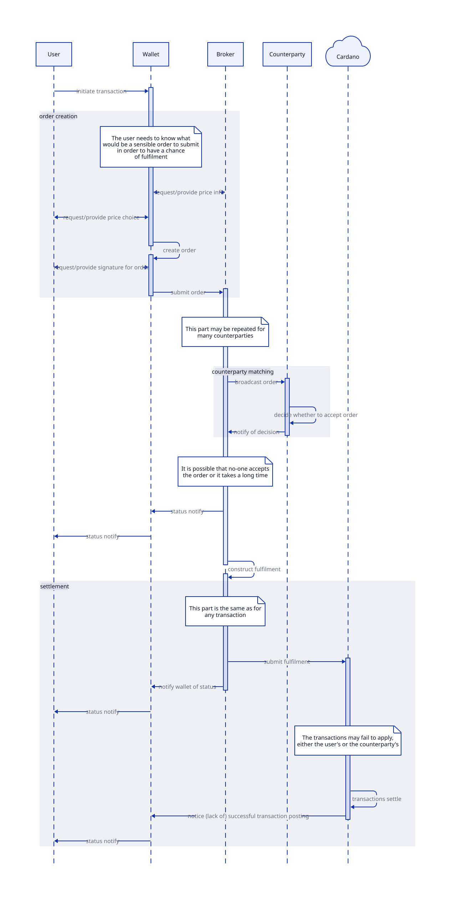

## Abstract

We describe a family of issues around “intents” on Cardano. We do some basic analysis on the problem space, and suggest some high-level areas for investigation.

## Problem

In many cases, a user’s desired interaction with a system is not fully specified. 
Classic examples include things like “market orders” where a user wants to buy an asset at the “market price”, and does not specify exactly what that is, leaving it up to another system to resolve. 
A common name for these kinds of “incomplete” or “partial” actions is “intents”. 
We refer to the process of turning an intent into something complete as “fulfilment”.

Intents are [quite prevalent](https://members.delphidigital.io/reports/wtf-is-anoma-part-2-wtf-are-intent-based-apps) in blockchain systems (see “Use cases” for more discussion of specific examples), but they are also problematic since blockchain systems usually require a fairly high degree of specificity in their settlement layer. 
For example, if you want to perform a trade, you usually need to specify exactly who with and exactly how much for.

Cardano is unusually stringent in this regard. 
On Ethereum, for example, smart contracts can actually change what your transaction does, in a way that is only determined when the transaction is validated.[^transaction-non-determinism]
In contrast, on Cardano smart contracts only validate the behaviour that the user has specified in their transaction. 
This gives us very nice determinism properties... but when resolving intents we actually want non-determinism!

[^transaction-non-determinism]: This means that some use cases that need an "intents" system on Cardano can be done easily on Ethereum. For example, there is no need to do anything to enable non-deterministic access to state when operating smart contracts, since that's the default. Intent use cases that require _matching_ (like swaps) still likely need new technology.

We can see the “concurrency problem” through this lens. 
Cardano insists that state updates (via datums in UTXOs) are completely explicit and deterministically sequenced, in contrast to systems like Ethereum, where state access is implicit and non-deterministically sequenced. 
This is quite inconvenient, since what users often want is to interact with “the current state” of an application, and they are happy for this to be determined non-deterministically.[^concurrency]

[^concurrency]: See https://github.com/input-output-hk/Developer-Experience-working-group/issues/47 for discussion of a very intent-like approach to solving the concurrency problem.

To support intent-based interactions, we need three things:
1. A way of expressing intents and fulfilments
2. A way of turning intents and fulfilments into something that can be settled on the blockchain (“intent settlement”)
2. A way of distributing and matching up intents with their fulfilments (“intent processing”)

We will think about the first two together, since the format for specifying intents will most likely be determined by what we use for settlement.

### Intent settlement

Intent settlement can be done on-chain today by writing custom logic such that users can encode their desired actions in the datum of an output, and use the script to ensure that when the output is picked up and “resolved” that everything goes according to the user’s wishes.[^on-chain-settlement]

[^on-chain-settlement]:  This is a common design pattern on Cardano today, e.g. SundaeSwap’s scooper pattern has this form.

But this is quite expensive (since everything must be done with scripts and fully-settled transactions on the chain) and clumsy.
While these kinds of designs can be made more efficient[^observers], ultimately they all require the Cardano network to reach consensus on the status of any intent proposals, not just their settlements. 
This is inevitably going to be costly, especially for use cases (such as trading orders) which have high volume.[^stellar]

[^observers]: e.g. CIP-0112 would help to avoid running scripts many times when similar intents are resolved all together.

[^stellar]: High volume can reveal economic problems that were not obvious beforehand. This is arguably what happened to [Stellar's built-in DEX](https://stellar.org/blog/developers/introducing-automated-market-makers-on-stellar).

We would prefer to have more direct support for expressing intents and their fulfilments, such that the Cardano ledger can check that everything has been done correctly but without exposing it to too much non-determinism or excess work. 
This will require ledger changes.

### Intent processing

There are a lot of ways to approach intent processing. 
We can look at doing it either off-chain or on-chain (or more broadly, through using the Cardano network, potentially separately from the main consensus process).

Off-chain solutions are quite developed. 
Many existing applications have developed their own secondary networks for processing intents that are relevant to their application, and there are efforts to build more generic intent-processing networks (e.g. Anoma). 
Off-chain solutions are fast to develop, flexible and have the advantage of being able to resolve intents in ways that extend beyond the borders of a single blockchain, such as resolving a swap via a centralised exchange instead of a DEX.

On-chain solutions, in contrast, are attractive because they offer the possibility of reusing the sophisticated networking solutions of the underlying blockchain, as well as not requiring additional infrastructure to run. 
But they are slow and expensive to develop, or to change if it turns out that they are not working well. 
Furthermore, they have more stringent design requirements in order to not compromise any of the security properties of the underlying blockchain.[^spam]

[^spam]:  For example, since intents are fundamentally incomplete and cannot be settled by themselves, it is easy to spam a network with unsatisfiable intents. 

A crucial feature that makes intent processing much easier is if intent settlement can be unidirectional: that is, it is not necessary to go back to the author of an intent in order to fulfil it. 
This makes it much easier to distribute intents in a decentralised manner.

### UX considerations

Intent processing is the part that has the most effect on UX. 
Users interact directly with an intent-processing system to submit their intents, and they may need various kinds of feedback ("has my intent been fulfilled?") or to make choices ("do I want to resubmit with a higher price?"). 
This is complicated by the fact that some information may instead come from the underlying blockchain, e.g. whether the intent has ultimately been settled on-chain.

As an example, here is a hypothetical sequence diagram for a Babel fees workflow (see below for more discussion of Babel fees):

This assumes a dedicated intent-processing system for brokering such transactions. 
Even in the specialised case the user needs to make a series of interactions including price discovery and choice.

For this reason the design of intent-processing systems needs particular attention to UX and is likely to benefit from iteration based on feedback from actual users.

Intent settlement does bear on UX to some degree, since users will eventually see what happens on-chain in those terms, so it is best if it is comprehensible, but the importance is much less.

### Security considerations

Intent processing has additional security issues to deal with.

The first is spam/DoS prevention. 
Since intents are incomplete (and maybe incompletable), an intent-processing system needs to be robust to being spammed with a large number of incompletable intents.

The second is front-running or more generally the various kinds of activity often discussed as MEV (“miner-extractable value”) in other blockchains. 
This is an inevitable consequence of non-determinism: since the user has not specified exactly how things happen, the system or the actors within it are free to arrange the eventual fulfilment in a way that is maximally profitable for them. 
This is a major topic, but one that needs to be addressed (or explicitly allowed) by an intent-processing system.

In the case of Cardano, since we are starting from full determinism, any additional non-determinism needs to be chosen by the user, so hopefully the opportunities for exploitation will be fairly opted into.
For example, a swap intent that leaves the counterparty open should not lead to unexpected fees: the only thing that can happen non-deterministically is the choice of counterparty and whether or not the intent is fulfilled at all.

## Use cases

### Open (atomic) swaps

An open swap is a request to make a specific exchange, but with an unknown counterparty. 
Open swaps are very common, since users generally do not care who exactly they are trading with as long as they get the price that they want.

Open swaps are the primary kind of intent handled by DEXs.

Since swaps typically require a counterparty to be found, they are very reliant on intent distribution in order to ensure that user intents reach appropriate counterparties for fulfilment.

#### Market orders

A market order is a kind of swap where the asset price is the current “market price” (e.g. given by an on-chain oracle). 
A market order therefore does not specify the actual price that the user is going to pay, although it will specify where the money comes from and how the price should be determined (e.g. via a particular oracle).

#### Limit orders

A limit order is a kind of swap where the asset price is defined as a constraint, for example “it must be above or below a given threshold”. 
But the price may go past the threshold (“sell for at least 5”, but the price is 10), and then the order can be satisfied at that price. 
Similar to a market order, a limit order therefore does not specify the actual price.

#### Babel fees

A Babel fee transaction is one where the user pays for the normal transaction fees using a token other than the base currency of the chain. 
We can see such transactions as a combination of a normal transaction and an intent to swap their tokens for a sufficient quantity of the base currency.

### DApp fee sponsorship

An application operator may wish to cover the cost of fees for running their application, in order to make it more attractive to users. 
In the Ethereum world, this phenomenon led to the well-known Gas Station Network.

A transaction requiring fee sponsorship does not specify where the money for the fees is coming from. 
The sponsor can fulfil it by picking it up and providing the money.

In principle intents that need sponsorship can be sent directly to the application operator, which means these kinds of intents may need less sophisticated networking, at the cost of centralisation.

### Non-deterministic access to state

A user who interacts with an application’s state stored in the datum of a UTXO may well be happy to interact with the “current state” whatever that is. 
An intent of this kind must specify the address of the UTXO it is spending, but not its datum[^datum-hashes], and similarly not specify the datum of the output it creates.

[^datum-hashes]: Recall that if an output is locked with a script and provides a datum _hash_, then the spending transaction is responsible for providing the pre-image of the datum hash. If the datum on the output is inline, then you already don't need to specify it when you spend the output.

Trickier cases will be cases where the intent wants to put some constraints on the state, rather than being totally agnostic.

Note that DEX aggregators that make use of a liquidity pool could be viewed in this light also, where the state is primarily the content of the pool.

## Goals

### Identify key kinds of intent

We need to analyse the structure of the use cases that we have, and try to understand the structure of what kinds of intents people want to use. 
This is essential in order to come up with good designs.

### Extend the ledger to allow expression and settlement of key kinds of intent

Whatever intent processing approach we end up using, we need a way to record those intents and their fulfilments on-chain and check that everything was done correctly.

### Analyse, design, and implement appropriate intent processing systems

Whether or not we end up with an off-chain or on-chain solution for this problem, it needs to be carefully analysed and designed to cover the use cases and especially avoid security issues.

We may even want multiple systems if they have different capabilities. 
For example, even if we implement an on-chain system, we may also want an off-chain system in order to enable cross-chain fulfilment of intents.

## Open Questions

- Which kinds of intent are the most important?
- What are the minimal ledger changes that we can make in order to enable some kinds of intents? How can we do this in a forwards-compatible way? Do we need a “big design” that incorporates everything before we can take any steps?
- What would an effective and secure intent processing system that uses the Cardano network look like?
- What would an effective and flexible intent processing system that runs off-chain look like? Is it possible for us to partner with existing people doing work in this space?

## Copyright

This CPS is licensed under [CC-BY-4.0](https://creativecommons.org/licenses/by/4.0/legalcode).
