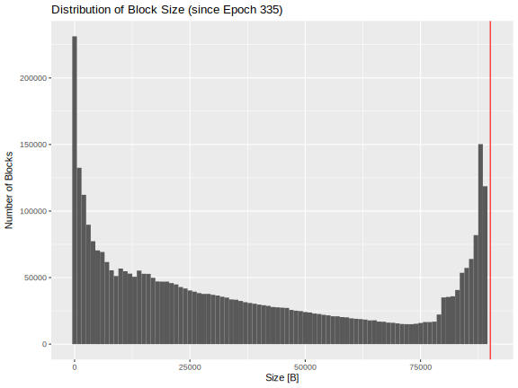
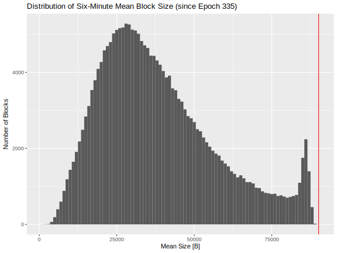
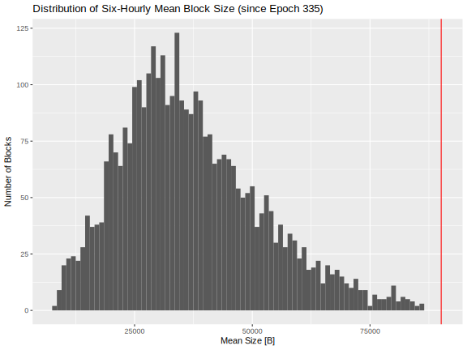
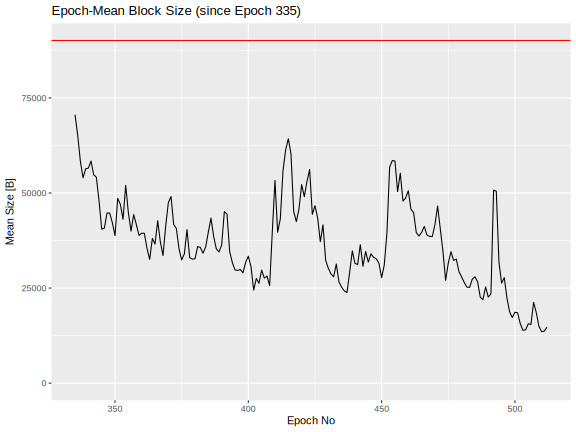
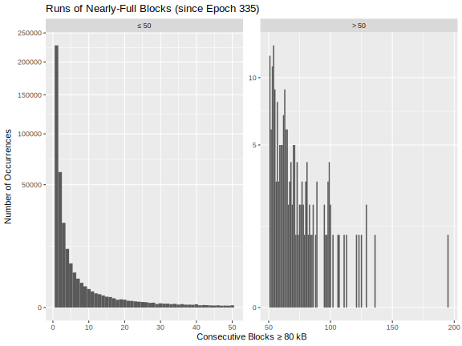
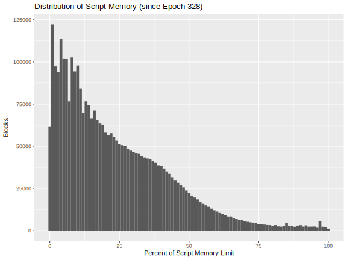
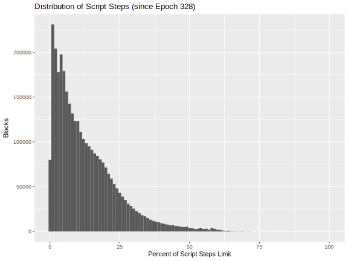
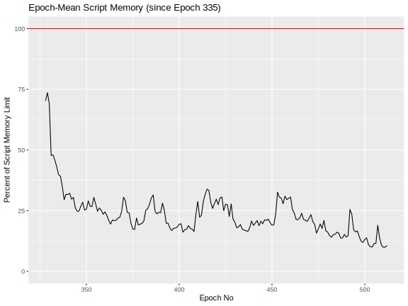
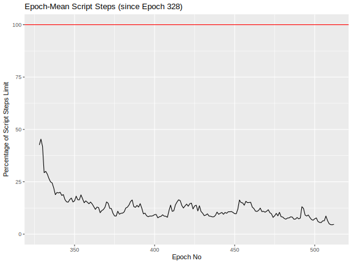
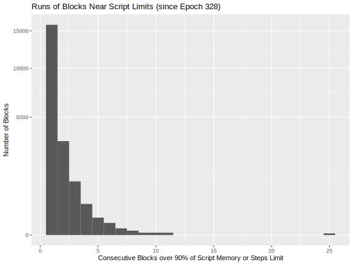

## Abstract

The Cardano mainnet occasionally experiences congestion where there are too many transactions in the memory pool to be included in the next block or in the next few blocks. Sometimes the block utilization peaks above 90% for an extended period of time. This not only impacts general user experience but it can also severely impact use cases such as airdrops, oracles, partner chains, DEXes, and Dapps. Emerging use cases and application deployments promise to accelerate the need for high throughput on Cardano. Applied research on several fronts is needed to propose and provide evidence for techniques that increase throughput measured in terms of transactions, transaction size, and script execution units. Such work should be based on a clear understanding of stakeholder requirements.

## Problem

The Cardano mainnet occasionally encounters periods of congestion, where the number of pending transactions in the memory pool exceeds the network's capacity to include them in the upcoming block or even the next several blocks. During these times, block utilization can consistently peak above 90%, sometimes for an extended duration. This high level of congestion not only degrades the general user experience by causing delays in transaction processing but also poses significant challenges for specific use cases. For instance, activities such as airdrops, which require efficient processing of large numbers of transactions, can be significantly hampered. Similarly, oracles that depend on timely data updates might face disruptions, while partner chains could experience slower cross-chain interactions. The impact is also felt by decentralized exchanges (DEXes) that need fast transaction confirmations to maintain liquidity and decentralized applications (DApps) whose performance and user interactions are affected.

Moreover, the ongoing evolution of the Cardano ecosystem is expected to amplify these demands. New and emerging use cases, along with an increasing number of application deployments, are likely to accelerate the need for higher throughput and improved scalability on the network. As the ecosystem expands to support more diverse and sophisticated use cases, such as real-time financial applications, gaming, or supply chain solutions, the pressure on Cardano's infrastructure to handle larger transaction volumes efficiently will continue to grow. Addressing these scaling challenges will be essential to ensure a seamless experience for users and to maintain Cardano’s competitive position in the rapidly evolving blockchain space.

Cardano's current throughput (measured both in data rate and available script execution units) is usually (but not universally) adequate for the current demand. There is also some protocol-parameter opportunity to increase the block sizes and script execution limits to meet emerging future demands for increased network capacity. There are however fundamental limits to how far the block size and the script execution budget can be pushed, while maintaining system security.

In Ouroboros Praos, maintaining the security of the system requires that blocks be distributed reliably across the network within a specified time frame, known as $\Delta$, which is set at five seconds on the Cardano mainnet. The process of relaying blocks is inherently sequential: blocks are transmitted from one block producer node to the next through a series of intermediary relay nodes. The time required for this process depends on the number of network hops between consecutive block producers and the network latency associated with each hop, considering that these hops often span the entire globe. Since this entire operation must consistently be completed within a five-second window, it imposes strict limitations on the maximum block size and the amount of time available for validating transactions and scripts.

To significantly scale beyond these limitations, fundamental changes to the overall blockchain algorithm are necessary. The potential for scaling is substantial, as the network and computational resources of most nodes are largely underutilized, remaining almost idle for much of the time. By adopting a different algorithm, these resources could be leveraged more effectively to increase the total bandwidth of the blockchain. Such improvements could enable the system to handle a higher volume of transactions while maintaining security and efficiency, addressing current limitations and unlocking new levels of scalability for the Cardano network. As the blockchain continues to evolve, optimizing the utilization of network and computational resources will be crucial to supporting future growth and expanding the capabilities of the platform.

Additionally, certain applications demand predictability or specific quality-of-service guarantees to function optimally. These applications might not necessarily need high levels of sustained throughput, but they are particularly sensitive to fluctuations in how quickly a transaction can be processed and included in a block after entering the memory pool. In such cases, even small delays or variances in the time it takes for a transaction to move from the memory pool into a confirmed block can significantly impact the performance, reliability, and user experience associated with these applications.

For example, in financial services, delays in processing transactions could disrupt trading activities, arbitrage opportunities, or other time-sensitive financial operations where precise timing is critical. Similarly, gaming applications or real-time auctions require transactions to be confirmed quickly to maintain a seamless user experience or to uphold the integrity of the bidding process. Predictable block times are also important for supply chain applications, where time-sensitive tracking and updates must be performed in real-time to reflect changes in inventory or shipments.

Quality-of-service guarantees can also be crucial for smart contracts that rely on external data feeds (oracles). These contracts might need a high degree of predictability in transaction processing to ensure that data updates happen within specific timeframes, thereby maintaining the accuracy of the contract's execution. The lack of consistency in transaction inclusion times could lead to issues such as missed deadlines, inconsistent states, or degraded performance for automated processes.

Thus, while the need for raw throughput is one aspect of blockchain performance, the ability to ensure a predictable and stable processing time for transactions is equally important for many applications. Addressing this challenge involves optimizing the underlying network protocol, enhancing transaction prioritization mechanisms, or implementing features that can deliver the necessary guarantees for latency-sensitive use cases. As more sophisticated applications continue to emerge on blockchain platforms, meeting these requirements will be essential to ensuring that the technology can support a diverse range of real-world use cases effectively.

#### Urgency 

While recent improvements like reference scripts have provided some relief, throughput limitations persist and will become increasingly critical as on-chain activity grows. This is evidenced by events like the launches of SundaeSwap and Snek.fun, where application-level queue times reached days and order processing was severely limited due to block capacity constraints. This hinders Cardano's ability to compete and attract wider adoption.

While theoretical maximum TPS provides an indication of potential capacity, real-time TPS offers a more accurate reflection of current network capabilities. Looking at other ecosystem, [the data](https://chainspect.app/dashboard) reveals that the maximum recorded TPS for Solana was 7229 TPS, for Base 93 TPS and for Arbitrum 944 TPS. These figures are relevant for attracting new projects and investments to an ecosystem. Throughput, finality times and gas fees are among the primary technical attributes that projects look for when choosing which web3 network to pick. 

| Blockchain | Max Recorded TPS |
|---|---|
| Cardano | 12 |
| Solana | 7229 |
| Algorand | 5716 |
| Hedera | 3302 |
| BNB | 1731 |
| Arbitrum | 944 |
| Base | 293 |
| Polygon | 429 |
| NEAR | 342 |
| Ethereum | 62 |

Source for table data: https://chainspect.app/dashboard

To achieve a sustainable and thriving ecosystem, Cardano needs to handle significantly higher transaction volumes at current or lower fee levels. This necessitates a proactive approach to scaling that goes beyond addressing sporadic spikes in activity and focuses on supporting the growth required for long-term network profitability without relying on inflation. This aligns with the vision of scaling Cardano to support nation-state level usage by 2030.

### Evidence

Historical data indicates that an appreciable fraction of the blocks on the Cardano mainnet have been nearly full and that periods of high utilization can last for minutes. In such situations it is likely that additional transactions queue up in the nodes' memory pool, awaiting inclusion in a future block. Needless to say, block congestion correlates directly with transaction throughput. With the current average block-production rate of one per twenty seconds, that queuing can translate into unacceptably long waits for a transaction to be included in a block and receive its first confirmation. Even without the additional demand anticipated when new projects come online in the future, there sometimes are periods where user experience is degraded by limited throughput.

The plots below illustrate the significant frequency of blocks that are nearly full. (The maximum block size since Epoch 335 has been 90,112 bytes.) The six-minute average block size also indicates the presence of full blocks, but the block-size limit does not appear significant in six-hour average. On the epoch-average level there are periodic peaks in block size. Note that when interpreting these diagrams, it is important to consider that transactions will not exactly fill a block. Also, some blocks hit their limit on Plutus execution cost and memory before well below the maximum-size limit: they are, nevertheless, fully utilized.

|                                                            |                                                            |
| ---------------------------------------------------------- | ---------------------------------------------------------- |
|  |  |
|   |       |

Of particular interest is the following plot that shows the distribution of the length of runs of consecutive blocks that are all larger than 80 kB. Occasionally, there are stretches of more than ten blocks being almost full, and in one case there was a series of 194 almost-full blocks. These long periods of nearly full blocks may be correlated with long waits between the time a user submits a transaction to the memory pool and the time it appears in a block.

The following plots illustrate the situation for memory and execution units relative to the maximum allowed for a block. This confirms the rule of thumb that Plutus memory is a tighter constraint than Plutus steps. A not-insignificant number of blocks are close to or at the Plutus execution limits.

|                                                               |                                                              |
| ------------------------------------------------------------- | ------------------------------------------------------------ |
|           |        |
|  |  |

More concerning are the situations shown below where consecutive blocks are near or at the Plutus execution budget. In one case twenty-five consecutive blocks were near that limit.

## Use cases

Even with the existing rate of transactions on the Cardano mainnet, there are periods where throughput-limits delay the inclusion of transactions in blocks and hamper settlement. Growing and emerging use cases will exacerbate the situation.

- Time-sensitive applications like DEXes and Dapps require prompt inclusion of their transactions on the blockchain, and any delay also translates to a delay in settlement. See also [CPS-17 Faster Settlement](https://github.com/cardano-foundation/CIPs/pull/922).
- Newly released high-profile Cardano applications tend to create congestion as many users experiment and transact with the new capabilities shortly after they become available. Greater transaction throughput will improve the initial experience of new users of those applications, and some of those new users may be new to Cardano. *First impressions are important.*
- Partner chains, bridges, and oracles rely on quality of service guarantees that support a regular and predictable rhythm of their transactions being included in blocks. Delays in such transactions' inclusion in blocks can cascade to Dapps that interact with such services. Delays on oracles result in stale data being provided to Dapps or in Dapps having to wait for the updated oracle state to be posted. Delays on partner chains or bridges result in bottlenecks in the transfer of funds or information between chains.
- Transaction "scoopers" and "batchifiers" work most efficiently when high throughput is possible.
- Air drops are well known to have caused spikes in network load and block utilization.
- Any of the above use cases that also involve executing Plutus scripts add an additional requirement of execution-unit throughput in addition to transaction-size throughput. Applications that do complex validation encounter this extra dimension of resource usage.

The advent of the Cardano-Midnight ZK bridge and the prospect of a Cardano-Bitcoin BOS Grail bridge promise to significantly increase the transaction load on the Cardano mainnet.

## Goals

1. Develop precise requirements for transaction and script-execution throughput for Cardano mainnet, categorized by use case and metrics for quality of service.
2. Propose safe increases in the maximum block size and Plutus execution limits for blocks.
3. Increase transaction throughput in terms of number, size, and execution units and provide evidence that the proposed techniques meet stakeholder requirements.
4. Investigate and semi-quantitatively compare throughput techniques such as input endorsers, zero-knowledge technologies, transaction prioritization, offloading work (Mithril, partner chains, etc.), and protocol-parameter changes.
5. Propose methods for guaranteeing specific levels of throughput, including priority tiers and reservations.

In addition to the goals above, it is advisable to avoid the following:

1. Avoid approaches with long development timelines or high opportunity costs.
2. Do not weaken Ouroboros security or substantially enlarge its attack surface.
3. Minimize changes that increase the resource usages of Cardano nodes or the cost of operating them.
4. Guard against protocol alterations that adversely impact other scaling metrics such as settlement time.

## Open questions

- How much larger can existing Ouroboros Praos blocks be made without affecting Cardano mainnet safety or performance?
- How much can the block-production rate (the active-slot coefficient) be increased without affecting Cardano mainnet safety or performance?
- What fraction of theoretical global network bandwidth can techniques like input endorsers efficiently utilize?
- Are zero-knowledge techniques a viable option for increasing transaction throughput?
- How much will implementing greater transaction throughput impact the hardware requirements for and the cost of operating a Cardano stakepool?
- Will changes to the memory pool be necessary to support transaction throughput?
- Will increasing throughput adversely affect other performance metrics such as settlement time?
- Will higher throughput open Cardano to a broader spectrum of denial-of-service and other attacks?
- To what extent is the Plutus execution budget for blocks a more limiting constraint than the size budget for blocks? What statistics support this? What types of applications hit this constraint, and how often?
- Can high-throughput solutions simplify the operation of transactions scoopers and batchifiers?
- Does [Ouroboros Leios](https://iohk.io/en/research/library/papers/high-throughput-blockchain-consensus-under-realistic-network-assumptions/) satisfy stakeholder requirements for greater throughput? Would simpler solutions be adequate in the short term?
- How much can pay-for-priority schemes alleviation throughput concerns for high-value applications that are particularly sensitive to it?

## Copyright

This CIP is licensed under [Apache-2.0](http://www.apache.org/licenses/LICENSE-2.0).
