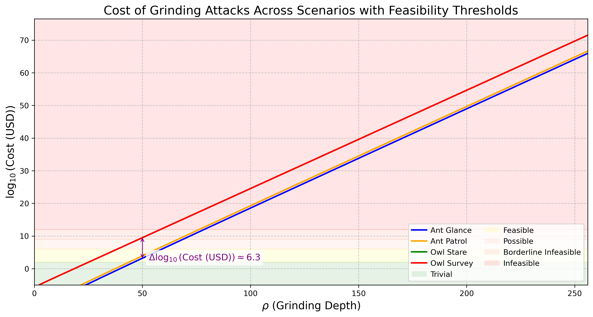

## Abstract

The **Ouroboros protocol** ⚙️, underpinning Cardano’s consensus mechanism, relies on a modular design where the **Randomness Generation Sub-Protocol** is pivotal in addressing the *Coin-Flipping Problem*—the generation of **fair**, **unbiased**, and **unpredictable** randomness in a distributed system. 

This CPS formally documents this challenge, aiming to coordinate community-driven efforts through **Cardano Improvement Proposals (CIPs)** 📝 to mitigate or resolve it within Ouroboros. Randomness is foundational to sub-protocols like **leader election**, where vulnerabilities could compromise Cardano’s **security** 🔒, **fairness** ⚖️, and **decentralization** 🌐. 

As the consensus protocol is a core component of any blockchain, and the **Randomness Sub-Protocol** is central to Ouroboros, this problem represents a *core of the core* issue for Cardano, with profound impacts on its integrity.

However, this issue is not exclusive to Cardano; it is a pervasive concern across **Proof-of-Stake (PoS)** blockchains, including Ethereum, Solana, Algorand, and Tezos, where randomness underpins validator selection and consensus integrity. 

This CPS examines Ouroboros’ approach, and poses critical questions about **vulnerability**, **detection**, and **deterrence**. Rather than prescribing solutions, it invites the Cardano community to assess and address this shared challenge, fostering research and innovation to enhance Ouroboros’ resilience within the broader PoS landscape 🌍.

## Problem

This **Cardano Problem Statement (CPS)** 📜 builds upon the foundational work of the [**Cardano Problem Definition (CPD): Ouroboros Randomness Generation Sub-Protocol – The Coin-Flipping Problem**](./CPD/README.md) 📑, which provides an in-depth technical analysis of the issue at hand. While the **CPD** retains the full depth of technical material—including detailed modeling, cost definitions, and adversarial analysis—the **CPS** is structured for formal submission within the **CIP process** ✍️, prioritizing accessibility and alignment with community-driven solution development. As such, the technical details are preserved in the **CPD** as an appendix, while this **CPS** offers a concise, high-level summary of the problem, connecting it to broader concerns within Cardano and the blockchain community.

### Summary of Findings

This **[**CPD**](./CPD/README.md)** examines the *Randomness Generation Sub-Protocol* within the *Ouroboros Praos* ⚙️, highlighting its vulnerabilities and their implications for *Cardano’s* **security** 🔒. Key insights include:

- **Randomness Vulnerability**: *Ouroboros Praos* employs **VRFs** for randomness generation, but this approach is susceptible to *grinding attacks*, where adversaries manipulate outcomes to influence **leader election**, threatening Cardano’s **fairness** ⚖️ and **integrity**.
- **Attack Likelihood**: Attacks become significantly more feasible when an adversary controls **over 20% of the total stake** (approximately **4.36 billion ADA**, as of March 2025), while smaller stakes (e.g., **5%**) make such attempts highly unlikely over extended periods.
- **Economic Barrier**: Gaining enough stake to execute an attack requires a **substantial investment** 💰—billions of USD for a **20% share**—posing a financial risk, as a successful attack could devalue the asset and undermine network trust.
- **Computational Feasibility**: The feasibility of attacks varies widely based on the computational resources an adversary can deploy, becoming progressively more accessible as stake accumulates:
  - Small-scale attacks, costing as little as ~**$56**, are easily achievable with minimal resources, such as a standard computer, making them a low-barrier threat that even individual actors could attempt.
  - Large-scale attacks, costing up to ~**$3.1 billion**, require extensive computational infrastructure, such as large data centers with millions of CPUs, placing them in a range from feasible for well-funded entities (e.g., corporations or nation-states) to nearly impractical for most adversaries due to the immense resource demands.
  - The intensity of these attacks scales with stake: the more stake an adversary holds, the greater their influence over **leader election**, amplifying their ability to manipulate randomness. In a simplistic view, this can be likened to manipulating a $256$-bits nonce—a value $\rho$ ranging from $0$ to $256$— where higher stake progressively grants more control, potentially allowing full manipulation of the nonce at the upper limit.
  - The wide cost disparity reflects how the complexity of the attack—such as the scope of the targeted time window and the depth of evaluation—drastically increases resource needs, acting as a natural deterrent for more ambitious manipulations.

To illustrate the **Computational Feasibility**, the graph below (sourced from the **CPD**, Section [**3. The Cost of Grinding: Adversarial Effort and Feasibility**](./CPD/README.md#3-the-cost-of-grinding-adversarial-effort-and-feasibility)) maps attack feasibility across four scenarios—**Ant Glance**, **Ant Patrol**, **Owl Stare**, and **Owl Survey**—based on the nonce value $\rho$ (0 to 256 bits). Each scenario reflects different attack complexities, with feasibility shifting as computational and economic demands grow:

The table below delineates the **$\rho$ values** at which each scenario transitions across feasibility categories, illustrating the computational and economic thresholds:

| **Feasibility Category**                  | **🔵 Ant Glance**   | **🟠 Ant Patrol**   | **🟢 Owl Stare**   | **🔴 Owl Survey**   |
|--------------------------------------------|---------------------|---------------------|--------------------|--------------------|
| **🟢 🌱 Trivial for Any Adversary**        | $0 \to 53.6$        | $0 \to 32.9$        | $0 \to 31.6$       | $0 \to 31.1$       |
| **🟡 💰 Feasible with Standard Resources** | $53.6 \to 60$     | $32.9 \to 39.5$     | $31.6 \to 38.3$    | $31.1 \to 37.8$    |
| **🟠 🏭 Large-Scale Infrastructure Required** | $60 \to 69.7$  | $39.5 \to 49.5$     | $38.2 \to 48.2$    | $37.8 \to 47.7$    |
| **🔴 🚫 Borderline Infeasible**            | $69.7 \to 79.4$     | $49.5 \to 59.5$     | $48.2 \to 58.2$    | $47.7 \to 57.7$    |
| **🔴 🚫 Infeasible**                      | $79.4 \to 256$      | $59.5 \to 256$      | $58.2 \to 256$     | $57.7 \to 256$     |

**Context**: The scenarios represent increasing attack sophistication (e.g., *Ant Glance* is a quick, low-effort attack; *Owl Survey* is a comprehensive, resource-intensive one). As $\rho$ increases, so does the difficulty, shifting feasibility from trivial (e.g., a lone actor with a laptop) to infeasible (e.g., requiring nation-state-level resources).

These findings underscore critical risks to Cardano’s consensus mechanism, urging the **Cardano community** 🌐 to address them through potential strategies like improved detection, stake pool diversity, or protocol enhancements. For detailed technical analysis, stakeholders are encouraged to consult the **CPD**.

## Use Cases

The *Coin-Flipping Problem* 🎲 within the **Ouroboros protocol** ⚙️ represents a **core of the core issue** for Cardano. The consensus mechanism is a fundamental component of any blockchain, and the *Randomness Generation Sub-Protocol* is integral to Ouroboros’ operation. Consequently, the consequences of randomness manipulation are **diverse and far-reaching** 🌍, impacting Cardano’s **security** 🔒, **fairness** ⚖️, and **decentralization** 🌐 in numerous ways. Given this breadth, providing an exhaustive list of use cases is challenging. However, a significant impact is evident: randomness manipulation enables an adversary to **group the intervals** during which they are selected as a **slot leader**, concentrating their influence over block production.

This ability to cluster slot leadership **amplifies classical blockchain attacks** 💥, exacerbating their impact. For example:

- In a **Private Forking Attack** 🍴, an adversary withholds blocks to create a secret fork, later revealing it to outpace the honest chain. Clustering slot leadership enhances their ability to extend this fork, increasing the attack’s success rate.
- Similarly, this manipulation intensifies other attacks, including:
  - **Selfish Mining** 💰: Withholding blocks to gain disproportionate rewards.
  - **Double-Spending Attacks** 💸: Reversing transactions for financial gain.
  - **Censorship Attacks** 🚫: Excluding specific transactions to suppress competition.

As detailed in the [**CPD**](./CPD/README.md#213-potential-outcomes-of-grinding-attacks), adversaries could also exploit randomness to enable additional attack vectors, such as:

- **Economic Exploitation** : Prioritizing transactions for higher fees.
- **Minority Stake Exploitation** 📊: Amplifying a small stake’s influence.
- **Settlement Delays** ⏳: Undermining trust in confirmation times.

These scenarios **underscore the critical need** ❗ to address randomness manipulation to safeguard Cardano’s integrity.

## Goals
 
The goal is to **mitigate or completely eliminate grinding attacks** on the protocol by introducing **targeted protocol enhancements** to address this issue. Two approaches are actively being explored to address the **Randomness Manipulation Problem**:  

- **Complete Elimination of Grinding Attacks** – Ongoing research aims to make the protocol fully resistant to such attacks. One notable example is *[Efficient Random Beacons with Adaptive Security for Ungrindable Blockchains](https://eprint.iacr.org/2021/1698.pdf).*  
- **Partial Mitigation by Increasing Attack Complexity** – While full protection may not yet be feasible, making such attacks **computationally and economically prohibitive** can significantly reduce their viability. This approach is the basis of **Ouroboros Phalanx** (Coming soon as a CIP)].   

However, while **fully protecting the protocol from Randomness Manipulation attacks** may not yet be feasible, it is crucial to advance in the following areas:  

- **Risk Quantification** : Assessing the **profitability and feasibility of attacks**, along with **refining risk assessment models**, will provide deeper insights into vulnerabilities and their potential impact on the protocol's security and stability.  

- **Transparency on Manipulations** : **Enhancing detection mechanisms**, such as **self-mixing analysis** and **forking manipulation detection**, can help identify potential exploits and assess ongoing threats in real time.  

- **Game Theory & Economic Disincentives** –   
  **Promoting stake operator diversity** and **strengthening decentralization incentives** will reduce the economic viability of manipulation, fostering a more **resilient and distributed** stake pool ecosystem.  

We strongly encourage the community to actively engage in addressing this challenge by contributing research, proposing solutions, and participating in discussions. Collaborative efforts will be crucial in refining detection mechanisms, strengthening protocol resilience, and ensuring the long-term security and fairness of Ouroboros.

## Open Questions

The *Coin-Flipping Problem* 🎲 within the **Ouroboros protocol** ⚙️ poses critical uncertainties that challenge Cardano’s **security** 🔒, **fairness** ⚖️, and **decentralization** 🌐. These open questions, rooted in the [**CPD**](./CPD/README.md) 📑 analysis, call for exploration by the **Cardano community** 🌍 to strengthen the protocol’s resilience:

- **Is randomness manipulation currently occurring, and how detectable is it?** 🕵️‍♂️  
  Are grinding attacks already subtly affecting Cardano undetected? What tools, metrics, or on-chain signals could reveal adversarial manipulation in real-time, given the protocol’s design?

- **How will Peras influence grinding attack capabilities?** 🔄  
  With Peras enhancing Ouroboros’ settlement times, does it increase, decrease, or shift the opportunities for adversaries to exploit randomness through grinding attacks?

- **Are current economic deterrents effectively discouraging randomness manipulation?** 💰  
  Does the high cost of acquiring significant stake (e.g., ~4.36 billion ADA for 20%) adequately dissuade adversaries, or do potential rewards (e.g., staking profits, governance power) offset this barrier? Can we do better ?

- **How does preparing for the worst-case grinding attack scenario affect the security parameter $k$?** 🛡️  
  If we adjust Ouroboros to handle extreme grinding attacks, what impact would this have on the **security parameter $k$**, which governs chain stability and finality ? What benefits could we gain by reducing $k$?

- **Who benefits most from executing a grinding attack?** 🎯  
  Which actors—malicious stakeholders, competing blockchains, or economic opportunists—stand to gain the most from manipulating randomness, and how might their motives shape attack strategies?

- **Can grinding attacks be fully eliminated from Ouroboros?** 🚫  
  Is it technically feasible to design a randomness mechanism that completely removes the possibility of grinding attacks, or are trade-offs (e.g., scalability, complexity) inevitable?

- **Can we increase the cost of grinding attacks to deter adversaries?** 💸  
  What protocol modifications—such as higher computational demands or stake penalties—could make grinding attacks prohibitively expensive, and how would they balance with Cardano’s usability?

## Copyright

This CIP is licensed under [Apache-2.0](http://www.apache.org/licenses/LICENSE-2.0).

