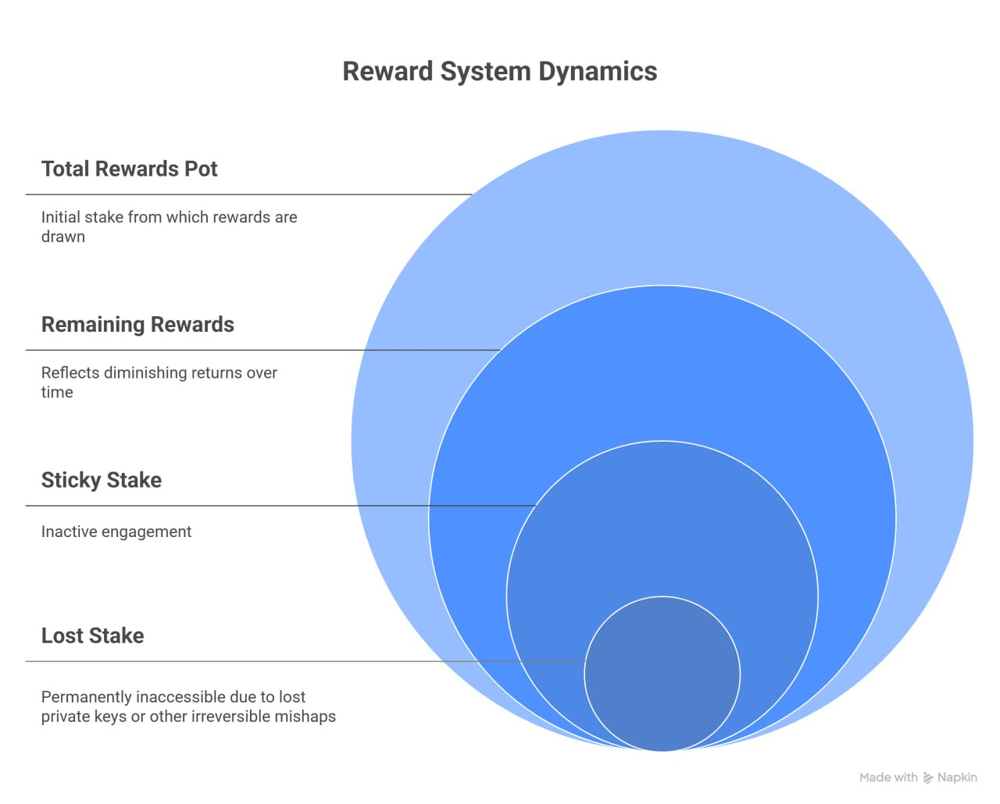
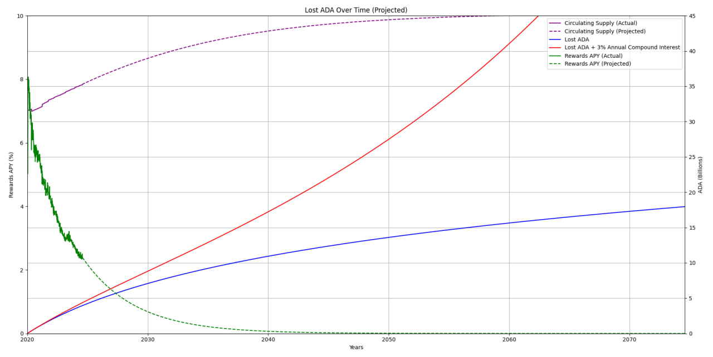

## Abstract

In everyday Cardano discussions the umbrella term “Sticky Stake” is used for any stake that stubbornly remains delegated, regardless of whether its owner is still around. This Cardano Problem Statement (CPS) zooms in on the most critical slice of that phenomenon that we dubbed “Lost Stake”: Ada that (a) remains delegated to a stake pool or dRep, yet (b) can never again be moved because the controlling private keys are irretrievably lost (e.g., seed-phrase loss, death of the sole key holder, catastrophic wallet failure).

This CPS formalises the Lost Stake problem and quantifies its systemic impact: dilution of the reward pot available to active participants, distortion of pool-selection incentives, and ossification of governance power. Estimates suggest that as much as 900k ADA per epoch (67M ADA each year) may already be draining into permanently unreachable wallets. Left unchecked, compounding Lost Stake will siphon billions of ADA in rewards and an ever-growing share of voting weight into wallets that nobody controls, making future remediation far costlier and more contentious. 

## Problem

Lost Stake continues to earn and compound staking rewards and carries voting weight despite being permanently inaccessible.  Even though the funds are gone for good, the ledger continues to treat them as live stake. They keep:

• earning a proportional share of every epoch’s rewards,  
• compounding themselves through those rewards, and  
• exerting voting weight whenever their chosen dRep participates.  

“Lost delegation” may be a more technically correct phrase since it is the delegation certificate that survives, but we will use the more familiar term "Lost Stake" to stay consistent with community vocabulary around Sticky Stake.

**Figure 1** (below) visualises these relationships with overlapping circles:

> **Figure 1:** Circles depict the Total Rewards Pot and its diminishing share with some rewards also flowing to Sticky Stake and Lost Stake addresses every epoch.

Cardano already distributes a significant amount of ADA every epoch in staking rewards to addresses that are permanently inaccessible. This occurs when ADA is lost, such as when a holder loses their seed phrase or passes away without sharing their keys, rendering the funds permanently unreachable. In most other cryptocurrencies, lost coins simply exit circulation. For example, it is estimated that around 20% of all Bitcoin supply is lost forever [[investopedia.com](https://www.investopedia.com/tech/how-much-bitcoin-has-been-lost/)], with more granular analyses by Ledger Academy and Chainalysis both converging on roughly 4% of all Bitcoin being lost each year [[ledger.com](https://www.ledger.com/academy/topics/economics-and-regulation/how-many-bitcoin-are-lost-ledger); [chainalysis.com](https://www.chainalysis.com/blog/money-supply/)].

Cardano’s design, however, allows lost ADA to remain economically “active” if it was delegated prior to loss. Once delegated, a stake key remains registered and tied to a stake pool (for block production) and potentially to a dRep (for voting) until it is actively changed or deregistered. A user who loses access cannot undelegate or spend those funds, meaning the ADA continues to stay delegated indefinitely.

The lost-stake problem is the accumulation of this unreachable-yet-delegated ADA within the Cardano ecosystem. Such lost stake still contributes to stake-pool sizes and earns staking rewards every epoch, even though the rewards accumulate in an address that nobody controls. For as long as the chosen stake pool produces staking rewards, the lost ADA compounds. Rewards paid to these addresses increase their delegated stake, which in turn earns more rewards, and so on. Similarly, if the lost ADA was delegated to a governance representative (dRep) for Voltaire-era on-chain voting, that voting power remains with the dRep permanently (or until the dRep retires or is marked inactive). The original owner is no longer present to adjust their delegation in response to changing conditions. This creates a class of delegation that cannot be reallocated or corrected.

> **Note:** The exact amount of ADA that is lost but still delegated is difficult to quantify. We use a *conservative* working assumption of ~1.5% of the circulating ADA being lost per year, which is less than half the 4% per-year loss rate measured for Bitcoin by Ledger and Chainalysis.

### Detrimental effects

Lost stake and lost ADA have several detrimental effects on the Cardano network:

#### Immediate impact on Rewards  
Conservative chain-wide modelling indicates that as much as 900k ADA per epoch (~67M ADA per year) is already being paid to permanently lost addresses.  Because those rewards also compound, the gap widens every epoch unless corrective measures are adopted.

<em>How this rough estimate was derived</em>

1. Estimated permanently lost ADA (using a 1.5%/yr loss rate and 3% compound since 2020) → **≈5B ADA**  
2. Assuming 50% of that is still staked → **≈2.5B ADA**  
3. Total ADA currently staked → **≈21B ADA**  
4. Lost addresses' share of total stake → **2.5B / 21B ≈ 12%**  
5. Net rewards pot after treasury cut, pool performance, unmet pledge, and unstaked proportion removed → **≈7.5M ADA/epoch**  
6. Rewards paid to lost addresses → **7.5M × 12% ≈ 0.9M ADA/epoch**

#### Perpetual reward dilution
Each epoch, a portion of the total ADA rewards is distributed to all staked ADA, whether active or lost. Rewards sent to addresses with lost ADA are effectively removed from circulation forever, resulting in active delegators and stake-pool operators (SPOs) receiving a smaller share than they would if that lost stake did not exist. In effect, active participants are subsidizing the lost stake. Over time, the compounding of these rewards to lost ADA can significantly dilute the reward pool available to real users and operators.

#### Reward increases worsen the problem
Any attempt to increase staking rewards—such as raising the reward rate, boosting incentives for SPOs or delegators, providing additional yield from Partner Chains, or otherwise enlarging the total rewards pot—will also proportionally increase the amount of rewards paid to lost ADA. As a result, well-intentioned efforts to improve returns for active participants can actually make the lost stake problem worse, since a fixed percentage of all new rewards will continue to be siphoned off to permanently unreachable addresses.

#### Skewed stake-pool incentives
Lost ADA that remains delegated contributes to a stake pool’s apparent stake and saturation level. Pools with large amounts of lost stake may continue to produce blocks and earn rewards from that stake without any risk of it ever being withdrawn. This can distort competitive incentives. For example, a pool might appear reliably saturated or have high loyalty even if some of its delegation is simply abandoned funds. In extreme cases, if a pool amasses substantial lost ADA, it could remain highly ranked or saturated based on stake that no active delegator can respond to (e.g., they cannot move that stake if the pool underperforms). This reduces the effectiveness of normal market dynamics in the staking ecosystem and can harm network security.

#### Governance participation anomalies
In Cardano’s governance model (e.g., under [CIP-1694](https://cips.cardano.org/cips/cip1694/)), voting power is tied to stake. Lost ADA that was delegated to a dRep continues to bolster that dRep’s voting power indefinitely. This means decisions may be swayed by stake with no active owner, potentially undermining the representativeness of votes. The governance framework acknowledges this risk—for instance, CIP-1694 introduces an inactivity mechanism so that dReps who stop voting are marked inactive. However, if lost ADA remains delegated to an **ACTIVE** dRep, it will keep influencing outcomes with no way for the original holder (or anyone) to ever retract that delegation.

#### Long-term economic inefficiencies
As the proportion of lost stake grows, Cardano’s monetary and incentive system will face sustainability issues. Eventually, block rewards will rely more on transaction fees (as treasury reserves deplete). If a significant fraction of stake is lost ADA, then a matching fraction of all transaction fees (and any remaining rewards) gets continually paid to unreachable addresses. This reduces fee efficiency and causes the network to effectively waste a chunk of fees on lost stakeholders, making less available to reward the operators and holders who actually secure and use the system. In a scenario where, say, 30% of all stake is lost stake decades from now, that 30% of fees and rewards is perpetually locked up, potentially requiring higher fees or other adjustments to adequately incentivize active validators.

It is important to formally document the lost-stake problem now, even before it becomes visibly acute, because the Cardano community needs a clear understanding of the issue’s scope and implications.

### Why the Protocol Behaves This Way

Cardano’s ledger does not distinguish between active and inactive stake. All ADA is treated equally under the consensus rules. This design choice (common to many PoS systems) avoids complexity and respects the principle that tokens are the bearer’s property indefinitely. However, the unintended consequence is that there is no built-in mechanism to recognize or mitigate lost keys. From a protocol perspective, lost ADA is indistinguishable from a perfectly content long-term holder. Any potential solution must therefore carefully balance improving incentives with respecting property rights and avoiding false positives (e.g., not seizing or disabling legitimately held ADA).

### Current Mitigations and Their Limits

As noted earlier, governance proposals like [CIP-1694](https://cips.cardano.org/cips/cip1694/) include measures to limit the impact of inactive delegated stake on voting outcomes. These measures (such as marking inactive dReps) help prevent governance paralysis, but do not address the underlying issue of lost ADA still existing and, in some cases, continuing to accumulate rewards. However, when a stake pool with lost stake retires or shuts down, the lost ADA delegated to it is actually much less of a problem. That ADA effectively becomes undelegated and removed from circulation, meaning it no longer receives staking rewards or participates in governance. While the system currently has no direct way to reclaim or reassign lost ADA, the most persistent issues arise when lost stake remains delegated to active pools or dReps. Indirect mitigations only address symptoms (like governance quorum) rather than the root cause.

### Why Ignoring the Problem Is Risky

Some might argue that lost coins simply increase the value of the remaining ones (through scarcity) or that the effect is negligible for now. However, as the projections show, the effect is not static. It grows over time and can reach levels that materially impact network operation. Unlike in Bitcoin (where lost coins arguably don’t harm network security or functionality [[investopedia.com](https://www.investopedia.com/tech/how-much-bitcoin-has-been-lost/)]), in Cardano most lost coins still participate in consensus. Therefore, ignoring lost stake and lost ADA means accepting a slow-growing skew in the system that could ultimately undermine user trust and network performance. Early recognition allows for carefully researched, minimally disruptive solutions before the problem becomes too large and contentious to fix.

## Use Cases

The motivation for addressing lost stake and lost ADA is grounded in preserving fairness, efficiency, and the long-term health of Cardano’s proof-of-stake and governance mechanisms. At present, the problem may seem minor or largely theoretical, as lost ADA is not immediately visible on a small scale. But the impact compounds over time, and proactive understanding is crucial.

**Figure 2** below illustrates a hypothetical projection of the growth of lost ADA if left unchecked:

> **Figure 2:** Hypothetical exponential growth of lost ADA over time, based on an assumed *conservative* 1.5% of ADA being lost per year (versus the 4% annual loss observed in Bitcoin), a 70% ratio of staked ADA, and a 3% annual staking-reward compounding. The blue curve (Lost ADA) shows the cumulative lost principal, while the red curve (Lost ADA + compounded rewards) shows how those lost funds are expected to grow with staking rewards, eventually representing a large fraction of total supply over decades.

This scenario highlights the long-term risk of inaction. Even a modest annual loss rate combined with ongoing rewards can, in theory, lead to exponential increases in the amount of ADA effectively trapped as lost stake. Over decades, lost ADA (plus the rewards it continually accrues) could constitute an ever-growing share of the total circulating supply, potentially tens of billions of ADA by the 2050s–2070s in this model. However, it is important to note that the likelihood of this scenario fully playing out is low as the proportion of rewards and transaction fees paid to lost ADA grows, the situation would become increasingly unacceptable to active users. At some point, most users would likely abandon the ecosystem rather than continue subsidizing unreachable addresses, making such runaway growth of lost stake unsustainable in practice. Nevertheless, this projection magnifies all the aforementioned issues: reward dilution becomes more severe, stake pools and governance are heavily influenced by non-recoverable funds, and the active Cardano community would be supporting an increasing “dead weight” in the ecosystem until a breaking point is reached.

## Goals

- **Reward Fairness:** Cardano’s reward mechanism is zero-sum—if a portion goes to inaccessible wallets, everyone else simply gets less. Active delegators and SPOs should not have their rewards continuously diminished by wallets that no one can ever use. Over long periods, this will erode the attractiveness of staking for newcomers (who would see lower returns because part of the yield is effectively burned by lost stake and lost ADA).

- **Governance Legitimacy:** For on-chain governance to be legitimate and effective, voting power should reflect real, engaged stakeholders. If a growing percentage of voting power is tied up in lost ADA (delegated to dReps or otherwise), it calls into question how representative the outcomes are. In the worst case, crucial governance actions might face quorum issues or skewed results due to a bloc of inactive stake that cannot be mobilized or removed. The community will become disenfranchised if “votes” are attributed to lost ADA swing decisions.

- **Decentralization and Dynamism:** A healthy PoS ecosystem relies on the ability of stakeholders to move, re-delegate, or withdraw their stake in response to performance and incentives. Lost stake undermines this dynamism. It introduces static pools of stake that remain in place regardless of performance, potentially propping up some pools or dReps indefinitely. This will slow down the natural reallocation of stake that helps decentralization (e.g., shifting away from an underperforming or oversaturated pool) because some portion of stake simply cannot move. In extreme scenarios, network adaptability and resilience will likely suffer.

- **Economic Sustainability:** In the long term, as block-reward inflation tapers off, Cardano’s security will hinge on transaction fees and community participation. If a significant chunk of ADA is effectively out of economic circulation (yet still “consuming” rewards/fees), it means the active economy has to carry that burden. The security budget (total incentives for validators) would be partially drained to non-participants. This inefficiency will necessitate higher fees or protocol changes to compensate, which is undesirable for growth. In short, allowing lost stake and lost ADA to grow unchecked may undermine the sustainability of the network’s incentive model.

## Open Questions 
- How can the protocol reliably identify truly lost credentials?
- Could an inactivity period (epochs/years) be acceptable before stake is considered “lost”?
- Which economic / social mechanisms can prevent reward dilution without violating property rights?

## References

- **Cardano Improvement Proposal 1694 (CIP-1694):** On-Chain Decentralized Governance
  [cips.cardano.org](https://cips.cardano.org/cips/cip1694/)

- **Ledger Academy – “How Many Bitcoin Are Lost?”** 
  [ledger.com](https://www.ledger.com/academy/topics/economics-and-regulation/how-many-bitcoin-are-lost-ledger)

- **Chainalysis – “Money Supply: What Does It Mean for Crypto?”** 
  [chainalysis.com](https://www.chainalysis.com/blog/money-supply/)

- **Wall Street Journal Analysis of Lost Bitcoin:** 
  [[investopedia.com](https://www.investopedia.com/tech/how-much-bitcoin-has-been-lost/)]

## Acknowledgements

  
<strong>Community SPO Incentives Working Group</strong>

This CPS could not have been created without the support, assistance, and input of all participants in the community-led SPO Incentives Working Group.

 * Stef M [RABIT]
 * Rich Manderino [ECP] 
 * Wayne Cataldo [OTG]
 * Homer [AAA]
 * Chad [BBHMM]
 * Mark H [UPSTR]
 * Carlos Lopez de Lara [Input|Output]
 * Pedro Lucas
 * Seomon
 * OYSTR Pool

## Copyright

This CPS is licensed under [CC-BY-4.0](https://creativecommons.org/licenses/by/4.0/legalcode).
