## Abstract

<!-- A short (\~200 word) description of the target goals and the technical obstacles to those goals. -->

A well-designed consensus protocol is inherently modular, consisting of multiple sub-protocols that collectively ensure security, efficiency, and decentralization. Among these, the Randomness Generation Sub-Protocol is crucial in addressing the Coin-Flipping Problem — the challenge of generating fair, unbiased, and unpredictable randomness in a distributed setting.

The objective of this CPS is to formally document the Coin-Flipping Problem and coordinate the development of CIPs aimed at mitigating and, if possible, fully resolving this challenge within the Ouroboros protocol.

This problem is particularly critical in **Ouroboros**, where randomness serves as a foundation for key sub-protocols such as **leader election**. Ensuring a **robust and tamper-resistant** randomness mechanism is essential to preserving the **security, fairness, and integrity** of the protocol.

To uphold Cardano’s **decentralized ethos**, the community must proactively mitigate these risks and **reduce the feasibility of biasing strategies**. Addressing this challenge requires answering key questions:

- **Is Cardano currently being manipulated?**  
  Strengthening **detection mechanisms**, such as **self-mixing analysis** and **forking manipulation detection**, can help **identify potential exploits** and assess ongoing threats.

- **Are we sufficiently disincentivizing randomness manipulation?**  
  Enhancing **stake operator diversity** and reinforcing incentives for **decentralization** will make manipulation **economically unviable**, fostering a **resilient and distributed** stake pool ecosystem.

- **How vulnerable is Cardano to these attacks, and what are the potential consequences?**  
  Improving **risk quantification** will provide deeper insight into **attack feasibility, vulnerabilities, and potential security gaps** within the protocol.

Beyond **detection, assessment, and quantification**, **protocol-level enhancements** must be explored to directly **reduce manipulation opportunities** and strengthen incentives for honest participation.

Finally, it is essential to recognize that **adversarial capabilities continually evolve**, making this an **ongoing challenge** that demands sustained **research, adaptation, and community-driven innovation**.

## Table of Contents

- [**Problem**](#problem)
  - [**1. Preliminaries**](#1-preliminaries)
    - [1.1 Fundamental Properties](#11-fundamental-properties)
      + [1.1.1 Transaction Ledger Properties](#111-transaction-ledger-properties)
        * [1.1.1.1 Persistence with the security parameter k](#1111-persistence-with-the-security-parameter--textk-in-mathbbn-)
        * [1.1.1.2 Liveness with the transaction confirmation time parameter u](#1112-liveness-with-the-transaction-confirmation-time-parameter--textu-in-mathbbn-)
      + [1.1.2 Chain Properties](#112-chain-properties)
        * [1.1.2.1 Common Prefix (CP)](#1121-common-prefix-cp)
        * [1.1.2.2 Existential Chain Quality (∃CQ)](#1122-existential-chain-quality-cq)
        * [1.1.2.3 Chain Growth (CG)](#1123-chain-growth-cg)
    - [1.2 The Coin-Flipping Problem](#12-the-coin-flipping-problem)
      + [1.2.1 Defining the Problem](#121-defining-the-problem)
      + [1.2.2 Strategies for Randomness Generation](#122-strategies-for-randomness-generation)
      + [1.2.3 The Historical Evolution of Ouroboros Randomness Generation](#123-the-historical-evolution-of-ouroboros-randomness-generation)
      + [1.2.4 Comparing Ouroboros Randomness Generation with Ethereum](#124-comparing-ouroboros-randomness-generation-with-ethereum)
      + [1.2.5 Conclusion: The reasons behind Ouroboros Praos](#125-conclusion-the-reasons-behind-ouroboros-praos)
    - [1.3 Leader Election in Praos](#13-leader-election-in-praos)
      + [1.3.1 Oblivious Leader Selection](#131-oblivious-leader-selection)
      + [1.3.2 Application of Verifiable Random Function (VRF)](#132-application-of-verifiable-random-function-vrf)
      + [1.3.3 Epoch Structure](#133-epoch-structure)
      + [1.3.4 Epoch & Phases Length](#134-epoch--phases-length)
      + [1.3.5 The Randomness Generation Sub-Protocol](#135-the-randomness-generation-sub-protocol)
    - [1.4 Forks, Rollbacks, Finality and Settlement Times](#14-forks-rollbacks-finality-and-settlement-times)
  - [**2. The Grinding Attack Algorithm**](#2-the-grinding-attack-algorithm)
    - [2.1 Randomness Manipulation Objectives](#21-randomness-manipulation-objectives)
      + [2.1.1 Exposure](#211-exposure)
      + [2.1.2 Slot Leader Distribution Selection](#212-slot-leader-distribution-selection)
      + [2.1.3 Potential Outcomes of Grinding Attacks](#213-potential-outcomes-of-grinding-attacks)
    - [2.2 Non-Exhaustive Manipulation Strategy List](#22-non-exhaustive-manipulation-strategy-list)
      + [2.2.1 System Model](#221-system-model)
      + [2.2.2 Self Mixing Strategy](#222-self-mixing-strategy)
      + [2.2.3 Forking Strategies](#223-forking-strategies)
  - [**3. The Cost of Grinding: Adversarial Effort and Feasibility**](#3-the-cost-of-grinding-adversarial-effort-and-feasibility)
    - [3.1 Definitions](#31-definitions)
      + [3.1.1 α-heavy and Heaviness](#311-α-heavy-and-heaviness)
      + [3.1.2 Grinding Power g](#312-grinding-power-g)
      + [3.1.3 Grinding Windows](#314-grinding-windows)
        * [3.1.3.1 Opportunity Windows](#3141-opportunity-windows-wo)
        * [3.1.3.2 Target Window](#3142-target-window-wt)
    - [3.2 Entry Ticket: Acquiring Stake to Play the Lottery](#32-entry-ticket-acquiring-stake-to-play-the-lottery)
    - [3.3 Cost of a Grinding Attempt](#33-cost-of-a-grinding-attempt)
      + [3.3.1 Nonce Generation](#331-nonce-generation)
      + [3.3.2 Slot Leader Distribution Evaluation](#332-slot-leader-distribution-evaluation)
      + [3.3.3 Strategic Benefit Evaluation](#333-strategic-benefit-evaluation)
      + [3.3.4 Total Estimated Time per Grinding Attempt](#334-total-estimated-time-per-grinding-attempt)
    - [3.4 Cost of a Grinding Attack](#34-cost-of-a-grinding-attack)
      + [3.4.1 Formula](#341-formula)
      + [3.4.2 Estimated Formula Using Mainnet Cardano Parameters](#342-estimated-formula-using-mainnet-cardano-parameters)
    - [3.5 Scenarios](#35-scenarios)
    - [3.6 Grinding Power Computational Feasibility](#36-grinding-power-computational-feasibility)
- [**Goals**](#goals)
- [**Open Questions**](#open-questions)
- [**References**](#references)
- [**Copyright**](#copyright)

  
## Problem

To fully grasp the context and accurately assess the level of vulnerability, it is crucial to **clearly define how the Praos protocol handles randomness** and eliminate any ambiguity in its implementation. This precise understanding will then serve as a foundation for **identifying and defining these potential attack vectors**. We will refer to these types of attacks as Grinding Attacks throughout this document.

## 1. Preliminaries

This section introduces the pertinent parts of the Cardano proof- of-stake consensus protocol. We focus on randomness generation and leader selection and omit irrelevant protocol details.

## 1.1 Fundamental Properties

A protocol implements a robust transaction ledger if it maintains the ledger as a sequence of blocks, where each block is associated with a specific slot. Each slot can contain at most one ledger block, and this strict association ensures a well-defined and immutable ordering of transactions within the ledger. 

The protocol must satisfy the following two critical properties (Persistence & Liveness), which ensure that blocks and transactions are securely committed and cannot be easily manipulated by adversaries. Persistence and liveness, can be derived to fundamental **chain properties** which are *used to explain how and why the leader election mechanism has been designed in this manner*. 

| **Chain Property**                      | **Description**                                                                                                                    |
|-----------------------------------------|------------------------------------------------------------------------------------------------------------------------------|
| **Common Prefix (CP)**                  | Ensures consistency across honest parties by requiring that chains adopted by different honest nodes share a common prefix.   |
| **Existential Chain Quality (∃CQ)**     | Guarantees that at least one honestly-generated block appears in a portion of a sufficient length of the chain, ensuring honest contributions. |
| **Chain Growth (CG)**                   | Ensures that the blockchain extends at a minimum rate over time, preventing indefinite stalling by adversaries while maintaining progress based on the fraction of honest stakeholders producing blocks. |

### 1.1.1 Transaction Ledger Properties 
#### 1.1.1.1 Persistence with the **security parameter $` \text{k} \in \mathbb{N} `$**
 
Once a node of the system proclaims a certain transaction *tx* in the stable part of its ledger, all nodes, if queried, will either report *tx* in the same position of that ledger or report a stable ledger which is a prefix of that ledger. Here the notion of stability is a predicate that is parameterized by a **security parameter $` \text{k} `$**. Specifically, a transaction is declared **stable** if and only if it is in a block that is more than $` \text{k} `$ blocks deep in the ledger.

#### 1.1.1.2 Liveness with the **transaction confirmation time parameter $` u \in \mathbb{N} `$** 

If all honest nodes in the system attempt to include a certain transaction then, after the passing of time corresponding to $`\text{u}`$ slots (called the **transaction confirmation time**), all nodes, if queried and responding honestly, will report the transaction as stable.

### 1.1.2 Chain properties 

**Persistence** and **liveness** can be derived from basic **chain properties**, provided that the protocol structures the ledger as a **blockchain**—a sequential data structure. The following key chain properties ensure that the blockchain behaves securely and efficiently:

#### 1.1.2.1 **Common Prefix (CP)**: With the **security parameter $`k \in \mathbb{N}`$**. 

Consider 2 chains $C_1$ and $C_2$ adopted by 2 honest parties at the onset of slots $sl_1$ and $sl_2$, respectively, where $sl_1 \leq sl_2$. The chains must satisfy the condition:

  ```math
  C_1^{\lceil k \rceil} \preceq C_2
  ```
  Where:
  - $C_1^{\lceil k \rceil}$ represents the chain obtained by removing the last $k$ blocks from $C_1$.
  - $\preceq$ denotes the **prefix relation**.

  This ensures that the shorter chain is a prefix of the longer one, ensuring consistency across honest parties.

#### 1.1.2.2 **Existential Chain Quality (∃CQ)**: With parameter $s \in \mathbb{N}$ (Minimum Honest Block Inclusion Interval). 

Consider a chain $C$ adopted by an honest party at the onset of a slot. For any portion of $C$ spanning $s$ prior slots, there must be at least one honestly-generated block within this portion. This ensures that the chain includes contributions from honest participants. In practical terms, $s$ defines the length of a "safety window" where honest contributions are guaranteed.

#### 1.1.2.3 **Chain Growth (CG)**: With parameters $\tau \in (0, 1]$ (speed coefficient) and $s \in \mathbb{N}$ (Minimum Honest Block Inclusion Interval).

The Chain Growth (CG) property is a more general concept that combines both the **speed of block production** and the **frequency of honest contributions**. It uses two parameters: $\tau$, the **speed coefficient**, which governs how fast the chain grows, and $s$, the **Minimum Honest Block Inclusion Interval**, which ensures that honest blocks are consistently produced within a given interval of slots.

Consider a chain $C$ held by an honest party at the onset of a slot. For any portion of $C$ spanning $s$ contiguous prior slots . The number of blocks in this portion must be at least $\tau s$. 
The parameter $\tau$ determines the fraction of slots in which blocks are produced. For example, if $\tau = 0.5$ and $s = 10$, there should be at least 5 blocks produced within that span.

  
For example, if $\tau = 0.5$ and $s = 10$, then at least $\tau s = 0.5 \cdot 10 = 5$ honest blocks must be produced over the span of those 10 slots. 

## 1.2 The Coin-Flipping Problem  

The **Coin-Flipping Problem** is a fundamental challenge in distributed systems that require a **fair, unbiased, and unpredictable** source of randomness—without allowing any single participant to manipulate the outcome.  

### **1.2.1 Defining the Problem**  
Consider a scenario where multiple untrusted parties must **flip a coin** to reach a decision. The challenge is ensuring that:  

1. 🎲 The outcome remains **random and unpredictable**.  
2. 🔒 No participant can **bias or influence** the result in their favor.  
3. ⚖️ The process is **fair and secure**, even in the presence of dishonest or colluding actors.  

In **blockchain consensus protocols**, randomness is crucial for **leader election, committee selection, and cryptographic lotteries**. If an adversary can bias the randomness, they can **increase their influence over block production**, **delay settlements**, or **disrupt network security**.  

### **1.2.2 Strategies for Randomness Generation**  
Various cryptographic techniques exist to address the **coin-flipping problem** in decentralized settings. These methods differ in **security, efficiency, and resistance to adversarial manipulation**.  

| **Approach**              | **Pros** | **Cons** |
|---------------------------|---------|---------|
| **PVSS-Based Beacons** <br> _(Ouroboros Classic, RandHound, Scrape, HydRand)_ | ✔ Strong randomness guarantees—output is indistinguishable from uniform.<br> ✔ Resistant to last-mover bias—commitments prevent selective reveals. | ❌ High communication complexity—requires O(n²) messages.<br> ❌ Vulnerable to adaptive adversaries — who may corrupt committee members. |
| **Threshold Signature-Based Beacons** <br> _(DFINITY)_ | ✔ Fast and non-interactive—requires only one round of communication.<br> ✔ Resistant to last-mover bias—output is deterministic. | ❌ Group setup complexity—requires distributed key generation (DKG).<br> ❌ No random number output in case of threshold signature generation failure. |
| **Byzantine Agreement-Based Beacons** <br> _(Algorand)_ | ✔ Finality guarantees—randomness is confirmed before the next epoch.<br> ✔ Less entropy loss than Praos. | ❌ Requires multi-round communication—higher latency.<br> ❌ Not designed for eventual consensus—better suited for BA-based protocols. |
| **"VRF"-Based Beacons** <br> _(Ethereum’s RANDAO Post-Merge, Ouroboros Praos, Genesis, Snow White)_ | ✔ Simple and efficient—low computational overhead.<br> ✔ Fully decentralized—any participant can contribute randomness. | ❌ Vulnerable to last-revealer bias—the last participant can manipulate the final output. |

### **1.2.3 The Historical Evolution of Ouroboros Randomness Generation**

The **Ouroboros family of protocols** has evolved over time to optimize **randomness generation** while balancing **security, efficiency, and decentralization**. Initially, **Ouroboros Classic** used a **secure multi-party computation (MPC) protocol** with **Publicly Verifiable Secret Sharing (PVSS)** to ensure **unbiased randomness**. While providing **strong security guarantees**, PVSS required **quadratic message exchanges** between committee members, introducing **significant communication overhead**. This **scalability bottleneck** limited participation and hindered the decentralization of Cardano's consensus process.

Recognizing these limitations, **Ouroboros Praos** moved to a **VRF-based randomness generation** mechanism where each individual randomness contribution is generated with VRFs. Here, each block includes a **VRF value** computed from a _determinitic_ message. The randomn nonce for an epoch is then derived from the **concatenation and hashing** of all these values from a **specific section of the previous epoch’s chain**. This significantly **reduces communication complexity to linear in the number of block producers**, making randomness generation **scalable and practical** while maintaining **adequate security properties**.

However, this efficiency gain comes at a cost: it introduces a **limited avenue for randomness manipulation**. Adversaries can attempt **grinding attacks**, evaluating multiple **potential nonces** and selectively influencing randomness outcomes. While constrained, this trade-off necessitates further countermeasures to **limit adversarial influence** while maintaining protocol scalability.

### **1.2.4 Comparing Ouroboros Randomness Generation with Ethereum**  

Ethereum RANDAO protocol was first based on a **commit and reveal** approach where each block producer would commit to random values in a first period, i.e. publish the hash of a locally generated random value during block proposal, before revealing them in a second. As the latter period finished, all revealed values were combined, more specifically XORed, together to finally get the random nonce.

Ethereum's **Post-Merge RANDAO** protocol remains mostly the same, but instead of using a **commit-reveal** approach, each contributor generate randomness deterministically by using VRF, making these values verifiables. These values are finally, as before, sequentially aggregated using **XOR**, forming the final **randomness output** used in **validator shuffling** and **protocol randomness**.
This version of the protocol is very similar to Ouroboros Praos' where hashing is used instead of XOR to combine contributors' randomness together, and does not rely on commitees.

While **decentralized** and **computationally lightweight**, RANDAO still suffers from **last-revealer bias**, where the **final proposers** in an epoch can **withhold their reveals** to manipulate randomness. As such, Ethereum has spent some time studying Verifiable Delayed Functions (VDFs) to prevent the last revealer attack. Subsequently, Ethereum decided **against integrating Verifiable Delay Functions**  due to feasibility concerns, including the difficulty of practical deployment and the risk of centralization stemming from specialized hardware dependencies. The instead opted for a **frequent reseeding mechanism** to strengthen the commitee selection in order to mitigate biases which, unfortunately does not fully eliminate **last-mover manipulation** concerns.

VDFs are designed to provide **unpredictable, verifiable randomness** by requiring a **sequential computation delay** before revealing the output. This makes them **resistant to grinding attacks** since adversaries cannot efficiently evaluate multiple outcomes. However, they introduce **significant computational costs**, require specialized **hardware for efficient verification**, and demand **additional synchronization mechanisms**. 

### **1.2.5 Conclusion: The reasons behind Ouroboros Praos**

Despite some **security trade-offs**, non-interactively combining **VRFs** was selected for Ouroboros Praos due to its **balance between efficiency, scalability, and security**. Unlike **PVSS**, we do not require a **multi-party commit-reveal process** or **quadratic communication overhead**.

However, ongoing research continues to explore potential enhancements to **mitigate grinding risks**, including **hybrid randomness beacons** that combine **VRFs with cryptographic delay mechanisms**.

## 1.3 Leader Election in Praos

### 1.3.1 Oblivious Leader Selection

As Explained into [DGKR18 -  Ouroboros Praos_ An adaptively-secure, semi-synchronous proof-of-stake blockchain](https://eprint.iacr.org/2017/573.pdf), Praos protocol possesses the following basic characteristics : 
- **Privacy**: Only the selected leader knows they have been chosen as slot leader until they reveal themselves, often by publishing a proof. This minimizes the risk of targeted attacks against the leader since other network participants are unaware of the leader's identity during the selection process.

- **Verifiable Randomness**: The selection process uses verifiable randomness functions (VRFs) to ensure that the leader is chosen fairly, unpredictably, and verifiably. The VRF output acts as a cryptographic proof that the selection was both random and valid, meaning others can verify it without needing to know the leader in advance.

- **Low Communication Overhead**: Since the identity of the leader is hidden until the proof is revealed, Oblivious Leader Selection can reduce communication overhead and minimize the chance of network-level attacks, such as Distributed Denial of Service (DDoS) attacks, aimed at preventing the leader from performing their role.

Based on their local view, a party is capable of deciding, in a publicly verifiable way, whether they are permitted to produce the next block, they are called a **slot leader**. Assuming the block is valid, other parties update their local views by adopting the block, and proceed in this way continuously. At any moment, the probability of being permitted to issue a block is proportional to the relative stake a player has in the system, as reported by the blockchain itself :
1. potentially, multiple slot leaders may be elected for a particular slot (forming a slot leader set); 
2. frequently, slots will have no leaders assigned to them; This is defined by the **Active Slot Coefficient f**
3. a priori, only a slot leader is aware that it is indeed a leader for a given slot; this assignment is unknown to all the other stakeholders—including other slot leaders of the same slot—until the other stakeholders receive a valid block from this slot leader.


### 1.3.2 Application of Verifiable Random Function (VRF)

The VRF is used to generate randomness locally in the protocol, making the leader election process unpredictable. It ensures that:
- A participant is privately and verifiably selected to create a block for a given slot.
- The VRF output is both secret (only known to the selected leader) and verifiable (publicly checkable).

To determine whether a participant is the slot leader of $`\text{slot}_t`$ in epoch $`\text{epoch}_e`$, they first generate a VRF output and proof using their secret VRF key out of the slot number $`\text{slot}_t`$ and current epoch random nonce $`\eta_\text{e}`$. They then compare this value with a threshold $`\text{Threshold}^\text{participant}_\text{e}`$ that is computed from the participant's relative stake at the beginning of the epoch. If the VRF output is smaller than the threshold, they become the slot leader of $`\text{slot}_t`$. In that case, when publishing a block for this slot, they include in the block header $` \text{BlockHeader}_\text{t} `$, the $` \text{SlotLeaderProof}_\text{t} `$ comprising the VRF proof.

| **Features** | **Mathematical Formula** | **Description**  | 
|--------------|------------------|-----------------------|
| **Slot Leader Proof** | $`\mathsf{VRF}^\text{Certification}_\text{(participant,t)} \equiv (\mathsf{VRF}^\text{Proof}_\text{(participant,t)},\mathsf{VRF}^\text{Output}_\text{(participant,t)}) \leftarrow VRF_\text{gen} \left( Key\mathsf{VRF}^\text{participant}_\text{private}, \text{slot}_t \, ⭒ \, \eta_\text{e} \right) `$ | This function computes the leader eligibility proof using the VRF, based on the slot number and randomness nonce.       | 
| **Slot Leader Threshold** | $` \text{Threshold}^\text{participant}_\text{e} = (1 - ActiveSlotCoefficient )^\frac{\text{ActiveStake}^\text{e}_\text{participant}}{\text{ActiveStake}^\text{e}_\text{total}}  `$ | This function calculates the threshold for a participant's eligibility to be selected as a slot leader during $` \text{epoch}_e `$.   | 
| **Eligibility Check** | $` isEligible\left (t,participant ,\text{ActivesStake}^\text{e},\eta_\text{e}\right) = \frac{ toBoundedNatural  \circ  \mathsf{VRF}^\text{Output}_\text{(participant,t)}}{\text{MaxBoundedNatural}} < \text{Threshold}^\text{participant}_\text{e} `$ |The leader proof is compared against a threshold to determine if the participant is eligible to create a block.         |
| **Verification**       | $` VRF_\text{verify} \left(  Key\mathsf{VRF}^\text{participant}_\text{public}, \mathsf{VRF}^\text{Certification}_\text{(participant,t)}, \text{slot}_t \, ⭒ \, \eta_\text{e} \right) = 0 \land 1  `$ | Other nodes verify the correctness of the leader proof by recomputing it using the public VRF key and slot-specific input.     | 
 
| Where | |
|-----------------------------------|-----------------------------------------------------------------------------------------------------------------------------------|
| $` \text{slot}_t `$                   | The current slot number.                                                                                                          |
| $` \eta_\text{e} `$                   | Eta, The randomness nonce used in $` \text{epoch}_\text{e} `$, computed within the previous $` \text{epoch}_\text{e-1} `$.            |
| $` key_\text{private} `$              | The node's secret (private) key.                                                                                                  |
| $` key_\text{public} `$               | The node's public key.                                                                                                            |
| $` VRF_\text{gen} \left( key_\text{private}, \text{input} \right) \rightarrow (Proof,Output) `$ | Generate a Certification with input |
| $` VRF_\text{verify} \left( key_\text{private}, (Proof,Output), msg \right) \rightarrow \{0,1\}  `$ | Verify a Certification with input |
| $` a ⭒ b `$    | The concatenation of $`a`$ and $`b`$ , followed by a BLAKE2b-256 hash computation.                                                |
| $` \text{ActiveStake}^\text{e}_\text{participant} `$ | The stake owned by the participant used in $` \text{epoch}_\text{e} `$, computed within the previous $` \text{epoch}_\text{e-1} `$                                                                                              |
| $` \text{ActiveStake}^\text{e}_\text{total} `$       | The total stake in the system used in $` \text{epoch}_\text{e} `$, computed within the previous $` \text{epoch}_\text{e-1} `$                                                                                                  |
| $` ActiveSlotCoefficient`$                            | The active slot coefficient (referred as $`f`$), representing the fraction of slots that will have a leader and eventually a block produced.                                           |

<details>
  <summary> 📌📌 <i> Relevant Implementation Code Snippets for This Section </i> – <b>  Expand to view the content.</b>
 </summary>
  
```haskell
-- | The body of the header is the part which gets hashed to form the hash
-- chain.
data HeaderBody crypto = HeaderBody
  { -- | block number
    hbBlockNo  :: !BlockNo,
    -- | block slot
    hbSlotNo   :: !SlotNo,
    -- | Hash of the previous block header
    hbPrev     :: !(PrevHash crypto),
    -- | verification key of block issuer
    hbVk       :: !(VKey 'BlockIssuer crypto),
    -- | VRF verification key for block issuer
    hbVrfVk    :: !(VerKeyVRF crypto),
    -- | Certified VRF value
    hbVrfRes   :: !(CertifiedVRF crypto InputVRF),
    -- | Size of the block body
    hbBodySize :: !Word32,
    -- | Hash of block body
    hbBodyHash :: !(Hash crypto EraIndependentBlockBody),
    -- | operational certificate
    hbOCert    :: !(OCert crypto),
    -- | protocol version
    hbProtVer  :: !ProtVer
  }
  deriving (Generic)

-- | Input to the verifiable random function. Consists of the hash of the slot
-- and the epoch nonce.
newtype InputVRF = InputVRF {unInputVRF :: Hash Blake2b_256 InputVRF}
  deriving (Eq, Ord, Show, Generic)
  deriving newtype (NoThunks, ToCBOR)

-- | Construct a unified VRF value
mkInputVRF ::
  SlotNo ->
  -- | Epoch nonce
  Nonce ->
  InputVRF
mkInputVRF (SlotNo slot) eNonce =
  InputVRF
    . Hash.castHash
    . Hash.hashWith id
    . runByteBuilder (8 + 32)
    $ BS.word64BE slot
      <> ( case eNonce of
             NeutralNonce -> mempty
             Nonce h      -> BS.byteStringCopy (Hash.hashToBytes h)
         )

-- | Assert that a natural is bounded by a certain value. Throws an error when
-- this is not the case.
assertBoundedNatural ::
  -- | Maximum bound
  Natural ->
  -- | Value
  Natural ->
  BoundedNatural
assertBoundedNatural maxVal val =
  if val <= maxVal
    then UnsafeBoundedNatural maxVal val
    else error $ show val <> " is greater than max value " <> show maxVal

-- | The output bytes of the VRF interpreted as a big endian natural number.
--
-- The range of this number is determined by the size of the VRF output bytes.
-- It is thus in the range @0 ..  2 ^ (8 * sizeOutputVRF proxy) - 1@.
--
getOutputVRFNatural :: OutputVRF v -> Natural
getOutputVRFNatural = bytesToNatural . getOutputVRFBytes

-- This is fast enough to use in production.
bytesToNatural :: ByteString -> Natural
bytesToNatural = GHC.naturalFromInteger . bytesToInteger

bytesToInteger :: ByteString -> Integer
bytesToInteger (BS.PS fp (GHC.I# off#) (GHC.I# len#)) =
  -- This should be safe since we're simply reading from ByteString (which is
  -- immutable) and GMP allocates a new memory for the Integer, i.e., there is
  -- no mutation involved.
  unsafeDupablePerformIO $
    withForeignPtr fp $ \(GHC.Ptr addr#) ->
      let addrOff# = addr# `GHC.plusAddr#` off#
       in -- The last parmaeter (`1#`) tells the import function to use big
          -- endian encoding.
          importIntegerFromAddr addrOff# (GHC.int2Word# len#) 1#
  where
    importIntegerFromAddr :: Addr# -> Word# -> Int# -> IO Integer
#if __GLASGOW_HASKELL__ >= 900
-- Use the GHC version here because this is compiler dependent, and only indirectly lib dependent.
    importIntegerFromAddr addr sz = integerFromAddr sz addr
#else
    importIntegerFromAddr = GMP.importIntegerFromAddr
#endif


-- | Check that the certified VRF output, when used as a natural, is valid for
-- being slot leader.
checkLeaderValue ::
  forall v.
  VRF.VRFAlgorithm v =>
  VRF.OutputVRF v ->
  Rational ->
  ActiveSlotCoeff ->
  Bool
checkLeaderValue certVRF σ f =
  checkLeaderNatValue (assertBoundedNatural certNatMax (VRF.getOutputVRFNatural certVRF)) σ f
  where
    certNatMax :: Natural
    certNatMax = (2 :: Natural) ^ (8 * VRF.sizeOutputVRF certVRF)

-- | Check that the certified input natural is valid for being slot leader. This
-- means we check that
--
-- p < 1 - (1 - f)^σ
--
-- where p = certNat / certNatMax.
--
-- The calculation is done using the following optimization:
--
-- let q = 1 - p and c = ln(1 - f)
--
-- then           p < 1 - (1 - f)^σ
-- <=>  1 / (1 - p) < exp(-σ * c)
-- <=>  1 / q       < exp(-σ * c)
--
-- This can be efficiently be computed by `taylorExpCmp` which returns `ABOVE`
-- in case the reference value `1 / (1 - p)` is above the exponential function
-- at `-σ * c`, `BELOW` if it is below or `MaxReached` if it couldn't
-- conclusively compute this within the given iteration bounds.
--
-- Note that  1       1               1                         certNatMax
--           --- =  ----- = ---------------------------- = ----------------------
--            q     1 - p    1 - (certNat / certNatMax)    (certNatMax - certNat)
checkLeaderNatValue ::
  -- | Certified nat value
  BoundedNatural ->
  -- | Stake proportion
  Rational ->
  ActiveSlotCoeff ->
  Bool
checkLeaderNatValue bn σ f =
  if activeSlotVal f == maxBound
    then -- If the active slot coefficient is equal to one,
    -- then nearly every stake pool can produce a block every slot.
    -- In this degenerate case, where ln (1-f) is not defined,
    -- we let the VRF leader check always succeed.
    -- This is a testing convenience, the active slot coefficient should not
    -- bet set above one half otherwise.
      True
    else case taylorExpCmp 3 recip_q x of
      ABOVE _ _ -> False
      BELOW _ _ -> True
      MaxReached _ -> False
  where
    c, recip_q, x :: FixedPoint
    c = activeSlotLog f
    recip_q = fromRational (toInteger certNatMax % toInteger (certNatMax - certNat))
    x = -fromRational σ * c
    certNatMax = bvMaxValue bn
    certNat = bvValue bn

  -- | Evolving nonce type.
data Nonce
  = Nonce !(Hash Blake2b_256 Nonce)
  | -- | Identity element
    NeutralNonce
  deriving (Eq, Generic, Ord, Show, NFData)

-- | Evolve the nonce
(⭒) :: Nonce -> Nonce -> Nonce
Nonce a ⭒ Nonce b =
  Nonce . castHash $
    hashWith id (hashToBytes a <> hashToBytes b)
x ⭒ NeutralNonce = x
NeutralNonce ⭒ x = x

-- | Hash the given value, using a serialisation function to turn it into bytes.
--
hashWith :: forall h a. HashAlgorithm h => (a -> ByteString) -> a -> Hash h a
hashWith serialise =
    UnsafeHashRep
  . packPinnedBytes
  . digest (Proxy :: Proxy h)
  . serialise

instance HashAlgorithm Blake2b_224 where
  type SizeHash Blake2b_224 = 28
  hashAlgorithmName _ = "blake2b_224"
  digest _ = blake2b_libsodium 28

blake2b_libsodium :: Int -> B.ByteString -> B.ByteString
blake2b_libsodium size input =
  BI.unsafeCreate size $ \outptr ->
    B.useAsCStringLen input $ \(inptr, inputlen) -> do
      res <- c_crypto_generichash_blake2b (castPtr outptr) (fromIntegral size) (castPtr inptr) (fromIntegral inputlen) nullPtr 0 -- we used unkeyed hash
      unless (res == 0) $ do
        errno <- getErrno
        ioException $ errnoToIOError "digest @Blake2b: crypto_generichash_blake2b" errno Nothing Nothing


  ```
</details>

### 1.3.3 Epoch Structure 

In Praos and Genesis, an epoch consists of 3 logical phases to compute these 2 key variables—**active stake distribution** and **randomness beacon**—by going through the following phases:

<div align="center">

</div>

The sequential flow of these 3 phases is deliberately structured by designed : 

| Id | **Phase**                                                  | **Key Property**                 | **Description**| 
|----|-------------------------------|---------------------------|-------------------------------|
| **1.**| $`\text{ActiveStakeDistribution}_e`$ Stabilization | **Chain Growth (CG for CP)**  | This phase must be long enough to satisfy the **Chain Growth (CG)** property, ensuring that each honest party's chain grows by at least $k$ blocks. This guarantees that all honest parties agree on the stake distribution from the previous epoch. | 
| **2.**| Honest Randomness in $\eta_\text{e}$     | **Existential Chain Quality (∃CQ)** | After the Active Stake Distribution being stabilized to prevent adversaries from adjusting their stake in their favor, this phase must be sufficiently long to satisfy the Existential Chain Quality (∃CQ) property, which is parameterized by $s \in \mathbb{N}$, ensuring that at least one honestly-generated block is included within any span of $s$ slots. The presence of such a block guarantees that honest contributions to the randomness used in the leader election process are incorporated. This phase directly improves the quality of the randomness $\eta_\text{e}$ by ensuring that adversarial attempts to manipulate the randomness beacon are mitigated. The honest block serves as a critical input, strengthening the unpredictability and fairness of the leader election mechanism.   | 
| **3.**| $\eta_\text{e}$ Stabilization   | **Chain Growth (CG for CP)**          | This phase must again be long enough to satisfy the **Chain Growth (CG)** property, ensuring that each honest party's chain grows by at least $k$ blocks, allowing all honest parties to agree on the randomness contributions from the second phase. | 

### 1.3.4 Epoch & Phases Length 

While there is no theoretical upper bound on the epoch size—since it is defined by social and practical considerations (e.g., $10 \, \text{k}/f$ slots, 5 days)—the epoch does have a defined lower bound. Phases 1 and 3 have fixed sizes of $3 \, \text{k}/f$ and $4 \, \text{k}/f$, respectively. The size of Phase 2, "Honest Randomness in $\eta_\text{e}$," is adjustable with a minimum size of $1 \, \text{k}/f$. 

The structure of an epoch is often described by the ratio `3:3:4`:
- **Phase 1** occupies **3** parts of the total epoch.
- **Phase 2** also occupies **3** parts of the epoch (adjusted slightly to ensure the total reaches **10** parts in total.). 
- **Phase 3** takes up the remaining **4** parts of the epoch.


### 1.3.5 The Randomness Generation Sub-Protocol 

To select the slots leaders, which stake pool is eligible to produce and propose a slot's block, we need to rely on random numbers. As economic reward and transaction inclusion depends on these numbers, the generation of these number is of  critical importance to the protocol and its security. We show in this section how these random numbers, or _random nonces_ are defined.

#### **The $\eta^\text{evolving}$ Stream Definition**  

The random nonces $\eta$ are defined iteratively from a genesis value, as the hash of the previous epoch's nonce and the VRF outputs published between the Phase 2 of consecutive epochs. We thus talk about _evolving nonces_ $\eta^\text{evolving}$ as their value can be updated with the VRF output comprised in each block.

```math
   \eta^{\text{evolving}}_{t+1} =
   \begin{cases}
   \text{ProtocolParameter}_\text{extraEntropy} & \text{when } t = 0, \\
   \eta^{\text{evolving}}_{t}\ ⭒ \mathsf{VRF}^\text{Output}_\text{t+1} & \text{when BlockProduced}(t) \\
   \end{cases}
   
```

```math 
\text{where } \text{BlockProduced}(t) = 
\begin{cases} 
true & \text{if a block is produced at slot } t\\
false & \text{otherwise.}
\end{cases}
```

| **where** ||
|---------------|-----------------|
| $\text{ProtocolParameter}_\text{extraEntropy} $ | The evolving nonce is initialized using the extraEntropy field defined in the protocol parameters.|
| $\mathsf{VRF}^\text{Output}_\text{i}$ | The **VRF output** generated by the $\text{slot}_\text{i}$ Leader and included in the block header |
| $a⭒b$    | The concatenation of $a$ and $b$ , followed by a BLAKE2b-256 hash computation.

#### **The $`\eta^\text{candidates}`$**  

- As multiple competing forks can exist at any given time, we also encounter multiple **nonce candidates**, denoted as $`\eta^\text{candidates}`$. More precisely, the **nonce candidate** of a specific fork for epoch $`e`$ is derived from the **previous epoch’s nonce** $`\eta_{e-1}`$, the **Verifiable Random Function (VRF) outputs** from the **candidate chain** starting from epoch $`e-2`$, and the **VRF outputs of the fork** itself up to the **end of Phase 2** of epoch $`e-1`$. 

- These components together form a **candidate nonce** for epoch $`e`$, corresponding to the **last derived evolving nonce** $`\eta^{\text{evolving}}_{\text{t}}`$ at the **conclusion of Phase 2** of epoch $`e-1`$: 

   
```math
\eta_\text{e}^\text{candidate} = \eta^\text{evolving}_{t}, \quad \text{when } t = T_{\text{phase2}_\text{end}}^{\text{epoch}_{e-1}}  
```

#### **The $`\eta`$** Generations
   - This is the final nonce used to determine participant eligibility during epoch $`e`$. 
   - The value of $`\eta_\text{e}`$ is derived from the $`\eta_e^\text{candidate}`$ contained within the fork that is ultimately selected as the **canonical chain** at the conclusion of $`\text{epoch}_{e-1}`$.  
   - It originates from $`\eta_e^\text{candidate}`$ concatenated with $`\eta^\text{evolving}`$ of the last block of the previous epoch followed by a BLAKE2b-256 hash computation , which becomes stabilized at the conclusion of $`\text{epoch}_{e-1}`$ and transitions into $`\text{epoch}_e`$.  

```math
\eta_\text{e} = \eta^\text{candidate}_{e} ⭒ \eta^\text{evolving}_{T_{\text{end}}^{\text{epoch}_{e-2}}} , \quad \text{when } {\text{epoch}_e\text{ start}} 
```

As one of these fork will become the canonical main chain, so will the candidate nonce. Hence, the epoch nonce $\eta_e$ is the candidate nonce of the longest chain at Phase 2, which is determined once the chain stabilises.

For a detailed formalization of the consensus mechanisms discussed herein, refer to the [Consensus Specifications](https://github.com/IntersectMBO/cardano-formal-specifications?tab=readme-ov-file#consensus-specifications) in the Cardano Formal Specifications repository maintained by IntersectMBO.

<details>
  <summary>📌📌 <i>Divergence with academic papers</i> – <b>Expand to view the content </b>.
   </summary> 
<p> 

In the Ouroboros Praos paper, an epoch's random nonce is computed as the hash of the first blocks' **VRF outputs**, combined with some auxiliary information. This design ensures that individual random contributions are **published on-chain**, **publicly verifiable**, and that the final randomness computation $`\eta_e`$ remains **efficient**. 

However, in practice, slight modifications were introduced to **distribute the nonce generation cost across the network**. This was achieved by **iterative hashing**, which not only balances the computational load but also ensures **uniform block generation behavior** regardless of a block's position within the epoch. 

The nonce aggregates randomness from the **entire epoch**, rather than a limited subset as described in the academic version of the paper. When generating the nonce for epoch $`e`$, we incorporate:

- **VRF outputs** from **Phase 3** of epoch $`e-2`$  
- **VRF outputs** from **Phases 1 and 2** of epoch $`e-1`$  
- The **previous epoch's nonce** $`\eta_{e-1}`$

This leads to the following iterative hashing process:
<div align="center">  
$`\eta_e = \text{Hash}(\mathsf{VRF}_n || \text{Hash}(\mathsf{VRF}_{n-1} || \dots \text{Hash}(\eta_{e-1} || \mathsf{VRF}_1) \dots ))`$
</div>  

This approach contrasts with a simpler method, where only the **VRF outputs of Phase 1 and 2 of epoch** $`e-1`$ are hashed together with $`\eta_{e-1}`$:
<div align="center">
$`\eta_e = \text{Hash}(\eta_{e-1} || \mathsf{VRF}_1 || \dots ||  \mathsf{VRF}_m)`$ 
</div>
  </p>
</details>

<details>
  <summary> 📌📌 <i>Relevant Implementation Code Snippets for This Section</i> – <b>Expand to view the content.</b>
 </summary>
  
```haskell

  -- | Evolving nonce type.
data Nonce
  = Nonce !(Hash Blake2b_256 Nonce)
  | -- | Identity element
    NeutralNonce
  deriving (Eq, Generic, Ord, Show, NFData)

-- | Evolve the nonce
(⭒) :: Nonce -> Nonce -> Nonce
Nonce a ⭒ Nonce b =
  Nonce . castHash $
    hashWith id (hashToBytes a <> hashToBytes b)
x ⭒ NeutralNonce = x
NeutralNonce ⭒ x = x

-- | Hash the given value, using a serialisation function to turn it into bytes.
--
hashWith :: forall h a. HashAlgorithm h => (a -> ByteString) -> a -> Hash h a
hashWith serialise =
    UnsafeHashRep
  . packPinnedBytes
  . digest (Proxy :: Proxy h)
  . serialise

instance HashAlgorithm Blake2b_224 where
  type SizeHash Blake2b_224 = 28
  hashAlgorithmName _ = "blake2b_224"
  digest _ = blake2b_libsodium 28

blake2b_libsodium :: Int -> B.ByteString -> B.ByteString
blake2b_libsodium size input =
  BI.unsafeCreate size $ \outptr ->
    B.useAsCStringLen input $ \(inptr, inputlen) -> do
      res <- c_crypto_generichash_blake2b (castPtr outptr) (fromIntegral size) (castPtr inptr) (fromIntegral inputlen) nullPtr 0 -- we used unkeyed hash
      unless (res == 0) $ do
        errno <- getErrno
        ioException $ errnoToIOError "digest @Blake2b: crypto_generichash_blake2b" errno Nothing Nothing


  ```
</details>

## **1.4 Forks, Rollbacks, Finality, and Settlement Times**

With **Ouroboros Praos**, as with [**Nakamoto consensus**](https://coinmarketcap.com/academy/article/what-is-the-nakamoto-consensus) in general, transaction **finality** is **probabilistic** rather than immediate. This means a transaction isn't **guaranteed** to be permanently stored in the **ledger** when it's first included in a **block**. Instead, each additional **block** added on top **strengthens its permanence**, gradually decreasing the likelihood of a **rollback**.

**Ouroboros Praos** guarantees that after $k$ blocks have been produced, the likelihood of a **rollback** diminishes to the point where those blocks can be regarded as **secure** and **permanent** within the **ledger**. However, before these $k$ blocks are finalized, multiple versions of the **blockchain**—commonly referred to as "**forks**"—may coexist across the **network**. Each **fork** represents a potential **ledger state** until **finality** is ultimately achieved.

The **consensus layer** operates with a structure that resembles a branching **"tree" of blockchains** before **finality** stabilizes:

<div align="center">
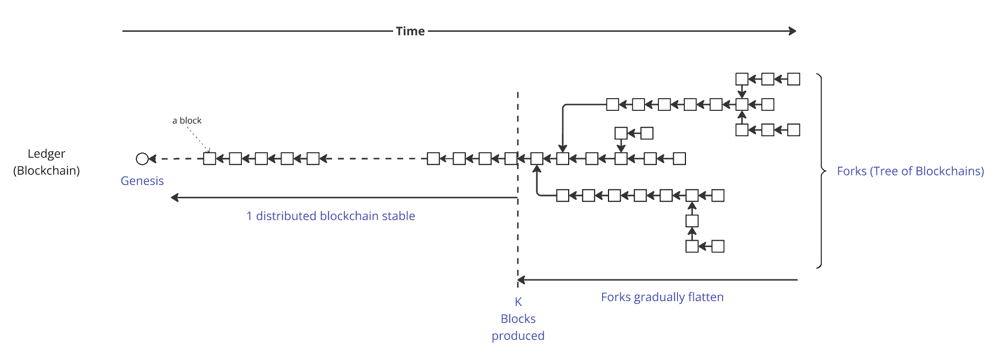
</div>

#### **Why Do Blockchain Forks Occur?**

Blockchain **forks** can happen for several reasons:

- **Multiple slot leaders** can be elected for a single **slot**, potentially resulting in the production of **multiple blocks** within that **slot**.
- **Block propagation** across the **network** takes time, causing **nodes** to have differing views of the **current chain**.
- **Nodes** can dynamically **join** or **leave** the **network**, which is a fundamental challenge in decentralized systems, affecting synchronization and consensus stability.
- An **adversarial node** is not obligated to agree with the most **recent block** (or **series of blocks**); it can instead choose to append its **block** to an **earlier block** in the **chain**.

#### **Short Forks vs. Long Forks**

**Short forks**, typically just a **few blocks long**, occur **frequently** and are usually **non-problematic**. The **rolled-back blocks** are often nearly identical, containing the **same transactions**, though they might be distributed **differently** among the **blocks** or have **minor differences**.

However, **longer forks** can have **harmful consequences**. For example, if an **end-user** (the **recipient** of funds) makes a decision—such as **accepting payment** and **delivering goods** to another user (**the sender of the transaction**)—based on a **transaction** that is later **rolled back** and does not **reappear** because it was **invalid** (e.g., due to **double-spending** a **UTxO**), it creates a **risk of fraud**.

## 2. The Grinding Attack Algorithm  

This section describes the grinding attack, detailing its objectives, mechanics, and the adversary’s strategy to maximize its effectiveness.

## 2.1 Randomness Manipulation
We descrive here the grinding attack Cardano's randomness generation protocol suffers from, from passively waiting for its chance or actively maximizing its attack surface, to choosing the best attack vector - stake distribution - to achieve its goal, be it maximizing rewards to controlling target blocks.

### 2.1.1 Exposure 

In its current version, Praos has a vulnerability where an adversary can manipulate the nonce $\eta_\text{e}$, the random value used for selecting block producers. This allows the adversary to incrementally and iteratively undermine the uniform distribution of slot leaders, threatening the fairness and unpredictability of the leader selection process.

At the conclusion of Phase 2, when the $\eta^\text{candidate}_{e}$ nonce is determined, the distribution of slot leaders for the next epoch becomes deterministic in a private manner. This means that, at this point, the adversary gains precise knowledge of the slots in which they will be elected but lacks detailed knowledge of the slot distribution for honest participants.

For example, if the adversary acts as the slot leader immediately before this phase transition, they can choose whether to produce a block or not. This decision grants them the ability to compute and compare two valid nonces - one with one fewer VRF update than the other -, evaluate different slot leader distributions for the upcoming epoch and potentially maximize their future gains at the cost of lesser rewards at this epoch. The more blocks the adversary controls before Phase 2's end, the more nonces they may _grind_ and choose from, and the more critical the atatck becomes. In essence, the adversary gains access to up to $2^x$ possible combinations of slot leader distributions, where $x$ denotes the number of controlled leader slots at this particular stage of the protocol.

<div align="center">
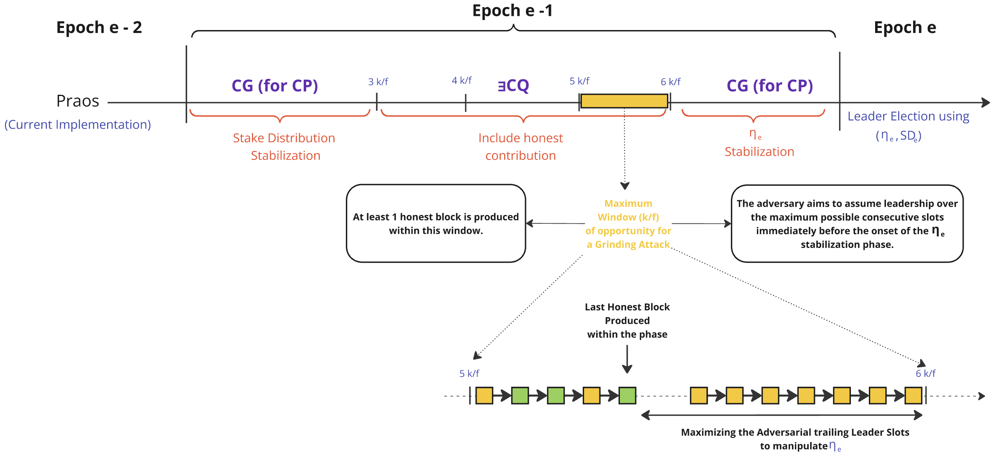
</div>

This marks the beginning of a grinding attack, where the adversary's initial goal is to maximize the number of adversarial blocks at this critical juncture, either passively by waiting, or actively by reaching a snowball effect. By doing so, they expand the range of potential slot leader distributions they can choose from, significantly enhancing their influence over the protocol. We use the term "exposure" here because the adversary is first setting the stage for its attack. 

### 2.1.2 Slot Leader Distribution Selection

This is the pivotal moment where the adversary's prior efforts pay off. They are now in a position with *x* blocks at the critical juncture. At this stage, the adversary can generate up to $2^x$ possible $η$ nonces, compute the next epoch's slot leader distribution for each of them, and strategically select the nonce and distribution that best aligns with their goal. This positioning enables them to deploy the attack effectively in the subsequent epoch.

<div align="center">
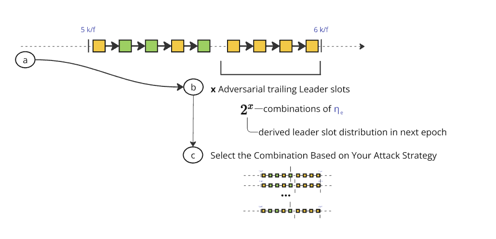
</div>

As the adversary accumulates blocks, the attack's bottleneck swiftly shifts from waiting for enough blocks at the critical juncture to the computational power needed to compute enough nonces to achieve their goal. 

Accumulating a significant number of leader slots at this position necessitates, except when owning a significant portion of the total stake, an underlying intent to exploit or destabilize the protocol. Achieving such a level of control requires significant coordination, making it highly unlikely to occur without deliberate adversarial motives. Once an attacker reaches this threshold, their objectives extend beyond a single exploit and diversify into various strategic threats. 

### 2.1.3 Potential Outcomes of Grinding Attacks

Below is a non-exhaustive list of potential attack vectors, ranging from minor disruptions in system throughput to severe breaches that compromise the protocol’s integrity and structure.

### Economic Exploitation
Manipulating slot leader distributions to prioritize transactions that benefit the adversary or to extract higher fees.

### Censorship Attacks
Selectively excluding transactions from specific stakeholders to suppress competition or dissent.

### Minority Stake Exploitation
Amplifying the influence of a small adversarial stake by targeting specific epoch transitions.

### Fork Manipulation
Creating and maintaining malicious forks to destabilize consensus or execute double-spend attacks.

### Settlement Delays
Strategically delaying block confirmation to undermine trust in the protocol's settlement guarantees.

### Double-Spend Attacks
Exploiting control over slot leader distributions to reverse confirmed transactions and execute double-spends.

### Chain-Freezing Attacks
Using nonce selection to stall block production entirely, halting the protocol and causing network paralysis.

## 2.2. Non-Exhaustive Manipulation Stategy List

The Ethereum community recently published an insightful paper titled [*Forking the RANDAO: Manipulating Ethereum's Distributed Randomness Beacon*](https://eprint.iacr.org/2025/037). Since the system model used to analyze randomness manipulation in Ethereum is also applicable to Cardano, we will extensively reference their work to explore various manipulation strategies within the Cardano ecosystem. 


### 2.2.1 System Model

A block can exist in one of four states:  

- **H / Proposed** – The validator successfully proposes a valid block, which is accepted by the supermajority of validators and included in the canonical chain. Honest validators always follow this behavior in our analysis, while adversarial validators may consider alternative strategies, such as withholding blocks.  

- **R / Reorged** – The validator proposes a valid block, but it ends up on a non-canonical branch of the blockchain. This block is no longer considered part of the main chain by the supermajority of the stake.  

- **M / Missed** – The validator fails to publish a block during its designated slot. For an honest validator, this typically results from connectivity issues or other operational failures.  

- **P / Private** – The validator constructs a block but does not immediately publish it during its assigned slot. Instead, an adversarial validator selectively shares the block with validators within its staking pool. Later, the private block may be introduced into the canonical chain by **forking** the next block—a strategy known as an **ex-ante reorg attack**. Alternatively, depending on the evolving chain state, the attacker may decide to withhold the block entirely, a tactic we refer to as **regret**.  

<div align="center">
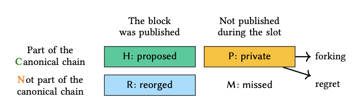
</div>

Block statuses are denoted as $H^e_i, R^e_i, M^e_i, P^e_i$ indicating that the 
block in the $i$ th slot in epoch $e$ was proposed, reorged, missed, or built privately, respectively. Reorged and missed blocks do not contribute to the generation of $\eta_e$ since they are not part of the canonical chain. 

### 2.2.2 Self Mixing Strategy

The adversary can selectively propose or miss blocks to manipulate $\eta_e$. Assume that $\mathcal{A}$ is assigned with $t$ consecutive tail blocks, formally $\mathcal{A}^{t}$ of epoch $e$, then $\mathcal{A}$ can choose arbitrarily between $2^t$ $\eta_e$ by missing or proposing each tail block. Thus, it is trivial that $\mathcal{A}^{t} \in AS_{\alpha}(m,n)$ for $0 \leq t \leq m$, as $\mathcal{A}$ can compute $\eta_e$ corresponding to $C^t$.  

The manipulative power for $t = 2$ is the following decision tree 

<div align="center">
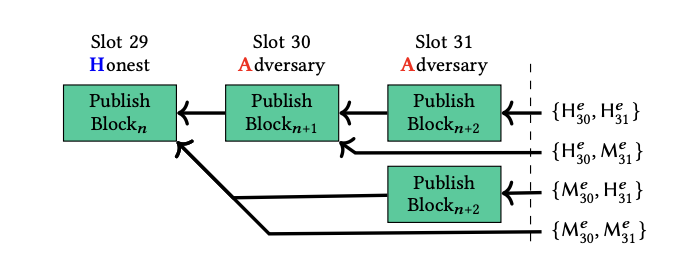
</div>

e.g : The adversary chooses option $\{H^e_{30}, M^e_{31}\}$ if the calculated $\eta_e$ eventually leads to the highest number of blocks. In this case, sacrificing Slot 30 and 31 is worthwhile, as it results in a significantly higher number of blocks in epoch $e + 2$.  

### 2.2.3 Forking Strategies


To achieve the goal of maximizing $x$ trailing blocks at this critical juncture, the adversary leverages the forking nature of the consensus protocol by introducing a private chain. By strategically applying the Longest-Chain rule to their advantage, the adversary ensures that the last honest trailing blocks are excluded at this pivotal moment. With this added dimension, gaining access to $2^x$ possible combinations of slot leader distributions becomes equivalent to $x = |A| - |H|$, where $|A|$ and $|H|$ represent the number of adversarial and honest blocks, respectively, within this specific interval of the protocol : 

<div align="center">
  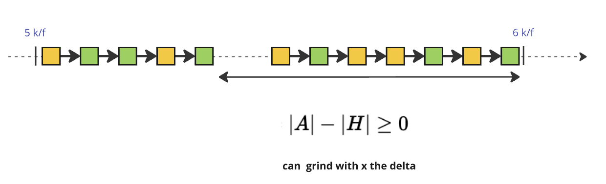
</div>

The adversary can choose between **two forking strategies** depending on when they act:

- **Preemptive Forking (Ex-Ante Reorging):** The adversary **forks before** the randomness update, ensuring that only adversarial VRF contributions are included while honest ones are discarded. This allows them to manipulate $\eta_e$ **before it is finalized**, biasing leader selection for the next epoch.

- **Reactive Forking (Ex-Post Reorging):** Instead of acting in advance, the adversary **waits until all honest VRF contributions are revealed** before deciding whether to fork. If the observed $\eta_e$ is unfavorable, they **publish an alternative chain**, replacing the honest blocks and modifying the randomness post-facto.

Both strategies undermine fairness in leader election, with **Preemptive Forking** favoring proactive randomness manipulation and **Reactive Forking** enabling selective, informed chain reorganizations.

## 3. The Cost of Grinding: Adversarial Effort and Feasibility  

### 3.1 Definitions

#### 3.1.1 $\alpha$-Heavy and Heaviness
We define the heaviness of an interval as the percentage of blocks an adversary controls.
Let $X_A(w)$ be the **number of adversarial blocks** and similarly $X_H(w)$ the **number of honest blocks** in the an interval of $w$ blocks.
The **heaviness** of an interval of size $w$ is thus the ratio $\frac{X_A(w)}{w}$. Heaviness thus vary between 0, where the interval only comprises honest blocks, and 1 where the adversary control them all. 

We say that the interval is $\mathbf{\alpha}$**-heavy** if $\frac{X_A(w)}{w} > \alpha$. We furthermore say that the adversary _dominates_ the interval if $\alpha > 0.5$. We shall look from now on to the longest suffix the adversary dominates at the critical juncture, hence the longest interval $w_\text{max}$ where $\alpha > 0.5$.

#### 3.1.2 Grinding Power g

An **$\alpha$-heavy suffix** must be present at the critical juncture for a grinding attack to be considered. The heavier $w$ , for a fixed $w$, the greater the adversary’s grinding power.

The **grinding power** $g$ of an adversary $A$ is the number of distinct values that $A$ can choose from when determining for the epoch nonce $\eta$. This quantifies the adversary's ability to manipulate randomness by selectively withholding, recomputing, or biasing values. 

Let $g_w(X_A)$ be the number of possible grinding attempts in an interval of size $w$ when controlling $X_A$ blocks. We have,

```math
\begin{align*}
g_w(X_A) &= \sum_{i= w - X_A(w)}^{X_A(w)} \binom{X_A(w)}{i}\\
        &= 2^{w} \text{ when } X_A = w
\end{align*}
```

The grinding power for a given interval of size $w$ is the sum of $g_w(X)(X_A)$ when the adversary controls a majority of the blocks. 

```math
g_w = \sum_{X_A \geq \frac{w}{2}}^{w} g_w(X_A)
```
Similarly, we define the **grinding depth**, $\rho$, as the logarithm of the grinding power: $\rho = \log_2 g$, and bound it by $0 \leq \rho \leq 256$. It determines the **entropy reduction** caused by an adversary's nonce manipulation, directly impacting the protocol's resistance to randomness biasing, that is the number of bits of randomness an adversary can manipulate.

In a simplified model where the multi-slot leader feature is not considered, the probability an adversary with $\text{stake}_A \in (0,1)$ stake controls $X_A$ out of $w$ blocks is:

```math
P(\text{$\exists X_A \in w$}) = \binom{w}{X_A}\ \text{stake}_A^{X_A}\ (1 - \text{stake}_A)^{w-X_A}
``` 

where:
- $\binom{x}{y}$ represents the number of ways to select $x$ blocks out of $y$.
- $\text{stake}_A$ is the percentage of stake controlled by the adversary.


We can now define the expected grinding power $\mathbb{E}(g)$:

```math
\begin{align*}
\mathbb{E}(g) &= \sum_{t=n-s+1}^n g_{n-t} \cdot P(\text{\{slot T is honest and slots T+1..N are A-heavy\}}) \\
&= (1-\text{stake}_A) \sum_{d=1}^s \sum_{X_A \geq d/2}^{d} g_d(X_A) \cdot P(\text{$\exists X_A \in d$})
\end{align*}
``` 

In **Cardano mainnet**, the nonce size used in the randomness beacon is **256 bits**, meaning the theoretical maximum grinding power is $g_{\max} = 2^{256}$. However, practical grinding power is typically limited by computational constraints and stake distribution dynamics.

#### 3.1.3 Grinding Windows

#### 3.1.3.1 Opportunity Windows $w_O$

The **grinding opportunity window** $w_O$ is the time interval at the end of Phase 2 during which an adversary, dominating a suffix of size $w$, can compute and reveal one of $g$ possible $\eta_e^\text{candidate}$ nonces before the honest chain outpaces their chosen chain.

Phase 2 spans $S_2 = \frac{6k}{f}$ slots (with $f = \frac{1}{20}$, $k = 2,160$, $S_2 = 259,200$), ending at slot $S_2$, where $\eta_e^\text{candidate}$ is sampled from $\eta^\text{evolving}$ based on the VRF outputs of blocks up to that point ([see Section 1.3.5](#135-the-randomness-generation-sub-protocol)).

Assuming the adversary controls the $X_A(w)$ slots (between slot numbered $S_2 - w + 1$ and $S_2$), they can manipulate $X_A(w)$ VRF outputs to generate up to $2^{X_A(w)}$ possible nonces by selectively revealing or withholding each output. After $S_2$, a chain with their chosen nonce —ranging in length from $X_H(w)$ (revealing no blocks, withholding all) to $w$ (revealing all)— is set.

For simplicity, we consider that a honest block is produced at slot $S_2 + 1$. As such, the grinding oppotunity window is bounded by,

```math
\frac{X_A(w)}{f} \leq w_O \leq \frac{w}{f}
```

**N.B.** Contrary to the grinding power that is upper-bounded by $2^{256}$, the grinding window is not.

- **Parameters**:
  - $f$: Active slot coefficient (e.g., $\frac{1}{20}$), the fraction of slots with a leader.
  - Slot duration = 1 second.

<div align="center">
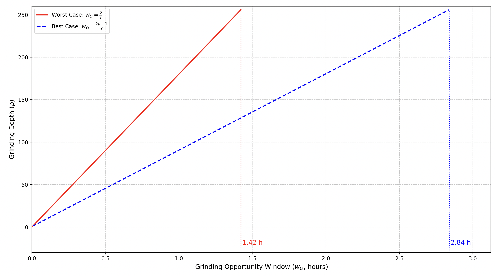
</div>

✏️ **Note**: The code to generate this graph is available at ➡️ [this link](./graph/window0_graph.py).

Let's consider the worst case where the adversary controls all trailing slots ($g = 1 \Leftrightarrow w=X_A(w)$):
- **$w = 16$**:
  - $w_O = \frac{16}{\frac{1}{20}} = 16 \cdot 20 = 320$ seconds (~5.3 minutes).
  - Starts at $S_2 - w + 1 = 259,200 - 16 + 1 = 259,185$, ends at $S_2 + \frac{1}{f} = 259,200 + 20 = 259,220$ (adjusted for reveal timing).
- **$w = 32$**:
  - $w_O = \frac{32}{\frac{1}{20}} = 32 \cdot 20 = 640$ seconds (~10.7 minutes).
  - Starts at $S_2 - w + 1 = 259,200 - 32 + 1 = 259,169$, ends at $259,200 + 20 = 259,220$.
- **$w = 256$**:
  - $w_O = \frac{256}{\frac{1}{20}} = 256 \cdot 20 = 5,120$ seconds (~85.3 minutes).
  - Starts at $S_2 - w + 1 = 259,200 - 256 + 1 = 258,945$, ends at $259,200 + 20 = 259,220$.

This sizing ensures the adversary has time to act before honest chain growth threatens even a length-1 chain, providing a practical and conservative bound for grinding feasibility.

##### 3.1.3.2 Target Window $w_T$

Once the adversary obtains a potential **candidate nonce** ($\eta_e^{\text{candidate}}$) for epoch $e$, they can compute their private **slot leader distribution** for the entire epoch, spanning:  

```math
\frac{10k}{f} = \frac{10 \cdot 2,160}{0.05} = 432,000 \text{ slots} = 5 \text{ days}

```

We define the **grinding target window** $w_T$ as the slot interval an adversary targets based on their attack strategy, where $1 \leq w_T \leq 4.32 \cdot 10^5 \text{ slots}$.

#### 3.1.3 Grinding Attempt

A **grinding attempt** is a single **evaluation of a possible $\eta$ nonce** by the adversary within the grinding target window $w_O$.  
Each attempt follows three key steps:  

1. **Computing a candidate $\eta$ nonce** by selectively revealing or withholding VRF outputs.
2. **Simulating the resulting slot leader distribution** over the target window $w_T$.  
3. **Evaluating the strategic benefit** of choosing this $\eta$ nonce for their attack objectives.  

The number of grinding attempts an adversary can make is constrained by their **grinding power** $g$, and is upper-bounded by:  

```math
g \leq 2^{X_A(w)}
```

where the adversary dominates the suffix of size $w$ at the critical juncture and **$X_A(w)$** represents the number of blocks they control in that interval.  

### 3.2 Entry Ticket: Acquiring Stake to Play the Lottery  

Before an adversary can execute a grinding attack, they must first **acquire enough stake**, akin to **buying an entry ticket** to participate in a **lottery**.  
In this case, the **lottery** is the leader election process, where the probability of winning a slot—and thus influencing the $\eta$ nonce—is directly proportional to the stake held.  

Just like in a lottery, **the more tickets an adversary buys (stake accumulated), the greater their chances of winning**.  
By securing a significant share of stake, they increase the likelihood of being selected as a **slot leader in key trailing positions**, providing the foundation needed to execute a grinding attack.  

Thus, the **first cost** of a grinding attack is **not computational but economic** —the price of acquiring enough stake to play the lottery.

To estimate the cost of these **entry tickets**, we address the following question: 

> **How many blocks can an adversary control on average with a given adversarial stake, ensuring a reasonable probability—such as at least one successful grinding opportunity within 10 years** of continuous **epoch-by-epoch execution in Cardano**, where each epoch lasts **5 days**?  
>  
> Specifically, for a given adversarial stake, we seek the **maximum $X_A(w)$** for which the probability of obtaining a _dominating_ $\alpha$-heavy suffix $w_O$ is **at least once over 10 years**, meaning at least one occurrence within **3,650 epochs**.  
>  
> **N.B.:** A **10-year period** spans **two full technological innovation cycles**, significantly increasing the likelihood of disruptive advancements in **cryptographic research, computing power, or consensus protocols**. This timeframe provides a long enough horizon for:  
> - **Assessing long-term adversarial feasibility** and whether stake-based grinding remains viable at scale.  
> - **Observing historical adversarial behaviors**, particularly in decentralized networks with shifting governance dynamics.  
> - **Giving the Cardano community sufficient time** to introduce fundamental **protocol-level improvements** to Ouroboros that could **completely mitigate or transform this issue**.  

#### The Data
We are computing here the expected number of grinding attempts for both the self-mixing and forking strategies.

##### Self-Mixing

We present here the average number of years required for an adversary with a stake of $\text{stake}_A$ to control N blocks. We chose to emphasize frequencies below 10 years, as it is reasonable to assume the protocol will have evolved after such a period.

<div align="center">

</div>

(*) We make the simplification to consider the 21,600 blocks directly, that is: there is only 21,600 slots and to each to slot is exactly assigned one slot leader.

<details>
<summary>📌📌 <i> More Details on Probabilities Here </i> – <b>  Expand to view the content.</b></summary>

We display here the probabilities of an adversary with a stake of $\text{stake}_A$ controlling N blocks:

| $N \text{ vs }\ \text{stake}_A$ (%) |    0.5    |     1     |     2     |     5      |     10     |     20     |     25     |     30      |     33       |     40     |     45    |     49    |
| :----------------------: | :-------:   | :------: | :-------: | :--------: | :--------: | :--------: | :--------: | :---------: | :----------: | :--------: | :-------: | :-------: |
| $1$                      |  5.00E-03	 |1.00E-02	| 2.00E-02	| 5.00E-02	 | 1.00E-01	  | 2.00E-01 	 | 2.50E-01 	|  3.00E-01	  |  3.30E-01	   |  4.00E-01  | 4.50E-01	| 4.90E-01  |
| $2$                      |  2.50E-05	 |1.00E-04	| 4.00E-04	| 2.50E-03	 | 1.00E-02	  | 4.00E-02 	 | 6.25E-02 	|  9.00E-02	  |  1.09E-01	   |  1.60E-01  | 2.03E-01	| 2.40E-01  |
| $4$                      |  6.25E-10	 |1.00E-08	| 1.60E-07	| 6.25E-06	 | 1.00E-04	  | 1.60E-03 	 | 3.91E-03 	|  8.10E-03	  |  1.19E-02	   |  2.56E-02  | 4.10E-02	| 5.76E-02  |
| $8$                      |  3.91E-19	 |1.00E-16	| 2.56E-14	| 3.91E-11	 | 1.00E-08	  | 2.56E-06 	 | 1.53E-05 	|  6.56E-05	  |  1.41E-04	   |  6.55E-04  | 1.68E-03	| 3.32E-03  |
| $16$                     |  1.53E-37	 |1.00E-32	| 6.55E-28	| 1.53E-21	 | 1.00E-16	  | 6.55E-12 	 | 2.33E-10 	|  4.30E-09	  |  1.98E-08	   |  4.29E-07  | 2.83E-06	| 1.10E-05  |
| $32$                     |  2.33E-74	 |1.00E-64	| 4.29E-55	| 2.33E-42	 | 1.00E-32	  | 4.29E-23 	 | 5.42E-20 	|  1.85E-17	  |  3.91E-16	   |  1.84E-13  | 7.99E-12	| 1.22E-10  |
| $64$                     |  5.42E-148	 |1.00E-128 |	1.84E-109	| 5.42E-84	 | 1.00E-64	  | 1.84E-45 	 | 2.94E-39 	|  3.43E-34	  |  1.53E-31	   |  3.40E-26  | 6.39E-23	| 1.49E-20  |
| $128$                    |  2.94E-295	 |1.00E-256 |	3.40E-218	| 2.94E-167  | 1.00E-128	| 3.40E-90 	 | 8.64E-78 	|  1.18E-67 	|  2.34E-62	   |  1.16E-51  | 4.09E-45	| 2.21E-40  |
| $256$                    |  0.00E+00	 |0.00E+00	| 0.00E+00	| 0.00E+00	 | 1.00E-256	| 1.16E-179	 | 7.46E-155	|  1.39E-134	|  5.49E-124	 |  1.34E-102	| 1.67E-89	| 4.90E-80  |
</details>
</br>

We present the expected number (i.e., moment) of grinding attempts during self-mixing, which refers to trailing blocks within an epoch.

| $\text{stake}_A$ (%) |    0.5    |     1     |     2     |     5     |     10    |     20    |     25    |     30    |     33    |     40    |     45    |     49    |
| :------------------: | :-------: | :-------: | :-------: | :-------: | :-------: | :-------: | :-------: | :-------: | :-------: | :-------: | :-------: | :-------: |
| $\mathbb{E}(X_A)$    |   0.005   |   0.010   |   0.020   |   0.053   |   0.111   |   0.250   |   0.333   |   0.429   |   0.493   |   0.667   |   0.818   |   0.961   |

We conclude that the self-mixing attack is neither highly probable nor particularly critical.

##### Forking

We extend here the self-mixing strategy with forking and show how this renders the attack viable.

More precisely, we tabulated here the grinding powers' expectation when looking at total period of variable length, as looking at a whole epoch is computationally impractical. While the expectation converges quickly for small stake, we can note it significicantly rises when the adversary owns more than around 20\% of the total stake.

 $\text{stake}_A$ (%)        |    0.5    |     1     |     2     |     5     |     10    |     20    |     25    |     30    |     33    |     40    |     45    |     49    |
| :------------------------: | :-------: | :-------: | :-------: | :-------: | :-------: | :-------: | :-------: | :-------: | :-------: | :-------: | :-------: | :-------: |
| $\mathbb{E}(g, n=16)$     | 1.03E-02	 |  2.12E-02 | 4.49E-02  |	1.36E-01 |	4.12E-01 |	5.17E+00 |	4.27E+01 |	3.83E+02 |	1.29E+03 |	1.51E+04 |	6.57E+04 |	1.85E+05 |
| $\mathbb{E}(g, n=64)$     | 1.03E-02	 |  2.12E-02 | 4.49E-02  |	1.36E-01 |	4.12E-01 |	8.40E+00 |	1.01E+03 |	1.46E+05 |	2.01E+06 |	3.56E+08 |	7.37E+09 |	6.06E+10 |
| $\mathbb{E}(g, n=128)$    | 1.03E-02	 |  2.12E-02 | 4.49E-02  |	1.36E-01 |	4.12E-01 |	1.30E+01 |	7.86E+05 |	2.92E+10 |	6.59E+12 |	2.44E+17 |	1.05E+20 |	6.87E+21 |
| $\mathbb{E}(g, n=256)$    | 1.03E-02	 |  2.12E-02 | 4.49E-02  |	1.36E-01 |	4.12E-01 |	1.97E+01 |	6.98E+11 |	1.64E+21 |	9.60E+25 |	1.45E+35 |	2.48E+40 |	9.29E+43 |
| $\mathbb{E}(g, n=512)$    | 1.03E-02	 |  2.12E-02 | 4.49E-02  |	1.36E-01 |	4.12E-01 |	2.91E+01 |	7.87E+23 |	7.19E+42 |	2.80E+52 |	6.60E+70 |	1.64E+81 |	1.79E+88 |

We can approximate the expected grinding power as an exponential function of the precision, i.e. $E(g, n)= \text{poly}(n) \cdot \zeta^n$. Looking at the exponential's based, $\zeta$ can tell us precisely when the grinding power becomes rises exponentially, that is when $\zeta = 1$ the exponentiaition starts growing instead of decaying. The following graph indeed confirms that 20\% is the threshold.

<div align="center">
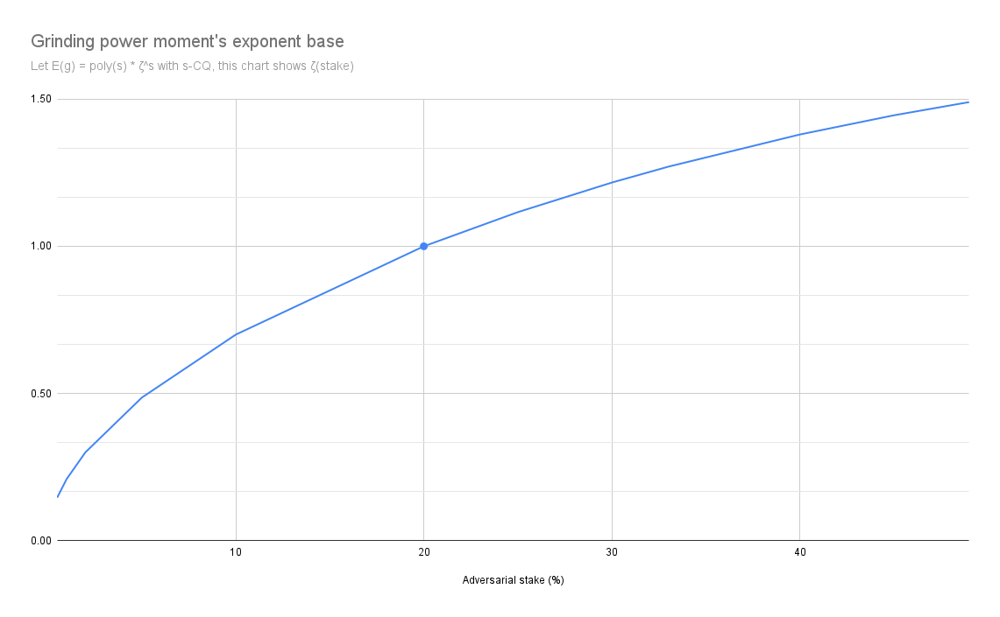
</div>

<!-- 
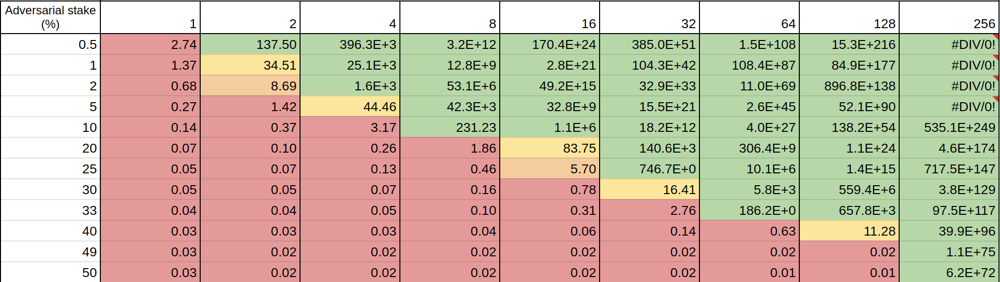

-->

The details of the calculations underlying this table can be found in the following Google Spreadsheet: [Details of Calculations](https://docs.google.com/spreadsheets/d/1DGG4tXTngc2Zu5_IMlWsPoARksgBEMbTCyqBAgKHe7E/edit?gid=0#gid=0).

For example, with **5% adversarial stake**, it would take about **1800 years** in average for an adversary to obtain an advantage of of exactly 4 blocks at the critical juncture.

####  The Results

<div align="center">


</div>

**N.B** : This analysis does not account for recursion in addition to the forking and self-mixing strategy, so the curve should actually be even steeper than in the graph above. 

This investment is non-trivial and serves as an implicit deterrent to attacks, as the adversary must weigh the risks of financial exposure against potential gains. While stake acquisition might appear as a sunk cost, it can, in some cases, be viewed as an active investment in the blockchain ecosystem. For instance, an adversary with a large stake may not only attempt manipulation but could also seek to benefit from staking rewards, governance influence, or other economic incentives, adding an additional layer of strategic decision-making.

Results suggests that **crossing the 20% stake threshold** dramatically increases an adversary’s probability of influencing leader elections. With such control, their ability to manipulate leader election outcomes becomes **exponentially and primarily constrained by computational feasibility rather than probabilistic limitations**.

As of **March 1, 2025**, acquiring a 20% stake in Cardano would require an investment exceeding **4.36 billion ADA**, a substantial sum that introduces a fundamental **game-theoretic disincentive**:  
- A successful attack could undermine the blockchain’s integrity, leading to **loss of trust and stake devaluation**.  
- If the attack is detected, **reputational damage, delegator withdrawals, or protocol-level countermeasures** could make the adversary's stake significantly less valuable.

> This reinforces **transparency as a natural deterrent**: publicly observable grinding attempts expose adversarial stake pool operators (SPOs) to severe economic and social consequences.

### 3.3 Cost of a Grinding Attempt  

As previously explained, each attempt consists of three key steps:  

1. **Computing a candidate $\eta$ nonce** by selectively revealing or withholding VRF outputs.  
2. **Simulating the resulting slot leader distribution** over the target window $w_T$.  
3. **Evaluating the strategic benefit** of choosing this $\eta$ nonce for adversarial objectives.  

Let's analyze each of these steps.  

### 3.3.1 Nonce Generation  

We will denote this step as $T_{\text{nonce}}^\rho$ moving forward. 

Nonce generation consists of:  

1. **VRF Evaluation**: Computes a candidate $\eta$ nonce.  
2. **$\ast$ Operation**: Concatenation + **BLAKE2b-256** hashing.  

Since the VRF outputs can be precomputed, we can discard them from the computational cost of a grinding attack. As for the computational cost, as the hash functions are protected against extension attacks, we have to consider the average cost of hashing of all nonces when considering a fixed grinding depth $\rho$.

We make the assumption that hashing $n$ inputs takes as much time as hashing $n$ times two inputs, that is that the finalization step of a hashing function is not significant. We also look at the worst case scenario, for simplification, and assume that $g = 2^{X_A(w)}$.

```math
T_{\text{nonce}}^\rho =  T_{\text{BLAKE2b}} \cdot \frac{\sum_i i  \cdot \binom{\rho + i}{\rho}}{2^\rho} = \frac{\rho}{2} \cdot T_{\text{BLAKE2b}}
```
**N.B.** We may drop the superscript $\rho$ for readibility.

**N.B.** This represents the average time to compute a nonce. While each nonce can be computed in parallel, we cannot easily parallelize the generation of one nonce as the computation is sequential. 

### 3.3.2 Slot Leader Distribution Evaluation  

We will denote this step as $T_{\text{distribution}}$ moving forward. 

After generating a candidate nonce, the adversary must evaluate its impact on **slot leader election** over an target window $w_T$ :  

1. **Computing VRF outputs** for all slots in $w_T$ of interest.  
2. **Evaluating the eligibilty of these values** to know when the adversary is the slot leader.  

Since **leader eligibility is unknown in advance**, the adversary must verify **all slots** in $w_T$.

Define:
- $w_T$ → **target window size (seconds)**.
- $T_{\mathsf{VRF}}$ → **VRF evaluation time**.
- $T_{\text{eligibility}}$ → **Slot eligilibity check**.

Each slot requires **one VRF verification**, leading to:

```math
T_{\text{distribution}} = w_T \cdot ( T_{\mathsf{VRF}} + T_{\text{eligibility}} )
```

This represents the total time of the leader distribution evaluation. Once a nonce is computed, we can generate and check the eligibility of the VRF outputs in parallel.


### 3.3.3 Strategic Benefit Evaluation  

We denote this step as $T_{\text{eval}}$ moving forward.

After simulating the leader election distribution, the adversary must determine whether the selected $\eta$ nonce provides a **strategic advantage** by:  

1. **Assessing block production gains** relative to honest stake.  
2. **Estimating adversarial control over leader election.**  
3. **Comparing multiple nonces** to select the most effective one.  

#### **Nature of the Computational Workload**  

Unlike previous steps, this phase does not perform a single deterministic computation but operates as an **evaluation loop over a dataset of adversarial leader election scenarios**. The attacker’s dataset includes:  

- **Nonce-to-leader mappings** → which nonces yield better leadership control.  
- **Stake distributions** → impact of adversarial stake on slot control.  
- **Slot timing predictions** → evaluating when it's best to control a block.  
- **Secondary constraints** → network conditions, latency factors, or additional attack-specific considerations.  

Since this **"database" of possible leader elections** depends on **adversarial strategies**, the cost is too diverse to define precisely. While the **exact cost varies**, this step is **compulsory** and must be factored into the total grinding time. 

### 3.3.4 Total Estimated Time per Grinding Attempt  

The total grinding time is the sum of:  

1. **Nonce Generation ($T_{\text{nonce}}$)** → VRF evaluation + hashing.  
2. **Slot Leader Simulation ($T_{\text{distribution}}$)** → Eligibility checks over $w_T$.  
3. **Strategic Evaluation ($T_{\text{eval}}$)** → Nonce selection analysis.  

#### **Total Grinding Time Formula**  

```math
T_{\text{grinding}} = T_{\text{nonce}} + T_{\text{distribution}} + T_{\text{eval}}
```

Expanding each term:

- **Nonce Generation:** : $T_{\text{nonce}} = \frac{\rho}{2} \cdot T_{\text{BLAKE2b}}$
- **Slot Leader Verification** : $T_{\text{verify}} = w_T \cdot ( T_{\mathsf{VRF}} + T_{\text{eligibility}} )$
- **Strategic Evaluation** : $T_{\text{eval}}$ (attack-dependent term)

Final expression:

```math
T_{\text{grinding}} = \frac{\rho}{2} T_{\text{BLAKE2b}} + w_T \cdot ( T_{\mathsf{VRF}} + T_{\text{eligibility}} ) + T_{\text{eval}}
```

Where:
- $T_{\mathsf{VRF}}$ is the VRF evaluation time.
- $T_{\text{eligibility}}$ is the eligibility checktime.
- $T_{\text{BLAKE2b}}$ is the time for the hashing operation.
- $w_T$ is the target window size (seconds).
- $\rho$ is the grinding power.
- $T_{\text{eval}}$ is the nonce selection and evaluation time, which is attack-specific.

### 3.4 Cost of a Grinding Attack

### 3.4.1 Formula

A **grinding attack** consists of multiple grinding attempts executed within the **grinding opportunity window** $w_O$. Since each grinding attempt takes time to compute, the feasibility of the attack depends on whether the total computation can be completed within this window.

We define the **total attack time** as:

```math
T_{\text{attack}} = \frac{2^{\rho} \cdot T_{\text{grinding}}}{N_{\text{CPU}}}
```

where:
- $\rho$ = **grinding depth** (bits of entropy the adversary can manipulate),
- $T_{\text{grinding}}$ = **time required for one grinding attempt**,
- $N_{\text{CPU}}$ = **number of CPUs available for parallel execution**.

For the attack to be feasible, this total time must fit within the **grinding opportunity window** $w_O$:

```math
\frac{2^{\rho} \cdot T_{\text{grinding}}}{N_{\text{CPU}}} \leq w_O
```
which leads to the lower bound on computational power ($N_CPU$) : 

```math
N_{\text{CPU}} \geq \left \lceil \frac{2^{\rho} \cdot T_{\text{grinding}}}{w_O}\right \rceil
```

#### Expanding $T_{\text{grinding}}$
From **Section 3.3**, the per-attempt grinding time is:

```math
T_{\text{grinding}} = \frac{\rho}{2} T_{\text{BLAKE2b}} + w_T \cdot ( T_{\mathsf{VRF}} + T_{\text{eligibility}} ) + T_{\text{eval}}
```

Substituting this into the inequality:

```math
N_{\text{CPU}} \geq \left \lceil \frac{2^{\rho} \cdot \left( \frac{\rho}{2} T_{\text{BLAKE2b}} + w_T \cdot ( T_{\mathsf{VRF}} + T_{\text{eligibility}} ) + T_{\text{eval}} \right)}{w_O} \right \rceil
```


#### Expanding $w_O$ in Terms of $\rho$ and $f$
From previous sections, the **grinding opportunity window** is:

```math
\frac{X_A(w)}{f} \leq w_O \leq \frac{w}{f}
```

Substituting this into our equation:

```math
\begin{align*}
N_{\text{CPU}} &\geq  \left \lceil f \cdot \frac{2^{\rho} \cdot \left( \frac{\rho}{2} T_{\text{BLAKE2b}} + w_T \cdot ( T_{\mathsf{VRF}} + T_{\text{eligibility}} ) + T_{\text{eval}} \right)}{w} \right \rceil\\
& \geq  \left \lceil f \cdot \frac{2^{\rho} \cdot \left( \frac{\rho}{2} T_{\text{BLAKE2b}} + w_T \cdot ( T_{\mathsf{VRF}} + T_{\text{eligibility}} ) + T_{\text{eval}} \right)}{2\cdot \rho - 1} \right \rceil \text{ as } w < 2 \cdot \rho - 1\\
& >  \left \lceil f \cdot 2^{\rho-1} \cdot T_{\text{BLAKE2b}} + \frac{f}{\rho} \cdot 2^{\rho-1} \cdot \left( w_T \cdot ( T_{\mathsf{VRF}} + T_{\text{eligibility}} ) + T_{\text{eval}} \right) \right \rceil
\end{align*}
```
We end up with this final expression : 
```math
\begin{align*}
N_{\text{CPU}} >  \left \lceil f \cdot 2^{\rho-1} \cdot T_{\text{BLAKE2b}} + \frac{f}{\rho} \cdot 2^{\rho-1} \cdot \left( w_T \cdot ( T_{\mathsf{VRF}} + T_{\text{eligibility}} ) + T_{\text{eval}} \right) \right \rceil
\end{align*}
```

### 3.4.2 Estimated Formula Using Mainnet Cardano Parameters

Starting from the final expression at the end of the last section:

```math
N_{\text{CPU}} > \left \lceil f \cdot 2^{\rho-1} \cdot T_{\text{BLAKE2b}} + \frac{f}{\rho} \cdot 2^{\rho-1} \cdot \left( w_T \cdot ( T_{\mathsf{VRF}} + T_{\text{eligibility}} ) + T_{\text{eval}} \right) \right \rceil 
```

#### Applying Cardano Mainnet Parameters
Using Cardano’s mainnet values:
- $T_{\mathsf{VRF}} = 10^{-6}$ seconds (1 microsecond) – Time to evaluate a Verifiable Random Function.
- $T_{\text{BLAKE2b}} = 10^{-8}$ seconds (0.01 microseconds) – Time for a BLAKE2b-256 hash operation.
- $f = \frac{1}{20} = 0.05$ – Active slot coefficient.
- Slot duration = 1 second.

Since the eligibility check is negligible, set $T_{\text{eligibility}} \approx 0$:

Substitute into the expression:

- First term: $f \cdot 2^{\rho-1} \cdot T_{\text{BLAKE2b}} = 0.05 \cdot 2^{\rho-1} \cdot 10^{-8} = 5 \cdot 10^{-10} \cdot 2^{\rho-1}$,
- Second term: $\frac{f}{\rho} \cdot 2^{\rho-1} \cdot \left( w_T \cdot ( T_{\mathsf{VRF}} + T_{\text{eligibility}} ) + T_{\text{eval}} \right) = \frac{0.05}{\rho} \cdot 2^{\rho-1} \cdot \left( w_T \cdot (10^{-6} + 0) + T_{\text{eval}} \right) = \frac{0.05 \cdot 2^{\rho-1}}{\rho} \cdot (10^{-6} w_T + T_{\text{eval}})$.

Thus, the expression becomes:

```math
N_{\text{CPU}} > \left \lceil 5 \cdot 10^{-10} \cdot 2^{\rho-1} + \frac{5 \cdot 10^{-2} \cdot 2^{\rho-1}}{\rho} \cdot (10^{-6} w_T + T_{\text{eval}}) \right \rceil 
```

Simplify:

```math
N_{\text{CPU}} > \left \lceil 5 \cdot 10^{-10} \cdot 2^{\rho-1} + \frac{5 \cdot 10^{-8} \cdot 2^{\rho-1}}{\rho} \cdot w_T + \frac{5 \cdot 10^{-2} \cdot 2^{\rho-1}}{\rho} \cdot T_{\text{eval}} \right \rceil 
```

#### Final Expression
The estimated number of CPUs required is:

```math
N_{\text{CPU}} > \left \lceil 5 \cdot 10^{-10} \cdot 2^{\rho-1} + \frac{5 \cdot 10^{-14} \cdot 2^{\rho-1}}{\rho} \cdot w_T + \frac{5 \cdot 10^{-2} \cdot 2^{\rho-1}}{\rho} \cdot T_{\text{eval}} \right \rceil 
```

- $\rho$: The number of blocks controlled by the adversary.
- $w_T$: The target window (in seconds), ranging from short (e.g., 3600 s) to a full epoch (e.g., 432,000 s), as defined in [Section 3.5 - Scenarios](#35-scenarios).
- $T_{\text{eval}}$: The strategic evaluation time (in seconds), varying from 0 to 1, as explored in [Section 3.5 - Scenarios](#35-scenarios).

This expression transitions the theoretical cost model into a practical estimate, with specific values for $w_T$ and $T_{\text{eval}}$ evaluated in [Section 3.5 - Scenarios](#35-scenarios) to assess feasibility across different attack strategies.


## 3.5 Scenarios

Following the computational model from [Section 3.4.2 - Estimated Formula Using Mainnet Cardano Parameters](#342-estimated-formula-using-mainnet-cardano-parameters), we explore four scenarios to observe how randomness manipulation behaves across varying grinding depths $\rho$. These scenarios are framed with an animal-inspired metaphor reflecting evaluation complexity ($T_{\text{eval}}$) and observation scope ($w_T $), providing a basis for graphical analysis to be developed later.

| **Scenario**    | **$T_{\text{eval}}$ (Complexity)** | **$w_T$ (Scope)** | **Description**                                                                 |
|-----------------|--------------------------------------|---------------------|---------------------------------------------------------------------------------|
| **Ant Glance**  | 0 (Low)                              | 1h (3600 s)         | An ant quickly glancing at a small spot, representing simple evaluation (low $T_{\text{eval}}$) with basic effort and a narrow observation scope (small $w_T$). |
| **Ant Patrol**  | 0 (Low)                              | 5d (432,000 s)      | An ant patrolling a wide area over time with simple instincts, representing simple evaluation (low $T_{\text{eval}} $) with basic effort and a broad observation scope (large $w_T$). |
| **Owl Stare**   | 1 (High)                             | 1h (3600 s)         | An owl staring intently at a small area with keen focus, representing complex evaluation (high $T_{\text{eval}} $) with advanced effort and a narrow observation scope (small $w_T$). |
| **Owl Survey**  | 1 (High)                             | 5d (432,000 s)      | An owl surveying a wide range with strategic awareness, representing complex evaluation (high $T_{\text{eval}} $) with advanced effort and a broad observation scope (large $w_T$). |

The $N_{\text{CPU}}$ formulas are derived by substituting the respective $w_T$ and $T_{\text{eval}}$ values from each scenario into the base expression : 
```math 
N_{\text{CPU}} > \left \lceil 5 \cdot 10^{-10} \cdot 2^{\rho-1} + \frac{5 \cdot 10^{-14} \cdot 2^{\rho-1}}{\rho} \cdot w_T + \frac{5 \cdot 10^{-2} \cdot 2^{\rho-1}}{\rho} \cdot T_{\text{eval}} \right \rceil
```

| **Scenario**    | **$N_{\text{CPU}}$ Formula**                                                                                     |
|-----------------|-----------------------------------------------------------------------------------------------------------------|
| **Ant Glance**  | $5\cdot10^{-10}\cdot2^{\rho-1} + 1.8\cdot10^{-11}\cdot2^{\rho-1}$ |
| **Ant Patrol**  | $5\cdot10^{-10}\cdot2^{\rho-1} + 2.16\cdot10^{-9}\cdot2^{\rho-1}$ |
| **Owl Stare**   | $5\cdot10^{-10}\cdot2^{\rho-1} + 1.8\cdot10^{-11}\cdot2^{\rho-1} + 5\cdot10^{-2}\cdot\frac{2^{\rho-1}}{\rho}$ |
| **Owl Survey**  | $5\cdot10^{-10}\cdot2^{\rho-1} + 2.16\cdot10^{-9}\cdot2^{\rho-1} + 5\cdot10^{-2}\cdot\frac{2^{\rho-1}}{\rho}$ |

<div align="center">
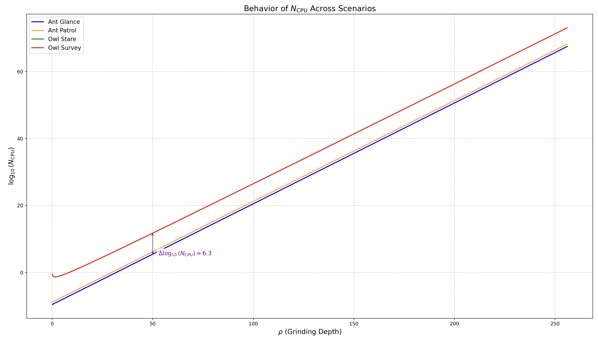
</div>

✏️ **Note**: The code to generate this graph is available at ➡️ [this link](./graph/scenario_cpu_graph.py).

The maximal delta $\Delta \log_{10}(N_{\text{CPU}})$ (Owl Survey minus Ant Glance) is $\sim 6.3$, matching the graph’s constant gap. This suggests $T_{\text{eval}}$ and $w_T$ drive a pre-exponential frame of $10^{6.3}$ CPUs, scaled exponentially by $2^{\rho}$. Note that the green line (Owl Stare) is not visible on the graph, likely due to its close alignment with the blue line (Ant Glance), as both share the same $w_T = 3600$ s, and the difference in $T_{\text{eval}}$ (0 for Ant Glance vs. 1 for Owl Stare) becomes negligible on the logarithmic scale for large $\rho$.

<!-- At $\rho = 50$:
- **Ant Glance** ($T_{\text{eval}} = 0$, $w_T = 3600$): $N_{\text{CPU}} \approx 1.22 \cdot 10^{12}$, $\log_{10}(N_{\text{CPU}}) \approx 10.085$.
- **Ant Patrol** ($T_{\text{eval}} = 0$, $w_T = 432,000$): $N_{\text{CPU}} \approx 1.46 \cdot 10^{12}$, $\log_{10}(N_{\text{CPU}}) \approx 12.164$.
- **Owl Stare** ($T_{\text{eval}} = 1$, $w_T = 3600$): $N_{\text{CPU}} \approx 5.75 \cdot 10^{11}$, $\log_{10}(N_{\text{CPU}}) \approx 11.760$.
- **Owl Survey** ($T_{\text{eval}} = 1$, $w_T = 432,000$): $N_{\text{CPU}} \approx 2.02 \cdot 10^{12}$, $\log_{10}(N_{\text{CPU}}) \approx 12.306$. -->

### 3.6 Grinding Power Computational Feasibility

Building on the analysis in previous [Section 3.5](##35-scenarios), we assessed the feasibility of grinding attacks by examining the computational resources ($N_{\text{CPU}}$) required across different grinding depths ($\rho$). The scenarios (Ant Glance, Ant Patrol, Owl Stare, Owl Survey) show a consistent $\Delta \log_{10}(N_{\text{CPU}}) \sim 6.3$, meaning the most demanding scenario (Owl Survey) requires $10^{6.3}$ times more CPUs than the least demanding (Ant Glance).

To help readers understand the practicality of these attacks, we define feasibility thresholds based on economic and computational viability, as shown in the table below:

| **Feasibility Category**          | **Cost Range (USD)**         | **Description**                                                                                                   |
|------------------------------------|------------------------------|------------------------------------------------------------------------------------------------------------------|
| **Trivial**                       | < $10,000                       | Representing an amount easily affordable by an individual with basic computing resources, such as a personal computer. |
| **Feasible**                      | $10,000 to $1,000,000        | Reflects costs that require a substantial financial commitment, typically beyond the reach of individuals but manageable for well-funded entities, such as tech startups, research groups, or organized crime syndicates, assuming access to mid-tier cloud computing resources or a dedicated server farm, necessitating a strategic investment that signals a serious intent to exploit the network. |
| **Possible**                      | $1,000,000 to $1,000,000,000 | Reflects costs that demand resources on the scale of large corporations, government agencies, or nation-states, implying the use of extensive computational infrastructure (e.g., data centers) and significant capital, suggesting an attack that requires coordinated effort and advanced planning, potentially involving millions of CPU hours or specialized hardware. |
| **Borderline Infeasible**         | $1,000,000,000 to $1,000,000,000,000 | Indicates costs that approach the upper bounds of what global economies can sustain for a single project, requiring resources comparable to those of major international organizations or coalitions, pushing the limits of current computational and financial capabilities, and suggesting that such an endeavor would strain even well-resourced entities, making it highly improbable without global-scale coordination. |
| **Infeasible**                    | > $1,000,000,000,000         | Denotes costs exceeding 1 trillion usd, deemed infeasible because they surpass the total economic output or computational capacity available globally (e.g., estimated at $`\sim 10^{15}`$ CPUs or $`\sim \$100`$ trillion GDP as of 2025), implying an attack that is theoretically possible only with resources beyond current technological or economic limits, rendering it practically impossible with present-day infrastructure. |

The cost model uses the $N_{\text{CPU}}$ formulas from [Section 3.5 - Scenarios](#35-scenarios), computes the number of CPUs needed for the attack, and multiplies by the CPU rental price ($0.01$ per CPU-hour) and runtime defined by the grinding opportunity window $w_O = \frac{2\rho - 1}{f}$ seconds (with $f = 0.05$) to estimate the total cost.

Costs are estimated assuming a CPU rental price of $0.01$ per CPU-hour, based on low-end instance pricing from major cloud providers like AWS as of March 11, 2025, where basic instances such as t2.micro cost approximately $0.0116$ per CPU-hour [AWS EC2 Pricing Page](https://aws.amazon.com/ec2/pricing/). However, for high-performance tasks, actual costs may range from $0.04$ to $0.08$ per CPU-hour, as seen with `AWS c5.large` ($0.048$) or `Azure Standard_F2s_v2` ($0.0372$). 

The table below summarizes the feasibility for `Owl Survey` ($T_{\text{eval}} = 1$, $w_T = 432,000 \, \text{s}$), the most resource-intensive scenario, at different $\rho$ values, using the $0.01$ estimate for initial assessment:

| $\rho$ | CPUs Required (Log₁₀ Scale) | Estimated Cost (USD, $w_O$ run) | Feasibility |
|----------|-----------------------------|----------------------------------|-------------|
| **20**   | $10^4$ CPUs ($\sim 10^4$)    | 56.74                            | Trivial for any adversary |
| **38**   | $10^9$ CPUs ($\sim 10^9$)    | 2.86 million                     | Feasible for well-funded adversaries |
| **50**   | $10^{13}$ CPUs ($\sim 10^{13}$) | 3.10 billion                 | Possible with large-scale infrastructure |
| **70**   | $10^{18}$ CPUs ($\sim 10^{18}$) | $9.80 \times 10^{16}$        | Borderline infeasible, requires massive resources |
| **110**  | $10^{31}$ CPUs ($\sim 10^{31}$) | $5.97 \times 10^{28}$        | Infeasible, exceeds global computing capacity |
| **215**  | $10^{62}$ CPUs ($\sim 10^{62}$) | $2.38 \times 10^{59}$        | Impossible, beyond planetary energy limits |

- **CPUs Required**: Computed for Owl Survey at each $\rho$, rounded to the nearest order of magnitude for readability (exact values approximated).
- **Cost**: Assumes $0.01$ per CPU-hour, scaled for the runtime $w_O = 20 (2\rho - 1)$ seconds.
- **Feasibility**: Assessed based on computational and economic viability, considering global computing resources (e.g., $\sim 10^{12}$ CPUs in modern data centers, $\sim 10^{15}$ CPUs globally as of March 11, 2025).


<details>
<summary>📌 Example Calculation for ρ = 50 (Owl Survey)</summary>

Let’s walk through the calculation for the Owl Survey scenario at $\rho=50$ to demonstrate how the values in the table are derived. The Owl Survey scenario has $T_{\text{eval}}=1$ (high complexity) and $w_T=432,000\,\text{s}$ (5 days), making it the most resource-intensive scenario.

### Step 1: Compute $N_{\text{CPU}}$

The formula for $N_{\text{CPU}}$ in the Owl Survey scenario, as given in [Section 3.5 - Scenarios](#35-scenarios), is:

```math
N_{\text{CPU}} > \left \lceil 5 \times 10^{-10} \times 2^{\rho-1} + \frac{5 \times 10^{-14} \times 2^{\rho-1}}{\rho} \cdot w_T + \frac{5 \times 10^{-2} \times 2^{\rho-1}}{\rho} \cdot T_{\text{eval}} \right \rceil
```

Substitute the values $\rho=50$, $w_T=432,000$, and $T_{\text{eval}}=1$:

```math
N_{\text{CPU}} > \left \lceil 5 \times 10^{-10} \times 2^{50-1} + \frac{5 \times 10^{-14} \times 2^{50-1}}{50} \times 432,000 + \frac{5 \times 10^{-2} \times 2^{50-1}}{50} \times 1 \right \rceil
```

#### Compute $2^{49}$

First, calculate $2^{50-1}=2^{49}$:

```math
2^{49} = 2^{40} \times 2^{9} = (2^{10})^4 \times 2^9 = 1024^4 \times 512
```

```math
1024^4 = (1024^2)^2 = (1,048,576)^2 \approx 1.0995 \times 10^{12}
```

```math
2^{49} \approx 1.0995 \times 10^{12} \times 512 \approx 5.629 \times 10^{14}
```

#### First Term: $5 \times 10^{-10} \times 2^{49}$

```math
5 \times 10^{-10} \times 5.629 \times 10^{14} = 5 \times 5.629 \times 10^{-10} \times 10^{14} = 28.145 \times 10^4 = 2.8145 \times 10^5
```

#### Second Term: $\frac{5 \times 10^{-14} \times 2^{49}}{50} \times 432,000$

```math
\frac{5 \times 10^{-14} \times 5.629 \times 10^{14}}{50} \times 432,000 = \frac{5 \times 5.629 \times 10^{-14} \times 10^{14}}{50} \times 432,000
```

```math
= \frac{28.145}{50} \times 432,000 = 0.5629 \times 432,000 \approx 243,172.8
```

#### Third Term: $\frac{5 \times 10^{-2} \times 2^{49}}{50} \times 1$

```math
\frac{5 \times 10^{-2} \times 5.629 \times 10^{14}}{50} = \frac{5 \times 5.629 \times 10^{-2} \times 10^{14}}{50} = \frac{28.145 \times 10^{12}}{50}
```

```math
= 0.5629 \times 10^{12} = 5.629 \times 10^{11}
```

#### Sum the Terms

```math
2.8145 \times 10^5 + 243,172.8 = 524,322.8
```

```math
524,322.8 + 5.629 \times 10^{11} \approx 5.629 \times 10^{11}
```

```math
N_{\text{CPU}} > \left \lceil 5.629 \times 10^{11} \right \rceil = 5.629 \times 10^{11}
```

In $\log_{10}$ scale:

```math
\log_{10}(5.629 \times 10^{11}) = \log_{10}(5.629) + 11 \approx 0.7503 + 11 \approx 11.7503
```

The table rounds this to $10^{13}$, which appears to be an error; the correct value is closer to $10^{11.75}$.

### Step 2: Compute the Estimated Cost in USD

The cost is calculated as:

```math
\text{Cost (USD)} = N_{\text{CPU}} \times \text{cost per CPU-hour} \times \text{runtime in hours}
```

- **Cost per CPU-hour**: $0.01\,\text{USD}$,
- **Runtime**: $w_O = 20 \times (2\rho - 1)$ seconds, with $\rho=50$:

```math
w_O = 20 \times (2 \times 50 - 1) = 20 \times 99 = 1,980\,\text{seconds}
```

Convert to hours:

```math
w_O^{\text{hours}} = \frac{1,980}{3,600} = 0.55\,\text{hours}
```

- **$N_{\text{CPU}}$**: $5.629 \times 10^{11}$,

```math
\text{Cost (USD)} = 5.629 \times 10^{11} \times 0.01 \times 0.55
```

```math
= 5.629 \times 0.0055 \times 10^{11} = 0.03096 \times 10^{11} = 3.096 \times 10^9
```

```math
\text{Cost (USD)} \approx 3.10 \times 10^9 = 3.10\,\text{billion}
```

This matches the table value of 3.10 billion USD.

### Step 3: Determine Feasibility

The feasibility thresholds are:

- **Trivial**: < $10,000$ ($\log_{10} < 4$),
- **Feasible**: $10,000$ to $1,000,000$ ($\log_{10} 4$ to 6),
- **Possible**: $1,000,000$ to $1,000,000,000$ ($\log_{10} 6$ to 9),
- **Borderline Infeasible**: $1,000,000,000$ to $1,000,000,000,000$ ($\log_{10} 9$ to 12),
- **Infeasible**: > $1,000,000,000,000$ ($\log_{10} > 12$).

For a cost of $3.10 \times 10^9$:

```math
\log_{10}(3.10 \times 10^9) = \log_{10}(3.10) + 9 \approx 0.4914 + 9 = 9.4914
```

This falls within $\log_{10} 9$ to 12, corresponding to **Borderline Infeasible**. The table lists it as "Possible," which appears to be a categorization error based on the defined thresholds.

</details>

#### References
- [AWS EC2 Pricing Page Detailed Instance Pricing](https://aws.amazon.com/ec2/pricing/)
- [Azure Virtual Machines Pricing Calculator Detailed VM Costs](https://azure.microsoft.com/en-us/pricing/calculator/)
- [Google Compute Engine Pricing Detailed Compute Pricing](https://cloud.google.com/compute/pricing)
- [iRender Pricing Information Competitive Cloud Rates](https://www.irender.com/pricing)


<div align="center">
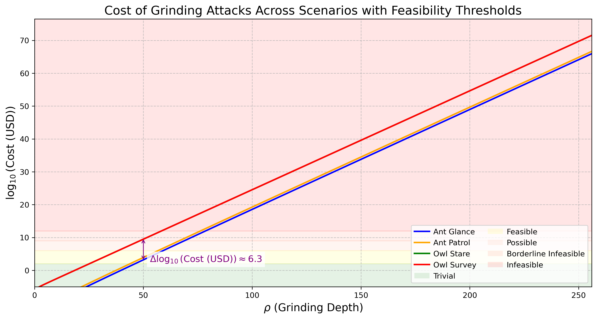
</div>

✏️ **Note**: The code to generate this graph is available at ➡️ [this link](./graph/scenario_cost-graph.py).

The cost difference between the most expensive scenario (Owl Survey) and the cheapest (Ant Glance) is significant, with a consistent $\Delta \log_{10}(\text{Cost (USD)}) \sim 6.3$, meaning Owl Survey costs approximately $10^{6.3}$ times more than Ant Glance, reflecting the substantial impact of $T_{\text{eval}}$ and $w_T$ on resource demands. The table below shows the $\rho$ values where each scenario transitions across feasibility categories:

| **Feasibility Category**                  | **🔵 Ant Glance** | **🟠 Ant Patrol** | **🟢 Owl Stare** | **🔴 Owl Survey** |
|--------------------------------------------|-------------------|-------------------|------------------|-------------------|
| **🟢 🌱 Trivial for Any Adversary**        | $[0, 49)$         | $[0, 47)$         | $[0, 27)$        | $[0, 27)$         |
| **🟡 💰 Feasible with Standard Resources** | $[49, 59)$        | $[47, 57)$        | $[27, 34)$       | $[27, 34)$        |
| **🟠 🏭 Possible with Large-Scale Infrastructure** | $[59, 73)$ | $[57, 71)$        | $[34, 48)$       | $[34, 48)$        |
| **🔴 🚫 Borderline Infeasible**            | $[73, 87)$        | $[71, 85)$       | $[48, 62)$       | $[48, 62)$        |
| **🔴 🚫 Infeasible**                      | $[87, 256)$    | $[85, 256)$    | $[62, 256)$   | $[62, 256)$    |


---

## Goals

<!-- A list of goals and non-goals a project is pursuing, ranked by importance. These goals should help understand the design space for the solution and what the underlying project is ultimately trying to achieve.

Goals may also contain requirements for the project. For example, they may include anything from a deadline to a budget (in terms of complexity or time) to security concerns.

Finally, goals may also serve as evaluation metrics to assess how good a proposed solution is. -->

    
The goal is to **mitigate or completely eliminate grinding attacks** on the protocol by introducing **targeted protocol enhancements** to address this issue. Two approaches are actively being explored to address the **Randomness Manipulation Problem**:  

- **Complete Elimination of Grinding Attacks** – Ongoing research aims to make the protocol fully resistant to such attacks. One notable example is *[Efficient Random Beacons with Adaptive Security for Ungrindable Blockchains](https://eprint.iacr.org/2021/1698.pdf).*  
- **Partial Mitigation by Increasing Attack Complexity** – While full protection may not yet be feasible, making such attacks **computationally and economically prohibitive** can significantly reduce their viability. This approach is the basis of the **Phalanx CIP** (Coming soon)].   

However, while **fully protecting the protocol from Randomness Manipulation attacks** may not yet be feasible, it is crucial to advance in the following areas:  

- **Risk Quantification** : Assessing the **profitability and feasibility of attacks**, along with **refining risk assessment models**, will provide deeper insights into vulnerabilities and their potential impact on the protocol's security and stability.  

- **Transparency on Manipulations** : **Enhancing detection mechanisms**, such as **self-mixing analysis** and **forking manipulation detection**, can help identify potential exploits and assess ongoing threats in real time.  

- **Game Theory & Economic Disincentives** –   
  **Promoting stake operator diversity** and **strengthening decentralization incentives** will reduce the economic viability of manipulation, fostering a more **resilient and distributed** stake pool ecosystem.  

We strongly encourage the community to actively engage in addressing this challenge by contributing research, proposing solutions, and participating in discussions. Collaborative efforts will be crucial in refining detection mechanisms, strengthening protocol resilience, and ensuring the long-term security and fairness of Ouroboros.

## Open Questions
<!-- A set of questions to which any proposed solution should find an answer. Questions should help guide solutions design by highlighting some foreseen vulnerabilities or design flaws. Solutions in the form of CIP should thereby include these questions as part of their 'Rationale' section and provide an argued answer to each. -->

<!-- OPTIONAL SECTIONS: see CIP-9999 > Specification > CPS > Structure table -->

- *How vulnerable is Cardano to randomness manipulation, and what are the potential consequences?*  
- *Is Cardano currently being manipulated?*  
- *Are we effectively discouraging randomness manipulation?*  
- *How does handling the worst-case scenario of a grinding attack impact the security parameter $K$ in the Ouroboros consensus protocol?*  
- *Who stands to benefit from a grinding attack?*  
- *What are the practical limits of a grinding attack given the current computational power available on the market?*  
- *Are these randomness manipulation strategies economically viable?*  


## References 
 
- [KRD017 - Ouroboros- A provably secure proof-of-stake blockchain protocol](https://eprint.iacr.org/2016/889.pdf)
- [DGKR18 -  Ouroboros Praos/ An adaptively-secure, semi-synchronous proof-of-stake blockchain](https://eprint.iacr.org/2017/573.pdf)
- [Practical Settlement Bounds For Longest Chain Consensus](https://eprint.iacr.org/2022/1571.pdf) 
- [The combinatorics of the longest-chain rule: Linear consistency for proof-of-stake blockchains](https://eprint.iacr.org/2017/241.pdf)
- [Efficient Random Beacons with Adaptive Securityfor Ungrindable Blockchains](https://eprint.iacr.org/2021/1698.pdf)
- [Forking the RANDAO: Manipulating Ethereum's Distributed Randomness Beacon](https://eprint.iacr.org/2025/037)
- [Security of Proof-of-Stake Blockchains](https://search.worldcat.org/title/1336590866)


## Copyright
<!-- The CIP must be explicitly licensed under acceptable copyright terms.  Uncomment the one you wish to use (delete the other one) and ensure it matches the License field in the header: -->

This CIP is licensed under [CC-BY-4.0](https://creativecommons.org/licenses/by/4.0/legalcode).
<!-- This CIP is licensed under [Apache-2.0](http://www.apache.org/licenses/LICENSE-2.0). -->
